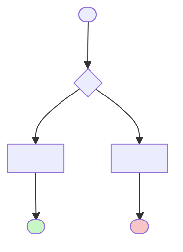

<!--
===================================================================
Claude 用モジュールカード (汎用テンプレート)
===================================================================

用途:
  - RTL モジュールの 1-pager。Claude がテストベンチ生成時に参照する一次情報源。
  - シミュレーションログから PASS/FAIL を自動更新できる構造を含む。

記入方針:
  - <XXX> のプレースホルダをすべて埋める
  - 該当しないセクション・行は削除可 (ただし ID 体系 (BR-ID, T-ID) は維持)
  - 内容が不明な項目は "TBD" と明記し空欄にしない

更新ルール:
  - BR-ID / T-ID は once 発行したら renumber しない (末尾追加のみ)
  - §9 の "Last Run" / "Status" 列は自動更新スクリプト (scripts/update_test_status.py)
    の対象。手動編集は新 T 追加時のみ

参考:
  - 埋めた実例: doc/_examples/module_card_ptw.md を参照
===================================================================
-->

# モジュール: `<module_name>`

> Claude 向け 1-pager。RTL 解析結果 + テスト網羅状況 + 既知の制約の統合ビュー。

---

## Quick Reference

| 項目 | 値 |
|---|---|
| **役割 (1 行)** | `<1 行要約>` |
| **RTL ファイル** | `rtl/<path>/<file>.sv` (~`<N>` 行) |
| **親モジュール** | `rtl/<parent>.sv:L<line>` |
| **TB ファイル** | `tb_coco/<path>/tb_<module>.py` |
| **TB ラッパ** | `tb/<module>_test_wrapper.sv` (未作成の場合は "なし") |
| **仕様書対応** | `doc/spec/<spec>/<chapter>.md` §`<section>` |
| **最終更新** | `<YYYY-MM-DD>` by `<author>` |

---

## 1. 概要

`<このモジュールの役割を 3-5 行で。仕様との対応、本プロジェクトでの意義を含む。>`

---

## 2. パラメータ

<!-- モジュールに無ければテーブルごと削除可 -->

| パラメータ | 型 | デフォルト | 役割 | 影響範囲 |
|---|---|---|---|---|
| `<PARAM_1>` | `<type>` | `<value>` | `<purpose>` | `<scope>` |

---

## 3. I/O ポート

### 3.1 Inputs

<!-- clk, rst 等の標準信号も含めて全部列挙 -->

| 信号 | bit 幅 | 役割 | 駆動元 | TB での操作 |
|---|---|---|---|---|
| `<signal>` | `<N>` | `<purpose>` | `<source>` | `<how tb drives/checks>` |

### 3.2 Outputs

| 信号 | bit 幅 | 役割 | 行き先 | TB での観測 |
|---|---|---|---|---|
| `<signal>` | `<N>` | `<purpose>` | `<destination>` | `<how tb observes>` |

### 3.3 双方向 / バス (AXI / パラメータ化型)

<!-- 該当するバスグループを並べる。無ければ削除 -->

| グループ | 方向 | 型 | 接続先 | プロトコル |
|---|---|---|---|---|
| `<name>_req_o` / `<name>_resp_i` | out/in | `<type>` | `<peer>` | `<protocol>` |

---

## 4. 内部状態

### 4.1 FSM

<!-- 純組合せ論理のみのモジュールは §4 全体を削除可 -->


### 4.2 状態遷移の契機と副作用

| 遷移 | 条件 | 副作用 (出力 / 内部レジスタ更新) |
|---|---|---|
| `<FROM> → <TO>` | `<condition>` | `<effects>` |

### 4.3 主要な内部レジスタ

| レジスタ | bit | 初期値 | 更新タイミング | 用途 |
|---|---|---|---|---|
| `<reg>_q` | `<N>` | `<value>` | `<when>` | `<purpose>` |

---

## 5. データフロー / 分岐図

<!--
入力 → 判定 → 出力までの全体フローを Mermaid flowchart で描く。
FSM だけでは見えない組合せ論理の条件分岐を含めて可視化する。
正常系 (緑)、エラー系 (赤)、バイパス (黄) で色分けすると読みやすい。
-->



---

## 6. 条件分岐一覧

<!--
モジュール内の全 if/else/case/三項演算子を BR-ID 付きで列挙。
§9 の T-ID と相互参照することで「どの分岐がどのテストでカバーされているか」
が可視化される。

BR-ID の採番ルール: モジュール内で 01 から連番。欠番可、renumber 不可。
-->

### 6.1 分岐マトリクス

| BR-ID | 所在 (file:line) | 条件式 | 真分岐の出力・副作用 | 偽分岐の出力・副作用 | 関連 T-ID |
|---|---|---|---|---|---|
| `<BR01>` | `<file:line>` | `<expr>` | `<effect_true>` | `<effect_false>` | `<T-IDs>` |

### 6.2 複雑な分岐の詳細

<!-- BR-ID 単位で、分岐が複雑なもの (3 パスあるもの / RTL の可読性が低いもの / 仕様対応が重要なもの) を個別に展開 -->

#### `<BR-ID>`: `<簡潔な分岐名>`

```systemverilog
// <file:line>
<code snippet>
```

- **出現条件**: `<when this branch is evaluated>`
- **各パス**:
    - `<path_1>`: `<effect>`
    - `<path_2>`: `<effect>`
- **仕様対応**: `<spec file>` §`<section>`
- **注意点**: `<caveat>`
- **テスト**: `<T-IDs>`

---

## 7. モジュール間連携

<!--
横の連携の全条件を網羅する。
§6 の BR-ID と相互参照し、条件が RTL のどこで評価されているかをリンクする。
-->

### 7.1 上流 (呼び出し元)

| 相手モジュール | 駆動される信号 | 戻す信号 | 発生条件 | BR-ID |
|---|---|---|---|---|
| `<upstream_module>` | `<signals_in>` | `<signals_out>` | `<when>` | `<BR-ID>` |

### 7.2 下流 (呼び出し先)

| 相手モジュール | 駆動する信号 | 受け取る信号 | 発生条件 | BR-ID |
|---|---|---|---|---|
| `<downstream_module>` | `<signals_out>` | `<signals_in>` | `<when>` | `<BR-ID>` |

### 7.3 横の連携 (並列モジュール)

| 相手モジュール | やり取り信号 | 発生条件 | 目的 | BR-ID |
|---|---|---|---|---|
| `<peer_module>` | `<signals>` | `<when>` | `<purpose>` | `<BR-ID>` |

---

## 8. タイミング / プロトコル注意点

### 8.1 ハンドシェイク

- `<signal_i の保持要件>`
- `<エッジトリガの有無>`
- `<AXI burst 長等のバス固有条件>`

### 8.2 リセット時の挙動

- `rst_ni=0`: `<どのレジスタが何にリセットされるか>`
- リセット解除後の最初の動作: `<behavior>`

### 8.3 マルチクロック / 非同期要素

- `<該当すれば記述。無ければ "単一クロック同期" と書く>`

---

## 9. テストマトリクス

<!--
このセクションの "Last Run" / "Status" 列は scripts/update_test_status.py で
cocotb ログから自動更新される。手動編集は新規 T-ID 追加時のみ。

Status 書式:
  ✅ PASS    : 期待通り動作
  ❌ FAIL    : 期待と異なる
  ⏸ SKIP    : 一時的にスキップ
  ⏱ PENDING : 未実施
  🚧 WIP     : 実装中
-->

### 9.1 正常動作

| T-ID | 項目 | 入力 / トリガ | 期待出力 | TB 場所 | BR-ID | Last Run | Status |
|---|---|---|---|---|---|---|---|
| `<T01>` | `<scenario>` | `<inputs>` | `<expected>` | `<test_file::func>` | `<BR-IDs>` | - | ⏱ PENDING |

### 9.2 エッジケース

| T-ID | 項目 | 入力 / トリガ | 期待出力 | TB 場所 | BR-ID | Last Run | Status |
|---|---|---|---|---|---|---|---|
| `<T10>` | `<scenario>` | `<inputs>` | `<expected>` | `<test_file::func>` | `<BR-IDs>` | - | ⏱ PENDING |

### 9.3 フォルト系

| T-ID | 項目 | 入力 / トリガ | 期待出力 | TB 場所 | BR-ID | Last Run | Status |
|---|---|---|---|---|---|---|---|
| `<T20>` | `<fault scenario>` | `<inputs>` | `<expected fault>` | `<test_file::func>` | `<BR-IDs>` | - | ⏱ PENDING |

### 9.4 カバレッジサマリ

<!-- 自動更新対象。手動で編集しないこと。 -->

| カテゴリ | 計 | PASS | FAIL | SKIP | PENDING |
|---|---|---|---|---|---|
| 正常動作 | 0 | 0 | 0 | 0 | 0 |
| エッジケース | 0 | 0 | 0 | 0 | 0 |
| フォルト系 | 0 | 0 | 0 | 0 | 0 |
| **合計** | **0** | **0** | **0** | **0** | **0** |

---

## 10. テスト実装ノート

### 10.1 TB 構築上の注意

- `<既存 TB インフラの再利用ポイント (MockMem, PteFactory 等)>`
- `<パッケージ import 必須項目>`
- `<req 信号の保持要件など RTL 固有の制約>`

### 10.2 Force 方式の適用

<!-- 該当しないなら "未使用" と書くか、本節を削除 -->

- 対象信号: `<force される内部信号一覧>`
- 駆動元: `<テストラッパの force_xxx_i>`
- 補足: `<階層パス / 注意点>`

### 10.3 観測しづらい信号

| 信号 | 観測方法 |
|---|---|
| `<内部信号>` | `<hierarchical ref / 波形 / ログ>` |

---

## 11. ログパース用ヒント

<!--
scripts/update_test_status.py がこのセクションを読んで T-ID と
テスト関数名を突き合わせ、ログから PASS/FAIL を抽出する。
-->

### 11.1 cocotb ログの PASS/FAIL マーカ書式

```
<log pattern for pass>
<log pattern for fail>
```

### 11.2 T-ID とテスト関数名のマッピング

| T-ID | 関数名 (ログ内で grep する) |
|---|---|
| `<T01>` | `<test_function_name>` |

### 11.3 自動更新スクリプト呼び出し例

```bash
python3 scripts/update_test_status.py \
    doc/modules/<module>.md \
    tb_coco/<path>/sim.log
```

---

## 12. 既知の挙動 / TODO / 要検証項目

### 12.1 実装の既知の制約

- [ ] `<制約 1>`
- [ ] `<制約 2>`

### 12.2 仕様との差異 / 要検証項目

- [ ] `<要検証項目>`

### 12.3 TODO

- [ ] `<未実装のテスト / 機能>`

---

## 13. 関連仕様

<!--
CLAUDE.md の Specification Navigation と整合する実ファイル名で書く。
-->

| トピック | 参照ファイル |
|---|---|
| `<topic>` | `doc/spec/<spec>/<file>.md` §`<section>` |

---

## 14. 変更履歴

| 日付 | 変更者 | 内容 |
|---|---|---|
| `<YYYY-MM-DD>` | `<author>` | 初版作成 |