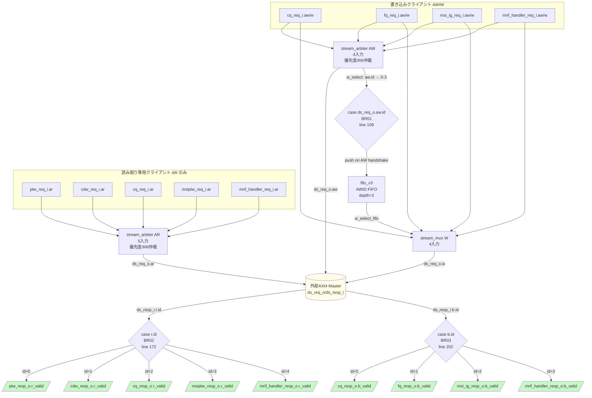

# モジュール: `rv_iommu_ds_if`

> Claude 向け 1-pager。RTL 解析結果 + テスト網羅状況 + 既知の制約の統合ビュー。

---

## Quick Reference

| 項目 | 値 |
|---|---|
| **役割 (1 行)** | 7 クライアント (PTW/CDW/MSIPTW/MRIF/CQ/FQ/MSI-IG) から単一 AXI4 Master バスへの仲裁・経路制御 |
| **RTL ファイル** | `rtl/ext_interfaces/rv_iommu_ds_if.sv` (~261 行) |
| **親モジュール** | `rtl/riscv_iommu.sv:430` (`i_rv_iommu_ds_if`) |
| **TB ファイル** | なし (未作成) |
| **TB ラッパ** | なし |
| **仕様書対応** | `doc/spec/IHI0022L_amba_axi_protocol_spec/02-chapter-a2-axi-transport.md` §A2.3 |
| **最終更新** | 2026-04-27 by Claude |

---

## 1. 概要

`rv_iommu_ds_if` は RISC-V IOMMU の **データ構造アクセス用 AXI4 Master インターフェース集線装置**である。
IOMMU 内部の 7 つのクライアント (PTW / CDW / MSIPTW / MRIF Handler / CQ / FQ / MSI IG) が
ページテーブルやキューなどのメモリデータ構造へアクセスする際の **AXI チャンネルを 1 本の外部 AXI4 Master バス (`ds_req_o` / `ds_resp_i`) に集約** する。

変換チェーンはシンプルな構造体ラッパーの連鎖:
- **AR チャンネル**: 5 入力 `stream_arbiter` (PTW / CDW / CQ / MSIPTW / MRIF Handler)
- **AW チャンネル**: 4 入力 `stream_arbiter` (CQ / FQ / MSI IG / MRIF Handler)
- **W チャンネル**: 4 入力 `stream_mux` + AWID FIFO でソース選択
- **R チャンネル**: 5 出力 `stream_demux` (RID で経路決定)
- **B チャンネル**: 4 出力 `stream_demux` (BID で経路決定)

**読み取り専用クライアント** (PTW / CDW / MSIPTW): AW/W/B レスポンスはゼロ / SLVERR にハードコード。
**書き込み専用クライアント** (FQ / MSI IG): AR/R レスポンスはゼロ / SLVERR にハードコード。
**読み書き両用クライアント**: CQ と MRIF Handler。

本モジュール自体の条件分岐は 3 本 (W/R/B の ID ケース分岐) のみで、主要ロジックはサブインスタンスに委譲される。

---

## 2. パラメータ

| パラメータ | 型 | デフォルト | 役割 | 影響範囲 |
|---|---|---|---|---|
| `aw_chan_t` | `type` | `logic` | AXI AW チャンネル struct 型 | `stream_arbiter` AW の `DATA_T`、`stream_mux` W の参照 |
| `w_chan_t` | `type` | `logic` | AXI W チャンネル struct 型 | `stream_mux` W の `DATA_T` |
| `b_chan_t` | `type` | `logic` | AXI B チャンネル struct 型 | B チャンネル assign のみ |
| `ar_chan_t` | `type` | `logic` | AXI AR チャンネル struct 型 | `stream_arbiter` AR の `DATA_T` |
| `r_chan_t` | `type` | `logic` | AXI R チャンネル struct 型 | R チャンネル assign のみ |
| `axi_req_t` | `type` | `logic` | AXI4 full リクエスト struct 型 | 全クライアント入出力ポート |
| `axi_rsp_t` | `type` | `logic` | AXI4 full レスポンス struct 型 | 全クライアント入出力ポート |

---

## 3. I/O ポート

### 3.1 Inputs

| 信号 | bit 幅 | 役割 | 駆動元 | TB での操作 |
|---|---|---|---|---|
| `clk_i` | 1 | 立ち上がりエッジクロック | システムクロック | `cocotb.Clock` |
| `rst_ni` | 1 | 非同期アクティブ Low リセット | システムリセット | 起動時 Low→High |
| `ds_resp_i` | `axi_rsp_t` | 外部 AXI4 スレーブからのレスポンス | DRAM/interconnect スレーブ | AXI4 スレーブを模擬 |
| `ptw_req_i` | `axi_req_t` | PTW からの AR リクエスト | `rv_iommu_tw_sv39x4_pc` → PTW | AR チャンネルのみ有効 |
| `cdw_req_i` | `axi_req_t` | CDW からの AR リクエスト | `rv_iommu_tw_sv39x4_pc` → CDW | AR チャンネルのみ有効 |
| `msiptw_req_i` | `axi_req_t` | MSI PTW からの AR リクエスト | `rv_iommu_tw_sv39x4_pc` → MSIPTW | AR チャンネルのみ有効 |
| `mrif_handler_req_i` | `axi_req_t` | MRIF Handler からのリクエスト (AR+AW+W) | `rv_iommu_translation_wrapper` 経由 | 全チャンネル有効 |
| `cq_req_i` | `axi_req_t` | CQ ハンドラからのリクエスト (AR+AW+W) | `rv_iommu_sw_if_wrapper` → CQ | 全チャンネル有効 |
| `fq_req_i` | `axi_req_t` | FQ ハンドラからの AW+W リクエスト | `rv_iommu_sw_if_wrapper` → FQ | AW/W チャンネルのみ有効 |
| `msi_ig_req_i` | `axi_req_t` | MSI IG からの AW+W リクエスト | `rv_iommu_sw_if_wrapper` → MSI IG | AW/W チャンネルのみ有効 |

### 3.2 Outputs

| 信号 | bit 幅 | 役割 | 行き先 | TB での観測 |
|---|---|---|---|---|
| `ds_req_o` | `axi_req_t` | 外部 AXI4 Master リクエスト | DRAM/interconnect スレーブ | 全 AXI4 チャンネル確認 |
| `ptw_resp_o` | `axi_rsp_t` | PTW へのレスポンス (R チャンネルのみ有効) | PTW | R チャンネル確認; AW/W/B は 0/SLVERR |
| `cdw_resp_o` | `axi_rsp_t` | CDW へのレスポンス (R チャンネルのみ有効) | CDW | R チャンネル確認; AW/W/B は 0/SLVERR |
| `msiptw_resp_o` | `axi_rsp_t` | MSIPTW へのレスポンス (R チャンネルのみ有効) | MSIPTW | R チャンネル確認; AW/W/B は 0/SLVERR |
| `mrif_handler_resp_o` | `axi_rsp_t` | MRIF Handler へのレスポンス (全チャンネル) | MRIF Handler | 全チャンネル確認 |
| `cq_resp_o` | `axi_rsp_t` | CQ ハンドラへのレスポンス (全チャンネル) | CQ Handler | 全チャンネル確認 |
| `fq_resp_o` | `axi_rsp_t` | FQ ハンドラへのレスポンス (AW/W/B のみ有効) | FQ Handler | B チャンネル確認; AR/R は 0/SLVERR |
| `msi_ig_resp_o` | `axi_rsp_t` | MSI IG へのレスポンス (AW/W/B のみ有効) | MSI IG | B チャンネル確認; AR/R は 0/SLVERR |

### 3.3 双方向 / バス (AXI / パラメータ化型)

| グループ | 方向 | 型 | 接続先 | プロトコル |
|---|---|---|---|---|
| `ds_req_o` / `ds_resp_i` | out/in | `axi_req_t` / `axi_rsp_t` | `riscv_iommu.sv:444-445` → 外部メモリ | AXI4 Master (全 5 チャンネル) |
| `ptw_req_i` / `ptw_resp_o` | in/out | `axi_req_t` / `axi_rsp_t` | PTW (読み取り専用) | AXI4 (AR/R のみ有効) |
| `cdw_req_i` / `cdw_resp_o` | in/out | `axi_req_t` / `axi_rsp_t` | CDW (読み取り専用) | AXI4 (AR/R のみ有効) |
| `cq_req_i` / `cq_resp_o` | in/out | `axi_req_t` / `axi_rsp_t` | CQ Handler (読み書き) | AXI4 (全 5 チャンネル) |
| `fq_req_i` / `fq_resp_o` | in/out | `axi_req_t` / `axi_rsp_t` | FQ Handler (書き込み専用) | AXI4 (AW/W/B のみ有効) |
| `mrif_handler_req_i` / `mrif_handler_resp_o` | in/out | `axi_req_t` / `axi_rsp_t` | MRIF Handler (読み書き) | AXI4 (全 5 チャンネル) |
| `msiptw_req_i` / `msiptw_resp_o` | in/out | `axi_req_t` / `axi_rsp_t` | MSIPTW (読み取り専用) | AXI4 (AR/R のみ有効) |
| `msi_ig_req_i` / `msi_ig_resp_o` | in/out | `axi_req_t` / `axi_rsp_t` | MSI IG (書き込み専用) | AXI4 (AW/W/B のみ有効) |

---

## 4. 内部状態

本モジュール自身に FSM はない。唯一の状態要素は W チャンネル AWID 追跡 FIFO である。

### 4.1 サブインスタンス構成

| インスタンス | 種別 | N_INP/N_OUP | 役割 |
|---|---|---|---|
| `i_stream_arbiter_ar` | `stream_arbiter` | 5 入力 | AR 仲裁: PTW/CDW/CQ/MSIPTW/MRIF → `ds_req_o.ar` |
| `i_stream_arbiter_aw` | `stream_arbiter` | 4 入力 | AW 仲裁: CQ/FQ/MSI-IG/MRIF → `ds_req_o.aw` |
| `i_fifo_w_channel` | `fifo_v3` | depth=2, width=2 | AW ハンドシェイク時に `w_select` (2bit) をキュー |
| `i_stream_mux_w` | `stream_mux` | 4 入力 | W データ選択: `w_select_fifo` で CQ/FQ/MSI-IG/MRIF を切替 |
| `i_stream_demux_r` | `stream_demux` | 5 出力 | R デマルチプレクス: `r.id` で PTW/CDW/CQ/MSIPTW/MRIF へルーティング |
| `i_stream_demux_b` | `stream_demux` | 4 出力 | B デマルチプレクス: `b.id` で CQ/FQ/MSI-IG/MRIF へルーティング |

### 4.2 AXI ID 割り当て表

**AR 仲裁** (`stream_arbiter` が入力ポートインデックスを ID として割り当て):

| ID | クライアント | チャンネル |
|---|---|---|
| 0 | PTW | AR/R |
| 1 | CDW | AR/R |
| 2 | CQ | AR/R |
| 3 | MSIPTW | AR/R |
| 4 | MRIF Handler | AR/R |

**AW 仲裁** (`stream_arbiter` が入力ポートインデックスを ID として割り当て):

| ID | クライアント | チャンネル |
|---|---|---|
| 0 | CQ | AW/W/B |
| 1 | FQ | AW/W/B |
| 2 | MSI IG | AW/W/B |
| 3 | MRIF Handler | AW/W/B |

### 4.3 主要な内部レジスタ

| レジスタ | bit 幅 | 初期値 | 更新タイミング | 用途 |
|---|---|---|---|---|
| `fifo_v3` 内部 (w_select FIFO) | 2 × depth=2 | 空 | AW ハンドシェイク時に push、W last ビートで pop | 進行中 AW の W チャンネルソース選択値を保存 |

---

## 5. データフロー / 分岐図



---

## 6. 条件分岐一覧

### 6.1 分岐マトリクス

| BR-ID | 所在 (file:line) | 条件式 | 真分岐の出力・副作用 | 偽分岐の出力・副作用 | 関連 T-ID |
|---|---|---|---|---|---|
| `BR01` | `rv_iommu_ds_if.sv:109` | `unique case (ds_req_o.aw.id)` | `w_select` = 0〜3 (CQ/FQ/MSI-IG/MRIF Handler) | `default: w_select=0` (CQ) | — |
| `BR02` | `rv_iommu_ds_if.sv:172` | `unique case (ds_resp_i.r.id)` | `r_select` = 0〜4 (PTW/CDW/CQ/MSIPTW/MRIF) | `default: r_select=0` (PTW) | — |
| `BR03` | `rv_iommu_ds_if.sv:202` | `unique case (ds_resp_i.b.id)` | `b_select` = 0〜3 (CQ/FQ/MSI-IG/MRIF) | `default: b_select=0` (CQ) | — |

### 6.2 複雑な分岐の詳細

#### `BR01`: W チャンネル選択 (AWID → w_select)

```systemverilog
// rv_iommu_ds_if.sv:107-116
always_comb begin
    w_select = '0;
    unique case (ds_req_o.aw.id)   // Selected AWID
        0:          w_select = 2'd0; // CQ
        1:          w_select = 2'd1; // FQ
        2:          w_select = 2'd2; // MSI IG
        3:          w_select = 2'd3; // MRIF Handler
        default:    w_select = 2'd0; // CQ
    endcase
end
```

- **出現条件**: AW アービタが AW トランザクションを受け付けた後、`ds_req_o.aw.id` が更新されるたびに組み合わせ評価
- **各パス**: ID 0→CQ、1→FQ、2→MSI IG、3→MRIF Handler、default→CQ
- `w_select` は FIFO (`i_fifo_w_channel`) に push され、`w_select_fifo` として W チャンネル `stream_mux` の選択信号になる
- **仕様対応**: AXI4 §A5 (Transaction ordering / ID management)
- **注意**: AWID は AW `stream_arbiter` が自動付与する (入力ポートインデックスを ID 値に利用)。このため CQ=0, FQ=1 の対応は固定。

#### `BR02`: R チャンネルデマルチプレクス (RID → r_select)

```systemverilog
// rv_iommu_ds_if.sv:170-180
always_comb begin
    r_select = 0;
    unique case (ds_resp_i.r.id)
        0: r_select = 0;   // PTW
        1: r_select = 1;   // CDW
        2: r_select = 2;   // CQ
        3: r_select = 3;   // MSIPTW
        4: r_select = 4;   // MRIF Handler
        default: r_select = 0;
    endcase
end
```

- R チャンネルの `.r` フィールド (data, resp, last 等) は全クライアントにブロードキャスト (`rv_iommu_ds_if.sv:161-165`)
- `r_valid` のみ `stream_demux` で排他的にルーティング
- **注意**: `.r` はブロードキャストのため、R 応答を受け取る側は `r_valid` のアサートを確認してからデータを読むこと

#### `BR03`: B チャンネルデマルチプレクス (BID → b_select)

```systemverilog
// rv_iommu_ds_if.sv:200-209
always_comb begin
    b_select = 0;
    unique case (ds_resp_i.b.id)
        0: b_select = 0;   // CQ
        1: b_select = 1;   // FQ
        2: b_select = 2;   // MSI IG
        3: b_select = 3;   // MRIF Handler
        default: b_select = 0; // CQ
    endcase
end
```

- B チャンネルの `.b` フィールド (resp, id 等) も全書き込みクライアントにブロードキャスト (`rv_iommu_ds_if.sv:195-198`)
- `b_valid` のみ `stream_demux` で排他的にルーティング

---

## 7. モジュール間連携

### 7.1 上流 (呼び出し元)

| 相手モジュール | 駆動される信号 | 戻す信号 | 発生条件 | BR-ID |
|---|---|---|---|---|
| `riscv_iommu.sv:438` | 全クライアント `*_req_i` + `ds_resp_i` | 全クライアント `*_resp_o` + `ds_req_o` | クライアントが AXI4 トランザクションを発行する際 | BR01-BR03 |

### 7.2 下流 (呼び出し先) — AXI クライアント

| クライアント | 使用チャンネル | 対応 AXI ID | ポート |
|---|---|---|---|
| PTW | AR / R | AR: 0 | `ptw_req_i` / `ptw_resp_o` |
| CDW | AR / R | AR: 1 | `cdw_req_i` / `cdw_resp_o` |
| CQ Handler | AR / R / AW / W / B | AR: 2, AW: 0 | `cq_req_i` / `cq_resp_o` |
| MSIPTW | AR / R | AR: 3 | `msiptw_req_i` / `msiptw_resp_o` |
| MRIF Handler | AR / R / AW / W / B | AR: 4, AW: 3 | `mrif_handler_req_i` / `mrif_handler_resp_o` |
| FQ Handler | AW / W / B | AW: 1 | `fq_req_i` / `fq_resp_o` |
| MSI IG | AW / W / B | AW: 2 | `msi_ig_req_i` / `msi_ig_resp_o` |

### 7.3 横の連携 (並列モジュール)

本モジュールは外部メモリバスとすべての内部クライアントの間に位置するハブであり、横連携はない。

---

## 8. タイミング / プロトコル注意点

### 8.1 W チャンネル AWID FIFO

- FIFO に `w_select` を push するタイミング: `ds_req_o.aw_valid & ds_resp_i.aw_ready` (AW ハンドシェイク完了サイクル) — `rv_iommu_ds_if.sv:134`
- FIFO から pop するタイミング: `ds_req_o.w_valid & ds_resp_i.w_ready & ds_req_o.w.last` (W 最終ビートハンドシェイク) — `rv_iommu_ds_if.sv:136`
- FIFO depth=2: **最大 2 件の書き込みトランザクションを同時に保留できる**。3 件目以降は `full_o` が High になるが、`full_o` の接続先がない (`rv_iommu_ds_if.sv:130`)。
- **要検証**: FIFO が満杯の状態で AW ハンドシェイクが発生した場合の動作。

### 8.2 R チャンネルのブロードキャスト

- R チャンネルの `.r` 構造体 (data / resp / last / id / user) は全 5 クライアントにブロードキャスト (`rv_iommu_ds_if.sv:161-165`)。
- 各クライアントは自分の `r_valid` がアサートされているときだけ `.r` データを有効とみなすこと。
- **結果**: 複数クライアントが同時に `.r` データを読むことはないが、タイミング的に `.r` の保持要件に注意する必要がある。

### 8.3 B チャンネルのブロードキャスト

- B チャンネルの `.b` 構造体 (resp / id / user) も全 4 書き込みクライアントにブロードキャスト (`rv_iommu_ds_if.sv:195-198`)。
- 同上、`b_valid` が High のクライアントのみが有効なレスポンスとみなすこと。

### 8.4 ハードコードされた無効レスポンス

- 読み取り専用クライアント (PTW / CDW / MSIPTW) の AW_READY / W_READY / B_VALID はゼロ、B.RESP は `RESP_SLVERR` に固定 (`rv_iommu_ds_if.sv:223-243`)。これらのクライアントが誤って AW/W リクエストを発行しても接続先がない。
- 書き込み専用クライアント (FQ / MSI IG) の AR_READY / R_VALID はゼロ、R.RESP は `RESP_SLVERR` に固定 (`rv_iommu_ds_if.sv:245-259`)。

### 8.5 リセット時の挙動

- `rst_ni=0`: `fifo_v3` 内部 FIFO がクリア (empty)。`stream_arbiter` 内部アービトレーションステートがリセット。
- `stream_arbiter` の仲裁アルゴリズム (RR/Priority) の詳細はサブインスタンス実装依存。

### 8.6 マルチクロック / 非同期要素

- 単一クロック同期 (`clk_i`)。非同期リセット (`rst_ni`)。

---

## 9. テストマトリクス

### 9.1 正常動作

| T-ID | 項目 | 入力 / トリガ | 期待出力 | TB 場所 | BR-ID | Last Run | Status |
|---|---|---|---|---|---|---|---|
| | | | | | | | |

### 9.2 エッジケース

| T-ID | 項目 | 入力 / トリガ | 期待出力 | TB 場所 | BR-ID | Last Run | Status |
|---|---|---|---|---|---|---|---|
| | | | | | | | |

### 9.3 フォルト系

| T-ID | 項目 | 入力 / トリガ | 期待出力 | TB 場所 | BR-ID | Last Run | Status |
|---|---|---|---|---|---|---|---|
| | | | | | | | |

### 9.4 カバレッジサマリ

| カテゴリ | 計 | PASS | FAIL | SKIP | PENDING |
|---|---|---|---|---|---|
| 正常動作 | 0 | 0 | 0 | 0 | 0 |
| エッジケース | 0 | 0 | 0 | 0 | 0 |
| フォルト系 | 0 | 0 | 0 | 0 | 0 |
| **合計** | **0** | **0** | **0** | **0** | **0** |

---

## 10. テスト実装ノート

### 10.1 TB 構築上の注意

- `cocotbext-axi` の `AxiMaster` (各クライアントを模擬) と `AxiRam` (外部スレーブを模擬) を使うことで TB を構築できる。
- 各クライアントの AXI ID は `stream_arbiter` が自動付与する値に依存する。TB でクライアントを模擬する際は、発行した ARID / AWID と返ってくる RID / BID の対応を確認すること。
- FIFO depth=2 を超えるバックツーバックの書き込みトランザクションは未検証エッジケース。`full_o` が接続されていないため FIFO オーバーフロー時の挙動を確認する必要がある。

### 10.2 Force 方式の適用

未使用 (純構造モジュールのため force 不要)。

### 10.3 観測しづらい信号

| 信号 | 観測方法 |
|---|---|
| `w_select` / `w_select_fifo` | 波形ダンプまたは `dut.w_select` / `dut.w_select_fifo` 階層参照 |
| `r_select` / `b_select` | 波形確認 (組み合わせ信号) |
| FIFO 内容 | `dut.i_fifo_w_channel` 内の `data` 等を階層参照 |

---

## 11. ログパース用ヒント

### 11.1 cocotb ログの PASS/FAIL マーカ書式

```
(TBD — TB 未作成)
```

### 11.2 T-ID とテスト関数名のマッピング

| T-ID | 関数名 |
|---|---|
| (TBD) | (TBD) |

### 11.3 自動更新スクリプト呼び出し例

```bash
python3 scripts/update_test_status.py \
    doc/modules/ext_interfaces/rv_iommu_ds_if.md \
    tb_coco/test/ext_interfaces/ds_if/sim.log
```

---

## 12. 既知の挙動 / TODO / 要検証項目

### 12.1 実装の既知の制約

- [ ] **W チャンネル FIFO `full_o` 未接続** (`rv_iommu_ds_if.sv:130`): FIFO が満杯 (2 件の AW がペンディング中) の状態で AW ハンドシェイクが発生した場合の動作が未定義。`stream_arbiter` は `aw_ready` を下げるか、push を無視するかの挙動を確認する必要がある。
- [ ] **R / B チャンネルのブロードキャスト**: `.r` / `.b` 構造体は全クライアントへブロードキャストされる。同サイクルに複数クライアントが異なる `r_valid` / `b_valid` を受け取る場合、バス幅の浪費は問題ないが、クライアント側のラッチタイミングに注意が必要。
- [ ] **コメント矛盾**: FIFO コメント (`rv_iommu_ds_if.sv:120`) に "max 3 outstanding transactions" とあるが FIFO depth は 2 (`rv_iommu_ds_if.sv:123`)。実際の最大同時 AW 数は 2。

### 12.2 仕様との差異 / 要検証項目

- [ ] **AXI ID 枯渇**: AR アービタは 5 クライアントに ID 0-4 を割り当てる。外部メモリが対応する AXI ID 幅が 3bit (ID 0-7) 以上でないと動作しない。`riscv_iommu.sv` の `ID_WIDTH` パラメータが >= 3 であることを確認すること。
- [ ] **`stream_arbiter` 仲裁方式**: ラウンドロビンか固定優先度かが RTL 上不明 (サブインスタンス実装依存)。PTW / CDW の AR レイテンシが他クライアントに依存する可能性がある。

### 12.3 TODO

- [ ] TB 新規作成 (`tb_coco/test/ext_interfaces/ds_if/`)
- [ ] W チャンネル FIFO オーバーフロー時の挙動確認テスト (BR01 + FIFO 満杯状態)
- [ ] R / B チャンネルの ID ミスルーティング時 (default パス) の動作確認 (BR02 / BR03)
- [ ] 全 7 クライアントの同時 AR / AW 競合テスト (仲裁優先度確認)

---

## 13. 関連仕様

| トピック | 参照ファイル |
|---|---|
| AXI4 Valid-READY ハンドシェイク | `doc/spec/IHI0022L_amba_axi_protocol_spec/02-chapter-a2-axi-transport.md` §A2.3 |
| AXI4 Transaction ID / 順序保証 | `doc/spec/IHI0022L_amba_axi_protocol_spec/05-chapter-a5.md` |
| AXI4 全信号リファレンス (AR/R/AW/W/B) | `doc/spec/IHI0022L_amba_axi_protocol_spec/16-chapter-b1-signal-list.md` |

---

## 14. 変更履歴

| 日付 | 変更者 | 内容 |
|---|---|---|
| 2026-04-27 | Claude | 初版作成 (`rv_iommu_ds_if.sv` 261 行を全解析、BR01-BR03 を抽出) |
