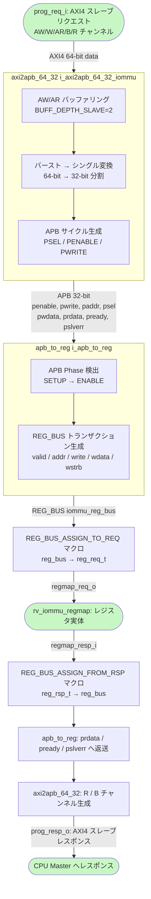

# モジュール: `rv_iommu_prog_if`

> Claude 向け 1-pager。RTL 解析結果 + テスト網羅状況 + 既知の制約の統合ビュー。

---

## Quick Reference

| 項目 | 値 |
|---|---|
| **役割 (1 行)** | AXI4 スレーブ → APB → REG_BUS 変換ブリッジ (IOMMU レジスタプログラミング I/F) |
| **RTL ファイル** | `rtl/ext_interfaces/rv_iommu_prog_if.sv` (~163 行) |
| **親モジュール** | `rtl/riscv_iommu.sv:407` (`i_rv_iommu_prog_if`) |
| **TB ファイル** | なし (未作成) |
| **TB ラッパ** | なし |
| **仕様書対応** | `doc/spec/riscv-iommu/09-chapter-6.-memory-mapped-register-interface.md` §6 |
| **最終更新** | 2026-04-27 by Claude |

---

## 1. 概要

`rv_iommu_prog_if` は RISC-V IOMMU の **レジスタプログラミングインターフェース** ラッパーである。
CPU 側からの AXI4 スレーブアクセス (`prog_req_i` / `prog_resp_o`) を受け付け、
内部で `axi2apb_64_32` → `apb_to_reg` の 2 段変換を行い、
最終的に汎用レジスタバス (`reg_req_t` / `reg_rsp_t`) 形式で `rv_iommu_regmap` へ渡す。

**変換チェーン**: AXI4 (64-bit) → APB (32-bit) → REG_BUS (32-bit) → reg_req_t / reg_rsp_t

本モジュール自体は純粋に **構造的ラッパー** であり、if/else/case などの条件分岐は一切含まない。
AXI4 データ幅は 64-bit だが、REG_BUS は 32-bit 固定 (`rv_iommu_prog_if.sv:59`) であるため、
レジスタアクセスは実質 32-bit アライン単位で処理される。

仕様上、IOMMU のメモリマップドレジスタは 4-KiB アライン領域に配置される
(`doc/spec/riscv-iommu/09-chapter-6.-memory-mapped-register-interface.md` §6)。

---

## 2. パラメータ

| パラメータ | 型 | デフォルト | 役割 | 影響範囲 |
|---|---|---|---|---|
| `ADDR_WIDTH` | `int` | `-1` (必須指定) | AXI アドレスバス幅 | `axi2apb_64_32`, `REG_BUS` の `ADDR_WIDTH` |
| `DATA_WIDTH` | `int` | `-1` (必須指定) | AXI データバス幅 (通常 64) | `axi2apb_64_32` の `AXI4_RDATA_WIDTH` / `AXI4_WDATA_WIDTH` |
| `ID_WIDTH` | `int` | `-1` (必須指定) | AXI ID バス幅 | `axi2apb_64_32` の `AXI4_ID_WIDTH` |
| `USER_WIDTH` | `int` | `1` | AXI USER 信号幅 | `axi2apb_64_32` の `AXI4_USER_WIDTH` |
| `axi_req_t` | `type` | `logic` | AXI4 リクエスト構造体型 | `prog_req_i` ポートの型 |
| `axi_rsp_t` | `type` | `logic` | AXI4 レスポンス構造体型 | `prog_resp_o` ポートの型 |
| `reg_req_t` | `type` | `logic` | REG_BUS リクエスト構造体型 | `regmap_req_o` ポートの型 |
| `reg_rsp_t` | `type` | `logic` | REG_BUS レスポンス構造体型 | `regmap_resp_i` ポートの型 |

> 注意: `DATA_WIDTH` パラメータは `axi2apb_64_32` の AXI4 側データ幅に使われるが、  
> 内部 REG_BUS のデータ幅は **32-bit ハードコード** (`rv_iommu_prog_if.sv:59`)。

---

## 3. I/O ポート

### 3.1 Inputs

| 信号 | bit 幅 | 役割 | 駆動元 | TB での操作 |
|---|---|---|---|---|
| `clk_i` | 1 | 立ち上がりエッジクロック | システムクロック | `cocotb.Clock` で生成 |
| `rst_ni` | 1 | 非同期アクティブ Low リセット | システムリセット | 起動時 Low → High |
| `prog_req_i` | `axi_req_t` | AXI4 スレーブリクエスト (CPU → IOMMU) | `riscv_iommu.sv` 経由で外部 Master | AXI4 トランザクション発行 |
| `regmap_resp_i` | `reg_rsp_t` | REG_BUS レスポンス (regmap → prog_if) | `rv_iommu_regmap` | regmap のレスポンスを模擬 |

### 3.2 Outputs

| 信号 | bit 幅 | 役割 | 行き先 | TB での観測 |
|---|---|---|---|---|
| `prog_resp_o` | `axi_rsp_t` | AXI4 スレーブレスポンス (IOMMU → CPU) | `riscv_iommu.sv` 経由で外部 Master | AXI4 応答チャンネル観測 |
| `regmap_req_o` | `reg_req_t` | REG_BUS リクエスト (prog_if → regmap) | `rv_iommu_regmap` | REG_BUS アクセス内容確認 |

### 3.3 双方向 / バス (AXI / パラメータ化型)

| グループ | 方向 | 型 | 接続先 | プロトコル |
|---|---|---|---|---|
| `prog_req_i` / `prog_resp_o` | in/out | `axi_req_t` / `axi_rsp_t` | `riscv_iommu.sv:416` (外部 CPU Master) | AXI4 スレーブ (VALID-READY) |
| `regmap_req_o` / `regmap_resp_i` | out/in | `reg_req_t` / `reg_rsp_t` | `rv_iommu_regmap` | REG_BUS (低レイテンシ同期バス) |

**内部 APB バス信号** (インスタンス間配線のみ、外部非公開):

| 信号 | bit 幅 | 役割 |
|---|---|---|
| `penable` | 1 | APB enable |
| `pwrite` | 1 | APB write 方向 |
| `paddr` | `ADDR_WIDTH` | APB アドレス |
| `psel` | 1 | APB slave select |
| `pwdata` | 32 | APB write data |
| `prdata` | 32 | APB read data |
| `pready` | 1 | APB slave ready |
| `pslverr` | 1 | APB slave error |

---

## 4. 内部状態

本モジュール自体には FSM・レジスタは存在しない。状態は 2 つのサブインスタンス内に保持される。

### 4.1 サブインスタンスの内部状態 (参考)

| インスタンス | 内部状態の概要 |
|---|---|
| `axi2apb_64_32 i_axi2apb_64_32_iommu` | AXI4 → APB 変換ステートマシン。AW/W/R/AR チャンネルのバッファリング (`BUFF_DEPTH_SLAVE=2`) を持つ |
| `apb_to_reg i_apb_to_reg` | APB → REG_BUS 変換。REG_BUS の VALID/READY に合わせたステートマシン |
| `REG_BUS iommu_reg_bus` | 内部バスインスタンス (clk_i 同期) |

### 4.2 主要な内部レジスタ

本モジュール内のレジスタはなし (すべてサブインスタンス内)。

---

## 5. データフロー / 分岐図



---

## 6. 条件分岐一覧

### 6.1 分岐マトリクス

**本モジュール (`rv_iommu_prog_if.sv`) 内には if/else/case/三項演算子が存在しない。**  
すべての処理はサブインスタンス (`axi2apb_64_32`, `apb_to_reg`) と  
マクロ展開 (`REG_BUS_ASSIGN_TO_REQ`, `REG_BUS_ASSIGN_FROM_RSP`) に委譲されている。

| BR-ID | 所在 | 条件式 | 真分岐 | 偽分岐 | 関連 T-ID |
|---|---|---|---|---|---|
| — | — | (なし: 純粋構造モジュール) | — | — | — |

### 6.2 サブインスタンスの主要条件分岐 (参考)

本モジュールの条件分岐テストは実質的にサブインスタンスの振る舞いを通じて行う:

| サブインスタンス | 主要条件 |
|---|---|
| `axi2apb_64_32` | AW vs AR 競合時の調停; バースト長 > 1 の処理; SLVERR 伝搬 |
| `apb_to_reg` | PREADY=0 の wait 状態; PSLVERR → reg error 変換 |

---

## 7. モジュール間連携

### 7.1 上流 (呼び出し元)

| 相手モジュール | 駆動される信号 | 戻す信号 | 発生条件 | BR-ID |
|---|---|---|---|---|
| `riscv_iommu` (`riscv_iommu.sv:416`) | `prog_req_i` (AXI4 スレーブリクエスト) | `prog_resp_o` (AXI4 レスポンス) | CPU がレジスタ R/W を実行する際 | — |

### 7.2 下流 (呼び出し先)

| 相手モジュール | 駆動する信号 | 受け取る信号 | 発生条件 | BR-ID |
|---|---|---|---|---|
| `rv_iommu_regmap` (レジスタマップ実体) | `regmap_req_o` (REG_BUS リクエスト) | `regmap_resp_i` (REG_BUS レスポンス) | `axi2apb_64_32` が APB サイクルを完了するたびに | — |

### 7.3 横の連携 (並列モジュール)

本モジュールと直接横連携するモジュールはなし。  
`rv_iommu_regmap` へのアクセスは `rv_iommu_prog_if` が唯一の経路。

---

## 8. タイミング / プロトコル注意点

### 8.1 ハンドシェイク

- AXI4 Valid-READY プロトコル (`doc/spec/IHI0022L_amba_axi_protocol_spec/02-chapter-a2-axi-transport.md` §A2.3): VALID と READY が両方 HIGH のサイクルでトランザクション確定。
- `BUFF_DEPTH_SLAVE=2` (`rv_iommu_prog_if.sv:78`): AXI2APB ブリッジが AW/AR を最大 2 件バッファリング可能。連続リクエストは 2 件まで即時受付、3 件目以降は READY=0 でバックプレッシャー。
- APB プロトコル: SETUP フェーズ (PSEL=1, PENABLE=0) → ENABLE フェーズ (PSEL=1, PENABLE=1) → PREADY 待ち の 2 サイクル最小レイテンシ。
- REG_BUS: `rv_iommu_regmap` が 1 サイクルで READY を返す場合、APB → AXI4 R/B チャンネルへの応答は数サイクル以内に完了する。

### 8.2 データ幅変換 (64-bit → 32-bit)

- AXI4 の `DATA_WIDTH` (通常 64) と REG_BUS/APB の 32-bit は不一致。
- `axi2apb_64_32` (`rv_iommu_prog_if.sv:72`) がダウンコンバートを担当。
- IOMMU レジスタは 64-bit 幅のものが多いが (`rv_iommu_reg_pkg.sv`)、CPU 側が 32-bit 単位で 2 回アクセスするか、ブリッジが分割するかは `axi2apb_64_32` の実装依存。
- **推測:** IOMMU レジスタへの 64-bit アトミックアクセスは保証されない可能性がある。2 回の 32-bit アクセスに分割される場合、中間状態が観測されうる。

### 8.3 リセット時の挙動

- `rst_ni=0` 期間中は `axi2apb_64_32` 内部の AXI チャンネルバッファがクリアされる。
- `ARESETn` 脱出後: AXI4 仕様により、VALID 信号は最初の立ち上がりエッジ以降まで Low 保持が必要 (`doc/spec/IHI0022L_amba_axi_protocol_spec/02-chapter-a2-axi-transport.md` §A2.1.2)。
- `test_en_i` は `1'b0` ハードコード (`rv_iommu_prog_if.sv:83`)。BIST モードは未使用。

### 8.4 マルチクロック / 非同期要素

- 単一クロック同期 (`clk_i`)。

### 8.5 `test_en_i` ハードコード

- `axi2apb_64_32` の `test_en_i` は常に `1'b0` (`rv_iommu_prog_if.sv:83`)。
- スキャンテスト / DFT パスは無効。

---

## 9. テストマトリクス

### 9.1 正常動作

| T-ID | 項目 | 入力 / トリガ | 期待出力 | TB 場所 | BR-ID | Last Run | Status |
|---|---|---|---|---|---|---|---|
| | | | | | | | |

### 9.2 エッジケース

| T-ID | 項目 | 入力 / トリガ | 期待出力 | TB 場所 | BR-ID | Last Run | Status |
|---|---|---|---|---|---|---|---|
| | | | | | | | |

### 9.3 フォルト系

| T-ID | 項目 | 入力 / トリガ | 期待出力 | TB 場所 | BR-ID | Last Run | Status |
|---|---|---|---|---|---|---|---|
| | | | | | | | |

### 9.4 カバレッジサマリ

| カテゴリ | 計 | PASS | FAIL | SKIP | PENDING |
|---|---|---|---|---|---|
| 正常動作 | 0 | 0 | 0 | 0 | 0 |
| エッジケース | 0 | 0 | 0 | 0 | 0 |
| フォルト系 | 0 | 0 | 0 | 0 | 0 |
| **合計** | **0** | **0** | **0** | **0** | **0** |

---

## 10. テスト実装ノート

### 10.1 TB 構築上の注意

- `cocotbext-axi` の `AxiMaster` / `AxiSlaveRam` を利用して AXI4 スレーブをドライブ可能。
- テスト対象が純粋な変換ブリッジのため、`regmap_resp_i` を模擬する単純な REG_BUS スタブを用意する。
- IOMMU レジスタの R/W テストは `rv_iommu_regmap` 込みの統合テストが効果的。
- `axi2apb_64_32` のバッファ深度 (`BUFF_DEPTH_SLAVE=2`) を超えるバックツーバックリクエストをテストする際は、AWREADY/ARREADY のバックプレッシャーを確認すること。

### 10.2 Force 方式の適用

未使用 (純構造モジュールのため force 不要)。

### 10.3 観測しづらい信号

| 信号 | 観測方法 |
|---|---|
| APB 内部信号 (`penable`, `pwrite`, `paddr` 等) | 波形 (dump.vcd) で確認。cocotb から `dut.penable` で階層参照可能 |
| `iommu_reg_bus` (REG_BUS インターフェース) | SystemVerilog interface のため波形ダンプでポート単位に観測 |

---

## 11. ログパース用ヒント

### 11.1 cocotb ログの PASS/FAIL マーカ書式

```
(TBD — TB 未作成)
```

### 11.2 T-ID とテスト関数名のマッピング

| T-ID | 関数名 |
|---|---|
| (TBD) | (TBD) |

### 11.3 自動更新スクリプト呼び出し例

```bash
python3 scripts/update_test_status.py \
    doc/modules/rv_iommu_prog_if.md \
    tb_coco/test/ext_interfaces/prog_if/sim.log
```

---

## 12. 既知の挙動 / TODO / 要検証項目

### 12.1 実装の既知の制約

- [ ] **64-bit → 32-bit 幅変換**: REG_BUS の `DATA_WIDTH` が `32` ハードコード (`rv_iommu_prog_if.sv:59`)。IOMMU レジスタに 64-bit アトミックアクセスを必要とするものが存在する場合、2 回の 32-bit アクセスに分割されるため、中間状態が見える可能性がある。
- [ ] **`test_en_i = 1'b0` ハードコード** (`rv_iommu_prog_if.sv:83`): DFT/スキャンテスト非対応。
- [ ] **`BUFF_DEPTH_SLAVE = 2` ハードコード** (`rv_iommu_prog_if.sv:78`): AXI バッファ深度はパラメータ化されていない。高トラフィック時にバックプレッシャーが発生する可能性がある。

### 12.2 仕様との差異 / 要検証項目

- [ ] **推測:** `axi2apb_64_32` が 64-bit AXI データを 32-bit APB へどのように分割するかが未検証。特に big-endian / little-endian 配置と WSTRB の扱いを確認すべき。
- [ ] IOMMU 仕様 §6 では 4-KiB アライン配置を要求するが、`ADDR_WIDTH` パラメータが指すアドレス空間のオフセット計算がホスト側に委ねられている点は要確認。

### 12.3 TODO

- [ ] TB 新規作成 (`tb_coco/test/ext_interfaces/prog_if/`)
- [ ] `cocotbext-axi` ベースの AXI4 ドライバと REG_BUS スタブを用いた基本 R/W テスト
- [ ] バックプレッシャー (AWREADY/ARREADY=0) 時の動作確認

---

## 13. 関連仕様

| トピック | 参照ファイル |
|---|---|
| IOMMU メモリマップドレジスタ定義 | `doc/spec/riscv-iommu/09-chapter-6.-memory-mapped-register-interface.md` §6 |
| AXI4 Valid-READY ハンドシェイク | `doc/spec/IHI0022L_amba_axi_protocol_spec/02-chapter-a2-axi-transport.md` §A2.3 |
| AXI4 バースト転送 (INCR/WRAP/FIXED, AxLEN/AxSIZE) | `doc/spec/IHI0022L_amba_axi_protocol_spec/03-chapter-a3-axi-transactions.md` §A3 |
| AXI4 全信号リファレンス | `doc/spec/IHI0022L_amba_axi_protocol_spec/16-chapter-b1-signal-list.md` |

---

## 14. 変更履歴

| 日付 | 変更者 | 内容 |
|---|---|---|
| 2026-04-27 | Claude | 初版作成 (`rv_iommu_prog_if.sv` 163 行を全解析) |
