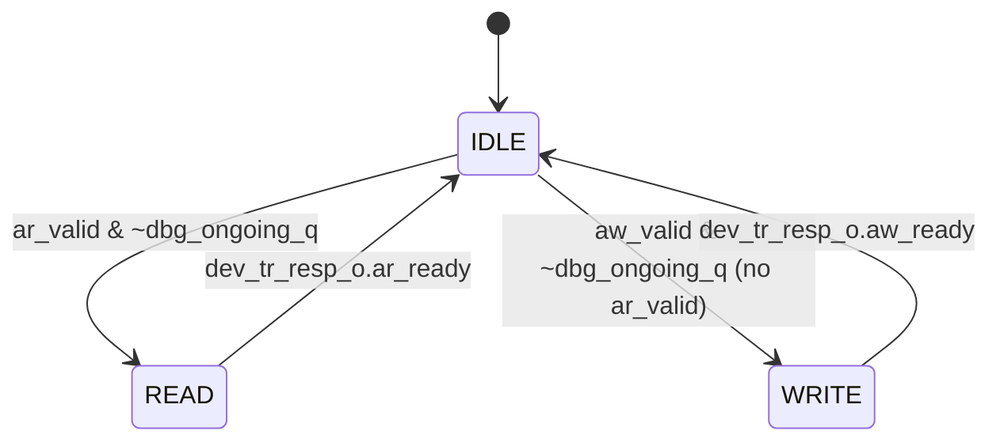

# モジュール: `riscv_iommu`

> Claude 向け 1-pager。RTL 解析結果 + テスト網羅状況 + 既知の制約の統合ビュー。

---

## Quick Reference

| 項目 | 値 |
|---|---|
| **役割 (1 行)** | RISC-V IOMMU トップレベル。4 本の AXI ポートを束ね、DMA 要求を受けてアドレス変換・権限チェックを実行し変換済みアドレスで Completion IF へ転送する |
| **RTL ファイル** | `rtl/riscv_iommu.sv` (~982 行) |
| **親モジュール** | なし (トップレベル) |
| **TB ファイル** | なし (未作成) |
| **TB ラッパ** | なし (未作成) |
| **仕様書対応** | `doc/spec/riscv-iommu/05-chapter-2.-introduction.md` §2 / `06-chapter-3.-data-structures.md` §3.3 |
| **最終更新** | `2026-04-27` by Claude |

---

## 1. 概要

`riscv_iommu` は RISC-V IOMMU 仕様 v1.0 の最上位モジュールである。
DMA デバイスからの AXI Read/Write 要求 (`dev_tr_req_i`) を受け付け、内部の Translation Wrapper (PTW/CDW/IOTLB) に変換処理を委譲したうえで、成功時は変換済み物理アドレスで Completion IF (`dev_comp_req_o`) へ要求を転送する。
失敗時はエラースレーブが SLVERR を返す。
ソフトウェアは Programming IF (`prog_req_i`) でレジスタを読み書きし、CQ/FQ や割り込みを制御する。
`InclDBG`/`InclBC`/`MSITrans`/`IGS` の 4 つのコンパイル時フラグで機能の有無が切り替わる。

---

## 2. パラメータ

| パラメータ | 型 | デフォルト | 役割 | 影響範囲 |
|---|---|---|---|---|
| `IOTLB_ENTRIES` | `int unsigned` | `4` | IOTLB エントリ数 | `rv_iommu_translation_wrapper` |
| `DDTC_ENTRIES` | `int unsigned` | `4` | DDTC エントリ数 | `rv_iommu_translation_wrapper` |
| `PDTC_ENTRIES` | `int unsigned` | `4` | PDTC エントリ数 | `rv_iommu_translation_wrapper` |
| `MRIFC_ENTRIES` | `int unsigned` | `4` | MRIF キャッシュエントリ数 | `rv_iommu_translation_wrapper` |
| `InclPC` | `bit` | `0` | Process Context サポート有無 | Translation Wrapper, SW IF Wrapper |
| `InclBC` | `bit` | `0` | AXI4 4-KiB 境界チェック有無 | `gen_axi4_bc` (line 671) |
| `InclDBG` | `bit` | `0` | デバッグレジスタ IF 有無 | `gen_dbg_if` (line 293) |
| `MSITrans` | `rv_iommu::msi_trans_t` | `MSI_DISABLED` | MSI 変換モード | `gen_mrif_support` (line 709), demux port 数 |
| `IGS` | `rv_iommu::igs_t` | `WSI_ONLY` | 割り込み生成方式 | SW IF Wrapper |
| `N_INT_VEC` | `int unsigned` | `16` | 割り込みベクタ数 (1/2/4/8/16) | `wsi_wires_o` bit 幅 |
| `N_IOHPMCTR` | `int unsigned` | `0` | HPM イベントカウンタ数 (max 31) | SW IF Wrapper |
| `ADDR_WIDTH` | `int` | `-1` | AXI アドレス幅 | AXI 型パラメータ |
| `DATA_WIDTH` | `int` | `-1` | AXI データ幅 | AXI 型パラメータ |
| `ID_WIDTH` | `int` | `-1` | AXI マスタ側 ID 幅 | demux, err slave |
| `ID_SLV_WIDTH` | `int` | `-1` | AXI スレーブ側 ID 幅 | prog IF |
| `USER_WIDTH` | `int` | `1` | AXI user フィールド幅 | AXI 型パラメータ |
| `aw_chan_t` … `reg_rsp_t` | `type` | `logic` | AXI/Regbus チャネル struct 型 | 全 AXI 接続 |

---

## 3. I/O ポート

### 3.1 Inputs

| 信号 | bit 幅 | 役割 | 駆動元 | TB での操作 |
|---|---|---|---|---|
| `clk_i` | 1 | クロック | 上位システム | `cocotb.clock.Clock` で生成 |
| `rst_ni` | 1 | アクティブ Low リセット | 上位システム | テスト開始時に Low → High |
| `dev_tr_req_i` | `axi_req_iommu_t` | DMA 変換要求 (AR/AW/W + DVM 拡張) | DMA デバイス | AXI マスタモデルで駆動 |
| `dev_comp_resp_i` | `axi_rsp_t` | Completion IF 応答 | 下流インターコネクト | AXI スレーブモデルで応答 |
| `ds_resp_i` | `axi_rsp_t` | データ構造用メモリ応答 | 外部 DRAM | モック AXI スレーブ |
| `prog_req_i` | `axi_req_slv_t` | レジスタプログラミング要求 | SW (CPU) | AXI-Lite マスタモデルで駆動 |

### 3.2 Outputs

| 信号 | bit 幅 | 役割 | 行き先 | TB での観測 |
|---|---|---|---|---|
| `dev_tr_resp_o` | `axi_rsp_t` | DMA 変換要求への応答 (AR_READY 等) | DMA デバイス | AXI マスタモデルで受信 |
| `dev_comp_req_o` | `axi_req_t` | 変換済みアドレスによる Completion 要求 | 下流インターコネクト | AXI スレーブモデルで観測 |
| `ds_req_o` | `axi_req_t` | ページテーブル / DC / PC フェッチ要求 | 外部 DRAM | モックで捕捉 |
| `prog_resp_o` | `axi_rsp_slv_t` | レジスタプログラミング応答 | SW (CPU) | AXI-Lite スレーブで受信 |
| `wsi_wires_o` | `[N_INT_VEC-1:0]` | WSI 割り込み信号 | 割り込みコントローラ | 直接観測 |

### 3.3 双方向 / バス (AXI / パラメータ化型)

| グループ | 方向 | 型 | 接続先 | プロトコル |
|---|---|---|---|---|
| `dev_tr_req_i` / `dev_tr_resp_o` | in/out | `axi_req_iommu_t` / `axi_rsp_t` | DMA デバイス | AXI4 + DVM 拡張 (MMUSID/MMUSSID) |
| `dev_comp_req_o` / `dev_comp_resp_i` | out/in | `axi_req_t` / `axi_rsp_t` | 下流インターコネクト | AXI4 |
| `ds_req_o` / `ds_resp_i` | out/in | `axi_req_t` / `axi_rsp_t` | DRAM (PTW/CDW/CQ/FQ 用) | AXI4 |
| `prog_req_i` / `prog_resp_o` | in/out | `axi_req_slv_t` / `axi_rsp_slv_t` | CPU ソフトウェア | AXI4-Lite |

---

## 4. 内部状態

### 4.1 FSM

`request_type_q` (3 状態): `riscv_iommu.sv:110`



### 4.2 状態遷移の契機と副作用

| 遷移 | 条件 | 副作用 (出力 / 内部レジスタ更新) |
|---|---|---|
| `IDLE → READ` | `ar_valid & ~dbg_ongoing_q` (line 847) | trans パラメータを AR チャネルから取得 |
| `IDLE → WRITE` | `aw_valid & ~dbg_ongoing_q` (line 852) | trans パラメータを AW チャネルから取得 |
| `READ: trans_valid` | Translation 成功 (line 874) | `resume_ar_q=1`, `demux_ar_select=01` (comp IF) |
| `READ: trans_error \|\| bound_violation` | 変換エラー (line 880) | `resume_ar_q=1`, `demux_ar_select=00` (error slave) |
| `READ: ignore_request` | MRIF 要求 (line 886) | `resume_ar_q=1`, `demux_ar_select=10` (ignore slave) |
| `READ → IDLE` | `ar_ready` (line 892) | `resume_ar_q=0`, FSM クリア |
| `WRITE: trans_valid` | Translation 成功 (line 914) | `resume_aw_q=1`, `demux_aw_select=01` (comp IF) |
| `WRITE: trans_error \|\| bound_violation` | 変換エラー (line 920) | `resume_aw_q=1`, `demux_aw_select=00` (error slave) |
| `WRITE: ignore_request` | MRIF 要求 (line 926) | `resume_aw_q=1`, `demux_aw_select=10` (ignore slave) |
| `WRITE → IDLE` | `aw_ready` (line 932) | `resume_aw_q=0`, FSM クリア |

### 4.3 主要な内部レジスタ

| レジスタ | bit | 初期値 | 更新タイミング | 用途 |
|---|---|---|---|---|
| `request_type_q` | 2 | `IDLE` | posedge clk | AR/AW 変換中の状態保持 |
| `resume_ar_q` | 1 | `0` | posedge clk | AR チャネル再開フラグ (`axi_aux_req.ar_valid`) |
| `resume_aw_q` | 1 | `0` | posedge clk | AW チャネル再開フラグ (`axi_aux_req.aw_valid`) |
| `demux_ar_select_q` | 2 | `0` | posedge clk | AR デマックス先選択 (00=err / 01=comp / 10=ignore) |
| `demux_aw_select_q` | 2 | `0` | posedge clk | AW デマックス先選択 (同上) |
| `dbg_ongoing_q` | 1 | `0` | posedge clk (InclDBG のみ) | DBG 変換中フラグ |

---

## 5. データフロー / 分岐図

```mermaid
flowchart TD
    DMA([DMA device: ar_valid / aw_valid]) --> FSM{FSM state}

    FSM -->|IDLE & ar_valid| READ_ST[READ state\ntrans params = AR channel]
    FSM -->|IDLE & aw_valid\n(no ar)| WRITE_ST[WRITE state\ntrans params = AW channel]

    READ_ST  --> TRANS[Translation Wrapper\nPTW / CDW / IOTLB]
    WRITE_ST --> TRANS

    TRANS -->|trans_valid| DEMUX_OK[demux → Comp IF\nresume_ar/aw = 1\nselect = 01]
    TRANS -->|trans_error & !fq_full\nor bound_violation| DEMUX_ERR[demux → Error slave\nresume = 1, select = 00\nSLVERR response]
    TRANS -->|ignore_request\n(MRIF)| DEMUX_IGN[demux → Ignore slave\nresume = 1, select = 10]

    DEMUX_OK  -->|ar_ready / aw_ready| IDLE_OK([IDLE\nTransaction done])
    DEMUX_ERR -->|ar_ready / aw_ready| IDLE_ERR([IDLE\nError reported to FQ])
    DEMUX_IGN -->|ar_ready / aw_ready| IDLE_IGN([IDLE\nMRIF write consumed])

    style DEMUX_OK  fill:#c8f7c5
    style IDLE_OK   fill:#c8f7c5
    style DEMUX_ERR fill:#f7c5c5
    style IDLE_ERR  fill:#f7c5c5
    style DEMUX_IGN fill:#fffacd
    style IDLE_IGN  fill:#fffacd
```

---

## 6. 条件分岐一覧

### 6.1 分岐マトリクス

| BR-ID | 所在 (file:line) | 条件式 | 真分岐の出力・副作用 | 偽分岐の出力・副作用 | 関連 T-ID |
|---|---|---|---|---|---|
| `BR01` | `riscv_iommu.sv:293` | `InclDBG` (generate) | DBG IF ロジックを含む (always_comb / FF) | iova/did/ttype を TR IF から直接 assign | TBD |
| `BR02` | `riscv_iommu.sv:315` | `dbg_if_ctl.go.q & ~(request_ongoing \| ar_valid \| aw_valid)` | DBG 変換起動: iova/did 等を DBG レジスタから取得、`dbg_ongoing_n=1` | iova/did/ttype を TR IF から取得 | TBD |
| `BR03` | `riscv_iommu.sv:328` | `case({exe.q, nw.q})` (4 way) | 00=UNTRANSLATED_W, 01=UNTRANSLATED_R, 10/11=UNTRANSLATED_RX | — | TBD |
| `BR04` | `riscv_iommu.sv:336` | `trans_valid \| trans_error` (DBG IF 内) | DBG 応答レジスタ更新、`busy.de=1`、`dbg_ongoing_n=0` | 何もしない | TBD |
| `BR05` | `riscv_iommu.sv:671` | `InclBC` (generate) | `rv_iommu_axi4_bc` インスタンス生成、`request_ongoing` / `bound_violation` を BC 出力から | `request_ongoing = (request_type_q != IDLE)`、`bound_violation = 0` | TBD |
| `BR06` | `riscv_iommu.sv:709` | `MSITrans == MSI_FLAT_MRIF` (generate) | `rv_iommu_ign_slv` + 3-port `axi_demux` (comp/error/ignore) | `ignore_req/rsp='0`、2-port `axi_demux` (comp/error) | TBD |
| `BR07` | `riscv_iommu.sv:847` | `dev_tr_req_i.ar_valid & ~dbg_ongoing_q` (IDLE) | `request_type_n = READ` | フォールスルーして AW チェックへ | TBD |
| `BR08` | `riscv_iommu.sv:852` | `dev_tr_req_i.aw_valid & ~dbg_ongoing_q` (IDLE) | `request_type_n = WRITE` | IDLE 維持 | TBD |
| `BR09` | `riscv_iommu.sv:874` | `trans_valid` (READ state) | `resume_ar_n=1`, `demux_ar_select_n=01` | フォールスルーしてエラーチェックへ | TBD |
| `BR10` | `riscv_iommu.sv:880` | `(trans_error & !is_fq_fifo_full) \|\| bound_violation` (READ) | `resume_ar_n=1`, `demux_ar_select_n=00` (error slave) | フォールスルーして ignore チェックへ | TBD |
| `BR11` | `riscv_iommu.sv:886` | `ignore_request` (READ state) | `resume_ar_n=1`, `demux_ar_select_n=10` (ignore slave) | resume/select 変更なし | TBD |
| `BR12` | `riscv_iommu.sv:892` | `dev_tr_resp_o.ar_ready` (READ state) | `request_type_n=IDLE`, `resume_ar_n=0` | READ 状態維持 | TBD |
| `BR13` | `riscv_iommu.sv:914` | `trans_valid` (WRITE state) | `resume_aw_n=1`, `demux_aw_select_n=01` | フォールスルーしてエラーチェックへ | TBD |
| `BR14` | `riscv_iommu.sv:920` | `(trans_error & !is_fq_fifo_full) \|\| bound_violation` (WRITE) | `resume_aw_n=1`, `demux_aw_select_n=00` | フォールスルーして ignore チェックへ | TBD |
| `BR15` | `riscv_iommu.sv:926` | `ignore_request` (WRITE state) | `resume_aw_n=1`, `demux_aw_select_n=10` | resume/select 変更なし | TBD |
| `BR16` | `riscv_iommu.sv:932` | `dev_tr_resp_o.aw_ready` (WRITE state) | `request_type_n=IDLE`, `resume_aw_n=0` | WRITE 状態維持 | TBD |
| `BR17` | `riscv_iommu.sv:866` | `dev_tr_req_i.ar.prot[2]` (READ state) | `trans_type = UNTRANSLATED_RX` (命令フェッチ) | `trans_type = UNTRANSLATED_R` (データ読み出し) | TBD |

### 6.2 複雑な分岐の詳細

#### `BR10` / `BR14`: `trans_error & !is_fq_fifo_full`

```systemverilog
// riscv_iommu.sv:880 (READ) / riscv_iommu.sv:920 (WRITE)
else if ((trans_error & !is_fq_fifo_full) || bound_violation) begin
    resume_ar_n       = 1'b1;
    demux_ar_select_n = 2'b00;
end
```

- **出現条件**: Translation Wrapper がエラーを返したが、FQ FIFO が満杯でない場合、または AXI 4-KiB 境界違反の場合
- **各パス**:
    - `trans_error & !fq_full`: FQ に Fault エントリを書けるのでエラー応答を返す
    - `bound_violation`: BC が検出した 4-KiB 越え
    - **待機**: `trans_error & is_fq_fifo_full` の場合はいずれの条件も不成立 → resume されず WRITE/READ 状態に留まる (FQ に空きができるまで待つ)
- **仕様対応**: `doc/spec/riscv-iommu/07-chapter-4.-in-memory-queue-interface.md` (FQ full 時の動作)
- **注意点**: FQ が満杯のまま永続する場合、FSM が WRITE/READ から抜けられない点に注意。`rv_iommu_sw_if_wrapper` 側で FQ を draining させる必要がある
- **テスト**: TBD

#### `BR06`: `MSITrans == MSI_FLAT_MRIF` — demux port 数

```systemverilog
// riscv_iommu.sv:709
if (MSITrans == rv_iommu::MSI_FLAT_MRIF) begin : gen_mrif_support
    // NoMstPorts = 3  → {ignore_slave, comp_IF, error_slave}
    ...
    .mst_reqs_o  ({ignore_req, dev_comp_req_o, error_req}),
end else begin : gen_mrif_support_disabled
    // NoMstPorts = 2  → {comp_IF, error_slave}
    ...
    .slv_ar_select_i(demux_ar_select_q[0]),  // 1-bit select
end
```

- **注意点**: `MSITrans != MSI_FLAT_MRIF` の場合、`demux_ar_select_q` は bit[0] しか使われない (bit[1] は don't care)

---

## 7. モジュール間連携

### 7.1 上流 (呼び出し元)

| 相手 | 本モジュールへの入力 | 本モジュールからの出力 | タイミング | BR-ID |
|---|---|---|---|---|
| DMA デバイス | `dev_tr_req_i` (AR/AW/W) | `dev_tr_resp_o` (AR_READY等) | AXI ハンドシェイク | BR07, BR08, BR12, BR16 |
| CPU ソフトウェア | `prog_req_i` | `prog_resp_o` | AXI-Lite | — (全て `rv_iommu_prog_if` に通過) |

### 7.2 下流 (呼び出し先)

| 相手モジュール | 本モジュールから | 受け取る信号 | 発生条件 | BR-ID |
|---|---|---|---|---|
| `rv_iommu_translation_wrapper` (line 479) | `req_trans_i`, `did_i`, `iova_i`, `ttype_i` 等 | `trans_valid_o`, `spaddr_o`, `trans_error_o`, `cause_code_o` 等 | IDLE→READ/WRITE 遷移後 | BR07-BR16 |
| `rv_iommu_prog_if` (line 407) | `prog_req_i` を通過 | `regmap_req`/`regmap_resp` | Programming 要求時 | — |
| `rv_iommu_ds_if` (line 430) | PTW/CDW/CQ/FQ/MSI-IG AXI バスを多重化 | `ds_req_o` / `ds_resp_i` | PTW/CDW/CQ/FQ アクティブ時 | — |
| `rv_iommu_sw_if_wrapper` (line 572) | `regmap_req`, fault/event 信号 | `capabilities`, `fctl`, `ddtp`, flush 信号, `is_fq_fifo_full` | 常時 | BR10, BR14 |
| `rv_iommu_axi4_bc` (line 673, InclBC のみ) | `request_type_q != IDLE`, `trans_iova`, burst params | `request_ongoing`, `bound_violation` | WRITE/READ 状態 | BR05, BR10, BR14 |
| `axi_demux` (line 728 or 769) | `axi_aux_req`, `demux_ar/aw_select_q` | `dev_tr_resp_o` | resume_ar/aw = 1 時 | BR09-BR11, BR13-BR15 |
| `axi_err_slv` (line 803) | `error_req` | `error_rsp` | demux select = 00 時 | BR10, BR14 |
| `rv_iommu_ign_slv` (line 712, MSI_FLAT_MRIF のみ) | `ignore_req` | `ignore_rsp` | ignore_request = 1 時 | BR06, BR11, BR15 |

### 7.3 横の連携 (並列モジュール)

本モジュールはトップレベルのため横連携なし。

---

## 8. タイミング / プロトコル注意点

### 8.1 ハンドシェイク

- AR は AW より優先される (`riscv_iommu.sv:847-854`): IDLE 状態で `ar_valid` と `aw_valid` が同時に来た場合、AR が優先して READ 状態に遷移する
- `resume_ar_q` / `resume_aw_q` が `axi_aux_req.ar_valid` / `axi_aux_req.aw_valid` を駆動する。変換完了の翌サイクルから AR/AW を demux に流す
- FSM は変換中の新規要求を受け付けない (READ/WRITE 状態では IDLE チェックをスキップ)
- FQ が満杯 (`is_fq_fifo_full=1`) かつ `trans_error=1` の場合、`resume_ar/aw` がアサートされず、FSM がその状態に留まる。FQ に空きができるまでデバイスへの応答が遅延する

### 8.2 リセット時の挙動

- `rst_ni=0` 時: `request_type_q=IDLE`, `resume_ar/aw_q=0`, `demux_ar/aw_select_q=0` にリセット (`riscv_iommu.sv:944-948`)
- `dbg_ongoing_q=0` にリセット (InclDBG=1 時のみ, line 365)
- リセット解除後、DMA デバイスからの `ar_valid`/`aw_valid` を待つ

### 8.3 マルチクロック / 非同期要素

単一クロック同期。すべての FF は `posedge clk_i or negedge rst_ni` で駆動される。

---

## 9. テストマトリクス

### 9.1 正常動作

| T-ID | 項目 | 入力 / トリガ | 期待出力 | TB 場所 | BR-ID | Last Run | Status |
|---|---|---|---|---|---|---|---|
| T01 | AR 変換成功 → Comp IF 転送 | ar_valid=1, 変換成功 | dev_comp_req_o.ar_valid=1, 変換済み addr | TBD | BR07, BR09, BR12 | - | ⏱ PENDING |
| T02 | AW 変換成功 → Comp IF 転送 | aw_valid=1, 変換成功 | dev_comp_req_o.aw_valid=1 | TBD | BR08, BR13, BR16 | - | ⏱ PENDING |
| T03 | AR 優先: AR+AW 同時 → AR 先処理 | ar_valid=aw_valid=1 同時 | READ 状態優先, AW は待機 | TBD | BR07, BR08 | - | ⏱ PENDING |
| T04 | 命令フェッチ (prot[2]=1) → UNTRANSLATED_RX | ar.prot[2]=1 | trans_type=UNTRANSLATED_RX | TBD | BR17 | - | ⏱ PENDING |
| T05 | データ Read (prot[2]=0) → UNTRANSLATED_R | ar.prot[2]=0 | trans_type=UNTRANSLATED_R | TBD | BR17 | - | ⏱ PENDING |

### 9.2 エッジケース

| T-ID | 項目 | 入力 / トリガ | 期待出力 | TB 場所 | BR-ID | Last Run | Status |
|---|---|---|---|---|---|---|---|
| T10 | FQ 満杯時に trans_error → resume されない | trans_error=1, is_fq_fifo_full=1 | resume_ar_q=0 (FSM 停滞) | TBD | BR10 | - | ⏱ PENDING |
| T11 | FQ 満杯が解消 → 遅延してエラー応答 | fq_full 解消後 | SLVERR 応答 | TBD | BR10 | - | ⏱ PENDING |
| T12 | リセット中に AR_VALID → リセット後から開始 | rst_ni=0 中に ar_valid=1 | リセット解除後に READ 開始 | TBD | BR07 | - | ⏱ PENDING |
| T13 | DBG 変換中に AXI 要求 → 変換完了まで待機 | InclDBG=1, dbg_ongoing=1, ar_valid=1 | FSM は IDLE 維持 (dbg_ongoing_q=1 が抑制) | TBD | BR02, BR07 | - | ⏱ PENDING |
| T14 | bound_violation → エラースレーブ応答 | InclBC=1, 4-KiB 越え burst | demux_ar_select=00, SLVERR | TBD | BR05, BR10 | - | ⏱ PENDING |

### 9.3 フォルト系

| T-ID | 項目 | 入力 / トリガ | 期待出力 | TB 場所 | BR-ID | Last Run | Status |
|---|---|---|---|---|---|---|---|
| T20 | AR 変換エラー → SLVERR | trans_error=1, fq_full=0 | dev_tr_resp_o に SLVERR | TBD | BR10, BR12 | - | ⏱ PENDING |
| T21 | AW 変換エラー → SLVERR | trans_error=1, fq_full=0 | dev_tr_resp_o に SLVERR | TBD | BR14, BR16 | - | ⏱ PENDING |
| T22 | MRIF 要求 → ignore slave (AR) | ignore_request=1 (AR) | ignore slave に転送, OKAY 応答 | TBD | BR06, BR11 | - | ⏱ PENDING |
| T23 | MRIF 要求 → ignore slave (AW) | ignore_request=1 (AW) | ignore slave に転送 | TBD | BR06, BR15 | - | ⏱ PENDING |

### 9.4 カバレッジサマリ

| カテゴリ | 計 | PASS | FAIL | SKIP | PENDING |
|---|---|---|---|---|---|
| 正常動作 | 5 | 0 | 0 | 0 | 5 |
| エッジケース | 5 | 0 | 0 | 0 | 5 |
| フォルト系 | 4 | 0 | 0 | 0 | 4 |
| **合計** | **14** | **0** | **0** | **0** | **14** |

---

## 10. テスト実装ノート

### 10.1 TB 構築上の注意

- `dev_tr_req_i` は `axi_req_iommu_t` 型 (通常の `axi_req_t` に `stream_id`/`ss_id_valid`/`substream_id` フィールドが追加)。`cocotbext-axi` の `AXI4Master` でカバーできるか要確認
- `ds_resp_i` はモック DRAM が必要。`rv_iommu_ptw_sv39x4_pc` の TB で使った `MockMemory` ベースの AXI スレーブを再利用可
- トップレベル TB は PTW/CDW/IOTLB/CQ/FQ すべてを動かす統合テストになる。単体テストはサブモジュール TB で行い、このモジュールは統合シナリオに注力する方針を推奨
- `wsi_wires_o` の観測: 直接 `dut.wsi_wires_o.value` で確認可

### 10.2 Force 方式の適用

本モジュールはトップレベルのため Force 方式は不使用。ただし Translation Wrapper の内部テストで Force を使う場合は `tb_rv_iommu_ptw_sv39x4_pc_wrapper.sv` の先例を参照。

### 10.3 観測しづらい信号

| 信号 | 観測方法 |
|---|---|
| `request_type_q` | 波形 or `dut.request_type_q.value` (階層参照) |
| `demux_ar_select_q` | 同上 |
| `is_fq_fifo_full` | `dut.is_fq_fifo_full.value` |
| `trans_valid`, `trans_error` | `dut.trans_valid.value` (内部ワイヤ) |
| `spaddr` | `dut.spaddr.value` |

---

## 11. ログパース用ヒント

### 11.1 cocotb ログの PASS/FAIL マーカ書式

```
0000.00ns INFO     cocotb.regression       test_xxx passed
0000.00ns FAIL     cocotb.regression       test_xxx failed
```

### 11.2 T-ID とテスト関数名のマッピング

TBD (TB 未作成)

### 11.3 自動更新スクリプト呼び出し例

```bash
python3 scripts/update_test_status.py \
    doc/modules/riscv_iommu.md \
    tb_coco/test/riscv_iommu/sim.log
```

---

## 12. 既知の挙動 / TODO / 要検証項目

### 12.1 実装の既知の制約

- `is_fq_fifo_full=1` かつ `trans_error=1` の組み合わせで FSM がスタックする。FQ を draining する外部 SW か、FQ の自動ドレイン機構が必要 (`riscv_iommu.sv:880`)
- AR と AW が同時にアサートされた場合、AW は無条件で後回し。AW の飢餓 (starvation) が起こり得る (`riscv_iommu.sv:847-854`)
- `MSITrans != MSI_FLAT_MRIF` の場合、`demux_ar/aw_select_q[1]` は使われないが、`ignore_request=1` が発生すると `demux_ar_select=10` がセットされるコードパスが READ/WRITE に存在する (BR11, BR15)。MRIF 無効時に `ignore_request` がアサートされる実装バグがあれば demux 範囲外選択になる可能性あり (**要検証**)

### 12.2 仕様との差異 / 要検証項目

- [ ] **要検証**: `t2gpa=1` (ATS 変換で GPA を返す) は Translation Wrapper 内の実装を確認要。IOMMU 仕様 §3.6 参照 (`doc/spec/riscv-iommu/06-chapter-3.-data-structures.md`)
- [ ] **要検証**: `dbg_if_ctl.go.q` が立ったまま `trans_valid/trans_error` が返らないケースでの DBG タイムアウト機構の有無
- [ ] **推測**: `axi_req_iommu_t` の `stream_id`/`substream_id` は AXI DVM 拡張の SMMU 対応フィールド。RISC-V IOMMU 仕様の `device_id`/`process_id` に対応 (`riscv_iommu.sv:862-864`)

### 12.3 TODO

- [ ] トップレベル統合 TB の作成 (`/create-tb rtl/riscv_iommu.sv`)
- [ ] `rv_iommu_sw_if_wrapper`、`rv_iommu_ds_if`、`rv_iommu_prog_if` の各モジュールカード作成
- [ ] FQ 満杯 + エラーのストレスシナリオ設計 (T10/T11)
- [ ] `InclDBG=1` パスの変換シナリオテスト設計 (T13)

---

## 13. 関連仕様

| トピック | 参照ファイル |
|---|---|
| IOMMU 全体アーキテクチャ / 位置づけ | `doc/spec/riscv-iommu/05-chapter-2.-introduction.md` |
| DC/PC/DDT/PDT レイアウト、2 段変換 (§3.3) | `doc/spec/riscv-iommu/06-chapter-3.-data-structures.md` |
| ATS / Translated Request / T2GPA | `doc/spec/riscv-iommu/06-chapter-3.-data-structures.md` §3.6 |
| MSI 変換 / MRIF / msiptp | `doc/spec/riscv-iommu/06-chapter-3.-data-structures.md` §3.1.3.5 |
| Command Queue / Fault Queue / Cause codes | `doc/spec/riscv-iommu/07-chapter-4.-in-memory-queue-interface.md` |
| デバッグ変換 (tr_req_ctl / tr_response) | `doc/spec/riscv-iommu/08-chapter-5.-debug-support.md` |
| レジスタ定義 (capabilities / fctl / ddtp 等) | `doc/spec/riscv-iommu/09-chapter-6.-memory-mapped-register-interface.md` |
| ソフトウェア使用手順 (無効化コマンド順序) | `doc/spec/riscv-iommu/10-chapter-7.-software-guidelines.md` |
| AXI Valid-Ready ハンドシェイク (AR/AW/W/B/R) | `doc/spec/IHI0022L_amba_axi_protocol_spec/02-chapter-a2-axi-transport.md` |
| AXI Burst 転送 / RRESP / BRESP | `doc/spec/IHI0022L_amba_axi_protocol_spec/03-chapter-a3-axi-transactions.md` |
| AXI 全信号リファレンス | `doc/spec/IHI0022L_amba_axi_protocol_spec/16-chapter-b1-signal-list.md` |
| Sv39 PTE / R/W/X/U/A/D / SUM | `doc/spec/riscv-privileged/14-chapter-12.-supervisor-level-isa-version-1.13.md` |
| G-stage (Sv39x4) / Hypervisor Extension | `doc/spec/riscv-privileged/24-chapter-22.-h-extension-for-hypervisor-support-version-1.0.md` |

---

## 14. 変更履歴

| 日付 | 変更者 | 内容 |
|---|---|---|
| `2026-04-27` | Claude | 初版作成 (RTL `rtl/riscv_iommu.sv` 982 行から解析、BR01-BR17 抽出) |
