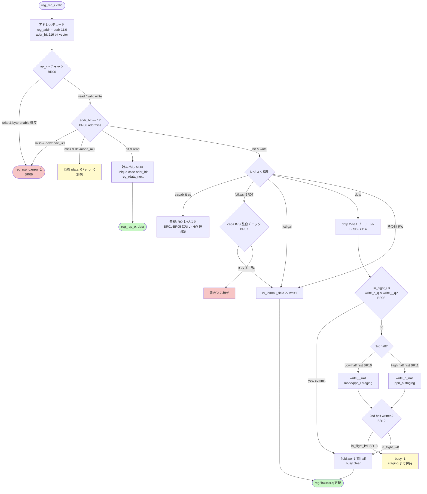

# モジュール: `rv_iommu_regmap`

> Claude 向け 1-pager。RTL 解析結果 + テスト網羅状況 + 既知の制約の統合ビュー。

---

## Quick Reference

| 項目 | 値 |
|---|---|
| **役割 (1 行)** | IOMMU メモリマップドレジスタインタフェース — SW の 32bit アクセスを IOMMU 内部 `reg2hw`/`hw2reg` バスに変換する |
| **RTL ファイル** | `rtl/software_interface/regmap/rv_iommu_regmap.sv` (~3550 行) |
| **親モジュール** | `rtl/software_interface/wrapper/rv_iommu_sw_if_wrapper.sv:253` |
| **TB ファイル** | なし (未作成) |
| **TB ラッパ** | なし |
| **仕様書対応** | `doc/spec/riscv-iommu/09-chapter-6.-memory-mapped-register-interface.md` §6 全体 |
| **最終更新** | `2026-04-28` by Claude |

---

## 1. 概要

`rv_iommu_regmap` は RISC-V IOMMU 仕様 §6 で規定されるメモリマップドレジスタ群を実装するモジュール。
SW (`reg_req_i` / `reg_rsp_o`) からの 32-bit read/write を受け取り、各レジスタフィールドへの
アドレスデコード・許可チェック・実際の RW を行い、HW 側には `reg2hw` (SW→HW) と `hw2reg` (HW→SW)
の構造体バスで公開する。

LowRISC `reggen` ツールで生成された骨格に、DDTP の 2-half 同時書き込みプロトコルや
capability フィールドのパラメータ駆動割り当てが追加されている。

レジスタ空間は 4 KiB に収まり、addr は 12 ビットオフセットで比較される (`rv_iommu_regmap.sv:89`)。
アドレスミスは `devmode_i=1` のときのみエラーを返し、それ以外は無視する (`rv_iommu_regmap.sv:97`)。

---

## 2. パラメータ

| パラメータ | 型 | デフォルト | 役割 | 影響範囲 |
|---|---|---|---|---|
| `DATA_WIDTH` | `int` | `32` | レジスタデータ幅 | `reg_wdata`/`reg_rdata` 幅 |
| `MSITrans` | `rv_iommu::msi_trans_t` | `MSI_DISABLED` | MSI 変換モード | `capabilities.msi_flat` / `msi_mrif` の値 |
| `IGS` | `rv_iommu::igs_t` | `WSI_ONLY` | 割り込み生成方式 | `capabilities.igs` 値、`fctl.wsi` の初期値と書き込みゲート |
| `N_INT_VEC` | `int unsigned` | `16` | 割り込みベクタ数 (1/2/4/8/16) | MSI config table のエントリ数 |
| `N_IOHPMCTR` | `int unsigned` | `0` | HPM カウンタ数 (max 31) | `capabilities.hpm` / iohpmctr・iohpmevt レジスタ群の有無 |
| `InclPC` | `bit` | `0` | Process Context サポート | **RTL内では未使用** (上位で使用) |
| `InclDBG` | `bit` | `0` | デバッグレジスタ IF | `tr_req_iova` / `tr_req_ctl` / `tr_response` レジスタの有無 |
| `reg_req_t` | `type` | `logic` | SW REG_BUS リクエスト型 | `reg_req_i` 型 |
| `reg_rsp_t` | `type` | `logic` | SW REG_BUS レスポンス型 | `reg_rsp_o` 型 |
| `STRB_WIDTH` | `int unsigned` | `DATA_WIDTH/8` | byte-enable 幅 (自動計算) | `reg_be` 幅 |

---

## 3. I/O ポート

### 3.1 Inputs

| 信号 | bit 幅 | 役割 | 駆動元 | TB での操作 |
|---|---|---|---|---|
| `clk_i` | 1 | システムクロック | 上位 | clock 生成 |
| `rst_ni` | 1 | アクティブ Low 非同期リセット | 上位 | assert/deassert |
| `reg_req_i` | `reg_req_t` | SW レジスタバスリクエスト (`valid`, `write`, `addr`, `wdata`, `wstrb`) | `rv_iommu_prog_if` 経由 | アドレス/データ/write 信号を手動駆動 |
| `hw2reg` | `iommu_hw2reg_t` | HW → レジスタ書き込み構造体 (`de`, `d` フィールド) | 各 HW モジュール | cqh/fqh などのカウンタ更新を模擬 |
| `devmode_i` | 1 | 開発者モード。1=アドレスミスでエラー返却 | 上位 | 0/1 切り替えでエラー応答確認 |
| `in_flight_i` | 1 | IOMMU が変換処理中フラグ。ddtp 書き込みをブロック | `rv_iommu_sw_if_wrapper` | 0/1 で ddtp busy 挙動確認 |

### 3.2 Outputs

| 信号 | bit 幅 | 役割 | 行き先 | TB での観測 |
|---|---|---|---|---|
| `reg_rsp_o` | `reg_rsp_t` | SW レジスタバスレスポンス (`rdata`, `error`, `ready`) | `rv_iommu_prog_if` | rdata/error を読み取り |
| `reg2hw` | `iommu_reg2hw_t` | SW → HW レジスタ値構造体 (各フィールドの `q`) | 各 HW モジュール | フィールド値を `_qs` 信号で観測 |

### 3.3 バス

| グループ | 方向 | 型 | 接続先 | プロトコル |
|---|---|---|---|---|
| `reg_req_i` / `reg_rsp_o` | in/out | `reg_req_t` / `reg_rsp_t` | `rv_iommu_sw_if_wrapper` 経由 `rv_iommu_prog_if` | REG_BUS (reggen 生成 valid-ready) |
| `reg2hw` | out | `iommu_reg2hw_t` | CQ/FQ handlers, HPM, ddtp logic 等 | 構造体バス (非プロトコル) |
| `hw2reg` | in | `iommu_hw2reg_t` | CQ/FQ handlers, HPM, ddtp logic 等 | 構造体バス (非プロトコル) |

---

## 4. 内部状態

### 4.1 FSM

このモジュールに明示的な FSM は存在しない。ただし ddtp 書き込みに 2-half ステージングがある。

### 4.2 ddtp 書き込みステージング

| 状態 | `write_l_q` | `write_h_q` | 説明 |
|---|---|---|---|
| IDLE | 0 | 0 | 初期状態。どちらも未書き込み |
| HALF_L | 1 | 0 | Low half (0x010) が書き込まれ pending |
| HALF_H | 0 | 1 | High half (0x014) が書き込まれ pending |
| BOTH_PENDING | 1 | 1 | 両 half 書き込み済み、`in_flight_i` 待ち中 |

commit 条件: `!in_flight_i && write_h_q && write_l_q` (`rv_iommu_regmap.sv:2802`)

### 4.3 主要な内部レジスタ

| レジスタ | bit | 初期値 | 更新タイミング | 用途 |
|---|---|---|---|---|
| `write_l_q` | 1 | 0 | posedge clk | ddtp low half pending フラグ |
| `write_h_q` | 1 | 0 | posedge clk | ddtp high half pending フラグ |
| `ddtp_iommu_mode_q` | 4 | 0 | posedge clk | ddtp staging レジスタ (mode) |
| `ddtp_ppn_l_q` | 22 | 0 | posedge clk | ddtp staging (PPN[21:0]) |
| `ddtp_ppn_h_q` | 22 | 0 | posedge clk | ddtp staging (PPN[43:22]) |

---

## 5. データフロー / 分岐図



---

## 6. 条件分岐一覧

### 6.1 分岐マトリクス

| BR-ID | 所在 (file:line) | 条件式 | 真分岐の出力・副作用 | 偽分岐の出力・副作用 | 関連 T-ID |
|---|---|---|---|---|---|
| `BR01` | `rv_iommu_regmap.sv:428` | `MSITrans != rv_iommu::MSI_DISABLED` | `msi_flat=1` / DC が 64B | `msi_flat=0` / DC が 32B | TBD |
| `BR02` | `rv_iommu_regmap.sv:442` | `MSITrans == rv_iommu::MSI_FLAT_MRIF` | `msi_mrif=1` | `msi_mrif=0` | TBD |
| `BR03a` | `rv_iommu_regmap.sv:475` | `IGS == rv_iommu::MSI_ONLY` | `igs=2'h0` | — | TBD |
| `BR03b` | `rv_iommu_regmap.sv:481` | `IGS == rv_iommu::WSI_ONLY` | `igs=2'h1` | — | TBD |
| `BR03c` | `rv_iommu_regmap.sv:487` | `IGS == rv_iommu::BOTH` | `igs=2'h2` | — | TBD |
| `BR04` | `rv_iommu_regmap.sv:493` | `N_IOHPMCTR > 0` | `hpm=1` / HPM レジスタ有効 | `hpm=0` / HPM レジスタ addr_hit=0 | TBD |
| `BR05` | `rv_iommu_regmap.sv:503` | `InclDBG` | `dbg=1` / debug レジスタ有効 | `dbg=0` / debug addr_hit=0 | TBD |
| `BR06` | `rv_iommu_regmap.sv:97` | `(devmode_i & addrmiss) \| (reg_we & \|wr_err)` | `reg_error=1` → error レスポンス | `reg_error=0` → 正常 | TBD |
| `BR07` | `rv_iommu_regmap.sv:2772` | `fctl_wsi_we`: `(wdata[1]==0 & IGS∈{MSI,BOTH}) \| (wdata[1]==1 & IGS∈{WSI,BOTH})` | `fctl.wsi` フィールドに書き込み | 書き込みドロップ | TBD |
| `BR08` | `rv_iommu_regmap.sv:2802` | `!in_flight_i && write_h_q && write_l_q` | ddtp commit: `we=1` 両 half / busy clear | — (commit せず次クロック待ち) | TBD |
| `BR09` | `rv_iommu_regmap.sv:2816` | `((addr_hit[3] && wdata[3:0]<=4) \|\| addr_hit[4]) && reg_we && !reg_error` | ddtp write ゲート通過 | 書き込み無視 | TBD |
| `BR10` | `rv_iommu_regmap.sv:2819` | `addr_hit[3] && !write_h_q` | Low half first: `write_l_n=1`, staging | — | TBD |
| `BR11` | `rv_iommu_regmap.sv:2825` | `addr_hit[4] && !write_l_q` | High half first: `write_h_n=1`, staging | — | TBD |
| `BR12` | `rv_iommu_regmap.sv:2831` | `(addr_hit[4] && write_l_q) \|\| (addr_hit[3] && write_h_q)` | 2nd half 書き込み判定へ | (1st half のみ) | TBD |
| `BR13` | `rv_iommu_regmap.sv:2834` | `in_flight_i` inside ddtp 2nd half | busy=1 / staging 継続 | commit 即時実行 | TBD |
| `BR14` | `rv_iommu_regmap.sv:2840` | `addr_hit[4]` (ddtp 2nd half 時の half 判定) | high half の staging/commit | low half の staging/commit | TBD |
| `BR15` | `rv_iommu_regmap.sv:2657` | `InclDBG` generate block | debug addr_hit[144:149] 有効 | addr_hit[144:149]=0 / wr_err=0 | TBD |
| `BR16` | `rv_iommu_regmap.sv:2635` | `N_IOHPMCTR > 0` | HPM addr_hit[16:19] 有効 | addr_hit[16:19]=0 | TBD |

### 6.2 複雑な分岐の詳細

#### `BR09-BR14`: ddtp 2-half 書き込みプロトコル

```systemverilog
// rv_iommu_regmap.sv:2802-2869
// Commit: both halves staged, no in-flight
if (!in_flight_i && write_h_q && write_l_q) begin
  // commit and clear pending flags
end

// Gate: valid ddtp write (mode must be <=4 for low half)
if (((addr_hit[3] && (reg_wdata[3:0] <= 4)) || addr_hit[4]) && reg_we && !reg_error) begin
  if (addr_hit[3] && !write_h_q)       // Low half first
  else if (addr_hit[4] && !write_l_q)  // High half first

  if ((addr_hit[4] && write_l_q) || (addr_hit[3] && write_h_q)) begin  // 2nd half
    if (in_flight_i) begin  // wait: set busy
    end else begin          // commit immediately
    end
  end
end
```

- **出現条件**: SW が ddtp (0x010/0x014) へ書き込みを行う全ケース
- **各パス**:
    - 1st half: staging レジスタへ保存、pending フラグをセット
    - 2nd half, no in-flight: 即時 commit (`we=1`)
    - 2nd half, in-flight: `busy=1` を立てて次クロックの commit を待機
    - commit cycle: `!in_flight` 確認後に `we=1` / busy clear
- **仕様対応**: `doc/spec/riscv-iommu/09-chapter-6.-memory-mapped-register-interface.md` §6.5 `busy` ビット記述
- **注意点**: 
    - Low half 書き込み時は `iommu_mode <= 4` のバリデーションあり — mode 5-13 は書き込み不可 (`rv_iommu_regmap.sv:2816`)
    - High half → Low half の順序でも動作する (BR11)
    - 両 half が pending 中に `in_flight_i` が落ちたとき、次クロックで自動 commit (BR08)
- **テスト**: TBD

#### `BR07`: fctl.wsi 書き込みゲート

```systemverilog
// rv_iommu_regmap.sv:2772-2774
assign fctl_wsi_we = (addr_hit[2] & reg_we & !reg_error) & 
    (((reg_wdata[1] == 1'b0) & (reg2hw.capabilities.igs.q inside {2'b00, 2'b10})) | 
     ((reg_wdata[1] == 1'b1) & (reg2hw.capabilities.igs.q inside {2'b01, 2'b10})));
```

- **出現条件**: fctl (0x008) への SW 書き込み
- **各パス**:
    - `wsi=0` (MSI 選択): `IGS∈{MSI_ONLY, BOTH}` の場合のみ有効
    - `wsi=1` (WSI 選択): `IGS∈{WSI_ONLY, BOTH}` の場合のみ有効
    - それ以外 (例: IGS=WSI_ONLY のとき wsi=0 を書く): ドロップ
- **仕様対応**: IOMMU Spec §6.4 fctl.WSI
- **テスト**: TBD

---

## 7. モジュール間連携

### 7.1 上流 (呼び出し元)

| 相手モジュール | 駆動される信号 | 戻す信号 | 発生条件 | BR-ID |
|---|---|---|---|---|
| `rv_iommu_sw_if_wrapper` | `reg_req_i`, `devmode_i`, `in_flight_i` | `reg_rsp_o` | SW レジスタアクセス | BR06 |

### 7.2 下流 (呼び出し先)

なし (このモジュール自体がレジスタファイルであり、下流モジュールを呼び出さない)

### 7.3 横の連携

| 相手モジュール | やり取り信号 | 発生条件 | 目的 | BR-ID |
|---|---|---|---|---|
| `rv_iommu_cq_handler` | `reg2hw.cqb`, `reg2hw.cqcsr`, `hw2reg.cqh`, `hw2reg.cqcsr` | 常時 | CQ 設定/状態のやり取り | — |
| `rv_iommu_fq_handler` | `reg2hw.fqb`, `reg2hw.fqcsr`, `hw2reg.fqh`, `hw2reg.fqcsr` | 常時 | FQ 設定/状態のやり取り | — |
| `rv_iommu_hpm` | `reg2hw.iocountinh`, `hw2reg.iohpmcycles`, `hw2reg.iohpmctr` | N_IOHPMCTR>0 | HPM カウンタ R/W | BR04, BR16 |
| translation logic (PTW 等) | `reg2hw.ddtp`, `reg2hw.fctl` | 常時 | ページテーブル根アドレス / 変換モード | BR08-BR14 |
| interrupt generators | `reg2hw.icvec`, `reg2hw.msi_cfg_tbl`, `hw2reg.ipsr` | 割り込み発生時 | 割り込みベクタ設定と pending 状態更新 | — |

---

## 8. タイミング / プロトコル注意点

### 8.1 ハンドシェイク

- `reg_rsp_o.ready` は常時 1 (`rv_iommu_regmap.sv:95`)。パイプラインストールなし。
- `reg_rdata` は `reg_re` が High のときのみ有効値を返す; write 時は 0 を返す (`rv_iommu_regmap.sv:96`)。
- REG_BUS はシングルサイクルで完結する (valid/ready の両エッジは不要)。

### 8.2 ddtp 書き込みプロトコル注意点

- SW は必ず Low half (0x010) と High half (0x014) の **両方を書かなければならない** (どちらか一方では commit しない)。
- 書き込み順序は Low→High / High→Low どちらでも可。
- `in_flight_i=1` の間に両 half が書かれた場合: `busy=1` がセットされ、`in_flight_i` が落ちた **次クロック** に自動的に commit される (`rv_iommu_regmap.sv:2802`)。
- `iommu_mode` の値 5-13 は書き込みがサイレントドロップされる (`rv_iommu_regmap.sv:2816`: `wdata[3:0] <= 4` のみ通過)。

### 8.3 アドレスミスの挙動

- `devmode_i=0`: アドレスミスは `reg_error=0` / `rdata=0` でサイレント無視。
- `devmode_i=1`: アドレスミスは `reg_error=1` を返す (explicit error)。
- wr_err: byte-enable が許可マスク `IOMMU_PERMIT` に違反する場合は `reg_we=1` 時のみ `reg_error=1` を返す。

### 8.4 リセット時の挙動

- `rst_ni=0`: `write_l_q`, `write_h_q`, ddtp staging レジスタはすべて 0 クリア (`rv_iommu_regmap.sv:2874-2879`)。
- 各 `rv_iommu_field` インスタンスも `RESVAL` に従ってリセット (fctl.wsi は IGS==MSI_ONLY なら 0、それ以外は 1 が `RESVAL`)。
- capabilities は純組合せ論理のため、リセット後即時に正しい値を持つ。

### 8.5 マルチクロック / 非同期要素

- 単一クロック同期 (`clk_i`)。ddtp staging のみ Sequential logic (FF)。

---

## 9. テストマトリクス

### 9.1 正常動作

| T-ID | 項目 | 入力 / トリガ | 期待出力 | TB 場所 | BR-ID | Last Run | Status |
|---|---|---|---|---|---|---|---|
| — | (骨組みのみ) | — | — | — | — | - | ⏱ PENDING |

### 9.2 エッジケース

| T-ID | 項目 | 入力 / トリガ | 期待出力 | TB 場所 | BR-ID | Last Run | Status |
|---|---|---|---|---|---|---|---|
| — | (骨組みのみ) | — | — | — | — | - | ⏱ PENDING |

### 9.3 フォルト系

| T-ID | 項目 | 入力 / トリガ | 期待出力 | TB 場所 | BR-ID | Last Run | Status |
|---|---|---|---|---|---|---|---|
| — | (骨組みのみ) | — | — | — | — | - | ⏱ PENDING |

### 9.4 カバレッジサマリ

| カテゴリ | 計 | PASS | FAIL | SKIP | PENDING |
|---|---|---|---|---|---|
| 正常動作 | 0 | 0 | 0 | 0 | 0 |
| エッジケース | 0 | 0 | 0 | 0 | 0 |
| フォルト系 | 0 | 0 | 0 | 0 | 0 |
| **合計** | **0** | **0** | **0** | **0** | **0** |

---

## 10. テスト実装ノート

### 10.1 TB 構築上の注意

- `reg_req_t` / `reg_rsp_t` は `rv_iommu_reg_pkg` の型。TB ラッパに reg_bus_t として外出しする必要がある。
- `hw2reg` の `cqh.de`, `cqh.d` など HW 書き込みフィールドは TB で直接駆動して read-back をテストする。
- ddtp 書き込みテストには `in_flight_i` を 0/1 切り替えて busy ビットの挙動を確認する。

### 10.2 Force 方式の適用

未使用。

### 10.3 観測しづらい信号

| 信号 | 観測方法 |
|---|---|
| `write_l_q` / `write_h_q` | 波形 / hierarchical reference |
| `addr_hit[215:0]` | 波形でアドレスデコードを確認 |
| `wr_err[215:0]` | `reg_rsp_o.error` と組み合わせて確認 |

---

## 11. ログパース用ヒント

TBD

---

## 12. 既知の挙動 / TODO / 要検証項目

### 12.1 実装の既知の制約

- [ ] `fctl.be` (BE bit) は 0 ハードワイヤード (`rv_iommu_regmap.sv:535-536`)。ビッグエンディアンモードは未サポート。
- [ ] `capabilities.amo_hwad`, `capabilities.ats`, `capabilities.t2gpa` は 0 ハードワイヤード — 各機能が未実装。
- [ ] `capabilities.amo_mrif` も 0 ハードワイヤード。
- [ ] `InclPC` パラメータはモジュール内部では使われていない (上位 wrapper で使用)。
- [ ] `iommu_mode` 値 5-13 の書き込みはサイレントドロップ (`rv_iommu_regmap.sv:2816`)。値の書き込み失敗を SW が検知する手段がない (busy=0 のまま)。

### 12.2 仕様との差異 / 要検証項目

- [ ] IOMMU Spec §6.5: `ddtp.PPN` フィールドは仕様上 bits[53:10] (44 bit) だが、本実装は low=bits[31:10] + high=bits[21:0] の split で合計 44 bit — 整合確認済み。
- [ ] 仕様 §6.1: `pqb` / `pqh` / `pqt` / `pqcsr` レジスタ (PCIe PRI 用) が存在しない — `capabilities.ATS=0` のためオプション省略は仕様準拠。
- [ ] `fctl.gxl` の write enable に制約なし (`rv_iommu_regmap.sv:2777-2778`)。仕様では IOMMU が Off のときのみ書き換え可とされるが、ハードウェアでのガードは上位に委ねている **要検証**。
- [ ] ddtp 書き込みプロトコル: 1st half が書かれた後、2nd half が書かれないまま別レジスタへアクセスがあった場合の pending フラグクリア処理が存在しない。**要検証: 古い pending 値が残り、次の ddtp 書き込みで誤 commit が発生しないか。**

### 12.3 TODO

- [ ] テストプランの作成 (`doc/test-plan/rv_iommu_regmap.md`)
- [ ] TB 生成 (`/create-tb rtl/software_interface/regmap/rv_iommu_regmap.sv`)
- [ ] ddtp 2-half プロトコルのシーケンス図 (§5) に timing diagram を追加

---

## 13. 関連仕様

| トピック | 参照ファイル |
|---|---|
| レジスタレイアウト / オフセット | `doc/spec/riscv-iommu/09-chapter-6.-memory-mapped-register-interface.md` §6.1 |
| capabilities フィールド詳細 | 同上 §6.3 |
| fctl フィールド詳細 | 同上 §6.4 |
| ddtp フィールド / busy ビット | 同上 §6.5 |
| cqb / cqcsr / fqb / fqcsr | 同上 §6.6-§6.14 |
| ipsr / icvec / MSI config table | 同上 §6.15 以降 |
| リセット挙動 | 同上 §6.2 |
| レジスタキャッシュ無効化 (software guidelines) | `doc/spec/riscv-iommu/10-chapter-7.-software-guidelines.md` |

---

## 14. 変更履歴

| 日付 | 変更者 | 内容 |
|---|---|---|
| `2026-04-28` | Claude | 初版作成 (RTL 全文解析) |
