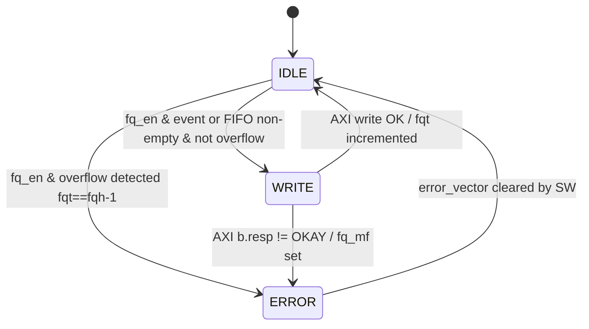
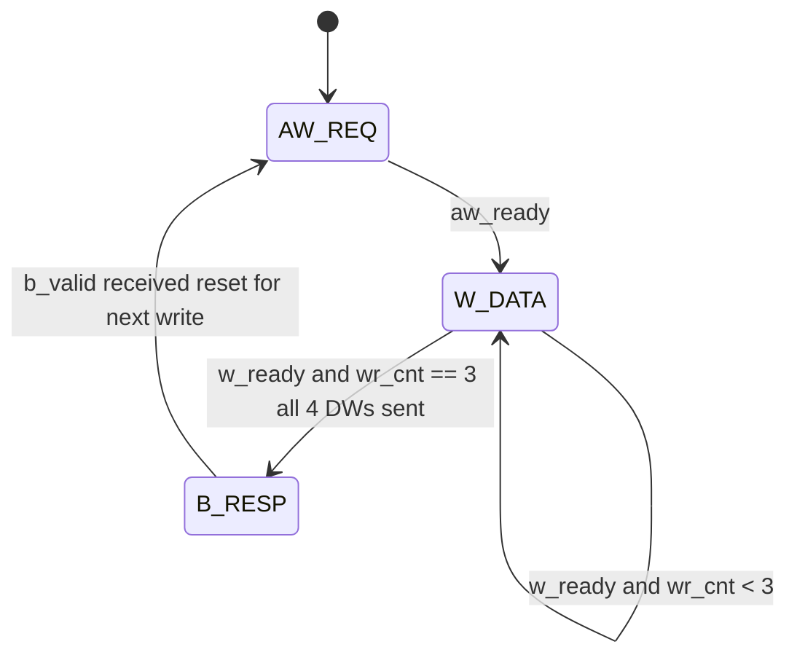
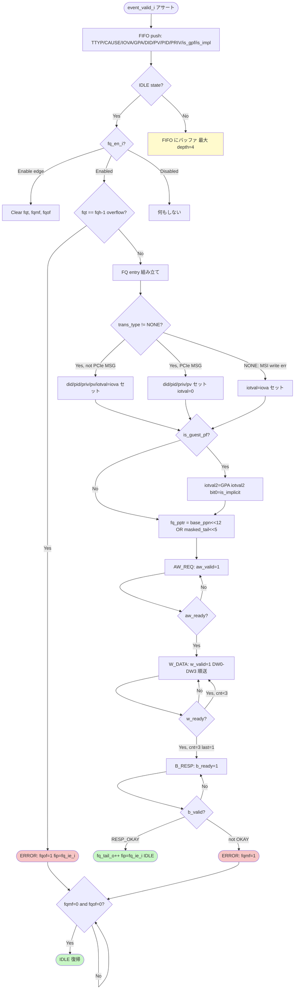

# モジュール: `rv_iommu_fq_handler`

> Claude 向け 1-pager。RTL 解析結果 + テスト網羅状況 + 既知の制約の統合ビュー。

---

## Quick Reference

| 項目 | 値 |
|---|---|
| **役割 (1 行)** | 翻訳フォルト/イベント発生時に Fault Queue (32-byte エントリ) をメモリに書き込む AXI ライトマスタ |
| **RTL ファイル** | `rtl/software_interface/rv_iommu_fq_handler.sv` (~428 行) |
| **親モジュール** | `rtl/software_interface/wrapper/rv_iommu_sw_if_wrapper.sv:L340` |
| **TB ファイル** | `tb_coco/test/helpers/faultq.py` (FaultQueue クラス / decode_fault_record) |
| **TB ラッパ** | なし (上位統合 TB 経由でのみ動作確認) |
| **仕様書対応** | `doc/spec/riscv-iommu/07-chapter-4.-in-memory-queue-interface.md` §4.2 |
| **最終更新** | `2026-05-01` by Claude |

---

## 1. 概要

`rv_iommu_fq_handler` は IOMMU の Fault/Event Queue (FQ) の **プロデューサ側ハンドラ**。翻訳ロジックが `event_valid_i` を 1 サイクルアサートすると内部 FIFO に fault データを push し、AXI4 INCR バースト (4 ビート × 8 byte = 32 byte) でメモリへ書き込む。  
書き込み完了後は `fq_tail_o` をインクリメントし、`fq_ip_o` (→ `ipsr.fip`) でソフトウェアに割り込みを通知する。  
FQ が満杯 (`fqt == fqh-1`) または AXI エラーが発生した場合、それぞれ `fq_of_o` / `fq_mf_o` をセットして ERROR ステートに移行し、ソフトウェアがエラービットをクリアするまで新規レコードの書き込みを停止する。

仕様対応: `doc/spec/riscv-iommu/07-chapter-4.-in-memory-queue-interface.md` §4.2 (Fault/Event Queue)

---

## 2. パラメータ

| パラメータ | 型 | デフォルト | 役割 | 影響範囲 |
|---|---|---|---|---|
| `axi_req_t` | type | logic | AXI Full リクエスト構造体型 | `mem_req_o` の型決定 |
| `axi_rsp_t` | type | logic | AXI Full レスポンス構造体型 | `mem_resp_i` の型決定 |

(`rtl/software_interface/rv_iommu_fq_handler.sv:L35-L39`)

---

## 3. I/O ポート

### 3.1 Inputs

| 信号 | bit 幅 | 役割 | 駆動元 | TB での操作 |
|---|---|---|---|---|
| `clk_i` | 1 | システムクロック | 上位 | クロック生成 |
| `rst_ni` | 1 | 非同期リセット (負論理) | 上位 | リセットアサート |
| `fq_base_ppn_i` | `riscv::PPNW` | FQ バッファの先頭 PPN | `reg2hw.fqb.ppn.q` | `write_reg64(REG_FQB_L, ...)` |
| `fq_size_i` | 5 | FQ サイズ: log2(N)-1 | `reg2hw.fqb.log2sz_1.q` | `fqb` レジスタ設定 |
| `fq_en_i` | 1 | FQ 有効化ビット (`fqcsr.fqen`) | `reg2hw.fqcsr.fqen.q` | `enable_fq()` |
| `fq_ie_i` | 1 | FQ 割り込み有効 (`fqcsr.fie`) | `reg2hw.fqcsr.fie.q` | `fqcsr` レジスタ設定 |
| `fq_head_i` | 32 | FQ ヘッドインデックス (SW 管理) | `reg2hw.fqh.q` | `write_reg32(REG_FQH, ...)` |
| `fq_tail_i` | 32 | FQ テールインデックス (現在値) | `reg2hw.fqt.q` | `read_reg32(REG_FQT)` |
| `fq_mf_i` | 1 | メモリフォルト済みビット (fqcsr) | `reg2hw.fqcsr.fqmf.q` | `fqcsr` ポーリング |
| `fq_of_i` | 1 | オーバーフロー済みビット (fqcsr) | `reg2hw.fqcsr.fqof.q` | `fqcsr` ポーリング |
| `event_valid_i` | 1 | フォルト/イベント発生通知 | `report_fault_i` (wrapper) | 上位モジュール経由 |
| `trans_type_i` | `TTYP_LEN` | トランザクション種別 (TTYP) | wrapper (MSI エラー時は 0 に上書き) | 上位モジュール経由 |
| `cause_code_i` | `CAUSE_LEN` | フォルト原因コード | wrapper | 上位モジュール経由 |
| `iova_i` | `riscv::VLEN` | IOVA (MSI エラー時は AW addr) | wrapper | 上位モジュール経由 |
| `gpaddr_i` | `riscv::SVX` | ゲストページフォルト時の GPA | `bad_gpaddr_i` (wrapper) | 上位モジュール経由 |
| `did_i` | 24 | デバイス ID | wrapper | 上位モジュール経由 |
| `pv_i` | 1 | プロセス ID 有効ビット | wrapper | 上位モジュール経由 |
| `pid_i` | 20 | プロセス ID | wrapper | 上位モジュール経由 |
| `is_supervisor_i` | 1 | スーパーバイザー権限フラグ | wrapper | 上位モジュール経由 |
| `is_guest_pf_i` | 1 | ゲストページフォルトフラグ | wrapper | 上位モジュール経由 |
| `is_implicit_i` | 1 | 第 1 ステージ変換中の暗黙アクセスフラグ | wrapper | 上位モジュール経由 |
| `mem_resp_i` | `axi_rsp_t` | AXI メモリレスポンス | `fq_axi_resp_i` (wrapper) | MockMem AXI slave |

(`rtl/software_interface/rv_iommu_fq_handler.sv:L41-L86`)

### 3.2 Outputs

| 信号 | bit 幅 | 役割 | 行き先 | TB での観測 |
|---|---|---|---|---|
| `fq_tail_o` | 32 | 更新された FQ テール | `hw2reg.fqt.d` | `read_reg32(REG_FQT)` |
| `fq_on_o` | 1 | FQ アクティブビット (`fqcsr.fqon`) | `hw2reg.fqcsr.fqon.d` | `read_reg32(REG_FQCSR)` |
| `busy_o` | 1 | FQ ビジービット (`fqcsr.busy`) | `hw2reg.fqcsr.busy.d` | `read_reg32(REG_FQCSR)` |
| `error_wen_o` | 1 | エラービットをレジスタに書き込む許可 | regmap (fq_error_wen) | - |
| `fq_mf_o` | 1 | メモリフォルト発生 | `hw2reg.fqcsr.fqmf.d` | `read_reg32(REG_FQCSR)` |
| `fq_of_o` | 1 | FQ オーバーフロー発生 | `hw2reg.fqcsr.fqof.d` | `read_reg32(REG_FQCSR)` |
| `fq_ip_o` | 1 | 割り込みペンディング (`ipsr.fip`) | `hw2reg.ipsr.fip.d` | `read_reg32(REG_IPSR)` |
| `mem_req_o` | `axi_req_t` | AXI メモリライトリクエスト | `fq_axi_req_o` (wrapper) | MockMem AXI slave |
| `is_full_o` | 1 | 内部 FIFO フル | `is_fq_fifo_full_o` (wrapper) | - |

(`rtl/software_interface/rv_iommu_fq_handler.sv:L54-L86`)

### 3.3 双方向 / バス

| グループ | 方向 | 型 | 接続先 | プロトコル |
|---|---|---|---|---|
| `mem_req_o` / `mem_resp_i` | out/in | `axi_req_t` / `axi_rsp_t` | FQ 専用 AXI ポート (fq_axi_req_o/resp_i) | AXI4 INCR burst (len=3, size=8B) ライトのみ |

---

## 4. 内部状態

### 4.1 FSM (メイン)



### 4.2 Write サブ FSM



(`rtl/software_interface/rv_iommu_fq_handler.sv:L88-L100`)

### 4.3 状態遷移の契機と副作用

| 遷移 | 条件 | 副作用 (出力 / 内部レジスタ更新) |
|---|---|---|
| `IDLE → WRITE` | `fq_en_i && (event_valid & !edge || !is_empty)` | `fq_entry_n` セット、`fq_pptr_n` 算出 |
| `IDLE → ERROR` | `fq_en_i && fq_tail_i == fq_head_i - 1` | `fq_of_o=1`, `error_wen_o=1`, `fq_ip_o=fq_ie_i` |
| `IDLE (enable)` | `fq_en_i && !fq_en_q` | `fq_tail_o=0`, `fq_mf_o=0`, `fq_of_o=0`, `error_wen_o=1`, `fq_en_n=1` |
| `IDLE (disable)` | `!fq_en_i && fq_en_q` | `fq_en_n=0` |
| `AW_REQ → W_DATA` | `aw_ready` | `wr_cnt_n=0` |
| `W_DATA → B_RESP` | `w_ready && &wr_cnt_q` | - |
| `WRITE/B_RESP → IDLE` | `b_valid && resp==OKAY` | `fq_tail_o` インクリメント (mod queue size)、`fq_ip_o=fq_ie_i`、`error_wen_o=1` |
| `WRITE/B_RESP → ERROR` | `b_valid && resp!=OKAY` | `fq_mf_o=1` |
| `ERROR → IDLE` | `!fq_mf_i && !fq_of_i` | - |

### 4.4 主要な内部レジスタ

| レジスタ | bit | 初期値 | 更新タイミング | 用途 |
|---|---|---|---|---|
| `state_q` | 2 | `IDLE` | clk posedge | メイン FSM 状態 |
| `wr_state_q` | 2 | `AW_REQ` | clk posedge | Write サブ FSM 状態 |
| `fq_pptr_q` | `riscv::PLEN` | 0 | IDLE→WRITE 時 | 書き込み先物理アドレス |
| `fq_entry_q` | 256 | 0 | IDLE→WRITE 時 | FQ レコード (4 DW) |
| `wr_cnt_q` | 2 | 0 | W_DATA で w_ready 毎 | 送信 DW カウンタ (0-3) |
| `fq_en_q` | 1 | 0 | `fq_en_i` 変化時 | enable のラッチ (busy 検出用) |
| `edge_trigger_q` | 1 | 0 | `event_valid_i` エッジ | FIFO 二重 push 防止 |

---

## 5. データフロー / 分岐図



---

## 6. 条件分岐一覧

### 6.1 分岐マトリクス

| BR-ID | 所在 (file:line) | 条件式 | 真分岐の出力・副作用 | 偽分岐の出力・副作用 | 関連 T-ID |
|---|---|---|---|---|---|
| `BR01` | `rv_iommu_fq_handler.sv:L257` | `fq_en_i` (IDLE) | FQ 有効パス分岐へ | `fq_en_q` が立っていれば disable 処理 | - |
| `BR02` | `rv_iommu_fq_handler.sv:L260` | `!fq_en_q` (enable edge) | tail/mf/of クリア、`fq_en_n=1` | 通常有効フロー | - |
| `BR03` | `rv_iommu_fq_handler.sv:L269` | `(event_valid_i & !edge_trigger_q) \|\| !is_empty` | WRITE 遷移・FQ entry 組み立て | IDLE 継続 | - |
| `BR04` | `rv_iommu_fq_handler.sv:L285` | `trans_type != rv_iommu::NONE` | did/pid/priv/pv セット | iotval のみセット (MSI write error) | - |
| `BR05` | `rv_iommu_fq_handler.sv:L291` | `trans_type != rv_iommu::PCIE_MSG_REQ` | iotval = iova セット | iotval セットなし | - |
| `BR06` | `rv_iommu_fq_handler.sv:L301` | `is_guest_pf` | iotval2 に GPA セット、bit0=is_implicit、bit1=0 | iotval2 変更なし | - |
| `BR07` | `rv_iommu_fq_handler.sv:L312` | `fq_tail_i == fq_head_i - 1` (overflow) | `fq_of_o=1`, `fq_ip_o=fq_ie_i`, ERROR 遷移 | fq_pptr 算出・WRITE 遷移 | - |
| `BR08` | `rv_iommu_fq_handler.sv:L321` | `fq_en_q` (disable edge: `!fq_en_i && fq_en_q`) | `fq_en_n=0` | なし | - |
| `BR09` | `rv_iommu_fq_handler.sv:L335` | `mem_resp_i.aw_ready` (AW_REQ) | W_DATA 遷移、`wr_cnt_n=0` | AW_REQ 継続 | - |
| `BR10` | `rv_iommu_fq_handler.sv:L343` | `wr_cnt_q` case (0/1/2/3) | 対応 DW を `w.data` に出力 | - | - |
| `BR11` | `rv_iommu_fq_handler.sv:L355` | `mem_resp_i.w_ready` (W_DATA) | `wr_cnt_n++` | カウンタ維持 | - |
| `BR12` | `rv_iommu_fq_handler.sv:L358` | `&wr_cnt_q` (wr_cnt==3) | B_RESP 遷移 | W_DATA 継続 | - |
| `BR13` | `rv_iommu_fq_handler.sv:L367` | `mem_resp_i.b_valid` (B_RESP) | b_ready=1、fip セット、tail インクリメントまたは ERROR | B_RESP 継続 | - |
| `BR14` | `rv_iommu_fq_handler.sv:L375` | `b.resp != axi_pkg::RESP_OKAY` | ERROR 遷移、`fq_mf_o=1` | IDLE 遷移、`fq_tail_o` インクリメント | - |
| `BR15` | `rv_iommu_fq_handler.sv:L396` | `!error_vector` (ERROR) | IDLE 遷移 | ERROR 継続 | - |
| `BR16` | `rv_iommu_fq_handler.sv:L178` | `!edge_trigger_q && event_valid_i` | `edge_trigger_n=1` | デフォルト維持 | - |
| `BR17` | `rv_iommu_fq_handler.sv:L183` | `edge_trigger_q && !event_valid_i` | `edge_trigger_n=0` | デフォルト維持 | - |

### 6.2 複雑な分岐の詳細

#### `BR07`: FQ オーバーフロー検出

```systemverilog
// rv_iommu_fq_handler.sv:L312
if (fq_tail_i == fq_head_i - 1) begin
    fq_of_o     = 1'b1;
    error_wen_o = 1'b1;
    fq_ip_o     = fq_ie_i;
    state_n     = ERROR;
end
```

- **出現条件**: IDLE にて FQ entry 組み立て後、tail を進める前に実施
- **注意**: `fq_tail_i` はマスク済みでなく生値を比較している。`fq_head_i - 1` もラップを考慮していないため、キューの境界付近 (head=0 のとき tail=UINT32_MAX-1 など) での動作は要検証
- **仕様対応**: `doc/spec/riscv-iommu/07-chapter-4.-in-memory-queue-interface.md` §4.2 "full when tail == head-1"
- **テスト**: TBD

#### `BR14`: AXI ライトレスポンスエラー

```systemverilog
// rv_iommu_fq_handler.sv:L375
if (mem_resp_i.b.resp != axi_pkg::RESP_OKAY) begin
    state_n     = ERROR;
    fq_mf_o     = 1'b1;
end
else begin
    fq_tail_o   = (fq_tail_i + 1) & ~({32{1'b1}} << (fq_size_i+1));
    state_n     = IDLE;
end
```

- **出現条件**: B_RESP ステートで b_valid=1 かつ b.resp が RESP_OKAY 以外
- **各パス**:
  - `RESP_SLVERR` / `RESP_DECERR`: `fq_mf_o=1`、ERROR 遷移 (注: IOPMP アクセスフォルトも AXI エラーとして扱われる)
  - `RESP_OKAY`: `fq_tail_o` をインクリメント、IDLE 遷移
- **仕様対応**: §4.2 "fqmf bit in fqcsr"
- **テスト**: TBD

---

## 7. モジュール間連携

### 7.1 上流 (呼び出し元)

| 相手モジュール | 駆動される信号 | 戻す信号 | 発生条件 | BR-ID |
|---|---|---|---|---|
| `rv_iommu_sw_if_wrapper` | `event_valid_i`, `trans_type_i`, `cause_code_i`, `iova_i`, `gpaddr_i`, `did_i`, `pv_i`, `pid_i`, `is_supervisor_i`, `is_guest_pf_i`, `is_implicit_i` | `fq_tail_o`, `fq_on_o`, `busy_o`, `fq_mf_o`, `fq_of_o`, `fq_ip_o`, `error_wen_o`, `is_full_o` | 翻訳フォルト時 | BR01-BR15 |
| `rv_iommu_regmap` (経由) | `fq_base_ppn_i`, `fq_size_i`, `fq_en_i`, `fq_ie_i`, `fq_head_i`, `fq_tail_i`, `fq_mf_i`, `fq_of_i` | (reg2hw 経由の入力) | レジスタ読み出し | BR01, BR02, BR07, BR15 |

### 7.2 下流 (呼び出し先)

| 相手モジュール | 駆動する信号 | 受け取る信号 | 発生条件 | BR-ID |
|---|---|---|---|---|
| FQ メモリ (AXI slave) | `mem_req_o.aw`, `mem_req_o.w` (AXI4 burst write) | `mem_resp_i.b` | WRITE ステートで記録書き込み時 | BR09-BR14 |
| `fifo_v3` i_fifo_fq | `push_i`, `data_i` | `empty_o`, `data_o` | `event_valid_i` エッジ | BR03, BR16, BR17 |

### 7.3 横の連携 (並列モジュール)

| 相手モジュール | やり取り信号 | 発生条件 | 目的 | BR-ID |
|---|---|---|---|---|
| MSI IG (`rv_iommu_msi_ig` / `rv_iommu_wsi_ig`) | `fq_ip_o` → `ipsr.fip` → `intp_i[1]` | 新規 FQ record 書き込み完了 or フォルト発生 | FQ 割り込みをソフトウェアへ通知 | BR13 |

---

## 8. タイミング / プロトコル注意点

### 8.1 ハンドシェイク

- `event_valid_i` は **1 サイクルのみ** アサートすること (`fifo_v3` への push_i は `event_valid_i & !edge_trigger_q` で 1 サイクルに制限している)。複数サイクルのアサートは edge_trigger によって 1 エントリとして扱われる (`rtl/software_interface/rv_iommu_fq_handler.sv:L150-L168`)。
- AXI バースト長は固定 `aw.len=3` (4 ビート)、サイズ `aw.size=3` (8 byte)。FQ レコードは必ず 32 byte 全部を書き込む。
- `w_ready` が来るたびに `wr_cnt` をインクリメント。全 4 DW 送信後 (wr_cnt==3 かつ w_ready) に B_RESP へ遷移する (`rtl/software_interface/rv_iommu_fq_handler.sv:L355-L360`)。

### 8.2 リセット時の挙動

- `rst_ni=0`: `state_q=IDLE`, `wr_state_q=AW_REQ`, `fq_pptr_q=0`, `fq_entry_q=0`, `fq_en_q=0`, `wr_cnt_q=0`, `edge_trigger_q=0` にリセット。
- リセット解除後: `fq_en_q=0` なので `busy_o = (fq_en_i != 0)`、`fq_on_o = fq_en_i` となる。ソフトウェアが `fqcsr.fqen=1` を書くと次サイクル `busy_o=1` → enable edge 処理 → `fq_en_n=1` → 2 サイクル後 `busy_o=0`。

### 8.3 マルチクロック / 非同期要素

- 単一クロック同期 (`clk_i`)。内部 FIFO (`fifo_v3`) も同一クロックドメイン。

### 8.4 FIFO バッファリング

- 深さ 4 の `fifo_v3` で最大 4 件のフォルトをバッファリング可能。AXI ライトが進行中でも `event_valid_i` を受け付けられる (`rtl/software_interface/rv_iommu_fq_handler.sv:L153-L168`)。
- FIFO pop タイミング: `is_idle = (wr_state_q == B_RESP)` (L132)。B_RESP ステートに入った時点でポップ。**注意**: B_RESP は b_valid を待っているステートであり、応答受信前にポップが発生する。

---

## 9. テストマトリクス

### 9.1 正常動作

| T-ID | 項目 | 入力 / トリガ | 期待出力 | TB 場所 | BR-ID | Last Run | Status |
|---|---|---|---|---|---|---|---|
| `T01` | FQ enable でクリア動作 | `fq_en_i` 立ち上がりエッジ | `fq_tail_o=0`, `fq_mf_o=0`, `fq_of_o=0` | TBD | BR02 | - | ⏱ PENDING |
| `T02` | 通常フォルト1件書き込み | `event_valid_i=1` + TTYP!=0 + cause | FQ エントリが base+0 に書かれ `fqt=1` | TBD | BR03, BR04, BR09-BR13 | - | ⏱ PENDING |
| `T03` | ゲストページフォルト書き込み | `is_guest_pf_i=1`, `gpaddr_i=X` | iotval2[63:2]=GPA, iotval2[0]=is_implicit | TBD | BR06 | - | ⏱ PENDING |
| `T04` | MSI write エラー (TTYP=0) | `trans_type_i=0`, `iova_i=AW.addr` | iotval=iova, did/pid=0 | TBD | BR04 | - | ⏱ PENDING |
| `T05` | 連続フォルト (FIFO バッファリング) | AXI write 中に event_valid_i | FIFO 経由で次エントリが書かれる | TBD | BR03, BR16 | - | ⏱ PENDING |

### 9.2 エッジケース

| T-ID | 項目 | 入力 / トリガ | 期待出力 | TB 場所 | BR-ID | Last Run | Status |
|---|---|---|---|---|---|---|---|
| `T10` | FQ disable → enable サイクル | `fq_en_i` 0→1→0→1 | busy_o が適切に遷移する | TBD | BR01, BR02, BR08 | - | ⏱ PENDING |
| `T11` | PCIe Message Request (TTYP=9) | `trans_type_i=PCIE_MSG_REQ` | iotval=0 | TBD | BR05 | - | ⏱ PENDING |
| `T12` | FIFO フル (4 件バッファ中に 5 件目) | 4 件書き込み中にさらに event | `is_full_o=1`、5件目はロストする可能性 | TBD | - | - | ⏱ PENDING |

### 9.3 フォルト系

| T-ID | 項目 | 入力 / トリガ | 期待出力 | TB 場所 | BR-ID | Last Run | Status |
|---|---|---|---|---|---|---|---|
| `T20` | FQ オーバーフロー | `fq_tail_i = fq_head_i - 1` でフォルト | `fq_of_o=1`, ERROR 遷移、新規書き込み停止 | TBD | BR07 | - | ⏱ PENDING |
| `T21` | AXI メモリフォルト | `b.resp = RESP_SLVERR` | `fq_mf_o=1`, ERROR 遷移 | TBD | BR14 | - | ⏱ PENDING |
| `T22` | ERROR からの復帰 | エラー後に SW がフォルトビットをクリア | ERROR→IDLE 遷移、次のフォルトを受け付ける | TBD | BR15 | - | ⏱ PENDING |

### 9.4 カバレッジサマリ

| カテゴリ | 計 | PASS | FAIL | SKIP | PENDING |
|---|---|---|---|---|---|
| 正常動作 | 5 | 0 | 0 | 0 | 5 |
| エッジケース | 3 | 0 | 0 | 0 | 3 |
| フォルト系 | 3 | 0 | 0 | 0 | 3 |
| **合計** | **11** | **0** | **0** | **0** | **11** |

---

## 10. テスト実装ノート

### 10.1 TB 構築上の注意

- `tb_coco/test/helpers/faultq.py` の `FaultQueue` クラスと `decode_fault_record` を必ず再利用すること。
- `FaultQueue.setup()` (= configure + enable) を翻訳テスト前に呼ぶ必要がある。`fqcsr.fqon` が立つまで待機。
- `event_valid_i` は上位 wrapper (`rv_iommu_sw_if_wrapper`) で `report_fault_i` に接続されている。単体テストでは直接 DUT に注入するかラッパを通す。
- AXI バーストは 4 ビートで固定なので AXI slave (MockMem 等) が INCR burst をサポートしている必要がある。
- `fq_size_i` (=`fqb.log2sz_1`) は `fqb` レジスタの bit[4:0]。`faultq.py` では `log2sz-1` を書く点に注意 (L119 参照)。

### 10.2 Force 方式の適用

- 未使用 (本モジュールは上位ラッパ経由で信号が来るため Force は不要)。

### 10.3 観測しづらい信号

| 信号 | 観測方法 |
|---|---|
| `fq_entry_q` (内部レジスタ) | 波形 (dump.vcd) の hierarchical ref / `dut.i_rv_iommu_fq_handler.fq_entry_q` |
| `state_q` / `wr_state_q` | 波形ダンプ、または `fqcsr` レジスタのフィールド (fqon/busy) で間接観測 |
| `edge_trigger_q` | 波形 |

---

## 11. ログパース用ヒント

### 11.1 cocotb ログの PASS/FAIL マーカ書式

```
TBD (テスト実装時に埋める)
```

### 11.2 T-ID とテスト関数名のマッピング

| T-ID | 関数名 (ログ内で grep する) |
|---|---|
| TBD | TBD |

### 11.3 自動更新スクリプト呼び出し例

```bash
python3 scripts/update_test_status.py \
    doc/modules/software_interface/rv_iommu_fq_handler.md \
    tb_coco/test/sim.log
```

---

## 12. 既知の挙動 / TODO / 要検証項目

### 12.1 実装の既知の制約

- [ ] PCIe Message Request (`TTYP=PCIE_MSG_REQ`) からのフォルトは将来実装 (`rtl/software_interface/rv_iommu_fq_handler.sv:L26` の TODO コメント)
- [ ] `fifo_v3` の深さ 4 を超えてフォルトが来た場合 (`is_full_o=1`)、FIFO 溢れ後の push_i 動作は `fifo_v3` 実装依存 (ドロップ or スタック)
- [ ] `is_idle` の命名が誤解を招く: `(wr_state_q == B_RESP)` は "B_RESP 待ち中" であり "アイドル" ではない。FIFO ポップのタイミングに注意 (`rtl/software_interface/rv_iommu_fq_handler.sv:L132`)

### 12.2 仕様との差異 / 要検証項目

- [ ] **要検証**: オーバーフロー判定 `fq_tail_i == fq_head_i - 1` (`rv_iommu_fq_handler.sv:L312`) はマスク前の生の 32-bit 値で比較している。head=0 のとき `fq_head_i - 1 = 0xFFFFFFFF` となり、マスク後のテール値とは一致しない可能性がある。仕様 §4.2 の "full when tail == head-1 mod N" と照合が必要。
- [ ] **要検証**: `fq_on_o = (fq_en_q | fq_en_i)` は enable/disable のオーバーラップ期間に OR になる。仕様 §6.9 の `fqon` ビットの定義と整合するか確認。
- [ ] `iotval2[1]` (A/D ビット更新によるライト暗黙アクセス) は常に 0 にハードコードされている (`rv_iommu_fq_handler.sv:L305`)。Svadu 非実装として意図的。

### 12.3 TODO

- [ ] 単体テスト TB の作成 (T01〜T22)
- [ ] `rv_iommu_fq_handler.sv` の `fq_entry_t` / `fq_record_t` 定義を `rv_iommu_pkg.sv` と照合してフィールド配置を明示した表を追加

---

## 13. 関連仕様

| トピック | 参照ファイル |
|---|---|
| Fault/Event Queue 全体仕様 (entry format, CAUSE table, TTYP table) | `doc/spec/riscv-iommu/07-chapter-4.-in-memory-queue-interface.md` §4.2 |
| FQ 関連レジスタ (fqb, fqh, fqt, fqcsr, ipsr) | `doc/spec/riscv-iommu/09-chapter-6.-memory-mapped-register-interface.md` §6.9, §6.10 |
| AXI4 Write チャネル (AW, W, B) プロトコル | `doc/spec/IHI0022L_amba_axi_protocol_spec/02-chapter-a2-axi-transport.md` |
| AXI Burst 転送 (INCR, AxLEN, AxSIZE, BRESP) | `doc/spec/IHI0022L_amba_axi_protocol_spec/03-chapter-a3-axi-transactions.md` §A3.3 |
| Guest Page Fault (iotval2 フォーマット) | `doc/spec/riscv-iommu/07-chapter-4.-in-memory-queue-interface.md` §4.2 (iotval2 note) |
| DTF ビットとフォルト報告抑制 | `doc/spec/riscv-iommu/06-chapter-3.-data-structures.md` §3.1 (dc.tc.DTF) |

---

## 14. 変更履歴

| 日付 | 変更者 | 内容 |
|---|---|---|
| `2026-05-01` | Claude (claude-sonnet-4-6) | 初版作成 (RTL 全文解析 + 仕様 §4.2 参照) |
