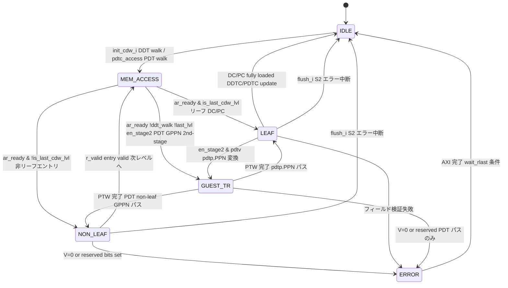
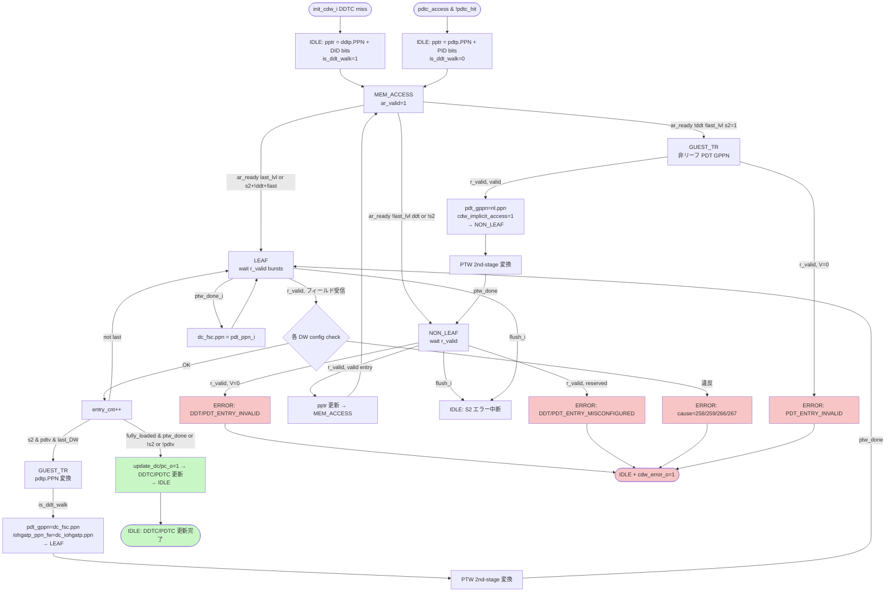

# モジュール: `rv_iommu_cdw_pc`

> Claude 向け 1-pager。RTL 解析結果 + テスト網羅状況 + 既知の制約の統合ビュー。

---

## Quick Reference

| 項目 | 値 |
|---|---|
| **役割 (1 行)** | Context Directory Walker (PC サポート付き)。DDT/PDT をメモリからウォークして DC/PC を構築し DDTC/PDTC に書き戻す。暗黙的 2nd-stage 変換 (pdtp.PPN の G-stage 変換) も担当する |
| **RTL ファイル** | `rtl/translation_logic/cdw/rv_iommu_cdw_pc.sv` (~899 行) |
| **親モジュール** | `rtl/translation_logic/wrapper/rv_iommu_tw_sv39x4_pc.sv:759` |
| **TB ファイル** | なし (未作成) |
| **TB ラッパ** | なし (未作成) |
| **仕様書対応** | `doc/spec/riscv-iommu/06-chapter-3.-data-structures.md` §3.1 / §3.2 / §3.8 |
| **最終更新** | `2026-04-27` by Claude |

---

## 1. 概要

`rv_iommu_cdw_pc` は RISC-V IOMMU の Context Directory Walker で、DDTC/PDTC のミス時に DDT (Device Directory Table) または PDT (Process Directory Table) を AXI 経由でメモリからウォークし、DC (Device Context) または PC (Process Context) を組み立てる。
DC は最大 4 DW (base format, MSI 無効時) または 7 DW (extended format, MSI 有効時)、PC は常に 2 DW で構成される。
各フィールドを受信するたびに仕様準拠チェックを行い、違反があれば ERROR 状態に遷移して対応する fault コードを出力する。
`en_stage2_i=1` かつ DC.tc.pdtv=1 の場合、pdtp.PPN (GPA) を PTW に依頼して 2nd-stage 変換させる暗黙的変換 (GUEST_TR 状態) も実装している。

---

## 2. パラメータ

| パラメータ | 型 | デフォルト | 役割 | 影響範囲 |
|---|---|---|---|---|
| `MSITrans` | `rv_iommu::msi_trans_t` | `MSI_DISABLED` | MSI 変換サポート有無 | `gen_msi_support` (line 735)、`dc_fully_loaded` 条件、`ar_len` |
| `axi_req_t` | `type` | `logic` | AXI 要求 struct 型 | AXI メモリ I/F |
| `axi_rsp_t` | `type` | `logic` | AXI 応答 struct 型 | AXI メモリ I/F |
| `DC_WIDTH` | `int` | `-1` | DC struct のビット幅 | `up_dc_content_o` ポート幅 |
| `ar_len` | `logic[7:0]` | `MSI_DISABLED ? 8'd3 : 8'd6` | AXI AR バーストカウント | DC/PC 取得の burst length (DO NOT OVERRIDE) |

---

## 3. I/O ポート

### 3.1 Inputs

| 信号 | bit 幅 | 役割 | 駆動元 |
|---|---|---|---|
| `clk_i` | 1 | クロック | 上位 |
| `rst_ni` | 1 | 非同期リセット (active low) | 上位 |
| `init_cdw_i` | 1 | DDTC ミス → DDT ウォーク起動トリガ | Wrapper (`ddtc_access && ~ddtc_lu_hit`) |
| `pdtc_access_i` | 1 | PDTC アクセスフラグ | Wrapper |
| `pdtc_hit_i` | 1 | PDTC ヒットフラグ | PDTC |
| `req_did_i` | 24 | 変換要求の device_id | Wrapper |
| `req_pid_i` | 20 | 変換要求の process_id | Wrapper |
| `ddtp_ppn_i` | `PPNW` | ddtp レジスタの PPN | Regmap |
| `ddtp_mode_i` | 4 | IOMMU モード / DDT レベル | Regmap |
| `en_stage2_i` | 1 | 2nd-stage 有効 (DC.iohgatp.mode != Bare) | Wrapper |
| `pdtp_ppn_i` | `PPNW` | DC.fsc.PPN (pdtp の PPN) | Wrapper |
| `pdtp_mode_i` | 4 | DC.fsc.MODE (PDT レベル) | Wrapper |
| `ptw_done_i` | 1 | PTW による暗黙変換完了 | PTW |
| `flush_i` | 1 | 暗黙変換中の 2nd-stage エラーによる中断 | PTW (`flush_cdw_o`) |
| `pdt_ppn_i` | `PPNW` | PTW が変換した PDT PPN | PTW / IOTLB update bus |
| `caps_ats_i` … `fctl_be_i` | 各 1 | DC フィールド整合性チェック用 capabilities/fctl | Regmap |
| `dc_sxl_i` | 1 | PC チェック用 DC.tc.SXL | Wrapper |
| `mem_resp_i` | `axi_rsp_t` | AXI メモリ応答 | DS IF |

### 3.2 Outputs

| 信号 | bit 幅 | 役割 | 行き先 |
|---|---|---|---|
| `cdw_active_o` | 1 | CDW 動作中フラグ (`state_q != IDLE`) | Wrapper (HPM `ddt/pdt_walk_o`) |
| `cdw_error_o` | 1 | ウォーク中にエラー発生 | Wrapper |
| `cause_code_o` | `CAUSE_LEN` | fault コード | Wrapper |
| `update_dc_o` | 1 | DDTC 書き込みトリガ | Wrapper → DDTC |
| `up_did_o` | 24 | 書き込む device_id | Wrapper → DDTC |
| `up_dc_content_o` | `DC_WIDTH` | 書き込む DC 内容 | Wrapper → DDTC |
| `update_pc_o` | 1 | PDTC 書き込みトリガ | Wrapper → PDTC |
| `up_pid_o` | 20 | 書き込む process_id | Wrapper → PDTC |
| `up_pc_content_o` | `rv_iommu::pc_t` | 書き込む PC 内容 | Wrapper → PDTC |
| `cdw_implicit_access_o` | 1 | PTW への暗黙 2nd-stage 変換要求 | Wrapper → PTW |
| `is_ddt_walk_o` | 1 | DDT ウォーク中フラグ (PTW の iohgatp 選択用) | Wrapper |
| `pdt_gppn_o` | `GPPNW` | 変換を依頼する PDT エントリの GPPN | Wrapper → PTW |
| `iohgatp_ppn_fw_o` | `PPNW` | pdtp.PPN 変換時に PTW へ転送する iohgatp.PPN | Wrapper → PTW |
| `mem_req_o` | `axi_req_t` | AXI メモリ要求 | DS IF |

---

## 4. 内部状態

### 4.1 FSM



### 4.2 状態遷移の契機と副作用

| 遷移 | 条件 | 副作用 |
|---|---|---|
| `IDLE → MEM_ACCESS` (DDT) | `init_cdw_i & !edge_trigger_q` (line 317) | `is_ddt_walk=1`, `cdw_pptr` を ddtp から算出, `state=MEM_ACCESS` |
| `IDLE → MEM_ACCESS` (PDT) | `pdtc_access & !pdtc_hit` (line 341) | `is_ddt_walk=0`, `cdw_pptr` を pdtp から算出 |
| `MEM_ACCESS → *` | `ar_ready` (line 366) | `case({S2, ddt_walk, last_lvl})` で次状態決定 |
| `NON_LEAF → MEM_ACCESS` | entry valid & r_valid (line 422) | `cdw_pptr` を次レベルの PPN+DID/PID bits で更新, `cdw_lvl` を -1 |
| `LEAF → IDLE` | `dc_fully_loaded || pc_fully_loaded` (line 473) | `update_dc_o=1` or `update_pc_o=1` |
| `LEAF → GUEST_TR` | entry cnt 3 or 6 かつ `en_stage2 & pdtv` (line 615, 623) | `state=GUEST_TR` |
| `GUEST_TR → LEAF` | pdtp.PPN パス (line 679) | `pdt_gppn=dc_fsc_q.ppn`, `cdw_implicit_access_o=1` |
| `GUEST_TR → NON_LEAF` | non-leaf PDT GPPN パス, entry valid (line 671) | `pdt_gppn=nl.ppn`, `cdw_implicit_access_o=1` |
| `* → ERROR` | V=0, reserved bits, config 違反, AXI error (複数箇所) | `cause_n` に対応 fault コードをセット |
| `ERROR → IDLE` | `wait_rlast ? r.last : 即時` (line 698) | `cdw_error_o=1` |

### 4.3 主要な内部レジスタ

| レジスタ | bit 幅 | 初期値 | 用途 |
|---|---|---|---|
| `state_q` | 3 | `IDLE` | FSM 現在状態 |
| `cdw_lvl_q` | 3 (`level_t`) | `LVL1` | DDT/PDT 現在レベル |
| `cdw_pptr_q` | `PLEN` | `'0` | 次の AXI アクセス物理アドレス |
| `is_ddt_walk_q` | 1 | `0` | DDT ウォーク中フラグ |
| `entry_cnt_q` | 3 | `'0` | DC/PC の何番目の DW を処理中か |
| `device_id_q` / `process_id_q` | 24/20 | `'0` | ウォーク中の ID を保持 |
| `dc_tc/iohgatp/ta/fsc_q` | struct | `'0` | DC フィールドを DW ごとに蓄積 |
| `pc_ta/fsc_q` | struct | `'0` | PC フィールドを蓄積 |
| `cause_q` | `CAUSE_LEN` | `'0` | エラー時の fault コードを保持 |
| `wait_rlast_q` | 1 | `0` | AXI バースト完了待ちフラグ |
| `ptw_done_q` | 1 | `0` | `ptw_done_i` の 1 サイクル遅延 |
| `edge_trigger_q` | 1 | `0` | `init_cdw_i` エッジ検出 |

---

## 5. データフロー / 分岐図



---

## 6. 条件分岐一覧

### 6.1 分岐マトリクス

| BR-ID | 所在 (file:line) | 条件式 | 真分岐の出力・副作用 | 偽分岐の出力・副作用 | 関連 T-ID |
|---|---|---|---|---|---|
| `BR01` | `rv_iommu_cdw_pc.sv:735` | `MSITrans != MSI_DISABLED` (generate) | MSI フィールド (msiptp/mask/pattern) 用レジスタ + config check | `msi_check_error/translate_pdtp='0`、dc_base フォーマット使用 | TBD |
| `BR02` | `rv_iommu_cdw_pc.sv:215` | `!edge_trigger_q && init_cdw_i` | `edge_trigger_n=1` (立ち上がりエッジ検出) | フォールスルー | TBD |
| `BR03` | `rv_iommu_cdw_pc.sv:219` | `edge_trigger_q && !init_cdw_i` | `edge_trigger_n=0` (立ち下がりエッジ) | フォールスルー | TBD |
| `BR04` | `rv_iommu_cdw_pc.sv:317` | `init_cdw_i && !edge_trigger_q` (IDLE) | DDT ウォーク開始: `is_ddt_walk=1`, state=MEM_ACCESS | PDTC チェックへ続行 | TBD |
| `BR05` | `rv_iommu_cdw_pc.sv:324` | `ddtp_mode_i == 4'b0100` (3LVL) (IDLE 内) | `cdw_pptr = {ddtp_ppn, DID[23:15 or 23:16], 3'b0}` | 2LVL チェックへ | TBD |
| `BR06` | `rv_iommu_cdw_pc.sv:330` | `ddtp_mode_i == 4'b0011` (2LVL) | `cdw_pptr = {ddtp_ppn, DID[14:6 or 15:7], 3'b0}` | 1LVL チェックへ | TBD |
| `BR07` | `rv_iommu_cdw_pc.sv:335` | `ddtp_mode_i == 4'b0010` (1LVL) | `cdw_pptr = {ddtp_ppn, DID[5:0 or 6:0], offs}` | — | TBD |
| `BR08` | `rv_iommu_cdw_pc.sv:341` | `pdtc_access_i && ~pdtc_hit_i` (IDLE) | PDT ウォーク開始: `process_id`, `cdw_lvl`, `cdw_pptr` を pdtp から設定 | — | TBD |
| `BR09` | `rv_iommu_cdw_pc.sv:349` | `pdtp_mode_i == 4'b0011` (PD20) | `cdw_pptr = {pdtp_ppn, 6'b0, PID[19:17], 3'b0}` | PD17/PD8 へ | TBD |
| `BR10` | `rv_iommu_cdw_pc.sv:366` | `mem_resp_i.ar_ready` (MEM_ACCESS) | 次状態を case で決定 | ar_valid=1 を維持して待機 | TBD |
| `BR11` | `rv_iommu_cdw_pc.sv:375` | `case({en_stage2_i, is_ddt_walk_q, is_last_cdw_lvl})` | `000/010/110→NON_LEAF`, `001/101/011/111→LEAF`, `100→GUEST_TR` | — | TBD |
| `BR12` | `rv_iommu_cdw_pc.sv:403` | `r_valid \|\| (ptw_done_i \|\| flush_i)` (NON_LEAF) | エントリ処理開始 | 待機 | TBD |
| `BR13` | `rv_iommu_cdw_pc.sv:408` | `!nl.v && r_valid` | `state=ERROR`, cause=DDT/PDT_ENTRY_INVALID | reserved チェックへ | TBD |
| `BR14` | `rv_iommu_cdw_pc.sv:416` | `r_valid && (reserved bits set)` | `state=ERROR`, cause=DDT/PDT_ENTRY_MISCONFIGURED | valid 非リーフ処理 | TBD |
| `BR15` | `rv_iommu_cdw_pc.sv:427` | `case(cdw_lvl_q)` (NON_LEAF valid パス) | LVL3→LVL2: pptr 更新 (DDT or PDT, S2 考慮); LVL2→LVL1: 同様 | default:; | TBD |
| `BR16` | `rv_iommu_cdw_pc.sv:457` | `flush_i` (NON_LEAF) | `state=IDLE` (S2 エラー中断) | — | TBD |
| `BR17` | `rv_iommu_cdw_pc.sv:468` | `ptw_done_i` (LEAF) | `dc_fsc_n.ppn = pdt_ppn_i` (翻訳済み PPN を保存) | — | TBD |
| `BR18` | `rv_iommu_cdw_pc.sv:473` | DC/PC が fully loaded かつ `(ptw_done_q \|\| !s2 \|\| !pdtv)` | `update_dc/pc_o=1`, `state=IDLE` | 次 DW の受信を待つ | TBD |
| `BR19` | `rv_iommu_cdw_pc.sv:491` | `case({is_ddt_walk_q, entry_cnt_q})` | 各 DW ごとに対応するレジスタへ保存 + config check | default:; | TBD |
| `BR20` | `rv_iommu_cdw_pc.sv:498` | PC.ta: `!pc_ta.v` | `state=ERROR`, cause=PDT_ENTRY_INVALID, `wait_rlast=1` | config check (reserved) | TBD |
| `BR21` | `rv_iommu_cdw_pc.sv:517` | PC.fsc: mode 範囲外 or 非サポート mode | `state=ERROR`, cause=PDT_ENTRY_MISCONFIGURED | — | TBD |
| `BR22` | `rv_iommu_cdw_pc.sv:534` | DC.tc: `!dc_tc.v` | `state=ERROR`, cause=DDT_ENTRY_INVALID, `wait_rlast=1` | config check | TBD |
| `BR23` | `rv_iommu_cdw_pc.sv:542` | DC.tc: 複合 config 違反 (reserved/ATS/T2GPA 等) | `state=ERROR`, cause=DDT_ENTRY_MISCONFIGURED | — | TBD |
| `BR24` | `rv_iommu_cdw_pc.sv:561` | DC.iohgatp: mode 範囲外 or 非サポート or PPN 非アライン | `state=ERROR`, cause=DDT_ENTRY_MISCONFIGURED | — | TBD |
| `BR25` | `rv_iommu_cdw_pc.sv:579` | DC.ta: reserved bits | `state=ERROR`, cause=DDT_ENTRY_MISCONFIGURED | — | TBD |
| `BR26` | `rv_iommu_cdw_pc.sv:591` | DC.fsc: 複合 config 違反 (pdtv mode, iosatp mode 等) | `state=ERROR`, cause=DDT_ENTRY_MISCONFIGURED | フォールスルーして GUEST_TR チェック | TBD |
| `BR27` | `rv_iommu_cdw_pc.sv:612` | DC.fsc (MSI_DISABLED 時): `en_stage2 & pdtv` | `state=GUEST_TR` (pdtp.PPN の 2nd-stage 変換) | 正常完了ロジックへ | TBD |
| `BR28` | `rv_iommu_cdw_pc.sv:621` | DC MSI fields (cnt=4,5,6): `translate_pdtp` | `state=GUEST_TR` | — | TBD |
| `BR29` | `rv_iommu_cdw_pc.sv:627` | DC MSI fields: `msi_check_error` | `state=ERROR`, cause=DDT_ENTRY_MISCONFIGURED | — | TBD |
| `BR30` | `rv_iommu_cdw_pc.sv:640` | `flush_i` (LEAF) | `state=IDLE` (S2 エラー中断) | — | TBD |
| `BR31` | `rv_iommu_cdw_pc.sv:649` | `!is_ddt_walk_q` (GUEST_TR) | from MEM_ACCESS パス (PDT GPPN) | from LEAF パス (pdtp.PPN) | TBD |
| `BR32` | `rv_iommu_cdw_pc.sv:657` | GUEST_TR MEM パス: `!nl.v` | `state=ERROR`, cause=PDT_ENTRY_INVALID | reserved チェックへ | TBD |
| `BR33` | `rv_iommu_cdw_pc.sv:664` | GUEST_TR MEM パス: `reserved bits` | `state=ERROR`, cause=PDT_ENTRY_MISCONFIGURED | `pdt_gppn=nl.ppn`, PTW 起動, `state=NON_LEAF` | TBD |
| `BR34` | `rv_iommu_cdw_pc.sv:698` | `(wait_rlast_q && r.last) \|\| !wait_rlast_q` (ERROR) | `cdw_error_o=1`, `state=IDLE` | r_ready=1 で受信しながら待機 | TBD |
| `BR35` | `rv_iommu_cdw_pc.sv:710` | `r_valid && r.resp != RESP_OKAY` (global) | AXI エラー: `state=ERROR`, cause=DDT/PDT_DATA_CORRUPTION | — | TBD |
| `BR36` | `rv_iommu_cdw_pc.sv:776` | `en_msi_check` (MSI config check ブロック) | case で各 MSI DW のチェック | — | TBD |
| `BR37` | `rv_iommu_cdw_pc.sv:785` | DC.msiptp: reserved or mode 違反 | `msi_check_error=1` | — | TBD |
| `BR38` | `rv_iommu_cdw_pc.sv:797` | DC.msi_addr_mask: reserved | `msi_check_error=1` | — | TBD |
| `BR39` | `rv_iommu_cdw_pc.sv:809` | DC.msi_addr_pattern: `en_stage2 & pdtv` | `translate_pdtp=1` | — | TBD |
| `BR40` | `rv_iommu_cdw_pc.sv:813` | DC.msi_addr_pattern: reserved | `msi_check_error=1` | — | TBD |

### 6.2 複雑な分岐の詳細

#### `BR11`: MEM_ACCESS 次状態の case

```systemverilog
// rv_iommu_cdw_pc.sv:375
case ({en_stage2_i, is_ddt_walk_q, is_last_cdw_lvl})
    3'b000, 3'b010, 3'b110: state_n = NON_LEAF;   // 非リーフ (S2 は DDT では無関係)
    3'b001, 3'b101, 3'b011, 3'b111: state_n = LEAF; // リーフ
    3'b100: state_n = GUEST_TR;                      // PDT 非リーフ + S2 有効
endcase
```

- `3'b100` (en_s2=1, ddt_walk=0, last_lvl=0): 非リーフ PDT エントリが GPPN を持ち、2nd-stage 変換が必要なケース
- DDT ウォーク (`is_ddt_walk_q=1`) では S2 は考慮しない (`3'b010, 3'b110` → NON_LEAF)
- **仕様対応**: IOMMU Spec §3.2 "If S2 is enabled, process_id -> PDT GPPN requires G-stage translation"

#### `BR18`: LEAF 完了条件

```systemverilog
// rv_iommu_cdw_pc.sv:473
if ((is_ddt_walk_q && dc_fully_loaded && (ptw_done_q || !en_stage2_i || !dc_tc_q.pdtv)) ||
    (!is_ddt_walk_q && pc_fully_loaded))
```

- DC: 全 DW ロード完了 かつ (`ptw_done_q=1` OR `en_stage2=0` OR `pdtv=0`) の 3 条件のいずれか
- `ptw_done_q`: GUEST_TR から ptw_done_i を受け取った翌サイクルに立つ (line 893)
- PC: 2 DW ロード完了で即時

#### `BR35`: AXI エラー (global)

```systemverilog
// rv_iommu_cdw_pc.sv:710
if (mem_resp_i.r_valid && mem_resp_i.r.resp != axi_pkg::RESP_OKAY) begin
    update_dc_o = 1'b0;
    update_pc_o = 1'b0;
    wait_rlast_n = ~mem_resp_i.r.last;
    if (is_ddt_walk_q) cause_n = rv_iommu::DDT_DATA_CORRUPTION;
    else               cause_n = rv_iommu::PDT_DATA_CORRUPTION;
    state_n = ERROR;
end
```

- case の外側 (どの状態でも評価): 全状態で AXI エラーを検出できる
- `update_dc/pc_o` を 0 にリセット (既にアサートされていた場合も上書き)

---

## 7. モジュール間連携

### 7.1 上流 (呼び出し元)

| 相手モジュール | 受け取る信号 | 渡す信号 | 発生条件 | BR-ID |
|---|---|---|---|---|
| `rv_iommu_tw_sv39x4_pc` (line 759) | `init_cdw_i`, `pdtc_access_i`, `pdtc_hit_i`, `req_did_i/pid_i` | `update_dc/pc_o`, `cdw_error_o`, `cause_code_o`, `cdw_active_o` | DDTC/PDTC ミス時 | BR04, BR08 |
| Regmap → Wrapper | `ddtp_ppn_i`, `ddtp_mode_i`, `caps_*`, `fctl_*` | — | 常時 | BR05-BR07, BR22-BR24 |
| DC fields → Wrapper | `en_stage2_i`, `pdtp_ppn_i`, `pdtp_mode_i`, `dc_sxl_i` | — | 常時 | BR08, BR09, BR11, BR21 |

### 7.2 下流 (呼び出し先)

| 相手モジュール | 駆動する信号 | 受け取る信号 | 発生条件 | BR-ID |
|---|---|---|---|---|
| DS IF (AXI Master) | `mem_req_o.ar_valid`, `mem_req_o.ar.addr/len`, `r_ready` | `mem_resp_i.ar_ready`, `r_valid`, `r.data/last/resp` | MEM_ACCESS / NON_LEAF / LEAF / GUEST_TR | BR10, BR12, BR35 |
| DDTC | `update_dc_o`, `up_did_o`, `up_dc_content_o` | — | LEAF 完了 (DDT walk) | BR18 |
| PDTC | `update_pc_o`, `up_pid_o`, `up_pc_content_o` | — | LEAF 完了 (PDT walk) | BR18 |

### 7.3 横の連携 (PTW との協調)

| 相手モジュール | やり取り | 発生条件 | BR-ID |
|---|---|---|---|
| `rv_iommu_ptw_sv39x4_pc` | `cdw_implicit_access_o=1`, `pdt_gppn_o` → PTW 起動; `ptw_done_i`, `flush_i`, `pdt_ppn_i` 受取 | GUEST_TR 状態で S2 変換要求 | BR31, BR32-BR33 |
| PTW | `iohgatp_ppn_fw_o` → PTW の iohgatp 選択 (pdtp.PPN 変換中は DC.iohgatp を使う) | GUEST_TR (pdtp.PPN パス) | BR31 |

---

## 8. タイミング / プロトコル注意点

### 8.1 init_cdw_i エッジ検出

- `init_cdw_i` は Translation Wrapper の `ddtc_access && ~ddtc_lu_hit` から来るため、DDTC ミスが続く間 High 保持される
- CDW は `edge_trigger_q` で立ち上がりエッジのみを検出する (line 215-221)。IDLE 状態での再起動を防ぐため、`init_cdw_i=1` が続く間は再トリガされない (line 317: `init_cdw_i && !edge_trigger_q`)
- DDTC ミス → CDW 完了 → DDTC ヒット → `init_cdw_i` が落ちる → `edge_trigger_q` がクリアされる、という流れ

### 8.2 AXI バースト長

- DC (base, MSI_DISABLED): `ar_len=8'd3` → 4 DW バースト (entry_cnt 0-3: tc/iohgatp/ta/fsc)
- DC (extended, MSI!=DISABLED): `ar_len=8'd6` → 7 DW バースト (entry_cnt 0-6: tc/iohgatp/ta/fsc/msiptp/mask/pattern)
- PC: `ar_len=8'd1` → 2 DW バースト (entry_cnt 0-1: ta/fsc)
- 非リーフエントリ: `ar_len=8'd0` → 1 DW (NL エントリ 1 個)

### 8.3 wait_rlast_q

- `wait_rlast_q=1` の場合、ERROR 状態でも r.last が来るまで `cdw_error_o` を遅らせる
- AXI バーストの途中でエラーが判明した場合、バーストを正常に完了させるための機構

### 8.4 GUEST_TR の PTW 協調

- `cdw_implicit_access_o=1` で PTW に S2 変換を依頼 (line 673, 685)
- PTW は `cdw_implicit_access=1` を受けて `ptw_en_1S=0, ptw_en_2S=1` の S2-only モードで動作 (Wrapper line 244)
- 変換完了: `ptw_done_i=1` → CDW は LEAF または NON_LEAF でそれを受け取る
- 変換エラー: PTW が `flush_cdw_o=1` → `flush_i=1` として CDW に渡る → state=IDLE で中断

### 8.5 リセット時の挙動

- `rst_ni=0` で全レジスタが `'0` にリセット (line 859-876)。`state_q=IDLE`, `cdw_lvl_q=LVL1`
- 単一クロック同期、リセットは非同期アクティブ Low

---

## 9. テストマトリクス

### 9.1 正常動作

| T-ID | 項目 | 入力 / トリガ | 期待出力 | TB 場所 | BR-ID | Last Run | Status |
|---|---|---|---|---|---|---|---|
| T01 | — | — | — | TBD | — | - | ⏱ PENDING |

### 9.2 エッジケース

| T-ID | 項目 | 入力 / トリガ | 期待出力 | TB 場所 | BR-ID | Last Run | Status |
|---|---|---|---|---|---|---|---|
| T10 | — | — | — | TBD | — | - | ⏱ PENDING |

### 9.3 フォルト系

| T-ID | 項目 | 入力 / トリガ | 期待出力 | TB 場所 | BR-ID | Last Run | Status |
|---|---|---|---|---|---|---|---|
| T20 | — | — | — | TBD | — | - | ⏱ PENDING |

### 9.4 カバレッジサマリ

| カテゴリ | 計 | PASS | FAIL | SKIP | PENDING |
|---|---|---|---|---|---|
| 正常動作 | 0 | 0 | 0 | 0 | 0 |
| エッジケース | 0 | 0 | 0 | 0 | 0 |
| フォルト系 | 0 | 0 | 0 | 0 | 0 |
| **合計** | **0** | **0** | **0** | **0** | **0** |

---

## 10. テスト実装ノート

### 10.1 TB 構築上の注意

- `capabilities_i` / `fctl_i` 相当の信号は個別 bit として入力されるため、TB では直接各 bit を設定する
- `init_cdw_i` はエッジ検出されるため、1 サイクル High にしてから Low に戻す必要がある (line 215-221)
- DC/PC は AXI バーストで複数 DW を受信する。TB では `MockMemory` に DDT/PDT テーブルをあらかじめ構築し、AXI スレーブで応答させる設計が適切
- `en_stage2_i=1 && pdtv=1` シナリオは PTW との協調が必要。PTW モックが `ptw_done_i=1` を返すまで GUEST_TR に留まる
- PTW エラー → `flush_i=1` でのキャンセルシナリオも重要なテストケース

### 10.2 Force 方式の適用

PTW との協調テストでは、`ptw_done_i` / `flush_i` / `pdt_ppn_i` を cocotb から直接ドライブすることで PTW モックが代替可能。

### 10.3 観測しづらい信号

| 信号 | 観測方法 |
|---|---|
| `state_q` | `dut.state_q.value` (0=IDLE, 1=MEM_ACCESS, 2=NON_LEAF, 3=LEAF, 4=GUEST_TR, 5=ERROR) |
| `entry_cnt_q` | `dut.entry_cnt_q.value` |
| `is_ddt_walk_q` | `dut.is_ddt_walk_q.value` |
| `cdw_pptr_q` | `dut.cdw_pptr_q.value` |
| `dc_tc_q.v` | `dut.dc_tc_q.value` の bit[0] を確認 (struct 先頭 bit に依存) |
| `edge_trigger_q` | `dut.edge_trigger_q.value` |

---

## 11. ログパース用ヒント

TBD (TB 未作成)

---

## 12. 既知の挙動 / TODO / 要検証項目

### 12.1 実装の既知の制約

- `init_cdw_i` はエッジ検出されるため、CDW が IDLE に戻る前に再起動はされない。しかし IDLE 遷移後に `init_cdw_i` が即座に High に来た場合、同サイクルにエッジ検出されて即トリガされる可能性あり (**推測:** Wrapper の `ddtc_access && ~ddtc_lu_hit` が 1 サイクルで更新されるため通常問題ない)
- DC の DW ロードとフィールドチェックは `entry_cnt_q` で管理されるが、`dc_fully_loaded` の条件が `MSITrans` に依存する (line 200)。パラメータの設定ミスがあると不完全な DC が DDTC に書き込まれる
- `wait_rlast_q` が立っている場合でも `flush_i` は無視される (LEAF の `flush_i` チェックは `mem_resp_i.r_valid` との排他がない) (**要検証**: flush_i と wait_rlast の同時発生時の挙動)

### 12.2 仕様との差異 / 要検証項目

- [ ] **要検証**: IDLE 状態で `init_cdw_i=1` と `pdtc_access_i && ~pdtc_hit_i` が同時に来た場合、両方のアクションが実行される (`is_ddt_walk_n=1` かつ `pdtc_access_i` のアクション)。優先順位の仕様確認が必要 (line 317-357: 独立した if ブロック)
- [ ] **要検証**: DC.iohgatp 検証 (line 567): `|dc_iohgatp.mode && |dc_iohgatp.ppn[1:0]` — mode!=Bare のとき PPN が 4-byte アライン必須。仕様 §3.1.3 との整合確認
- [ ] **推測**: `ptw_done_q` (ptw_done_i の 1 サイクル遅延, line 874/893) を使うのは、LEAF の組合せロジックで `ptw_done_i` を直接使うとタイミング問題が起きるためと思われる

### 12.3 TODO

- [ ] 単体 TB の作成 (`/create-tb rtl/translation_logic/cdw/rv_iommu_cdw_pc.sv`)
- [ ] 3LVL DDT ウォーク (IDLE → MEM_ACCESS → NON_LEAF → NON_LEAF → LEAF) のエンドツーエンドテスト
- [ ] GUEST_TR パス (pdtp.PPN 変換) のテスト
- [ ] 全 DC フィールドの config check エラーパスの網羅
- [ ] AXI SLVERR 応答でのエラーパス (BR35) テスト

---

## 13. 関連仕様

| トピック | 参照ファイル |
|---|---|
| Device Context レイアウト (tc / iohgatp / ta / fsc / msiptp) §3.1 | `doc/spec/riscv-iommu/06-chapter-3.-data-structures.md` §3.1 |
| Process Context レイアウト (ta / fsc) §3.2 | 同上 §3.2 |
| DDT / PDT ウォークアルゴリズム §3.1.1 / §3.2.1 | 同上 §3.1.1 / §3.2.1 |
| DDT/PDT キャッシュ無効化 §3.8 | 同上 §3.8 |
| Fault cause codes (258/259/266/267/DDT_DATA_CORRUPTION 等) | `doc/spec/riscv-iommu/07-chapter-4.-in-memory-queue-interface.md` |
| ソフトウェア側の DDT 構築順序 | `doc/spec/riscv-iommu/10-chapter-7.-software-guidelines.md` |
| G-stage (Sv39x4) — pdtp.PPN の 2nd-stage 変換 | `doc/spec/riscv-privileged/24-chapter-22.-h-extension-for-hypervisor-support-version-1.0.md` §22.4 |
| AXI Valid-Ready / Burst / RRESP | `doc/spec/IHI0022L_amba_axi_protocol_spec/02-chapter-a2-axi-transport.md` / `03-chapter-a3-axi-transactions.md` |

---

## 14. 変更履歴

| 日付 | 変更者 | 内容 |
|---|---|---|
| `2026-04-27` | Claude | 初版作成 (RTL `rtl/translation_logic/cdw/rv_iommu_cdw_pc.sv` 899 行から解析、BR01-BR40 抽出) |
