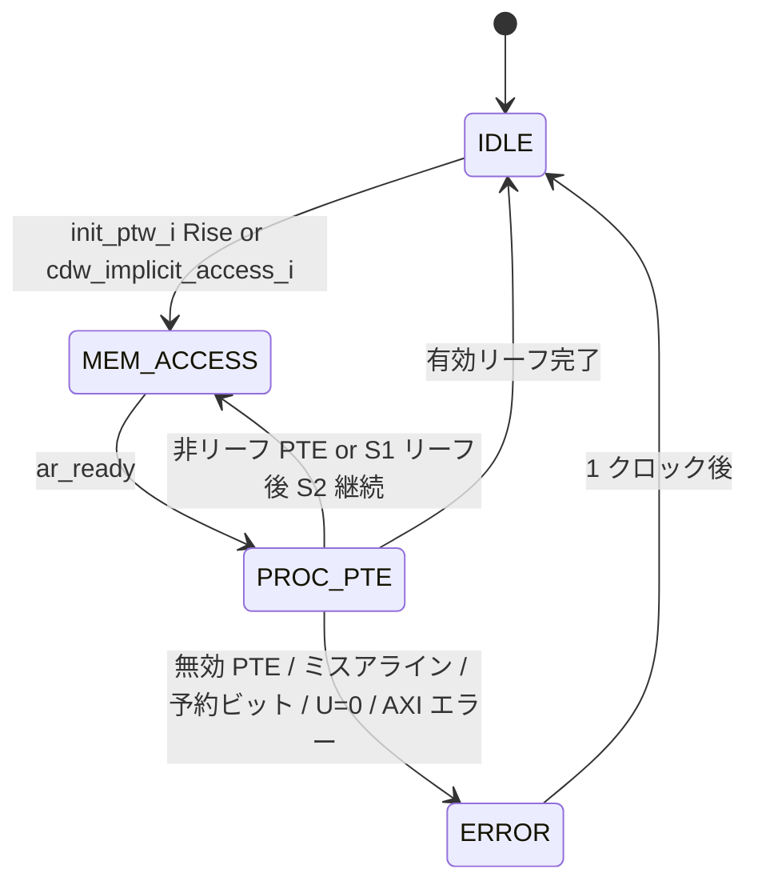
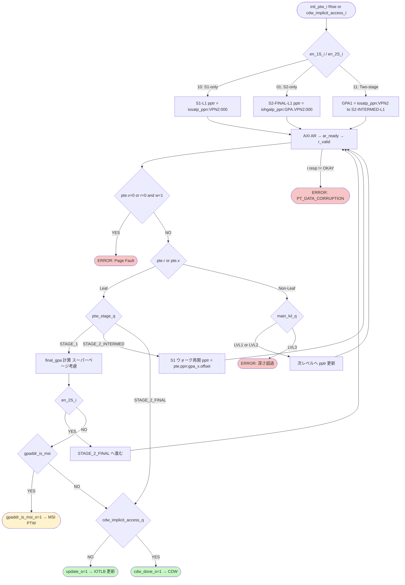

# モジュール: `rv_iommu_ptw_sv39x4_pc`

> Claude 向け 1-pager。RTL 解析結果 + テスト網羅状況 + 既知の制約の統合ビュー。

---

## Quick Reference

| 項目 | 値 |
|---|---|
| **役割 (1 行)** | Sv39x4 両ステージ対応ハードウェアページテーブルウォーカー (Process Context サポート付き) |
| **RTL ファイル** | `rtl/translation_logic/ptw/rv_iommu_ptw_sv39x4_pc.sv` (~807 行) |
| **親モジュール** | `rtl/translation_logic/wrapper/rv_iommu_tw_sv39x4_pc.sv:481` |
| **TB ファイル** | `tb_coco/translation_logic/ptw/test_ptw.py` |
| **TB ラッパ** | `tb_coco/translation_logic/ptw/tb_ptw_wrapper.sv` |
| **仕様書対応** | `doc/spec/riscv-iommu/06-chapter-3.-data-structures.md` §3.3; `doc/spec/riscv-privileged/14-chapter-12.md` §12.4; `doc/spec/riscv-privileged/24-chapter-22.md` (G-stage) |
| **最終更新** | `2026-04-24` by Claude Code |

---

## 1. 概要

RISC-V IOMMU の Sv39x4 ページテーブルウォーカー (PTW)。DMA デバイスから受け取った IOVA を物理アドレス (SPA) へ変換するため、メモリ上のページテーブルを AXI Read で逐次走査する。

Process Context サポート版 (`_pc` サフィックス) であり、`iosatp_ppn_i`（第 1 ステージルートアドレス）と `iohgatp_ppn_i`（第 2 ステージルートアドレス）の両方を受け取る。`en_1S_i`/`en_2S_i` の組み合わせで S1-only / S2-only / 両ステージ (Nested) の 3 モードに対応する。

変換成功時は IOTLB へ更新情報（`update_o` + `up_*` 信号群）を出力する。パーミッション検査（R/W/X/U/A/D bits）は PTW 内では行わず、IOTLB ヒットパス (Wrapper) に委ねる設計となっている (`rtl/translation_logic/ptw/rv_iommu_ptw_sv39x4_pc.sv:542`)。

MSI アドレスへのストアが検出された場合は `gpaddr_is_msi_o` を立て、MSI PTW (`rv_iommu_msiptw.sv`) へ制御を渡す。CDW が PDT エントリの暗黙的第 2 ステージ変換を要求した場合も `cdw_implicit_access_i` 経由で本モジュールが担当する。

---

## 2. パラメータ

| パラメータ | 型 | デフォルト | 役割 | 影響範囲 |
|---|---|---|---|---|
| `MSITrans` | `rv_iommu::msi_trans_t` | `MSI_DISABLED` | MSI 変換サポートの有無 | `generate gen_msi_support` ブロック全体 (line 178) |
| `axi_req_t` | `type` | `logic` | AXI リクエスト構造体型 | `mem_req_o` ポートの型 |
| `axi_rsp_t` | `type` | `logic` | AXI レスポンス構造体型 | `mem_resp_i` ポートの型 |

`MSITrans` が `MSI_DISABLED` 以外の場合、`gpaddr_is_msi` の計算ロジックとバス出力 (`msi_vpn_o` 等) が有効になる。Disabled の場合はすべて 0 固定。(`rv_iommu_ptw_sv39x4_pc.sv:181-207`)

---

## 3. I/O ポート

### 3.1 Inputs

| 信号 | bit 幅 | 役割 | 駆動元 | TB での操作 |
|---|---|---|---|---|
| `clk_i` | 1 | クロック | 外部 | TB クロック生成 |
| `rst_ni` | 1 | 非同期リセット (Low 有効) | 外部 | TB 初期化時 Low |
| `init_ptw_i` | 1 | PTW トリガ（立ち上がりエッジ検出）| Wrapper (IOTLB miss 時) | 1 クロック High パルス or 持続 High |
| `en_1S_i` | 1 | 第 1 ステージ有効フラグ | Wrapper (DC/PC 由来) | `force` で直接駆動 |
| `en_2S_i` | 1 | 第 2 ステージ有効フラグ | Wrapper (DC 由来) | `force` で直接駆動 |
| `is_store_i` | 1 | ストアアクセスフラグ | Wrapper | `force` で直接駆動 |
| `mem_resp_i` | `axi_rsp_t` | AXI Read レスポンス | メモリバス | MockMem が応答 |
| `req_iova_i` | 64 (`VLEN`) | 変換対象 IOVA | Wrapper | テストケースで設定 |
| `pscid_i` | 20 | Process Soft Context ID | Wrapper (PC 由来) | テストケースで設定 |
| `gscid_i` | 16 | Guest Soft Context ID | Wrapper (DC 由来) | テストケースで設定 |
| `msi_en_i` | 1 | MSI 変換有効フラグ | Wrapper | テストケースで設定 |
| `msi_addr_mask_i` | 29 (`GPPNW`) | MSI アドレスマスク | Wrapper (DC 由来) | テストケースで設定 |
| `msi_addr_pattern_i` | 29 (`GPPNW`) | MSI アドレスパターン | Wrapper (DC 由来) | テストケースで設定 |
| `cdw_implicit_access_i` | 1 | CDW 暗黙的 S2 変換要求 | CDW | TB でシミュレート |
| `pdt_gppn_i` | 29 (`GPPNW`) | CDW 暗黙的変換の GPPN | CDW | TB でシミュレート |
| `iosatp_ppn_i` | 44 (`PPNW`) | 第 1 ステージルート PPN | Wrapper (DC/PC 由来) | `force` で直接駆動 |
| `iohgatp_ppn_i` | 44 (`PPNW`) | 第 2 ステージルート PPN | Wrapper (CDW 経由または DC 由来) | `force` で直接駆動 |

### 3.2 Outputs

| 信号 | bit 幅 | 役割 | 行き先 | TB での観測 |
|---|---|---|---|---|
| `ptw_active_o` | 1 | ウォーク中フラグ (`state_q != IDLE`) | Wrapper / HPM | `await RisingEdge` / `assert` |
| `ptw_error_o` | 1 | エラー発生（アクセスエラー以外）| Wrapper | `assert` |
| `ptw_error_2S_o` | 1 | 第 2 ステージで発生したエラー | Wrapper (`is_guest_pf_o`) | `assert` |
| `ptw_error_2S_int_o` | 1 | S1 処理中の暗黙的 S2 アクセスエラー | Wrapper | `assert` |
| `cause_code_o` | 12 (`CAUSE_LEN`) | フォルトコード | Wrapper | 値チェック |
| `mem_req_o` | `axi_req_t` | AXI Read リクエスト | メモリバス | MockMem が監視 |
| `update_o` | 1 | IOTLB 更新トリガ | IOTLB | `assert` |
| `up_1S_2M_o` | 1 | S1 2M スーパーページフラグ | IOTLB | 値チェック |
| `up_1S_1G_o` | 1 | S1 1G スーパーページフラグ | IOTLB | 値チェック |
| `up_2S_2M_o` | 1 | S2 2M スーパーページフラグ | IOTLB | 値チェック |
| `up_2S_1G_o` | 1 | S2 1G スーパーページフラグ | IOTLB | 値チェック |
| `up_vpn_o` | 29 (`GPPNW`) | IOTLB 更新用 VPN (`iova_q[SVX-1:12]`) | IOTLB | 値チェック |
| `up_pscid_o` | 20 | IOTLB 更新用 PSCID | IOTLB | 値チェック |
| `up_gscid_o` | 16 | IOTLB 更新用 GSCID | IOTLB | 値チェック |
| `up_1S_content_o` | `riscv::pte_t` | S1 リーフ PTE (G ビット反映済み) | IOTLB | 値チェック |
| `up_2S_content_o` | `riscv::pte_t` | S2 リーフ PTE | IOTLB | 値チェック |
| `gpaddr_is_msi_o` | 1 | GPA が MSI アドレス | MSI PTW | `assert` |
| `msi_vpn_o` | 29 (`GPPNW`) | MSI PTW へのバス: VPN (`iova_q[SVX-1:12]`) | MSI PTW | 値チェック |
| `msi_1S_2M_o` | 1 | MSI PTW へのバス: 2M フラグ | MSI PTW | 値チェック |
| `msi_1S_1G_o` | 1 | MSI PTW へのバス: 1G フラグ | MSI PTW | 値チェック |
| `msi_gpte_o` | `riscv::pte_t` | MSI PTW へのバス: リーフ PTE | MSI PTW | 値チェック |
| `cdw_done_o` | 1 | CDW 暗黙的変換完了 | CDW | `assert` |
| `flush_cdw_o` | 1 | CDW エラー時フラッシュ要求 | CDW | `assert` |
| `bad_gpaddr_o` | 41 (`GPLEN`) | 第 2 ステージエラー時の不正 GPA | Wrapper (FQ 報告) | 値チェック |

### 3.3 双方向 / バス

| グループ | 方向 | 型 | 接続先 | プロトコル |
|---|---|---|---|---|
| `mem_req_o` / `mem_resp_i` | out/in | `axi_req_t` / `axi_rsp_t` | AXI バス (DS インタフェース) | AXI4 Read-only (AR + R チャネルのみ使用) |

---

## 4. 内部状態

### 4.1 FSM



`ptw_active_o = (state_q != IDLE)` (`rv_iommu_ptw_sv39x4_pc.sv:156`)

### 4.2 状態遷移の契機と副作用

| 遷移 | 条件 | 副作用 |
|---|---|---|
| `IDLE → MEM_ACCESS` | `(init_ptw_i && !edge_trigger_q) \|\| cdw_implicit_access_i` (line 361) | `ptw_pptr_n`, `ptw_stage_n`, `main_lvl_n=LVL1`, `iova_n`, `pscid/gscid` を初期化。{en_1S,en_2S} で分岐 |
| `MEM_ACCESS → PROC_PTE` | `mem_resp_i.ar_ready` (line 440) | `ar_valid=1` をアサート |
| `PROC_PTE → IDLE` | 有効リーフかつ `(STAGE_2_FINAL \|\| (!en_2S && !gpaddr_is_msi))` (line 548) | `update_o=1` または `cdw_done_o=1` |
| `PROC_PTE → MEM_ACCESS` | 非リーフ PTE または S1 リーフ後 S2 継続 | `ptw_pptr_n` を次レベルへ更新 |
| `PROC_PTE → ERROR` | 各種無効条件 (BR09, BR16-BR17, BR22-BR26) | `pf_excep_n=1` または `pt_data_corrupt_n=1`、`ptw_stage_n` 保存 |
| `ERROR → IDLE` | 常時（1 クロック） (line 740) | `ptw_error_o=1`、`cause_code_o` 出力、`flush_cdw_o`（CDW implicit 時） |

### 4.3 主要な内部レジスタ

| レジスタ | bit | 初期値 | 更新タイミング | 用途 |
|---|---|---|---|---|
| `state_q` | 2 | `IDLE` | 毎クロック | メイン FSM 状態 |
| `ptw_stage_q` | 2 | `STAGE_1` | IDLE 遷移時 / 各 PROC_PTE | 現在のウォークステージ (S1/S2-INTERMED/S2-FINAL) |
| `main_lvl_q` | 2 | `LVL1` | IDLE 遷移時 / 非リーフ処理 | 現在のページレベル (LVL1-3) |
| `s1_lvl_q` | 2 | `LVL1` | S1 リーフ発見時 | S1 リーフ発見レベルの保存 (S2-FINAL 開始後に参照) |
| `ptw_pptr_q` | 56 (`PLEN`) | 0 | IDLE/PROC_PTE | 次のメモリアクセス物理アドレス |
| `gpa_x_q` | 41 (`GPLEN`) | 0 | 非リーフ S1 / STAGE_2_INTERMED 開始時 | 中間 GPA (S2-INTERMED ウォーク対象) |
| `gpaddr_q` | 41 (`GPLEN`) | 0 | IDLE (S2-only) / STAGE_1 リーフ発見時 | 最終 GPA (S2-FINAL ウォーク対象) |
| `iova_q` | 64 (`VLEN`) | 0 | IDLE 遷移時 | IOVA 保存 (VPN 抽出に使用) |
| `leaf_1Spte_q` | `pte_t` | 0 | S1 リーフ発見時 | IOTLB 更新用 S1 リーフ PTE |
| `global_mapping_q` | 1 | 0 | IDLE / PROC_PTE | G ビット伝播フラグ |
| `edge_trigger_q` | 1 | 0 | 毎クロック | `init_ptw_i` 立ち上がりエッジ検出 (line 159) |
| `pf_excep_q` | 1 | 0 | IDLE / PROC_PTE | ページフォルト例外フラグ (ERROR 状態で参照) |
| `pt_data_corrupt_q` | 1 | 0 | IDLE / PROC_PTE | AXI エラー検出フラグ |
| `cdw_implicit_access_q` | 1 | 0 | IDLE 遷移時 | CDW 暗黙的変換モードフラグ |
| `cause_q` | 12 | 0 | AXI エラー時 | `PT_DATA_CORRUPTION` (274) を保存 |
| `iotlb_update_pscid_q` | 20 | 0 | IDLE 遷移時 | IOTLB 更新タグ用 PSCID |
| `iotlb_update_gscid_q` | 16 | 0 | IDLE 遷移時 | IOTLB 更新タグ用 GSCID |

---

## 5. データフロー / 分岐図



---

## 6. 条件分岐一覧

### 6.1 分岐マトリクス

| BR-ID | 所在 (file:line) | 条件式 | 真分岐の出力・副作用 | 偽分岐の出力・副作用 | 関連 T-ID |
|---|---|---|---|---|---|
| `BR01` | `rv_iommu_ptw_sv39x4_pc.sv:168` | `!edge_trigger_q && init_ptw_i` | `edge_trigger_n = 1` (立ち上がり検出) | 変化なし | - |
| `BR02` | `rv_iommu_ptw_sv39x4_pc.sv:172` | `edge_trigger_q && !init_ptw_i` | `edge_trigger_n = 0` (立ち下がり検出) | 変化なし | - |
| `BR03` | `rv_iommu_ptw_sv39x4_pc.sv:361` | `(init_ptw_i && !edge_trigger_q) \|\| cdw_implicit_access_i` | ウォーク開始 (IDLE→MEM_ACCESS), pptr/stage 初期化 | IDLE 維持 | T01-T20 全般 |
| `BR04` | `rv_iommu_ptw_sv39x4_pc.sv:367` | `case({en_1S_i, en_2S_i})` (4-way) | 2'b01=S2-only / 2'b10=S1-only / 2'b11=2-stage / default=IDLE | — | T01-T20 全般 |
| `BR05` | `rv_iommu_ptw_sv39x4_pc.sv:375` | `!cdw_implicit_access_i` (BR04 の 2'b01 内) | 通常 S2-only: gpaddr_n=req_iova_i | CDW 暗黙的: gpaddr_n={pdt_gppn_i,12'b0} | - |
| `BR06` | `rv_iommu_ptw_sv39x4_pc.sv:440` | `mem_resp_i.ar_ready` | `state_n = PROC_PTE` | MEM_ACCESS 維持 | T01-T20 全般 |
| `BR07` | `rv_iommu_ptw_sv39x4_pc.sv:448` | `mem_resp_i.r_valid` | PTE 処理開始, `r_ready=1` | PROC_PTE 維持 | T01-T20 全般 |
| `BR08` | `rv_iommu_ptw_sv39x4_pc.sv:454` | `pte.g && ptw_stage_q == STAGE_1` | `global_mapping_n = 1` | 変化なし | - |
| `BR09` | `rv_iommu_ptw_sv39x4_pc.sv:459` | `!pte.v \|\| (!pte.r && pte.w)` | `pf_excep_n=1`, `state_n=ERROR` | valid_pte 処理続行 | T20 系 |
| `BR10` | `rv_iommu_ptw_sv39x4_pc.sv:470` | `pte.r \|\| pte.x` | leaf_pte 処理 | non_leaf_pte 処理 | T01-T12 |
| `BR11` | `rv_iommu_ptw_sv39x4_pc.sv:471` | `case(ptw_stage_q)` in leaf_pte | STAGE_1 / STAGE_2_INTERMED / (STAGE_2_FINAL は default:;) | — | T01-T12 |
| `BR12` | `rv_iommu_ptw_sv39x4_pc.sv:489` | `en_2S_i` (STAGE_1 リーフ後) | S2-FINAL ウォーク開始, `s1_lvl_n=main_lvl_q` | IOTLB 更新 (S1-only 完了) | T01-T06 |
| `BR13` | `rv_iommu_ptw_sv39x4_pc.sv:509` | `gpaddr_is_msi` (S1 リーフ後) | `gpaddr_is_msi_o=1`, `state_n=IDLE` | 通常の S1 完了処理 | - |
| `BR14` | `rv_iommu_ptw_sv39x4_pc.sv:548` | `(ptw_stage_q == STAGE_2_FINAL) \|\| (!en_2S_i && !gpaddr_is_msi)` | `update_o` または `cdw_done_o` アサート | アサートしない | T01-T12 |
| `BR15` | `rv_iommu_ptw_sv39x4_pc.sv:549` | `!cdw_implicit_access_q` | `update_o = 1` | `cdw_done_o = 1` | - |
| `BR16` | `rv_iommu_ptw_sv39x4_pc.sv:555` | 1G ミスアライン: `main_lvl_q==LVL1 && \|pte.ppn[17:0]` | `pf_excep_n=1`, `state_n=ERROR`, `update_o=0` | チェック続行 | T22 |
| `BR17` | `rv_iommu_ptw_sv39x4_pc.sv:556` | 2M ミスアライン: `main_lvl_q==LVL2 && \|pte.ppn[8:0]` | `pf_excep_n=1`, `state_n=ERROR`, `update_o=0` | チェック続行 | T23 |
| `BR18` | `rv_iommu_ptw_sv39x4_pc.sv:567` | `ptw_stage_q != STAGE_1 && !pte.u` (S2 リーフ) | `pf_excep_n=1`, `state_n=ERROR` (Guest PF) | チェック続行 | T24 |
| `BR19` | `rv_iommu_ptw_sv39x4_pc.sv:579` | `main_lvl_q == LVL1` (非リーフ) | LVL2 へ進む。`case(ptw_stage_q)` で pptr 計算 | — |  |
| `BR20` | `rv_iommu_ptw_sv39x4_pc.sv:588` | `en_2S_i` (STAGE_1/LVL1 非リーフ) | GPA_2 構築 → S2-INTERMED-L1, `s1_lvl_n=LVL2` | S1-L2 直接 pptr |  |
| `BR21` | `rv_iommu_ptw_sv39x4_pc.sv:627` | `main_lvl_q == LVL2` (非リーフ) | LVL3 へ進む。`case(ptw_stage_q)` で pptr 計算 | — |  |
| `BR22` | `rv_iommu_ptw_sv39x4_pc.sv:636` | `en_2S_i` (STAGE_1/LVL2 非リーフ) | GPA_3 構築 → S2-INTERMED-L1, `s1_lvl_n=LVL3` | S1-L3 直接 pptr |  |
| `BR23` | `rv_iommu_ptw_sv39x4_pc.sv:681` | `pte.a \|\| pte.d \|\| pte.u` (非リーフ PTE) | `pf_excep_n=1`, `state_n=ERROR` | チェック続行 | T25 |
| `BR24` | `rv_iommu_ptw_sv39x4_pc.sv:690` | `main_lvl_q == LVL3` かつ非リーフ | `pf_excep_n=1`, `state_n=ERROR` (深さ超過) | チェック続行 | T26 |
| `BR25` | `rv_iommu_ptw_sv39x4_pc.sv:700` | `\|pte.reserved != 0` (PTE bits[63:54]) | `pf_excep_n=1`, `state_n=ERROR`, `update_o=0` | チェック続行 | T27 |
| `BR26` | `rv_iommu_ptw_sv39x4_pc.sv:710` | `en_2S_i && ptw_stage_q==STAGE_1 && \|pte.ppn[PPNW-1:GPPNW]` | `pf_excep_n=1`, `state_n=ERROR`, `ptw_stage_n=STAGE_2_INTERMED` | チェック続行 | T28 |
| `BR27` | `rv_iommu_ptw_sv39x4_pc.sv:727` | `mem_resp_i.r.resp != axi_pkg::RESP_OKAY` | `cause_n=PT_DATA_CORRUPTION(274)`, `state_n=ERROR`, `pt_data_corrupt_n=1` | チェック続行 | T30 |
| `BR28` | `rv_iommu_ptw_sv39x4_pc.sv:744` | `pt_data_corrupt_q` (ERROR 状態) | `cause_code_o = cause_q` (274) | `pf_excep_q` による分岐へ | T30 |
| `BR29` | `rv_iommu_ptw_sv39x4_pc.sv:748` | `ptw_stage_q != STAGE_1` (pf_excep_q 時) | `ptw_error_2S_o=1`、STORE/LOAD_GUEST_PAGE_FAULT | STORE/LOAD_PAGE_FAULT | T20-T28 |
| `BR30` | `rv_iommu_ptw_sv39x4_pc.sv:759` | `ptw_stage_q == STAGE_2_INTERMED` | `ptw_error_2S_int_o=1` | 0 | - |
| `BR31` | `rv_iommu_ptw_sv39x4_pc.sv:760` | `cdw_implicit_access_q` (ERROR 状態) | `flush_cdw_o=1` | 0 | - |
| `BR32` | `rv_iommu_ptw_sv39x4_pc.sv:181` | `MSITrans != rv_iommu::MSI_DISABLED` (generate) | MSI 検出ロジック有効 | 全 MSI 出力 = 0 固定 | - |
| `BR33` | `rv_iommu_ptw_sv39x4_pc.sv:187` | `msi_en_i && is_store_i && ((pte.ppn & ~mask) == (pattern & ~mask))` | `gpaddr_is_msi = 1` | `gpaddr_is_msi = 0` | - |

### 6.2 複雑な分岐の詳細

#### `BR04`: ウォーク開始時の 4 モード分岐

```systemverilog
// rv_iommu_ptw_sv39x4_pc.sv:367-422
case ({en_1S_i, en_2S_i})
    2'b01: /* S2-only: STAGE_2_FINAL, pptr = {iohgatp_ppn[41-1:2], GPA[41:30], 3'b0} */
    2'b10: /* S1-only: STAGE_1, pptr = {iosatp_ppn, iova[SV-1:30], 3'b0} */
    2'b11: /* Two-stage: STAGE_2_INTERMED, GPA_1 = {iosatp_ppn[GPPNW-1:0], iova[SV-1:30], 3'b0} */
    default: /* Bare/Bare: 到達不可、IDLE のまま */
endcase
```

- **出現条件**: `init_ptw_i` 立ち上がりまたは `cdw_implicit_access_i` でウォーク開始時
- **S2-only 注意**: `iohgatp_ppn_i[PPNW-1:2]` の上位 42bit のみ使用。S2-L1 テーブルは 16KiB アライン必須のため `iohgatp[1:0]=0` を前提とする
- **Two-stage 注意**: `iosatp_ppn` は GPA なので、まず S2 ウォークで SPA へ変換してから S1 ウォークを行う
- **仕様対応**: `doc/spec/riscv-iommu/06-chapter-3.-data-structures.md` §3.3
- **テスト**: T01-T12

#### `BR26`: S1 リーフ PTE の GPPN 上位ビット検証

```systemverilog
// rv_iommu_ptw_sv39x4_pc.sv:710-716
if (en_2S_i && ptw_stage_q == STAGE_1 && (|pte.ppn[riscv::PPNW-1:riscv::GPPNW]) != 1'b0) begin
    pf_excep_n    = 1'b1;
    state_n       = ERROR;
    ptw_stage_n   = STAGE_2_INTERMED;  // Guest page fault を発生させるため
    ...
end
```

- **意図**: Sv39x4 では GPA bit[63:41] は 0 必須。`pte.ppn[43:29]` (= PPNW-1:GPPNW = 43:29) が非ゼロなら Guest Page Fault
- **`ptw_stage_n = STAGE_2_INTERMED`** を明示的にセットすることで ERROR 状態での `ptw_error_2S_o` が立つ (`BR29`)
- **仕様対応**: `doc/spec/riscv-privileged/24-chapter-22.-h-extension-for-hypervisor-support-version-1.0.md`

---

## 7. モジュール間連携

### 7.1 上流 (呼び出し元)

| 相手モジュール | 駆動される信号 | 戻す信号 | 発生条件 | BR-ID |
|---|---|---|---|---|
| `rv_iommu_tw_sv39x4_pc` (Wrapper) | `init_ptw_i`, `en_1S_i`, `en_2S_i`, `is_store_i`, `req_iova_i`, `pscid_i`, `gscid_i`, `iosatp_ppn_i`, `iohgatp_ppn_i` | `ptw_active_o`, `ptw_error_o`, `ptw_error_2S_o`, `ptw_error_2S_int_o`, `cause_code_o`, `bad_gpaddr_o` | IOTLB ミス時 | BR03, BR04 |
| `rv_iommu_tw_sv39x4_pc` (Wrapper) | `msi_en_i`, `msi_addr_mask_i`, `msi_addr_pattern_i` | `gpaddr_is_msi_o`, `msi_vpn_o`, `msi_gpte_o`, `msi_1S_2M_o`, `msi_1S_1G_o` | MSI アドレスへのストア | BR32, BR33 |

### 7.2 下流 (呼び出し先)

| 相手モジュール | 駆動する信号 | 受け取る信号 | 発生条件 | BR-ID |
|---|---|---|---|---|
| AXI バス (DS I/F) | `mem_req_o` (`ar_valid`, `ar.addr`, etc.) | `mem_resp_i` (`ar_ready`, `r_valid`, `r.data`, `r.resp`) | MEM_ACCESS 状態 | BR06, BR07, BR27 |

### 7.3 横の連携 (並列モジュール)

| 相手モジュール | やり取り信号 | 発生条件 | 目的 | BR-ID |
|---|---|---|---|---|
| `rv_iommu_iotlb` | `update_o`, `up_*` 信号群 | 有効リーフ PTE 発見時 | IOTLB エントリ更新 | BR14, BR15 |
| `rv_iommu_msiptw` | `gpaddr_is_msi_o`, `msi_vpn_o`, `msi_gpte_o`, etc. | S1 リーフが MSI アドレス一致時 | MSI PTW への制御移譲 | BR13, BR32, BR33 |
| `rv_iommu_cdw` / `rv_iommu_cdw_pc` | `cdw_implicit_access_i`, `pdt_gppn_i` → `cdw_done_o`, `flush_cdw_o` | CDW が PDT エントリの S2 変換を要求 | PDT の暗黙的 S2 変換 | BR03, BR15, BR31 |

---

## 8. タイミング / プロトコル注意点

### 8.1 ハンドシェイク

- **`init_ptw_i` はエッジ検出**: `edge_trigger_q` により立ち上がりエッジでのみウォーク開始 (line 162-175)。`init_ptw_i` を High 保持したままでは 2 回目のウォークは開始しない。下げてから再び上げる必要がある
- **`cdw_implicit_access_i` はレベルトリガ**: `init_ptw_i && !edge_trigger_q` と OR されており、IDLE かつ信号 High で即座にウォーク開始 (line 361)
- **AXI Read のみ使用**: PTW はメモリへの書き込みを一切行わない。`aw_valid=0`, `w_valid=0` 固定 (line 288-296)
- **AR/R は 1-beat バースト**: `ar.len=0`（1 beat）、`ar.size=3'b011`（8 bytes）固定 (line 277, 279)
- **AXI ID**: AR チャネルは `ar.id = 4'b0000` (line 302)

### 8.2 リセット時の挙動

- `rst_ni=0`: `state_q=IDLE`, `ptw_stage_q=STAGE_1`, 全レジスタ=0/初期値 (line 767-785)
- リセット解除後: `init_ptw_i` の立ち上がりエッジまで IDLE で待機

### 8.3 マルチクロック / 非同期要素

- 単一クロック同期 (`clk_i` の立ち上がりエッジ)
- リセットのみ非同期 (`negedge rst_ni`)

### 8.4 two-stage 時のメモリアクセス数

4KiB ページ (最深) のフルネステッドウォークでは最大 **9 AXI Read** が発生する:
- S2-L1, S2-L2, S2-L3 (GPA_1 変換)
- S1-L1: 非リーフ → GPA_2 構築 → S2-L1, S2-L2, S2-L3
- S1-L2: 非リーフ → GPA_3 構築 → S2-L1, S2-L2, S2-L3
- S1-L3: リーフ → GPA(final) 構築 → S2-FINAL-L1, S2-FINAL-L2, S2-FINAL-L3

---

## 9. テストマトリクス

### 9.1 正常動作

| T-ID | 項目 | 入力 / トリガ | 期待出力 | TB 場所 | BR-ID | Last Run | Status |
|---|---|---|---|---|---|---|---|
| `T01` | S1-only 4K ページウォーク | `en_1S=1, en_2S=0`, 3-level S1 PT | `update_o=1`, `up_1S_*=0`（4K） | TBD | BR03,BR04,BR10,BR12,BR14 | - | ⏱ PENDING |
| `T02` | S1-only 2M スーパーページ | S1 L2 でリーフ PTE | `update_o=1`, `up_1S_2M_o=1` | TBD | BR10,BR12,BR14 | - | ⏱ PENDING |
| `T03` | S1-only 1G スーパーページ | S1 L1 でリーフ PTE | `update_o=1`, `up_1S_1G_o=1` | TBD | BR10,BR12,BR14 | - | ⏱ PENDING |
| `T04` | S2-only 4K ページウォーク | `en_1S=0, en_2S=1` | `update_o=1`, `up_2S_*=0` | TBD | BR03,BR04,BR14 | - | ⏱ PENDING |
| `T05` | Two-stage 4K/4K (9 access) | `en_1S=1, en_2S=1` | `update_o=1`, S1/S2 両コンテンツ | TBD | BR03,BR04,BR11,BR12,BR14 | - | ⏱ PENDING |
| `T06` | Two-stage S1-2M/S2-4K | S1 L2 リーフ | `up_1S_2M_o=1`, `up_2S_*=0` | TBD | BR12 | - | ⏱ PENDING |

### 9.2 エッジケース

| T-ID | 項目 | 入力 / トリガ | 期待出力 | TB 場所 | BR-ID | Last Run | Status |
|---|---|---|---|---|---|---|---|
| `T10` | グローバルマッピング伝播 | 中間 PTE に G=1 | `up_1S_content_o.g=1` | TBD | BR08 | - | ⏱ PENDING |
| `T11` | CDW 暗黙的 S2 変換 | `cdw_implicit_access_i=1` | `cdw_done_o=1`, `update_o=0` | TBD | BR03,BR15 | - | ⏱ PENDING |
| `T12` | MSI アドレス一致 | S1 リーフ GPA = MSI pattern | `gpaddr_is_msi_o=1`, `update_o=0` | TBD | BR13,BR33 | - | ⏱ PENDING |

### 9.3 フォルト系

| T-ID | 項目 | 入力 / トリガ | 期待出力 | TB 場所 | BR-ID | Last Run | Status |
|---|---|---|---|---|---|---|---|
| `T20` | 無効 PTE (pte.v=0) | S1-L1 で v=0 PTE | `ptw_error_o=1`, LOAD_PAGE_FAULT | `test_nested_invalid.py` | BR09,BR29 | - | ⏱ PENDING |
| `T21` | 無効 PTE (r=0 && w=1) | S1-L1 で r=0,w=1 | `ptw_error_o=1`, PAGE_FAULT | TBD | BR09 | - | ⏱ PENDING |
| `T22` | 1G ミスアラインスーパーページ | S1-L1 リーフ, ppn[17:0]≠0 | `ptw_error_o=1`, PAGE_FAULT | TBD | BR16 | - | ⏱ PENDING |
| `T23` | 2M ミスアラインスーパーページ | S1-L2 リーフ, ppn[8:0]≠0 | `ptw_error_o=1`, PAGE_FAULT | TBD | BR17 | - | ⏱ PENDING |
| `T24` | S2 リーフ U=0 | S2-FINAL-L3 で u=0 PTE | `ptw_error_o=1`, `ptw_error_2S_o=1`, GUEST_PAGE_FAULT | TBD | BR18,BR29 | - | ⏱ PENDING |
| `T25` | 非リーフ PTE に A/D/U ビット | 中間 PTE に a=1 | `ptw_error_o=1`, PAGE_FAULT | TBD | BR23 | - | ⏱ PENDING |
| `T26` | LVL3 非リーフ (深さ超過) | LVL3 で r=0,x=0 PTE | `ptw_error_o=1`, PAGE_FAULT | TBD | BR24 | - | ⏱ PENDING |
| `T27` | PTE 予約ビット非ゼロ | PTE bit[63:54]≠0 | `ptw_error_o=1`, PAGE_FAULT | TBD | BR25 | - | ⏱ PENDING |
| `T28` | S1 リーフ GPPN 上位ビット非ゼロ | S1 リーフ ppn[43:29]≠0 (en_2S=1) | `ptw_error_o=1`, `ptw_error_2S_o=1`, GUEST_PAGE_FAULT | TBD | BR26,BR29 | - | ⏱ PENDING |
| `T30` | AXI エラーレスポンス | `r.resp=SLVERR` | `ptw_error_o=1`, `cause_code_o=274` (PT_DATA_CORRUPTION) | TBD | BR27,BR28 | - | ⏱ PENDING |

### 9.4 カバレッジサマリ

| カテゴリ | 計 | PASS | FAIL | SKIP | PENDING |
|---|---|---|---|---|---|
| 正常動作 | 6 | 0 | 0 | 0 | 6 |
| エッジケース | 3 | 0 | 0 | 0 | 3 |
| フォルト系 | 9 | 0 | 0 | 0 | 9 |
| **合計** | **18** | **0** | **0** | **0** | **18** |

---

## 10. テスト実装ノート

### 10.1 TB 構築上の注意

- `PhysicalMemoryManager` (`tb_zdl_ptw.py`) を使って物理メモリをシミュレート。`PteFactory` (`ptw_helpers.py`) で PTE を構築する
- `init_ptw_i` は **1 クロックパルス** で渡すか、High 保持 + 次サイクルで Low にすることでエッジ検出を確実に動作させる (BR01/BR02)
- `en_1S_i`, `en_2S_i`, `iosatp_ppn_i`, `iohgatp_ppn_i` は Force ベースのラッパー (`rv_iommu_ptw_test_wrapper.sv`) 経由で駆動する

### 10.2 Force 方式の適用

- 対象信号: `init_ptw_i`, `en_1S_i`, `en_2S_i`, `iosatp_ppn_i`, `iohgatp_ppn_i`
- 駆動元: `rv_iommu_ptw_test_wrapper.sv` の `force_*_i` 入力
- 補足: Wrapper (`rv_iommu_tw_sv39x4_pc`) を通すと CDW/DDTC/PDTC の完走が必要になるため、Force 方式で PTW 単体をテストする

### 10.3 観測しづらい信号

| 信号 | 観測方法 |
|---|---|
| `state_q` | 階層参照 (`dut.state_q`) または `dump.vcd` |
| `ptw_stage_q` | 階層参照 (`dut.ptw_stage_q`) |
| `ptw_pptr_q` | 階層参照。各 AXI AR アドレスと照合 |
| `gpa_x_q` | 階層参照。Two-stage ウォーク時の中間 GPA 検証 |
| `gpaddr_q` | 階層参照。S2-FINAL ウォーク対象 GPA 検証 |

---

## 11. ログパース用ヒント

### 11.1 cocotb ログの PASS/FAIL マーカ書式

TBD (テスト実装後に記入)

### 11.2 T-ID とテスト関数名のマッピング

TBD

### 11.3 自動更新スクリプト呼び出し例

```bash
python3 scripts/update_test_status.py \
    doc/modules/rv_iommu_ptw_sv39x4_pc.md \
    tb_coco/translation_logic/ptw/sim.log
```

---

## 12. 既知の挙動 / TODO / 要検証項目

### 12.1 実装の既知の制約

- [ ] **パーミッション検査は PTW 内で行わない**: R/W/X/U/A/D ビットの検査は IOTLB ヒットパス (Wrapper) に委ねられている (`rv_iommu_ptw_sv39x4_pc.sv:542`)。PTW は PTE の構造的有効性のみ確認する
- [ ] **`is_rx_i` 入力がコメントアウト**: Read-for-execute フラグは宣言されているがコメントアウト済み (`rv_iommu_ptw_sv39x4_pc.sv:50`)。現在は `is_store_i` のみで LOAD/STORE 判定
- [ ] **A/D ビット更新は HW では行わない**: 仕様の Svadu 拡張に相当する HW A/D 更新はなく、SW 管理に任せる

### 12.2 仕様との差異 / 要検証項目

- [ ] **`t2gpa` (ATS T2GPA)**: `req_trans_i` / `trans_type_i` が Translated Request の場合のパスは PTW を経由しないため本モジュールの影響外だが、CLAUDE.md に「未完全実装の可能性あり」の注記あり (`docs/known-state`)
- [ ] **`ptw_stage_n = STAGE_2_INTERMED` の意図的セット (BR26)**: GPA 上位ビット非ゼロ検出時に `ptw_stage_n` を `STAGE_2_INTERMED` に強制することで ERROR 状態で `ptw_error_2S_o=1` を立てる設計。意図通りかは要検証 (`rv_iommu_ptw_sv39x4_pc.sv:713`)
- [ ] **Two-stage 時の `main_lvl_n = LVL1` リセット**: S2-INTERMED ウォーク開始時に `main_lvl_n = LVL1` に戻す (`rv_iommu_ptw_sv39x4_pc.sv:600,649`)。この `main_lvl_q` リセットが `s1_lvl_q` の復元 (`main_lvl_n = s1_lvl_q` at line 522) と整合しているかテストで確認が必要

### 12.3 TODO

- [ ] T01-T30 の TB 実装
- [ ] `PT_DATA_CORRUPTION` (cause=274) の出力パスのカバレッジ確認
- [ ] CDW 暗黙的変換 (T11) のシミュレーション

---

## 13. 関連仕様

| トピック | 参照ファイル |
|---|---|
| 2 段アドレス変換アーキテクチャ (DC/PC, iosatp, iohgatp) | `doc/spec/riscv-iommu/06-chapter-3.-data-structures.md` §3.1–§3.3 |
| Sv39 ページテーブルウォークアルゴリズム (PTE 形式、V/R/W/X/U/G/A/D ビット) | `doc/spec/riscv-privileged/14-chapter-12.-supervisor-level-isa-version-1.13.md` §12.4 |
| G-stage (Sv39x4、GPA bit[63:41]=0 制約、S2 リーフ U=1 制約) | `doc/spec/riscv-privileged/24-chapter-22.-h-extension-for-hypervisor-support-version-1.0.md` §22.4 |
| MSI 変換、msi_addr_mask/pattern | `doc/spec/riscv-iommu/06-chapter-3.-data-structures.md` §3.1.3.5–§3.1.3.6 |
| AXI AR/R チャネルのハンドシェイク | `doc/spec/IHI0022L_amba_axi_protocol_spec/02-chapter-a2-axi-transport.md` |
| フォルトコード一覧 (LOAD_PAGE_FAULT=13, STORE_PAGE_FAULT=15, LOAD_GUEST_PAGE_FAULT=21, STORE_GUEST_PAGE_FAULT=23, PT_DATA_CORRUPTION=274) | `packages/rv_iommu/rv_iommu_pkg.sv:314-345` |

---

## 14. 変更履歴

| 日付 | 変更者 | 内容 |
|---|---|---|
| `2026-04-24` | Claude Code | 初版作成 (RTL `rv_iommu_ptw_sv39x4_pc.sv` 807 行を全文解析) |
