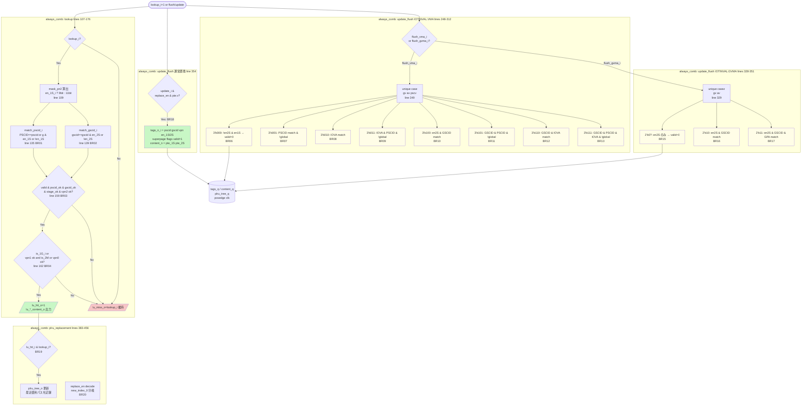

# モジュール: `rv_iommu_iotlb_sv39x4`

> Claude 向け 1-pager。RTL 解析結果 + テスト網羅状況 + 既知の制約の統合ビュー。

---

## Quick Reference

| 項目 | 値 |
|---|---|
| **役割 (1 行)** | S1/S2 両ステージの PTE をキャッシュする完全連想 IOTLB (Sv39x4 対応、PLRU 置換) |
| **RTL ファイル** | `rtl/translation_logic/rv_iommu_iotlb_sv39x4.sv` (~499 行) |
| **親モジュール** | `rtl/translation_logic/wrapper/rv_iommu_tw_sv39x4_pc.sv:433`、`rv_iommu_tw_sv39x4.sv:345` |
| **TB ファイル** | なし (未作成) |
| **TB ラッパ** | なし |
| **仕様書対応** | IOMMU Spec §3.8 (キャッシュ無効化) + `doc/spec/riscv-iommu/06-chapter-3.-data-structures.md` |
| **最終更新** | 2026-04-27 by Claude |

---

## 1. 概要

`rv_iommu_iotlb_sv39x4` は Sv39x4 仮想メモリスキームに準拠した **IO Translation Lookaside Buffer** である。
1 エントリに S1 PTE (`pte_1S`) と S2 PTE (`pte_2S`) を同時格納することで、ネストされた 2 段アドレス変換のキャッシュを実現する。

本モジュールはアドレス変換ラッパー (`rv_iommu_tw_sv39x4_pc`) のコアコンポーネントであり、
**PTW がページテーブルウォークを完了するとエントリを挿入** (`update_i`)、
**`IOTINVAL.VMA` / `IOTINVAL.GVMA` コマンドで個別または全エントリを無効化** する。

3 本の組み合わせ論理ブロック (lookup / update_flush / plru_replacement) と 1 本のフリップフロップ更新ブロックで構成される。**FSM は持たない**。

- IOTLB_ENTRIES は 2 の倍数かつ > 1 である必要がある (line 478 アサート)。
- VPN2 のマスク幅は `en_1S_i` に依存: S1 有効 → 9bit、S1 無効 (S2 only) → 11bit。これが Sv39x4 の GPA 拡張を吸収する (line 109)。

---

## 2. パラメータ

| パラメータ | 型 | デフォルト | 役割 | 影響範囲 |
|---|---|---|---|---|
| `IOTLB_ENTRIES` | `int unsigned` | `4` | TLB エントリ数 (2 の倍数 & > 1 必須) | `tags_q/content_q` 配列長; `plru_tree_q` = `2*(IOTLB_ENTRIES-1)` bit |

---

## 3. I/O ポート

### 3.1 Inputs

| 信号 | bit 幅 | 役割 | 駆動元 | TB での操作 |
|---|---|---|---|---|
| `clk_i` | 1 | 立ち上がりエッジクロック | システムクロック | `cocotb.Clock` |
| `rst_ni` | 1 | 非同期アクティブ Low リセット | システムリセット | 起動時 Low→High |
| `flush_vma_i` | 1 | IOTINVAL.VMA 無効化トリガ | CQ ハンドラ経由でラッパーから | High パルス |
| `flush_gvma_i` | 1 | IOTINVAL.GVMA 無効化トリガ | 同上 | High パルス |
| `flush_av_i` | 1 | フラッシュ対象 ADDR フィールド有効 | CQ ハンドラ | case 条件として使用 |
| `flush_gv_i` | 1 | フラッシュ対象 GSCID フィールド有効 | CQ ハンドラ | case 条件として使用 |
| `flush_pscv_i` | 1 | フラッシュ対象 PSCID フィールド有効 | CQ ハンドラ | case 条件として使用 |
| `flush_vpn_i` | `riscv::GPPNW` | フラッシュ対象 VPN / GPA の PPN | CQ ハンドラ | アドレス設定 |
| `flush_gscid_i` | 16 | フラッシュ対象 GSCID | CQ ハンドラ | VM identifier |
| `flush_pscid_i` | 20 | フラッシュ対象 PSCID | CQ ハンドラ | Process address space ID |
| `update_i` | 1 | エントリ挿入トリガ | PTW (`ptw_update` / `iotlb_update` in wrapper) | High パルス |
| `up_1S_2M_i` | 1 | 挿入エントリ: S1 2MiB superpage | PTW | superpage フラグ |
| `up_1S_1G_i` | 1 | 挿入エントリ: S1 1GiB superpage | PTW | superpage フラグ |
| `up_2S_2M_i` | 1 | 挿入エントリ: S2 2MiB superpage | PTW | superpage フラグ |
| `up_2S_1G_i` | 1 | 挿入エントリ: S2 1GiB superpage | PTW | superpage フラグ |
| `up_is_msi_i` | 1 | 挿入エントリ: S2 が MSI マッピング | PTW | MSI フラグ |
| `up_vpn_i` | `riscv::GPPNW` | 挿入エントリの VPN | PTW | タグ書き込み |
| `up_pscid_i` | 20 | 挿入エントリの PSCID | PTW | タグ書き込み |
| `up_gscid_i` | 16 | 挿入エントリの GSCID | PTW | タグ書き込み |
| `up_1S_content_i` | `riscv::pte_t` | 挿入 S1 PTE データ | PTW | PTE 設定 |
| `up_2S_content_i` | `riscv::pte_t` | 挿入 S2 PTE データ | PTW | PTE 設定 |
| `lookup_i` | 1 | ルックアップ有効フラグ | ラッパー (`iotlb_access`) | High にしてルックアップ |
| `lu_iova_i` | `riscv::VLEN` | ルックアップ対象 IOVA | ラッパー (DMA アドレス) | IOVA 入力 |
| `lu_pscid_i` | 20 | ルックアップ対象 PSCID | ラッパー | PSCID 入力 |
| `lu_gscid_i` | 16 | ルックアップ対象 GSCID | ラッパー | GSCID 入力 |
| `en_1S_i` | 1 | S1 (IOVA→GPA) 有効フラグ | ラッパー (`S1_en`) | 変換設定 |
| `en_2S_i` | 1 | S2 (GPA→SPA) 有効フラグ | ラッパー (`S2_en`) | 変換設定 |

### 3.2 Outputs

| 信号 | bit 幅 | 役割 | 行き先 | TB での観測 |
|---|---|---|---|---|
| `lu_hit_o` | 1 | IOTLB ヒット | ラッパー (`iotlb_lu_hit`) | ヒット確認 |
| `lu_miss_o` | 1 | IOTLB ミス (`=lookup_i & !hit`) | ラッパー (`iotlb_lu_miss`) | PTW 起動トリガとして確認 |
| `lu_1S_content_o` | `riscv::pte_t` | ヒット S1 PTE | ラッパー (`iotlb_lu_1S_content`) | PTE 内容確認 |
| `lu_2S_content_o` | `riscv::pte_t` | ヒット S2 PTE | ラッパー (`iotlb_lu_2S_content`) | PTE 内容確認 |
| `lu_1S_2M_o` | 1 | ヒットエントリ: S1 2MiB superpage | ラッパー | superpage 確認 |
| `lu_1S_1G_o` | 1 | ヒットエントリ: S1 1GiB superpage | ラッパー | superpage 確認 |
| `lu_2S_2M_o` | 1 | ヒットエントリ: S2 2MiB superpage | ラッパー | superpage 確認 |
| `lu_2S_1G_o` | 1 | ヒットエントリ: S2 1GiB superpage | ラッパー | superpage 確認 |
| `lu_is_msi_o` | 1 | ヒットエントリ: S2 が MSI マッピング | ラッパー (`iotlb_lu_is_msi`) | MSI フロー確認 |

---

## 4. 内部状態

### 4.1 FSM

本モジュールには FSM なし。PLRU 置換ツリーが唯一のシーケンシャル状態。

### 4.2 主要な内部レジスタ

| レジスタ | bit 幅 | 初期値 | 更新タイミング | 用途 |
|---|---|---|---|---|
| `tags_q` | `[IOTLB_ENTRIES-1:0]` struct | 全 0 (valid=0) | posedge clk / rst | エントリのタグ (vpn, pscid, gscid, superpage フラグ, en_1S/2S, valid) |
| `content_q` | `[IOTLB_ENTRIES-1:0]` struct | 全 0 | posedge clk / rst | エントリのコンテンツ (pte_1S, pte_2S) |
| `plru_tree_q` | `2*(IOTLB_ENTRIES-1)` | 全 0 | posedge clk / rst | PLRU バイナリツリー (ヒット時に更新) |

**`tags_q` エントリのフィールド構成** (`rv_iommu_iotlb_sv39x4.sv:72-86`):

| フィールド | bit | 説明 |
|---|---|---|
| `pscid` | 20 | Process address space ID |
| `gscid` | 16 | VM (guest) identifier |
| `vpn2` | `riscv::GPPN2+1` | VPN[2]: Sv39x4 では S2 only 時 11-bit |
| `vpn1` | 9 | VPN[1] |
| `vpn0` | 9 | VPN[0] |
| `is_1S_2M` | 1 | S1: 2MiB superpage |
| `is_1S_1G` | 1 | S1: 1GiB superpage |
| `is_2S_2M` | 1 | S2: 2MiB superpage |
| `is_2S_1G` | 1 | S2: 1GiB superpage |
| `is_msi` | 1 | S2 がMSI マッピング |
| `en_1S` | 1 | エントリ格納時の S1 有効設定 |
| `en_2S` | 1 | エントリ格納時の S2 有効設定 |
| `valid` | 1 | エントリ有効ビット |

---

## 5. データフロー / 分岐図



---

## 6. 条件分岐一覧

### 6.1 分岐マトリクス

| BR-ID | 所在 (file:line) | 条件式 | 真分岐の出力・副作用 | 偽分岐の出力・副作用 | 関連 T-ID |
|---|---|---|---|---|---|
| `BR01` | `rv_iommu_iotlb_sv39x4.sv:135` | `((lu_pscid_i == tags_q[i].pscid \|\| pte_1S.g) && en_1S_i) \|\| !en_1S_i` | `match_pscid[i]=1` | `match_pscid[i]=0` | — |
| `BR02` | `rv_iommu_iotlb_sv39x4.sv:139` | `(lu_gscid_i == tags_q[i].gscid && en_2S_i) \|\| !en_2S_i` | `match_gscid[i]=1` | `match_gscid[i]=0` | — |
| `BR03` | `rv_iommu_iotlb_sv39x4.sv:159` | `tags_q[i].valid && match_pscid[i] && match_gscid[i] && match_stage[i] && (vpn2 == tags_q[i].vpn2 & mask_pn2)` | ページサイズ比較へ進む | ミス継続 | — |
| `BR04` | `rv_iommu_iotlb_sv39x4.sv:162` | `is_1G[i] \|\| (vpn1==tags_q[i].vpn1 && (is_2M[i] \|\| vpn0==tags_q[i].vpn0))` | `lu_hit_o=1`, コンテンツ出力 | ミス継続 | — |
| `BR05` | `rv_iommu_iotlb_sv39x4.sv:248` | `flush_vma_i` | VMA case へ | GVMA or update へ | — |
| `BR06` | `rv_iommu_iotlb_sv39x4.sv:252` | case 3'b000: `!tags_q[i].en_2S && tags_q[i].en_1S` | `tags_n[i].valid=0` | スキップ | — |
| `BR07` | `rv_iommu_iotlb_sv39x4.sv:258` | case 3'b001: `(!en_2S && en_1S) && PSCID match && !g` | `tags_n[i].valid=0` | スキップ | — |
| `BR08` | `rv_iommu_iotlb_sv39x4.sv:264` | case 3'b010: `(!en_2S && en_1S) && IOVA match` | `tags_n[i].valid=0` | スキップ | — |
| `BR09` | `rv_iommu_iotlb_sv39x4.sv:272` | case 3'b011: `(!en_2S && en_1S) && IOVA match && PSCID match && !g` | `tags_n[i].valid=0` | スキップ | — |
| `BR10` | `rv_iommu_iotlb_sv39x4.sv:281` | case 3'b100: `(en_2S && en_1S) && GSCID match` | `tags_n[i].valid=0` | スキップ | — |
| `BR11` | `rv_iommu_iotlb_sv39x4.sv:287` | case 3'b101: `(en_2S && en_1S) && GSCID match && PSCID match && !g` | `tags_n[i].valid=0` | スキップ | — |
| `BR12` | `rv_iommu_iotlb_sv39x4.sv:295` | case 3'b110: `(en_2S && en_1S) && IOVA match && GSCID match` | `tags_n[i].valid=0` | スキップ | — |
| `BR13` | `rv_iommu_iotlb_sv39x4.sv:304` | case 3'b111: `(en_2S && en_1S) && IOVA match && GSCID match && PSCID match && !g` | `tags_n[i].valid=0` | スキップ | — |
| `BR14` | `rv_iommu_iotlb_sv39x4.sv:328` | `else if(flush_gvma_i)` | GVMA case へ | update else if へ | — |
| `BR15` | `rv_iommu_iotlb_sv39x4.sv:332` | casez 2'b0?: `tags_q[i].en_2S` | `tags_n[i].valid=0` | スキップ | — |
| `BR16` | `rv_iommu_iotlb_sv39x4.sv:338` | casez 2'b10: `en_2S && GSCID match` | `tags_n[i].valid=0` | スキップ | — |
| `BR17` | `rv_iommu_iotlb_sv39x4.sv:344` | casez 2'b11: `en_2S && GSCID match && GPA match` | `tags_n[i].valid=0` | スキップ | — |
| `BR18` | `rv_iommu_iotlb_sv39x4.sv:354` | `update_i && replace_en[i] && ((en_1S_i && up_1S_content_i.v) \|\| (en_2S_i && up_2S_content_i.v))` | tags_n/content_n 更新 + valid=1 | スキップ | — |
| `BR19` | `rv_iommu_iotlb_sv39x4.sv:411` | `lu_hit[i] && lookup_i` | PLRU ツリー更新 | plru_tree_n 変化なし | — |
| `BR20` | `rv_iommu_iotlb_sv39x4.sv:448` | `new_index[0]` | `en &= plru_tree_q[...]` (set 側) | `en &= ~plru_tree_q[...]` (clear 側) | — |

### 6.2 複雑な分岐の詳細

#### `BR01`+`BR02`: PSCID / GSCID マッチング論理

```systemverilog
// rv_iommu_iotlb_sv39x4.sv:135-139
match_pscid[i] = (((lu_pscid_i == tags_q[i].pscid) || content_q[i].pte_1S.g) && en_1S_i) || !en_1S_i;
match_gscid[i] = (lu_gscid_i == tags_q[i].gscid && en_2S_i) || !en_2S_i;
```

- **PSCID 3パス**: (1) S1 無効 → always match、(2) S1 有効でグローバルページ (g=1) → always match、(3) S1 有効でローカル → PSCID 一致のみ
- **GSCID 2パス**: (1) S2 無効 → always match、(2) S2 有効 → GSCID 一致のみ
- **仕様対応**: IOMMU Spec §3.8「グローバルエントリ (G=1) は PSCID に関係なくヒットする」

#### `BR03`: エントリマッチ (VPN2 mask_pn2 含む)

```systemverilog
// rv_iommu_iotlb_sv39x4.sv:109, 159
mask_pn2 = en_1S_i ? ((2**(riscv::VPN2+1))-1) : ((2**(riscv::GPPN2+1))-1);
// ...
if (tags_q[i].valid && match_pscid[i] && match_gscid[i] && match_stage[i] &&
    (vpn2 == (tags_q[i].vpn2 & mask_pn2)))
```

- S1 有効 (Sv39): VPN2 = 9bit; S2 only (Sv39x4): VPN2 = 11bit (GPA の拡張ビット分)
- `match_stage[i]` (line 156) は `en_1S_i/en_2S_i` が格納時と同一かを確認 → ステージ設定が変わった場合はキャッシュ汚染しない

#### `BR18`: 挿入条件

```systemverilog
// rv_iommu_iotlb_sv39x4.sv:354
else if (update_i && replace_en[i] && ((en_1S_i && up_1S_content_i.v) || (en_2S_i && up_2S_content_i.v)))
```

- `en_1S_i && up_1S_content_i.v`: S1 が有効かつ S1 PTE の V ビットが 1 の場合
- `en_2S_i && up_2S_content_i.v`: S2 が有効かつ S2 PTE の V ビットが 1 の場合
- **いずれか一方でも真なら挿入** (両方 V=0 の場合は挿入しない)
- MSI エントリ (`up_is_msi_i=1`) の場合、`up_2S_content_i.v` は MSI PTE の V ビットになる

#### `BR15` (GVMA casez 2'b0?): don't care

```systemverilog
// rv_iommu_iotlb_sv39x4.sv:329-334
unique casez ({flush_gv_i, flush_av_i})
    2'b0?: begin   // GV=0, AV は don't care
        if(tags_q[i].en_2S) tags_n[i].valid = 1'b0;
    end
```

- `flush_gv_i=0` の場合、`flush_av_i` の値に関わらず S2 有効な全エントリを無効化
- S1 エントリ (en_2S=0) は GVMA 操作の影響を受けない

---

## 7. モジュール間連携

### 7.1 上流 (呼び出し元)

| 相手モジュール | 駆動される信号 | 戻す信号 | 発生条件 | BR-ID |
|---|---|---|---|---|
| `rv_iommu_tw_sv39x4_pc` (`rv_iommu_tw_sv39x4_pc.sv:433`) | `lookup_i`, `lu_iova_i`, `lu_pscid_i`, `lu_gscid_i`, `en_1S_i`, `en_2S_i` | `lu_hit_o`, `lu_miss_o`, `lu_*_content_o`, `lu_*_msi_o` | DMA トランザクション受信時に毎サイクル | BR01-BR04 |
| 同上 | `flush_vma_i`, `flush_gvma_i`, `flush_{av,gv,pscv}_i`, `flush_vpn_i`, `flush_gscid_i`, `flush_pscid_i` | (なし) | CQ に IOTINVAL コマンドが来た場合 | BR05-BR17 |
| 同上 | `update_i`, `up_*` | (なし) | PTW 完了後 | BR18 |

### 7.2 下流 (呼び出し先)

本モジュールからさらに呼び出すサブモジュールは存在しない。  
`rv_iommu_pkg.sv` の関数 (`is_trans_1G`, `is_trans_2M`, `make_gppn`) を組み合わせ論理内でインライン展開する (`rv_iommu_iotlb_sv39x4.sv:141-153, 220`)。

### 7.3 横の連携 (並列モジュール)

| 相手モジュール | やり取り信号 | 発生条件 | 目的 | BR-ID |
|---|---|---|---|---|
| `rv_iommu_ptw_sv39x4_pc` | update 系信号 (ラッパー経由) | PTW 完了時 | PTW 結果を IOTLB に書き込む | BR18 |
| `rv_iommu_ddtc` / `rv_iommu_pdtc` | flush 系信号 (ラッパー経由、共通バス) | IOTINVAL コマンド受信時 | 全キャッシュを一斉無効化 | BR05-BR17 |

---

## 8. タイミング / プロトコル注意点

### 8.1 ハンドシェイク

- **ルックアップ**: `lookup_i=1` をアサートするだけで同サイクル中に `lu_hit_o` / `lu_miss_o` が組み合わせ論理で確定する (1 サイクルレイテンシなし)。
- **`lookup_i=0` の場合**: `lu_hit_o=0`, `lu_miss_o=0` — ヒット/ミスとも無効。`lookup_i` を High に保持しないとヒット信号が消える (CLAUDE.md 既知制約 参照)。
- **更新 (`update_i=1`)**: 更新は `always_comb : update_flush` → `always_ff` の 2 段で完了するため、挿入したエントリが次のサイクル以降に有効になる。

### 8.2 flush と update の同時アサート

- `always_comb : update_flush` は `flush_vma_i → flush_gvma_i → update` の優先順 (`if / else if / else if`) で処理される (`rv_iommu_iotlb_sv39x4.sv:248-374`)。
- `flush_vma_i=1` と `update_i=1` が同一サイクルに来た場合: **フラッシュが優先**され、同サイクルの更新は無視される。

### 8.3 PLRU ツリー更新タイミング

- ヒット時 (`lu_hit[i]=1 && lookup_i=1`): `plru_tree_n` は **同じ always_comb サイクル**に更新計算される (line 411)。
- `plru_tree_q` は次の `posedge clk` で確定。
- リセット時: `plru_tree_q = 0` → entry 0 が最初の置換対象になる。

### 8.4 リセット時の挙動

- `rst_ni=0`: `tags_q`, `content_q`, `plru_tree_q` が全 0 にリセット → 全エントリ無効 (valid=0)。
- リセット解除後の最初のサイクル: ルックアップは必ず miss、置換対象は entry 0 (PLRU tree = 0)。

### 8.5 マルチクロック / 非同期要素

- 単一クロック同期 (`clk_i`)。非同期リセット (`rst_ni`)。

---

## 9. テストマトリクス

### 9.1 正常動作

| T-ID | 項目 | 入力 / トリガ | 期待出力 | TB 場所 | BR-ID | Last Run | Status |
|---|---|---|---|---|---|---|---|
| | | | | | | | |

### 9.2 エッジケース

| T-ID | 項目 | 入力 / トリガ | 期待出力 | TB 場所 | BR-ID | Last Run | Status |
|---|---|---|---|---|---|---|---|
| | | | | | | | |

### 9.3 フォルト系

| T-ID | 項目 | 入力 / トリガ | 期待出力 | TB 場所 | BR-ID | Last Run | Status |
|---|---|---|---|---|---|---|---|
| | | | | | | | |

### 9.4 カバレッジサマリ

| カテゴリ | 計 | PASS | FAIL | SKIP | PENDING |
|---|---|---|---|---|---|
| 正常動作 | 0 | 0 | 0 | 0 | 0 |
| エッジケース | 0 | 0 | 0 | 0 | 0 |
| フォルト系 | 0 | 0 | 0 | 0 | 0 |
| **合計** | **0** | **0** | **0** | **0** | **0** |

---

## 10. テスト実装ノート

### 10.1 TB 構築上の注意

- `IOTLB_ENTRIES` は 2 の倍数かつ >1 でないとアサート失敗 (`rv_iommu_iotlb_sv39x4.sv:478`)。最小値は 2。
- ルックアップは組み合わせ論理なので、`lookup_i=1` をアサートしたサイクルの `lu_hit_o` をサンプリングするだけで結果が得られる。
- S1+S2 両方有効のエントリは `match_stage` 条件により S1 only や S2 only のルックアップにはヒットしない。テストシナリオ作成時は注意。
- フラッシュテストでは VMA の 8 ケース (`{gv,av,pscv}` 全組み合わせ) と GVMA の 3 ケース (`{gv,av}`) を網羅する必要がある (BR06-BR17)。

### 10.2 Force 方式の適用

未使用 (内部 `tags_q`, `content_q` は直接観察できるが、cocotb 上は階層参照で `dut.tags_q` を読むだけでよい)。

### 10.3 観測しづらい信号

| 信号 | 観測方法 |
|---|---|
| `tags_q[i].valid` | 波形 / `dut.tags_q[i].valid` 階層参照 |
| `plru_tree_q` | 波形確認 (PLRU ツリー全体が `2*(N-1)` bit のベクタとして見える) |
| `replace_en` | 組み合わせ信号のため波形で確認 |
| `lu_hit[i]` | 組み合わせ信号。`lu_hit_o` だけではどのエントリがヒットしたか不明 → 波形で確認 |

---

## 11. ログパース用ヒント

### 11.1 cocotb ログの PASS/FAIL マーカ書式

```
(TBD — TB 未作成)
```

### 11.2 T-ID とテスト関数名のマッピング

| T-ID | 関数名 |
|---|---|
| (TBD) | (TBD) |

### 11.3 自動更新スクリプト呼び出し例

```bash
python3 scripts/update_test_status.py \
    doc/modules/translation_logic/rv_iommu_iotlb_sv39x4.md \
    tb_coco/test/translation_logic/sim.log
```

---

## 12. 既知の挙動 / TODO / 要検証項目

### 12.1 実装の既知の制約

- [ ] **flush 優先**: `flush_vma_i=1` と `update_i=1` が同サイクルに来ると flush が優先され、更新は無視される (`rv_iommu_iotlb_sv39x4.sv:248-354`)。PTW 完了とフラッシュのレース条件を検証する必要がある。
- [ ] **`lookup_i=0` 時のヒット消滅**: `lu_hit_o` は組み合わせ論理で `lookup_i` と AND されているため、`lookup_i` を Low にすると即座に `lu_hit_o=0` になる。ラッパー側がヒット信号を登録する前に `lookup_i` を下げないこと (CLAUDE.md 参照)。
- [ ] **S2-only エントリの IOTINVAL.VMA**: BR06-BR09 はすべて `!tags_q[i].en_2S && tags_q[i].en_1S` 条件を含む。**S2-only エントリ (en_2S=1, en_1S=0) は IOTINVAL.VMA でフラッシュされない**。IOTINVAL.GVMA が必要。
- [ ] **`IOTLB_ENTRIES` がパワー2 以外**: アサートで停止する (simulation only、synthesis では $error なし)。

### 12.2 仕様との差異 / 要検証項目

- [ ] **VMA 3'b100 (BR10) に S1-only エントリ**: 条件は `en_2S && en_1S` なので **S2+S1 同時有効エントリのみ**対象。GV=1 で S1-only エントリ (en_2S=0) は BR10 でフラッシュされない。仕様 §3.8 の「GSCID に対応する全エントリ」との整合性を確認すべき。
- [ ] **MSI エントリの挿入条件** (BR18): `up_is_msi_i=1` の場合、`up_2S_content_i.v` は MSI PTE の V ビット。MSI PTE が V=0 のときは挿入されない。**推測:** MSI PTE は常に V=1 で PTW から来るはず。

### 12.3 TODO

- [ ] TB 新規作成 (`tb_coco/test/translation_logic/iotlb/`)
- [ ] IOTINVAL.VMA / GVMA の全 11 ケース (BR06-BR17) を網羅するディレクテッドテスト
- [ ] PLRU 置換順序の検証 (4 エントリで 4 回ミス → LRU エントリが上書きされることの確認)
- [ ] superpage (1G / 2M) ヒット確認テスト

---

## 13. 関連仕様

| トピック | 参照ファイル |
|---|---|
| IOTLB キャッシュ無効化 (IOTINVAL.VMA / GVMA) | `doc/spec/riscv-iommu/06-chapter-3.-data-structures.md` §3.8 |
| ソフトウェアによる無効化手順 | `doc/spec/riscv-iommu/10-chapter-7.-software-guidelines.md` |
| Sv39 PTE フォーマット (R/W/X/U/G/V/A/D) | `doc/spec/riscv-privileged/14-chapter-12.-supervisor-level-isa-version-1.13.md` |
| G-stage (Sv39x4) / GPPN2 拡張 | `doc/spec/riscv-privileged/24-chapter-22.-h-extension-for-hypervisor-support-version-1.0.md` |

---

## 14. 変更履歴

| 日付 | 変更者 | 内容 |
|---|---|---|
| 2026-04-27 | Claude | 初版作成 (`rv_iommu_iotlb_sv39x4.sv` 499 行を全解析、BR01-BR20 を抽出) |
