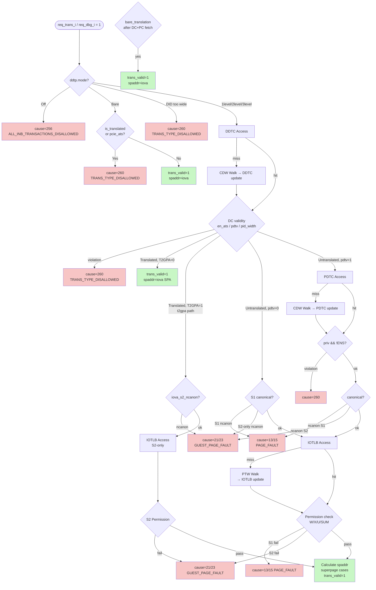

# モジュール: `rv_iommu_tw_sv39x4_pc`

> Claude 向け 1-pager。RTL 解析結果 + テスト網羅状況 + 既知の制約の統合ビュー。

---

## Quick Reference

| 項目 | 値 |
|---|---|
| **役割 (1 行)** | アドレス変換全体の組合せロジックオーケストレータ。DDTC/PDTC/IOTLB/PTW/CDW/MSI-PTW を束ね、IOMMU 仕様 §3 の変換アルゴリズムをステートレスに実装する |
| **RTL ファイル** | `rtl/translation_logic/wrapper/rv_iommu_tw_sv39x4_pc.sv` (~1139 行) |
| **親モジュール** | `rtl/translation_logic/wrapper/rv_iommu_translation_wrapper.sv:132` |
| **TB ファイル** | なし (PTW 単体: `tb_coco/test/translation_logic/ptw/`) |
| **TB ラッパ** | `tb_coco/test/translation_logic/ptw/tb_rv_iommu_ptw_sv39x4_pc_wrapper.sv` (Force ベース) |
| **仕様書対応** | `doc/spec/riscv-iommu/06-chapter-3.-data-structures.md` §3.3 / §3.1.3.5 |
| **最終更新** | `2026-04-27` by Claude |

---

## 1. 概要

`rv_iommu_tw_sv39x4_pc` は RISC-V IOMMU 仕様の変換アルゴリズム (IOMMU Spec §3) を実装する中核モジュールである。
`always_comb : translation` ブロック (line 839) がすべての変換決定ロジックを担う: DDTC/PDTC ルックアップ → DC/PC フィールドから S1/S2 設定抽出 → IOTLB ルックアップ → IOVA 正規化チェック → 権限チェック → spaddr 計算という流れをステートレスに実現する。
PTW・CDW・MSI-PTW はキャッシュミス時に起動される別個のサブモジュールであり、本モジュールはそれらの起動条件と結果ルーティングを管理する。
プロセスコンテキスト (`InclPC` 相当) および MSI 変換 (`MSITrans` パラメータ) をサポートし、`MSITrans != MSI_DISABLED` のとき MSI PTW・MRIF サポートがコンパイル時に有効化される。

---

## 2. パラメータ

| パラメータ | 型 | デフォルト | 役割 | 影響範囲 |
|---|---|---|---|---|
| `IOTLB_ENTRIES` | `int unsigned` | `4` | IOTLB エントリ数 | `rv_iommu_iotlb_sv39x4` |
| `DDTC_ENTRIES` | `int unsigned` | `4` | DDTC エントリ数 | `rv_iommu_ddtc` |
| `PDTC_ENTRIES` | `int unsigned` | `4` | PDTC エントリ数 | `rv_iommu_pdtc` |
| `MRIFC_ENTRIES` | `int unsigned` | `4` | MRIF キャッシュエントリ数 | `rv_iommu_mrifc` (MSI_FLAT_MRIF のみ) |
| `MSITrans` | `rv_iommu::msi_trans_t` | `MSI_DISABLED` | MSI 変換モード | `gen_msi_support` (line 551), `gen_mrif_support` (line 668) |
| `axi_req_t` | `type` | `logic` | AXI 要求 struct 型 | PTW/CDW/MSI PTW に転送 |
| `axi_rsp_t` | `type` | `logic` | AXI 応答 struct 型 | 同上 |
| `DC_WIDTH` | `int` | `-1` | DC struct のビット幅 | DDTC content 幅 |

---

## 3. I/O ポート

### 3.1 Inputs

| 信号 | bit 幅 | 役割 | 駆動元 | TB での操作 |
|---|---|---|---|---|
| `clk_i` | 1 | クロック | 上位 | Clock 生成 |
| `rst_ni` | 1 | アクティブ Low リセット | 上位 | リセットシーケンス |
| `req_trans_i` | 1 | 通常変換トリガ | `riscv_iommu` FSM | `dut.req_trans_i.value = 1` |
| `req_dbg_i` | 1 | デバッグ変換トリガ | `riscv_iommu` FSM | `dut.req_dbg_i.value = 1` |
| `did_i` | 24 | device_id | AXI AxMMUSID | —  |
| `pv_i` | 1 | 有効な process_id が付随 | AXI AxMMUSSIDV | — |
| `pid_i` | 20 | process_id | AXI AxMMUSSID | — |
| `iova_i` | `VLEN` | 変換対象 IOVA | AXI AxADDR | — |
| `trans_type_i` | `TTYP_LEN` | トランザクション種別 (R/W/RX/PCIe ATS) | 上位 | — |
| `priv_lvl_i` | 1 | 特権レベル (S=1 / U=0) | AxPROT[0] | — |
| `cdw_axi_resp_i` | `axi_rsp_t` | CDW メモリ応答 | DS IF | モック AXI スレーブ |
| `ptw_axi_resp_i` | `axi_rsp_t` | PTW メモリ応答 | DS IF | モック AXI スレーブ |
| `msiptw_axi_resp_i` | `axi_rsp_t` | MSI PTW メモリ応答 | DS IF | モック AXI スレーブ |
| `mrif_handler_axi_resp_i` | `axi_rsp_t` | MRIF handler 応答 | DS IF | モック AXI スレーブ |
| `capabilities_i` | struct | capabilities レジスタ | Regmap | force/drive |
| `fctl_i` | struct | fctl レジスタ | Regmap | force/drive |
| `ddtp_i` | struct | ddtp レジスタ | Regmap | force/drive |
| `msi_write_error_i` | 1 | MSI 書き込みエラー | SW IF Wrapper | — |
| `flush_ddtc_i` … `flush_pscid_i` | 各 1/24/20/16 等 | IOATC flush 制御 | CQ Handler | — |
| `msi_data_valid_i` | 1 | MSI データ有効 | W チャネル | — |
| `msi_data_i` | 32 | MSI データ | W.data[31:0] | — |

### 3.2 Outputs

| 信号 | bit 幅 | 役割 | 行き先 | TB での観測 |
|---|---|---|---|---|
| `gscid_o` | 16 | GSCID (DC から) | 上位 / FQ | `dut.gscid_o.value` |
| `pscid_o` | 20 | PSCID (DC/PC から) | 上位 / FQ | `dut.pscid_o.value` |
| `trans_valid_o` | 1 | 変換成功フラグ | 上位 FSM | `wait_completion()` |
| `spaddr_o` | `PLEN` | 変換済み物理アドレス | 上位 FSM | `dut.spaddr_o.value` |
| `is_superpage_o` | 1 | スーパーページフラグ | DBG IF | — |
| `trans_error_o` | 1 | 変換エラーフラグ | 上位 FSM | `wait_completion()` |
| `report_fault_o` | 1 | FQ への障害報告イネーブル | SW IF Wrapper (FQ) | — |
| `cause_code_o` | `CAUSE_LEN` | 障害コード | SW IF Wrapper (FQ) | `dut.cause_code_o.value` |
| `is_guest_pf_o` | 1 | ゲストページフォルト | FQ | — |
| `is_implicit_o` | 1 | 暗黙的アクセス由来 GPF | FQ | — |
| `bad_gpaddr_o` | `SVX` | 不正 GPA (GPF 時) | FQ | — |
| `iotlb_miss_o` | 1 | IOTLB ミス | HPM | — |
| `ddt_walk_o` | 1 | DDT ウォーク | HPM | — |
| `pdt_walk_o` | 1 | PDT ウォーク | HPM | — |
| `s1_ptw_o` | 1 | 1st-stage PTW | HPM | — |
| `s2_ptw_o` | 1 | 2nd-stage PTW | HPM | — |
| `ignore_request_o` | 1 | MRIF 処理のため要求を無視 | 上位 FSM | — |
| `cdw_axi_req_o` | `axi_req_t` | CDW メモリ要求 | DS IF | — |
| `ptw_axi_req_o` | `axi_req_t` | PTW メモリ要求 | DS IF | — |
| `msiptw_axi_req_o` | `axi_req_t` | MSI PTW メモリ要求 | DS IF | — |
| `mrif_handler_axi_req_o` | `axi_req_t` | MRIF handler 要求 | DS IF | — |

### 3.3 双方向 / バス

| グループ | 方向 | 型 | 接続先 | プロトコル |
|---|---|---|---|---|
| `ptw_axi_req_o` / `ptw_axi_resp_i` | out/in | `axi_req_t`/`axi_rsp_t` | DS IF → PTW | AXI4 (PTW がメモリをフェッチ) |
| `cdw_axi_req_o` / `cdw_axi_resp_i` | out/in | 同上 | DS IF → CDW | AXI4 |
| `msiptw_axi_req_o` / `msiptw_axi_resp_i` | out/in | 同上 | DS IF → MSI PTW | AXI4 (MSITrans 有効時のみ) |
| `mrif_handler_axi_req_o` / `mrif_handler_axi_resp_i` | out/in | 同上 | DS IF → MRIF handler | AXI4 (MSI_FLAT_MRIF のみ) |

---

## 4. 内部状態

本モジュール自体にはレジスタ・FSM がない (純粋な組合せロジック + サブモジュール)。
状態はサブモジュール (DDTC/PDTC/IOTLB/PTW/CDW) が保持する。

### 4.1 主要な内部組合せシグナル

| シグナル | 定義箇所 | 用途 |
|---|---|---|
| `S1_en` | `rv_iommu_tw_sv39x4_pc.sv:230` | DC から Stage 1 有効判定 |
| `S2_en` | `rv_iommu_tw_sv39x4_pc.sv:232` | DC から Stage 2 有効判定 |
| `is_translated` | `rv_iommu_tw_sv39x4_pc.sv:155` | `trans_type[3:2]=01` → Translated Request |
| `is_pcie_tr_req` | `rv_iommu_tw_sv39x4_pc.sv:159` | PCIe ATS Translation Request |
| `is_store` | `rv_iommu_tw_sv39x4_pc.sv:164` | `trans_type[1:0]=11` && not PCIe ATS |
| `is_rx` | `rv_iommu_tw_sv39x4_pc.sv:169` | Read-for-execute |
| `iova_s1_ncanon` | `rv_iommu_tw_sv39x4_pc.sv:237` | Sv39 正規化違反: `iova[63:38] != {26{iova[38]}}` |
| `iova_s2_ncanon` | `rv_iommu_tw_sv39x4_pc.sv:240` | Sv39x4 正規化違反: `\|iova[63:41]` |
| `init_ptw` | `rv_iommu_tw_sv39x4_pc.sv:356` | PTW 起動条件 |
| `init_msi_trans` | `rv_iommu_tw_sv39x4_pc.sv:364` | MSI PTW 起動条件 |
| `bare_translation` | `rv_iommu_tw_sv39x4_pc.sv:371` | 両ステージ Bare かつ非 MSI |
| `ptw_en_1S` / `ptw_en_2S` | `rv_iommu_tw_sv39x4_pc.sv:244-245` | CDW 暗黙変換中は S1 無効・S2 強制有効 |
| `process_id` | `rv_iommu_tw_sv39x4_pc.sv:288` | `DPE=1 && pv=0` のとき 0 にフォールバック |

---

## 5. データフロー / 分岐図



---

## 6. 条件分岐一覧

### 6.1 分岐マトリクス

| BR-ID | 所在 (file:line) | 条件式 | 真分岐の出力・副作用 | 偽分岐の出力・副作用 | 関連 T-ID |
|---|---|---|---|---|---|
| `BR01` | `rv_iommu_tw_sv39x4_pc.sv:551` | `MSITrans != MSI_DISABLED` (generate) | MSI PTW インスタンス生成、`iova_is_msi` 計算 | 全 MSI 関連シグナルを `0` に assign | TBD |
| `BR02` | `rv_iommu_tw_sv39x4_pc.sv:668` | `MSITrans == MSI_FLAT_MRIF` (generate) | MRIF handler + MRIFC インスタンス生成 | `mrif_handler_ignore/error='0`、`mrifc_lu_hit/miss='0` | TBD |
| `BR03` | `rv_iommu_tw_sv39x4_pc.sv:855` | `req_trans_i \| req_dbg_i` | 変換ロジック実行 | `ddtc_access=0`、全出力デフォルト値 | TBD |
| `BR04` | `rv_iommu_tw_sv39x4_pc.sv:859` | `ddtp.iommu_mode == Off (4'b0000)` | `cause=256 (ALL_INB_TRANSACTIONS_DISALLOWED)`、`wrap_error=1`、`report_always=1` | フォールスルーして Bare チェックへ | TBD |
| `BR05` | `rv_iommu_tw_sv39x4_pc.sv:866` | `ddtp.iommu_mode == Bare (4'b0001)` | Translated/PCIe ATS → TRANS_TYPE_DISALLOWED; else `trans_valid=1, spaddr=iova` | フォールスルーして device_id 幅チェックへ | TBD |
| `BR06` | `rv_iommu_tw_sv39x4_pc.sv:869` | `is_translated \|\| is_pcie_tr_req` (Bare モード内) | `cause=260`, `wrap_error=1`, `report_always=1` | `trans_valid=1, spaddr=iova (Bare passthrough)` | TBD |
| `BR07` | `rv_iommu_tw_sv39x4_pc.sv:883` | `(mode==3level && did[23:15]!=0) \|\| (mode==2level && did[23:6]!=0)` | `cause=260 (TRANS_TYPE_DISALLOWED)`, `report_always=1` | `ddtc_access=1` (IOMMU active) | TBD |
| `BR08` | `rv_iommu_tw_sv39x4_pc.sv:896` | `ddtc_lu_hit` | DC フィールド参照・バリデーション開始 | 何もしない (DDTC ミス → CDW が対応) | TBD |
| `BR09` | `rv_iommu_tw_sv39x4_pc.sv:899` | `(is_translated\|\|ats) && !en_ats` \| `pv && !pdtv` \| `pv && pdtv && pid_wider` | `cause=260`, `wrap_error=1` | 変換タイプ分岐へ続行 | TBD |
| `BR10` | `rv_iommu_tw_sv39x4_pc.sv:911` | `is_translated` | Translated リクエスト処理 (`t2gpa` チェック) | Untranslated リクエスト処理 (`pdtv` チェック) | TBD |
| `BR11` | `rv_iommu_tw_sv39x4_pc.sv:914` | `!dc_base.tc.t2gpa` | `trans_valid=1, spaddr=iova (SPA)` | T2GPA=1: GPA として 2nd-stage 変換 | TBD |
| `BR12` | `rv_iommu_tw_sv39x4_pc.sv:925` | `iova_s2_ncanon` (T2GPA=1 パス内) | GPA canonicalization fault: cause=21/23 | `iotlb_access=1` | TBD |
| `BR13` | `rv_iommu_tw_sv39x4_pc.sv:939` | `!dc_base.tc.pdtv` | PC なし: DC の GSCID/PSCID/PPNs を直接使用 | `pdtc_access=1` | TBD |
| `BR14` | `rv_iommu_tw_sv39x4_pc.sv:944` | `S1_en && iova_s1_ncanon` (pdtv=0 パス) | S1 canonical fault: cause=13/15 | フォールスルーして S2-only チェックへ | TBD |
| `BR15` | `rv_iommu_tw_sv39x4_pc.sv:948` | `!S1_en && S2_en && iova_s2_ncanon` (pdtv=0 パス) | S2-only GPA fault: cause=21/23 | `iotlb_access=1` | TBD |
| `BR16` | `rv_iommu_tw_sv39x4_pc.sv:962` | `(!pv_i && !dpe) \|\| (fsc.mode == Bare)` (pdtv=1 パス) | PC Bare: S1-Bare として扱う (iohgatp から GPA) | `pdtc_access=1` (PC ルックアップ) | TBD |
| `BR17` | `rv_iommu_tw_sv39x4_pc.sv:967` | `S2_en && iova_s2_ncanon` (PC Bare パス) | GPA canonical fault: cause=21/23 | `iotlb_access=1` | TBD |
| `BR18` | `rv_iommu_tw_sv39x4_pc.sv:982` | `pdtc_lu_hit` | PC フィールド参照・権限チェック | 何もしない (PDTC ミス → CDW が対応) | TBD |
| `BR19` | `rv_iommu_tw_sv39x4_pc.sv:985` | `priv_lvl_i && !pdtc_lu_content.ta.ens` | `cause=260 (TRANS_TYPE_DISALLOWED)` | GSCID/PSCID/PPNs 設定、canonical チェックへ | TBD |
| `BR20` | `rv_iommu_tw_sv39x4_pc.sv:995` | `S1_en && iova_s1_ncanon` (PDTC hit 後) | S1 canonical fault: cause=13/15 | フォールスルーして S2-only チェックへ | TBD |
| `BR21` | `rv_iommu_tw_sv39x4_pc.sv:999` | `!S1_en && S2_en && iova_s2_ncanon` (PDTC hit 後) | GPA canonical fault: cause=21/23 | `iotlb_access=1` | TBD |
| `BR22` | `rv_iommu_tw_sv39x4_pc.sv:1009` | `iotlb_lu_hit` | 権限チェック・spaddr 計算 | 何もしない (IOTLB ミス → PTW が対応) | TBD |
| `BR23` | `rv_iommu_tw_sv39x4_pc.sv:1022` | S1 権限チェック失敗 (store !W \| rx !X \| U-mode !U \| S-mode U&&!SUM) | `cause=13/15 (PAGE_FAULT)`, `wrap_error=1`, `trans_valid_o=0` | フォールスルーして S2 権限チェックへ | TBD |
| `BR24` | `rv_iommu_tw_sv39x4_pc.sv:1033` | S2 権限チェック失敗 (store !W \| rx !X) | `cause=21/23 (GUEST_PAGE_FAULT)`, `wrap_error=1` | Address Translation Found: spaddr 計算 | TBD |
| `BR25` | `rv_iommu_tw_sv39x4_pc.sv:1043` | 権限チェック pass → spaddr 計算 | S2/MSI: `spaddr = {2S_content.ppn, iova[11:0]}`; S1-only: `{1S_content.ppn, iova[11:0]}` | — | TBD |
| `BR26` | `rv_iommu_tw_sv39x4_pc.sv:1051` | `S1_en && S2_en` (spaddr 計算内) | 2-stage スーパーページ組合せ case (BR27) | 単一ステージ スーパーページ補正 | TBD |
| `BR27` | `rv_iommu_tw_sv39x4_pc.sv:1052` | `case({1S_2M, 1S_1G, 2S_2M, 2S_1G})` (6 explicit + default) | 各スーパーページ組合せに応じた spaddr[29:12] 補正 | — | TBD |
| `BR28` | `rv_iommu_tw_sv39x4_pc.sv:1085` | `req_dbg_i` (spaddr 計算後) | DBG 用 PPN エンコード: superpage フラグに応じて spaddr bits をマスク | — | TBD |
| `BR29` | `rv_iommu_tw_sv39x4_pc.sv:1103` | `ddtc_lu_hit && (pdtc_lu_hit \|\| !pdtv \|\| !(pv\|\|dpe)) && bare_translation` | Bare passthrough: `trans_valid=1, spaddr=iova` | — | TBD |
| `BR30` | `rv_iommu_tw_sv39x4_pc.sv:1112` | `init_msi_trans & req_dbg_i` | `cause=260 (TRANS_TYPE_DISALLOWED)` (DBG は MSI 不可) | — | TBD |
| `BR31` | `rv_iommu_tw_sv39x4_pc.sv:1128` | `priority case(1'b1)` — wrap/cdw/ptw/msiptw/mrif/msi_write の優先 | 最上位エラーの cause_code を `cause_code_o` に出力 | — | TBD |

### 6.2 複雑な分岐の詳細

#### `BR23`: S1 権限チェック (IOTLB ヒット後)

```systemverilog
// rv_iommu_tw_sv39x4_pc.sv:1022
if  ((is_store && (!iotlb_lu_1S_content.w && S1_en)) ||    // (1) write, !W
     (is_rx && (!iotlb_lu_1S_content.x && S1_en))    ||    // (2) exec, !X
     ((!priv_lvl_i) && !iotlb_lu_1S_content.u && S1_en) || // (3) U-mode, U=0
     (priv_lvl_i && iotlb_lu_1S_content.u && (!pdtc_lu_content.ta.sum || iotlb_lu_1S_content.x) && S1_en) // (4) S-mode, U=1, SUM=0
    )
```

- **SUM フラグ**: `pdtc_lu_content.ta.sum` を参照 — PDTC ヒットがなければ `pdtc_lu_content` は 0 (sum=0)。PDTC を使わないパスでは SUM=0 相当になる (**要検証**)
- **仕様対応**: Priv ISA `doc/spec/riscv-privileged/14-chapter-12.-supervisor-level-isa-version-1.13.md` §12.3.1 Table 4.1
- **テスト**: TBD

#### `BR31`: error_routing priority case

```systemverilog
// rv_iommu_tw_sv39x4_pc.sv:1128
priority case (1'b1)
    wrap_error:         cause_code_o = wrap_cause_code;
    cdw_error:          cause_code_o = cdw_cause_code;
    ptw_error:          cause_code_o = ptw_cause_code;
    msiptw_error:       cause_code_o = msiptw_cause_code;
    mrif_handler_error: cause_code_o = mrif_handler_cause_code;
    msi_write_error_i:  cause_code_o = rv_iommu::MSI_ST_ACCESS_FAULT;
    default:            cause_code_o = '0;
endcase
```

- **priority**: `wrap_error` が最高優先。wrap ロジックが早期リターンを発行した場合、下位のエラーより優先される
- **注意点**: `trans_error_o` は全エラーの OR だが、`cause_code_o` は priority によって 1 つに絞られる

---

## 7. モジュール間連携

### 7.1 上流 (呼び出し元)

| 相手モジュール | 受け取る信号 | 渡す信号 | 発生条件 | BR-ID |
|---|---|---|---|---|
| `rv_iommu_translation_wrapper` (line 132) | `req_trans_i`, `did_i`, `iova_i`, `trans_type_i` 等 | `trans_valid_o`, `trans_error_o`, `spaddr_o`, `cause_code_o` | 変換要求時 | BR03 |
| `rv_iommu_sw_if_wrapper` (Regmap → capabilities/fctl/ddtp) | `capabilities_i`, `fctl_i`, `ddtp_i` | — | 常時 | BR04, BR05, BR07 |
| CQ Handler → flush 信号 | `flush_ddtc_i` 等 | — | Invalidation コマンド実行時 | — |

### 7.2 下流 (呼び出し先)

| 相手モジュール | 駆動する信号 | 受け取る信号 | 発生条件 | BR-ID |
|---|---|---|---|---|
| `rv_iommu_ddtc` (line 380) | `ddtc_access`, `did_i`, `flush_*` | `ddtc_lu_hit`, `ddtc_lu_content` | req active かつ事前エラーなし | BR07→BR08 |
| `rv_iommu_pdtc` (line 404) | `pdtc_access`, `process_id` | `pdtc_lu_hit`, `pdtc_lu_content` | `pdtv=1` かつ DDTC ヒット | BR13/BR16 |
| `rv_iommu_iotlb_sv39x4` (line 433) | `iotlb_access`, `iova_i`, `pscid`, `gscid` | `iotlb_lu_hit`, `iotlb_lu_miss`, `iotlb_lu_1S/2S_content` 等 | canonical チェック通過後 | BR12/BR14/BR15/BR17/BR21 |
| `rv_iommu_ptw_sv39x4_pc` (line 481) | `init_ptw`, `en_1S/2S`, `iosatp_ppn`, `iohgatp_ppn` 等 | `ptw_update`, `ptw_up_*`, `ptw_error`, `gpaddr_is_msi` 等 | IOTLB ミス | BR22 → `init_ptw` |
| `rv_iommu_cdw_pc` (line 759) | `ddtc_access && ~ddtc_lu_hit`, `pdtc_access` | `ddtc_update`, `pdtc_update`, `cdw_error` 等 | DDTC/PDTC ミス | BR08 |
| `rv_iommu_msiptw` (line 568, MSITrans!=DISABLED) | `init_msi_trans & ~req_dbg_i` | `msi_update`, `msiptw_error` | PTW が MSI GPA を検出または IOTLB ミス + MSI | BR01 |
| `rv_iommu_mrif_handler` (line 671, MSI_FLAT_MRIF) | `mrifc_lu_hit & msi_data_valid_i` | `mrif_handler_ignore`, `mrif_handler_error` | MRIF キャッシュヒット + MSI データ有効 | BR02 |
| `rv_iommu_mrifc` (line 701, MSI_FLAT_MRIF) | `iotlb_access`, `mrifc_update` | `mrifc_lu_hit`, `mrifc_lu_miss` | IOTLB ルックアップと同時 | BR02 |

### 7.3 横の連携 (並列モジュール)

| 相手 | やり取り | 発生条件 |
|---|---|---|
| PTW → MSI PTW | `gpaddr_is_msi`, `msi_vpn`, `msi_1S_2M/1G`, `msi_gpte` | PTW が 1st-stage 変換中に GPA が MSI アドレスと判明 |
| MSI PTW → IOTLB / MRIFC | `msi_update`, `mrifc_update` + up_* | MSI PTE ウォーク完了 |

---

## 8. タイミング / プロトコル注意点

### 8.1 ハンドシェイク

- `req_trans_i` は変換完了 (`trans_valid_o` または `trans_error_o`) まで **High 保持必須** (`rv_iommu_tw_sv39x4_pc.sv:24-26` コメント参照)。Low にすると IOTLB ヒット信号も消える
- DDTC・PDTC・IOTLB ルックアップは組合せ論理で同一サイクルに評価される (always_comb)。ヒット時は即座に次段へ進む
- PTW・CDW は複数サイクルの AXI トランザクションを伴うため、完了まで `req_trans_i` を保持する必要がある
- `iotlb_access` と `mrifc_lu_hit` はサブモジュールに同時供給される (line 728 の MRIFC `lookup_i = iotlb_access`)

### 8.2 リセット時の挙動

- 本モジュール自体にレジスタなし。サブモジュール (DDTC/PDTC/IOTLB/PTW/CDW 等) が各自リセット
- リセット解除後は `req_trans_i=0` のためデフォルト値 (`trans_valid_o=0`, `trans_error_o=0`) が出力される

### 8.3 CDW 暗黙変換の特殊ケース

- CDW が PDT エントリの GPA アドレス (`pdtp.PPN`) を解決するため PTW を暗黙起動する場合、`cdw_implicit_access=1` となり `ptw_en_1S=0`, `ptw_en_2S=1` に強制される (`rv_iommu_tw_sv39x4_pc.sv:244-245`)
- この間、PTW の iohgatp.PPN は CDW からの `iohgatp_ppn_fw` にフォワーディングされる (`rv_iommu_tw_sv39x4_pc.sv:173`)

### 8.4 マルチクロック / 非同期要素

単一クロック同期。組合せロジック部は clk を持たない。

---

## 9. テストマトリクス

### 9.1 正常動作

| T-ID | 項目 | 入力 / トリガ | 期待出力 | TB 場所 | BR-ID | Last Run | Status |
|---|---|---|---|---|---|---|---|
| T01 | — | — | — | TBD | — | - | ⏱ PENDING |

### 9.2 エッジケース

| T-ID | 項目 | 入力 / トリガ | 期待出力 | TB 場所 | BR-ID | Last Run | Status |
|---|---|---|---|---|---|---|---|
| T10 | — | — | — | TBD | — | - | ⏱ PENDING |

### 9.3 フォルト系

| T-ID | 項目 | 入力 / トリガ | 期待出力 | TB 場所 | BR-ID | Last Run | Status |
|---|---|---|---|---|---|---|---|
| T20 | — | — | — | TBD | — | - | ⏱ PENDING |

### 9.4 カバレッジサマリ

| カテゴリ | 計 | PASS | FAIL | SKIP | PENDING |
|---|---|---|---|---|---|
| 正常動作 | 0 | 0 | 0 | 0 | 0 |
| エッジケース | 0 | 0 | 0 | 0 | 0 |
| フォルト系 | 0 | 0 | 0 | 0 | 0 |
| **合計** | **0** | **0** | **0** | **0** | **0** |

---

## 10. テスト実装ノート

### 10.1 TB 構築上の注意

- `capabilities_i`/`fctl_i`/`ddtp_i` は `rv_iommu_reg_pkg::` 構造体型。TB では force またはラッパで直接ドライブする必要がある
- DDTC/PDTC/IOTLB は組合せで同一サイクルにヒット判定するため、TB で事前にキャッシュに値を仕込んでおく設計が有効
- PTW/CDW は AXI ベースのマルチサイクル処理。PTW 単体テスト TB (`tb_rv_iommu_ptw_sv39x4_pc_wrapper.sv`) が Force ベースで既に存在し、これを参考に本モジュール用ラッパを作成できる
- 既存の `tb_coco/common/helpers.py` の `PTWTester`, `MockMemory`, `PteFactory` を再利用可能
- `req_trans_i` を変換完了まで High 保持すること (line 24-26 の NOTE 参照)

### 10.2 Force 方式の適用

既存 `tb_rv_iommu_ptw_sv39x4_pc_wrapper.sv` がこのモジュールをラップした Force ベース TB の先例。本モジュール用ラッパでは追加で DDTC/PDTC の内部コンテンツを force することで CDW ウォークをスキップできる。

### 10.3 観測しづらい信号

| 信号 | 観測方法 |
|---|---|
| `S1_en`, `S2_en` | 内部ワイヤ: `dut.S1_en.value` (階層参照) |
| `init_ptw`, `init_msi_trans` | 同上 |
| `wrap_error`, `wrap_cause_code` | 同上、または `cause_code_o` + `trans_error_o` で間接確認 |
| `cdw_implicit_access` | 同上 |
| `ddtc_lu_hit` / `pdtc_lu_hit` | 同上 |

---

## 11. ログパース用ヒント

TBD (TB 未作成)

---

## 12. 既知の挙動 / TODO / 要検証項目

### 12.1 実装の既知の制約

- `req_trans_i` を mid-walk で Low にすると IOTLB ヒット信号が消える (`rv_iommu_tw_sv39x4_pc.sv:24-26`)。さらに Walker が再起動しても前のウォーク結果が失われるため注意
- 権限チェック (BR23) の SUM フラグ: `pdtc_lu_content.ta.sum` を参照しているが、`pdtv=0` の DC-only パスでは PDTC ルックアップが行われないため `pdtc_lu_content` = 0 → `sum=0` となる。これは仕様通り (S-mode が U-page にアクセス不可) か要確認

### 12.2 仕様との差異 / 要検証項目

- [ ] **要検証**: `is_rx` (read-for-execute) が BR23 で S1 の X ビットをチェックしているが、S2 (BR24) では `is_rx` チェックが含まれていない。S2-only モードで実行アクセスが W=0 でブロックされない可能性 (`rv_iommu_tw_sv39x4_pc.sv:1033`)
- [ ] **要検証**: `report_fault_o` の条件式 (line 297): `cdw_error & is_ddt_walk` は PDT ウォーク中の CDW エラーでは `report_always` が立たないことを意味する。仕様の fault reporting ルールと整合しているか確認
- [ ] **要検証**: `process_id = (!pv_i && dc_base.tc.dpe) ? '0 : pid_i` (line 288) — `pv_i=0 && dpe=0` のときは `pid_i` がそのまま使われる (TBD: spec §3.1.3.1 で DPE=0 の時の動作確認)
- [ ] **推測**: `BR16` の PC Bare パスで `iosatp_ppn` は設定されない (line 963-965)。S1-Bare なので正しい動作と思われるが、PTW への iosatp_ppn 伝達は always_comb の最後の状態に依存するため確認が必要

### 12.3 TODO

- [ ] 統合ラッパ TB の作成 (`/create-tb rtl/translation_logic/wrapper/rv_iommu_tw_sv39x4_pc.sv`)
- [ ] DDTC/PDTC への DC/PC 書き込みユーティリティを `helpers.py` に追加
- [ ] BR23 の SUM=1 (pdtc あり) パスのテスト設計
- [ ] MSI 変換パス (BR01, `iova_is_msi=1`) のテスト設計

---

## 13. 関連仕様

| トピック | 参照ファイル |
|---|---|
| IOMMU 変換アルゴリズム §3.3 (IOVA → SPA) | `doc/spec/riscv-iommu/06-chapter-3.-data-structures.md` §3.3 |
| Device Context レイアウト (DC.tc / iohgatp / fsc) | 同上 §3.1.3 |
| Process Context レイアウト (PC.ta / fsc) | 同上 §3.2 |
| MSI 変換 / msiptp / msi_addr_mask | 同上 §3.1.3.5 / §3.1.3.6 |
| Fault cause codes 一覧 | `doc/spec/riscv-iommu/07-chapter-4.-in-memory-queue-interface.md` |
| DDT / PDT 構造 | `doc/spec/riscv-iommu/06-chapter-3.-data-structures.md` §3.1 / §3.2 |
| PTE R/W/X/U/A/D / SUM / MXR / Sv39 | `doc/spec/riscv-privileged/14-chapter-12.-supervisor-level-isa-version-1.13.md` §12.3 |
| G-stage (Sv39x4) PTE / canonicalization | `doc/spec/riscv-privileged/24-chapter-22.-h-extension-for-hypervisor-support-version-1.0.md` §22.4 |
| キャッシュ無効化 (IOTINVAL.VMA/GVMA, IODIR.INVAL_DDT/PDT) | `doc/spec/riscv-iommu/10-chapter-7.-software-guidelines.md` |

---

## 14. 変更履歴

| 日付 | 変更者 | 内容 |
|---|---|---|
| `2026-04-27` | Claude | 初版作成 (RTL `rtl/translation_logic/wrapper/rv_iommu_tw_sv39x4_pc.sv` 1139 行から解析、BR01-BR31 抽出) |
