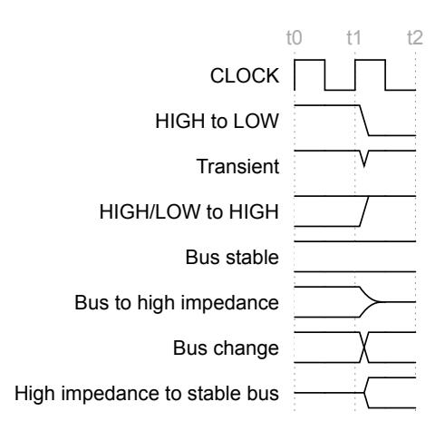

Document number ARM IHI 0022

Document quality Released

Document version Issue L

Document confidentiality Non-confidential

Date of issue 27 Aug 2025

*Copyright © 2003-2025 Arm Limited or its affiliates. All rights reserved.*

# **AMBA® AXI Protocol Specification**

# **Release information**

| Date        | Version | Changes                                                                                  |
|-------------|---------|------------------------------------------------------------------------------------------|
| 2025/Aug/27 | L       | • EAC-0 release of Issue L.                                                              |
|             |         | • Credited transport option.                                                             |
|             |         | • Arm Compression Technology.                                                            |
|             |         | • New option for protection signaling.                                                   |
|             |         | • RME - Granular Data Isolation.                                                         |
|             |         | • Untranslated transactions v4.                                                          |
|             |         | • CMO to the Point of Physical Storage.                                                  |
| 2023/Sep/29 | K       | • Other minor additions, corrections, and clarifications. • EAC-0 release of Issue K. |
|             |         | • Memory Encryption Contexts (MEC).                                                      |
|             |         | • Memory System Resource Partitioning and Monitoring (MPAM) extension.                   |
|             |         | • Memory Tagging Extension (MTE) Simplified option.                                      |
|             |         | • Other minor additions, corrections, and clarifications.                                |
| 2023/Mar/01 | J       | • EAC-0 release of Issue J.                                                              |
|             |         | • Simplified document structure.                                                         |
|             |         | • AXI3, AXI4, AXI4-Lite, ACE, and ACE5 content removed.                                  |
|             |         | • New content added for AXI5, AXI5-Lite, ACE5-Lite, ACE5-LiteDVM, and                    |
| 2021/Jan/26 | H.c     | ACE5-LiteACP interface classes. • Corrected error in table D13-22 for AxADDR[15].     |
| 2021/Jan/11 | H.b     | • Regularized terminology to use Manager to indicate the agent that initiates read and   |
|             |         | write requests and Subordinate to indicate the agent that responds to read and write     |
|             |         | requests.                                                                                |
| 2020/Mar/31 | H       | • EAC-0 release of Issue H.                                                              |
|             |         | • New optional features defined for AMBA 5 interface variants.                           |
| 2019/Jul/30 | G       | • EAC-0 release of Issue G.                                                              |
|             |         | • New optional features defined for AMBA 5 interface variants.                           |
| 2017/Dec/21 | F.b     | • EAC-1 release to address issues found with the EAC-0 release of release F.             |
| 2017/Dec/18 | F       | • EAC-0 release of Issue F.                                                              |
|             |         | • New interfaces defined for AMBA protocol: AXI5, AXI5-Lite, ACE5, ACE5-Lite,            |
|             |         | ACE5-LiteDVM, and ACE5-LiteACP.                                                          |
| 2013/Feb/22 | E       | • Second release of AMBA AXI and ACE Protocol specification.                             |
| 2011/Oct/28 | D       | • First release of AMBA AXI and ACE Protocol specification.                              |
| 2011/Jun/03 | D-2c    | • Public beta draft of AMBA AXI and ACE Protocol specification.                          |
| 2010/Mar/03 | C       | • First release of AXI specification v2.0.                                               |
| 2004/Mar/19 | B       | • First release of AXI specification v1.0.                                               |
| 2003/Jun/16 | A       | • First release.                                                                         |

### **Non-Confidential Proprietary Notice**

This document is protected by copyright and other related rights and the use or implementation of the information contained in this document may be protected by one or more patents or pending patent applications. No part of this document may be reproduced in any form by any means without the express prior written permission of Arm Limited ("Arm"). No license, express or implied, by estoppel or otherwise to any intellectual property rights is granted by this document unless specifically stated.

Your access to the information in this document is conditional upon your acceptance that you will not use or permit others to use the information for the purposes of determining whether the subject matter of this document infringes any third party patents.

The content of this document is informational only. Any solutions presented herein are subject to changing conditions, information, scope, and data. This document was produced using reasonable efforts based on information available as of the date of issue of this document. The scope of information in this document may exceed that which Arm is required to provide, and such additional information is merely intended to further assist the recipient and does not represent Arm's view of the scope of its obligations. You acknowledge and agree that you possess the necessary expertise in system security and functional safety and that you shall be solely responsible for compliance with all legal, regulatory, safety and security related requirements concerning your products, notwithstanding any information or support that may be provided by Arm herein. In addition, you are responsible for any applications which are used in conjunction with any Arm technology described in this document, and to minimize risks, adequate design and operating safeguards should be provided for by you.

This document may include technical inaccuracies or typographical errors. THIS DOCUMENT IS PROVIDED "AS IS". ARM PROVIDES NO REPRESENTATIONS AND NO WARRANTIES, EXPRESS, IMPLIED OR STATUTORY, INCLUDING, WITHOUT LIMITATION, THE IMPLIED WARRANTIES OF MERCHANTABILITY, SATISFACTORY QUALITY, NON-INFRINGEMENT OR FITNESS FOR A PARTICULAR PURPOSE WITH RESPECT TO THE DOCUMENT. For the avoidance of doubt, Arm makes no representation with respect to, and has undertaken no analysis to identify or understand the scope and content of, any patents, copyrights, trade secrets, trademarks, or other rights.

TO THE EXTENT NOT PROHIBITED BY LAW, IN NO EVENT WILL ARM BE LIABLE FOR ANY DAMAGES, INCLUDING WITHOUT LIMITATION ANY DIRECT, INDIRECT, SPECIAL, INCIDENTAL, PUNITIVE, OR CONSEQUENTIAL DAMAGES, HOWEVER CAUSED AND REGARDLESS OF THE THEORY OF LIABILITY, ARISING OUT OF ANY USE OF THIS DOCUMENT, EVEN IF ARM HAS BEEN ADVISED OF THE POSSIBILITY OF SUCH DAMAGES.

Reference by Arm to any third party's products or services within this document is not an express or implied approval or endorsement of the use thereof.

This document consists solely of commercial items. You shall be responsible for ensuring that any permitted use, duplication, or disclosure of this document complies fully with any relevant export laws and regulations to assure that this document or any portion thereof is not exported, directly or indirectly, in violation of such export laws. Use of the word "partner" in reference to Arm's customers is not intended to create or refer to any partnership relationship with any other company. Arm may make changes to this document at any time and without notice.

This document may be translated into other languages for convenience, and you agree that if there is any conflict between the English version of this document and any translation, the terms of the English version of this document shall prevail.

The validity, construction and performance of this notice shall be governed by English Law.

The Arm corporate logo and words marked with ® or ™ are registered trademarks or trademarks of Arm Limited (or its affiliates) in the US and/or elsewhere. Please follow Arm's trademark usage guidelines at [http://www.arm.com/company/policies/trademarks.](http://www.arm.com/company/policies/trademarks) All rights reserved. Other brands and names mentioned in this document may be the trademarks of their respective owners.

Copyright © 2003-2025 Arm Limited or its affiliates. All rights reserved.

Arm Limited. Company 02557590 registered in England.

110 Fulbourn Road, Cambridge, England CB1 9NJ.

PRE-21451 version 3

### **AMBA SPECIFICATION LICENCE**

THIS END USER LICENCE AGREEMENT ("LICENCE") IS A LEGAL AGREEMENT BETWEEN YOU (EITHER A SINGLE INDIVIDUAL, OR SINGLE LEGAL ENTITY) AND ARM LIMITED ("ARM") FOR THE USE OF ARM'S INTELLECTUAL PROPERTY (INCLUDING, WITHOUT LIMITATION, ANY COPYRIGHT) IN THE RELEVANT AMBA SPECIFICATION ACCOMPANYING THIS LICENCE. ARM LICENSES THE RELEVANT AMBA SPECIFICATION TO YOU ON CONDITION THAT YOU ACCEPT ALL OF THE TERMS IN THIS LICENCE. BY CLICKING "I AGREE" OR OTHERWISE USING OR COPYING THE RELEVANT AMBA SPECIFICATION YOU INDICATE THAT YOU AGREE TO BE BOUND BY ALL THE TERMS OF THIS LICENCE.

"LICENSEE" means You and your Subsidiaries. "Subsidiary" means, if You are a single entity, any company the majority of whose voting shares is now or hereafter owned or controlled, directly or indirectly, by You. A company shall be a Subsidiary only for the period during which such control exists.

- 1. Subject to the provisions of Clauses 2, 3 and 4, Arm hereby grants to LICENSEE a perpetual, non-exclusive, non-transferable, royalty free, worldwide licence to:
  - (i) use and copy the relevant AMBA Specification for the purpose of developing and having developed products that comply with the relevant AMBA Specification;
  - (ii) manufacture and have manufactured products which either: (a) have been created by or for LICENSEE under the licence granted in Clause 1(i); or (b) incorporate a product(s) which has been created by a third party(s) under a licence granted by Arm in Clause 1(i) of such third party's AMBA Specification Licence; and
  - (iii) offer to sell, sell, supply or otherwise distribute products which have either been (a) created by or for LICENSEE under the licence granted in Clause 1(i); or (b) manufactured by or for LICENSEE under the licence granted in Clause 1(ii).
- 2. LICENSEE hereby agrees that the licence granted in Clause 1 is subject to the following restrictions:
  - (i) where a product created under Clause 1(i) is an integrated circuit which includes a CPU then either: (a) such CPU shall only be manufactured under licence from Arm; or (b) such CPU is neither substantially compliant with nor marketed as being compliant with the Arm instruction sets licensed by Arm from time to time;
  - (ii) the licences granted in Clause 1(iii) shall not extend to any portion or function of a product that is not itself compliant with part of the relevant AMBA Specification; and
  - (iii) no right is granted to LICENSEE to sublicense the rights granted to LICENSEE under this Agreement.
- 3. Except as specifically licensed in accordance with Clause 1, LICENSEE acquires no right, title or interest in any Arm technology or any intellectual property embodied therein. In no event shall the licences granted in accordance with Clause 1 be construed as granting LICENSEE, expressly or by implication, estoppel or otherwise, a licence to use any Arm technology except the relevant AMBA Specification.
- 4. THE RELEVANT AMBA SPECIFICATION IS PROVIDED "AS IS" WITH NO REPRESENTATION OR WARRANTIES EXPRESS, IMPLIED OR STATUTORY, INCLUDING BUT NOT LIMITED TO ANY WARRANTY OF SATISFACTORY QUALITY, MERCHANTABILITY, NON-INFRINGEMENT OR FITNESS FOR A PARTICULAR PURPOSE, OR THAT ANY USE OR IMPLEMENTATION OF SUCH ARM TECHNOLOGY WILL NOT INFRINGE ANY THIRD PARTY PATENTS, COPYRIGHTS, TRADE SECRETS OR OTHER INTELLECTUAL PROPERTY RIGHTS.
- 5. NOTWITHSTANDING ANYTHING TO THE CONTRARY CONTAINED IN THIS AGREEMENT, TO THE FULLEST EXTENT PETMITTED BY LAW, THE MAXIMUM LIABILITY OF ARM IN AGGREGATE FOR ALL CLAIMS MADE AGAINST ARM, IN CONTRACT, TORT OR OTHERWISE, IN CONNECTION WITH THE SUBJECT MATTER OF THIS AGREEMENT (INCLUDING WITHOUT LIMITATION (I) LICENSEE'S USE OF THE ARM TECHNOLOGY; AND (II) THE IMPLEMENTATION OF THE ARM TECHNOLOGY IN ANY PRODUCT CREATED BY LICENSEE UNDER THIS AGREEMENT) SHALL NOT EXCEED THE FEES PAID (IF ANY) BY LICENSEE TO ARM UNDER THIS AGREEMENT. THE EXISTENCE OF MORE THAN ONE CLAIM OR SUIT WILL NOT ENLARGE OR EXTEND THE LIMIT. LICENSEE RELEASES ARM FROM ALL OBLIGATIONS, LIABILITY, CLAIMS OR DEMANDS IN EXCESS OF THIS LIMITATION.

- 6. No licence, express, implied or otherwise, is granted to LICENSEE, under the provisions of Clause 1, to use the Arm tradename, or AMBA trademark in connection with the relevant AMBA Specification or any products based thereon. Nothing in Clause 1 shall be construed as authority for LICENSEE to make any representations on behalf of Arm in respect of the relevant AMBA Specification.
- 7. This Licence shall remain in force until terminated by you or by Arm. Without prejudice to any of its other rights if LICENSEE is in breach of any of the terms and conditions of this Licence then Arm may terminate this Licence immediately upon giving written notice to You. You may terminate this Licence at any time. Upon expiry or termination of this Licence by You or by Arm LICENSEE shall stop using the relevant AMBA Specification and destroy all copies of the relevant AMBA Specification in your possession together with all documentation and related materials. Upon expiry or termination of this Licence, the provisions of clauses 6 and 7 shall survive.
- 8. The validity, construction and performance of this Agreement shall be governed by English Law.

PRE-21451 version 3

### **Confidentiality Status**

This document is Non-Confidential. The right to use, copy and disclose this document may be subject to license restrictions in accordance with the terms of the agreement entered into by Arm and the party that Arm delivered this document to.

### **Product Status**

The information in this document is final, that is for a developed product.

## **Web Address**

<http://www.arm.com>

# **Contents**

# **AMBA® AXI Protocol Specification**

|            |                    | AMBA® AXI Protocol Specification                         | ii  |
|------------|--------------------|----------------------------------------------------------|-----|
|            |                    |  Release information                                  | ii  |
|            |                    | Non-Confidential Proprietary Notice                      | iii |
|            |                    |  AMBA SPECIFICATION LICENCE                           | iv  |
|            |                    | Confidentiality Status                                   | v   |
|            |                    |  Product Status                                       | v   |
|            |                    |  Web Address                                          | v   |
|            |                    |                                                          |     |
| Preface    |                    |                                                          |     |
|            |                    |  Intended audience xiii                            |     |
|            |                    | Using this specification xiii                         |     |
|            | Conventions        |                                                          | xv  |
|            |                    | Typographical conventions                                | xv  |
|            |                    |  Timing diagrams                                      | xv  |
|            | Signals            |  xvi                                                  |     |
|            |                    |                                                          |     |
|            | Numbers            |  xvi                                                  |     |
|            |                    | Pseudocode descriptions  xvi                       |     |
|            | Additional reading |  xvii                                                 |     |
|            |                    | Feedback xviii                                        |     |
|            |                    | Feedback on this specification xviii                  |     |
|            |                    | Inclusive terminology commitment  xviii            |     |
| Part A  | Specification      |                                                          |     |
|            |                    |                                                          |     |
| Chapter A1 | Introduction       |                                                          |     |
|            | A1.1               | About the AXI protocol  21                         |     |
|            | A1.2               | AXI Architecture 22                                   |     |
|            | A1.2.1             | Interface and interconnect  24                     |     |
|            | A1.3               | Terminology 25                                        |     |
|            | A1.3.1             | AXI components and topology  25                    |     |
|            | A1.3.2             |  AXI transactions and transfers 25                 |     |
|            | A1.3.3             | Caches and cache operation 25                         |     |
|            | A1.3.4             |  Temporal description 25                           |     |
|            |                    |                                                          |     |
| Chapter A2 | AXI transport      |                                                          |     |
|            | A2.1               | Clock and reset 27                                    |     |
|            | A2.1.1             | Clock 27                                              |     |
|            | A2.1.2             | Reset 27                                              |     |
|            | A2.2               | AXI transport options 28                              |     |
|            | A2.3               | Valid-Ready transport  29                          |     |
|            | A2.3.1             | Valid-Ready signals 30                                |     |
|            | A2.3.2             | Dependencies between channel handshake signals  31 |     |
|            |                    |                                                          |     |
|            | A2.4               |  Credited transport 33                             |     |
|            | A2.4.1             | Credited flow control  34                          |     |
|            | A2.4.2             |  Resource Planes 35                                |     |
|            | A2.4.3             | Shared credits 36                                     |     |
|            | A2.4.4             |  Transfer-level clock gating                          | 38  |
|            | A2.4.5             | Credited transport signals  39                     |     |

|            | A2.5 A2.6 |                    |  Pipelining and register stages 40 AXI transactions and transfers 41 |
|------------|--------------|--------------------|----------------------------------------------------------------------------------|
| Chapter A3 |              | AXI transactions   |                                                                                  |
|            | A3.1         |                    | Transaction request 43                                                        |
|            |              | A3.1.1             |  Size attribute 43                                                         |
|            |              | A3.1.2             | Length attribute  44                                                       |
|            |              | A3.1.3             |  Maximum number of bytes in a transaction 45                               |
|            |              | A3.1.4             | Burst attribute 46                                                            |
|            |              | A3.1.5             | Transfer address 49                                                           |
|            |              | A3.1.6             | Transaction equations 49                                                      |
|            |              | A3.1.7             | Pseudocode description of the transfers 51                                    |
|            |              | A3.1.8             | Regular transactions  52                                                   |
|            | A3.2         |                    | Write and read data 53                                                        |
|            |              | A3.2.1             | Write data channel (W) 53                                                     |
|            |              | A3.2.2             |  Read data channel (R) 55                                                  |
|            |              | A3.2.3             | Narrow transfers 55                                                           |
|            |              | A3.2.4             |  Byte invariance 56                                                        |
|            |              | A3.2.5             | Unaligned transfers 58                                                        |
|            | A3.3         |                    | Transaction response 61                                                       |
|            |              | A3.3.1             |  Write response 61                                                         |
|            |              | A3.3.2             | Read response  62                                                          |
|            |              | A3.3.3             | Subordinate Busy indicator 64                                                 |
| Chapter A4 |              | Request attributes |                                                                                  |
|            | A4.1         |                    |  Subordinate types 67                                                      |
|            | A4.2         |                    | Memory attributes  68                                                      |
|            |              | A4.2.1             |  Bufferable, AxCACHE[0] 68                                                 |
|            |              | A4.2.2             | Modifiable, AxCACHE[1]  69                                                 |
|            |              | A4.2.3             |  Allocate and Other Allocate, AxCACHE[2], and AxCACHE[3] 70                |
|            | A4.3         |                    | Memory types 71                                                               |
|            |              | A4.3.1             | Memory type requirements 71                                                   |
|            |              | A4.3.2             | Mismatched memory attributes  74                                           |
|            |              | A4.3.3             | Changing memory attributes 74                                                 |
|            |              | A4.3.4             | Transaction buffering  74                                                  |
|            |              | A4.3.5             | Example use of Device memory types 75                                         |
|            | A4.4         |                    |  Protocol errors 76                                                        |
|            |              |                    |                                                                                  |
|            |              | A4.4.1             |  Software protocol error 76                                                |
|            |              | A4.4.2             |  Hardware protocol error 76                                                |
|            | A4.5         |                    |  Protection attributes 77                                                  |
|            |              | A4.5.1             |  Signaling for protection attributes 77                                    |
|            |              | A4.5.2             |  Privileged and Instruction attributes 78                                  |
|            |              | A4.5.3             |  Physical address space (PAS) 79                                           |
|            |              | A4.5.4             | Realm Management Extension 79                                                 |
|            |              | A4.5.5             | Granular Data Isolation 79                                                    |
|            | A4.6         |                    | Memory Encryption Contexts  81                                             |
|            |              | A4.6.1             | MEC signaling 81                                                              |
|            |              | A4.6.2             | MECID usage 82                                                                |
|            |              | A4.6.3             | MEC and GDI 83                                                                |
|            | A4.7         |                    | Multiple region interfaces 84                                                 |
|            |              | A4.7.1             |  Region identifier signaling 84                                            |
|            |              | A4.7.2             | Using the region identifier  84                                            |
|            | A4.8         |                    | QoS signaling 86                                                              |
|            |              | A4.8.1             | QoS identifiers 86                                                            |
|            |              | A4.8.2             | QoS acceptance indicators 87                                                  |
|            |              |                    |                                                                                  |

| Chapter A5 |        |                 | Transaction identifiers and ordering                            |
|------------|--------|-----------------|-----------------------------------------------------------------|
|            | A5.1   |                 | Transaction identifiers  90                               |
|            |        | A5.1.1          | Transaction ID signals 90                                    |
|            | A5.2   |                 | Unique ID indicator 91                                       |
|            | A5.3   |                 | Request ordering 93                                          |
|            |        | A5.3.1          | Memory locations and Peripheral regions 93                   |
|            |        | A5.3.2          | Device and Normal requests 94                                |
|            |        | A5.3.3          | Observation and completion definitions  94                |
|            |        | A5.3.4          |  Manager ordering guarantees 94                           |
|            |        | A5.3.5          | Subordinate ordering requirements  95                     |
|            |        | A5.3.6          |  Interconnect ordering requirements 96                    |
|            |        | A5.3.7          | Response before the endpoint 96                              |
|            |        | A5.3.8          | Ordering between requests with different memory types 97     |
|            |        | A5.3.9          | Ordered write observation  97                             |
|            | A5.4   |                 | Interconnect use of transaction identifiers 99               |
|            | A5.5   |                 | Write data and response ordering 100                         |
|            | A5.6   |                 | Read data ordering 101                                       |
|            |        | A5.6.1          | Read data interleaving  101                               |
|            |        | A5.6.2          | Read data chunking 102                                       |
|            |        |                 |                                                                 |
| Chapter A6 |        | Atomic accesses |                                                                 |
|            | A6.1   |                 | Single-copy atomicity size  108                           |
|            | A6.2   |                 | Multi-copy write atomicity 109                               |
|            | A6.3   |                 | Exclusive accesses 110                                       |
|            |        | A6.3.1          |  Exclusive access sequence 110                            |
|            |        | A6.3.2          | Exclusive access from the perspective of the Manager 111     |
|            |        | A6.3.3          | Exclusive access restrictions 111                            |
|            |        |                 |                                                                 |
|            |        | A6.3.4          | Exclusive access from the perspective of the Subordinate 112 |
|            | A6.4   |                 | Atomic transactions 113                                      |
|            |        | A6.4.1          | Overview 113                                                 |
|            |        | A6.4.2          |  Atomic transaction operations 114                        |
|            |        | A6.4.3          | Atomic transactions attributes  114                       |
|            |        | A6.4.4          |  ID use for Atomic transactions 116                       |
|            |        | A6.4.5          | Request attribute restrictions for Atomic transactions 117   |
|            |        | A6.4.6          |  Atomic transaction signaling 117                         |
|            |        | A6.4.7          | Transaction structure  118                                |
|            |        | A6.4.8          | Response signaling 119                                       |
|            |        | A6.4.9          | Atomic transaction dependencies  120                      |
|            |        | A6.4.10         |  Support for Atomic transactions 121                      |
|            |        |                 |                                                                 |
| Chapter A7 |        | Request Opcodes |                                                                 |
|            | A7.1   |                 | Opcode signaling 124                                         |
|            | A7.2   |                 |  AWSNOOP encodings 126                                    |
|            | A7.3   |                 | ARSNOOP encodings  129                                    |
|            |        |                 |                                                                 |
| Chapter A8 | Caches |                 |                                                                 |
|            | A8.1   |                 | Caching in AXI  132                                       |
|            | A8.2   |                 |  Cache line size 133                                      |
|            | A8.3   |                 |  Cache coherency and Domains 134                          |
|            |        | A8.3.1          | System Domain 134                                            |
|            |        | A8.3.2          | Non-shareable Domain 134                                     |
|            |        | A8.3.3          |  Shareable Domain 134                                     |
|            |        | A8.3.4          |  Domain signaling 135                                     |
|            |        | A8.3.5          | Domain consistency 136                                       |
|            |        | A8.3.6          |  Domains and memory types 136                             |
|            |        |                 |                                                                 |

|             | A8.4  | I/O coherency                                                     | 137     |
|-------------|-------|-------------------------------------------------------------------|---------|
|             | A8.5  | Caching Shareable lines                                           | 138     |
|             |       | A8.5.1 Opcodes to support reading and writing full cache lines |  139 |
|             |       |  A8.5.2 Configuration of Shareable cache support            | 140     |
|             | A8.6  | Prefetch transaction                                           | 142     |
|             |       |  A8.6.1 Rules for the prefetch transaction                  | 142     |
|             |       | A8.6.2 Response for prefetched data                         | 143     |
|             | A8.7  | Cache Stashing                                                    | 144     |
|             |       | A8.7.1 Stash transaction Opcodes                               | 144     |
|             |       | Stash transaction signaling A8.7.2                             | 145     |
|             |       | A8.7.3 Stash request Domain                                 | 145     |
|             |       |  A8.7.4 Stash target identifiers                            | 146     |
|             |       | A8.7.5 Transaction ID for stash transactions                | 147     |
|             |       |  A8.7.6 Support for stash transactions                      | 148     |
|             | A8.8  | Deallocating read transactions                                    | 149     |
|             |       | Deallocating read Opcodes A8.8.1                               | 149     |
|             |       | A8.8.2 Rules and recommendations                               | 149     |
|             | A8.9  | Invalidate hint                                                   | 151     |
|             |       | A8.9.1 Invalidate Hint signaling                               | 151     |
|             |       |  A8.9.2 Invalidate Hint support                             | 152     |
|             |       |                                                                   |         |
| Chapter A9  |       | Cache maintenance                                                 |         |
|             | A9.1  | Cache Maintenance Operations                                      | 154     |
|             | A9.2  |  Actions on receiving a CMO                                    | 155     |
|             | A9.3  | CMO request attributes                                            | 156     |
|             | A9.4  | CMO propagation                                                   | 157     |
|             | A9.5  | CMOs on the write channels                                        | 158     |
|             | A9.6  | Write with CMO                                                    | 160     |
|             |       | A9.6.1 Attributes for write with CMO                           | 161     |
|             |       | Propagation of write with CMO A9.6.2                           | 161     |
|             |       | A9.6.3 Response to write with CMOs                          | 161     |
|             |       | Example flow with a write plus CMO A9.6.4                      | 162     |
|             | A9.7  | CMOs on the read channels                                         | 163     |
|             | A9.8  |  CMOs for Persistence                                          | 164     |
|             |       | A9.8.1 Point of Persistence and Deep Persistence               | 164     |
|             |       | Persistent CMO (PCMO) transactions A9.8.2                      | 164     |
|             |       | A9.8.3 PCMO propagation                                     | 165     |
|             |       |                                                                   |         |
|             |       |  A9.8.4 PCMOs on write channels                             | 165     |
|             |       | A9.8.5 PCMOs on read channels                               | 167     |
|             | A9.9  | Cache maintenance and Realm Management Extension                  |  168 |
|             |       | A9.9.1 CMO to PoPA                                          | 168     |
|             |       |  A9.9.2 CMO to PoPA propagation                             | 169     |
|             | A9.10 | Cache maintenance to the Point of Physical Storage                |  170 |
|             | A9.11 | Processor cache maintenance instructions                          | 172     |
|             |       | A9.11.1 Unpredictable behavior with software cache maintenance | 172     |
| Chapter A10 |       | Additional request qualifiers                                     |         |
|             | A10.1 | Non-secure Access Identifiers (NSAID)                             | 175     |
|             |       | A10.1.1 NSAID signaling                                        | 175     |
|             |       |                                                                   |         |
|             |       | Caching and NSAID A10.1.2                                      | 176     |
|             | A10.2 | Page-based Hardware Attributes (PBHA)                             | 177     |
|             |       |  A10.2.1 PBHA values                                        | 177     |
|             | A10.3 | Subsystem Identifier                                           | 178     |
|             |       |  A10.3.1 Subsystem ID usage                                 | 178     |
|             | A10.4 | Arm Compression Technology (ACT)                               | 179     |

|             | A10.4.1 ACT signaling  180  A10.4.2 ACT requests 180 A10.4.3 Modifying ACT transactions  181 |
|-------------|-------------------------------------------------------------------------------------------------------------------------------|
| Chapter A11 | Other write transactions                                                                                                      |
|             | A11.1 WriteZero Transaction  183                                                                                     |
|             |  A11.2 WriteDeferrable Transaction 184                                                                               |
|             | WriteDeferrable transaction support A11.2.1 184                                                                         |
|             | WriteDeferrable signaling A11.2.2 184                                                                                   |
|             | Response to a WriteDeferrable request A11.2.3 185                                                                       |
| Chapter A12 | System monitoring, debug, and user extensions                                                                                 |
|             |  A12.1 Memory System Resource Partitioning and Monitoring (MPAM) 187                                                 |
|             |                                                                                                                               |
|             | A12.1.1 MPAM signaling 187                                                                                              |
|             | MPAM fields A12.1.2 188                                                                                                 |
|             | A12.1.3 MPAM component interactions 189                                                                                 |
|             |  A12.2 Memory Tagging Extension (MTE) 190                                                                            |
|             | A12.2.1 MTE support 190                                                                                                 |
|             | MTE signaling A12.2.2 191                                                                                               |
|             | A12.2.3 Caching tags  191                                                                                            |
|             |  A12.2.4 Transporting tags 192                                                                                       |
|             | A12.2.5 Reads with tags 193                                                                                             |
|             | Writes with tags A12.2.6 194                                                                                            |
|             | A12.2.7 Memory tagging interoperability  197                                                                         |
|             |  A12.2.8 MTE and Atomic transactions 197                                                                             |
|             | A12.2.9 MTE and Prefetch transactions 198                                                                               |
|             | A12.2.10 MTE and Poison 198                                                                                                |
|             |  A12.3 Trace signals 199                                                                                             |
|             | User Loopback signaling A12.4 200                                                                                       |
|             |  A12.5 User defined signaling 202                                                                                    |
|             |  A12.5.1 Configuration 202                                                                                           |
|             |                                                                                                                               |
|             | User signals A12.5.2 202 Usage considerations A12.5.3 203                                                      |
|             |                                                                                                                               |
| Chapter A13 | Untranslated Transactions                                                                                                     |
|             | A13.1 Introduction to Distributed Virtual Memory  205                                                                |
|             | Support for untranslated transactions A13.2 206                                                                         |
|             | A13.3 Untranslated transaction signaling 207                                                                            |
|             | Translation identifiers A13.4 209                                                                                       |
|             | A13.4.1 Secure Stream Identifier (SECSID)  209                                                                       |
|             |  A13.4.2 StreamID (SID) 210                                                                                          |
|             | A13.4.3 SubstreamID (SSID)  210                                                                                      |
|             |  A13.4.4 Untranslated Transactions and GDI 211                                                                       |
|             | A13.5 PCIe considerations  212                                                                                       |
|             | PCIe XT mode A13.5.1 212                                                                                                |
|             | A13.6 Translation fault flows 214                                                                                       |
|             | Stall flow A13.6.1 215                                                                                                  |
|             | A13.6.2 ATST flow  215                                                                                               |
|             |  A13.6.3 NoStall flow 215                                                                                            |
|             |                                                                                                                               |
|             |  A13.6.4 PRI flow 216                                                                                                |
|             |  A13.7 Untranslated transaction qualifier 217                                                                        |
|             |  A13.8 Permitted combinations of MMU signals and PAS 218                                                             |
|             | StashTranslation Opcode A13.9 219                                                                                       |
|             |  A13.10 UnstashTranslation Opcode 220                                                                                |

| Chapter A14             | Interface clock and power gating                              |     |  |  |  |  |  |
|-------------------------|---------------------------------------------------------------|-----|--|--|--|--|--|
|                         | Interface gating with Valid-Ready transport A14.1          | 223 |  |  |  |  |  |
|                         | A14.1.1 AWAKEUP rules and recommendations                  | 223 |  |  |  |  |  |
|                         | AWAKEUP and Coherency Connection signaling A14.1.2         | 224 |  |  |  |  |  |
|                         | A14.1.3 ACWAKEUP rules and recommendations                 | 224 |  |  |  |  |  |
|                         |  A14.2 Interface gating with credited transport         | 225 |  |  |  |  |  |
|                         | A14.2.1 Channel states                                  | 226 |  |  |  |  |  |
|                         |  A14.2.2 Stop request signal, ASKSTOP                   | 227 |  |  |  |  |  |
|                         |                                                               |     |  |  |  |  |  |
|                         | A14.2.3 Credit control signal rules                        | 227 |  |  |  |  |  |
|                         | Pipelining channels A14.2.4                                | 227 |  |  |  |  |  |
|                         | A14.2.5 Clock and power gating                             | 228 |  |  |  |  |  |
|                         |  A14.3 Sequence diagram                                 | 229 |  |  |  |  |  |
|                         | A14.4 Example waveform                                     | 230 |  |  |  |  |  |
|                         |  A14.4.1 Transmitting one read transaction              | 230 |  |  |  |  |  |
| Chapter A15             | Distributed Virtual Memory messages                           |     |  |  |  |  |  |
|                         |  A15.1 Introduction to DVM transactions                 | 232 |  |  |  |  |  |
|                         |  A15.2 Support for DVM messages                         | 233 |  |  |  |  |  |
|                         | DVM messages A15.3                                         | 234 |  |  |  |  |  |
|                         |  A15.3.1 DVM message fields                             | 234 |  |  |  |  |  |
|                         | TLB Invalidate messages A15.3.2                            | 239 |  |  |  |  |  |
|                         | Branch Predictor Invalidate messages A15.3.3               | 243 |  |  |  |  |  |
|                         | A15.3.4 Instruction cache invalidations                 | 244 |  |  |  |  |  |
|                         |  A15.3.5 Synchronization message                        | 247 |  |  |  |  |  |
|                         | A15.3.6 Hint message                                    | 247 |  |  |  |  |  |
|                         |  A15.4 Transporting DVM messages                        | 248 |  |  |  |  |  |
|                         | A15.4.1 Signaling for DVM messages                         | 249 |  |  |  |  |  |
|                         | Snoop channels using Valid-Ready transport A15.4.2         | 250 |  |  |  |  |  |
|                         | A15.4.3 Snoop channels using credited transport         | 250 |  |  |  |  |  |
|                         | Address widths in DVM messages A15.4.4                     | 250 |  |  |  |  |  |
|                         | A15.4.5 Mapping message fields to signals               | 251 |  |  |  |  |  |
|                         | DVM Sync and Complete A15.5                                | 258 |  |  |  |  |  |
|                         |                                                               |     |  |  |  |  |  |
|                         | A15.6 Coherency Connection signaling                    | 260 |  |  |  |  |  |
|                         |  A15.6.1 Coherency Connection Handshake                 | 260 |  |  |  |  |  |
|                         | A15.7 Snoop channels credit control                        | 263 |  |  |  |  |  |
| Chapter A16             | Interface and data protection                                 |     |  |  |  |  |  |
|                         | Data protection using Poison A16.1                         | 265 |  |  |  |  |  |
|                         |  A16.2 Parity protection for data and interface signals | 266 |  |  |  |  |  |
|                         | Configuration of parity protection A16.2.1                 | 266 |  |  |  |  |  |
|                         |  A16.2.2 Error detection behavior                       | 266 |  |  |  |  |  |
|                         | Parity check signals A16.2.3                               | 267 |  |  |  |  |  |
|                         |                                                               |     |  |  |  |  |  |
| Part B Appendices |                                                               |     |  |  |  |  |  |
| Chapter B1              | Signal list                                                   |     |  |  |  |  |  |
|                         |  B1.1 Write channels                                    | 275 |  |  |  |  |  |
|                         | Write request channel B1.1.1                               | 275 |  |  |  |  |  |
|                         |  B1.1.2 Write data channel                              | 277 |  |  |  |  |  |
|                         | Write response channel B1.1.3                              | 278 |  |  |  |  |  |
|                         |  B1.2 Read channels                                     | 279 |  |  |  |  |  |
|                         | B1.2.1 Read request channel                             | 279 |  |  |  |  |  |
|                         |  B1.2.2 Read data channel                               | 281 |  |  |  |  |  |
|                         | B1.3 Snoop channels                                        | 282 |  |  |  |  |  |
|                         |                                                               |     |  |  |  |  |  |

#### *Contents Contents*

| B1.3.1                              | 282                                                                                                                                                                                                                                                                                                                                                                                                                                                                                                                                                                                                                                                                                                                                                  |
|-------------------------------------|------------------------------------------------------------------------------------------------------------------------------------------------------------------------------------------------------------------------------------------------------------------------------------------------------------------------------------------------------------------------------------------------------------------------------------------------------------------------------------------------------------------------------------------------------------------------------------------------------------------------------------------------------------------------------------------------------------------------------------------------------|
| B1.3.2                              | 282                                                                                                                                                                                                                                                                                                                                                                                                                                                                                                                                                                                                                                                                                                                                                  |
|                                     | 283                                                                                                                                                                                                                                                                                                                                                                                                                                                                                                                                                                                                                                                                                                                                                  |
| B1.4.1                              | 283                                                                                                                                                                                                                                                                                                                                                                                                                                                                                                                                                                                                                                                                                                                                                  |
|                                     | 283                                                                                                                                                                                                                                                                                                                                                                                                                                                                                                                                                                                                                                                                                                                                                  |
|                                     | 283                                                                                                                                                                                                                                                                                                                                                                                                                                                                                                                                                                                                                                                                                                                                                  |
|                                     | 284                                                                                                                                                                                                                                                                                                                                                                                                                                                                                                                                                                                                                                                                                                                                                  |
|                                     | 284                                                                                                                                                                                                                                                                                                                                                                                                                                                                                                                                                                                                                                                                                                                                                  |
| Interface control signals B1.4.6 | 284                                                                                                                                                                                                                                                                                                                                                                                                                                                                                                                                                                                                                                                                                                                                                  |
|                                     |                                                                                                                                                                                                                                                                                                                                                                                                                                                                                                                                                                                                                                                                                                                                                      |
|                                     | 286                                                                                                                                                                                                                                                                                                                                                                                                                                                                                                                                                                                                                                                                                                                                                  |
|                                     | 287                                                                                                                                                                                                                                                                                                                                                                                                                                                                                                                                                                                                                                                                                                                                                  |
|                                     | 287                                                                                                                                                                                                                                                                                                                                                                                                                                                                                                                                                                                                                                                                                                                                                  |
|                                     | 287                                                                                                                                                                                                                                                                                                                                                                                                                                                                                                                                                                                                                                                                                                                                                  |
|                                     | 287                                                                                                                                                                                                                                                                                                                                                                                                                                                                                                                                                                                                                                                                                                                                                  |
|                                     | 288                                                                                                                                                                                                                                                                                                                                                                                                                                                                                                                                                                                                                                                                                                                                                  |
|                                     | 289                                                                                                                                                                                                                                                                                                                                                                                                                                                                                                                                                                                                                                                                                                                                                  |
|                                     | 296                                                                                                                                                                                                                                                                                                                                                                                                                                                                                                                                                                                                                                                                                                                                                  |
| Property matrix                  | 300                                                                                                                                                                                                                                                                                                                                                                                                                                                                                                                                                                                                                                                                                                                                                  |
|                                     |                                                                                                                                                                                                                                                                                                                                                                                                                                                                                                                                                                                                                                                                                                                                                      |
|                                     |                                                                                                                                                                                                                                                                                                                                                                                                                                                                                                                                                                                                                                                                                                                                                      |
|                                     | 307                                                                                                                                                                                                                                                                                                                                                                                                                                                                                                                                                                                                                                                                                                                                                  |
|                                     | 309                                                                                                                                                                                                                                                                                                                                                                                                                                                                                                                                                                                                                                                                                                                                                  |
|                                     | 311                                                                                                                                                                                                                                                                                                                                                                                                                                                                                                                                                                                                                                                                                                                                                  |
|                                     | Snoop request channel Snoop response channel Interface level signals B1.4 Clock and reset signals  B1.4.2 Credit control signals B1.4.3 Wakeup signals  QoS Accept signals B1.4.4 Coherency Connection signals B1.4.5 Interface classes B2.1 Summary of interface classes   B2.1.1 AXI5 B2.1.2 ACE5-Lite   B2.1.3 ACE5-LiteDVM B2.1.4 ACE5-LiteACP AXI5-Lite B2.1.5 B2.2 Signal matrix   B2.3 Parity check signal matrix B2.4 Summary of ID constraints Revisions B4.1 Differences between Issue H.c and Issue J Differences between Issue J and Issue K B4.2 B4.3 Differences between Issue K and Issue L |

# **Part [C Glossary](#page-312-0)**

**[Chapter C1 Glossary](#page-313-0)**

# **Preface**

This preface describes the content organization and documentation conventions used in this specification.

## **Intended audience**

This specification is written for hardware and software engineers who want to become familiar with the AMBA protocol and design systems and modules that are compatible with the AXI protocol.

### **Using this specification**

The information in this specification is organized into parts, as described in this section:

#### Part A Specification

#### Chapter [A1](#page-19-0) *[Introduction](#page-19-0)*

Introduces the AXI protocol architecture and terminology used in this specification.

### Chapter [A2](#page-25-0) *[AXI transport](#page-25-0)*

Describes the AXI transport layer, with two options for flow control.

#### Chapter [A3](#page-41-0) *[AXI transactions](#page-41-0)*

Contains information on the AXI protocol transactions, such as transaction request, transaction response, and read and write data.

### Chapter [A4](#page-65-0) *[Request attributes](#page-65-0)*

Describes memory attributes, memory types, memory protection, and multiple region interfaces.

#### Chapter [A5](#page-88-0) *[Transaction identifiers and ordering](#page-88-0)*

Describes transaction ID signals, request ordering, write data and response ordering, and read data ordering.

#### Chapter [A6](#page-106-0) *[Atomic accesses](#page-106-0)*

Contains information on Atomic accesses, single and multi-copy atomicity, and exclusive accesses.

### Chapter [A7](#page-122-0) *[Request Opcodes](#page-122-0)*

Provides information on the opcode field that describes the function of a request and indicates how it must be processed by a Subordinate.

#### [Chapter](#page-130-0) [A8](#page-130-0) *Caches*

Describes caching in the AXI protocol, including I/O coherency, caching shareable lines, and managing cache allocation using specific transactions.

#### Chapter [A9](#page-152-0) *[Cache maintenance](#page-152-0)*

Provides information on using cache maintenance operations to control cache content ensuring visibility of data.

#### Chapter [A10](#page-173-0) *[Additional request qualifiers](#page-173-0)*

Describes additional request qualifiers in the AXI protocol, such as Non-secure Access Identifier (NSAID), Page-based Hardware Attributes (PBHA), and Subsystem Identifier.

#### Chapter [A11](#page-181-0) *[Other write transactions](#page-181-0)*

Contains information on other write transactions in the AXI protocol, such as WriteDeferrable and WriteZero.

### Chapter [A12](#page-185-0) *[System monitoring, debug, and user extensions](#page-185-0)*

Describes system debug, trace, and monitoring features of the AXI protocol, such as Memory System Resource Partitioning and Monitoring (MPAM), Memory Tagging Extension (MTE), and User Loopback and User defined signaling.

#### Chapter [A13](#page-203-0) *[Untranslated Transactions](#page-203-0)*

Describes how AXI supports the use of virtual addresses and translation stash hints for components upstream of a System Memory Management Unit (SMMU).

#### Chapter [A14](#page-221-0) *[Interface clock and power gating](#page-221-0)*

Describes how to stop and start interfaces for clock or power gating.

#### Chapter [A15](#page-230-0) *[Distributed Virtual Memory messages](#page-230-0)*

Describes how AXI supports distributed system MMUs using Distributed Virtual Memory (DVM) messages to maintain all MMUs in a virtual memory system.

#### Chapter [A16](#page-263-0) *[Interface and data protection](#page-263-0)*

Explains how to protect data or interfaces using poison and parity check signals.

#### Part B Appendices

### Chapter [B1](#page-273-0) *[Signal list](#page-273-0)*

A list of all the signals that are defined in the AXI protocol.

#### Chapter [B2](#page-284-0) *[Interface classes](#page-284-0)*

Descriptions of all the AMBA 5 AXI interface classes, including signal and property tables.

#### Chapter [B3](#page-303-0) *[Summary of ID constraints](#page-303-0)*

A summary of ID constraints in the AXI protocol.

### Chapter [B4](#page-305-0) *[Revisions](#page-305-0)*

Details of the changes between this issue and the previous issue of this specification.

### Part C Glossary

#### Chapter [C1](#page-313-0) *[Glossary](#page-313-0)*

Learn about the AXI protocol terms and concepts.

# **Conventions**

### **Typographical conventions**

The typographical conventions are:

*italic*

Highlights important notes, introduces special terminology, and denotes internal cross-references and citations.

#### bold

Denotes signal names, and is used for terms in descriptive lists, where appropriate.

monospace

Used for assembler syntax descriptions, pseudocode, and source code examples.

Also used in the main text for instruction mnemonics and for references to other items appearing in assembler syntax descriptions, pseudocode, and source code examples.

SMALL CAPITALS

Used in body text for a few terms that have specific technical meanings.

#### Colored text

Indicates a link. This can be:

- A cross-reference that includes the page number of the referenced information if it is not on the current page.
- A URL, for example [http://developer.arm.com.](http://developer.arm.com)
- A link, to a chapter or appendix, or to a glossary entry, or to the section of the document that defines the colored term.

## **Timing diagrams**

The components used in timing diagrams are explained in [Figure](#page-14-3) [1.](#page-14-3) Variations have clear labels when they occur. Do not assume any timing information that is not explicit in the diagrams.

**Figure 1: Key to timing diagram conventions**

Timing diagrams sometimes show single-bit signals as HIGH and LOW at the same time and they look similar to the bus change shown in [Figure](#page-14-3) [1.](#page-14-3) If a timing diagram shows a single-bit signal in this way, then its value does not affect the accompanying description.

### **Signals**

The signal conventions are:

- Signal level The level of an asserted signal depends on whether the signal is active-HIGH or active-LOW. Asserted means:
  - HIGH for active-HIGH signals.
  - LOW for active-LOW signals.
- Lowercase n At the start or end of a signal name denotes an active-LOW signal.
- Lowercase x At the second letter of a signal name denotes a collective term for both Read and Write. For example, AxCACHE refers to both the ARCACHE and AWCACHE signals.

# **Numbers**

Numbers are normally written in decimal. Binary numbers are preceded by 0b, and hexadecimal numbers by 0x. In both cases, the prefix and the associated value are written in a monospace font, for example 0xFFFF0000. To improve readability, long numbers can be written with an underscore separator between every four characters, for example 0xFFFF\_0000\_0000\_0000. Ignore any underscores when interpreting the value of a number.

## **Pseudocode descriptions**

This specification uses a form of pseudocode to provide precise descriptions of the specified functionality. This pseudocode is written in a monospace font. The pseudocode language is described in the *Arm® Architecture Reference Manual for A-profile architecture*.

# **Additional reading**

This section lists publications by Arm and by third parties.

See Arm Developer, <http://developer.arm.com> for access to Arm documentation.

- [1] *AMBA® AXI and ACE Protocol Specification*. (ARM IHI 0022 H.c)
- [2] *AMBA® AXI Protocol Specification*. (ARM IHI 0022 K)
- [3] *Arm® Architecture Reference Manual for A-profile architecture*. (ARM DDI 0487)
- [4] *Arm® Realm Management Extension (RME) System Architecture*. (ARM DEN 0129)
- [5] *AMBA® 5 CHI Architecture Specification*. (ARM IHI 0050)
- [6] *Arm® Architecture Reference Manual Supplement, Memory System Resource Partitioning and Monitoring (MPAM), for A-profile architecture*. (ARM DDI 0598)
- [7] *Arm® System Memory Management Unit Architecture Specification, SMMU architecture version 3*. (ARM IHI 0070)

# **Feedback**

Arm welcomes feedback on its documentation.

### **Feedback on this specification**

If you have any comments or suggestions for additions and improvements, create a ticket at [https://support.developer.arm.com.](https://support.developer.arm.com) As part of the ticket, please include:

- The title (AMBA® AXI Protocol Specification).
- The number (ARM IHI 0022 Issue L).
- The page numbers to which your comments apply.
- A concise explanation of your comments.

Arm also welcomes general suggestions for additions and improvements.

#### Note

Arm tests PDFs only in Adobe Acrobat and Acrobat Reader, and cannot guarantee the appearance or behavior of any document when viewed with any other PDF reader.

### **Inclusive terminology commitment**

Arm values inclusive communities. Arm recognizes that we and our industry have used terms that can be offensive.

Arm strives to lead the industry and create change.

Previous issues of this document included terms that can be offensive. We have replaced these terms. If you find offensive terms in this document, please contact [terms@arm.com.](mailto:terms@arm.com)

**Part A Specification**
