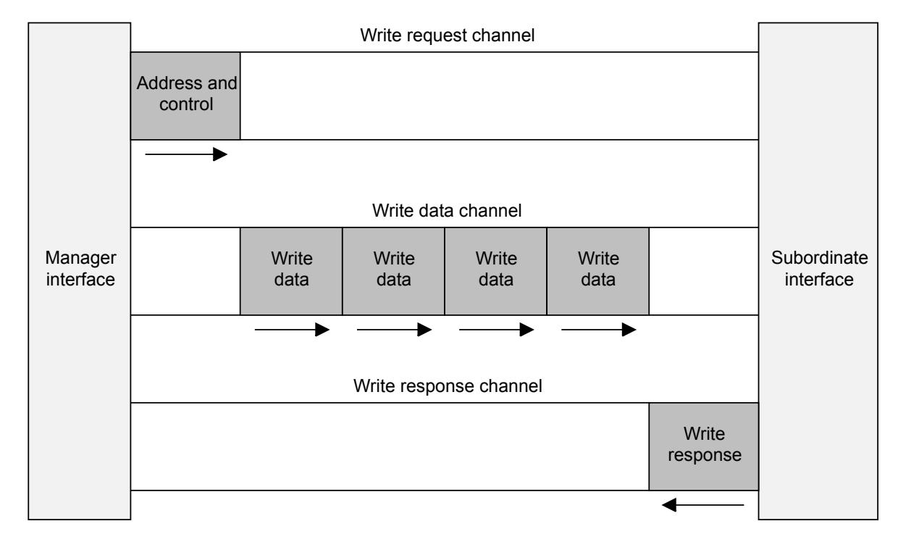
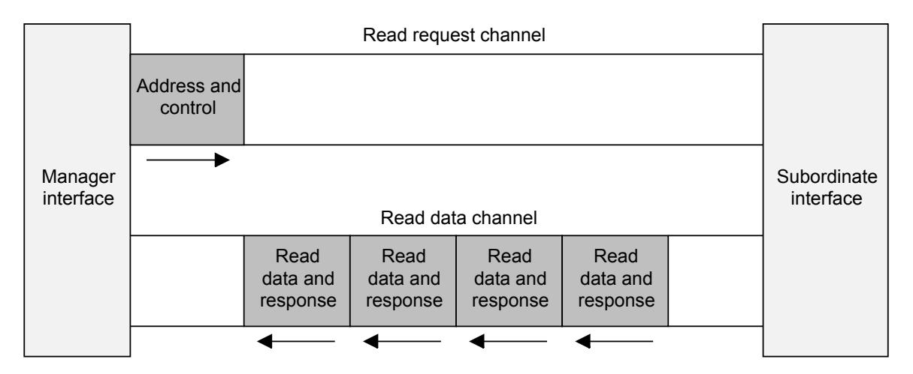
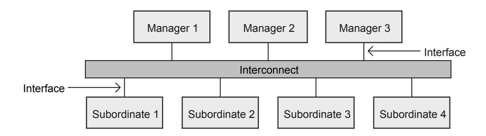

# Chapter A1 **Introduction**

This chapter introduces the architecture of the AXI protocol and the terminology used in this specification. It contains the following sections:

- [A1.1](#page-20-0) *[About the AXI protocol](#page-20-0)*
- [A1.2](#page-21-0) *[AXI Architecture](#page-21-0)*
- [A1.3](#page-24-0) *[Terminology](#page-24-0)*

# **A1.1 About the AXI protocol**

The AXI protocol supports high-performance, high-frequency system designs for communication between Manager and Subordinate components.

The AXI protocol features are:

- Suitable for high-bandwidth and low-latency designs.
- High-frequency operation is provided without using complex bridges.
- The protocol meets the interface requirements of a wide range of components.
- Suitable for memory controllers with high initial access latency.
- Flexibility in the implementation of interconnect architectures is provided.
- Backward-compatible with AHB and APB interfaces.

The key features of the AXI protocol are:

- Separate address/control and data phases.
- Support for unaligned data transfers using byte strobes.
- Uses burst-based transactions with only the start address issued.
- Separate write and read data channels that can provide low-cost Direct Memory Access (DMA).
- Support for issuing multiple outstanding addresses.
- Support for out-of-order transaction completion.
- Permits easy addition of register stages to provide timing closure.

For the previous issues of this specification, see [\[1\]](#page-16-1) and [\[2\]](#page-16-2).

# **A1.2 AXI Architecture**

The AXI protocol defines transactions that are used to read and write data, or control the caching of data and translations. Transactions are performed by sending transfers on the channels:

- Write request, which has signal names beginning with AW.
- Write data, which has signal names beginning with W.
- Write response, which has signal names beginning with B.
- Read request, which has signal names beginning with AR.
- Read data, which has signal names beginning with R.

A request channel carries control information that describes the nature of the data to be transferred. This is known as a request.

The data is transferred between Manager and Subordinate using either:

- A write data channel to transfer data from the Manager to the Subordinate. In a write transaction, the Subordinate uses the write response channel to signal the completion of the transfer to the Manager.
- A read data channel to transfer data from the Subordinate to the Manager.

#### The AXI protocol:

- Permits address information to be issued ahead of the actual data transfer.
- Supports multiple outstanding transactions.
- Supports out-of-order completion of transactions.

[Figure](#page-21-1) [A1.1](#page-21-1) shows how a write transaction uses the write request, write data, and write response channels.

**Figure A1.1: Channel architecture of writes**

[Figure](#page-22-0) [A1.2](#page-22-0) shows how a read transaction uses the read request and read data channels.

**Figure A1.2: Channel architecture of reads**

#### *Write and read request channels*

There are separate write and read request channels. The appropriate request channel carries all the required address and control information for a transaction.

#### *Write data channel*

The write data channel carries the write data from the Manager to the Subordinate. Write data can be up to 1024 bits wide and there is a byte lane strobe signal for every eight data bits, indicating the bytes of the data that are valid.

Write data channel information is always treated as buffered, so that the Manager can perform write transactions without Subordinate acknowledgment of previous write transactions.

#### *Write response channel*

A Subordinate uses the write response channel to respond to write transactions. All write transactions require completion signaling on the write response channel.

As [Figure](#page-21-1) [A1.1](#page-21-1) shows, completion is signaled only for a complete transaction, not for each data transfer in a transaction.

#### *Read data channel*

The read data channel carries both the read data and the read response information from the Subordinate to the Manager. Read data can be up to 1024 bits wide.

### **A1.2.1 Interface and interconnect**

A typical system consists of several Manager and Subordinate devices that are connected together through some form of interconnect, as [Figure](#page-23-1) [A1.3](#page-23-1) shows.

**Figure A1.3: Interface and interconnect**

The AXI protocol provides a single interface definition for the interfaces between:

- A Manager and the interconnect
- A Subordinate and the interconnect
- A Manager and a Subordinate

This interface definition supports many different interconnect implementations.

An interconnect between devices is equivalent to another device with symmetrical Manager and Subordinate ports that the real Manager and Subordinate devices can be connected.

### **A1.2.1.1 Typical system topologies**

Most systems use one of three interconnect topologies:

- Shared request and data channels
- Shared request channel and multiple data channels
- Multilayer, with multiple request and data channels

In most systems, the request channel bandwidth requirement is significantly less than the data channel bandwidth requirement. Such systems can achieve a good balance between system performance and interconnect complexity by using a shared request channel with multiple data channels to enable parallel data transfers.

# **A1.3 Terminology**

This section summarizes terms that are used in this specification, and are defined in Chapter [C1](#page-313-0) *[Glossary](#page-313-0)*, or elsewhere. Where appropriate, terms that are listed in this section link to the corresponding glossary definition.

### **A1.3.1 AXI components and topology**

The following terms describe AXI components:

- *[Component](#page-314-0)*
- *[Manager Component](#page-316-0)*
- *[Subordinate Component](#page-318-0)*, which includes *[Memory Subordinate component](#page-316-1)* and *[Peripheral Subordinate](#page-317-0) [component](#page-317-0)*
- *[Interconnect Component](#page-315-0)*

For a particular AXI transaction, *[Upstream](#page-319-0)* and *[Downstream](#page-315-1)* refer to the relative positions of AXI components within the AXI topology.

## **A1.3.2 AXI transactions and transfers**

A channel is a unidirectional connection, capable of carrying transfers between a transmitter (Tx) and receiver (Rx).

An interface is a set of channel transmitters and receivers on a component, where the channels have a defined use. AXI interfaces are defined as Manager or Subordinate.

An AXI transfer is the communication in one cycle on an AXI channel.

An AXI transaction is the set of transfers required for an AXI Manager to communicate with an AXI Subordinate. For example, a read transaction consists of a request transfer and one or more read data transfers.

### **A1.3.3 Caches and cache operation**

This specification does not define standard cache terminology that is defined in any reference work on caching. However, the glossary entries for *[Cache](#page-314-1)* and *[Cache line](#page-314-2)* clarify how these terms are used in this document.

### **A1.3.4 Temporal description**

The AXI specification uses the term *[in a timely manner](#page-315-2)*.
