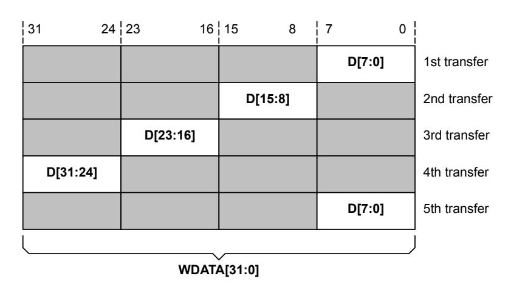
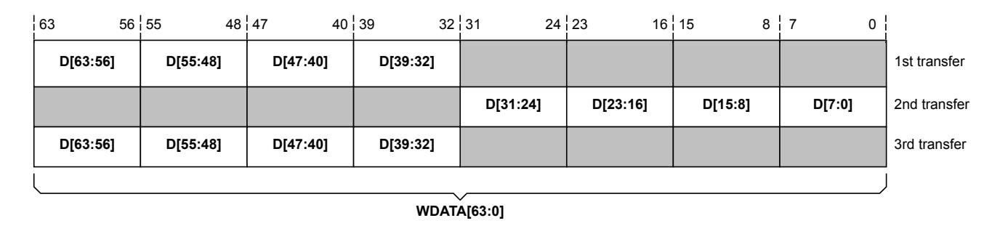
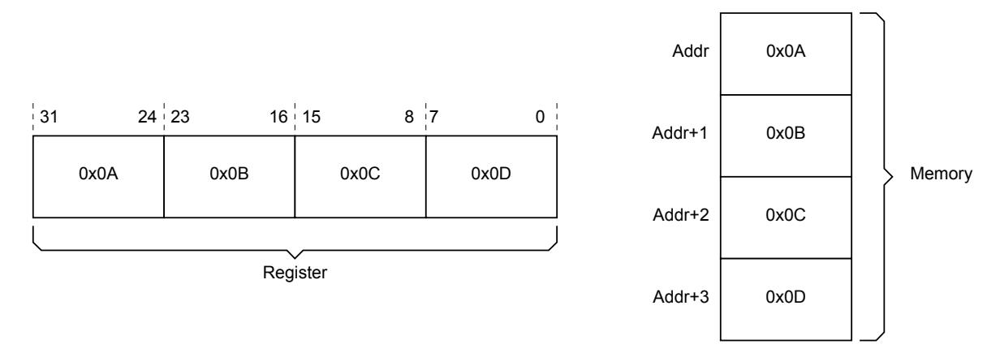
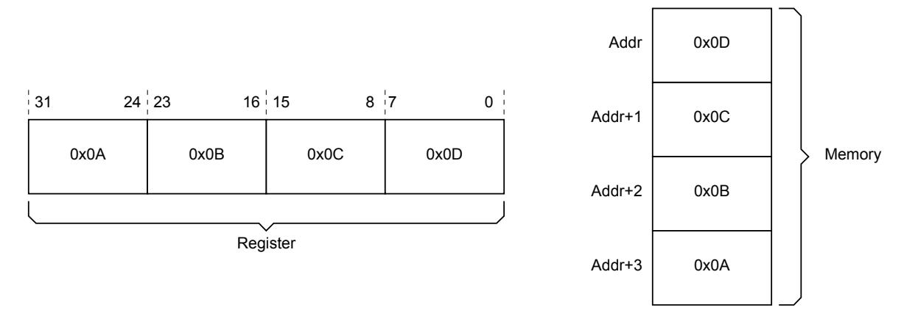
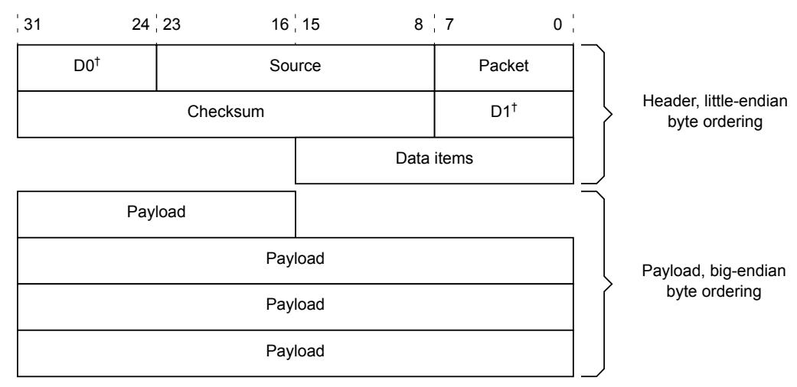
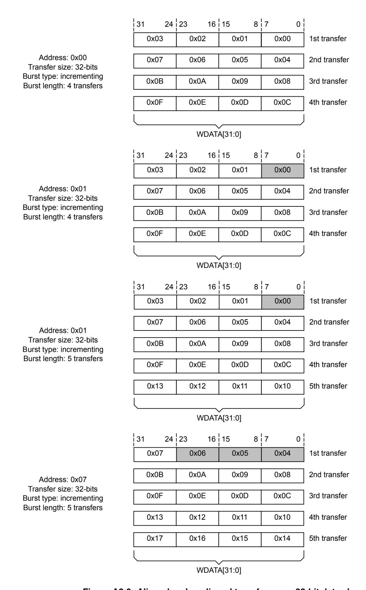
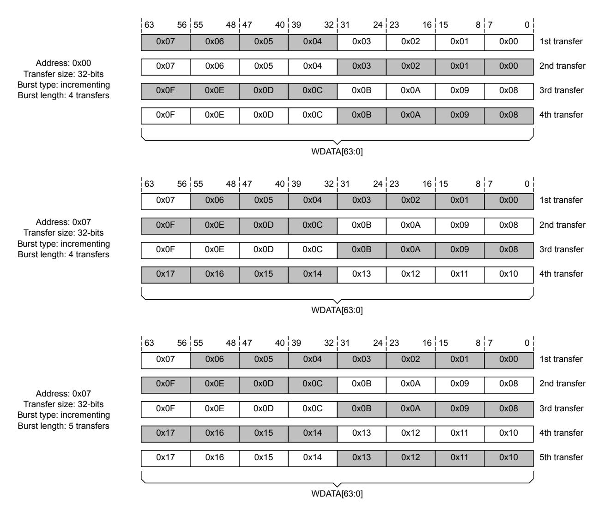

# <span id="page-41-0"></span>Chapter A3 **AXI transactions**

The AXI protocol uses transactions for communication between Managers and Subordinates. All transactions include a request and a response. Write and read transactions also include one or more data transfers.

This chapter describes the transaction requests, responses, and data transfers.

It contains the following sections:

- [A3.1](#page-42-0) *[Transaction request](#page-42-0)*
- [A3.2](#page-52-0) *[Write and read data](#page-52-0)*
- [A3.3](#page-60-0) *[Transaction response](#page-60-0)*

# <span id="page-42-0"></span>**A3.1 Transaction request**

An AXI Manager initiates a transaction by issuing a request to a Subordinate. A request includes transaction attributes and the address of the first data transfer. If the transaction includes more than one data transfer, the Subordinate must calculate the addresses of subsequent transfers.

A transaction must not cross a 4KB address boundary. This prevents a transaction from crossing a boundary between two Subordinates. It also limits the number of address increments that a Subordinate must support.

### <span id="page-42-1"></span>**A3.1.1 Size attribute**

Size indicates the maximum number of bytes in each data transfer.

For read transactions, Size indicates how many data bytes must be valid in each read data transfer.

For write transactions, Size indicates how many data byte lanes are permitted to be active. The write strobes indicate which of those bytes are valid in each transfer.

Size must not exceed the data width of an interface, as determined by the DATA\_WIDTH property.

If Size is smaller than DATA\_WIDTH, a subset of byte lanes is used for each transfer.

Size is communicated using the AWSIZE and ARSIZE signals on the write request and read request channels, respectively. In this specification, AxSIZE indicates AWSIZE and ARSIZE.

**Table A3.1: AxSIZE signals**

<span id="page-42-4"></span><span id="page-42-3"></span>

| Name              | Width | Default            | Description                                                                          |
|-------------------|-------|--------------------|--------------------------------------------------------------------------------------|
| AWSIZE,<br>ARSIZE | 3     | log2(DATA_WIDTH/8) | Indicates the maximum number of bytes in<br>each data transfer within a transaction. |

<span id="page-42-2"></span>Size is encoded on the AxSIZE signals as shown in [Table](#page-42-2) [A3.2.](#page-42-2)

**Table A3.2: AxSIZE encodings**

| AxSIZE | Label | Meaning                |
|--------|-------|------------------------|
| 0b000  | 1     | 1 byte per transfer    |
| 0b001  | 2     | 2 bytes per transfer   |
| 0b010  | 4     | 4 bytes per transfer   |
| 0b011  | 8     | 8 bytes per transfer   |
| 0b100  | 16    | 16 bytes per transfer  |
| 0b101  | 32    | 32 bytes per transfer  |
| 0b110  | 64    | 64 bytes per transfer  |
| 0b111  | 128   | 128 bytes per transfer |
|        |       |                        |

The property SIZE\_Present is used to determine if the AxSIZE signals are present.

**Table A3.3: SIZE\_Present property**

| SIZE_Present | Default | Description                        |
|--------------|---------|------------------------------------|
| True         | Y       | AWSIZE and ARSIZE are present.     |
| False        |         | AWSIZE and ARSIZE are not present. |

A Manager that only issues requests of full data width can omit the AxSIZE outputs from its interface. An attached Subordinate must have its AxSIZE input tied according to the data width.

### <span id="page-43-4"></span><span id="page-43-0"></span>**A3.1.2 Length attribute**

The Length attribute defines the number of data transfers in a transaction.

Size x Length is the maximum number of bytes that can be transferred in a transaction. If the address is unaligned or there are deasserted write strobes, the actual number of bytes transferred can be lower than Size x Length.

A Manager must issue the number of write data transfers according to Length.

A Subordinate must issue the number of read data transfers according to Length.

Length is communicated using the AWLEN and ARLEN signals on the write request and read request channels, respectively. In this specification, AxLEN indicates AWLEN and ARLEN.

**Table A3.4: AxLEN signals**

<span id="page-43-3"></span><span id="page-43-2"></span>

| Name            | Width | Default | Description                                                                        |
|-----------------|-------|---------|------------------------------------------------------------------------------------|
| AWLEN,<br>ARLEN | 8     | 0x00    | The total number of transfers in a transaction,<br>encoded as: Length = AxLEN + 1. |

<span id="page-43-1"></span>The property LEN\_Present is used to determine if the signals are present. [Table](#page-43-1) [A3.5](#page-43-1) shows the legal values of LEN\_Present.

**Table A3.5: LEN\_Present property**

| LEN_Present | Default | Description                      |
|-------------|---------|----------------------------------|
| True        | Y       | AWLEN and ARLEN are present.     |
| False       |         | AWLEN and ARLEN are not present. |

A Manager that only issues requests of Length 1 can omit the AxLEN outputs from its interface. An attached Subordinate must have its AxLEN input tied to 0x00.

The following rules apply to transaction Length:

- For wrapping bursts, Length can be 2, 4, 8, or 16.
- For fixed bursts, Length can be up to 16.
- A transaction must not cross a 4KB address boundary.
- Early termination of transactions is not supported.

<span id="page-43-5"></span>No component can terminate a transaction early. However, to reduce the number of data transfers in a write transaction, the Manager can disable further writing by deasserting all the write strobes. In this case, the Manager must complete the remaining transfers in the transaction. In a read transaction, the Manager can discard read data, but it must complete all transfers in the transaction.

### <span id="page-44-0"></span>**A3.1.3 Maximum number of bytes in a transaction**

The maximum number of bytes in a transaction is 4KB and transactions are not permitted to cross a 4KB boundary. However, many Managers generate transactions which are always smaller than this.

A Subordinate or interconnect might benefit from this information. For example, a Subordinate might be able to optimize away some decode logic. An interconnect striping at a granule smaller than 4KB might be able to avoid burst splitting if it knows that transactions will not cross the stripe boundary.

The property Max\_Transaction\_Bytes defines the maximum size of a transaction in bytes as shown in [Table](#page-44-1) [A3.6.](#page-44-1)

**Table A3.6: Max\_Transaction\_Bytes property**

<span id="page-44-1"></span>

| Name                  | Values                                    | Default | Description                                                                                                                                                                                                                                                                                                   |
|-----------------------|-------------------------------------------|---------|---------------------------------------------------------------------------------------------------------------------------------------------------------------------------------------------------------------------------------------------------------------------------------------------------------------|
| Max_Transaction_Bytes | 64, 128, 256,<br>512, 1024,<br>2048, 4096 | 4096    | A Manager issues transactions where Size x Length is<br>Max_Transaction_Bytes or smaller and do not cross a<br>Max_Transaction_Bytes boundary.<br>A Subordinate can only accept transactions where Size x<br>Length is Max_Transaction_Bytes or smaller and do not<br>cross a Max_Transaction_Bytes boundary. |

<span id="page-44-2"></span>When connecting Manager and Subordinate interfaces, [Table](#page-44-2) [A3.7](#page-44-2) indicates combinations of Max\_Transaction\_Bytes that are compatible.

**Table A3.7: Max\_Transaction\_Bytes interoperability**

| Manager < Subordinate | Manager == Subordinate | Manager > Subordinate |
|-----------------------|------------------------|-----------------------|
| Compatible.           | Compatible.            | Not compatible.       |

### <span id="page-45-4"></span><span id="page-45-0"></span>**A3.1.4 Burst attribute**

The Burst attribute describes how the address increments between transfers in a transaction.

Burst is communicated using the AWBURST and ARBURST signals on the write request and read request channels, respectively. In this specification, AxBURST indicates AWBURST and ARBURST.

**Table A3.8: AxBURST signals**

<span id="page-45-3"></span><span id="page-45-2"></span>

| Name                | Width | Default     | Description                                                                 |
|---------------------|-------|-------------|-----------------------------------------------------------------------------|
| AWBURST,<br>ARBURST | 2     | 0b01 (INCR) | Describes how the address increments between<br>transfers in a transaction. |

<span id="page-45-1"></span>Burst is encoded on the AxBURST signals as shown in [Table](#page-45-1) [A3.9.](#page-45-1)

**Table A3.9: AxBURST encodings**

| AxBURST | Label    | Meaning            |
|---------|----------|--------------------|
| 0b00    | FIXED    | Fixed burst        |
| 0b01    | INCR     | Incrementing burst |
| 0b10    | WRAP     | Wrapping burst     |
| 0b11    | RESERVED | -                  |

The property BURST\_Present is used to determine if the AxBURST signals are present.

A Manager that only issues requests with a Burst type of INCR can omit the AxBURST outputs from its interface. An attached Subordinate must have its AxBURST input tied to 0b01.

**Table A3.10: BURST\_Present property**

| BURST_Present | Default | Description                          |  |
|---------------|---------|--------------------------------------|--|
| True          | Y       | AWBURST and ARBURST are present.     |  |
| False         |         | AWBURST and ARBURST are not present. |  |

There are three different Burst types:

#### *Incrementing address (INCR)*

With this Burst type, the address for each transfer is an increment of the address for the previous transfer. The increment value depends on the transaction Size. For example, for an aligned start address, the address for each transfer in a transaction with a Size of 4 bytes is the previous address plus 4. This Burst type is used for accesses to normal sequential memory.

#### <span id="page-46-2"></span>*Wrapping address (WRAP)*

This Burst type is similar to INCR except that the address wraps around to a lower address if an upper address limit is reached. The following restrictions apply:

- The start address must be aligned to the size of each transfer.
- The Length of the burst must be 2, 4, 8, or 16 transfers.

The behavior of a wrapping transaction is:

- The lowest address accessed by the transaction is the start address aligned to the total size of the data to be transferred, that is Size \* Length. This address is defined as the wrap boundary.
- After each transfer, the address increments in the same way as for an INCR burst. However, if this incremented address is ((wrap boundary)+ (Size \* Length)), then the address wraps round to the wrap boundary.
- The first transfer in the transaction can use an address that is higher than the wrap boundary, subject to the restrictions that apply to wrapping transactions. The address wraps when the first address is higher than the wrap boundary. This Burst type is used for cache line accesses.

Wrapping bursts are primarily intended for reading and writing cache lines. The property Wrap\_CLS\_Modifiable can be used to limit wrapping bursts to being cache line sized and Modifiable (AxCACHE[1] is 0b1). Constraining wrapping bursts using this property can simplify the design of decoders and bridges converting between protocols or data widths.

<span id="page-46-0"></span>Table [A3.11](#page-46-0) describes the Wrap\_CLS\_Modifiable property.

**Table A3.11: Wrap\_CLS\_Modifiable property**

| Wrap_CLS_Modifiable | Default | Description                                                                                                   |
|---------------------|---------|---------------------------------------------------------------------------------------------------------------|
| True                |         | When Burst type is WRAP, the transaction must be cache<br>line sized and Modifiable.                          |
| False               | Y       | When Burst type is WRAP, the transaction is not required<br>to be cache line sized and can be Non-modifiable. |

Note that a wrapping AtomicCompare is not affected by this property, see [A6.4](#page-112-0) *[Atomic transactions](#page-112-0)*.

<span id="page-46-1"></span>Table [A3.12](#page-46-1) shows compatibility for the Wrap\_CLS\_Modifiable property.

**Table A3.12: Wrap\_CLS\_Modifiable compatibility**

| Wrap_CLS_Modifiable | Subordinate: False | Subordinate: True |
|---------------------|--------------------|-------------------|
| Manager: False      | Compatible.        | Not compatible.   |
| Manager: True       | Compatible.        | Compatible.       |

#### *Fixed address (FIXED)*

This Burst type is used for repeated accesses to the same location such as when loading or emptying a FIFO.

- The address is the same for every transfer in the burst.
- The byte lanes that are valid are constant for all transfers. However, within those byte lanes, the actual bytes that have WSTRB asserted can differ for each transfer.
- The Length of the burst can be up to 16 transfers.

• The FIXED burst type can only be used with WriteNoSnoop or ReadNoSnoop Opcodes. See [Chapter](#page-122-0) [A7](#page-122-0) *[Request Opcodes](#page-122-0)* for more information.

<span id="page-47-0"></span>A Burst type of FIXED is not commonly used, and a property Fixed\_Burst\_Disable is defined in Table [A3.13](#page-47-0) to indicate if a component supports it.

**Table A3.13: Fixed\_Burst\_Disable property**

| Fixed_Burst_Disable | Default | Description                                                                                                                  |
|---------------------|---------|------------------------------------------------------------------------------------------------------------------------------|
| True                |         | Requests with Burst type FIXED are not<br>supported by a Subordinate interface and<br>not generated by a Manager interface.  |
| False               | Y       | Requests with Burst type FIXED are<br>supported by a Subordinate interface and<br>might be generated by a Manager interface. |

<span id="page-47-1"></span>Compatibility between Manager and Subordinate interfaces, according to the values of the Fixed\_Burst\_Disable property is shown in Table [A3.14.](#page-47-1)

**Table A3.14: Fixed\_Burst\_Disable compatibility**

| Fixed_Burst_Disable | Subordinate: False | Subordinate: True |
|---------------------|--------------------|-------------------|
| Manager: False      | Compatible.        | Not compatible.   |
| Manager: True       | Compatible.        | Compatible.       |

### <span id="page-48-0"></span>**A3.1.5 Transfer address**

This section provides methods for determining the address and byte lanes of transfers within a transaction.

The start address for a transaction is indicated using the AxADDR signals.

**Table A3.15: AxADDR signals**

<span id="page-48-3"></span><span id="page-48-2"></span>

| Name              | Width      | Default | Description                                 |
|-------------------|------------|---------|---------------------------------------------|
| AWADDR,<br>ARADDR | ADDR_WIDTH | -       | Address of first transfer in a transaction. |

#### *Address width*

The property ADDR\_WIDTH is used to define the address width.

**Table A3.16: ADDR\_WIDTH property**

| Name       | Values | Default | Description                                  |
|------------|--------|---------|----------------------------------------------|
| ADDR_WIDTH | 164    | 32      | Width of AWADDR, ARADDR, and ACADDR in bits. |

The protocol supports communication between components that have different physical address space sizes. Components with different physical address space sizes must communicate as follows:

- The component with the smaller physical address space must be positioned within an aligned window in the larger physical address space. Typically, the window is located at the bottom of the larger physical address space. However, it is acceptable for the component with the smaller physical address space to be positioned in an offset window within the larger physical address space.
- An outgoing transaction must have the required additional higher-order bits added to the transaction address.
- An incoming transaction must be examined so that:
  - A transaction that is within the address window has the higher-order address bits removed and is passed through.
  - A transaction that does not have the required higher-order address bits is suppressed.

It is the responsibility of the interconnect to provide the required functionality.

### <span id="page-48-4"></span><span id="page-48-1"></span>**A3.1.6 Transaction equations**

The equations listed here are used to determine the address and active data byte lanes for each transfer in a transaction. The equations use the following additional variables:

- Start\_Addr: The start address that is issued by the Manager.
- Data\_Bytes: The width of the data channels in bytes (DATA\_WIDTH/8).
- Aligned\_Addr: The aligned version of the start address.
- Address\_N: The address of transfer N in a transaction. N is 1 for the first transfer in a transaction.
- Wrap\_Boundary: The lowest address within a wrapping transaction.
- Lower\_Byte\_Lane: The byte lane of the lowest addressed byte of a transfer.
- Upper\_Byte\_Lane: The byte lane of the highest addressed byte of a transfer.
- INT(x): The rounded-down integer value of x.

#### *A3.1. Transaction request*

These equations determine addresses of transfers within a burst:

```
Start_Addr = AxADDR
Aligned_Addr = INT(Start_Addr / Size)* Size
```

This equation determines the address of the first transfer in a burst:

```
Address_1 = Start_Addr
```

For an INCR burst and for a WRAP burst for which the address has not wrapped, this equation determines the address of any transfer after the first transfer in a burst:

```
Address_N = Aligned_Addr + (N - 1)* Size
```

For a WRAP burst, the Wrap\_Boundary variable defines the wrapping boundary:

```
Wrap_Boundary = INT(Start_Addr / (Size * Length))* Size * Length
```

For a WRAP burst, if Address\_N = Wrap\_Boundary + Size \* Length, then:

• Use this equation for the current transfer:

```
Address_N = Wrap_Boundary
```

• Use this equation for any subsequent transfers:

```
Address_N = Aligned_Addr + ((N - 1)* Size)- (Size * Length)
```

These equations determine the byte lanes to use for the first transfer in a burst:

```
Lower_Byte_Lane = Start_Addr - (INT(Start_Addr/Data_Bytes)* Data_Bytes)
Upper_Byte_Lane = Aligned_Addr + (Size-1)- (INT(Start_Addr/Data_Bytes)* Data_Bytes)
```

These equations determine the byte lanes to use for all transfers after the first transfer in a burst:

```
Lower_Byte_Lane = Address_N - (INT(Address_N / Data_Bytes)* Data_Bytes)
Upper_Byte_Lane = Lower_Byte_Lane + Size - 1
```

Data is transferred on:

```
DATA((8 * Upper_Byte_Lane)+ 7: (8 * Lower_Byte_Lane))
```

The transaction container describes all the bytes that could be accessed in that transaction, if the address is aligned and strobes are asserted:

```
Container_Size = Size * Length
```

### For INCR bursts:

```
Container_Lower = Aligned_Addr
Container_Upper = Aligned_Addr + Container_Size
```

## For WRAP bursts:

```
Container_Lower = Wrap_Boundary
Container_Upper = Wrap_Boundary + Container_Size
```

### <span id="page-50-0"></span>**A3.1.7 Pseudocode description of the transfers**

```
// DataTransfer()
DataTransfer(Start_Addr, Size, Length, Data_Bytes, Burst, IsWrite)
// IsWrite is TRUE for a write, and FALSE for a read
    addr = Start_Addr; // Variable for current address
    Aligned_Addr = (INT(addr/Size) * Size);
    aligned = (Aligned_Addr == addr); // Check whether addr aligned to Size
    Container_Size = Size * Length;
    if Burst == WRAP then
        Lower_Wrap_Boundary = (INT(addr/Container_Size) * Container_Size);
        // addr must be aligned for a wrapping burst
        Upper_Wrap_Boundary = Lower_Wrap_Boundary + Container_Size;
    for n = 1 to Length
        Lower_Byte_Lane = addr - (INT(addr/Data_Bytes) * Data_Bytes);
        if aligned then
            Upper_Byte_Lane = Lower_Byte_Lane + Size - 1
        else
            Upper_Byte_Lane = Aligned_Addr + Size - 1
                               - (INT(addr/Data_Bytes) * Data_Bytes);
        // Perform data transfer
        if IsWrite then
            dwrite(addr, Lower_Byte_Lane, Upper_Byte_Lane)
        else
            dread(addr, Lower_Byte_Lane, Upper_Byte_Lane);
        // Increment address if necessary
        if Burst != FIXED then
            if aligned then
                addr = addr + Size;
                if Burst == WRAP then
                    if addr >= Upper_Wrap_Boundary then addr = Lower_Wrap_Boundary;
            else
                addr = Aligned_Addr + Size;
                aligned = TRUE; // All transfers after the first are aligned
    return;
```

### <span id="page-51-0"></span>**A3.1.8 Regular transactions**

There are many options of burst, size, and length for a transaction. However, some interfaces and transaction types might only use a subset of these options. If a Subordinate component is attached to a Manager which uses only a subset of transaction options, it can be designed with simplified decode logic.

The Regular attribute is defined, to identify transactions which meet the following criteria:

- Length is 1, 2, 4, 8, or 16 transfers.
- Size is the same as the data channel width if Length is greater than 1.
- Burst is INCR or WRAP, not FIXED.
- Address is aligned to the transaction container for INCR transactions.
- Address is aligned to Size for WRAP transactions.

The Regular\_Transactions\_Only property is used to define whether a Manager issues only Regular type transactions and if a Subordinate only supports Regular transactions.

**Table A3.17: Regular\_Transactions\_Only property**

| Regular_Transactions_Only | Default | Description                                                                |
|---------------------------|---------|----------------------------------------------------------------------------|
| True                      |         | Only Regular transactions are issued/supported.                            |
| False                     | Y       | All legal combinations of Burst, Size, and Length are<br>issued/supported. |

<span id="page-51-1"></span>Interoperability rules for Regular transactions are shown in Table [A3.18.](#page-51-1)

**Table A3.18: Regular\_Transactions\_Only interoperability**

|                | Subordinate: False | Subordinate: True                                                                                                            |
|----------------|--------------------|------------------------------------------------------------------------------------------------------------------------------|
| Manager: False | Compatible.        | Not compatible.<br>If the Manager issues a transaction that is not Regular,<br>then data corruption or deadlock might occur. |
| Manager: True  | Compatible.        | Compatible.                                                                                                                  |

# <span id="page-52-0"></span>**A3.2 Write and read data**

This section describes the AXI write and read data channels and how the interface performs mixed-endian and unaligned transfers.

Write and read data signals have the same width, specified using the DATA\_WIDTH property.

**Table A3.19: DATA\_WIDTH property**

| Name       | Values                                | Default | Description                                     |
|------------|---------------------------------------|---------|-------------------------------------------------|
| DATA_WIDTH | 8, 16, 32, 64, 128,<br>256, 512, 1024 | -       | Data width in bits, applies to RDATA and WDATA. |

### <span id="page-52-3"></span><span id="page-52-2"></span><span id="page-52-1"></span>**A3.2.1 Write data channel (W)**

The data and last signals for the write data channel are shown in Table [A3.20.](#page-52-2)

**Table A3.20: Write data signals**

<span id="page-52-4"></span>

| Name  | Width      | Default | Description                                                                                     |
|-------|------------|---------|-------------------------------------------------------------------------------------------------|
| WDATA | DATA_WIDTH | -       | The write data signal carries data between a<br>Manager and Subordinate in a write transaction. |
| WLAST | 1          | -       | Indicates the last write data transfer of a<br>transaction.                                     |

The following rules apply:

- The Manager must assert the WLAST signal while it is driving the final write transfer in the transaction.
- It is recommended that WDATA is driven to zero for inactive byte lanes.
- A Subordinate that does not use WLAST can omit the input from its interface.

The property WLAST\_Present is used to determine if the WLAST signal is present.

**Table A3.21: WLAST\_Present property**

| WLAST_Present | Default | Description           |
|---------------|---------|-----------------------|
| True          | Y       | WLAST is present.     |
| False         |         | WLAST is not present. |

### <span id="page-53-1"></span>**A3.2.1.1 Write strobes**

The WSTRB signal carries write strobes that specify which byte lanes of the write data channel contain valid information.

**Table A3.22: WSTRB signal**

<span id="page-53-0"></span>

| Name  | Width          | Default  | Description                                                                       |
|-------|----------------|----------|-----------------------------------------------------------------------------------|
| WSTRB | DATA_WIDTH / 8 | All ones | Indicates which byte lanes of WDATA<br>contain valid data in a write transaction. |

There is one write strobe for each 8 bits of the write data channel, therefore WSTRB[n] corresponds to WDATA[(8n)+7:(8n)].

#### When WVALID is HIGH:

- Data bytes to be written have a corresponding write strobe set HIGH.
- Inside of the transaction container any number of write strobes can be HIGH. If all write strobes are LOW, no data is written from that transfer.
- Outside of the transaction container all write strobes must be LOW.

#### When WVALID is LOW:

- Write strobes can take any value, although it is recommended that they are either driven LOW or held at their previous value.
- It is recommended that WDATA is driven to zero for byte lanes where the strobe is LOW.

The property WSTRB\_Present is used to indicate if the WSTRB signal is present on an interface.

**Table A3.23: WSTRB\_Present property**

| WSTRB_Present | Default | Description           |
|---------------|---------|-----------------------|
| True          | Y       | WSTRB is present.     |
| False         |         | WSTRB is not present. |

A Manager that only issues transactions where all write strobes are asserted can omit the WSTRB output from its interface. An attached Subordinate must have its WSTRB input tied HIGH.

### <span id="page-54-3"></span><span id="page-54-2"></span><span id="page-54-0"></span>**A3.2.2 Read data channel (R)**

The read data and last signals are shown in Table [A3.24.](#page-54-2)

**Table A3.24: Read data channel control signals**

<span id="page-54-4"></span>

| Name  | Width      | Default | Description                                                                                   |
|-------|------------|---------|-----------------------------------------------------------------------------------------------|
| RDATA | DATA_WIDTH | -       | The read data signal carries data between a<br>Subordinate and Manager in a read transaction. |
| RLAST | 1          | -       | Indicates the last read data transfer of a<br>transaction.                                    |

The following rules apply:

- Even if a Subordinate has only one source of read data, it must assert the RVALID signal only in response to a request.
- The Subordinate must assert the RLAST signal when it is driving the final read transfer in the transaction.
- It is recommended that RDATA is driven to zero for inactive byte lanes.
- A Manager that does not use RLAST can omit the input from its interface.

The property RLAST\_Present is used to determine if the RLAST signal is present.

**Table A3.25: RLAST\_Present property**

| RLAST_Present | Default | Description           |
|---------------|---------|-----------------------|
| True          | Y       | RLAST is present.     |
| False         |         | RLAST is not present. |

## <span id="page-54-1"></span>**A3.2.3 Narrow transfers**

When a Manager generates a transfer that is narrower than its data channel, the address and control information determine the byte lanes that the transfer uses:

- When Burst is INCR or WRAP, different byte lanes are used for each data transfer in the transaction.
- When Burst is FIXED, the same byte lanes are used for each data transfer in the transaction.

Two examples of byte lane use are shown in [Figure](#page-55-1) [A3.1](#page-55-1) and [Figure](#page-55-2) [A3.2.](#page-55-2) The shaded cells indicate bytes that are not transferred.

#### In [Figure](#page-55-1) [A3.1:](#page-55-1)

- The transaction has five data transfers.
- The starting address is 0.
- Each transfer is 8 bits.
- The transfers are on a 32-bit data channel.
- The burst type is INCR.

<span id="page-55-1"></span>

**Figure A3.1: Narrow transfer example with 8-bit transfers**

### In [Figure](#page-55-2) [A3.2:](#page-55-2)

- The transaction has three data transfers.
- The starting address is 4.
- Each transfer is 32 bits.
- The transfers are on a 64-bit data channel.

<span id="page-55-2"></span>

**Figure A3.2: Narrow transfer example with 32-bit transfers**

### <span id="page-55-0"></span>**A3.2.4 Byte invariance**

To access mixed-endian data structures in a single memory space, the AXI protocol uses a byte-invariant endianness scheme.

Byte-invariant endianness means that for any multi-byte element in a data structure:

- The element uses the same continuous bytes of memory, regardless of the endianness of the data.
- The endianness determines the order of those bytes in memory, meaning it determines whether the first byte in memory is the *most significant byte* (MSB) or the *least significant byte* (LSB) of the element.
- Any byte transfer to an address passes the 8 bits of data on the same data channel wires to the same address location, regardless of the endianness of any larger data element that it is a constituent of.

Components that have only one transfer width must have their byte lanes connected to the appropriate byte lanes of the data channel. Components that support multiple transfer widths might require a more complex interface to convert an interface that is not naturally byte-invariant.

Most little-endian components can connect directly to a byte-invariant interface. Components that support only big-endian transfers require a conversion function for byte-invariant operation.

The examples in [Figure](#page-56-0) [A3.3](#page-56-0) and [Figure](#page-56-1) [A3.4](#page-56-1) show a 32-bit number 0x0A0B0C0D, stored in a register and in a memory.

In [Figure](#page-56-0) [A3.3](#page-56-0) there is an example of the big-endian, byte-invariant data structure. In this structure:

- The MSB of the data, which is 0x0A, is stored in the MSB position in the register.
- The MSB of the data is stored in the memory location with the lowest address.
- The other data bytes are positioned in decreasing order of significance.

<span id="page-56-0"></span>

**Figure A3.3: Example big-endian byte-invariant data structure**

In [Figure](#page-56-1) [A3.4](#page-56-1) there is an example of a little-endian, byte-invariant data structure. In this structure:

- The LSB of the data, which is 0x0D, is stored in the LSB position in the register.
- The LSB of the data is stored in the memory location with the lowest address.
- The other data bytes are positioned in increasing order of significance.

<span id="page-56-1"></span>

**Figure A3.4: Example little-endian byte-invariant data structure**

The examples in [Figure](#page-56-0) [A3.3](#page-56-0) and [Figure](#page-56-1) [A3.4](#page-56-1) show that byte invariance ensures that big-endian and little-endian structures can coexist in a single memory space without corruption.

In [Figure](#page-57-1) [A3.5](#page-57-1) there is an example of a data structure that requires byte-invariant access. In this example, the header fields use little-endian ordering, and the payload uses big-endian ordering.

<span id="page-57-1"></span>

† 16-bit continuous Destination field

**Figure A3.5: Example mixed-endian data structure**

In this example structure, Data items is a two-byte little-endian element, meaning its lowest address is its LSB. The use of byte invariance ensures that a big-endian access to the payload does not corrupt the little-endian element.

### <span id="page-57-0"></span>**A3.2.5 Unaligned transfers**

AXI supports unaligned transfers. For any transaction that is made up of data transfers wider than 1 byte, the first bytes accessed might be unaligned with the natural address boundary. For example, a 32-bit data packet that starts at a byte address of 0x1002 is not aligned to the natural 32-bit address boundary.

### A Manager can:

- Use the low-order address lines to signal an unaligned start address.
- Provide an aligned address and use the byte lane strobes to signal the unaligned start address.

The information on the low-order address lines must be consistent with the information on the byte lane strobes.

The Subordinate is not required to take special action based on any alignment information from the Manager.

In [Figure](#page-58-0) [A3.6](#page-58-0) there are examples of aligned and unaligned 32-bit transactions on a 32-bit data channel. Each row in the figure represents a transfer and the shaded cells indicate bytes that are not transferred.

<span id="page-58-0"></span>

**Figure A3.6: Aligned and unaligned transfers on a 32-bit data channel**

In [Figure](#page-59-0) [A3.7](#page-59-0) there are examples of aligned and unaligned 32-bit transactions on a 64-bit data channel. Each row

in the figure represents a transfer and the shaded cells indicate bytes that are not transferred.

<span id="page-59-0"></span>

**Figure A3.7: Aligned and unaligned transfers on a 64-bit data channel**

In [Figure](#page-59-1) [A3.8](#page-59-1) there is an example of an aligned 32-bit wrapping transaction on a 64-bit data channel. Each row in the figure represents a transfer and the shaded cells indicate bytes that are not transferred.

<span id="page-59-1"></span>Address: 0x04 Transfer size: 32-bits Burst type: wrapping Burst length: 4 transfers 0x07 0x06 0x05 0x04 0x0F 0x0E 0x0D 0x0C 0x0F 0x0E 0x0D 0x0C 0x07 0x06 0x05 0x04 0x03 0x02 0x01 0x00 0x0B 0x0A 0x09 0x08 0x0B 0x0A 0x09 0x08 0x03 0x02 0x01 0x00 1st transfer 2nd transfer 3rd transfer 4th transfer 63 485556 3947 40 243132 15 81623 07 WDATA[63:0]

**Figure A3.8: Aligned wrapping transfers on a 64-bit channel**

# <span id="page-60-0"></span>**A3.3 Transaction response**

Every AXI transaction includes one or more response transfers sent by the Subordinate to indicate the result of the transaction.

Transactions on the write channels have one or more write responses.

Transactions on the read channels have one or more read responses.

Atomic transactions have write and read responses, see [A6.4](#page-112-0) *[Atomic transactions](#page-112-0)*.

# <span id="page-60-1"></span>**A3.3.1 Write response**

Write responses are transported using the BRESP signal on the write response channel. All transactions on the write channels have one Completion response which indicates the result of the transaction. Some transactions also have a second write response, for example to indicate Persistence, see [A9.8.4](#page-164-2) *[PCMO response on the B channel](#page-164-2)*.

The BRESP and BCOMP signals are used to send write responses.

**Table A3.26: BRESP and BCOMP signals**

<span id="page-60-3"></span>

| Name  | Width       | Default         | Description                                                            |
|-------|-------------|-----------------|------------------------------------------------------------------------|
| BRESP | BRESP_WIDTH | 0b000<br>(OKAY) | Indicates the result of a transaction that uses the<br>write channels. |
| BCOMP | 1           | 0b1             | Asserted HIGH to indicate a Completion response.                       |

<span id="page-60-4"></span><span id="page-60-2"></span>The BRESP\_WIDTH property is defined in Table [A3.27.](#page-60-2)

**Table A3.27: BRESP\_WIDTH property**

| Name        | Values  | Default | Description                                                                                                                                              |
|-------------|---------|---------|----------------------------------------------------------------------------------------------------------------------------------------------------------|
| BRESP_WIDTH | 0, 2, 3 | 2       | Width of BRESP in bits.<br>Must be 3 if:<br>Untranslated_Transactions = v2 OR<br>Untranslated_Transactions = v3 OR<br>WriteDeferrable_Transaction = True |

BRESP is an optional signal. If the BRESP\_WIDTH property is 0, it is not present and assumed to be 0b000 (OKAY).

BCOMP is only present if an interface is using a feature that can have two write responses, these are:

- Cache maintenance for Persistence, see [A9.8](#page-163-0) *[CMOs for Persistence](#page-163-0)*.
- Memory Tagging, see [A12.2](#page-189-0) *[Memory Tagging Extension \(MTE\)](#page-189-0)*.

If BCOMP is present, it must be asserted for one response transfer of every transaction on the write channels.

The BRESP encodings are shown in Table [A3.28.](#page-61-1)

**Table A3.28: BRESP encodings**

<span id="page-61-1"></span>

| BRESP | Label       | Meaning                                                                                                                                                                                                                                               |  |
|-------|-------------|-------------------------------------------------------------------------------------------------------------------------------------------------------------------------------------------------------------------------------------------------------|--|
| 0b000 | OKAY        | Non-exclusive write: The transaction was successful. If the transaction<br>includes write data, the updated value is observable.<br>Exclusive write: Failed to update the location.                                                                   |  |
| 0b001 | EXOKAY      | Exclusive write succeeded. This response is only permitted for an<br>exclusive write.                                                                                                                                                                 |  |
| 0b010 | SLVERR      | The request has reached an end point but has not completed successfully.<br>The location might not be fully updated. Typically used when there is a<br>problem within a Subordinate such as trying to access a read-only or<br>powered-down function. |  |
| 0b011 | DECERR      | The request has not reached a point where data can be written. The<br>location might not be fully updated. Typically used when the address<br>decodes to an invalid address.                                                                          |  |
| 0b100 | DEFER       | Write was unsuccessful because it cannot be serviced at this time. The<br>location is not updated. This response is only permitted for a<br>WriteDeferrable transaction.                                                                              |  |
| 0b101 | TRANSFAULT  | Write was terminated because of a translation fault which might be<br>resolved by a PRI request. Only permitted for requests using the PRI<br>flow.                                                                                                   |  |
| 0b110 | RESERVED    | -                                                                                                                                                                                                                                                     |  |
| 0b111 | UNSUPPORTED | Write was unsuccessful because the transaction type is not supported by<br>the target. The location is not updated. This response is only permitted<br>for a WriteDeferrable transaction.                                                             |  |

### <span id="page-61-0"></span>**A3.3.2 Read response**

The read response indicates if the read was successful and whether the data in that transfer is valid.

Read responses are transported using the RRESP signal on the read data channel. There is a read response with every read data transfer in a transaction. The response value is not required to be the same for every read data transfer in a transaction.

It is required that all data transfers as indicated by Length are always completed irrespective of the response. For some responses, the data in that transfer is not required to be valid.

<span id="page-61-2"></span>The RRESP signal is defined in Table [A3.29.](#page-61-2)

**Table A3.29: RRESP signal**

<span id="page-61-3"></span>

| Name  | Width       | Default         | Description                                                                               |
|-------|-------------|-----------------|-------------------------------------------------------------------------------------------|
| RRESP | RRESP_WIDTH | 0b000<br>(OKAY) | Response for transactions on the read channels.<br>Must be valid when RVALID is asserted. |

<span id="page-62-0"></span>The RRESP\_WIDTH property is defined in Table [A3.30.](#page-62-0)

**Table A3.30: RRESP\_WIDTH property**

| Name        | Values  | Default | Description                                                                                                                                                                        |
|-------------|---------|---------|------------------------------------------------------------------------------------------------------------------------------------------------------------------------------------|
| RRESP_WIDTH | 0, 2, 3 | 2       | Width of RRESP in bits.<br>Must be 3 if Prefetch_Transaction = True OR<br>Untranslated_Transactions = v2 OR<br>Untranslated_Transactions = v3 OR<br>Shareable_Cache_Support = True |

RRESP is an optional signal. If the RRESP\_WIDTH property is 0, it is not present and assumed to be 0b000 (OKAY).

The RRESP encodings are shown in Table [A3.31.](#page-62-1)

<span id="page-62-1"></span>For responses where data is not required to be valid, the Manager might still sample the RDATA value so the Subordinate should not rely on the response to hide sensitive data.

**Table A3.31: RRESP encodings**

| RRESP | Label      | Meaning                                                                                                                                                                                                                                                                       |
|-------|------------|-------------------------------------------------------------------------------------------------------------------------------------------------------------------------------------------------------------------------------------------------------------------------------|
| 0b000 | OKAY       | Non-exclusive read: Transaction has completed successfully, read data<br>is valid.<br>Exclusive read: Subordinate does not support exclusive accesses.                                                                                                                        |
| 0b001 | EXOKAY     | Exclusive read succeeded. This response is only permitted for an<br>exclusive read.                                                                                                                                                                                           |
| 0b010 | SLVERR     | Transaction has encountered a contained error; only this location is<br>affected. Typically used when there is a problem within a Subordinate<br>such as a FIFO overrun, unsupported transfer size or trying to access a<br>powered-down function.<br>Read data is not valid. |
| 0b011 | DECERR     | Transaction has encountered a non-contained error; other locations may<br>be affected. Typically used when the address decodes to an invalid<br>address. Read data is not valid.                                                                                              |
| 0b100 | PREFETCHED | Read data is valid and has been sourced from a prefetched value.                                                                                                                                                                                                              |
| 0b101 | TRANSFAULT | Transaction was terminated because of a translation fault which might<br>be resolved by a PRI request. Read data is not valid. Only permitted for<br>requests using the PRI flow.                                                                                             |
| 0b110 | OKAYDIRTY  | Read data is valid and is Dirty with respect to the value in memory.<br>Only permitted for a response to a ReadShared request.                                                                                                                                                |
| 0b111 | RESERVED   | -                                                                                                                                                                                                                                                                             |

The value of RRESP is not constrained to be the same for every transfer in a transaction. A response of DECERR is generally used when there is a problem accessing a Subordinate, and in this case DECERR is signaled consistently in every transfer of read data. There may be a benefit if a Manager can inspect just one read data transfer to determine whether a DECERR has occurred.

The Consistent\_DECERR property is used to define whether a Subordinate signals DECERR consistently within a transaction as shown in Table [A3.32.](#page-63-1)

**Table A3.32: Consistent\_DECERR property**

<span id="page-63-1"></span>

| Consistent_DECERR | Default | Description                                                                                                                                                                                                                                                                                                  |
|-------------------|---------|--------------------------------------------------------------------------------------------------------------------------------------------------------------------------------------------------------------------------------------------------------------------------------------------------------------|
| True              |         | DECERR is signaled for every read data transfer, or no read data<br>transfers in each cache line of data.<br>For example, a transaction which crosses a cache line boundary can<br>receive a DECERR response for every read data transfer on one cache<br>line and no data transfers on the next cache line. |
| False             | Y       | DECERR may be signaled on any number of read data transfers.                                                                                                                                                                                                                                                 |

A Subordinate interface that does not use the DECERR response can set the Consistent\_DECERR property to True.

A Manager with Consistent\_DECERR set True can inspect a single data transfer to determine whether a DECERR has occurred.

Setting this property to True can be helpful when bridging between AXI and CHI where DECERR translates to a Non-data Error.

<span id="page-63-2"></span>When connecting Manager and Subordinate interfaces, Table [A3.33](#page-63-2) indicates combinations of Consistent\_DECERR that are compatible.

**Table A3.33: Consistent\_DECERR interoperability**

|                | Subordinate: False                                                      | Subordinate: True |
|----------------|-------------------------------------------------------------------------|-------------------|
| Manager: False | Compatible.                                                             | Compatible.       |
| Manager: True  | Not compatible.<br>A DECERR response might be<br>missed by the Manager. | Compatible.       |

### <span id="page-63-0"></span>**A3.3.3 Subordinate Busy indicator**

When providing a response, a Subordinate can indicate its current level of activity using the Busy indicator. This information can be used to control the issue rate of a Manager or how many speculative transactions it produces.

The Busy indication is useful for components with a shared resource, such as a memory controller or system cache. For example, the Busy indication can indicate:

- The level of a shared queue.
- The level of a read or write request queue, depending on the direction of the transaction.
- When the resource usage by a component is more or less than its allocated value.

The Busy\_Support property as shown in Table [A3.34](#page-64-0) is used to define whether an interface includes the Busy indicator signals.

**Table A3.34: Busy\_Support property**

| Busy_Support<br>Default |   | Description                        |
|-------------------------|---|------------------------------------|
| True                    |   | Subordinate busy is supported.     |
| False                   | Y | Subordinate busy is not supported. |

<span id="page-64-0"></span>When Busy\_Support is True, the following signals are included on an interface.

**Table A3.35: Busy indicator signals**

<span id="page-64-4"></span><span id="page-64-3"></span>

| Name            | Width | Default | Description                                                                                                                                 |
|-----------------|-------|---------|---------------------------------------------------------------------------------------------------------------------------------------------|
| BBUSY,<br>RBUSY | 2     | 0b00    | Indicates the current level of Subordinate activity<br>in a transaction response. The value increases as<br>the Subordinate becomes busier. |

For transactions with multiple read data transfers, Busy must be valid but can take a different value for every transfer.

For transactions with multiple write responses, Busy must be valid in the response with BCOMP asserted. For other write responses, Busy is not applicable and can take any value.

For Atomic transactions with write and read responses, BBUSY and RBUSY are expected, but not required to have the same value.

<span id="page-64-1"></span>The exact usage of Busy indicator values is IMPLEMENTATION DEFINED, in Table [A3.36](#page-64-1) there is an example of how it can be used. In this example, a default value of 0b01 would be appropriate if a Subordinate was not able to generate a dynamic busy indicator.

**Table A3.36: Example usage of the Busy indicator**

| Busy indicator value | Meaning        | Manager behavior                       |
|----------------------|----------------|----------------------------------------|
| 0b00                 | Not busy       | Increase speculative requests.         |
| 0b01                 | Optimally busy | No change.                             |
| 0b10                 | Quite busy     | Decrease speculative requests.         |
| 0b11                 | Very busy      | Heavily decrease speculative requests. |

<span id="page-64-2"></span>When connecting Manager and Subordinate interfaces, Table [A3.37](#page-64-2) indicates combinations of Busy\_Support that are compatible.

**Table A3.37: Busy\_Support interoperability**

|                | Subordinate: False                                        | Subordinate: True                                 |
|----------------|-----------------------------------------------------------|---------------------------------------------------|
| Manager: False | Compatible.                                               | Compatible, BUSY outputs are left<br>unconnected. |
| Manager: True  | Compatible, BUSY inputs are tied<br>to the default value. | Compatible.                                       |
