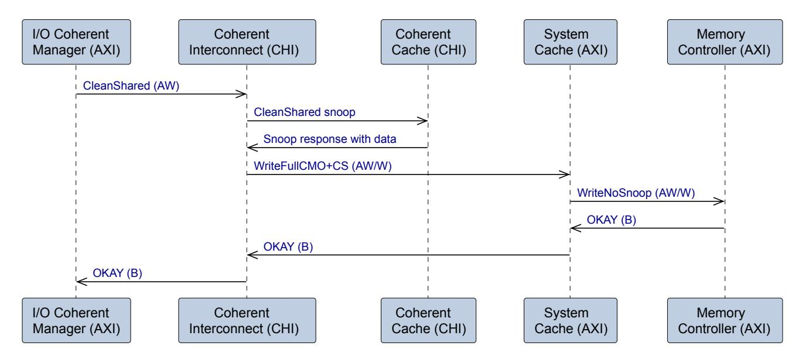
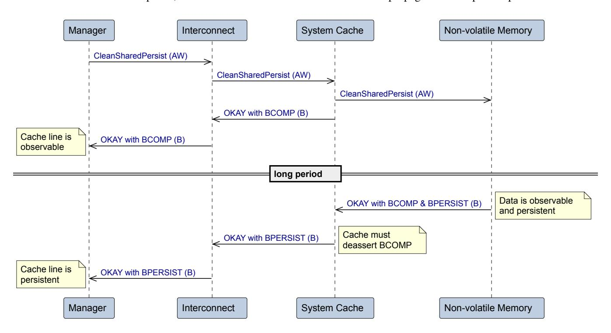
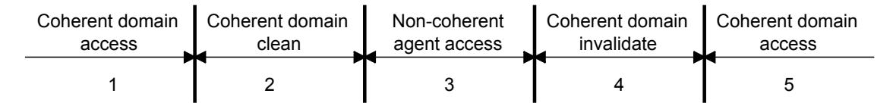

# Chapter A9

# **Cache maintenance**

This chapter describes cache maintenance operations (CMOs) that assist with software cache management. It contains the following sections:

- [A9.1](#page-153-0) *[Cache Maintenance Operations](#page-153-0)*
- [A9.2](#page-154-0) *[Actions on receiving a CMO](#page-154-0)*
- [A9.3](#page-155-0) *[CMO request attributes](#page-155-0)*
- [A9.4](#page-156-0) *[CMO propagation](#page-156-0)*
- [A9.5](#page-157-0) *[CMOs on the write channels](#page-157-0)*
- [A9.6](#page-159-0) *[Write with CMO](#page-159-0)*
- [A9.7](#page-162-0) *[CMOs on the read channels](#page-162-0)*
- [A9.8](#page-163-0) *[CMOs for Persistence](#page-163-0)*
- [A9.9](#page-167-0) *[Cache maintenance and Realm Management Extension](#page-167-0)*
- [A9.10](#page-169-0) *[Cache maintenance to the Point of Physical Storage](#page-169-0)*
- [A9.11](#page-171-0) *[Processor cache maintenance instructions](#page-171-0)*

# **A9.1 Cache Maintenance Operations**

Cache maintenance operations are requests that instruct caches to clean and invalidate cache lines. Unlike the allocation and deallocation hints, it is mandatory that a cache actions a CMO that targets a line it has cached.

CMOs can be transported on either the read or write channels.

Transporting CMOs on read channels is included in this specification to support legacy components. It is recommended that the new designs transmit CMOs on the write channels.

The specification supports the following cache maintenance operations.

#### *CleanShared (CS)*

When completed, all cached copies of the addressed line are Clean and any associated writes are observable.

#### *CleanSharedPersist (CSP)*

When completed, all cached copies of the addressed line are Clean and any associated writes are observable and have reached the Point of Persistence (PoP). See [A9.8](#page-163-0) *[CMOs for Persistence](#page-163-0)*.

### *CleanSharedDeepPersist (CSDP)*

When completed, all cached copies of the addressed line are Clean and any associated writes are observable and have reached the Point of Deep Persistence (PoDP). See [A9.8](#page-163-0) *[CMOs for Persistence](#page-163-0)*.

### *CleanInvalid (CI)*

When completed, all cached copies of the addressed line are invalidated, having been written to memory if they were Dirty. Any associated writes are observable.

### *CleanInvalidPoPA (CIPA)*

When completed, all cached copies of the addressed line are invalidated, and any Dirty cached copy is written past the Point of Physical Aliasing (PoPA). See [A9.9](#page-167-0) *[Cache maintenance and Realm Management Extension](#page-167-0)*.

### *CleanInvalidStorage (CIS)*

When completed, all cached copies of the addressed line are invalidated, and any Dirty cached copy is written past the Point of Physical Storage (PoPS). See [A9.10](#page-169-0) *[Cache maintenance to the Point of Physical Storage](#page-169-0)*.

#### *MakeInvalid (MI)*

When completed, all cached copies of the addressed line are invalidated, and any Dirty cached copy might have been discarded.

# **A9.2 Actions on receiving a CMO**

When a component receives a CMO, it must do the following:

- 1. If the component is a cache and the CMO is cacheable, it must look up the line.
- 2. If the component is a coherent interconnect and the CMO is Shareable, a CMO snoop must be sent to any cache that might have the line:
  - Allocated, for an Invalidate CMO.
  - Dirty, for a Clean CMO.

Note that a coherent protocol such as AMBA CHI [\[5\]](#page-16-5) is required to send CMO snoop requests.

- 3. For a Clean CMO, write back any dirty data that is found in the cache or peer caches.
  - It is recommended that Write-Through No-Allocate is used for writes to memory which will be followed by a CMO to the same line. This ensures that the line will be looked up in any downstream cache but will not be allocated.
- 4. Wait for all snoops and associated writes to receive a response.
- 5. If the CMO does not need to be sent downstream, the component can issue a response to the CMO.
- 6. If the CMO does need to be sent downstream, the CMO must be sent and the response that is returned must be propagated when it is received from downstream.

# **A9.3 CMO request attributes**

The following rules apply to CMO transactions:

- The request must be cache line sized and Regular. See [A3.1.8](#page-51-0) *[Regular transactions](#page-51-0)* for more details.
- The Domain can be Non-shareable or Shareable.
  - System Domain is not permitted, which means that CMO transactions must be Normal rather than Device.
  - If AxDOMAIN is omitted from the interface, CMO transactions are assumed to be Non-shareable.

The AxCACHE and AxDOMAIN attributes indicate which caches must action a CMO, as shown in [Table](#page-155-1) [A9.1.](#page-155-1)

**Table A9.1: CMO applicability**

| AxCACHE       | AxDOMAIN      | CMO applies to                 |
|---------------|---------------|--------------------------------|
| Device        | System        | N/A (not legal for CMOs)       |
| Non-cacheable | Non-shareable | No caches                      |
|               | Shareable     | Peer caches                    |
| Cacheable     | Non-shareable | In-line caches                 |
|               | Shareable     | Peer caches and in-line caches |

To maintain coherency, the following recommendations apply to CMOs and non-CMOs:

- If a location is cacheable for non-CMO transactions, it should be cacheable for CMO transactions.
- If a location is in the Shareable Domain for non-CMO transactions, it should be in the Shareable Domain for CMO transactions.
- If a location is in the Non-shareable Domain for non-CMO transactions, it can be in the Non-shareable or Shareable Domain for CMO transactions.
- A Manager should not issue a read request that permits it to allocate a line, while there is an outstanding CMO to that line.
- Allocation hints, such as AxCACHE[3:2], are not required to match between CMO and non-CMO transactions to the same cache line.

# **A9.4 CMO propagation**

The propagation of CMOs downstream of components depends on the system topology. A CMO must be propagated downstream if the CMO is cacheable and there is a downstream cache which might have allocated the line and there is an observer downstream of that cache.

Two mechanisms are defined for controlling whether CMOs are propagated from a Manager interface.

- At design-time, using the properties CMO\_On\_Write or CMO\_On\_Read.
- At run-time, using the optional BROADCASTCACHEMAINT and [BROADCASTSHAREABLE](#page-139-2) tie-off inputs to a Manager interface.

**Table A9.2: BROADCASTCACHEMAINT signal**

| Name                | Width | Default | Description                                                                      |
|---------------------|-------|---------|----------------------------------------------------------------------------------|
| BROADCASTCACHEMAINT | 1     | 0b1     | Manager tie-off input, used to control the issuing of CMOs from an interface. |

When BROADCASTCACHEMAINT and BROADCASTSHAREABLE are both present and deasserted:

- CleanShared, CleanInvalid and MakeInvalid requests are not issued.
- WritePtlCMO with CleanShared or CleanInvalid is converted to WriteNoSnoop.
- WriteFullCMO with CleanShared or CleanInvalid is converted to WriteNoSnoop or WriteNoSnoopFull.

# **A9.5 CMOs on the write channels**

The CMO\_On\_Write property is used to indicate whether an interface supports CMOs on the write channels.

**Table A9.3: CMO\_On\_Write property**

| CMO_On_Write | Default | Description                                                                                                                         |
|--------------|---------|-------------------------------------------------------------------------------------------------------------------------------------|
| True         |         | CMOs are supported on the AW and B channels.                                                                                        |
| False        | Y       | CMOs are not supported on the AW and B channels. They are either signaled on the read channels or not used by this interface. |

On the write channels, CMOs can be sent as a stand-alone operation or combined with a data write. The AWSNOOP encodings that can be used to signal CMO requests on the AW channel are shown in [Table](#page-157-2) [A9.4.](#page-157-2) For more information on the combined write with CMO operations see [A9.6](#page-159-0) *[Write with CMO](#page-159-0)*.

**Table A9.4: AWSNOOP encodings**

| AWSNOOP | Operation    | Enable property | Description                                                                 |
|---------|--------------|-----------------|-----------------------------------------------------------------------------|
| 0b0110  | CMO          | CMO_On_Write    | Stand-alone CMO.                                                            |
| 0b1010  | WritePtlCMO  | Write_Plus_CMO  | CMO combined with a write which is less than or equal to one cache line. |
| 0b1011  | WriteFullCMO | Write_Plus_CMO  | CMO combined with a write which is exactly one cache line.               |

The AWCMO signal indicates the type of CMO that is requested, it is present on the AW channel when CMO\_On\_Write is True.

**Table A9.5: AWCMO signal**

| Name  | Width       | Default                 | Description                                                                             |
|-------|-------------|-------------------------|-----------------------------------------------------------------------------------------|
| AWCMO | AWCMO_WIDTH | 0b000 (CleanInvalid) | Indicates the CMO type for write opcodes that include a cache maintenance operation. |

The width of AWCMO is determined by the property AWCMO\_WIDTH.

**Table A9.6: AWCMO\_WIDTH property**

| Name        | Values  | Default | Description             |
|-------------|---------|---------|-------------------------|
| AWCMO_WIDTH | 0, 2, 3 | 0       | Width of AWCMO in bits. |

The rules for AWCMO\_WIDTH are:

- Must be 0 if CMO\_On\_Write is False. This means that AWCMO is not on the interface.
- Must be 2 if CMO\_On\_Write is True and RME\_Support is False.
- Must be 3 if CMO\_On\_Write is True and
  - RME\_Support is True or
  - Storage\_CMO is True.

The encodings for AWCMO are shown in [Table](#page-158-0) [A9.7.](#page-158-0) An encoding cannot be used if the associated enable property is False.

**Table A9.7: AWCMO encodings**

| AWCMO | Label                  | Enable property | Meaning                                                   |
|-------|------------------------|-----------------|-----------------------------------------------------------|
| 0b000 | CleanInvalid           | -               | Clean and invalidate                                      |
| 0b001 | CleanShared            | -               | Clean only                                                |
| 0b010 | CleanSharedPersist     | Persist_CMO     | Clean to the Point of Persistence                         |
| 0b011 | CleanSharedDeepPersist | Persist_CMO     | Clean to the Point of Deep Persistence                    |
| 0b100 | CleanInvalidPoPA       | RME_Support     | Clean and invalidate to the Point of Physical Aliasing |
| 0b101 | CleanInvalidStorage    | Storage_CMO     | Clean and invalidate to the Point of Physical Storage  |
| 0b110 | RESERVED               | -               | -                                                         |
| 0b111 | RESERVED               | -               | -                                                         |

Note that MakeInvalid is not supported on the write channels.

When AWSNOOP is not CMO, WritePtlCMO or WriteFullCMO, AWCMO must be 0b000.

A CMO transaction on the write channels consists of a request on the AW channel and a response on the B channel. There are no transfers on the W channel in a CMO transaction.

The write response to the CMOs CleanInvalid and CleanShared have a single response transfer on the B channel. This indicates that all caches are Clean and/or invalid within the specified Domain and any associated writes are observable.

Other CMOs are described in:

- [A9.8](#page-163-0) *[CMOs for Persistence](#page-163-0)*
- [A9.9](#page-167-0) *[Cache maintenance and Realm Management Extension](#page-167-0)*
- • [A9.10](#page-169-0) *[Cache maintenance to the Point of Physical Storage](#page-169-0)*

# **A9.6 Write with CMO**

Cache maintenance operations are often used with a write to memory. For example:

- A write from an I/O agent which must be made visible to observers which are downstream of caches.
- A write to persistent memory that must ensure that all copies of the line are also cleaned to the point of persistence.
- A CMO that causes a write back of dirty data, which must be followed by the CMO.

A write with CMO combines a write with a CMO to improve the efficiency of this type of scenario. It is expected that some Managers will natively generate a write with CMO. In other cases, a cache or interconnect will combine a CMO with a write before propagating them downstream.

The Write\_Plus\_CMO property is used to indicate whether a component supports combined write and CMOs on the write channels.

**Table A9.8: Write\_Plus\_CMO property**

| Write_Plus_CMO | Default | Description                                                           |
|----------------|---------|-----------------------------------------------------------------------|
| True           |         | Combined write and cache maintenance operations are supported.     |
| False          | Y       | Combined write and cache maintenance operations are not supported. |

If the Write\_Plus\_CMO property is True, the CMO\_On\_Write property must also be True.

When Write\_Plus\_CMO is True, the WritePtlCMO and WriteFullCMO Opcodes can be used to indicate a write with CMO.

A write with CMO can use any of the CMO types as indicated by AWCMO.

Some example uses of write with CMO are shown in the [Table](#page-159-2) [A9.9.](#page-159-2)

**Table A9.9: Examples of write with CMO transactions**

| Operation                                          | Primary use-case                                                                                                                               | Action                                                                                                                                                                                                                                                                      |
|----------------------------------------------------|------------------------------------------------------------------------------------------------------------------------------------------------|-----------------------------------------------------------------------------------------------------------------------------------------------------------------------------------------------------------------------------------------------------------------------------|
| Shareable WritePtlCMO with CleanShared          | An I/O agent writing less than a cache line to a Shareable region, where the data must be visible to observers downstream of a cache. | All in-line and peer caches must look up the line and write back any dirty data. Data from a Dirty cache line can be merged with the partial write to form a WriteFullCMO with CleanShared to go downstream.                                                    |
| Shareable WriteFullCMO with CleadSharedPersist  | An I/O agent writing a cache line to a Shareable region, where the data must reach the Point of Persistence.                             | The coherent interconnect issues a MakeInvalid snoop to coherent peer caches. In-line caches look up the line and either update or invalidate any copies. The write and CleanSharedPersist must be propagated if there is a Point of Persistence downstream. |
| Non-shareable WriteFullCMO with CleanInvalid | Issued by a cache when a CleanInvalid CMO has hit a Dirty line and caused a write to memory.                                             | All in-line and peer cache entries must be cleaned and invalidated. The write and CleanInvalid must be propagated if there are observers downstream.                                                                                                               |

### **A9.6.1 Attributes for write with CMO**

A write with CMO has the following attribute constraints:

- AWSNOOP is 0b1010 to indicate WritePtlCMO and 0b1011 to indicate WriteFullCMO.
- AWLOCK is deasserted, not an exclusive access.

A WriteFullCMO must be cache line sized and Regular, see [A8.2](#page-132-0) *[Cache line size](#page-132-0)* and [A3.1.8](#page-51-0) *[Regular transactions](#page-51-0)*.

A WritePtlCMO must be cache line sized or smaller and not cross a cache line boundary. The associated CMO applies to the whole of the addressed cache line. AWBURST must not be FIXED.

The cache maintenance part of the write with CMO is always treated as cacheable and Shareable, irrespective of AWCACHE and AWDOMAIN.

### **A9.6.2 Propagation of write with CMO**

Propagation of a write with CMO follows the same rules as the propagation of a CMO. It is possible to split a write with CMO into separate write and CMO transactions for propagation downstream. In that case, either:

- The write is issued first, followed by the CMO on the write request channel with the same ID as the write.
- The write is issued first. When the write response is received, the CMO can be issued on the write or read channel.

When splitting a write and CMO, if AWDOMAIN is Shareable, then:

- WritePtlCMO becomes WriteUniquePtl.
- WriteFullCMO becomes WriteUniqueFull.

If AWDOMAIN is Non-shareable, then the write becomes WriteNoSnoop or WriteNoSnoopFull.

The CMO is sent as cacheable. If there is a downstream cache in the Shareable Domain, the CMO is sent as Shareable.

If there is no cache downstream that requires management by cache maintenance, the CMO part of the transaction can be discarded. If the discarded CMO is a CleanSharedPersist or CleanSharedDeepPersist, the BCOMP and BPERSIST signals must be set on the write response. See [A9.8](#page-163-0) *[CMOs for Persistence](#page-163-0)* for more details.

### **A9.6.3 Response to write with CMOs**

Responses to writes with CMOs follow the same rules as CMOs on the write channel.

A write with CI or CS has a single response transfer which indicates that the write and CMO are both observable.

A write with a CSP or CSDP, has one response that indicates that the write is observable and one response that indicates that the write has reached the PoP / PoDP.

As with a standalone CSP/CSDP, a Subordinate can optionally combine the two responses into a single transfer.

A write with CMO is not permitted to use the MTE Match opcode, so a write response that is combined with Persist and Match responses is not necessary. See [A12.2](#page-189-0) *[Memory Tagging Extension \(MTE\)](#page-189-0)* for more details.

### **A9.6.4 Example flow with a write plus CMO**

As an example of a flow using a write with CMO, [Figure](#page-161-1) [A9.1](#page-161-1) shows an I/O Coherent Manager issuing a Shareable CleanShared request on the AW channel into a CHI interconnect.

- The snoop generated by the coherent interconnect hits dirty data in the coherent cache.
- The interconnect then issues a Non-shareable WriteFullCMO with CleanShared.
- The system cache looks up the line, overwrites any existing copies and forwards the write request to the memory. The memory does not need to receive CMOs because its data is observable to all agents.
- The memory controller returns an OKAY response when the data is observable, which is propagated back to the Manager.

**Figure A9.1: Example write with CMO**

# **A9.7 CMOs on the read channels**

The CMO\_On\_Read property is used to indicate whether an interface supports CMOs on the read channels.

**Table A9.10: CMO\_On\_Read property**

| CMO_On_Read | Default | Description                                                                                                                          |
|-------------|---------|--------------------------------------------------------------------------------------------------------------------------------------|
| True        | Y       | CMOs are supported on the AR and R channels.                                                                                         |
| False       |         | CMOs are not supported on the AR and R channels. They are either signaled on the write channels or not used by this interface. |

A CMO transaction on the read channels consists of a request on the AR channel and a single transfer response on the R channel. The response indicates that the CMO is observed, and all cache lines have been cleaned and invalidated if necessary.

The ARSNOOP encodings used to signal CMO requests on the AR channel are shown in Table [A9.11.](#page-162-2)

**Table A9.11: ARSNOOP encodings**

| ARSNOOP | Operation          |
|---------|--------------------|
| 0b1000  | CleanShared        |
| 0b1001  | CleanInvalid       |
| 0b1010  | CleanSharedPersist |
| 0b1101  | MakeInvalid        |

# **A9.8 CMOs for Persistence**

Cache maintenance operations for Persistence are used to provide a cache clean to the Point of Persistence or Point of Deep Persistence. These operations are used to ensure that a store operation, which might be held in a Dirty cache line, is moved downstream to persistent memory.

The Persist\_CMO property is used to indicate whether a component supports cache maintenance for Persistence.

**Table A9.12: Persist\_CMO property**

| Persist_CMO | Default | Description                        |
|-------------|---------|------------------------------------|
| True        |         | Persistent CMOs are supported.     |
| False       | Y       | Persistent CMOs are not supported. |

Persistent CMOs can be transmitted on either read or write channels, according to the CMO\_On\_Write and CMO\_On\_Read properties.

If CMO\_On\_Write and CMO\_On\_Read are both False, Persist\_CMO must be False.

### **A9.8.1 Point of Persistence and Deep Persistence**

In systems with non-volatile memory, each memory location has a point in the hierarchy at which data can be relied upon to be persistent when power is removed. This is known as the Point of Persistence (PoP).

Some systems require multiple levels of guarantee regarding the persistence of data. For example, some data might need the guarantee that it is preserved on power failure and also backup battery failure. To support such a requirement, this specification also defines the Point of Deep Persistence (PoDP).

Systems might have different points for the PoP and PoDP, or they might be the same.

### **A9.8.2 Persistent CMO (PCMO) transactions**

The specification supports the following PCMO transactions.

### *CleanSharedPersist (CSP)*

When this completes, all cached copies of the addressed line in the specified Domain are Clean and any associated writes are observable and have reached the Point of Persistence (PoP).

### *CleanSharedDeepPersist (CSDP)*

When this completes, all cached copies of the addressed line in the specified Domain are Clean and any associated writes are observable and have reached the Point of Deep Persistence (PoDP).

When a component receives a PCMO, it is processed in the same way as a CleanShared transaction. If a snoop is required, a CleanShared snoop transaction is used.

### **A9.8.3 PCMO propagation**

The propagation of PCMOs downstream of components depends on the system topology. A PCMO must be propagated downstream in the following circumstances:

- 1. If the PCMO is cacheable and there is a downstream cache which might have allocated the cache line and there is an observer downstream of that cache.
- 2. If there is a PoP downstream of the component.
- 3. If the PCMO is a CleanSharedDeepPersist and there is a PoDP downstream of the component.

If (1) applies, but not (2) or (3), then a CleanSharedPersist or CleanSharedDeepPersist can be changed to a CleanShared before being sent downstream.

If the PCMO is changed to a CleanShared, the Persist response must be sent by the component doing the transformation.

The propagation of PCMOs can be controlled at reset-time using the optional Manager input BROADCASTPERSIST.

**Table A9.13: BROADCASTPERSIST signal**

| Name             | Width | Default | Description                                                                                                     |
|------------------|-------|---------|-----------------------------------------------------------------------------------------------------------------|
| BROADCASTPERSIST | 1     | 0b1     | Manager tie-off input, used to control the issuing of CleanSharedPersist and CleanSharedDeepPersist CMOs. |

When BROADCASTPERSIST is present and deasserted, CleanSharedPersist and CleanSharedDeepPersist are converted to CleanShared. This applies to standalone CMOs and write with CMOs.

Note that the issuing of the CleanShared is controlled by the BROADCASTSHAREABLE and BROADCASTCACHEMAINT signals.

### **A9.8.4 PCMOs on write channels**

When using write channels to transport cache maintenance operations, CleanSharedPersist and CleanSharedDeepPersist are both supported.

### *PCMO request on the AW channel*

A PCMO request on the write channels is signaled by setting AWSNOOP to CMO, WritePtlCMO or WriteFullCMO. See [Table](#page-157-2) [A9.4](#page-157-2) for encodings.

The AWCMO signal then indicates CleanSharedPersist or CleanSharedDeepPersist, see [Table](#page-158-0) [A9.7.](#page-158-0)

When Persist\_CMO is False, AWCMO must not indicate CleanSharedPersist or CleanSharedDeepPersist.

### *PCMO response on the B channel*

CleanSharedPersist and CleanSharedDeepPersist transactions on the AW channel have two responses: a Completion response and a Persist response.

Having separate responses enables system tracking resources to be freed up early, in the case that committing data to the PoP/PoDP takes a long time. The Completion and Persist responses can occur in any order and can be separated by responses from other transactions.

The Completion and Persist responses are signaled using two signals that are included on the write response (B) channel when CMO\_On\_Write and Persist\_CMO are both True.

**Table A9.14: Signals for responding to a PCMO**

| Name     | Width | Default | Description                                      |  |
|----------|-------|---------|--------------------------------------------------|--|
| BCOMP    | 1     | 0b1     | Asserted HIGH to indicate a Completion response. |  |
| BPERSIST | 1     | 0b0     | Asserted HIGH to indicate a Persist response.    |  |

The Completion response indicates that all caches are Clean, and any associated writes are observable. It has the following rules:

- BCOMP is asserted and BPERSIST is deasserted.
- BID is driven with the same value as AWID.
- If loopback signaling is supported, BLOOP is driven from AWLOOP.
- If AWIDUNQ was asserted, the ID can be reused when this response is received.
- BRESP can take any value that is legal for a PCMO request.
- The Completion response must follow normal response ordering rules.
- If BCOMP is present on an interface, it must be asserted for one response transfer in all transactions on the write channels.

The Persist response indicates that the data has reached the PoP or PoDP. It has the following rules:

- BCOMP is deasserted and BPERSIST is asserted.
- BID is driven from AWID.
- BIDUNQ can take any value, it is not required to have the same value as AWIDUNQ.
- BLOOP can take any value, it is not required to be driven from AWLOOP.
- BRESP can take any value that is legal for a PCMO request.
- The Persist response has no ordering requirements, it can overtake or be overtaken by other response transfers.
- If BPERSIST is present on an interface, it must be asserted for one transfer of a response to a CSP or CSDP. It must be deasserted for all other responses.

A Subordinate can optionally combine the two responses into a single transfer. The following rules apply:

- BCOMP and BPERSIST are both asserted.
- BID is driven from AWID.
- If loopback signaling is supported, BLOOP is driven from AWLOOP.
- BRESP can take any value that is legal for a PCMO request.
- The combined response must follow normal response ordering rules.
- If AWIDUNQ was asserted, the ID can be reused when this response is received.

A Manager can count the number of responses returned with BPERSIST asserted, allowing it to determine when it has no outstanding persistent operations.

#### *Example PCMO using write channels*

An example of a CleanSharedPersist transaction on the write channels is shown in [Figure](#page-166-3) [A9.2.](#page-166-3)

In this example, the write is observable to all other agents in the last-level cache, so the Completion response can be sent when the request has been hazarded at that point. The Non-volatile Memory sends a combined Completion and Persist response, so the cache must deassert BCOMP when it propagates the response upstream.

**Figure A9.2: Example PCMO transaction**

# **A9.8.5 PCMOs on read channels**

If using read channels to transport cache maintenance operations, only the CleanSharedPersist transaction is supported. CleanSharedDeepPersist can only be used on the write channels.

A CleanSharedPersist is signaled by setting ARSNOOP to 0b1010.

When Persist\_CMO is False, ARSNOOP must not indicate CleanSharedPersist.

There is a single response transfer on the R channel which indicates that the request is observed, and all cache lines have been cleaned to the PoP.

# **A9.9 Cache maintenance and Realm Management Extension**

When using the Realm Management Extensions (RME), it is required that cache maintenance operations apply to all lines with the same address and physical address space as the CMO, irrespective of other attributes. [Table](#page-167-2) [A9.15](#page-167-2) illustrates which cache lines must be operated on by a CMO with and without RME support. See [A4.5](#page-76-0) *[Protection attributes](#page-76-0)* and [\[4\]](#page-16-4) for more information.

**Table A9.15: Cache lines operated on by a CMO**

| Attribute              | RME_Support is False | RME_Support is True |
|------------------------|----------------------|---------------------|
| Address                | Same cache line      | Same cache line     |
| Physical Address Space | Same                 | Same                |
| Memory attributes      | Any AxCACHE          | Any AxCACHE         |
| Shareability Domain    | Same Domain          | Any Domain          |

When acted upon by a CleanInvalid or CleanShared CMO, data must propagate to a point where it is observable to all agents using the same physical address space as the CMO.

# **A9.9.1 CMO to PoPA**

RME defines the Point of Physical Aliasing (PoPA), which is the point in a system where data is observable to accesses from all agents, irrespective of physical address space.

There is a CMO named CleanInvalidPoPA, which helps transitioning ownership of a physical granule from one Security state to another.

The response to a CleanInvalidPoPA indicates that all cached copies are invalidated, and any Dirty cached copy is written past the PoPA.

CleanInvalidPoPA has the same rules as other CMOs, regarding lines that are acted upon and transaction attribute restrictions.

When RME\_Support is True, the AWCMO signal is extended to 3b to enable the signaling of a CleanInvalidPoPA, encodings are:

- 0b000: CleanInvalid
- 0b001: CleanShared
- 0b010: CleanSharedPersist
- 0b011: CleanSharedDeepPersist
- 0b100: CleanInvalidPoPA

A CleanInvalidPoPA can be used stand-alone or combined with a write transaction, so can be used with the following values of AWSNOOP:

- 0b0110: CMO
- 0b1010: WritePtlCMO
- 0b1011: WriteFullCMO

The CMO\_On\_Write property must be True to use a CleanInvalidPoPA.

The Write\_Plus\_CMO property must be True to use a write with CleanInvalidPoPA.

When using Memory Encryption Contexts, a CleanInvalidPoPA CMO can be used to ensure that data is cleaned and invalidated in all caches upstream of the Point of Encryption. See [A4.6](#page-80-0) *[Memory Encryption Contexts](#page-80-0)* for more information.

### **A9.9.2 CMO to PoPA propagation**

An optional input signal, BROADCASTCMOPOPA can be used to control the propagation of CleanInvalidPoPA at reset-time.

**Table A9.16: BROADCASTCMOPOPA signal**

| Name             | Width | Default | Description                                                                      |
|------------------|-------|---------|----------------------------------------------------------------------------------|
| BROADCASTCMOPOPA | 1     | 0b1     | Manager tie-off input, used to control the issuing of a CleanInvalidPoPA CMO. |

When BROADCASTCMOPOPA is present and deasserted, then CleanInvalidPoPA is converted to CleanInvalid. This applies to standalone CMOs and write with CMOs.

Note that the issuing of the CleanInvalid is controlled by the BROADCASTSHAREABLE and BROADCASTCACHEMAINT signals.

# **A9.10 Cache maintenance to the Point of Physical Storage**

For systems with long uptimes, such as server and HPC, software needs a mechanism to efficiently remove poison and detect which locations have persistent errors.

In order to remove poison from a location, it can be overwritten by a known good value and the value read back to check that the poison has been removed and the error is not persistent.

However, if the location is cached, this mechanism might not work. The write could be allocated into a local cache and only the cached copy modified. A subsequent read of the location would return the value from a cache and the test would show that the poison is removed. The cached copy might later be written back to memory where it could fail to remove poison if the fault is persistent.

To avoid this scenario, it is necessary to define the *Point of Physical Storage* (PoPS), which is the furthest point in the memory system to which a write transaction can propagate. This is expected to be at the memory interface, after all buffers and caches.

A CleanInvalidStorage can be used to clean and invalidate data from all caches and buffers between the requester and PoPS. After this completes, a read from the same cache line is guaranteed to return data from memory rather than a cache.

A programmer can issue a write to clear the poison, then a CleanInvalidStorage CMO to push the value to memory. A read of the location can be used to check that the poison is cleared.

The property Storage\_CMO indicates if an interface supports the CleanInvalidStorage operation.

**Table A9.17: Storage\_CMO property**

| Storage_CMO | Default | Description                               |  |
|-------------|---------|-------------------------------------------|--|
| True        |         | CleanInvalidStorage CMO is supported.     |  |
| False       | Y       | CleanInvalidStorage CMO is not supported. |  |

Storage\_CMO can only be True when CMO\_On\_Write is True.

CleanInvalidStorage can be used as a stand-alone CMO or as part of a full line write with CMO, using the AWCMO signal. That means the Opcode can be CMO or WriteFullCMO, but not WritePtlCMO.

Table [A9.18](#page-169-1) shows compatibility between Manager and Subordinate interfaces, according to the values of the Storage\_CMO property.

**Table A9.18: Storage\_CMO compatibility**

| Storage_CMO    | Subordinate: False | Subordinate: True |  |
|----------------|--------------------|-------------------|--|
| Manager: False | Compatible.        | Compatible.       |  |
| Manager: True  | Not compatible.    | Compatible.       |  |

The propagation of CleanInvalidStorage can be controlled at reset-time using the optional Manager input BROADCASTSTORAGE.

**Table A9.19: BROADCASTSTORAGE signal**

| Name             | Width | Default | Description                                                                         |
|------------------|-------|---------|-------------------------------------------------------------------------------------|
| BROADCASTSTORAGE | 1     | 0b1     | Manager tie-off input, used to control the issuing of a CleanInvalidStorage CMO. |

When BROADCASTSTORAGE is present and deasserted, CleanInvalidStorage is converted to CleanInvalid. This applies to standalone CMOs and write with CMOs.

# **A9.11 Processor cache maintenance instructions**

The cache maintenance protocol requires that the cache maintenance operations use the AxCACHE and AxDOMAIN signals to identify the caches on which the cache maintenance operations must operate.

For a processor that has cache maintenance instructions that are required to operate on a different number of caches than are defined by the AxCACHE and AxDOMAIN values, the cacheability and shareability of the transaction must be adapted to meet the requirements of the processor.

For example, if a processor instruction performing a cache maintenance operation on a location with Device memory attributes is required to operate on all caches within the system, then the Manager must issue a cache maintenance transaction as Normal Cacheable, Shareable, since this is the most pervasive of the cache maintenance operations and operates on all the required caches.

### **A9.11.1 Unpredictable behavior with software cache maintenance**

Cache maintenance can be used to reliably communicate shared memory data structures between a coherent group of Managers and non-coherent agents. This process must follow a particular sequence to reliably make the data structures visible as required.

When using cache maintenance to make the writes of a non-coherent agent visible to a coherent group of Managers, there are periods of time when writing and reading the data structures gives UNPREDICTABLE results and can cause a loss of coherency.

The observation of a line that is being updated by a non-coherent agent is UNPREDICTABLE during the period between the clean transaction that starts the sequence and the invalidate transaction that completes it. During this period, it is permissible to see multiple transitions of a cache line that is being updated by a non-coherent agent.

**Figure A9.3: Required sequence of communication between coherent and non-coherent domains**

There are five stages of communication between a coherent domain and a non-coherent agent, shown in [Figure](#page-171-2) [A9.3.](#page-171-2) The five-stage sequence is:

- 1. The coherent domain has access. The coherent domain has full read and write access to the appropriate memory locations during this stage. This stage finishes when all required writes from the coherent domain are complete within the coherent domain.
- 2. The coherent domain is cleaned. A cache clean operation is required for all the address locations that are undergoing software cache maintenance during this stage. The coherent domain clean forces all previous writes to be visible to the non-coherent agent. This stage finishes when all required writes are complete and therefore visible to the non-coherent agent.
- 3. The non-coherent agent has access. The non-coherent agent has both read and write access to the defined memory locations during this stage. This stage finishes when all required writes from the non-coherent agent are complete.
- 4. The coherent domain is invalidated. A cache invalidate operation is required for all the address locations that are undergoing software cache maintenance during this stage. This coherent domain invalidate stage removes all cached copies of the defined locations ensuring that any subsequent access from the coherent domain observes the writes from the non-coherent agent. This stage finishes when all the required invalidations are complete.
- 5. The coherent domain has full access to the defined memory locations.

The following table shows when accesses from the coherent domain or the non-coherent agent are permitted. The remaining accesses can have UNPREDICTABLE results, with possible loss of coherency.

**Table A9.20: Permitted accesses from the Coherent domain and Non-coherent agent**

| Phase | Description                | Coherent domain |           | External agent |           |
|-------|----------------------------|-----------------|-----------|----------------|-----------|
|       |                            | Read            | Write     | Read           | Write     |
| 1     | Coherent domain access     | Permitted       | Permitted | –              | –         |
| 2     | Coherent domain clean      | –               | –         | –              | –         |
| 3     | External agent access      | –               | –         | Permitted      | Permitted |
| 4     | Coherent domain invalidate | –               | –         | –              | –         |
| 5     | Coherent domain access     | Permitted       | Permitted | –              | –         |
