<span id="page-0-0"></span>


Document number ARM IHI 0022

Document quality Released

Document version Issue L

Document confidentiality Non-confidential

Date of issue 27 Aug 2025

*Copyright © 2003-2025 Arm Limited or its affiliates. All rights reserved.*

# <span id="page-1-0"></span>**AMBA® AXI Protocol Specification**

# <span id="page-1-1"></span>**Release information**

| Date        | Version | Changes                                                                                  |
|-------------|---------|------------------------------------------------------------------------------------------|
| 2025/Aug/27 | L       | • EAC-0 release of Issue L.                                                              |
|             |         | • Credited transport option.                                                             |
|             |         | • Arm Compression Technology.                                                            |
|             |         | • New option for protection signaling.                                                   |
|             |         | • RME - Granular Data Isolation.                                                         |
|             |         | • Untranslated transactions v4.                                                          |
|             |         | • CMO to the Point of Physical Storage.                                                  |
| 2023/Sep/29 | K       | • Other minor additions, corrections, and clarifications.<br>• EAC-0 release of Issue K. |
|             |         | • Memory Encryption Contexts (MEC).                                                      |
|             |         | • Memory System Resource Partitioning and Monitoring (MPAM) extension.                   |
|             |         | • Memory Tagging Extension (MTE) Simplified option.                                      |
|             |         | • Other minor additions, corrections, and clarifications.                                |
| 2023/Mar/01 | J       | • EAC-0 release of Issue J.                                                              |
|             |         | • Simplified document structure.                                                         |
|             |         | • AXI3, AXI4, AXI4-Lite, ACE, and ACE5 content removed.                                  |
|             |         | • New content added for AXI5, AXI5-Lite, ACE5-Lite, ACE5-LiteDVM, and                    |
| 2021/Jan/26 | H.c     | ACE5-LiteACP interface classes.<br>• Corrected error in table D13-22 for AxADDR[15].     |
| 2021/Jan/11 | H.b     | • Regularized terminology to use Manager to indicate the agent that initiates read and   |
|             |         | write requests and Subordinate to indicate the agent that responds to read and write     |
|             |         | requests.                                                                                |
| 2020/Mar/31 | H       | • EAC-0 release of Issue H.                                                              |
|             |         | • New optional features defined for AMBA 5 interface variants.                           |
| 2019/Jul/30 | G       | • EAC-0 release of Issue G.                                                              |
|             |         | • New optional features defined for AMBA 5 interface variants.                           |
| 2017/Dec/21 | F.b     | • EAC-1 release to address issues found with the EAC-0 release of release F.             |
| 2017/Dec/18 | F       | • EAC-0 release of Issue F.                                                              |
|             |         | • New interfaces defined for AMBA protocol: AXI5, AXI5-Lite, ACE5, ACE5-Lite,            |
|             |         | ACE5-LiteDVM, and ACE5-LiteACP.                                                          |
| 2013/Feb/22 | E       | • Second release of AMBA AXI and ACE Protocol specification.                             |
| 2011/Oct/28 | D       | • First release of AMBA AXI and ACE Protocol specification.                              |
| 2011/Jun/03 | D-2c    | • Public beta draft of AMBA AXI and ACE Protocol specification.                          |
| 2010/Mar/03 | C       | • First release of AXI specification v2.0.                                               |
| 2004/Mar/19 | B       | • First release of AXI specification v1.0.                                               |
| 2003/Jun/16 | A       | • First release.                                                                         |

### <span id="page-2-0"></span>**Non-Confidential Proprietary Notice**

This document is protected by copyright and other related rights and the use or implementation of the information contained in this document may be protected by one or more patents or pending patent applications. No part of this document may be reproduced in any form by any means without the express prior written permission of Arm Limited ("Arm"). No license, express or implied, by estoppel or otherwise to any intellectual property rights is granted by this document unless specifically stated.

Your access to the information in this document is conditional upon your acceptance that you will not use or permit others to use the information for the purposes of determining whether the subject matter of this document infringes any third party patents.

The content of this document is informational only. Any solutions presented herein are subject to changing conditions, information, scope, and data. This document was produced using reasonable efforts based on information available as of the date of issue of this document. The scope of information in this document may exceed that which Arm is required to provide, and such additional information is merely intended to further assist the recipient and does not represent Arm's view of the scope of its obligations. You acknowledge and agree that you possess the necessary expertise in system security and functional safety and that you shall be solely responsible for compliance with all legal, regulatory, safety and security related requirements concerning your products, notwithstanding any information or support that may be provided by Arm herein. In addition, you are responsible for any applications which are used in conjunction with any Arm technology described in this document, and to minimize risks, adequate design and operating safeguards should be provided for by you.

This document may include technical inaccuracies or typographical errors. THIS DOCUMENT IS PROVIDED "AS IS". ARM PROVIDES NO REPRESENTATIONS AND NO WARRANTIES, EXPRESS, IMPLIED OR STATUTORY, INCLUDING, WITHOUT LIMITATION, THE IMPLIED WARRANTIES OF MERCHANTABILITY, SATISFACTORY QUALITY, NON-INFRINGEMENT OR FITNESS FOR A PARTICULAR PURPOSE WITH RESPECT TO THE DOCUMENT. For the avoidance of doubt, Arm makes no representation with respect to, and has undertaken no analysis to identify or understand the scope and content of, any patents, copyrights, trade secrets, trademarks, or other rights.

TO THE EXTENT NOT PROHIBITED BY LAW, IN NO EVENT WILL ARM BE LIABLE FOR ANY DAMAGES, INCLUDING WITHOUT LIMITATION ANY DIRECT, INDIRECT, SPECIAL, INCIDENTAL, PUNITIVE, OR CONSEQUENTIAL DAMAGES, HOWEVER CAUSED AND REGARDLESS OF THE THEORY OF LIABILITY, ARISING OUT OF ANY USE OF THIS DOCUMENT, EVEN IF ARM HAS BEEN ADVISED OF THE POSSIBILITY OF SUCH DAMAGES.

Reference by Arm to any third party's products or services within this document is not an express or implied approval or endorsement of the use thereof.

This document consists solely of commercial items. You shall be responsible for ensuring that any permitted use, duplication, or disclosure of this document complies fully with any relevant export laws and regulations to assure that this document or any portion thereof is not exported, directly or indirectly, in violation of such export laws. Use of the word "partner" in reference to Arm's customers is not intended to create or refer to any partnership relationship with any other company. Arm may make changes to this document at any time and without notice.

This document may be translated into other languages for convenience, and you agree that if there is any conflict between the English version of this document and any translation, the terms of the English version of this document shall prevail.

The validity, construction and performance of this notice shall be governed by English Law.

The Arm corporate logo and words marked with ® or ™ are registered trademarks or trademarks of Arm Limited (or its affiliates) in the US and/or elsewhere. Please follow Arm's trademark usage guidelines at [http://www.arm.com/company/policies/trademarks.](http://www.arm.com/company/policies/trademarks) All rights reserved. Other brands and names mentioned in this document may be the trademarks of their respective owners.

Copyright © 2003-2025 Arm Limited or its affiliates. All rights reserved.

Arm Limited. Company 02557590 registered in England.

110 Fulbourn Road, Cambridge, England CB1 9NJ.

PRE-21451 version 3

### <span id="page-3-0"></span>**AMBA SPECIFICATION LICENCE**

THIS END USER LICENCE AGREEMENT ("LICENCE") IS A LEGAL AGREEMENT BETWEEN YOU (EITHER A SINGLE INDIVIDUAL, OR SINGLE LEGAL ENTITY) AND ARM LIMITED ("ARM") FOR THE USE OF ARM'S INTELLECTUAL PROPERTY (INCLUDING, WITHOUT LIMITATION, ANY COPYRIGHT) IN THE RELEVANT AMBA SPECIFICATION ACCOMPANYING THIS LICENCE. ARM LICENSES THE RELEVANT AMBA SPECIFICATION TO YOU ON CONDITION THAT YOU ACCEPT ALL OF THE TERMS IN THIS LICENCE. BY CLICKING "I AGREE" OR OTHERWISE USING OR COPYING THE RELEVANT AMBA SPECIFICATION YOU INDICATE THAT YOU AGREE TO BE BOUND BY ALL THE TERMS OF THIS LICENCE.

"LICENSEE" means You and your Subsidiaries. "Subsidiary" means, if You are a single entity, any company the majority of whose voting shares is now or hereafter owned or controlled, directly or indirectly, by You. A company shall be a Subsidiary only for the period during which such control exists.

- 1. Subject to the provisions of Clauses 2, 3 and 4, Arm hereby grants to LICENSEE a perpetual, non-exclusive, non-transferable, royalty free, worldwide licence to:
  - (i) use and copy the relevant AMBA Specification for the purpose of developing and having developed products that comply with the relevant AMBA Specification;
  - (ii) manufacture and have manufactured products which either: (a) have been created by or for LICENSEE under the licence granted in Clause 1(i); or (b) incorporate a product(s) which has been created by a third party(s) under a licence granted by Arm in Clause 1(i) of such third party's AMBA Specification Licence; and
  - (iii) offer to sell, sell, supply or otherwise distribute products which have either been (a) created by or for LICENSEE under the licence granted in Clause 1(i); or (b) manufactured by or for LICENSEE under the licence granted in Clause 1(ii).
- 2. LICENSEE hereby agrees that the licence granted in Clause 1 is subject to the following restrictions:
  - (i) where a product created under Clause 1(i) is an integrated circuit which includes a CPU then either: (a) such CPU shall only be manufactured under licence from Arm; or (b) such CPU is neither substantially compliant with nor marketed as being compliant with the Arm instruction sets licensed by Arm from time to time;
  - (ii) the licences granted in Clause 1(iii) shall not extend to any portion or function of a product that is not itself compliant with part of the relevant AMBA Specification; and
  - (iii) no right is granted to LICENSEE to sublicense the rights granted to LICENSEE under this Agreement.
- 3. Except as specifically licensed in accordance with Clause 1, LICENSEE acquires no right, title or interest in any Arm technology or any intellectual property embodied therein. In no event shall the licences granted in accordance with Clause 1 be construed as granting LICENSEE, expressly or by implication, estoppel or otherwise, a licence to use any Arm technology except the relevant AMBA Specification.
- 4. THE RELEVANT AMBA SPECIFICATION IS PROVIDED "AS IS" WITH NO REPRESENTATION OR WARRANTIES EXPRESS, IMPLIED OR STATUTORY, INCLUDING BUT NOT LIMITED TO ANY WARRANTY OF SATISFACTORY QUALITY, MERCHANTABILITY, NON-INFRINGEMENT OR FITNESS FOR A PARTICULAR PURPOSE, OR THAT ANY USE OR IMPLEMENTATION OF SUCH ARM TECHNOLOGY WILL NOT INFRINGE ANY THIRD PARTY PATENTS, COPYRIGHTS, TRADE SECRETS OR OTHER INTELLECTUAL PROPERTY RIGHTS.
- 5. NOTWITHSTANDING ANYTHING TO THE CONTRARY CONTAINED IN THIS AGREEMENT, TO THE FULLEST EXTENT PETMITTED BY LAW, THE MAXIMUM LIABILITY OF ARM IN AGGREGATE FOR ALL CLAIMS MADE AGAINST ARM, IN CONTRACT, TORT OR OTHERWISE, IN CONNECTION WITH THE SUBJECT MATTER OF THIS AGREEMENT (INCLUDING WITHOUT LIMITATION (I) LICENSEE'S USE OF THE ARM TECHNOLOGY; AND (II) THE IMPLEMENTATION OF THE ARM TECHNOLOGY IN ANY PRODUCT CREATED BY LICENSEE UNDER THIS AGREEMENT) SHALL NOT EXCEED THE FEES PAID (IF ANY) BY LICENSEE TO ARM UNDER THIS AGREEMENT. THE EXISTENCE OF MORE THAN ONE CLAIM OR SUIT WILL NOT ENLARGE OR EXTEND THE LIMIT. LICENSEE RELEASES ARM FROM ALL OBLIGATIONS, LIABILITY, CLAIMS OR DEMANDS IN EXCESS OF THIS LIMITATION.

- 6. No licence, express, implied or otherwise, is granted to LICENSEE, under the provisions of Clause 1, to use the Arm tradename, or AMBA trademark in connection with the relevant AMBA Specification or any products based thereon. Nothing in Clause 1 shall be construed as authority for LICENSEE to make any representations on behalf of Arm in respect of the relevant AMBA Specification.
- 7. This Licence shall remain in force until terminated by you or by Arm. Without prejudice to any of its other rights if LICENSEE is in breach of any of the terms and conditions of this Licence then Arm may terminate this Licence immediately upon giving written notice to You. You may terminate this Licence at any time. Upon expiry or termination of this Licence by You or by Arm LICENSEE shall stop using the relevant AMBA Specification and destroy all copies of the relevant AMBA Specification in your possession together with all documentation and related materials. Upon expiry or termination of this Licence, the provisions of clauses 6 and 7 shall survive.
- 8. The validity, construction and performance of this Agreement shall be governed by English Law.

<span id="page-4-0"></span>PRE-21451 version 3

### **Confidentiality Status**

This document is Non-Confidential. The right to use, copy and disclose this document may be subject to license restrictions in accordance with the terms of the agreement entered into by Arm and the party that Arm delivered this document to.

### <span id="page-4-1"></span>**Product Status**

<span id="page-4-2"></span>The information in this document is final, that is for a developed product.

## **Web Address**

<http://www.arm.com>

# **Contents**

# **AMBA® AXI Protocol Specification**

|            |                    | AMBA® AXI Protocol Specification                         | ii  |
|------------|--------------------|----------------------------------------------------------|-----|
|            |                    | <br>Release information                                  | ii  |
|            |                    | Non-Confidential Proprietary Notice                      | iii |
|            |                    | <br>AMBA SPECIFICATION LICENCE                           | iv  |
|            |                    | Confidentiality Status                                   | v   |
|            |                    | <br>Product Status                                       | v   |
|            |                    | <br>Web Address                                          | v   |
|            |                    |                                                          |     |
| Preface    |                    |                                                          |     |
|            |                    | <br>Intended audience<br>xiii                            |     |
|            |                    | Using this specification<br>xiii                         |     |
|            | Conventions        |                                                          | xv  |
|            |                    | Typographical conventions                                | xv  |
|            |                    | <br>Timing diagrams                                      | xv  |
|            | Signals            | <br>xvi                                                  |     |
|            |                    |                                                          |     |
|            | Numbers            | <br>xvi                                                  |     |
|            |                    | Pseudocode descriptions<br><br>xvi                       |     |
|            | Additional reading | <br>xvii                                                 |     |
|            |                    | Feedback<br>xviii                                        |     |
|            |                    | Feedback on this specification<br>xviii                  |     |
|            |                    | Inclusive terminology commitment<br><br>xviii            |     |
| Part<br>A  | Specification      |                                                          |     |
|            |                    |                                                          |     |
| Chapter A1 | Introduction       |                                                          |     |
|            | A1.1               | About the AXI protocol<br><br>21                         |     |
|            | A1.2               | AXI Architecture<br>22                                   |     |
|            | A1.2.1             | Interface and interconnect<br><br>24                     |     |
|            | A1.3               | Terminology<br>25                                        |     |
|            | A1.3.1             | AXI components and topology<br><br>25                    |     |
|            | A1.3.2             | <br>AXI transactions and transfers<br>25                 |     |
|            | A1.3.3             | Caches and cache operation<br>25                         |     |
|            | A1.3.4             | <br>Temporal description<br>25                           |     |
|            |                    |                                                          |     |
| Chapter A2 | AXI transport      |                                                          |     |
|            | A2.1               | Clock and reset<br>27                                    |     |
|            | A2.1.1             | Clock<br>27                                              |     |
|            | A2.1.2             | Reset<br>27                                              |     |
|            | A2.2               | AXI transport options<br>28                              |     |
|            | A2.3               | Valid-Ready transport<br><br>29                          |     |
|            | A2.3.1             | Valid-Ready signals<br>30                                |     |
|            | A2.3.2             | Dependencies between channel handshake signals<br><br>31 |     |
|            |                    |                                                          |     |
|            | A2.4               | <br>Credited transport<br>33                             |     |
|            | A2.4.1             | Credited flow control<br><br>34                          |     |
|            | A2.4.2             | <br>Resource Planes<br>35                                |     |
|            | A2.4.3             | Shared credits<br>36                                     |     |
|            | A2.4.4             | <br>Transfer-level clock gating                          | 38  |
|            | A2.4.5             | Credited transport signals<br><br>39                     |     |

|            | A2.5<br>A2.6 |                    | <br>Pipelining and register stages<br>40<br>AXI transactions and transfers<br>41 |
|------------|--------------|--------------------|----------------------------------------------------------------------------------|
| Chapter A3 |              | AXI transactions   |                                                                                  |
|            | A3.1         |                    | Transaction request<br>43                                                        |
|            |              | A3.1.1             | <br>Size attribute<br>43                                                         |
|            |              | A3.1.2             | Length attribute<br><br>44                                                       |
|            |              | A3.1.3             | <br>Maximum number of bytes in a transaction<br>45                               |
|            |              | A3.1.4             | Burst attribute<br>46                                                            |
|            |              | A3.1.5             | Transfer address<br>49                                                           |
|            |              | A3.1.6             | Transaction equations<br>49                                                      |
|            |              | A3.1.7             | Pseudocode description of the transfers<br>51                                    |
|            |              | A3.1.8             | Regular transactions<br><br>52                                                   |
|            | A3.2         |                    | Write and read data<br>53                                                        |
|            |              | A3.2.1             | Write data channel (W)<br>53                                                     |
|            |              | A3.2.2             | <br>Read data channel (R)<br>55                                                  |
|            |              | A3.2.3             | Narrow transfers<br>55                                                           |
|            |              | A3.2.4             | <br>Byte invariance<br>56                                                        |
|            |              | A3.2.5             | Unaligned transfers<br>58                                                        |
|            | A3.3         |                    | Transaction response<br>61                                                       |
|            |              | A3.3.1             | <br>Write response<br>61                                                         |
|            |              | A3.3.2             | Read response<br><br>62                                                          |
|            |              | A3.3.3             | Subordinate Busy indicator<br>64                                                 |
| Chapter A4 |              | Request attributes |                                                                                  |
|            | A4.1         |                    | <br>Subordinate types<br>67                                                      |
|            | A4.2         |                    | Memory attributes<br><br>68                                                      |
|            |              | A4.2.1             | <br>Bufferable, AxCACHE[0]<br>68                                                 |
|            |              | A4.2.2             | Modifiable, AxCACHE[1]<br><br>69                                                 |
|            |              | A4.2.3             | <br>Allocate and Other Allocate, AxCACHE[2], and AxCACHE[3]<br>70                |
|            | A4.3         |                    | Memory types<br>71                                                               |
|            |              | A4.3.1             | Memory type requirements<br>71                                                   |
|            |              | A4.3.2             | Mismatched memory attributes<br><br>74                                           |
|            |              | A4.3.3             | Changing memory attributes<br>74                                                 |
|            |              | A4.3.4             | Transaction buffering<br><br>74                                                  |
|            |              | A4.3.5             | Example use of Device memory types<br>75                                         |
|            | A4.4         |                    | <br>Protocol errors<br>76                                                        |
|            |              |                    |                                                                                  |
|            |              | A4.4.1             | <br>Software protocol error<br>76                                                |
|            |              | A4.4.2             | <br>Hardware protocol error<br>76                                                |
|            | A4.5         |                    | <br>Protection attributes<br>77                                                  |
|            |              | A4.5.1             | <br>Signaling for protection attributes<br>77                                    |
|            |              | A4.5.2             | <br>Privileged and Instruction attributes<br>78                                  |
|            |              | A4.5.3             | <br>Physical address space (PAS)<br>79                                           |
|            |              | A4.5.4             | Realm Management Extension<br>79                                                 |
|            |              | A4.5.5             | Granular Data Isolation<br>79                                                    |
|            | A4.6         |                    | Memory Encryption Contexts<br><br>81                                             |
|            |              | A4.6.1             | MEC signaling<br>81                                                              |
|            |              | A4.6.2             | MECID usage<br>82                                                                |
|            |              | A4.6.3             | MEC and GDI<br>83                                                                |
|            | A4.7         |                    | Multiple region interfaces<br>84                                                 |
|            |              | A4.7.1             | <br>Region identifier signaling<br>84                                            |
|            |              | A4.7.2             | Using the region identifier<br><br>84                                            |
|            | A4.8         |                    | QoS signaling<br>86                                                              |
|            |              | A4.8.1             | QoS identifiers<br>86                                                            |
|            |              | A4.8.2             | QoS acceptance indicators<br>87                                                  |
|            |              |                    |                                                                                  |

| Chapter A5 |        |                 | Transaction identifiers and ordering                            |
|------------|--------|-----------------|-----------------------------------------------------------------|
|            | A5.1   |                 | Transaction identifiers<br><br>90                               |
|            |        | A5.1.1          | Transaction ID signals<br>90                                    |
|            | A5.2   |                 | Unique ID indicator<br>91                                       |
|            | A5.3   |                 | Request ordering<br>93                                          |
|            |        | A5.3.1          | Memory locations and Peripheral regions<br>93                   |
|            |        | A5.3.2          | Device and Normal requests<br>94                                |
|            |        | A5.3.3          | Observation and completion definitions<br><br>94                |
|            |        | A5.3.4          | <br>Manager ordering guarantees<br>94                           |
|            |        | A5.3.5          | Subordinate ordering requirements<br><br>95                     |
|            |        | A5.3.6          | <br>Interconnect ordering requirements<br>96                    |
|            |        | A5.3.7          | Response before the endpoint<br>96                              |
|            |        | A5.3.8          | Ordering between requests with different memory types<br>97     |
|            |        | A5.3.9          | Ordered write observation<br><br>97                             |
|            | A5.4   |                 | Interconnect use of transaction identifiers<br>99               |
|            | A5.5   |                 | Write data and response ordering<br>100                         |
|            | A5.6   |                 | Read data ordering<br>101                                       |
|            |        | A5.6.1          | Read data interleaving<br><br>101                               |
|            |        | A5.6.2          | Read data chunking<br>102                                       |
|            |        |                 |                                                                 |
| Chapter A6 |        | Atomic accesses |                                                                 |
|            | A6.1   |                 | Single-copy atomicity size<br><br>108                           |
|            | A6.2   |                 | Multi-copy write atomicity<br>109                               |
|            | A6.3   |                 | Exclusive accesses<br>110                                       |
|            |        | A6.3.1          | <br>Exclusive access sequence<br>110                            |
|            |        | A6.3.2          | Exclusive access from the perspective of the Manager<br>111     |
|            |        | A6.3.3          | Exclusive access restrictions<br>111                            |
|            |        |                 |                                                                 |
|            |        | A6.3.4          | Exclusive access from the perspective of the Subordinate<br>112 |
|            | A6.4   |                 | Atomic transactions<br>113                                      |
|            |        | A6.4.1          | Overview<br>113                                                 |
|            |        | A6.4.2          | <br>Atomic transaction operations<br>114                        |
|            |        | A6.4.3          | Atomic transactions attributes<br><br>114                       |
|            |        | A6.4.4          | <br>ID use for Atomic transactions<br>116                       |
|            |        | A6.4.5          | Request attribute restrictions for Atomic transactions<br>117   |
|            |        | A6.4.6          | <br>Atomic transaction signaling<br>117                         |
|            |        | A6.4.7          | Transaction structure<br><br>118                                |
|            |        | A6.4.8          | Response signaling<br>119                                       |
|            |        | A6.4.9          | Atomic transaction dependencies<br><br>120                      |
|            |        | A6.4.10         | <br>Support for Atomic transactions<br>121                      |
|            |        |                 |                                                                 |
| Chapter A7 |        | Request Opcodes |                                                                 |
|            | A7.1   |                 | Opcode signaling<br>124                                         |
|            | A7.2   |                 | <br>AWSNOOP encodings<br>126                                    |
|            | A7.3   |                 | ARSNOOP encodings<br><br>129                                    |
|            |        |                 |                                                                 |
| Chapter A8 | Caches |                 |                                                                 |
|            | A8.1   |                 | Caching in AXI<br><br>132                                       |
|            | A8.2   |                 | <br>Cache line size<br>133                                      |
|            | A8.3   |                 | <br>Cache coherency and Domains<br>134                          |
|            |        | A8.3.1          | System Domain<br>134                                            |
|            |        | A8.3.2          | Non-shareable Domain<br>134                                     |
|            |        | A8.3.3          | <br>Shareable Domain<br>134                                     |
|            |        | A8.3.4          | <br>Domain signaling<br>135                                     |
|            |        | A8.3.5          | Domain consistency<br>136                                       |
|            |        | A8.3.6          | <br>Domains and memory types<br>136                             |
|            |        |                 |                                                                 |

|             | A8.4  | I/O coherency                                                     | 137     |
|-------------|-------|-------------------------------------------------------------------|---------|
|             | A8.5  | Caching Shareable lines                                           | 138     |
|             |       | A8.5.1<br>Opcodes to support reading and writing full cache lines | <br>139 |
|             |       | <br>A8.5.2<br>Configuration of Shareable cache support            | 140     |
|             | A8.6  | Prefetch transaction<br>                                          | 142     |
|             |       | <br>A8.6.1<br>Rules for the prefetch transaction                  | 142     |
|             |       | A8.6.2<br>Response for prefetched data<br>                        | 143     |
|             | A8.7  | Cache Stashing                                                    | 144     |
|             |       | A8.7.1<br>Stash transaction Opcodes                               | 144     |
|             |       | Stash transaction signaling<br>A8.7.2                             | 145     |
|             |       | A8.7.3<br>Stash request Domain<br>                                | 145     |
|             |       | <br>A8.7.4<br>Stash target identifiers                            | 146     |
|             |       | A8.7.5<br>Transaction ID for stash transactions<br>               | 147     |
|             |       | <br>A8.7.6<br>Support for stash transactions                      | 148     |
|             | A8.8  | Deallocating read transactions                                    | 149     |
|             |       | Deallocating read Opcodes<br>A8.8.1                               | 149     |
|             |       | A8.8.2<br>Rules and recommendations                               | 149     |
|             | A8.9  | Invalidate hint                                                   | 151     |
|             |       | A8.9.1<br>Invalidate Hint signaling                               | 151     |
|             |       | <br>A8.9.2<br>Invalidate Hint support                             | 152     |
|             |       |                                                                   |         |
| Chapter A9  |       | Cache maintenance                                                 |         |
|             | A9.1  | Cache Maintenance Operations                                      | 154     |
|             | A9.2  | <br>Actions on receiving a CMO                                    | 155     |
|             | A9.3  | CMO request attributes                                            | 156     |
|             | A9.4  | CMO propagation                                                   | 157     |
|             | A9.5  | CMOs on the write channels                                        | 158     |
|             | A9.6  | Write with CMO                                                    | 160     |
|             |       | A9.6.1<br>Attributes for write with CMO                           | 161     |
|             |       | Propagation of write with CMO<br>A9.6.2                           | 161     |
|             |       | A9.6.3<br>Response to write with CMOs<br>                         | 161     |
|             |       | Example flow with a write plus CMO<br>A9.6.4                      | 162     |
|             | A9.7  | CMOs on the read channels                                         | 163     |
|             | A9.8  | <br>CMOs for Persistence                                          | 164     |
|             |       | A9.8.1<br>Point of Persistence and Deep Persistence               | 164     |
|             |       | Persistent CMO (PCMO) transactions<br>A9.8.2                      | 164     |
|             |       | A9.8.3<br>PCMO propagation<br>                                    | 165     |
|             |       |                                                                   |         |
|             |       | <br>A9.8.4<br>PCMOs on write channels                             | 165     |
|             |       | A9.8.5<br>PCMOs on read channels<br>                              | 167     |
|             | A9.9  | Cache maintenance and Realm Management Extension                  | <br>168 |
|             |       | A9.9.1<br>CMO to PoPA<br>                                         | 168     |
|             |       | <br>A9.9.2<br>CMO to PoPA propagation                             | 169     |
|             | A9.10 | Cache maintenance to the Point of Physical Storage                | <br>170 |
|             | A9.11 | Processor cache maintenance instructions                          | 172     |
|             |       | A9.11.1<br>Unpredictable behavior with software cache maintenance | 172     |
| Chapter A10 |       | Additional request qualifiers                                     |         |
|             | A10.1 | Non-secure Access Identifiers (NSAID)                             | 175     |
|             |       | A10.1.1<br>NSAID signaling                                        | 175     |
|             |       |                                                                   |         |
|             |       | Caching and NSAID<br>A10.1.2                                      | 176     |
|             | A10.2 | Page-based Hardware Attributes (PBHA)                             | 177     |
|             |       | <br>A10.2.1<br>PBHA values                                        | 177     |
|             | A10.3 | Subsystem Identifier<br>                                          | 178     |
|             |       | <br>A10.3.1<br>Subsystem ID usage                                 | 178     |
|             | A10.4 | Arm Compression Technology (ACT)<br>                              | 179     |

|             | A10.4.1<br>ACT signaling<br><br>180<br><br>A10.4.2<br>ACT requests<br>180<br>A10.4.3<br>Modifying ACT transactions<br><br>181 |
|-------------|-------------------------------------------------------------------------------------------------------------------------------|
| Chapter A11 | Other write transactions                                                                                                      |
|             | A11.1<br>WriteZero Transaction<br><br>183                                                                                     |
|             | <br>A11.2<br>WriteDeferrable Transaction<br>184                                                                               |
|             | WriteDeferrable transaction support<br>A11.2.1<br>184                                                                         |
|             | WriteDeferrable signaling<br>A11.2.2<br>184                                                                                   |
|             | Response to a WriteDeferrable request<br>A11.2.3<br>185                                                                       |
| Chapter A12 | System monitoring, debug, and user extensions                                                                                 |
|             | <br>A12.1<br>Memory System Resource Partitioning and Monitoring (MPAM)<br>187                                                 |
|             |                                                                                                                               |
|             | A12.1.1<br>MPAM signaling<br>187                                                                                              |
|             | MPAM fields<br>A12.1.2<br>188                                                                                                 |
|             | A12.1.3<br>MPAM component interactions<br>189                                                                                 |
|             | <br>A12.2<br>Memory Tagging Extension (MTE)<br>190                                                                            |
|             | A12.2.1<br>MTE support<br>190                                                                                                 |
|             | MTE signaling<br>A12.2.2<br>191                                                                                               |
|             | A12.2.3<br>Caching tags<br><br>191                                                                                            |
|             | <br>A12.2.4<br>Transporting tags<br>192                                                                                       |
|             | A12.2.5<br>Reads with tags<br>193                                                                                             |
|             | Writes with tags<br>A12.2.6<br>194                                                                                            |
|             | A12.2.7<br>Memory tagging interoperability<br><br>197                                                                         |
|             | <br>A12.2.8<br>MTE and Atomic transactions<br>197                                                                             |
|             | A12.2.9<br>MTE and Prefetch transactions<br>198                                                                               |
|             | A12.2.10 MTE and Poison<br>198                                                                                                |
|             | <br>A12.3<br>Trace signals<br>199                                                                                             |
|             | User Loopback signaling<br>A12.4<br>200                                                                                       |
|             | <br>A12.5<br>User defined signaling<br>202                                                                                    |
|             | <br>A12.5.1<br>Configuration<br>202                                                                                           |
|             |                                                                                                                               |
|             | User signals<br>A12.5.2<br>202<br>Usage considerations<br>A12.5.3<br>203                                                      |
|             |                                                                                                                               |
| Chapter A13 | Untranslated Transactions                                                                                                     |
|             | A13.1<br>Introduction to Distributed Virtual Memory<br><br>205                                                                |
|             | Support for untranslated transactions<br>A13.2<br>206                                                                         |
|             | A13.3<br>Untranslated transaction signaling<br>207                                                                            |
|             | Translation identifiers<br>A13.4<br>209                                                                                       |
|             | A13.4.1<br>Secure Stream Identifier (SECSID)<br><br>209                                                                       |
|             | <br>A13.4.2<br>StreamID (SID)<br>210                                                                                          |
|             | A13.4.3<br>SubstreamID (SSID)<br><br>210                                                                                      |
|             | <br>A13.4.4<br>Untranslated Transactions and GDI<br>211                                                                       |
|             | A13.5<br>PCIe considerations<br><br>212                                                                                       |
|             | PCIe XT mode<br>A13.5.1<br>212                                                                                                |
|             | A13.6<br>Translation fault flows<br>214                                                                                       |
|             | Stall flow<br>A13.6.1<br>215                                                                                                  |
|             | A13.6.2<br>ATST flow<br><br>215                                                                                               |
|             | <br>A13.6.3<br>NoStall flow<br>215                                                                                            |
|             |                                                                                                                               |
|             | <br>A13.6.4<br>PRI flow<br>216                                                                                                |
|             | <br>A13.7<br>Untranslated transaction qualifier<br>217                                                                        |
|             | <br>A13.8<br>Permitted combinations of MMU signals and PAS<br>218                                                             |
|             | StashTranslation Opcode<br>A13.9<br>219                                                                                       |
|             | <br>A13.10<br>UnstashTranslation Opcode<br>220                                                                                |

| Chapter A14             | Interface clock and power gating                              |     |  |  |  |  |  |
|-------------------------|---------------------------------------------------------------|-----|--|--|--|--|--|
|                         | Interface gating with Valid-Ready transport<br>A14.1          | 223 |  |  |  |  |  |
|                         | A14.1.1<br>AWAKEUP rules and recommendations                  | 223 |  |  |  |  |  |
|                         | AWAKEUP and Coherency Connection signaling<br>A14.1.2         | 224 |  |  |  |  |  |
|                         | A14.1.3<br>ACWAKEUP rules and recommendations                 | 224 |  |  |  |  |  |
|                         | <br>A14.2<br>Interface gating with credited transport         | 225 |  |  |  |  |  |
|                         | A14.2.1<br>Channel states<br>                                 | 226 |  |  |  |  |  |
|                         | <br>A14.2.2<br>Stop request signal, ASKSTOP                   | 227 |  |  |  |  |  |
|                         |                                                               |     |  |  |  |  |  |
|                         | A14.2.3<br>Credit control signal rules                        | 227 |  |  |  |  |  |
|                         | Pipelining channels<br>A14.2.4                                | 227 |  |  |  |  |  |
|                         | A14.2.5<br>Clock and power gating                             | 228 |  |  |  |  |  |
|                         | <br>A14.3<br>Sequence diagram                                 | 229 |  |  |  |  |  |
|                         | A14.4<br>Example waveform                                     | 230 |  |  |  |  |  |
|                         | <br>A14.4.1<br>Transmitting one read transaction              | 230 |  |  |  |  |  |
| Chapter A15             | Distributed Virtual Memory messages                           |     |  |  |  |  |  |
|                         | <br>A15.1<br>Introduction to DVM transactions                 | 232 |  |  |  |  |  |
|                         | <br>A15.2<br>Support for DVM messages                         | 233 |  |  |  |  |  |
|                         | DVM messages<br>A15.3                                         | 234 |  |  |  |  |  |
|                         | <br>A15.3.1<br>DVM message fields                             | 234 |  |  |  |  |  |
|                         | TLB Invalidate messages<br>A15.3.2                            | 239 |  |  |  |  |  |
|                         | Branch Predictor Invalidate messages<br>A15.3.3               | 243 |  |  |  |  |  |
|                         | A15.3.4<br>Instruction cache invalidations<br>                | 244 |  |  |  |  |  |
|                         | <br>A15.3.5<br>Synchronization message                        | 247 |  |  |  |  |  |
|                         | A15.3.6<br>Hint message<br>                                   | 247 |  |  |  |  |  |
|                         | <br>A15.4<br>Transporting DVM messages                        | 248 |  |  |  |  |  |
|                         | A15.4.1<br>Signaling for DVM messages                         | 249 |  |  |  |  |  |
|                         | Snoop channels using Valid-Ready transport<br>A15.4.2         | 250 |  |  |  |  |  |
|                         | A15.4.3<br>Snoop channels using credited transport<br>        | 250 |  |  |  |  |  |
|                         | Address widths in DVM messages<br>A15.4.4                     | 250 |  |  |  |  |  |
|                         | A15.4.5<br>Mapping message fields to signals<br>              | 251 |  |  |  |  |  |
|                         | DVM Sync and Complete<br>A15.5                                | 258 |  |  |  |  |  |
|                         |                                                               |     |  |  |  |  |  |
|                         | A15.6<br>Coherency Connection signaling<br>                   | 260 |  |  |  |  |  |
|                         | <br>A15.6.1<br>Coherency Connection Handshake                 | 260 |  |  |  |  |  |
|                         | A15.7<br>Snoop channels credit control                        | 263 |  |  |  |  |  |
| Chapter A16             | Interface and data protection                                 |     |  |  |  |  |  |
|                         | Data protection using Poison<br>A16.1                         | 265 |  |  |  |  |  |
|                         | <br>A16.2<br>Parity protection for data and interface signals | 266 |  |  |  |  |  |
|                         | Configuration of parity protection<br>A16.2.1                 | 266 |  |  |  |  |  |
|                         | <br>A16.2.2<br>Error detection behavior                       | 266 |  |  |  |  |  |
|                         | Parity check signals<br>A16.2.3                               | 267 |  |  |  |  |  |
|                         |                                                               |     |  |  |  |  |  |
| Part<br>B<br>Appendices |                                                               |     |  |  |  |  |  |
| Chapter B1              | Signal list                                                   |     |  |  |  |  |  |
|                         | <br>B1.1<br>Write channels                                    | 275 |  |  |  |  |  |
|                         | Write request channel<br>B1.1.1                               | 275 |  |  |  |  |  |
|                         | <br>B1.1.2<br>Write data channel                              | 277 |  |  |  |  |  |
|                         | Write response channel<br>B1.1.3                              | 278 |  |  |  |  |  |
|                         | <br>B1.2<br>Read channels                                     | 279 |  |  |  |  |  |
|                         | B1.2.1<br>Read request channel<br>                            | 279 |  |  |  |  |  |
|                         | <br>B1.2.2<br>Read data channel                               | 281 |  |  |  |  |  |
|                         | B1.3<br>Snoop channels                                        | 282 |  |  |  |  |  |
|                         |                                                               |     |  |  |  |  |  |

#### *Contents Contents*

| B1.3.1                              | 282                                                                                                                                                                                                                                                                                                                                                                                                                                                                                                                                                                                                                                                                                                                                                  |
|-------------------------------------|------------------------------------------------------------------------------------------------------------------------------------------------------------------------------------------------------------------------------------------------------------------------------------------------------------------------------------------------------------------------------------------------------------------------------------------------------------------------------------------------------------------------------------------------------------------------------------------------------------------------------------------------------------------------------------------------------------------------------------------------------|
| B1.3.2                              | 282                                                                                                                                                                                                                                                                                                                                                                                                                                                                                                                                                                                                                                                                                                                                                  |
|                                     | 283                                                                                                                                                                                                                                                                                                                                                                                                                                                                                                                                                                                                                                                                                                                                                  |
| B1.4.1                              | 283                                                                                                                                                                                                                                                                                                                                                                                                                                                                                                                                                                                                                                                                                                                                                  |
|                                     | 283                                                                                                                                                                                                                                                                                                                                                                                                                                                                                                                                                                                                                                                                                                                                                  |
|                                     | 283                                                                                                                                                                                                                                                                                                                                                                                                                                                                                                                                                                                                                                                                                                                                                  |
|                                     | 284                                                                                                                                                                                                                                                                                                                                                                                                                                                                                                                                                                                                                                                                                                                                                  |
|                                     | 284                                                                                                                                                                                                                                                                                                                                                                                                                                                                                                                                                                                                                                                                                                                                                  |
| Interface control signals<br>B1.4.6 | 284                                                                                                                                                                                                                                                                                                                                                                                                                                                                                                                                                                                                                                                                                                                                                  |
|                                     |                                                                                                                                                                                                                                                                                                                                                                                                                                                                                                                                                                                                                                                                                                                                                      |
|                                     | 286                                                                                                                                                                                                                                                                                                                                                                                                                                                                                                                                                                                                                                                                                                                                                  |
|                                     | 287                                                                                                                                                                                                                                                                                                                                                                                                                                                                                                                                                                                                                                                                                                                                                  |
|                                     | 287                                                                                                                                                                                                                                                                                                                                                                                                                                                                                                                                                                                                                                                                                                                                                  |
|                                     | 287                                                                                                                                                                                                                                                                                                                                                                                                                                                                                                                                                                                                                                                                                                                                                  |
|                                     | 287                                                                                                                                                                                                                                                                                                                                                                                                                                                                                                                                                                                                                                                                                                                                                  |
|                                     | 288                                                                                                                                                                                                                                                                                                                                                                                                                                                                                                                                                                                                                                                                                                                                                  |
|                                     | 289                                                                                                                                                                                                                                                                                                                                                                                                                                                                                                                                                                                                                                                                                                                                                  |
|                                     | 296                                                                                                                                                                                                                                                                                                                                                                                                                                                                                                                                                                                                                                                                                                                                                  |
| Property matrix<br>                 | 300                                                                                                                                                                                                                                                                                                                                                                                                                                                                                                                                                                                                                                                                                                                                                  |
|                                     |                                                                                                                                                                                                                                                                                                                                                                                                                                                                                                                                                                                                                                                                                                                                                      |
|                                     |                                                                                                                                                                                                                                                                                                                                                                                                                                                                                                                                                                                                                                                                                                                                                      |
|                                     | 307                                                                                                                                                                                                                                                                                                                                                                                                                                                                                                                                                                                                                                                                                                                                                  |
|                                     | 309                                                                                                                                                                                                                                                                                                                                                                                                                                                                                                                                                                                                                                                                                                                                                  |
|                                     | 311                                                                                                                                                                                                                                                                                                                                                                                                                                                                                                                                                                                                                                                                                                                                                  |
|                                     | Snoop request channel<br>Snoop response channel<br>Interface level signals<br>B1.4<br>Clock and reset signals<br><br>B1.4.2<br>Credit control signals<br>B1.4.3<br>Wakeup signals<br><br>QoS Accept signals<br>B1.4.4<br>Coherency Connection signals<br>B1.4.5<br>Interface classes<br>B2.1<br>Summary of interface classes<br><br><br>B2.1.1<br>AXI5<br>B2.1.2<br>ACE5-Lite<br><br><br>B2.1.3<br>ACE5-LiteDVM<br>B2.1.4<br>ACE5-LiteACP<br>AXI5-Lite<br>B2.1.5<br>B2.2<br>Signal matrix<br><br><br>B2.3<br>Parity check signal matrix<br>B2.4<br>Summary of ID constraints<br>Revisions<br>B4.1<br>Differences between Issue H.c and Issue J<br>Differences between Issue J and Issue K<br>B4.2<br>B4.3<br>Differences between Issue K and Issue L |

# **Part [C Glossary](#page-312-0)**

**[Chapter C1 Glossary](#page-313-0)**

# <span id="page-12-0"></span>**Preface**

This preface describes the content organization and documentation conventions used in this specification.

## <span id="page-12-1"></span>**Intended audience**

This specification is written for hardware and software engineers who want to become familiar with the AMBA protocol and design systems and modules that are compatible with the AXI protocol.

### <span id="page-12-2"></span>**Using this specification**

The information in this specification is organized into parts, as described in this section:

#### Part A Specification

#### Chapter [A1](#page-19-0) *[Introduction](#page-19-0)*

Introduces the AXI protocol architecture and terminology used in this specification.

### Chapter [A2](#page-25-0) *[AXI transport](#page-25-0)*

Describes the AXI transport layer, with two options for flow control.

#### Chapter [A3](#page-41-0) *[AXI transactions](#page-41-0)*

Contains information on the AXI protocol transactions, such as transaction request, transaction response, and read and write data.

### Chapter [A4](#page-65-0) *[Request attributes](#page-65-0)*

Describes memory attributes, memory types, memory protection, and multiple region interfaces.

#### Chapter [A5](#page-88-0) *[Transaction identifiers and ordering](#page-88-0)*

Describes transaction ID signals, request ordering, write data and response ordering, and read data ordering.

#### Chapter [A6](#page-106-0) *[Atomic accesses](#page-106-0)*

Contains information on Atomic accesses, single and multi-copy atomicity, and exclusive accesses.

### Chapter [A7](#page-122-0) *[Request Opcodes](#page-122-0)*

Provides information on the opcode field that describes the function of a request and indicates how it must be processed by a Subordinate.

#### [Chapter](#page-130-0) [A8](#page-130-0) *Caches*

Describes caching in the AXI protocol, including I/O coherency, caching shareable lines, and managing cache allocation using specific transactions.

#### Chapter [A9](#page-152-0) *[Cache maintenance](#page-152-0)*

Provides information on using cache maintenance operations to control cache content ensuring visibility of data.

#### Chapter [A10](#page-173-0) *[Additional request qualifiers](#page-173-0)*

Describes additional request qualifiers in the AXI protocol, such as Non-secure Access Identifier (NSAID), Page-based Hardware Attributes (PBHA), and Subsystem Identifier.

#### Chapter [A11](#page-181-0) *[Other write transactions](#page-181-0)*

Contains information on other write transactions in the AXI protocol, such as WriteDeferrable and WriteZero.

### Chapter [A12](#page-185-0) *[System monitoring, debug, and user extensions](#page-185-0)*

Describes system debug, trace, and monitoring features of the AXI protocol, such as Memory System Resource Partitioning and Monitoring (MPAM), Memory Tagging Extension (MTE), and User Loopback and User defined signaling.

#### Chapter [A13](#page-203-0) *[Untranslated Transactions](#page-203-0)*

Describes how AXI supports the use of virtual addresses and translation stash hints for components upstream of a System Memory Management Unit (SMMU).

#### Chapter [A14](#page-221-0) *[Interface clock and power gating](#page-221-0)*

Describes how to stop and start interfaces for clock or power gating.

#### Chapter [A15](#page-230-0) *[Distributed Virtual Memory messages](#page-230-0)*

Describes how AXI supports distributed system MMUs using Distributed Virtual Memory (DVM) messages to maintain all MMUs in a virtual memory system.

#### Chapter [A16](#page-263-0) *[Interface and data protection](#page-263-0)*

Explains how to protect data or interfaces using poison and parity check signals.

#### Part B Appendices

### Chapter [B1](#page-273-0) *[Signal list](#page-273-0)*

A list of all the signals that are defined in the AXI protocol.

#### Chapter [B2](#page-284-0) *[Interface classes](#page-284-0)*

Descriptions of all the AMBA 5 AXI interface classes, including signal and property tables.

#### Chapter [B3](#page-303-0) *[Summary of ID constraints](#page-303-0)*

A summary of ID constraints in the AXI protocol.

### Chapter [B4](#page-305-0) *[Revisions](#page-305-0)*

Details of the changes between this issue and the previous issue of this specification.

### Part C Glossary

#### <span id="page-13-0"></span>Chapter [C1](#page-313-0) *[Glossary](#page-313-0)*

Learn about the AXI protocol terms and concepts.

# **Conventions**

### <span id="page-14-0"></span>**Typographical conventions**

The typographical conventions are:

*italic*

Highlights important notes, introduces special terminology, and denotes internal cross-references and citations.

#### bold

Denotes signal names, and is used for terms in descriptive lists, where appropriate.

monospace

Used for assembler syntax descriptions, pseudocode, and source code examples.

Also used in the main text for instruction mnemonics and for references to other items appearing in assembler syntax descriptions, pseudocode, and source code examples.

SMALL CAPITALS

Used in body text for a few terms that have specific technical meanings.

#### Colored text

Indicates a link. This can be:

- A cross-reference that includes the page number of the referenced information if it is not on the current page.
- A URL, for example [http://developer.arm.com.](http://developer.arm.com)
- A link, to a chapter or appendix, or to a glossary entry, or to the section of the document that defines the colored term.

## <span id="page-14-3"></span><span id="page-14-1"></span>**Timing diagrams**

The components used in timing diagrams are explained in [Figure](#page-14-3) [1.](#page-14-3) Variations have clear labels when they occur. Do not assume any timing information that is not explicit in the diagrams.


**Figure 1: Key to timing diagram conventions**

<span id="page-14-2"></span>Timing diagrams sometimes show single-bit signals as HIGH and LOW at the same time and they look similar to the bus change shown in [Figure](#page-14-3) [1.](#page-14-3) If a timing diagram shows a single-bit signal in this way, then its value does not affect the accompanying description.

### **Signals**

The signal conventions are:

- Signal level The level of an asserted signal depends on whether the signal is active-HIGH or active-LOW. Asserted means:
  - HIGH for active-HIGH signals.
  - LOW for active-LOW signals.
- Lowercase n At the start or end of a signal name denotes an active-LOW signal.
- Lowercase x At the second letter of a signal name denotes a collective term for both Read and Write. For example, AxCACHE refers to both the ARCACHE and AWCACHE signals.

# <span id="page-15-0"></span>**Numbers**

Numbers are normally written in decimal. Binary numbers are preceded by 0b, and hexadecimal numbers by 0x. In both cases, the prefix and the associated value are written in a monospace font, for example 0xFFFF0000. To improve readability, long numbers can be written with an underscore separator between every four characters, for example 0xFFFF\_0000\_0000\_0000. Ignore any underscores when interpreting the value of a number.

## <span id="page-15-2"></span><span id="page-15-1"></span>**Pseudocode descriptions**

This specification uses a form of pseudocode to provide precise descriptions of the specified functionality. This pseudocode is written in a monospace font. The pseudocode language is described in the *Arm® Architecture Reference Manual for A-profile architecture*.

# <span id="page-16-1"></span>**Additional reading**

This section lists publications by Arm and by third parties.

See Arm Developer, <http://developer.arm.com> for access to Arm documentation.

- [1] *AMBA® AXI and ACE Protocol Specification*. (ARM IHI 0022 H.c)
- <span id="page-16-2"></span>[2] *AMBA® AXI Protocol Specification*. (ARM IHI 0022 K)
- <span id="page-16-3"></span>[3] *Arm® Architecture Reference Manual for A-profile architecture*. (ARM DDI 0487)
- <span id="page-16-4"></span>[4] *Arm® Realm Management Extension (RME) System Architecture*. (ARM DEN 0129)
- <span id="page-16-5"></span>[5] *AMBA® 5 CHI Architecture Specification*. (ARM IHI 0050)
- <span id="page-16-6"></span>[6] *Arm® Architecture Reference Manual Supplement, Memory System Resource Partitioning and Monitoring (MPAM), for A-profile architecture*. (ARM DDI 0598)
- <span id="page-16-7"></span><span id="page-16-0"></span>[7] *Arm® System Memory Management Unit Architecture Specification, SMMU architecture version 3*. (ARM IHI 0070)

# **Feedback**

Arm welcomes feedback on its documentation.

### <span id="page-17-0"></span>**Feedback on this specification**

If you have any comments or suggestions for additions and improvements, create a ticket at [https://support.developer.arm.com.](https://support.developer.arm.com) As part of the ticket, please include:

- The title (AMBA® AXI Protocol Specification).
- The number (ARM IHI 0022 Issue L).
- The page numbers to which your comments apply.
- A concise explanation of your comments.

Arm also welcomes general suggestions for additions and improvements.

#### Note

Arm tests PDFs only in Adobe Acrobat and Acrobat Reader, and cannot guarantee the appearance or behavior of any document when viewed with any other PDF reader.

### <span id="page-17-1"></span>**Inclusive terminology commitment**

Arm values inclusive communities. Arm recognizes that we and our industry have used terms that can be offensive.

Arm strives to lead the industry and create change.

Previous issues of this document included terms that can be offensive. We have replaced these terms. If you find offensive terms in this document, please contact [terms@arm.com.](mailto:terms@arm.com)

<span id="page-18-0"></span>**Part A Specification**

# <span id="page-19-0"></span>Chapter A1 **Introduction**

This chapter introduces the architecture of the AXI protocol and the terminology used in this specification. It contains the following sections:

- [A1.1](#page-20-0) *[About the AXI protocol](#page-20-0)*
- [A1.2](#page-21-0) *[AXI Architecture](#page-21-0)*
- [A1.3](#page-24-0) *[Terminology](#page-24-0)*

# <span id="page-20-0"></span>**A1.1 About the AXI protocol**

The AXI protocol supports high-performance, high-frequency system designs for communication between Manager and Subordinate components.

The AXI protocol features are:

- Suitable for high-bandwidth and low-latency designs.
- High-frequency operation is provided without using complex bridges.
- The protocol meets the interface requirements of a wide range of components.
- Suitable for memory controllers with high initial access latency.
- Flexibility in the implementation of interconnect architectures is provided.
- Backward-compatible with AHB and APB interfaces.

The key features of the AXI protocol are:

- Separate address/control and data phases.
- Support for unaligned data transfers using byte strobes.
- Uses burst-based transactions with only the start address issued.
- Separate write and read data channels that can provide low-cost Direct Memory Access (DMA).
- Support for issuing multiple outstanding addresses.
- Support for out-of-order transaction completion.
- Permits easy addition of register stages to provide timing closure.

For the previous issues of this specification, see [\[1\]](#page-16-1) and [\[2\]](#page-16-2).

# <span id="page-21-0"></span>**A1.2 AXI Architecture**

The AXI protocol defines transactions that are used to read and write data, or control the caching of data and translations. Transactions are performed by sending transfers on the channels:

- Write request, which has signal names beginning with AW.
- Write data, which has signal names beginning with W.
- Write response, which has signal names beginning with B.
- Read request, which has signal names beginning with AR.
- Read data, which has signal names beginning with R.

A request channel carries control information that describes the nature of the data to be transferred. This is known as a request.

The data is transferred between Manager and Subordinate using either:

- A write data channel to transfer data from the Manager to the Subordinate. In a write transaction, the Subordinate uses the write response channel to signal the completion of the transfer to the Manager.
- A read data channel to transfer data from the Subordinate to the Manager.

#### The AXI protocol:

- Permits address information to be issued ahead of the actual data transfer.
- Supports multiple outstanding transactions.
- Supports out-of-order completion of transactions.

[Figure](#page-21-1) [A1.1](#page-21-1) shows how a write transaction uses the write request, write data, and write response channels.

<span id="page-21-1"></span>

**Figure A1.1: Channel architecture of writes**

[Figure](#page-22-0) [A1.2](#page-22-0) shows how a read transaction uses the read request and read data channels.

<span id="page-22-0"></span>

**Figure A1.2: Channel architecture of reads**

#### *Write and read request channels*

There are separate write and read request channels. The appropriate request channel carries all the required address and control information for a transaction.

#### *Write data channel*

The write data channel carries the write data from the Manager to the Subordinate. Write data can be up to 1024 bits wide and there is a byte lane strobe signal for every eight data bits, indicating the bytes of the data that are valid.

Write data channel information is always treated as buffered, so that the Manager can perform write transactions without Subordinate acknowledgment of previous write transactions.

#### *Write response channel*

A Subordinate uses the write response channel to respond to write transactions. All write transactions require completion signaling on the write response channel.

As [Figure](#page-21-1) [A1.1](#page-21-1) shows, completion is signaled only for a complete transaction, not for each data transfer in a transaction.

#### *Read data channel*

The read data channel carries both the read data and the read response information from the Subordinate to the Manager. Read data can be up to 1024 bits wide.

### <span id="page-23-1"></span><span id="page-23-0"></span>**A1.2.1 Interface and interconnect**

A typical system consists of several Manager and Subordinate devices that are connected together through some form of interconnect, as [Figure](#page-23-1) [A1.3](#page-23-1) shows.


**Figure A1.3: Interface and interconnect**

The AXI protocol provides a single interface definition for the interfaces between:

- A Manager and the interconnect
- A Subordinate and the interconnect
- A Manager and a Subordinate

This interface definition supports many different interconnect implementations.

An interconnect between devices is equivalent to another device with symmetrical Manager and Subordinate ports that the real Manager and Subordinate devices can be connected.

### **A1.2.1.1 Typical system topologies**

Most systems use one of three interconnect topologies:

- Shared request and data channels
- Shared request channel and multiple data channels
- Multilayer, with multiple request and data channels

In most systems, the request channel bandwidth requirement is significantly less than the data channel bandwidth requirement. Such systems can achieve a good balance between system performance and interconnect complexity by using a shared request channel with multiple data channels to enable parallel data transfers.

# <span id="page-24-0"></span>**A1.3 Terminology**

This section summarizes terms that are used in this specification, and are defined in Chapter [C1](#page-313-0) *[Glossary](#page-313-0)*, or elsewhere. Where appropriate, terms that are listed in this section link to the corresponding glossary definition.

### <span id="page-24-1"></span>**A1.3.1 AXI components and topology**

The following terms describe AXI components:

- *[Component](#page-314-0)*
- *[Manager Component](#page-316-0)*
- *[Subordinate Component](#page-318-0)*, which includes *[Memory Subordinate component](#page-316-1)* and *[Peripheral Subordinate](#page-317-0) [component](#page-317-0)*
- *[Interconnect Component](#page-315-0)*

For a particular AXI transaction, *[Upstream](#page-319-0)* and *[Downstream](#page-315-1)* refer to the relative positions of AXI components within the AXI topology.

## <span id="page-24-2"></span>**A1.3.2 AXI transactions and transfers**

A channel is a unidirectional connection, capable of carrying transfers between a transmitter (Tx) and receiver (Rx).

An interface is a set of channel transmitters and receivers on a component, where the channels have a defined use. AXI interfaces are defined as Manager or Subordinate.

An AXI transfer is the communication in one cycle on an AXI channel.

An AXI transaction is the set of transfers required for an AXI Manager to communicate with an AXI Subordinate. For example, a read transaction consists of a request transfer and one or more read data transfers.

### <span id="page-24-3"></span>**A1.3.3 Caches and cache operation**

This specification does not define standard cache terminology that is defined in any reference work on caching. However, the glossary entries for *[Cache](#page-314-1)* and *[Cache line](#page-314-2)* clarify how these terms are used in this document.

### <span id="page-24-4"></span>**A1.3.4 Temporal description**

The AXI specification uses the term *[in a timely manner](#page-315-2)*.

# <span id="page-25-0"></span>Chapter A2 **AXI transport**

AXI uses channels to transport request, data and response transfers between components.

This chapter describes the AXI transport with options for either a VALID-READY handshake or credited channels. It contains the following sections:

- [A2.1](#page-26-0) *[Clock and reset](#page-26-0)*
- [A2.2](#page-27-0) *[AXI transport options](#page-27-0)*
- [A2.3](#page-28-0) *[Valid-Ready transport](#page-28-0)*
- [A2.4](#page-32-0) *[Credited transport](#page-32-0)*
- [A2.5](#page-39-0) *[Pipelining and register stages](#page-39-0)*
- <span id="page-25-1"></span>• [A2.6](#page-40-0) *[AXI transactions and transfers](#page-40-0)*

# <span id="page-26-0"></span>**A2.1 Clock and reset**

This section describes the requirements for implementing the AXI global clock and reset signals ACLK and ARESETn.

### <span id="page-26-1"></span>**A2.1.1 Clock**

<span id="page-26-4"></span>Each AXI interface has a single clock signal, ACLK. All input signals are sampled on the rising edge of ACLK. All output signal changes can only occur after the rising edge of ACLK.

There must be no combinatorial paths between input and output signals on an interface.

### <span id="page-26-5"></span><span id="page-26-2"></span>**A2.1.2 Reset**

The AXI protocol uses a single active-LOW reset signal, ARESETn. The reset signal can be asserted asynchronously, but deassertion can only be synchronous with a rising edge of ACLK.

Signals that are required to be deasserted during reset must remain deasserted at least until the rising ACLK edge after ARESETn is HIGH. The earliest point these signals can be asserted is at a rising ACLK edge after ARESETn is HIGH.

Other signals can take any value during reset.

<span id="page-26-3"></span>For example, for VALID, this is point *b* in [Figure](#page-26-3) [A2.1.](#page-26-3)

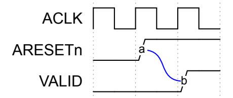

**Figure A2.1: Exit from reset**

# <span id="page-27-0"></span>**A2.2 AXI transport options**

Two options are available for AXI transport:

- Ready, where every channel includes VALID and READY signals. The transmitter asserts VALID when it has a transfer to send. A transfer occurs when VALID and READY are both HIGH.
- Credited, where every channel includes VALID and CRDT signals. The receiver uses CRDT signals to give credits to the transmitter. The transmitter can assert VALID to send a transfer if it has an appropriate credit. This transport is good for high frequency operation and enables the use of Resource Planes on a link.

<span id="page-27-1"></span>All AXI channels on an interface use the same type of transport, [Table](#page-27-1) [A2.1](#page-27-1) shows how this is configured using the AXI\_Transport property.

**Table A2.1: AXI\_Transport property**

| AXI_Transport | Default | Description                                  |
|---------------|---------|----------------------------------------------|
| Credited      |         | AXI channels use CRDT flow control signals.  |
| Ready         | Y       | AXI channels use READY flow control signals. |

The following rules apply to transport configuration:

- Connected Manager and Subordinate interfaces must have the same value for the AXI\_Transport property.
- Credited transport can be used with AXI5 interfaces only.

# <span id="page-28-0"></span>**A2.3 Valid-Ready transport**

When using a Valid-Ready transport, all AXI channels use the same VALID-READY handshake process to transfer address, data, and control information. This two-way flow control mechanism means both the Manager and Subordinate can control the rate that the information moves between Manager and Subordinate. The transmitter generates the VALID signal to indicate when the address, data, or control information is available. The receiver generates the READY signal to indicate that it can accept the information. Transfer occurs only when both the VALID and READY signals are HIGH.

VALID signals must be LOW during reset.

[Figure](#page-28-1) [A2.2,](#page-28-1) [Figure](#page-28-2) [A2.3](#page-28-2) and [Figure](#page-29-1) [A2.4](#page-29-1) show examples of the handshake process.

<span id="page-28-1"></span>The transmitter presents information after edge 1 and asserts the VALID signal as shown in [Figure](#page-28-1) [A2.2.](#page-28-1) The receiver asserts the READY signal after edge 2. The transmitter must keep its information stable until the transfer occurs at edge 3, when this assertion is recognized.

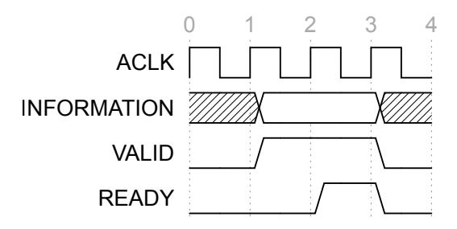

**Figure A2.2: VALID before READY handshake**

A transmitter is not permitted to wait until READY is asserted before asserting VALID.

When VALID is asserted, it must remain asserted until the handshake occurs, at a rising clock edge when VALID and READY are both asserted.

<span id="page-28-2"></span>In [Figure](#page-28-2) [A2.3,](#page-28-2) the receiver asserts READY after edge 1, before the address, data, or control information is valid. This assertion indicates that it can accept the information. The transmitter presents the information and asserts VALID after edge 2, then the transfer occurs at edge 3, when this assertion is recognized. In this case, transfer occurs in a single cycle.

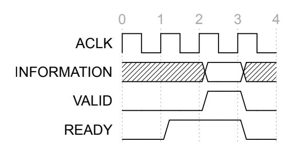

**Figure A2.3: READY before VALID handshake**

A receiver is permitted to wait for VALID to be asserted before asserting the corresponding READY.

If READY is asserted, it is permitted to deassert READY before VALID is asserted.

<span id="page-29-1"></span>In [Figure](#page-29-1) [A2.4,](#page-29-1) both the transmitter and receiver happen to indicate that they can transfer the address, data, or control information after edge 1. In this case, the transfer occurs at the rising clock edge when the assertion of both VALID and READY can be recognized. These assertions mean that the transfer occurs at edge 2.

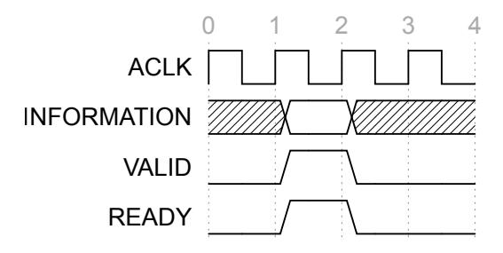

**Figure A2.4: VALID with READY handshake**

The default state of READY signals can be either HIGH or LOW.

For request channels, it is recommended to use HIGH as the default state to minimize latency. In that case, the Subordinate must be able to accept any valid request that is presented to it.

### <span id="page-29-0"></span>**A2.3.1 Valid-Ready signals**

[Table](#page-29-2) [A2.2](#page-29-2) shows the VALID and READY signals. VALID signals are present whether using Valid-Ready transport or credited transport.

**Table A2.2: Valid and Ready signals**

<span id="page-29-12"></span><span id="page-29-11"></span><span id="page-29-10"></span><span id="page-29-9"></span><span id="page-29-8"></span><span id="page-29-7"></span><span id="page-29-6"></span><span id="page-29-5"></span><span id="page-29-4"></span><span id="page-29-3"></span><span id="page-29-2"></span>

| Width | Default | Description                                                                  |  |
|-------|---------|------------------------------------------------------------------------------|--|
| 1     | -       | Asserted high to indicate that the signals on the AW channel are valid.      |  |
| 1     | -       | Asserted high to indicate that a transfer on the AW channel can be accepted. |  |
| 1     | -       | Asserted high to indicate that the signals on the W channel are valid.       |  |
| 1     | -       | Asserted high to indicate that a transfer on the W channel can be accepted.  |  |
| 1     | -       | Asserted high to indicate that the signals on the B channel are valid.       |  |
| 1     | -       | Asserted high to indicate that a transfer on the B channel can be accepted.  |  |
| 1     | -       | Asserted high to indicate that the signals on the AR channel are valid.      |  |
| 1     | -       | Asserted high to indicate that a transfer on the AR channel can be accepted. |  |
| 1     | -       | Asserted high to indicate that the signals on the R channel are valid.       |  |
| 1     | -       | Asserted high to indicate that a transfer on the R channel can be accepted.  |  |
|       |         |                                                                              |  |

### <span id="page-30-0"></span>**A2.3.2 Dependencies between channel handshake signals**

There are dependencies between channels for write, read, and snoop transactions. These are described in the sections below and include dependency diagrams, where:

- Single-headed arrows point to signals that can be asserted before or after the signal at the start of the arrow.
- Double-headed arrows point to signals that must be asserted only after assertion of the signal at the start of the arrow.

### **A2.3.2.1 Write transaction dependencies**

For transactions on the write channels, [Figure](#page-30-1) [A2.5](#page-30-1) shows the handshake signal dependencies. The rules are:

- The Manager must not wait for the Subordinate to assert AWREADY or WREADY before asserting AWVALID or WVALID. This applies to every write data transfer in a transaction.
- The Subordinate can wait for AWVALID or WVALID, or both, before asserting AWREADY.
- The Subordinate can assert AWREADY before AWVALID or WVALID, or both, are asserted.
- The Subordinate can wait for AWVALID or WVALID, or both, before asserting WREADY.
- The Subordinate can assert WREADY before AWVALID or WVALID, or both, are asserted.
- The Subordinate must wait for AWVALID, AWREADY, WVALID, and WREADY to be asserted before asserting BVALID.
- The Subordinate must wait for the last write data transfer before asserting BVALID. The last write data transfer has WLAST asserted, see [A3.2.1](#page-52-1) *[Write data channel \(W\)](#page-52-1)*.
- The Subordinate must not wait for the Manager to assert BREADY before asserting BVALID.
- The Manager can wait for BVALID before asserting BREADY.
- <span id="page-30-1"></span>• The Manager can assert BREADY before BVALID is asserted.

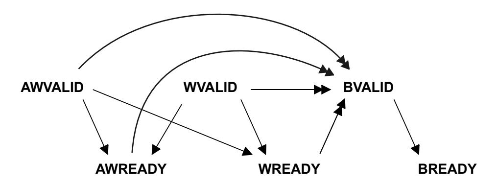

**Figure A2.5: Write transaction handshake dependencies**

For transactions on the write channels that do not include data, WVALID and WREADY are not included in the dependencies.

### **A2.3.2.2 Read transaction dependencies**

For transactions on the read channels, [Figure](#page-31-0) [A2.6](#page-31-0) shows the handshake signal dependencies. The rules are:

- The Manager must not wait for the Subordinate to assert ARREADY before asserting ARVALID.
- The Subordinate can wait for ARVALID to be asserted before it asserts ARREADY.
- The Subordinate can assert ARREADY before ARVALID is asserted.
- The Subordinate must wait for both ARVALID and ARREADY to be asserted before it asserts RVALID to indicate that valid data is available.
- The Subordinate must not wait for the Manager to assert RREADY before asserting RVALID.
- The Manager can wait for RVALID to be asserted before it asserts RREADY.
- <span id="page-31-0"></span>• The Manager can assert RREADY before RVALID is asserted.

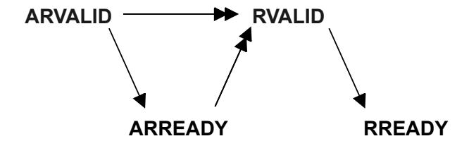

**Figure A2.6: Read transaction handshake dependencies**

# <span id="page-32-2"></span><span id="page-32-0"></span>**A2.4 Credited transport**

When the AXI\_Transport property is Credited, AXI channels use a credited transport.

[Table](#page-32-1) [A2.3](#page-32-1) shows a list of all signals that can be added to a channel when credited transport is used. Signal names are the base name, when instantiated each includes a prefix to indicate which channel they belong.

A channel has a transmitter (Tx) and a receiver (Rx).

**Table A2.3: Credited channel signals**

<span id="page-32-1"></span>

| Name      | Width         | Source | Presence                  | Description                                                                                                                    |
|-----------|---------------|--------|---------------------------|--------------------------------------------------------------------------------------------------------------------------------|
| VALID     | 1             | Tx     | -                         | When asserted HIGH, there is one<br>transfer from Tx to Rx.                                                                    |
| PENDING   | 1             | Tx     | AXI_Transport == Credited | Asserted HIGH to indicate that a<br>transfer might occur in the following<br>cycle. See A2.4.4 Transfer-level<br>clock gating. |
| RP        | clog2(Num_RP) | Tx     | Num_RP > 1                | Encoded indicator of the Resource<br>Plane number for a transfer. See<br>A2.4.2 Resource Planes.                               |
| SHAREDCRD | 1             | Tx     | Shared_Credits == True    | Asserted HIGH to indicate that the<br>transfer is using a shared credit.<br>See A2.4.3 Shared credits.                         |
| CRDT      | Num_RP        | Rx     | AXI_Transport == Credited | Asserted HIGH to give one credit on<br>the respective resource plane.                                                          |
| CRDTSH    | 1             | Rx     | Shared_Credits == True    | Asserted HIGH to give one shared<br>credit. See A2.4.3 Shared credits.                                                         |

### <span id="page-33-0"></span>**A2.4.1 Credited flow control**

The following rules apply to a credited channel:

- During reset the channel transmitter has no credits, the receiver has all available credits. All CRDT and CRDTSH signals must be LOW.
- Each cycle that CRDT or CRDTSH is asserted gives one credit per bit asserted, to the channel transmitter.
- The channel transmitter uses a credit each cycle that VALID is asserted.
- VALID must not be asserted when the channel transmitter has zero credits.
- The minimum number of credits that the receiver can give is 1 per resource plane.
- The maximum number of credits that the receiver can give is 15 per resource plane and 15 shared credits.

There must not be combinatorial paths between credit signals and other signals on a channel in either direction. This restriction has the following consequences:

- A credit cannot be used for a transfer in the same cycle that it is given.
- A credit cannot be given in the same cycle that it is used by a transfer.

<span id="page-33-1"></span>An example of transfers on a channel is shown in [Figure](#page-33-1) [A2.7.](#page-33-1) In this example, the receiver has two credits available.

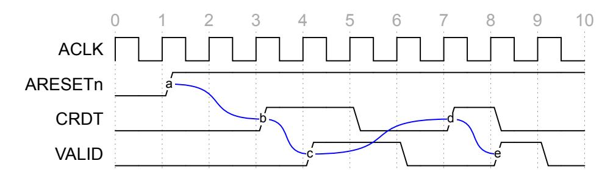

**Figure A2.7: Example Transfers**

- Cycle 0 At reset the Tx has no credits.
- Cycle 3 One credit is given by the Rx.
- Cycle 4 The Tx uses the credit for a transfer. Another credit is given by the Rx.
- Cycle 5 The Tx uses the second credit for a transfer.
- Cycle 7 The credit used in cycle 4 is given back to the Tx.
- Cycle 8 The Tx uses the credit for a transfer.

### <span id="page-34-0"></span>**A2.4.2 Resource Planes**

Resource Planes (RP) are used to enable independence between traffic sharing a channel. This could be to avoid deadlock scenarios or to improve quality-of-service. Each RP has dedicated credits so it is possible to give credits for one RP, allowing it to make progress when another RP is blocked waiting for credit.

• Transfers using different Resource Planes must not block one another between transmitter and receiver.

If transfers remain on separate Resource Planes across multiple links, then the non-blocking guarantee can be extended.

The parameter Num\_RP specifies how many RPs are supported on a channel.

The RP signal indicates the Resource Plane number for each transfer, from 0 to Num\_RP-1.

The width of RP is clog2(Num\_RP). For example, if Num\_RP is 5 the width of RP is 3. If Num\_RP is 1, there is no RP signal.

Credits are given per Resource Plane. The CRDT signal has one bit per Resource Plane, therefore the receiver can give up to one credit per RP per cycle. The number of credits for each RP is permitted to be different.

- The transmitter can issue a transfer on a specific RP only if it has at least one credit for that RP.
- The receiver must be able to give at least one dedicated credit per RP supported.
- The AR, AW and W channels can have multiple RPs.
- The AW and W transfers in the same transaction must use the same RP number.

There are no ordering guarantees between transfers using different RPs. This means:

- A Manager must not issue a request transfer that has the same ID as an outstanding transaction on the same channel but a different RP.
- A Manager can interleave write data transfers for different transactions if they are using different RPs. See [A5.5](#page-99-0) *[Write data and response ordering](#page-99-0)*.

The B and R channels have one RP.

<span id="page-34-1"></span>[Table](#page-34-1) [A2.5](#page-34-1) shows the properties that define the number of RPs.

**Table A2.5: Resource plane number properties**

| Name       | Values | Default | Description                                         |
|------------|--------|---------|-----------------------------------------------------|
| Num_RP_AWW | 1-8    | 1       | Number of resource planes on the AW and W channels. |
| Num_RP_AR  | 1-8    | 1       | Number of resource planes on the AR channel.        |

Connected interfaces can be configured to have a different number of RPs, but a Manager must not require the use of more RPs than can be provided by the attached Subordinate.

If the AXI\_Transport property is Ready: Num\_RP\_AWW and Num\_RP\_AR must be 1.

### <span id="page-35-0"></span>**A2.4.3 Shared credits**

Any channel that includes multiple RPs can optionally include shared credits to improve buffer utilization when throughput varies on different RPs. A receiver supporting shared credits can allocate its buffers between those dedicated to one RP and those for any RP.

[Table](#page-35-1) [A2.6](#page-35-1) shows the properties that define whether shared credits are supported.

**Table A2.6: Shared credit properties**

<span id="page-35-1"></span>

| Name              | Values         | Default | Description                                                                                                       |
|-------------------|----------------|---------|-------------------------------------------------------------------------------------------------------------------|
| Shared_Credits_AW | True,<br>False | False   | If True, Shared credits are supported on the AW channel and<br>the AWCRDTSH and AWSHAREDCRD signals are included. |
| Shared_Credits_W  | True,<br>False | False   | If True, Shared credits are supported on the W channel and the<br>WCRDTSH and WSHAREDCRD signals are included.    |
| Shared_Credits_AR | True,<br>False | False   | If True, Shared credits are supported on the AR channel and<br>the ARCRDTSH and ARSHAREDCRD signals are included. |

The following rules apply:

- If the AXI\_Transport property is Ready: Shared\_Credits\_AW, Shared\_Credits\_W and Shared\_Credits\_AR must be False.
- If Num\_RP\_AWW is 1: Shared\_Credits\_AW and Shared\_Credits\_W must be False.
- If Num\_RP\_AR is 1: Shared\_Credits\_AR must be False.
- The CRDTSH signal is asserted by the receiver to give one shared credit to the transmitter. CRDTSH can be asserted without asserting CRDT.
- A transmitter can use a shared credit to send a transfer on any RP.
- A receiver must give independence guarantees between RPs, whether the transmitter is using a shared or dedicated credit.
- The SHAREDCRD signal is asserted by the transmitter alongside VALID to indicate that the transfer is using a shared credit.

It is recommended that a transmitter uses a dedicated rather than shared credit for a transfer if it has both. This is because shared credits are more flexible so could be retained for a transfer that does not have a dedicated credit.

The compatibility between Manager and Subordinate interfaces according to the values of the Shared\_Credits properties is shown in [Table](#page-35-2) [A2.7.](#page-35-2)

**Table A2.7: Shared credits compatibility**

<span id="page-35-2"></span>

| Shared_Credits | Subordinate: False | Subordinate: True                                                                                                                   |
|----------------|--------------------|-------------------------------------------------------------------------------------------------------------------------------------|
| Manager: False | Compatible.        | Compatible.<br>SHAREDCRD inputs tied LOW, CRDTSH<br>outputs unconnected.<br>Functional, but available shared credits are<br>unused. |

Manager: True Compatible. Compatible.

SHAREDCRD outputs unconnected,

CRDTSH inputs tied LOW.

Manager does not receive any shared credits.

An example of the use of a channel with 3 Resource Planes and shared credits is shown in [Figure](#page-36-0) [A2.8.](#page-36-0)

<span id="page-36-0"></span>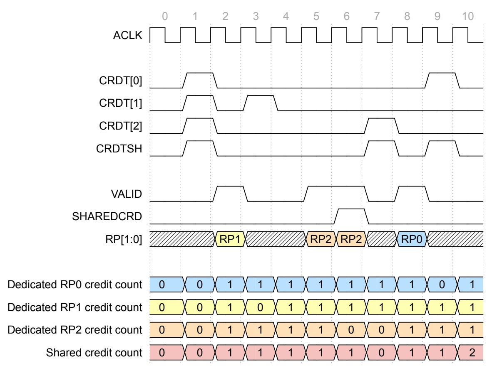

**Figure A2.8: Example of a channel with 3 Resource Planes**

- Cycle 0 The Transmitter has no credits.
- Cycle 1 The Receiver gives one credit for each RP and one shared credit.
- Cycle 2 The Transmitter sends a transfer on RP1 using a dedicated credit.
- Cycle 3 The Receiver gives a dedicated credit back to the Transmitter for RP1.
- Cycle 5 The Transmitter sends a transfer on RP2 using a dedicated credit.
- Cycle 6 The Transmitter sends a transfer on RP2 using a shared credit, as no dedicated credits are available.
- Cycle 7 The Receiver gives a shared credit, and a dedicated credit for RP2 back to the Transmitter.
- Cycle 8 The Transmitter sends a transfer on RP0 using a dedicated credit
- Cycle 9 The Receiver gives a dedicated credit back to the Transmitter for RP0, along with an additional shared credit.

### <span id="page-37-0"></span>**A2.4.4 Transfer-level clock gating**

The PENDING signal associated with a channel is guaranteed to be asserted the cycle before a transfer is sent, so can be used to gate the clock of the receiver circuitry.

The following rules apply:

- There is one PENDING signal per channel.
- It is required that PENDING is asserted in the cycle before VALID is asserted.
- When PENDING is deasserted, it is required that VALID is deasserted in the next cycle.
- When PENDING is asserted, it is permitted but not required that VALID is asserted in the next cycle.

The PENDING signal is independent of credits and credit control. For example, a transmitter is permitted to do any of the following:

- Keep PENDING permanently asserted, including during reset. It might do this if it is unable to determine in advance when a transfer is to be sent.
- Assert PENDING when it does not have a credit.
- Assert and then deassert PENDING without sending a transfer.

<span id="page-37-1"></span>An example of the use of PENDING is shown in [Figure](#page-37-1) [A2.9.](#page-37-1)

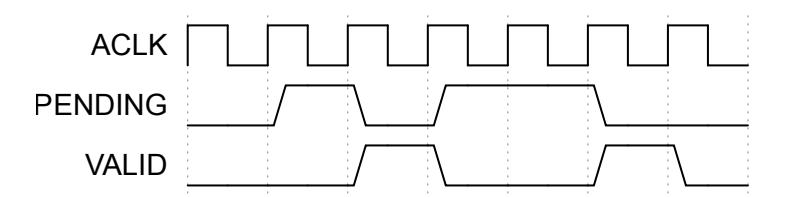

**Figure A2.9: Example usage of the PENDING signal**

See [A14.2](#page-224-0) *[Interface gating with credited transport](#page-224-0)* for information regarding gating of interfaces using credited channels.

### <span id="page-38-0"></span>**A2.4.5 Credited transport signals**

[Table](#page-38-1) [A2.9](#page-38-1) shows the signals that can be included when AXI\_Transport is Credited. Each channel also has a VALID signal, as shown in [Table](#page-29-2) [A2.2.](#page-29-2)

**Table A2.9: Signals when using credited transport**

<span id="page-38-20"></span><span id="page-38-19"></span><span id="page-38-18"></span><span id="page-38-17"></span><span id="page-38-16"></span><span id="page-38-15"></span><span id="page-38-14"></span><span id="page-38-13"></span><span id="page-38-12"></span><span id="page-38-11"></span><span id="page-38-10"></span><span id="page-38-9"></span><span id="page-38-8"></span><span id="page-38-7"></span><span id="page-38-6"></span><span id="page-38-5"></span><span id="page-38-4"></span><span id="page-38-3"></span><span id="page-38-2"></span><span id="page-38-1"></span>

| Name        | Width             | Default   | Description                                                                                |
|-------------|-------------------|-----------|--------------------------------------------------------------------------------------------|
| AWPENDING   | 1                 | 0b1       | Asserted HIGH to indicate that a transfer might<br>occur in the following cycle.           |
| AWCRDT      | Num_RP_AWW        | All zeros | Asserted HIGH to give one AW credit on the<br>respective RP.                               |
| AWCRDTSH    | 1                 | 0b0       | Asserted HIGH to give one shared AW credit,<br>supports up to one shared credit per cycle. |
| AWRP        | clog2(Num_RP_AWW) | All zeros | Encoded indicator of the Resource Plane number<br>for an AW transfer.                      |
| AWSHAREDCRD | 1                 | 0b0       | Asserted HIGH to indicate that an AW transfer is<br>using a shared credit.                 |
| WPENDING    | 1                 | 0b1       | Asserted HIGH to indicate that a transfer might<br>occur in the following cycle.           |
| WCRDT       | Num_RP_AWW        | All zeros | Asserted HIGH to give one W credit on the<br>respective RP.                                |
| WCRDTSH     | 1                 | 0b0       | Asserted HIGH to give one shared W credit,<br>supports up to one shared credit per cycle.  |
| WRP         | clog2(Num_RP_AWW) | All zeros | Encoded indicator of the Resource Plane number<br>for a W transfer.                        |
| WSHAREDCRD  | 1                 | 0b0       | Asserted HIGH to indicate that a W transfer is<br>using a shared credit.                   |
| BPENDING    | 1                 | 0b1       | Asserted HIGH to indicate that a transfer might<br>occur in the following cycle.           |
| BCRDT       | 1                 | 0b0       | Asserted HIGH to give one B credit.                                                        |
| ARPENDING   | 1                 | 0b1       | Asserted HIGH to indicate that a transfer might<br>occur in the following cycle.           |
| ARCRDT      | Num_RP_AR         | All zeros | Asserted HIGH to give one AR credit on the<br>respective RP.                               |
| ARCRDTSH    | 1                 | 0b0       | Asserted HIGH to give one shared AR credit,<br>supports up to one shared credit per cycle. |
| ARRP        | clog2(Num_RP_AR)  | All zeros | Encoded indicator of the Resource Plane number<br>for an AR transfer.                      |
| ARSHAREDCRD | 1                 | 0b0       | Asserted HIGH to indicate that an AR transfer is<br>using a shared credit.                 |
| RPENDING    | 1                 | 0b1       | Asserted HIGH to indicate that a transfer might<br>occur in the following cycle.           |
| RCRDT       | 1                 | 0b0       | Asserted HIGH to give one R credit.                                                        |
|             |                   |           |                                                                                            |

# <span id="page-39-0"></span>**A2.5 Pipelining and register stages**

Each AXI channel transfers information in only one direction, and the architecture does not require any fixed relationship between the channels. This means that a register stage can be inserted at any point in any channel at the cost of an additional cycle of latency.

These qualities make the following possible:

- Trade-off between cycles of latency and maximum frequency of operation.
- Direct, fast connection between a processor and high-performance memory, while using simple register slices to isolate longer paths to less performance critical peripherals.

The following rules apply to the registering of channels:

- There can be any number of register stages on VALID, READY, and CRDT paths between components.
- Different channels can have a different number of register stages, depending on their timing requirements.
- VALID signals must be pipelined by the same number of cycles as the payload signals of that channel including RP and SHAREDCRD signals, if present.
- <span id="page-39-1"></span>• PENDING signals must retain the relationship that they are HIGH in the cycle before VALID is HIGH.

# <span id="page-40-0"></span>**A2.6 AXI transactions and transfers**

The AXI protocol requires the following relationships to be maintained:

- A write response must always follow the last write transfer in a write transaction.
- Read data and responses must always follow the read request.
- When a Manager issues a write request, it must be able to provide all write data for that transaction, without dependency on other transactions from that Manager.
- When a Manager has issued a write request and all write data, it must be able to accept all responses for that transaction, without dependency on other transactions from that Manager.
- When a Manager has issued a read request, it must be able to accept all read data for that transaction, without dependency on other transactions from that Manager.
  - Note that a Manager can rely on read data returning in order from transactions that use the same ID, so the Manager only needs enough storage for read data from transactions with different IDs.
- A Manager is permitted to wait for one transaction to complete before issuing another transaction request.
- A Subordinate is permitted to wait for one transaction to complete before accepting another request, giving credits or sending transfers for another transaction.
- A Subordinate must not block acceptance of data-less write requests due to transactions with leading write data.

The protocol does not define any other relationship between the channels.

The lack of relationship means, for example, that the write data can appear at an interface before the write request for the transaction. This can occur if the write request channel contains more register stages than the write data channel. Similarly, the write data might appear in the same cycle as the request.

When the interconnect is required to determine the destination address space or Subordinate space, it must realign the request and write data. This realignment is required to assure that the write data is signaled as being valid only to the Subordinate for which it is destined.

# <span id="page-41-0"></span>Chapter A3 **AXI transactions**

The AXI protocol uses transactions for communication between Managers and Subordinates. All transactions include a request and a response. Write and read transactions also include one or more data transfers.

This chapter describes the transaction requests, responses, and data transfers.

It contains the following sections:

- [A3.1](#page-42-0) *[Transaction request](#page-42-0)*
- [A3.2](#page-52-0) *[Write and read data](#page-52-0)*
- [A3.3](#page-60-0) *[Transaction response](#page-60-0)*

# <span id="page-42-0"></span>**A3.1 Transaction request**

An AXI Manager initiates a transaction by issuing a request to a Subordinate. A request includes transaction attributes and the address of the first data transfer. If the transaction includes more than one data transfer, the Subordinate must calculate the addresses of subsequent transfers.

A transaction must not cross a 4KB address boundary. This prevents a transaction from crossing a boundary between two Subordinates. It also limits the number of address increments that a Subordinate must support.

### <span id="page-42-1"></span>**A3.1.1 Size attribute**

Size indicates the maximum number of bytes in each data transfer.

For read transactions, Size indicates how many data bytes must be valid in each read data transfer.

For write transactions, Size indicates how many data byte lanes are permitted to be active. The write strobes indicate which of those bytes are valid in each transfer.

Size must not exceed the data width of an interface, as determined by the DATA\_WIDTH property.

If Size is smaller than DATA\_WIDTH, a subset of byte lanes is used for each transfer.

Size is communicated using the AWSIZE and ARSIZE signals on the write request and read request channels, respectively. In this specification, AxSIZE indicates AWSIZE and ARSIZE.

**Table A3.1: AxSIZE signals**

<span id="page-42-4"></span><span id="page-42-3"></span>

| Name              | Width | Default            | Description                                                                          |
|-------------------|-------|--------------------|--------------------------------------------------------------------------------------|
| AWSIZE,<br>ARSIZE | 3     | log2(DATA_WIDTH/8) | Indicates the maximum number of bytes in<br>each data transfer within a transaction. |

<span id="page-42-2"></span>Size is encoded on the AxSIZE signals as shown in [Table](#page-42-2) [A3.2.](#page-42-2)

**Table A3.2: AxSIZE encodings**

| AxSIZE | Label | Meaning                |
|--------|-------|------------------------|
| 0b000  | 1     | 1 byte per transfer    |
| 0b001  | 2     | 2 bytes per transfer   |
| 0b010  | 4     | 4 bytes per transfer   |
| 0b011  | 8     | 8 bytes per transfer   |
| 0b100  | 16    | 16 bytes per transfer  |
| 0b101  | 32    | 32 bytes per transfer  |
| 0b110  | 64    | 64 bytes per transfer  |
| 0b111  | 128   | 128 bytes per transfer |
|        |       |                        |

The property SIZE\_Present is used to determine if the AxSIZE signals are present.

**Table A3.3: SIZE\_Present property**

| SIZE_Present | Default | Description                        |
|--------------|---------|------------------------------------|
| True         | Y       | AWSIZE and ARSIZE are present.     |
| False        |         | AWSIZE and ARSIZE are not present. |

A Manager that only issues requests of full data width can omit the AxSIZE outputs from its interface. An attached Subordinate must have its AxSIZE input tied according to the data width.

### <span id="page-43-4"></span><span id="page-43-0"></span>**A3.1.2 Length attribute**

The Length attribute defines the number of data transfers in a transaction.

Size x Length is the maximum number of bytes that can be transferred in a transaction. If the address is unaligned or there are deasserted write strobes, the actual number of bytes transferred can be lower than Size x Length.

A Manager must issue the number of write data transfers according to Length.

A Subordinate must issue the number of read data transfers according to Length.

Length is communicated using the AWLEN and ARLEN signals on the write request and read request channels, respectively. In this specification, AxLEN indicates AWLEN and ARLEN.

**Table A3.4: AxLEN signals**

<span id="page-43-3"></span><span id="page-43-2"></span>

| Name            | Width | Default | Description                                                                        |
|-----------------|-------|---------|------------------------------------------------------------------------------------|
| AWLEN,<br>ARLEN | 8     | 0x00    | The total number of transfers in a transaction,<br>encoded as: Length = AxLEN + 1. |

<span id="page-43-1"></span>The property LEN\_Present is used to determine if the signals are present. [Table](#page-43-1) [A3.5](#page-43-1) shows the legal values of LEN\_Present.

**Table A3.5: LEN\_Present property**

| LEN_Present | Default | Description                      |
|-------------|---------|----------------------------------|
| True        | Y       | AWLEN and ARLEN are present.     |
| False       |         | AWLEN and ARLEN are not present. |

A Manager that only issues requests of Length 1 can omit the AxLEN outputs from its interface. An attached Subordinate must have its AxLEN input tied to 0x00.

The following rules apply to transaction Length:

- For wrapping bursts, Length can be 2, 4, 8, or 16.
- For fixed bursts, Length can be up to 16.
- A transaction must not cross a 4KB address boundary.
- Early termination of transactions is not supported.

<span id="page-43-5"></span>No component can terminate a transaction early. However, to reduce the number of data transfers in a write transaction, the Manager can disable further writing by deasserting all the write strobes. In this case, the Manager must complete the remaining transfers in the transaction. In a read transaction, the Manager can discard read data, but it must complete all transfers in the transaction.

### <span id="page-44-0"></span>**A3.1.3 Maximum number of bytes in a transaction**

The maximum number of bytes in a transaction is 4KB and transactions are not permitted to cross a 4KB boundary. However, many Managers generate transactions which are always smaller than this.

A Subordinate or interconnect might benefit from this information. For example, a Subordinate might be able to optimize away some decode logic. An interconnect striping at a granule smaller than 4KB might be able to avoid burst splitting if it knows that transactions will not cross the stripe boundary.

The property Max\_Transaction\_Bytes defines the maximum size of a transaction in bytes as shown in [Table](#page-44-1) [A3.6.](#page-44-1)

**Table A3.6: Max\_Transaction\_Bytes property**

<span id="page-44-1"></span>

| Name                  | Values                                    | Default | Description                                                                                                                                                                                                                                                                                                   |
|-----------------------|-------------------------------------------|---------|---------------------------------------------------------------------------------------------------------------------------------------------------------------------------------------------------------------------------------------------------------------------------------------------------------------|
| Max_Transaction_Bytes | 64, 128, 256,<br>512, 1024,<br>2048, 4096 | 4096    | A Manager issues transactions where Size x Length is<br>Max_Transaction_Bytes or smaller and do not cross a<br>Max_Transaction_Bytes boundary.<br>A Subordinate can only accept transactions where Size x<br>Length is Max_Transaction_Bytes or smaller and do not<br>cross a Max_Transaction_Bytes boundary. |

<span id="page-44-2"></span>When connecting Manager and Subordinate interfaces, [Table](#page-44-2) [A3.7](#page-44-2) indicates combinations of Max\_Transaction\_Bytes that are compatible.

**Table A3.7: Max\_Transaction\_Bytes interoperability**

| Manager < Subordinate | Manager == Subordinate | Manager > Subordinate |
|-----------------------|------------------------|-----------------------|
| Compatible.           | Compatible.            | Not compatible.       |

### <span id="page-45-4"></span><span id="page-45-0"></span>**A3.1.4 Burst attribute**

The Burst attribute describes how the address increments between transfers in a transaction.

Burst is communicated using the AWBURST and ARBURST signals on the write request and read request channels, respectively. In this specification, AxBURST indicates AWBURST and ARBURST.

**Table A3.8: AxBURST signals**

<span id="page-45-3"></span><span id="page-45-2"></span>

| Name                | Width | Default     | Description                                                                 |
|---------------------|-------|-------------|-----------------------------------------------------------------------------|
| AWBURST,<br>ARBURST | 2     | 0b01 (INCR) | Describes how the address increments between<br>transfers in a transaction. |

<span id="page-45-1"></span>Burst is encoded on the AxBURST signals as shown in [Table](#page-45-1) [A3.9.](#page-45-1)

**Table A3.9: AxBURST encodings**

| AxBURST | Label    | Meaning            |
|---------|----------|--------------------|
| 0b00    | FIXED    | Fixed burst        |
| 0b01    | INCR     | Incrementing burst |
| 0b10    | WRAP     | Wrapping burst     |
| 0b11    | RESERVED | -                  |

The property BURST\_Present is used to determine if the AxBURST signals are present.

A Manager that only issues requests with a Burst type of INCR can omit the AxBURST outputs from its interface. An attached Subordinate must have its AxBURST input tied to 0b01.

**Table A3.10: BURST\_Present property**

| BURST_Present | Default | Description                          |  |
|---------------|---------|--------------------------------------|--|
| True          | Y       | AWBURST and ARBURST are present.     |  |
| False         |         | AWBURST and ARBURST are not present. |  |

There are three different Burst types:

#### *Incrementing address (INCR)*

With this Burst type, the address for each transfer is an increment of the address for the previous transfer. The increment value depends on the transaction Size. For example, for an aligned start address, the address for each transfer in a transaction with a Size of 4 bytes is the previous address plus 4. This Burst type is used for accesses to normal sequential memory.

#### <span id="page-46-2"></span>*Wrapping address (WRAP)*

This Burst type is similar to INCR except that the address wraps around to a lower address if an upper address limit is reached. The following restrictions apply:

- The start address must be aligned to the size of each transfer.
- The Length of the burst must be 2, 4, 8, or 16 transfers.

The behavior of a wrapping transaction is:

- The lowest address accessed by the transaction is the start address aligned to the total size of the data to be transferred, that is Size \* Length. This address is defined as the wrap boundary.
- After each transfer, the address increments in the same way as for an INCR burst. However, if this incremented address is ((wrap boundary)+ (Size \* Length)), then the address wraps round to the wrap boundary.
- The first transfer in the transaction can use an address that is higher than the wrap boundary, subject to the restrictions that apply to wrapping transactions. The address wraps when the first address is higher than the wrap boundary. This Burst type is used for cache line accesses.

Wrapping bursts are primarily intended for reading and writing cache lines. The property Wrap\_CLS\_Modifiable can be used to limit wrapping bursts to being cache line sized and Modifiable (AxCACHE[1] is 0b1). Constraining wrapping bursts using this property can simplify the design of decoders and bridges converting between protocols or data widths.

<span id="page-46-0"></span>Table [A3.11](#page-46-0) describes the Wrap\_CLS\_Modifiable property.

**Table A3.11: Wrap\_CLS\_Modifiable property**

| Wrap_CLS_Modifiable | Default | Description                                                                                                   |
|---------------------|---------|---------------------------------------------------------------------------------------------------------------|
| True                |         | When Burst type is WRAP, the transaction must be cache<br>line sized and Modifiable.                          |
| False               | Y       | When Burst type is WRAP, the transaction is not required<br>to be cache line sized and can be Non-modifiable. |

Note that a wrapping AtomicCompare is not affected by this property, see [A6.4](#page-112-0) *[Atomic transactions](#page-112-0)*.

<span id="page-46-1"></span>Table [A3.12](#page-46-1) shows compatibility for the Wrap\_CLS\_Modifiable property.

**Table A3.12: Wrap\_CLS\_Modifiable compatibility**

| Wrap_CLS_Modifiable | Subordinate: False | Subordinate: True |
|---------------------|--------------------|-------------------|
| Manager: False      | Compatible.        | Not compatible.   |
| Manager: True       | Compatible.        | Compatible.       |

#### *Fixed address (FIXED)*

This Burst type is used for repeated accesses to the same location such as when loading or emptying a FIFO.

- The address is the same for every transfer in the burst.
- The byte lanes that are valid are constant for all transfers. However, within those byte lanes, the actual bytes that have WSTRB asserted can differ for each transfer.
- The Length of the burst can be up to 16 transfers.

• The FIXED burst type can only be used with WriteNoSnoop or ReadNoSnoop Opcodes. See [Chapter](#page-122-0) [A7](#page-122-0) *[Request Opcodes](#page-122-0)* for more information.

<span id="page-47-0"></span>A Burst type of FIXED is not commonly used, and a property Fixed\_Burst\_Disable is defined in Table [A3.13](#page-47-0) to indicate if a component supports it.

**Table A3.13: Fixed\_Burst\_Disable property**

| Fixed_Burst_Disable | Default | Description                                                                                                                  |
|---------------------|---------|------------------------------------------------------------------------------------------------------------------------------|
| True                |         | Requests with Burst type FIXED are not<br>supported by a Subordinate interface and<br>not generated by a Manager interface.  |
| False               | Y       | Requests with Burst type FIXED are<br>supported by a Subordinate interface and<br>might be generated by a Manager interface. |

<span id="page-47-1"></span>Compatibility between Manager and Subordinate interfaces, according to the values of the Fixed\_Burst\_Disable property is shown in Table [A3.14.](#page-47-1)

**Table A3.14: Fixed\_Burst\_Disable compatibility**

| Fixed_Burst_Disable | Subordinate: False | Subordinate: True |
|---------------------|--------------------|-------------------|
| Manager: False      | Compatible.        | Not compatible.   |
| Manager: True       | Compatible.        | Compatible.       |

### <span id="page-48-0"></span>**A3.1.5 Transfer address**

This section provides methods for determining the address and byte lanes of transfers within a transaction.

The start address for a transaction is indicated using the AxADDR signals.

**Table A3.15: AxADDR signals**

<span id="page-48-3"></span><span id="page-48-2"></span>

| Name              | Width      | Default | Description                                 |
|-------------------|------------|---------|---------------------------------------------|
| AWADDR,<br>ARADDR | ADDR_WIDTH | -       | Address of first transfer in a transaction. |

#### *Address width*

The property ADDR\_WIDTH is used to define the address width.

**Table A3.16: ADDR\_WIDTH property**

| Name       | Values | Default | Description                                  |
|------------|--------|---------|----------------------------------------------|
| ADDR_WIDTH | 164    | 32      | Width of AWADDR, ARADDR, and ACADDR in bits. |

The protocol supports communication between components that have different physical address space sizes. Components with different physical address space sizes must communicate as follows:

- The component with the smaller physical address space must be positioned within an aligned window in the larger physical address space. Typically, the window is located at the bottom of the larger physical address space. However, it is acceptable for the component with the smaller physical address space to be positioned in an offset window within the larger physical address space.
- An outgoing transaction must have the required additional higher-order bits added to the transaction address.
- An incoming transaction must be examined so that:
  - A transaction that is within the address window has the higher-order address bits removed and is passed through.
  - A transaction that does not have the required higher-order address bits is suppressed.

It is the responsibility of the interconnect to provide the required functionality.

### <span id="page-48-4"></span><span id="page-48-1"></span>**A3.1.6 Transaction equations**

The equations listed here are used to determine the address and active data byte lanes for each transfer in a transaction. The equations use the following additional variables:

- Start\_Addr: The start address that is issued by the Manager.
- Data\_Bytes: The width of the data channels in bytes (DATA\_WIDTH/8).
- Aligned\_Addr: The aligned version of the start address.
- Address\_N: The address of transfer N in a transaction. N is 1 for the first transfer in a transaction.
- Wrap\_Boundary: The lowest address within a wrapping transaction.
- Lower\_Byte\_Lane: The byte lane of the lowest addressed byte of a transfer.
- Upper\_Byte\_Lane: The byte lane of the highest addressed byte of a transfer.
- INT(x): The rounded-down integer value of x.

#### *A3.1. Transaction request*

These equations determine addresses of transfers within a burst:

```
Start_Addr = AxADDR
Aligned_Addr = INT(Start_Addr / Size)* Size
```

This equation determines the address of the first transfer in a burst:

```
Address_1 = Start_Addr
```

For an INCR burst and for a WRAP burst for which the address has not wrapped, this equation determines the address of any transfer after the first transfer in a burst:

```
Address_N = Aligned_Addr + (N - 1)* Size
```

For a WRAP burst, the Wrap\_Boundary variable defines the wrapping boundary:

```
Wrap_Boundary = INT(Start_Addr / (Size * Length))* Size * Length
```

For a WRAP burst, if Address\_N = Wrap\_Boundary + Size \* Length, then:

• Use this equation for the current transfer:

```
Address_N = Wrap_Boundary
```

• Use this equation for any subsequent transfers:

```
Address_N = Aligned_Addr + ((N - 1)* Size)- (Size * Length)
```

These equations determine the byte lanes to use for the first transfer in a burst:

```
Lower_Byte_Lane = Start_Addr - (INT(Start_Addr/Data_Bytes)* Data_Bytes)
Upper_Byte_Lane = Aligned_Addr + (Size-1)- (INT(Start_Addr/Data_Bytes)* Data_Bytes)
```

These equations determine the byte lanes to use for all transfers after the first transfer in a burst:

```
Lower_Byte_Lane = Address_N - (INT(Address_N / Data_Bytes)* Data_Bytes)
Upper_Byte_Lane = Lower_Byte_Lane + Size - 1
```

Data is transferred on:

```
DATA((8 * Upper_Byte_Lane)+ 7: (8 * Lower_Byte_Lane))
```

The transaction container describes all the bytes that could be accessed in that transaction, if the address is aligned and strobes are asserted:

```
Container_Size = Size * Length
```

### For INCR bursts:

```
Container_Lower = Aligned_Addr
Container_Upper = Aligned_Addr + Container_Size
```

## For WRAP bursts:

```
Container_Lower = Wrap_Boundary
Container_Upper = Wrap_Boundary + Container_Size
```

### <span id="page-50-0"></span>**A3.1.7 Pseudocode description of the transfers**

```
// DataTransfer()
DataTransfer(Start_Addr, Size, Length, Data_Bytes, Burst, IsWrite)
// IsWrite is TRUE for a write, and FALSE for a read
    addr = Start_Addr; // Variable for current address
    Aligned_Addr = (INT(addr/Size) * Size);
    aligned = (Aligned_Addr == addr); // Check whether addr aligned to Size
    Container_Size = Size * Length;
    if Burst == WRAP then
        Lower_Wrap_Boundary = (INT(addr/Container_Size) * Container_Size);
        // addr must be aligned for a wrapping burst
        Upper_Wrap_Boundary = Lower_Wrap_Boundary + Container_Size;
    for n = 1 to Length
        Lower_Byte_Lane = addr - (INT(addr/Data_Bytes) * Data_Bytes);
        if aligned then
            Upper_Byte_Lane = Lower_Byte_Lane + Size - 1
        else
            Upper_Byte_Lane = Aligned_Addr + Size - 1
                               - (INT(addr/Data_Bytes) * Data_Bytes);
        // Perform data transfer
        if IsWrite then
            dwrite(addr, Lower_Byte_Lane, Upper_Byte_Lane)
        else
            dread(addr, Lower_Byte_Lane, Upper_Byte_Lane);
        // Increment address if necessary
        if Burst != FIXED then
            if aligned then
                addr = addr + Size;
                if Burst == WRAP then
                    if addr >= Upper_Wrap_Boundary then addr = Lower_Wrap_Boundary;
            else
                addr = Aligned_Addr + Size;
                aligned = TRUE; // All transfers after the first are aligned
    return;
```

### <span id="page-51-0"></span>**A3.1.8 Regular transactions**

There are many options of burst, size, and length for a transaction. However, some interfaces and transaction types might only use a subset of these options. If a Subordinate component is attached to a Manager which uses only a subset of transaction options, it can be designed with simplified decode logic.

The Regular attribute is defined, to identify transactions which meet the following criteria:

- Length is 1, 2, 4, 8, or 16 transfers.
- Size is the same as the data channel width if Length is greater than 1.
- Burst is INCR or WRAP, not FIXED.
- Address is aligned to the transaction container for INCR transactions.
- Address is aligned to Size for WRAP transactions.

The Regular\_Transactions\_Only property is used to define whether a Manager issues only Regular type transactions and if a Subordinate only supports Regular transactions.

**Table A3.17: Regular\_Transactions\_Only property**

| Regular_Transactions_Only | Default | Description                                                                |
|---------------------------|---------|----------------------------------------------------------------------------|
| True                      |         | Only Regular transactions are issued/supported.                            |
| False                     | Y       | All legal combinations of Burst, Size, and Length are<br>issued/supported. |

<span id="page-51-1"></span>Interoperability rules for Regular transactions are shown in Table [A3.18.](#page-51-1)

**Table A3.18: Regular\_Transactions\_Only interoperability**

|                | Subordinate: False | Subordinate: True                                                                                                            |
|----------------|--------------------|------------------------------------------------------------------------------------------------------------------------------|
| Manager: False | Compatible.        | Not compatible.<br>If the Manager issues a transaction that is not Regular,<br>then data corruption or deadlock might occur. |
| Manager: True  | Compatible.        | Compatible.                                                                                                                  |

# <span id="page-52-0"></span>**A3.2 Write and read data**

This section describes the AXI write and read data channels and how the interface performs mixed-endian and unaligned transfers.

Write and read data signals have the same width, specified using the DATA\_WIDTH property.

**Table A3.19: DATA\_WIDTH property**

| Name       | Values                                | Default | Description                                     |
|------------|---------------------------------------|---------|-------------------------------------------------|
| DATA_WIDTH | 8, 16, 32, 64, 128,<br>256, 512, 1024 | -       | Data width in bits, applies to RDATA and WDATA. |

### <span id="page-52-3"></span><span id="page-52-2"></span><span id="page-52-1"></span>**A3.2.1 Write data channel (W)**

The data and last signals for the write data channel are shown in Table [A3.20.](#page-52-2)

**Table A3.20: Write data signals**

<span id="page-52-4"></span>

| Name  | Width      | Default | Description                                                                                     |
|-------|------------|---------|-------------------------------------------------------------------------------------------------|
| WDATA | DATA_WIDTH | -       | The write data signal carries data between a<br>Manager and Subordinate in a write transaction. |
| WLAST | 1          | -       | Indicates the last write data transfer of a<br>transaction.                                     |

The following rules apply:

- The Manager must assert the WLAST signal while it is driving the final write transfer in the transaction.
- It is recommended that WDATA is driven to zero for inactive byte lanes.
- A Subordinate that does not use WLAST can omit the input from its interface.

The property WLAST\_Present is used to determine if the WLAST signal is present.

**Table A3.21: WLAST\_Present property**

| WLAST_Present | Default | Description           |
|---------------|---------|-----------------------|
| True          | Y       | WLAST is present.     |
| False         |         | WLAST is not present. |

### <span id="page-53-1"></span>**A3.2.1.1 Write strobes**

The WSTRB signal carries write strobes that specify which byte lanes of the write data channel contain valid information.

**Table A3.22: WSTRB signal**

<span id="page-53-0"></span>

| Name  | Width          | Default  | Description                                                                       |
|-------|----------------|----------|-----------------------------------------------------------------------------------|
| WSTRB | DATA_WIDTH / 8 | All ones | Indicates which byte lanes of WDATA<br>contain valid data in a write transaction. |

There is one write strobe for each 8 bits of the write data channel, therefore WSTRB[n] corresponds to WDATA[(8n)+7:(8n)].

#### When WVALID is HIGH:

- Data bytes to be written have a corresponding write strobe set HIGH.
- Inside of the transaction container any number of write strobes can be HIGH. If all write strobes are LOW, no data is written from that transfer.
- Outside of the transaction container all write strobes must be LOW.

#### When WVALID is LOW:

- Write strobes can take any value, although it is recommended that they are either driven LOW or held at their previous value.
- It is recommended that WDATA is driven to zero for byte lanes where the strobe is LOW.

The property WSTRB\_Present is used to indicate if the WSTRB signal is present on an interface.

**Table A3.23: WSTRB\_Present property**

| WSTRB_Present | Default | Description           |
|---------------|---------|-----------------------|
| True          | Y       | WSTRB is present.     |
| False         |         | WSTRB is not present. |

A Manager that only issues transactions where all write strobes are asserted can omit the WSTRB output from its interface. An attached Subordinate must have its WSTRB input tied HIGH.

### <span id="page-54-3"></span><span id="page-54-2"></span><span id="page-54-0"></span>**A3.2.2 Read data channel (R)**

The read data and last signals are shown in Table [A3.24.](#page-54-2)

**Table A3.24: Read data channel control signals**

<span id="page-54-4"></span>

| Name  | Width      | Default | Description                                                                                   |
|-------|------------|---------|-----------------------------------------------------------------------------------------------|
| RDATA | DATA_WIDTH | -       | The read data signal carries data between a<br>Subordinate and Manager in a read transaction. |
| RLAST | 1          | -       | Indicates the last read data transfer of a<br>transaction.                                    |

The following rules apply:

- Even if a Subordinate has only one source of read data, it must assert the RVALID signal only in response to a request.
- The Subordinate must assert the RLAST signal when it is driving the final read transfer in the transaction.
- It is recommended that RDATA is driven to zero for inactive byte lanes.
- A Manager that does not use RLAST can omit the input from its interface.

The property RLAST\_Present is used to determine if the RLAST signal is present.

**Table A3.25: RLAST\_Present property**

| RLAST_Present | Default | Description           |
|---------------|---------|-----------------------|
| True          | Y       | RLAST is present.     |
| False         |         | RLAST is not present. |

## <span id="page-54-1"></span>**A3.2.3 Narrow transfers**

When a Manager generates a transfer that is narrower than its data channel, the address and control information determine the byte lanes that the transfer uses:

- When Burst is INCR or WRAP, different byte lanes are used for each data transfer in the transaction.
- When Burst is FIXED, the same byte lanes are used for each data transfer in the transaction.

Two examples of byte lane use are shown in [Figure](#page-55-1) [A3.1](#page-55-1) and [Figure](#page-55-2) [A3.2.](#page-55-2) The shaded cells indicate bytes that are not transferred.

#### In [Figure](#page-55-1) [A3.1:](#page-55-1)

- The transaction has five data transfers.
- The starting address is 0.
- Each transfer is 8 bits.
- The transfers are on a 32-bit data channel.
- The burst type is INCR.

<span id="page-55-1"></span>

**Figure A3.1: Narrow transfer example with 8-bit transfers**

### In [Figure](#page-55-2) [A3.2:](#page-55-2)

- The transaction has three data transfers.
- The starting address is 4.
- Each transfer is 32 bits.
- The transfers are on a 64-bit data channel.

<span id="page-55-2"></span>

**Figure A3.2: Narrow transfer example with 32-bit transfers**

### <span id="page-55-0"></span>**A3.2.4 Byte invariance**

To access mixed-endian data structures in a single memory space, the AXI protocol uses a byte-invariant endianness scheme.

Byte-invariant endianness means that for any multi-byte element in a data structure:

- The element uses the same continuous bytes of memory, regardless of the endianness of the data.
- The endianness determines the order of those bytes in memory, meaning it determines whether the first byte in memory is the *most significant byte* (MSB) or the *least significant byte* (LSB) of the element.
- Any byte transfer to an address passes the 8 bits of data on the same data channel wires to the same address location, regardless of the endianness of any larger data element that it is a constituent of.

Components that have only one transfer width must have their byte lanes connected to the appropriate byte lanes of the data channel. Components that support multiple transfer widths might require a more complex interface to convert an interface that is not naturally byte-invariant.

Most little-endian components can connect directly to a byte-invariant interface. Components that support only big-endian transfers require a conversion function for byte-invariant operation.

The examples in [Figure](#page-56-0) [A3.3](#page-56-0) and [Figure](#page-56-1) [A3.4](#page-56-1) show a 32-bit number 0x0A0B0C0D, stored in a register and in a memory.

In [Figure](#page-56-0) [A3.3](#page-56-0) there is an example of the big-endian, byte-invariant data structure. In this structure:

- The MSB of the data, which is 0x0A, is stored in the MSB position in the register.
- The MSB of the data is stored in the memory location with the lowest address.
- The other data bytes are positioned in decreasing order of significance.

<span id="page-56-0"></span>

**Figure A3.3: Example big-endian byte-invariant data structure**

In [Figure](#page-56-1) [A3.4](#page-56-1) there is an example of a little-endian, byte-invariant data structure. In this structure:

- The LSB of the data, which is 0x0D, is stored in the LSB position in the register.
- The LSB of the data is stored in the memory location with the lowest address.
- The other data bytes are positioned in increasing order of significance.

<span id="page-56-1"></span>

**Figure A3.4: Example little-endian byte-invariant data structure**

The examples in [Figure](#page-56-0) [A3.3](#page-56-0) and [Figure](#page-56-1) [A3.4](#page-56-1) show that byte invariance ensures that big-endian and little-endian structures can coexist in a single memory space without corruption.

In [Figure](#page-57-1) [A3.5](#page-57-1) there is an example of a data structure that requires byte-invariant access. In this example, the header fields use little-endian ordering, and the payload uses big-endian ordering.

<span id="page-57-1"></span>

† 16-bit continuous Destination field

**Figure A3.5: Example mixed-endian data structure**

In this example structure, Data items is a two-byte little-endian element, meaning its lowest address is its LSB. The use of byte invariance ensures that a big-endian access to the payload does not corrupt the little-endian element.

### <span id="page-57-0"></span>**A3.2.5 Unaligned transfers**

AXI supports unaligned transfers. For any transaction that is made up of data transfers wider than 1 byte, the first bytes accessed might be unaligned with the natural address boundary. For example, a 32-bit data packet that starts at a byte address of 0x1002 is not aligned to the natural 32-bit address boundary.

### A Manager can:

- Use the low-order address lines to signal an unaligned start address.
- Provide an aligned address and use the byte lane strobes to signal the unaligned start address.

The information on the low-order address lines must be consistent with the information on the byte lane strobes.

The Subordinate is not required to take special action based on any alignment information from the Manager.

In [Figure](#page-58-0) [A3.6](#page-58-0) there are examples of aligned and unaligned 32-bit transactions on a 32-bit data channel. Each row in the figure represents a transfer and the shaded cells indicate bytes that are not transferred.

<span id="page-58-0"></span>

**Figure A3.6: Aligned and unaligned transfers on a 32-bit data channel**

In [Figure](#page-59-0) [A3.7](#page-59-0) there are examples of aligned and unaligned 32-bit transactions on a 64-bit data channel. Each row

in the figure represents a transfer and the shaded cells indicate bytes that are not transferred.

<span id="page-59-0"></span>

**Figure A3.7: Aligned and unaligned transfers on a 64-bit data channel**

In [Figure](#page-59-1) [A3.8](#page-59-1) there is an example of an aligned 32-bit wrapping transaction on a 64-bit data channel. Each row in the figure represents a transfer and the shaded cells indicate bytes that are not transferred.

<span id="page-59-1"></span>Address: 0x04 Transfer size: 32-bits Burst type: wrapping Burst length: 4 transfers 0x07 0x06 0x05 0x04 0x0F 0x0E 0x0D 0x0C 0x0F 0x0E 0x0D 0x0C 0x07 0x06 0x05 0x04 0x03 0x02 0x01 0x00 0x0B 0x0A 0x09 0x08 0x0B 0x0A 0x09 0x08 0x03 0x02 0x01 0x00 1st transfer 2nd transfer 3rd transfer 4th transfer 63 485556 3947 40 243132 15 81623 07 WDATA[63:0]

**Figure A3.8: Aligned wrapping transfers on a 64-bit channel**

# <span id="page-60-0"></span>**A3.3 Transaction response**

Every AXI transaction includes one or more response transfers sent by the Subordinate to indicate the result of the transaction.

Transactions on the write channels have one or more write responses.

Transactions on the read channels have one or more read responses.

Atomic transactions have write and read responses, see [A6.4](#page-112-0) *[Atomic transactions](#page-112-0)*.

# <span id="page-60-1"></span>**A3.3.1 Write response**

Write responses are transported using the BRESP signal on the write response channel. All transactions on the write channels have one Completion response which indicates the result of the transaction. Some transactions also have a second write response, for example to indicate Persistence, see [A9.8.4](#page-164-2) *[PCMO response on the B channel](#page-164-2)*.

The BRESP and BCOMP signals are used to send write responses.

**Table A3.26: BRESP and BCOMP signals**

<span id="page-60-3"></span>

| Name  | Width       | Default         | Description                                                            |
|-------|-------------|-----------------|------------------------------------------------------------------------|
| BRESP | BRESP_WIDTH | 0b000<br>(OKAY) | Indicates the result of a transaction that uses the<br>write channels. |
| BCOMP | 1           | 0b1             | Asserted HIGH to indicate a Completion response.                       |

<span id="page-60-4"></span><span id="page-60-2"></span>The BRESP\_WIDTH property is defined in Table [A3.27.](#page-60-2)

**Table A3.27: BRESP\_WIDTH property**

| Name        | Values  | Default | Description                                                                                                                                              |
|-------------|---------|---------|----------------------------------------------------------------------------------------------------------------------------------------------------------|
| BRESP_WIDTH | 0, 2, 3 | 2       | Width of BRESP in bits.<br>Must be 3 if:<br>Untranslated_Transactions = v2 OR<br>Untranslated_Transactions = v3 OR<br>WriteDeferrable_Transaction = True |

BRESP is an optional signal. If the BRESP\_WIDTH property is 0, it is not present and assumed to be 0b000 (OKAY).

BCOMP is only present if an interface is using a feature that can have two write responses, these are:

- Cache maintenance for Persistence, see [A9.8](#page-163-0) *[CMOs for Persistence](#page-163-0)*.
- Memory Tagging, see [A12.2](#page-189-0) *[Memory Tagging Extension \(MTE\)](#page-189-0)*.

If BCOMP is present, it must be asserted for one response transfer of every transaction on the write channels.

The BRESP encodings are shown in Table [A3.28.](#page-61-1)

**Table A3.28: BRESP encodings**

<span id="page-61-1"></span>

| BRESP | Label       | Meaning                                                                                                                                                                                                                                               |  |
|-------|-------------|-------------------------------------------------------------------------------------------------------------------------------------------------------------------------------------------------------------------------------------------------------|--|
| 0b000 | OKAY        | Non-exclusive write: The transaction was successful. If the transaction<br>includes write data, the updated value is observable.<br>Exclusive write: Failed to update the location.                                                                   |  |
| 0b001 | EXOKAY      | Exclusive write succeeded. This response is only permitted for an<br>exclusive write.                                                                                                                                                                 |  |
| 0b010 | SLVERR      | The request has reached an end point but has not completed successfully.<br>The location might not be fully updated. Typically used when there is a<br>problem within a Subordinate such as trying to access a read-only or<br>powered-down function. |  |
| 0b011 | DECERR      | The request has not reached a point where data can be written. The<br>location might not be fully updated. Typically used when the address<br>decodes to an invalid address.                                                                          |  |
| 0b100 | DEFER       | Write was unsuccessful because it cannot be serviced at this time. The<br>location is not updated. This response is only permitted for a<br>WriteDeferrable transaction.                                                                              |  |
| 0b101 | TRANSFAULT  | Write was terminated because of a translation fault which might be<br>resolved by a PRI request. Only permitted for requests using the PRI<br>flow.                                                                                                   |  |
| 0b110 | RESERVED    | -                                                                                                                                                                                                                                                     |  |
| 0b111 | UNSUPPORTED | Write was unsuccessful because the transaction type is not supported by<br>the target. The location is not updated. This response is only permitted<br>for a WriteDeferrable transaction.                                                             |  |

### <span id="page-61-0"></span>**A3.3.2 Read response**

The read response indicates if the read was successful and whether the data in that transfer is valid.

Read responses are transported using the RRESP signal on the read data channel. There is a read response with every read data transfer in a transaction. The response value is not required to be the same for every read data transfer in a transaction.

It is required that all data transfers as indicated by Length are always completed irrespective of the response. For some responses, the data in that transfer is not required to be valid.

<span id="page-61-2"></span>The RRESP signal is defined in Table [A3.29.](#page-61-2)

**Table A3.29: RRESP signal**

<span id="page-61-3"></span>

| Name  | Width       | Default         | Description                                                                               |
|-------|-------------|-----------------|-------------------------------------------------------------------------------------------|
| RRESP | RRESP_WIDTH | 0b000<br>(OKAY) | Response for transactions on the read channels.<br>Must be valid when RVALID is asserted. |

<span id="page-62-0"></span>The RRESP\_WIDTH property is defined in Table [A3.30.](#page-62-0)

**Table A3.30: RRESP\_WIDTH property**

| Name        | Values  | Default | Description                                                                                                                                                                        |
|-------------|---------|---------|------------------------------------------------------------------------------------------------------------------------------------------------------------------------------------|
| RRESP_WIDTH | 0, 2, 3 | 2       | Width of RRESP in bits.<br>Must be 3 if Prefetch_Transaction = True OR<br>Untranslated_Transactions = v2 OR<br>Untranslated_Transactions = v3 OR<br>Shareable_Cache_Support = True |

RRESP is an optional signal. If the RRESP\_WIDTH property is 0, it is not present and assumed to be 0b000 (OKAY).

The RRESP encodings are shown in Table [A3.31.](#page-62-1)

<span id="page-62-1"></span>For responses where data is not required to be valid, the Manager might still sample the RDATA value so the Subordinate should not rely on the response to hide sensitive data.

**Table A3.31: RRESP encodings**

| RRESP | Label      | Meaning                                                                                                                                                                                                                                                                       |
|-------|------------|-------------------------------------------------------------------------------------------------------------------------------------------------------------------------------------------------------------------------------------------------------------------------------|
| 0b000 | OKAY       | Non-exclusive read: Transaction has completed successfully, read data<br>is valid.<br>Exclusive read: Subordinate does not support exclusive accesses.                                                                                                                        |
| 0b001 | EXOKAY     | Exclusive read succeeded. This response is only permitted for an<br>exclusive read.                                                                                                                                                                                           |
| 0b010 | SLVERR     | Transaction has encountered a contained error; only this location is<br>affected. Typically used when there is a problem within a Subordinate<br>such as a FIFO overrun, unsupported transfer size or trying to access a<br>powered-down function.<br>Read data is not valid. |
| 0b011 | DECERR     | Transaction has encountered a non-contained error; other locations may<br>be affected. Typically used when the address decodes to an invalid<br>address. Read data is not valid.                                                                                              |
| 0b100 | PREFETCHED | Read data is valid and has been sourced from a prefetched value.                                                                                                                                                                                                              |
| 0b101 | TRANSFAULT | Transaction was terminated because of a translation fault which might<br>be resolved by a PRI request. Read data is not valid. Only permitted for<br>requests using the PRI flow.                                                                                             |
| 0b110 | OKAYDIRTY  | Read data is valid and is Dirty with respect to the value in memory.<br>Only permitted for a response to a ReadShared request.                                                                                                                                                |
| 0b111 | RESERVED   | -                                                                                                                                                                                                                                                                             |

The value of RRESP is not constrained to be the same for every transfer in a transaction. A response of DECERR is generally used when there is a problem accessing a Subordinate, and in this case DECERR is signaled consistently in every transfer of read data. There may be a benefit if a Manager can inspect just one read data transfer to determine whether a DECERR has occurred.

The Consistent\_DECERR property is used to define whether a Subordinate signals DECERR consistently within a transaction as shown in Table [A3.32.](#page-63-1)

**Table A3.32: Consistent\_DECERR property**

<span id="page-63-1"></span>

| Consistent_DECERR | Default | Description                                                                                                                                                                                                                                                                                                  |
|-------------------|---------|--------------------------------------------------------------------------------------------------------------------------------------------------------------------------------------------------------------------------------------------------------------------------------------------------------------|
| True              |         | DECERR is signaled for every read data transfer, or no read data<br>transfers in each cache line of data.<br>For example, a transaction which crosses a cache line boundary can<br>receive a DECERR response for every read data transfer on one cache<br>line and no data transfers on the next cache line. |
| False             | Y       | DECERR may be signaled on any number of read data transfers.                                                                                                                                                                                                                                                 |

A Subordinate interface that does not use the DECERR response can set the Consistent\_DECERR property to True.

A Manager with Consistent\_DECERR set True can inspect a single data transfer to determine whether a DECERR has occurred.

Setting this property to True can be helpful when bridging between AXI and CHI where DECERR translates to a Non-data Error.

<span id="page-63-2"></span>When connecting Manager and Subordinate interfaces, Table [A3.33](#page-63-2) indicates combinations of Consistent\_DECERR that are compatible.

**Table A3.33: Consistent\_DECERR interoperability**

|                | Subordinate: False                                                      | Subordinate: True |
|----------------|-------------------------------------------------------------------------|-------------------|
| Manager: False | Compatible.                                                             | Compatible.       |
| Manager: True  | Not compatible.<br>A DECERR response might be<br>missed by the Manager. | Compatible.       |

### <span id="page-63-0"></span>**A3.3.3 Subordinate Busy indicator**

When providing a response, a Subordinate can indicate its current level of activity using the Busy indicator. This information can be used to control the issue rate of a Manager or how many speculative transactions it produces.

The Busy indication is useful for components with a shared resource, such as a memory controller or system cache. For example, the Busy indication can indicate:

- The level of a shared queue.
- The level of a read or write request queue, depending on the direction of the transaction.
- When the resource usage by a component is more or less than its allocated value.

The Busy\_Support property as shown in Table [A3.34](#page-64-0) is used to define whether an interface includes the Busy indicator signals.

**Table A3.34: Busy\_Support property**

| Busy_Support<br>Default |   | Description                        |
|-------------------------|---|------------------------------------|
| True                    |   | Subordinate busy is supported.     |
| False                   | Y | Subordinate busy is not supported. |

<span id="page-64-0"></span>When Busy\_Support is True, the following signals are included on an interface.

**Table A3.35: Busy indicator signals**

<span id="page-64-4"></span><span id="page-64-3"></span>

| Name            | Width | Default | Description                                                                                                                                 |
|-----------------|-------|---------|---------------------------------------------------------------------------------------------------------------------------------------------|
| BBUSY,<br>RBUSY | 2     | 0b00    | Indicates the current level of Subordinate activity<br>in a transaction response. The value increases as<br>the Subordinate becomes busier. |

For transactions with multiple read data transfers, Busy must be valid but can take a different value for every transfer.

For transactions with multiple write responses, Busy must be valid in the response with BCOMP asserted. For other write responses, Busy is not applicable and can take any value.

For Atomic transactions with write and read responses, BBUSY and RBUSY are expected, but not required to have the same value.

<span id="page-64-1"></span>The exact usage of Busy indicator values is IMPLEMENTATION DEFINED, in Table [A3.36](#page-64-1) there is an example of how it can be used. In this example, a default value of 0b01 would be appropriate if a Subordinate was not able to generate a dynamic busy indicator.

**Table A3.36: Example usage of the Busy indicator**

| Busy indicator value | Meaning        | Manager behavior                       |
|----------------------|----------------|----------------------------------------|
| 0b00                 | Not busy       | Increase speculative requests.         |
| 0b01                 | Optimally busy | No change.                             |
| 0b10                 | Quite busy     | Decrease speculative requests.         |
| 0b11                 | Very busy      | Heavily decrease speculative requests. |

<span id="page-64-2"></span>When connecting Manager and Subordinate interfaces, Table [A3.37](#page-64-2) indicates combinations of Busy\_Support that are compatible.

**Table A3.37: Busy\_Support interoperability**

|                | Subordinate: False                                        | Subordinate: True                                 |
|----------------|-----------------------------------------------------------|---------------------------------------------------|
| Manager: False | Compatible.                                               | Compatible, BUSY outputs are left<br>unconnected. |
| Manager: True  | Compatible, BUSY inputs are tied<br>to the default value. | Compatible.                                       |

# <span id="page-65-0"></span>Chapter A4

# **Request attributes**

This chapter describes request attributes that indicate how the request should be handled by downstream components. It contains the following sections:

- [A4.1](#page-66-0) *[Subordinate types](#page-66-0)*
- [A4.2](#page-67-0) *[Memory attributes](#page-67-0)*
- [A4.3](#page-70-0) *[Memory types](#page-70-0)*
- [A4.4](#page-75-0) *[Protocol errors](#page-75-0)*
- [A4.5](#page-76-0) *[Protection attributes](#page-76-0)*
- [A4.6](#page-80-0) *[Memory Encryption Contexts](#page-80-0)*
- [A4.7](#page-83-0) *[Multiple region interfaces](#page-83-0)*
- [A4.8](#page-85-0) *[QoS signaling](#page-85-0)*

# <span id="page-66-0"></span>**A4.1 Subordinate types**

Subordinates are classified as either a Memory Subordinate or a Peripheral Subordinate.

### *Memory Subordinate*

A Memory Subordinate is required to handle all transaction types correctly.

### *Peripheral Subordinate*

A Peripheral Subordinate has an IMPLEMENTATION DEFINED method of access. Typically, the method of access is defined in the component data sheet that describes the transaction types that the Subordinate handles correctly.

<span id="page-66-1"></span>Any access to the Peripheral Subordinate that is not part of the IMPLEMENTATION DEFINED method of access must complete, in compliance with the protocol. However, when such an access has been made, there is no requirement that the Peripheral Subordinate continues to operate correctly. The Subordinate is only required to continue to complete further transactions in a protocol compliant manner.

# <span id="page-67-0"></span>**A4.2 Memory attributes**

This section describes the attributes that determine how a request should be treated by system components such as caches, buffers, and memory controllers.

The AWCACHE and ARCACHE signals specify the memory attributes of a request. They control:

- How a transaction progresses through the system.
- How any system-level buffers and caches handle the transaction.

<span id="page-67-2"></span>In this specification, the term AxCACHE refers collectively to the AWCACHE and ARCACHE signals. [Table](#page-67-2) [A4.1](#page-67-2) describes the AWCACHE and ARCACHE signals.

**Table A4.1: AxCACHE signals**

<span id="page-67-4"></span><span id="page-67-3"></span>

| Name                | Width | Default | Description                                                                                                                                     |
|---------------------|-------|---------|-------------------------------------------------------------------------------------------------------------------------------------------------|
| AWCACHE,<br>ARCACHE | 4     | 0x0     | The memory attributes of a request control how a<br>transaction progresses through the system and how<br>caches and buffers handle the request. |

The CACHE\_Present property is used to determine if the AxCACHE signals are present on an interface.

**Table A4.2: CACHE\_Present property**

| CACHE_Present | Default | Description                             |
|---------------|---------|-----------------------------------------|
| True          | Y       | AWCACHE and ARCACHE are present.        |
| False         |         | AWCACHE and ARCACHE are not<br>present. |

AWCACHE bits are encoded as:

- [0] Bufferable
- [1] Modifiable
- [2] Other Allocate
- [3] Allocate

ARCACHE bits are encoded as:

- [0] Bufferable
- [1] Modifiable
- [2] Allocate
- [3] Other Allocate

Note that the Allocate and Other Allocate bits are in different positions for read and write requests.

### <span id="page-67-5"></span><span id="page-67-1"></span>**A4.2.1 Bufferable, AxCACHE[0]**

For write transactions:

- If the Bufferable bit is deasserted and AWCACHE[3:2] are both deasserted, the write response indicates that the data has reached its final destination.
- If the Bufferable bit is asserted, the write response can be sent from an intermediate point, when the observability requirements have been met.

For read transactions where ARCACHE[3:2] are deasserted (Non-cacheable) and ARCACHE[1] is asserted (Modifiable):

- If the Bufferable bit is deasserted, the read data must be obtained from the final destination.
- If the Bufferable bit is asserted, the read data can be obtained from the final destination or from a write that is progressing to the final destination.

For other combinations of ARCACHE[3:1], the Bufferable bit has no effect.

# <span id="page-68-0"></span>**A4.2.2 Modifiable, AxCACHE[1]**

When AxCACHE[1] is asserted, the transaction is Modifiable which indicates that the characteristics of the transaction can be modified. When AxCACHE[1] is deasserted, the transaction is Non-modifiable.

<span id="page-68-2"></span>The following sections describe the properties of Non-modifiable and Modifiable transactions.

#### *Non-modifiable transactions*

A Non-modifiable transaction must not be split into multiple transactions or merged with other transactions.

<span id="page-68-1"></span>In a Non-modifiable transaction, the parameters that are shown in [Table](#page-68-1) [A4.3](#page-68-1) must not be changed.

**Table A4.3: Parameters fixed as Non-modifiable**

| Parameter             | Signals                              |
|-----------------------|--------------------------------------|
| Address               | AxADDR, and therefore AxREGION       |
| Size                  | AxSIZE                               |
| Length                | AxLEN                                |
| Burst type            | AxBURST                              |
| Protection attributes | AxPROT, AxNSE, AxPAS, AxINST, AxPRIV |

The AxCACHE attribute can only be modified to convert a transaction from being Bufferable to Non-bufferable. No other change to AxCACHE is permitted.

The transaction ID and the QoS values can be modified.

A Non-modifiable transaction with Length greater than 16 can be split into multiple transactions. Each resulting transaction must meet the requirements that are given in this subsection, except that:

- The Length is reduced.
- The address of the generated transactions is adapted appropriately.

A Non-modifiable transaction that is an exclusive access, as indicated by AxLOCK asserted, is permitted to have the Size, AxSIZE, and Length, AxLEN, modified if the total number of bytes accessed remains the same.

There are circumstances where it is not possible to meet the requirements of Non-modifiable transactions. For example, when downsizing to a data width narrower than required by Size, the transaction must be modified.

A component that performs such an operation can optionally include an IMPLEMENTATION DEFINED mechanism to indicate that a modification has occurred. This mechanism can assist with software debug.

### <span id="page-68-3"></span>*Modifiable transactions*

A Modifiable transaction can be modified in the following ways:

- A transaction can be broken into multiple transactions.
- Multiple transactions can be merged into a single transaction.

- A read transaction can fetch more data than required.
- A write transaction can access a larger address range than required using the WSTRB signals to ensure that only the appropriate locations are updated.
- In each generated transaction, the following attributes can be modified:
  - Address, AxADDR
  - Size, AxSIZE
  - Length, AxLEN
  - Burst type, AxBURST

The following must not be changed:

- Exclusive access indicator: AxLOCK
- The access and address space attributes: AxPROT, AxINST, AxPRIV, AxNSE, AxPAS, AxMMUPASUNKNOWN.

AxCACHE can be modified, but any modification must ensure that the visibility of transactions by other components is not reduced, either by preventing propagation of transactions to the required point, or by changing the need to look up a transaction in a cache. Any modification to the memory attributes must be consistent for all transactions to the same address range.

The transaction ID and QoS values can be modified.

No transaction modification is permitted that:

- Causes accesses to a different 4KB address space than that of the original transaction.
- Causes a single access to a single-copy atomicity sized region to be performed as multiple accesses. See [A6.1](#page-107-0) *[Single-copy atomicity size](#page-107-0)*.

### <span id="page-69-0"></span>**A4.2.3 Allocate and Other Allocate, AxCACHE[2], and AxCACHE[3]**

If the Allocate bit is asserted:

- The data might have been previously allocated, so the line must be looked up in a cache.
- It is recommended that the data is allocated into a cache for future use.

If the Other Allocate bit is asserted:

- The data might have been previously allocated, so the line must be looked up in a cache.
- It is not recommended that the data is allocated as it is not expected to be accessed again.

If Allocate and Other Allocate are both deasserted, the request is not required to look up in any cache.

# <span id="page-70-2"></span><span id="page-70-0"></span>**A4.3 Memory types**

The combination of AxCACHE signals indicates a memory type. [Table](#page-70-2) [A4.4](#page-70-2) shows the memory type encodings. Values in brackets are permitted but not preferred. Values that are not shown in the table are reserved.

**Table A4.4: Memory type encoding**

| ARCACHE[3:0]    | AWCACHE[3:0]    | Memory type                           |
|-----------------|-----------------|---------------------------------------|
| 0b0000          | 0b0000          | Device Non-bufferable                 |
| 0b0001          | 0b0001          | Device Bufferable                     |
| 0b0010          | 0b0010          | Normal Non-cacheable Non-bufferable   |
| 0b0011          | 0b0011          | Normal Non-cacheable Bufferable       |
| 0b1010          | 0b0110          | Write-Through No-Allocate             |
| 0b1110 (0b0110) | 0b0110          | Write-Through Read-Allocate           |
| 0b1010          | 0b1110 (0b1010) | Write-Through Write-Allocate          |
| 0b1110          | 0b1110          | Write-Through Read and Write-Allocate |
| 0b1011          | 0b0111          | Write-Back No-Allocate                |
| 0b1111 (0b0111) | 0b0111          | Write-Back Read-Allocate              |
| 0b1011          | 0b1111 (0b1011) | Write-Back Write-Allocate             |
| 0b1111          | 0b1111          | Write-Back Read and Write-Allocate    |

## <span id="page-70-1"></span>**A4.3.1 Memory type requirements**

This section specifies the required behavior for each of the memory types.

### *Device Non-bufferable*

The required behavior for Device Non-bufferable memory is:

- The write response must be obtained from the final destination.
- Read data must be obtained from the final destination.
- Transactions are Non-modifiable, see [A4.2.2](#page-68-2) *[Non-modifiable transactions](#page-68-2)*.
- Read data must not be prefetched.
- Write transactions must not be merged.

### <span id="page-70-3"></span>*Device Bufferable*

The required behavior for the Device Bufferable memory type is:

- The write response can be obtained from an intermediate point.
- Write transactions must be made visible at the final destination *[in a timely manner](#page-315-2)*.
- Read data must be obtained from the final destination.
- Transactions are Non-modifiable, see [A4.2.2](#page-68-2) *[Non-modifiable transactions](#page-68-2)*.
- Read data must not be prefetched.
- Write transactions must not be merged.

Both Device memory types are Non-modifiable. In this specification, the terms Device memory and Non-modifiable memory are interchangeable.

For read transactions, there is no difference in the required behavior for Device Non-bufferable and Device Bufferable memory types.

### *Normal Non-cacheable Non-bufferable*

The required behavior for the Normal Non-cacheable Non-bufferable memory type is:

- The write response must be obtained from the final destination.
- Read data must be obtained from the final destination.
- Transactions are Modifiable, see [A4.2.2](#page-68-3) *[Modifiable transactions](#page-68-3)*.
- Write transactions can be merged.

### <span id="page-71-0"></span>*Normal Non-cacheable Bufferable*

The required behavior for the Normal Non-cacheable Bufferable memory type is:

- The write response can be obtained from an intermediate point.
- Write transactions must be made visible at the final destination *[in a timely manner](#page-315-2)*, as defined in the glossary. There is no mechanism to determine when a write transaction is visible at its final destination.
- Read data must be obtained from either:
  - The final destination.
  - A write transaction that is progressing to its final destination.
- If read data is obtained from a write transaction:
  - It must be obtained from the most recent version of the write.
  - The data must not be cached to service a later read.
- Transactions are Modifiable, see [A4.2.2](#page-68-3) *[Modifiable transactions](#page-68-3)*.
- Write transactions can be merged.

For a Normal Non-cacheable Bufferable read, data can be obtained from a write transaction that is still progressing to its final destination. This data is indistinguishable from the read and write transactions propagating to arrive at the final destination at the same time. Read data that is returned in this manner does not indicate that the write transaction is visible at the final destination.

#### <span id="page-71-1"></span>*Write-Through No-Allocate*

The required behavior for the Write-Through No-Allocate memory type is:

- The write response can be obtained from an intermediate point.
- Write transactions must be made visible at the final destination *[in a timely manner](#page-315-2)*, as defined in the glossary. There is no mechanism to determine when a write transaction is visible at the final destination.
- Read data can be obtained from an intermediately cached copy.
- Transactions are Modifiable, see [A4.2.2](#page-68-3) *[Modifiable transactions](#page-68-3)*.
- Read data can be prefetched.
- Write transactions can be merged.
- A cache lookup is required for read and write transactions.
- The No-Allocate attribute is an allocation hint, that is, it is a recommendation to the memory system that for performance reasons, these transactions are not allocated. However, the allocation of read and write transactions is not prohibited.

#### *Write-Through Read-Allocate*

The required behavior for the Write-Through Read-Allocate memory type is the same as for Write-Through No-Allocate memory. For performance reasons:

- Allocation of read transactions is recommended.
- Allocation of write transactions is not recommended.

#### *Write-Through Write-Allocate*

The required behavior for the Write-Through Write-Allocate memory type is the same as for Write-Through No-Allocate memory. For performance reasons:

- Allocation of read transactions is not recommended.
- Allocation of write transactions is recommended.

#### *Write-Through Read and Write-Allocate*

The required behavior for the Write-Through Read and Write-Allocate memory type is the same as for Write-Through No-Allocate memory. For performance reasons:

- Allocation of read transactions is recommended.
- Allocation of write transactions is recommended.

#### *Write-Back No-Allocate*

The required behavior for the Write-Back No-Allocate memory type is:

- The write response can be obtained from an intermediate point.
- Write transactions are not required to be made visible at the final destination.
- Read data can be obtained from an intermediately cached copy.
- Transactions are Modifiable, see [A4.2.2](#page-68-3) *[Modifiable transactions](#page-68-3)*.
- Read data can be prefetched.
- Write transactions can be merged.
- A cache lookup is required for read and write transactions.
- The No-Allocate attribute is an allocation hint, that is, it is a recommendation to the memory system that for performance reasons, these transactions are not allocated. However, the allocation of read and write transactions is not prohibited.

### *Write-Back Read-Allocate*

The required behavior for the Write-Back Read-Allocate memory type is the same as for Write-Back No-Allocate memory. For performance reasons:

- Allocation of read transactions is recommended.
- Allocation of write transactions is not recommended.

#### *Write-Back Write-Allocate*

The required behavior for the Write-Back Write-Allocate memory type is the same as for Write-Back No-Allocate memory. For performance reasons:

- Allocation of read transactions is not recommended.
- Allocation of write transactions is recommended.

#### *Write-Back Read and Write-Allocate*

The required behavior for the Write-Back Read and Write-Allocate memory type is the same as for Write-Back No-Allocate memory. For performance reasons:

- Allocation of read transactions is recommended.
- Allocation of write transactions is recommended.

### <span id="page-73-0"></span>**A4.3.2 Mismatched memory attributes**

Multiple agents that are accessing the same area of memory, can use mismatched memory attributes. However, for functional correctness, the following rules must be obeyed:

- All Managers accessing the same area of memory must have a consistent view of the cacheability of that area of memory at any level of hierarchy. The rules to be applied are:
  - If the address region is Non-cacheable, all Managers must use transactions with both AxCACHE[3:2] deasserted.
  - If the address region is Cacheable, all Managers must use transactions with either of AxCACHE[3:2] asserted.
- Different Managers can use different allocation hints.
- If an addressed region is Normal Non-cacheable, any Manager can access it using a Device memory transaction.
- If an addressed region has the Bufferable attribute, any Manager can access it using transactions that do not permit Bufferable behavior. For example, a transaction that requires the response from the final destination does not permit Bufferable behavior.

# <span id="page-73-1"></span>**A4.3.3 Changing memory attributes**

The attributes for a particular memory region can be changed from one type to another incompatible type. For example, the attribute can be changed from Write-Through Cacheable to Normal Non-cacheable. This change requires a suitable process to perform the change.

Typically, the following process is performed:

- 1. All Managers stop accessing the region.
- 2. A single Manager performs any required cache maintenance operations.
- 3. All Managers restart accessing the memory region, using the new attributes.

### <span id="page-73-2"></span>**A4.3.4 Transaction buffering**

Write access to the following memory types do not require a transaction response from the final destination, but do require that write transactions are made visible at the final destination *[in a timely manner](#page-315-2)*:

- Device Bufferable
- Normal Non-cacheable Bufferable
- Write-Through

For write transactions, all three memory types require the same behavior.

For read transactions, the required behavior is as follows:

- For Device Bufferable memory, read data must be obtained from the final destination.
- For Normal Non-cacheable Bufferable memory, read data must be obtained either from the final destination or from a write transaction that is progressing to its final destination.

• For Write-Through memory, read data can be obtained from an intermediately cached copy.

In addition to ensuring that write transactions progress towards their final destination *[in a timely manner](#page-315-2)*, intermediate buffers must behave as follows:

• An intermediate buffer that can respond to a transaction must ensure that over time, any read transaction to Normal Non-cacheable Bufferable propagates towards its destination. This propagation means that when forwarding a read transaction, the attempted forwarding must not continue indefinitely, and any data that is used for forwarding must not persist indefinitely. The protocol does not define a mechanism to determine the duration for which data used in forwarding a read transaction, can be retained. However, in such a mechanism, the act of reading the data must not reset the data timeout period.

Without this requirement, continued polling of the same location can prevent the timeout of a read that is held in the buffer, preventing the read progressing towards its destination.

• An intermediate buffer that can hold and merge write transactions must ensure that transactions do not remain in its buffer indefinitely. For example, merging write transactions must not reset the mechanism that determines when a write is drained towards its final destination.

Without this requirement, continued writes to the same location can prevent the timeout of a write held in the buffer, preventing the write progressing towards its destination.

For information about the required behavior of read accesses to these memory types, see:

- [A4.3.1](#page-70-3) *[Device Bufferable](#page-70-3)*
- [A4.3.1](#page-71-0) *[Normal Non-cacheable Bufferable](#page-71-0)*
- [A4.3.1](#page-71-1) *[Write-Through No-Allocate](#page-71-1)*

### <span id="page-74-0"></span>**A4.3.5 Example use of Device memory types**

The specification supports the combined use of Device Non-bufferable and Device Bufferable memory types to force write transactions to reach their final destination and ensure that the issuing Manager knows when the transaction is visible to all other Managers.

A write transaction that is marked as Device Bufferable is required to reach its final destination *[in a timely manner](#page-315-2)*. However, the write response for the transaction can be signaled by an intermediate buffer. Therefore, the issuing Manager cannot know when the write is visible to all other Managers.

If a Manager issues a Device Bufferable write transaction, or stream of write transactions, followed by a Device Non-bufferable write transaction, and all transactions use the same AXI ID, then the AXI ordering requirements force all of the Device Bufferable write transactions to reach the final destination before a response is given to the Device Non-bufferable transaction. Therefore, the response to the Device Non-bufferable transaction indicates that all the transactions are visible to all Managers.

A Device Non-bufferable transaction can only guarantee the completion of Device Bufferable transactions that are issued with the same ID, and are to the same Subordinate device.

# <span id="page-75-0"></span>**A4.4 Protocol errors**

The AXI protocol defines two categories of protocol errors, a software protocol error and a hardware protocol error.

### <span id="page-75-1"></span>**A4.4.1 Software protocol error**

A software protocol error occurs when multiple accesses to the same location are made with mismatched shareability or cacheability attributes. A software protocol error can cause a loss of coherency and result in the corruption of data values. The protocol requires that the system does not deadlock for a software protocol error, and that transactions always progress through a system.

A software protocol error for an access in one 4KB memory region must not cause data corruption in a different 4KB memory region. For locations held in Normal memory, the use of appropriate software barriers and cache maintenance can be used to return memory locations to a defined state.

When accessing a peripheral device, if Modifiable transactions are used (AxCACHE[1] is asserted), then the correct operation of the peripheral cannot be guaranteed. The only requirement is that the peripheral continues to respond to transactions in a protocol compliant manner. To restore a peripheral device that has been accessed incorrectly, to a known operational state, involves a sequence of events that are IMPLEMENTATION DEFINED.

### <span id="page-75-2"></span>**A4.4.2 Hardware protocol error**

A hardware protocol error is defined as any protocol error that is not a software protocol error. No support is required for hardware protocol errors.

<span id="page-75-3"></span>If a hardware protocol error occurs, then recovery from the error is not guaranteed. The system might crash, lock up, or suffer some other non-recoverable failure.

# <span id="page-76-14"></span><span id="page-76-0"></span>**A4.5 Protection attributes**

AXI requests can have attributes that can be used to protect memory from unexpected accesses. These attributes are physical address space (PAS), Privileged, and Instruction.

### <span id="page-76-2"></span><span id="page-76-1"></span>**A4.5.1 Signaling for protection attributes**

[Table](#page-76-2) [A4.5](#page-76-2) shows the signals that can be used to indicate protection attributes.

**Table A4.5: Protection signals**

<span id="page-76-13"></span><span id="page-76-10"></span><span id="page-76-9"></span><span id="page-76-8"></span><span id="page-76-5"></span><span id="page-76-4"></span>

| Name              | Width     | Default               | Presence                                        | Description                                                                                                  |
|-------------------|-----------|-----------------------|-------------------------------------------------|--------------------------------------------------------------------------------------------------------------|
| AWPROT,<br>ARPROT | 3         | 0b000                 | PROT_Present                                    | The protection attributes for a request.                                                                     |
| AWNSE,<br>ARNSE   | 1         | 0b0                   | RME_Support == True and<br>PROT_Present == True | Extends AxPROT[1] to include Root<br>and Realm address spaces.                                               |
| AWPRIV,<br>ARPRIV | 1         | 0b0                   | INSTPRIV_Present                                | LOW to indicate this is an unprivileged<br>access, HIGH for a privileged access.<br>Equivalent to AxPROT[0]. |
| AWINST,<br>ARINST | 1         | 0b0                   | INSTPRIV_Present                                | LOW to indicate this is a data access,<br>HIGH for an instruction access.<br>Equivalent to AxPROT[2].        |
| AWPAS,<br>ARPAS   | PAS_WIDTH | All zeros<br>(Secure) | PAS_WIDTH > 0                                   | Physical address space (PAS) of a<br>transaction.                                                            |

<span id="page-76-12"></span><span id="page-76-11"></span><span id="page-76-7"></span><span id="page-76-6"></span>[Table](#page-76-3) [A4.6](#page-76-3) shows the properties used to define the protection signaling.

**Table A4.6: Protection properties**

<span id="page-76-3"></span>

| Name             | Values         | Default | Description                                                            |
|------------------|----------------|---------|------------------------------------------------------------------------|
| PROT_Present     | True,<br>False | True    | Indicates if AxPROT signals are present on an interface.<br>True       |
|                  |                |         | AWPROT and ARPROT are present.                                         |
|                  |                |         | False                                                                  |
|                  |                |         | AWPROT and ARPROT are not present.                                     |
| INSTPRIV_Present | True,<br>False | False   | Indicates if AxINST and AxPRIV signals are present on an<br>interface. |
|                  |                |         | True                                                                   |
|                  |                |         | AWPRIV, ARPRIV, AWINST and ARINST are present.                         |
|                  |                |         | False                                                                  |
|                  |                |         | AWPRIV, ARPRIV, AWINST and ARINST are not                              |
|                  |                |         | present.                                                               |
| PAS_WIDTH        | 03             | 0       | Width of the AWPAS and ARPAS signals in bits.                          |

AxPROT and AxNSE signals have been superseded by AxPRIV, AxINST and AxPAS for signaling protection attributes. An interface must not include both sets of signals, the following rules apply:

- If PROT\_Present is True, PAS\_WIDTH must be 0.
- If PROT\_Present is True, INSTPRIV\_Present must be False.

### <span id="page-77-0"></span>**A4.5.2 Privileged and Instruction attributes**

An AXI Manager might support more than one level of operating privilege, and can optionally extend this concept of privilege to memory access. Some processors support multiple levels of privilege, see the documentation for the selected processor to determine the mapping to AXI privilege levels. The only distinction AXI can provide is between privileged and unprivileged access.

Access privilege can be signaled using either AxPROT[0] or AxPRIV:

- 0b0: Unprivileged
- 0b1: Privileged

An access can be labeled as an instruction access or a data access, using either AxPROT[2] or AxINST:

- 0b0: Data access
- 0b1: Instruction access

The AXI protocol defines this indication as a hint. It is not accurate in all cases, for example, where a transaction contains a mix of instruction and data items. It is recommended that a Manager indicates a data access unless the access is known to be an instruction access.

### <span id="page-78-0"></span>**A4.5.3 Physical address space (PAS)**

An AXI request can include a physical address space identifier. Requests with the same address but to different physical address spaces can decode to different memory locations. Some memory locations might have access restrictions based on the PAS.

<span id="page-78-3"></span>[Table](#page-78-3) [A4.7](#page-78-3) shows the physical address spaces with signal encodings and property that must be True to enable a Manager to use that encoding. An interface can include AxPAS or AxPROT/AxNSE signals, not both.

**Table A4.7: Physical address space encodings**

| Physical address space     | AxPAS | AxPROT[1] | AxNSE | Property    |
|----------------------------|-------|-----------|-------|-------------|
| Secure                     | 0b000 | 0b0       | 0b0   | -           |
| Non-secure (NS)            | 0b001 | 0b1       | 0b0   | -           |
| Root                       | 0b010 | 0b0       | 0b1   | RME_Support |
| Realm                      | 0b011 | 0b1       | 0b1   | RME_Support |
| System Agent (SA)          | 0b100 | -         | -     | GDI_Support |
| Non-secure Protected (NSP) | 0b101 | -         | -     | GDI_Support |

Other values of AxPAS are reserved.

### <span id="page-78-1"></span>**A4.5.4 Realm Management Extension**

Memory protection can be extended using the Realm Management Extension (RME) [\[3\]](#page-16-3). This provides hardware-based isolation that allows execution contexts to run in different Security states and share resources in the system.

When RME is used, it adds the Root and Realm physical address spaces, affects the operation of [cache](#page-166-1) [maintenance operations](#page-166-1) and extends the [MPAM](#page-185-1) signals.

RME support is defined using the RME\_Support property.

**Table A4.8: RME\_Support property**

| RME_Support | Default | Description           |
|-------------|---------|-----------------------|
| True        |         | RME is supported.     |
| False       | Y       | RME is not supported. |

### <span id="page-78-2"></span>**A4.5.5 Granular Data Isolation**

*Granular Data Isolation* (GDI) is an extension to the Arm *Realm Management Extension* (RME).

The GDI feature is designed to enable memory isolation between data flows from *Processing Elements* (PEs) and non-Processing Elements, within an RME system. To achieve this, two physical address spaces (PAS) are defined for specific use cases:

- Non-secure Protected (NSP)
  - Intended for media pipelines, with flexible Non-secure software management and strong data confidentiality.
  - Memory is managed by a *Processing Element* (PE), using the SMMU, on behalf of a Non-secure device in protected mode.

- System Agent (SA)
  - Intended for use by higher security on chip sub-systems that require memory allocation on request.
  - Fully isolated from PEs, and any additional memory management is independent from the PEs.
  - Requests to the System Agent PAS are physically addressed but might require access checks.

PEs are not permitted to directly access either of these new PAS, except for performing Cache Maintenance through to the *Point of Physical Aliasing* (PoPA).

Both new physical address spaces are permitted to make use of the RME Memory Encryption Contexts (MEC) feature, see [A4.6](#page-80-0) *[Memory Encryption Contexts](#page-80-0)*.

For more information on the GDI architecture, see [\[3\]](#page-16-3).

See [Table](#page-78-3) [A4.7](#page-78-3) for the NSP and SA physical address space encodings.

The property GDI\_Support determines whether an interface supports Granular Data Isolation.

**Table A4.9: GDI\_Support property**

| GDI_Support | Default | Description                                                 |  |
|-------------|---------|-------------------------------------------------------------|--|
| True        |         | GDI is supported. NSP and SA address spaces can<br>be used. |  |
| False       | Y       | GDI is not supported.                                       |  |

The following rules apply to the GDI\_Support property:

- When RME\_Support is False, GDI\_Support must be False.
- When GDI\_Support is True, PAS\_WIDTH must be 3.
- <span id="page-79-0"></span>• When GDI\_Support is True, Untranslated\_Transactions must be False or v4.

# <span id="page-80-0"></span>**A4.6 Memory Encryption Contexts**

*Memory Encryption Contexts* (MEC) is an extension to the Arm *Realm Management Extension* (RME) that allows each Realm to have its own unique encryption context. The MEC extension assigns memory encryption contexts to all memory accesses within the Realm physical address space. All memory transactions are associated with a MECID, which is determined by the Security state, translation regime, translation tables and the MEC system registers. The MECID is used by a memory encryption engine as an index into a table of encryption contexts, either keys or tweaks, that contribute to the external memory encryption.

Use of MEC can help protect Realm data in memory, by enabling each set of Realm data to be encrypted in a different way. This means that a malicious agent that has access to the physical memory device and is able to decipher one set of Realm data, cannot use the same decryption method to access other sets of Realm data. Before the *Point of Encryption* (PoE) the data that moves between components is in plaintext form.

Realm management software at R-EL2 controls MECID policy and assignment to Realms.

For more information on MEC, see [\[3\]](#page-16-3) and [\[4\]](#page-16-4).

Note that the MEC architecture specification [\[3\]](#page-16-3) details several implementation options for when a MECID value mismatch occurs. This MEC implementation assumes that Managers and caches do not perform any MECID checks. For example, if a read access associated with a MECID targets a location that has a copy present in a cache and is associated with a different MECID, the read access succeeds as though the MECID values did not mismatch. Additional protection is not needed here as Realm management software at R-EL2 ensures that one context can be prevented from accessing locations that belong to a different context, thus ensuring plaintext leakages do not occur.

### <span id="page-80-4"></span><span id="page-80-1"></span>**A4.6.1 MEC signaling**

The MEC\_Support property determines whether an interface supports Memory Encryption Contexts.

**Table A4.10: MEC\_Support property**

| MEC_Support | Default | Description                                               |
|-------------|---------|-----------------------------------------------------------|
| True        |         | MEC is supported, AxMECID signals are present.            |
| False       | Y       | MEC is not supported, AxMECID signals are not<br>present. |

MEC is an extension of RME, so if the RME\_Support property is False, MEC\_Support must be False.

The following signals are required to support MEC.

**Table A4.11: MECID signals**

<span id="page-80-3"></span><span id="page-80-2"></span>

| Name                | Width       | Default   | Description                                          |
|---------------------|-------------|-----------|------------------------------------------------------|
| AWMECID,<br>ARMECID | MECID_WIDTH | All zeros | RME Memory Encryption Context identifier<br>(MECID). |

The parameter MECID\_WIDTH defines the width of the AxMECID signals.

**Table A4.12: MECID\_WIDTH property**

| Name        | Values | Default | Description                           |
|-------------|--------|---------|---------------------------------------|
| MECID_WIDTH | 0, 16  | 0       | Width of AWMECID and ARMECID in bits. |

The following rules apply to the MECID\_WIDTH property:

- If MECID\_WIDTH is 0, AWMECID and ARMECID are not present on the interface.
- If MEC\_Support is False, MECID\_WIDTH must be 0.
- If MEC\_Support is True, MECID\_WIDTH must not be 0.

Note that the width of MECID does not indicate how many different values are used by a component. It might be possible to reduce the storage requirements of MECID by using a narrower internal width.

<span id="page-81-1"></span>The compatibility between Manager and Subordinate interfaces according to the values of the MEC\_Support property is shown in Table [A4.13.](#page-81-1)

**Table A4.13: MEC\_Support compatibility**

| MEC_Support    | Subordinate: False                                              | Subordinate: True                           |
|----------------|-----------------------------------------------------------------|---------------------------------------------|
| Manager: False | Compatible.                                                     | Compatible.<br>AxMECID inputs are tied LOW. |
| Manager: True  | Compatible.<br>Downstream memory is not encrypted<br>using MEC. | Compatible.                                 |

### <span id="page-81-0"></span>**A4.6.2 MECID usage**

The MECID value range is bounded, dependent on the physical address space being accessed.

**Table A4.14: MECID constraints**

| Physical address space | MECID constraints   |
|------------------------|---------------------|
| Secure                 | Must be zero        |
| Non-secure             | Must be zero        |
| Root                   | Must be zero        |
| Realm                  | Can take any valuea |
| System Agent           | Can take any valuea |
| Non-Secure Protected   | Can take any valuea |

<sup>a</sup> Depends on the MEC\_Support and MECID\_Width properties.

MECID is inapplicable and can take any value for the following request Opcodes:

- CMO
- CleanInvalid

#### *Chapter A4. Request attributes A4.6. Memory Encryption Contexts*

- MakeInvalid
- CleanShared
- CleanSharedPersist
- InvalidateHint
- StashTranslation
- UnstashTranslation

MECID is inapplicable and must be 0 for the following request Opcodes:

• DVM Complete

Components that propagate transactions and support MECID on their Subordinate and Manager interfaces must preserve the MECID on requests where it is applicable. Components that perform address translation might change the MECID.

A cache that stores data which has an associated MECID must also store the MECID and provide it with the data during a write-back.

A CleanInvalidPoPA operation can be used to ensure that a cache line is cleaned and invalidated from all caches upstream of the Point of Encryption. See [A9.9](#page-167-0) *[Cache maintenance and Realm Management Extension](#page-167-0)* for more information on CleanInvalidPoPA.

### <span id="page-82-0"></span>**A4.6.3 MEC and GDI**

When using MEC and GDI, MECID must be valid for all accesses to Non-secure Protected or System Agent physical address spaces. MECID mismatches must not result in a loss of confidentiality of data between Memory Encryption Contexts.

A cache must enforce the following rules for the System Agent and Non-secure Protected physical address spaces when there is a difference between the incoming request MECID and the previously cached MECID value.

- For a read transaction:
  - Any returned data must be masked to an IMPLEMENTATION SPECIFIC value. Arm recommends, but does not require, that this value is all ones.
  - The cache is permitted to retain the line.
- For a partial write transaction:
  - Cached data must be masked to an IMPLEMENTATION SPECIFIC value. Arm recommends, but does not require, that this value is all ones.
  - The partial write data is then merged into this masked value.
  - The cached MECID for the location must be updated to the MECID of the incoming write.
- For a full cache line write transaction:
  - The write data overwrites the previously cached value.
  - The cached MECID must be updated to the MECID of the incoming write.

For more information on GDI, see [A4.5.5](#page-78-2) *[Granular Data Isolation](#page-78-2)*.

# <span id="page-83-0"></span>**A4.7 Multiple region interfaces**

This section describes the use of a region identifier with a request, to support interfaces with multiple address regions within a single interface.

## <span id="page-83-1"></span>**A4.7.1 Region identifier signaling**

The property REGION\_Present determines whether an interface supports region identifier signaling.

**Table A4.15: REGION\_Present property**

| REGION_Present | Default | Description                               |
|----------------|---------|-------------------------------------------|
| True           | Y       | AWREGION and ARREGION are present.        |
| False          |         | AWREGION and ARREGION are not<br>present. |

<span id="page-83-3"></span>The signals to indicate a region are shown in Table [A4.16.](#page-83-3)

**Table A4.16: Region signals**

<span id="page-83-5"></span><span id="page-83-4"></span>

| Name                  | Width | Default | Description                                                                           |
|-----------------------|-------|---------|---------------------------------------------------------------------------------------|
| AWREGION,<br>ARREGION | 4     | 0x0     | A 4-bit region identifier which can be used to<br>identify different address regions. |

### <span id="page-83-2"></span>**A4.7.2 Using the region identifier**

The 4-bit region identifier can be used to uniquely identify up to 16 different regions. The region identifier can provide a decode of higher-order address bits. The region identifier must remain constant within any 4K-byte address space.

The use of region identifiers means that a single physical interface on a Subordinate can provide multiple logical interfaces, each with a different location in the system address map. The use of the region identifier means that the Subordinate does not have to support the address decode between the different logical interfaces.

This specification expects an interconnect to produce AxREGION signals when performing the address decode function for a single Subordinate that has multiple logical interfaces. If a Subordinate only has a single physical interface in the system address map, the interconnect must use the default AxREGION values.

There are several usage models for the region identifier including, but not limited to, the following:

- A peripheral can have its main data path and control registers at different locations in the address map, and be accessed through a single interface without the need for the Subordinate to perform an address decode.
- A Subordinate can exhibit different behaviors in different memory regions. For example, a Subordinate might provide read and write access in one region, but read-only access in another region.

A Subordinate must ensure that the correct protocol signaling and the correct ordering of transactions are maintained. A Subordinate must ensure that it provides the responses to two requests to different regions with the same transaction ID in the correct order.

A Subordinate must also ensure the correct protocol signaling for any values of AxREGION. If a Subordinate implements fewer than sixteen regions, then the Subordinate must ensure the correct protocol signaling on any attempted access to an unsupported region. How this is achieved is IMPLEMENTATION DEFINED. For example, the Subordinate might ensure this by:

#### *Chapter A4. Request attributes A4.7. Multiple region interfaces*

- Providing an error response for any transaction that accesses an unsupported region.
- Aliasing supported regions across all unsupported regions, to ensure that a protocol compliant response is given for all accesses.

The AxREGION signals only provide an address decode of the existing address space that can be used by Subordinates to remove the need for an address decode function. The signals do not create new independent address spaces. AxREGION must only be present on an interface that is downstream of an address decode function.

# <span id="page-85-0"></span>**A4.8 QoS signaling**

AXI supports Quality of Service (QoS) schemes through the features of:

- [A4.8.1](#page-85-1) *[QoS identifiers](#page-85-1)*
- [A4.8.2](#page-86-0) *[QoS acceptance indicators](#page-86-0)*

## <span id="page-85-2"></span><span id="page-85-1"></span>**A4.8.1 QoS identifiers**

An AXI request has an optional identifier which can be used to distinguish between different traffic streams as shown in Table [A4.17.](#page-85-2)

**Table A4.17: QoS signals**

<span id="page-85-4"></span><span id="page-85-3"></span>

| Name            | Width | Default | Description                                                                             |
|-----------------|-------|---------|-----------------------------------------------------------------------------------------|
| AWQOS,<br>ARQOS | 4     | 0x0     | Quality of Service identifier used to distinguish<br>between different traffic streams. |

The QOS\_Present property is used to define whether an interface includes the AxQOS signals.

**Table A4.18: QOS\_Present property**

| QOS_Present | Default | Description                      |
|-------------|---------|----------------------------------|
| True        | Y       | AWQOS and ARQOS are present.     |
| False       |         | AWQOS and ARQOS are not present. |

The protocol does not specify the exact use of the QoS identifier. It is recommended to use AxQOS as a priority indicator for the associated write or read request, where a higher value indicates a higher priority request.

#### *Using the QoS identifiers*

A Manager can produce its own AxQOS values, and if it can produce multiple streams of traffic, it can choose different QoS values for the different streams.

Support for QoS requires a system-level understanding of the QoS scheme in use, and collaboration between all participating components. For this reason, it is recommended that a Manager component includes some programmability that can be used to control the exact QoS values that are used for any given scenario.

If a Manager component does not support a programmable QoS scheme, it can use QoS values that represent the relative priorities of the transactions it generates. These values can then be mapped to alternative system level QoS values if appropriate.

This specification expects that many interconnect component implementations will support programmable registers that can be used to assign QoS values to connected Managers. These values replace the QoS values, either programmed or default, supplied by the Managers.

The default system-level implementation of QoS is that any component with a choice of more than one transaction to process selects the request with the higher QoS value to process first. This selection only occurs when there is no other AXI constraint that requires the requests to be processed in a particular order. This means that the AXI ordering rules take precedence over ordering for QoS purposes.

### <span id="page-86-0"></span>**A4.8.2 QoS acceptance indicators**

The QoS acceptance indicators as shown in Table [A4.19](#page-86-1) are output signals from a Subordinate interface that indicate the minimum QoS value it will accept without delay.

<span id="page-86-1"></span>The signals are synchronous to ACLK but are unrelated to any other AXI channel.

**Table A4.19: QoS acceptance signals**

<span id="page-86-3"></span><span id="page-86-2"></span>

| Name         | Width | Default | Description                                                                                                        |
|--------------|-------|---------|--------------------------------------------------------------------------------------------------------------------|
| VAWQOSACCEPT | 4     | 0x0     | An output from a Subordinate that indicates the<br>QoS value for which it accepts requests from the<br>AW channel. |
| VARQOSACCEPT | 4     | 0x0     | An output from a Subordinate that indicates the<br>QoS value for which it accepts requests from the<br>AR channel. |

QoS Accept signaling is intended for Subordinate components that have different resources available for different QoS values, which is typically the case with memory controllers. The Subordinate can indicate that it only accepts requests at a certain QoS value or above when the resources available to lower QoS values are in use.

QoS Accept signaling can be used as an input to a Manager interface that might have several different requests to select from. This permits the Manager interface to only issue requests that are likely to be accepted, which avoids unnecessary blocking of the interface. By preventing the issue of requests that might be stalled for a significant period, the interface remains available for the issue of higher priority requests that might arrive at a later point in time.

In this specification, the term VAxQOSACCEPT refers collectively to the VAWQOSACCEPT and VARQOSACCEPT signals.

The rules and recommendations for the VAxQOSACCEPT signals are:

- Any requests with QoS level equal to or higher than VAxQOSACCEPT are accepted by the Subordinate.
- Any request with QoS level below VAxQOSACCEPT might be stalled for a significant time.
  - This specification does not define a time period during which the Subordinate is required to accept a request at, or above, the QoS level indicated. However, it is expected that for a given Subordinate there will be a deterministic maximum number of clock cycles taken to accept a transaction, after taking into account implementation aspects such as clock domain crossing ratios.
- It is permitted for a Subordinate interface to accept a request that is below the QoS level indicated by the VAxQOSACCEPT signal, but it is expected that the request might be subject to a significant delay.

While it is acceptable for a Subordinate to delay a request that has a lower priority than the QoS acceptance level, it is recommended that such a transaction is not delayed indefinitely.

There are several reasons for a lower-priority transaction to be issued on the interface, for example:

- A delay between a change in the QoS acceptance value and the ability of the component to adapt to that change.
- A requirement to make progress on a transaction that is Head-of-line blocking a higher priority request.
- A requirement to make progress on a transaction for reasons of starvation prevention.

The QoS\_Accept property as shown in Table [A4.20](#page-87-0) is used to define whether an interface includes the QoS accept indicator signals.

**Table A4.20: QoS\_Accept property**

<span id="page-87-0"></span>

| QoS_Accept | Default | Description                                                             |
|------------|---------|-------------------------------------------------------------------------|
| True       |         | The interface includes VAWQOSACCEPT and<br>VARQOSACCEPT signals.        |
| False      | Y       | The interface does not include VAWQOSACCEPT<br>or VARQOSACCEPT signals. |

# <span id="page-88-0"></span>Chapter A5

# **Transaction identifiers and ordering**

This chapter describes transaction identifiers and how they can be used to control the ordering of transactions. It contains the following sections:

- [A5.1](#page-89-0) *[Transaction identifiers](#page-89-0)*
- [A5.2](#page-90-0) *[Unique ID indicator](#page-90-0)*
- [A5.3](#page-92-0) *[Request ordering](#page-92-0)*
- [A5.4](#page-98-0) *[Interconnect use of transaction identifiers](#page-98-0)*
- [A5.5](#page-99-0) *[Write data and response ordering](#page-99-0)*
- [A5.6](#page-100-0) *[Read data ordering](#page-100-0)*

# <span id="page-89-0"></span>**A5.1 Transaction identifiers**

The AXI protocol includes a transaction identifier (AXI ID). A Manager can use the AXI ID to identify transactions that must be returned in order.

All transactions with a given AXI ID value must remain ordered, but there is no restriction on the ordering of transactions with different ID values. A single physical port can support out-of-order transactions by acting as several logical ports, each handling its transactions in order.

By using AXI IDs, a Manager can issue transactions without waiting for earlier transactions to complete. This can improve system performance because it enables parallel processing of transactions.

# <span id="page-89-1"></span>**A5.1.1 Transaction ID signals**

The read and write request, read data, and write response channels include a transaction ID signal.

**Table A5.1: ID signals**

<span id="page-89-4"></span><span id="page-89-3"></span>

| Name | Width      | Default   | Description                                                      |
|------|------------|-----------|------------------------------------------------------------------|
| AWID | ID_W_WIDTH | All zeros | Transaction identifier used for the ordering of write requests.  |
| BID  | ID_W_WIDTH | All zeros | Transaction identifier used for the ordering of write responses. |
| ARID | ID_R_WIDTH | All zeros | Transaction identifier used for the ordering of read requests.   |
| RID  | ID_R_WIDTH | All zeros | Transaction identifier used for the ordering of read data.       |

<span id="page-89-6"></span><span id="page-89-5"></span><span id="page-89-2"></span>The ID width properties are described in [Table](#page-89-2) [A5.2.](#page-89-2)

**Table A5.2: ID width properties**

| Name       | Values | Default | Description                                                     |
|------------|--------|---------|-----------------------------------------------------------------|
| ID_W_WIDTH | 032    | -       | ID width on write channels in bits, applies to AWID and<br>BID. |
| ID_R_WIDTH | 032    | -       | ID width on read channels in bits, applies to ARID and<br>RID.  |

If a width property is zero, the associated signal is not present.

A Manager that does not support reordering of its requests and responses, or has only one outstanding transaction, can omit the ID signals from its interface. An attached Subordinate must have its AxID inputs tied LOW.

A Subordinate that does not reorder requests or responses does not need to use ID values.

If a Subordinate does not include ID signals, it cannot be connected to a Manager that does have ID signals, because the Manager requires BID and RID to be reflected from AWID and ARID.

# <span id="page-90-5"></span><span id="page-90-0"></span>**A5.2 Unique ID indicator**

The unique ID indicator is an optional flag that indicates when a request on the read or write address channels is using an AXI identifier that is unique for in-flight transactions. A corresponding signal is also on the read and write response channels to indicate that a transaction is using a unique ID.

The unique ID indicator can be used downstream of the AXI Manager to determine when a request needs to be ordered with respect to other requests from that Manager. Requests that do not require ordering might not require tracking in downstream components.

The Unique\_ID\_Support property is used to indicate whether an interface supports unique ID indication.

**Table A5.3: Unique\_ID\_Support property**

| Unique_ID_Support | Default | Description                                                      |
|-------------------|---------|------------------------------------------------------------------|
| True              |         | Unique ID indicator signals are present on<br>the interface.     |
| False             | Y       | Unique ID indicator signals are not present<br>on the interface. |

When Unique\_ID\_Support is True, the following signals are included on the read request, read data, write request, and write response channels.

**Table A5.4: Unique ID indicator signals**

<span id="page-90-4"></span><span id="page-90-3"></span><span id="page-90-2"></span><span id="page-90-1"></span>

| Name                                      | Width | Default | Description                                                        |
|-------------------------------------------|-------|---------|--------------------------------------------------------------------|
| AWIDUNQ,<br>BIDUNQ,<br>ARIDUNQ,<br>RIDUNQ | 1     | 0b0     | If asserted high, the ID for this transfer is<br>unique-in-flight. |

The following rules apply to the unique ID indicators:

- When AWIDUNQ is asserted, there must be no outstanding write transactions from this Manager with the same AWID value.
- A Manager must not issue a write request with the same AWID as an outstanding write transaction that had AWIDUNQ asserted.
- If AWIDUNQ is deasserted for a request, the corresponding BIDUNQ signal must be deasserted in a single transfer response or the Completion part of a multi-transfer response.
- If AWIDUNQ is asserted for a request, the corresponding BIDUNQ signal must be asserted in a single transfer response or the Completion part of a multi-transfer response.
- When ARIDUNQ is asserted, there must be no outstanding read transactions from this Manager with the same ARID value.
- A Manager must not issue a read request with the same ARID as an outstanding read transaction that had ARIDUNQ asserted.
- If ARIDUNQ is deasserted for a request, the corresponding RIDUNQ signal must be deasserted for all response transfers for that transaction.
- If ARIDUNQ is asserted for a request, the corresponding RIDUNQ signal must be asserted for all response transfers for that transaction.

- For an Atomic transaction that includes read and write responses, additional rules apply:
  - If AWIDUNQ is deasserted for an Atomic request, the corresponding RIDUNQ signal must be deasserted for all response transfers for that transaction.
  - If AWIDUNQ is asserted for an Atomic request, the corresponding RIDUNQ signal must be asserted for all response transfers for that transaction.

A transaction is outstanding from the cycle that had AxVALID asserted until the cycle when the final response transfer is accepted by the Manager. If an interface includes BCOMP, the transaction is considered to be outstanding until a response is received with BCOMP asserted.

An Atomic transaction is outstanding until both write and read responses are accepted by the Manager, see [A6.4](#page-112-0) *[Atomic transactions](#page-112-0)*.

Some transaction types specify that AxIDUNQ is required to be asserted, if present. If not specified, asserting AxIDUNQ is optional, even if there are no outstanding transactions using the same ID.

# <span id="page-92-0"></span>**A5.3 Request ordering**

The AXI request ordering model is based on the use of the transaction identifier, which is signaled on ARID or AWID.

Transaction requests on the same channel, with the same ID and destination are guaranteed to remain in order.

Transaction responses with the same ID are returned in the same order as the requests were issued.

The ordering model does not give any ordering guarantees between:

- Transactions from different Managers
- Read and write transactions
- Transactions with different IDs
- Transactions to different Peripheral regions
- Transactions to different Memory locations

If a Manager requires ordering between transactions that have no ordering guarantee, the Manager must wait to receive a response to the first transaction before issuing the second transaction.

## <span id="page-92-1"></span>**A5.3.1 Memory locations and Peripheral regions**

The address map in AMBA is made up of Memory locations and Peripheral regions.

A Memory location has all of the following properties:

- A read of a byte from a Memory location returns the last value that was written to that byte location.
- A write to a byte of a Memory location updates the value at that location to a new value that is obtained by a subsequent read of that location.
- Reading or writing to a Memory location has no side-effects on any other Memory location.
- Observation guarantees for Memory are given for each location.
- The size of a Memory location is equal to the single-copy atomicity size for that component.

A Peripheral region has all of the following properties:

- A read from an address in a Peripheral region does not necessarily return the last value that was written to that address.
- A write to a byte address in a Peripheral region does not necessarily update the value at that address to a new value that is obtained by subsequent reads.
- Accessing an address within a Peripheral region might have side-effects on other addresses within that region.
- Observation guarantees for Peripherals are given per region.
- The size of a Peripheral region is IMPLEMENTATION DEFINED but it must be contained within a single Subordinate component.

A transaction can be to one or more address locations. The locations are determined by AxADDR and any relevant qualifiers such as the address space.

- Ordering guarantees are given only between accesses to the same Memory location or Peripheral region.
- A transaction to a Peripheral region must be entirely contained within that region.
- A transaction that spans multiple Memory locations has multiple ordering guarantees.

### <span id="page-93-0"></span>**A5.3.2 Device and Normal requests**

Transactions can be either of type Device or Normal.

### *Device*

A read or write where the request has AxCACHE[1] deasserted.

Device transactions can be used to access Peripheral regions or Memory locations.

#### *Normal*

A read or write where the request has AxCACHE[1] asserted.

Normal transactions are used to access Memory locations and are not expected to be used to access Peripheral regions.

A Normal access to a Peripheral region must complete in a protocol compliant manner, but the result is IMPLEMENTATION DEFINED.

## <span id="page-93-1"></span>**A5.3.3 Observation and completion definitions**

For accesses to Peripheral regions, a Device read or write access DRW1 is observed by a Device read or write access DRW2, when DRW1 arrives at the Subordinate component before DRW2.

For accesses to Memory locations, all of the following apply:

- A write W1 is observed by a write W2, if W2 takes effect after W1.
- A read R1 is observed by a write W2, if R1 returns data from a write W3, when W2 is after W3.
- A write W1 is observed by a read R2, if R2 returns data from either W1 or from write W3, when W3 is after W1.

Read R1 or write W1 can be of type Device or Normal.

The definitions of write and read completions are:

#### *Write completion response*

The cycle when the associated BRESP handshake is given, when BVALID, BREADY and BCOMP (if present) are asserted.

#### *Read completion response*

The cycle when the last associated RDATA handshake is given, when RVALID, RLAST and RREADY are asserted.

### <span id="page-93-2"></span>**A5.3.4 Manager ordering guarantees**

There are three types of ordering model guarantees:

- Observability guarantees before a completion response is received.
- Observability guarantees from a completion response.
- Response ordering guarantees.

### *Observability guarantees before a completion response is received*

All of the following guarantees apply to transactions from the same Manager using the same ID:

- A Device write DW1 is guaranteed to arrive at the destination before Device write DW2, where DW2 is issued after DW1 and to the same Peripheral region.
- A Device read DR1 is guaranteed to arrive at the destination before Device read DR2, where DR2 is issued after DR1 and to the same Peripheral region.

- A write W1 is guaranteed to be observed by a write W2, where W2 is issued after W1 and both have the same cacheability and Memory location.
- A write W1 that has been observed by a read R2 is guaranteed to be observed by a read R3, where R3 is issued after R2 and have the same cacheability and Memory location.

### *Observability guarantees from a completion response*

The guarantees from a completion response are as follows:

- For a read request, the completion response guarantees that it is observable to a subsequent read or write request from any Manager.
- For a Non-bufferable write request, the completion response guarantees that it is observable to a subsequent read or write request from any Manager.
- For a Bufferable write request, the completion response can be sent from an intermediate point. It does not guarantee that the write has completed at the endpoint but does guarantee observability, depending on the Domain of the request:
  - Non-shareable: observable to the issuing Manager only.
  - Shareable: observable to all other Managers in the Shareable Domain.
  - System: observable to all other Managers.

For more information on Domains, see [A8.3](#page-133-0) *[Cache coherency and Domains](#page-133-0)*.

#### *Response ordering guarantees*

Transaction responses have all the following ordering guarantees:

- A read R1 is guaranteed to receive a response before the response to a read R2, where R2 is issued from the same Manager after R1 with the same ID.
- A write W1 is guaranteed to receive a response before the response to a write W2, where W2 is issued from the same Manager after W1 with the same ID.

### <span id="page-94-0"></span>**A5.3.5 Subordinate ordering requirements**

To meet the Manager ordering guarantees, Subordinate interfaces must meet the following requirements.

### *Peripheral locations*

For Peripheral locations, the execution order of transactions to Peripheral locations is IMPLEMENTATION DEFINED. This execution order is typically expected to match the arrival order but that is not a requirement.

### *Memory locations*

For transactions with the same cacheability and Memory location:

- A write W1 must be ordered before a write W2 with the same ID, where W2 is received after W1 is received.
- A write W1 must be ordered before a write W2, where W2 is received after the completion response for W1 is given.
- A write W1 must be ordered before a read R2, where R2 is received after the completion response for W1 is given.
- A read R1 must be ordered before a write W2, where W2 is received after the completion response for R1 is given.

#### *Response ordering requirements*

- The response to read R1 must be returned before the response to a read R2, where R2 is received after R1 with the same ID.
- The response to write W1 must be returned before the response to a write W2, where W2 is received after W1 with the same ID.

## <span id="page-95-0"></span>**A5.3.6 Interconnect ordering requirements**

An interconnect component has the following attributes:

- A request is received on one port and is either issued on a different port or responded to.
- A response is received on one port and is either issued on a different port or consumed.

When the interconnect issues requests or responses, it must adhere to the following requirements:

- A read R1 request must be issued before a read R2 request, where R2 is received after R1, with the same ID and to the same or overlapping locations.
- A write W1 request must be issued before a write W2 request, where W2 is received after W1, with the same ID, to the same or overlapping locations.
- A Device read DR1 request must be issued before a Device read DR2 request, where DR2 is received after DR1, with the same ID and to the same Peripheral region.
- A Device write DW1 request must be issued before a Device write DW2 request, where DW2 is received after DW1, with the same ID and to the same Peripheral region.
- A read R1 response must be issued before a read R2 response, where R2 is received after R1, with the same ID.
- A write W1 response must be issued before a write W2 response, where W2 is received after W1, with the same ID.

When the interconnect is acting as a Subordinate component, it must also adhere to the Subordinate requirements.

Any manipulation of the AXI ID values that are associated with a transaction must ensure that the ordering requirements of the original ID values are maintained.

### <span id="page-95-1"></span>**A5.3.7 Response before the endpoint**

To improve system performance, it is possible for an intermediate component to issue a response to some transactions. This action is known as an early response. The intermediate component issuing an early response must ensure that visibility and ordering guarantees are met.

### *Early read response*

For Normal read transactions, an intermediate component can respond with read data from a local memory if it is up to date with respect to all earlier writes to the same or overlapping address. In this case, the request is not required to propagate beyond the intermediate component.

An intermediate component must observe ID ordering rules, which means a read response can only be sent if all earlier reads with the same ID have already had a response.

### *Early write response*

For Bufferable write transactions (AWCACHE[0] is asserted), an intermediate component can send an early write response for transactions that have no downstream observers. If the intermediate component sends an early write response, the intermediate component can store a local copy of the data, but must propagate the transaction downstream, before discarding that data.

An intermediate component must observe ID ordering rules, which means a write response can only be sent if all earlier writes with the same ID have already had a response.

After sending an early write response, the component must be responsible for ordering and observability of that transaction until the write has been propagated downstream, and a write response is received. During the period between sending the early write response and receiving a response from downstream, the component must ensure that:

- If an early write response was given for a Normal transaction, all subsequent transactions to the same or overlapping Memory locations are ordered after the write that has had an early response.
- If an early write response was given for a Device transaction, then all subsequent transactions to the same Peripheral region are ordered after the write that has had an early response.

When giving an early write response for a Device Bufferable transaction, the intermediate component is expected to propagate the write transaction without dependency on other transactions. The intermediate component cannot wait for another read or write to arrive before propagating a previous Device write.

### <span id="page-96-3"></span><span id="page-96-0"></span>**A5.3.8 Ordering between requests with different memory types**

There are no ordering requirements between Cacheable requests and Device or Non-cacheable Normal requests. Responses must be in order for transactions with the same AXI ID, irrespective of cacheability.

Ordering requirements between Device and Normal Non-cacheable requests depends on the Device\_Normal\_Independence property.

**Table A5.5: Device\_Normal\_Independence property**

| Device_Normal_Independence | Default | Description                                                                                                                                |
|----------------------------|---------|--------------------------------------------------------------------------------------------------------------------------------------------|
| True                       |         | A Device request is permitted to overtake, or be overtaken by, a<br>Normal Non-cacheable request with the same ID to the same<br>location. |
| False                      | Y       | Device and Normal Non-cacheable requests with the same ID, to<br>the same location must be observed in issue order.                        |

Guidance for connecting Manager and Subordinate interfaces with different values of Device\_Normal\_Independence is shown in [Table](#page-96-2) [A5.6.](#page-96-2)

**Table A5.6: Device\_Normal\_Independence interoperability**

<span id="page-96-2"></span>

|                | Subordinate: False                                                               | Subordinate: True                                                                            |
|----------------|----------------------------------------------------------------------------------|----------------------------------------------------------------------------------------------|
| Manager: False | Compatible.                                                                      | Incompatible.<br>The Subordinate might not meet the ordering<br>requirements of the Manager. |
| Manager: True  | Compatible.<br>The Subordinate might enforce stricter<br>ordering than required. | Compatible.                                                                                  |

### <span id="page-96-1"></span>**A5.3.9 Ordered write observation**

To improve compatibility with interface protocols that support a different ordering model, a Subordinate interface can give stronger ordering guarantees for write transactions, known as Ordered Write Observation.

The Ordered\_Write\_Observation property is used to define whether an interface has Ordered Write Observation.

**Table A5.7: Ordered\_Write\_Observation property**

| Ordered_Write_Observation | Default | Description                                               |  |
|---------------------------|---------|-----------------------------------------------------------|--|
| True                      |         | The interface exhibits Ordered Write Observation.         |  |
| False                     | Y       | The interface does not exhibit Ordered Write Observation. |  |

An interface that exhibits Ordered Write Observation gives guarantees for write transactions that are not dependent on the destination or address:

• A write W1 is guaranteed to be observed by a write W2, where W2 is issued after W1, from the same Manager, with the same ID.

When using Ordered Write Observation, a Manager can issue multiple write requests without waiting for write responses, and they are observed in issue order. This can result in improved performance when using the Producer-Consumer ordering model.

# <span id="page-98-0"></span>**A5.4 Interconnect use of transaction identifiers**

When a Manager is connected to an interconnect, the interconnect appends additional bits to the AWID and ARID identifiers that are unique to that Manager port. This has two effects:

- Managers do not have to know what ID values are used by other Managers because the interconnect makes the ID values used by each Manager unique by appending the Manager number to the original identifier.
- The ID identifier at a Subordinate interface is wider than the ID identifier at a Manager interface.

For write responses, the interconnect uses the additional bits of the BID identifier to determine which Manager port the write response is destined for. The interconnect removes these bits of the BID identifier before passing the BID value to the correct Manager port.

For read data, the interconnect uses the additional bits of the RID identifier to determine which Manager port the read data is destined for. The interconnect removes these bits of the RID identifier before passing the RID value to the correct Manager port.

# <span id="page-99-0"></span>**A5.5 Write data and response ordering**

A Manager must issue write data in the same order that it issues the transaction requests.

When using credited transport, this rule applies to each Resource Plane. Therefore, it is permitted to send data out of order with respect to requests if they are using different Resource Planes. Interleaving data transfers for different transactions is permitted if they are on different Resource Planes. See [A2.4.2](#page-34-0) *[Resource Planes](#page-34-0)* for more information on Resource Planes.

[Figure](#page-99-1) [A5.1](#page-99-1) shows an example of write data ordering and interleaving when using two Resource Planes, it shows:

- Data for the transaction with ID1 is permitted to be issued before data for ID0 as they are using different RPs.
- <span id="page-99-1"></span>• Data transfers for ID1 can be interleaved between transfers for ID0 or ID2, as they are using different RPs.

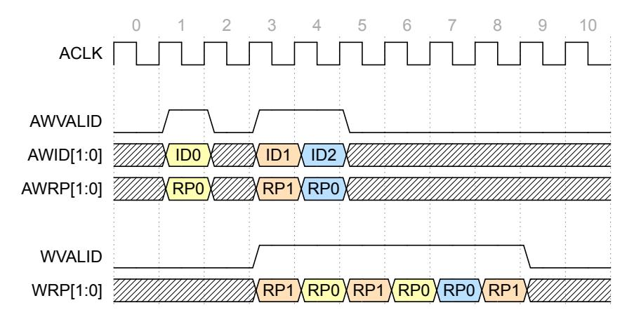

**Figure A5.1: Example of a write data ordering with two Resource Planes**

A Subordinate must ensure that the BID value of a write response matches the AWID value of the request to which it is responding.

<span id="page-99-2"></span>An interconnect must ensure that write responses from a sequence of transactions with the same AWID value targeting different Subordinates are received by the Manager in request order.

# <span id="page-100-0"></span>**A5.6 Read data ordering**

The Subordinate must ensure that the RID value of any returned data matches the ARID value of the request to which it is responding.

The interconnect must ensure that read data from a sequence of transactions with the same ARID value targeting different Subordinates are received by the Manager in request order.

The read data reordering depth is the maximum number of accepted requests for which a Subordinate might send read data. A Subordinate that sends read data in the same order as the requests were received has a read data reordering depth of one.

The read data reordering depth is a static value that can be specified by the designer of the Subordinate.

There is no mechanism for a Manager to dynamically determine the read data reordering depth of a Subordinate.

## <span id="page-100-1"></span>**A5.6.1 Read data interleaving**

AXI ordering permits read data transfers with different ID values to be interleaved. This applies to all transactions that can have multiple read data transfers, including Atomic transactions.

Some AXI Manager and interconnect components can be more efficiently designed if it is determined at design-time whether the attached Subordinate interface will interleave read data from different transactions.

The property Read\_Interleaving\_Disabled is used to indicate whether an interface supports the interleaving of read data transfers from different transactions.

**Table A5.8: Read\_Interleaving\_Disabled property**

| Read_Interleaving_Disabled | Default | Description                                                                                                                                                                          |
|----------------------------|---------|--------------------------------------------------------------------------------------------------------------------------------------------------------------------------------------|
| True                       |         | A Manager interface is not capable of receiving read data that is<br>interleaved.<br>A Subordinate interface is guaranteed not to interleave read data.                              |
| False                      | Y       | A Manager interface is capable of receiving read data that is<br>interleaved.<br>A Subordinate interface might interleave data from read<br>transactions with different ARID values. |

For some interfaces, this property can be used as a configuration control, for others it is a capability indicator. All Managers that issue transactions with different IDs must be designed to accept interleaved data. Managers might use the configuration option to disable interleaving as an optimization when the attached Subordinate supports the disabling of interleaving.

### <span id="page-101-0"></span>**A5.6.2 Read data chunking**

The read data chunking option enables a Subordinate interface to reorder read data within a transaction using a 128b granule. The start address might be used as a hint to determine which chunk to send first, but the Subordinate is permitted to return chunks of data in any order.

The property Read\_Data\_Chunking is used to indicate whether an interface supports the return of read data in reorderable chunks.

**Table A5.9: Read\_Data\_Chunking property**

| Read_Data_Chunking | Default | Description                                                              |
|--------------------|---------|--------------------------------------------------------------------------|
| True               |         | Read data chunking is supported.                                         |
| False              | Y       | Read data chunking is not supported, no chunking signals are<br>present. |

## **A5.6.2.1 Read data chunking signaling**

When read data chunking is supported, the following signals as shown in Table [A5.10](#page-101-1) are added to the read request and data channel.

**Table A5.10: Read data chunking signals**

<span id="page-101-5"></span><span id="page-101-4"></span><span id="page-101-3"></span><span id="page-101-2"></span><span id="page-101-1"></span>

| Name       | Width            | Default   | Description                                                                                                                                                                                                            |
|------------|------------------|-----------|------------------------------------------------------------------------------------------------------------------------------------------------------------------------------------------------------------------------|
| ARCHUNKEN  | 1                | 0b0       | If asserted in a read request, the Subordinate can<br>send read data in 128b chunks.                                                                                                                                   |
| RCHUNKV    | 1                | 0b0       | Asserted high to indicate that RCHUNKNUM and<br>RCHUNKSTRB are valid. It must be the same for<br>every response of the transaction.                                                                                    |
| RCHUNKNUM  | RCHUNKNUM_WIDTH  | All zeros | Indicates the chunk number being transferred.<br>Chunks are numbered incrementally from zero,<br>according to the data width and base address of<br>the transaction.                                                   |
| RCHUNKSTRB | RCHUNKSTRB_WIDTH | All ones  | Indicates the read data chunks that are valid for<br>this transfer.<br>Each bit corresponds to 128 bits of data. The least<br>significant bit of RCHUNKSTRB corresponds to<br>the least significant 128 bits of RDATA. |

The RCHUNKNUM\_WIDTH property defines the width of the RCHUNKNUM signal.

**Table A5.11: RCHUNKNUM\_WIDTH property**

| Name            | Values           | Default | Description                                                                                                                                                                                                         |
|-----------------|------------------|---------|---------------------------------------------------------------------------------------------------------------------------------------------------------------------------------------------------------------------|
| RCHUNKNUM_WIDTH | 0, 1, 5, 6, 7, 8 | 0       | Width of RCHUNKNUM in bits.<br>Must be 0 if Read_Data_Chunking == False else<br>0 or 1 if DATA_WIDTH < 128<br>8 if DATA_WIDTH == 128<br>7 if DATA_WIDTH == 256<br>6 if DATA_WIDTH == 512<br>5 if DATA_WIDTH == 1024 |

The RCHUNKSTRB\_WIDTH property defines the width of the RCHUNKSTRB signal.

**Table A5.12: RCHUNKSTRB\_WIDTH property**

| Name             | Values        | Default | Description                                                                                                                                                                                |
|------------------|---------------|---------|--------------------------------------------------------------------------------------------------------------------------------------------------------------------------------------------|
| RCHUNKSTRB_WIDTH | 0, 1, 2, 4, 8 | 0       | Width of RCHUNKSTRB in bits.<br>Must be 0 if Read_Data_Chunking == False else<br>0 or 1 if DATA_WIDTH < 256<br>2 if DATA_WIDTH == 256<br>4 if DATA_WIDTH == 512<br>8 if DATA_WIDTH == 1024 |

Interfaces with a small DATA\_WIDTH can include RCHUNKNUM and RCHUNKSTRB signals as 1-bit wide or omit them from the interface. When using interface protection, the RCHUNKCHK signal covers both of these signals, so RCHUNKNUM and RCHUNKSTRB must be the same width for connected components.

It is recommended that RCHUNKNUM and RCHUNKSTRB are omitted if not required by the interface.

### **A5.6.2.2 Read data chunking protocol rules**

In the read data chunking protocol, all the following rules apply:

- ARCHUNKEN must only be asserted for transactions with the following attributes:
  - Size is equal to the data channel width, or Length is one transfer.
  - Size is 128 bits or larger.
  - Addr is aligned to 16 bytes.
  - Burst is INCR or WRAP.
  - Opcode is ReadNoSnoop, ReadOnce, ReadOnceCleanInvalid, or ReadOnceMakeInvalid.
- The ID value must be unique-in-flight, which means:
  - ARCHUNKEN can only be asserted if there are no outstanding read transactions using the same ARID value.
  - The Manager must not issue a request on the read channel with the same ARID as an outstanding request that had ARCHUNKEN asserted.
  - If present on the interface, ARIDUNQ must be asserted if ARCHUNKEN is asserted.
- If ARCHUNKEN is deasserted, RCHUNKV must be deasserted for all response transfers of the transaction.

- If ARCHUNKEN is asserted, RCHUNKV can be asserted for response transfers of the transaction.
- RCHUNKV must be the same for every response transfer of a transaction.
- When RVALID and RCHUNKV are asserted, RCHUNKNUM must be between zero and ARLEN.
- When RVALID and RCHUNKV are asserted, RCHUNKSTRB must not be zero.
- When RVALID and RCHUNKV are asserted, RLAST must only be asserted for the final response transfer of the transaction, irrespective of RCHUNKNUM and RCHUNKSTRB.
- When RVALID is asserted and RCHUNKV is deasserted, RCHUNKNUM and RCHUNKSTRB can take any value.

The number of data chunks transferred must be consistent with ARLEN and ARSIZE, so the number of bytes transferred in a transaction is the same whether chunking is enabled or not. Note that when using read data chunking, a transaction might have more read data transfers than indicated by ARLEN.

For unaligned transactions, chunks at addresses lower than ARADDR are not transferred and must have RCHUNKSTRB deasserted.

## **A5.6.2.3 Interoperability**

If a Manager supports read data chunking, then downstream interconnect and Subordinates can reduce their buffering if they also support chunking. An interconnect which connects to components with a mixture of chunking support can drive ARCHUNKEN and RCHUNKV according to the capabilities of the attached components.

When connecting interfaces with different values for the Read\_Data\_Chunking property, the following rules apply as shown in Table [A5.13.](#page-103-0)

**Table A5.13: Read\_Data\_Chunking interoperability**

<span id="page-103-0"></span>

|                | Subordinate: False                             | Subordinate: True                                 |  |
|----------------|------------------------------------------------|---------------------------------------------------|--|
|                | ARCHUNKEN is not present.                      | Subordinate ARCHUNKEN input is tied<br>low.       |  |
| Manager: False | RCHUNKV is not present.                        | Subordinate RCHUNKV output is<br>unconnected.     |  |
|                | RCHUNKNUM is not present.                      | Subordinate RCHUNKNUM output is<br>unconnected.   |  |
|                | RCHUNKSTRB is not present.                     | Subordinate RCHUNKSTRB output is<br>unconnected.  |  |
|                | Full data transfers are sent in natural order. | Full data transfers are sent in natural order.    |  |
|                | Manager ARCHUNKEN output is<br>unconnected.    | Chunking signals are connected.                   |  |
| Manager: True  | Manager RCHUNKV input is tied low.             | Read data can be reordered and sent in<br>chunks. |  |
|                | Manager RCHUNKNUM input is tied.               |                                                   |  |
|                | Manager RCHUNKSTRB input is tied.              |                                                   |  |
|                | Full data transfers are sent in natural order. |                                                   |  |

### **A5.6.2.4 Chunking examples**

In these examples, each row in the figure represents a transfer and the shaded cells indicate bytes that are not transferred.

[Figure](#page-104-0) [A5.2](#page-104-0) shows a transaction on a 256-bit width read data channel where:

- Addr is 0x00.
- Length is 2 transfers.
- Size is 256 bits.
- Burst is INCR.

<span id="page-104-0"></span>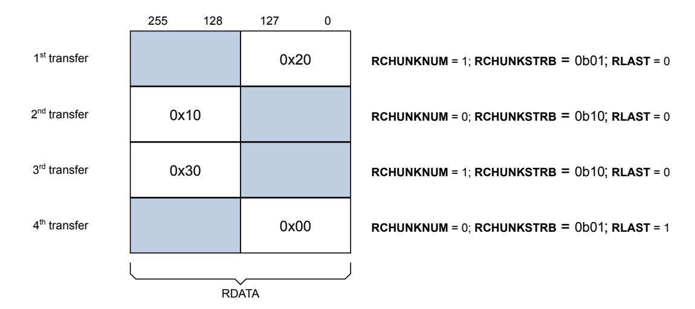

**Figure A5.2: Example of read data returned in 128-bit chunks**

[Figure](#page-104-1) [A5.3](#page-104-1) shows a transaction on a 256-bit width read data channel, where:

- Addr is 0x10.
- Length is 2 transfers.
- Size is 256 bits.
- Burst is INCR.

<span id="page-104-1"></span>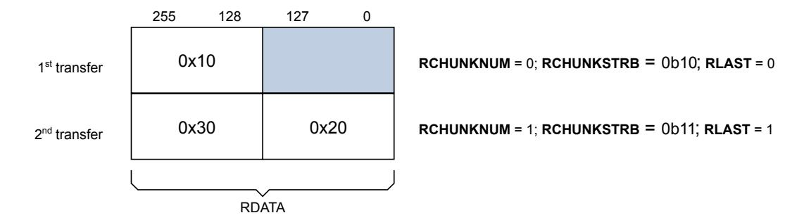

**Figure A5.3: Example with an unaligned address and a mixture of 128-bit and 256-bit chunks**

[Figure](#page-105-0) [A5.4](#page-105-0) shows a transaction on a 128-bit width read data channel, where:

- Addr is 0x10.
- Length is 4 transfers.
- Size is 128 bits.
- Burst is WRAP.
- RCHUNKSTRB is not present.

The Subordinate uses the start address as a hint and sends the chunk at 0x10 first.

<span id="page-105-0"></span>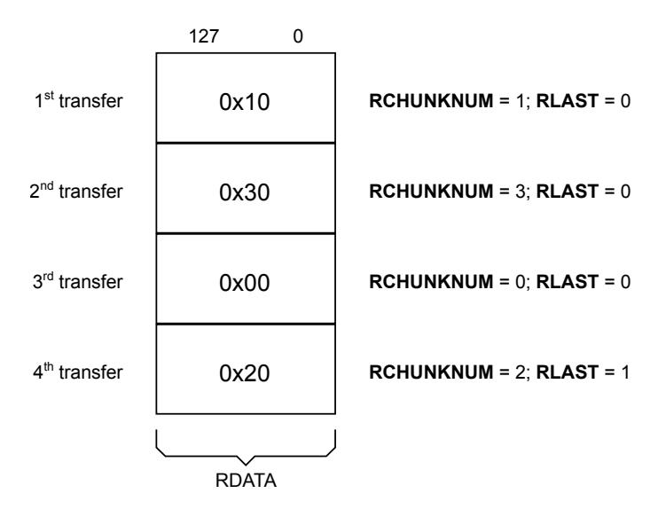

**Figure A5.4: Example of a wrapping transaction**

# <span id="page-106-0"></span>Chapter A6 **Atomic accesses**

This chapter describes single-copy and multi-copy atomicity and how to perform exclusive accesses and atomic transactions.

It contains the following sections:

- [A6.1](#page-107-0) *[Single-copy atomicity size](#page-107-0)*
- [A6.2](#page-108-0) *[Multi-copy write atomicity](#page-108-0)*
- [A6.3](#page-109-0) *[Exclusive accesses](#page-109-0)*
- [A6.4](#page-112-0) *[Atomic transactions](#page-112-0)*

# <span id="page-107-0"></span>**A6.1 Single-copy atomicity size**

The single-copy atomicity size is the minimum number of bytes that a transaction updates atomically. The AXI protocol requires a transaction that is larger than the single-copy atomicity size to update memory in blocks of at least the single-copy atomicity size.

Atomicity does not define the exact instant when the data is updated. What must be ensured is that no Manager can ever observe a partially updated form of the atomic data. For example, in many systems, data structures such as linked lists are made up of 32-bit atomic elements. An atomic update of one of these elements requires that the entire 32-bit value is updated at the same time. It is not acceptable for any Manager to observe an update of only 16 bits at one time, and then the update of the other 16 bits later.

More complex systems require support for larger atomic elements, in particular 64-bit atomic elements, so that Managers can communicate using data structures that are based on these larger atomic elements.

The single-copy atomicity sizes that are supported in a system are important because all the components involved in a given communication must support the required size of atomic element. If two Managers are communicating through an interconnect and a single Subordinate, then all the components involved must ensure that transactions of the required size are treated atomically.

The AXI protocol does not require a specific single-copy atomicity size and systems can be designed to support different single-copy atomicity sizes.

In AXI the term single-copy atomic group describes a group of components that can communicate at a particular atomicity. For example, [Figure](#page-107-1) [A6.1](#page-107-1) shows a system in which:

- The CPU, DSP, DRAM controller, DMA controller, peripherals, SRAM memory and associated interconnect, are in a 32-bit single-copy atomic group.
- The CPU, DSP, DRAM controller, and associated interconnect are also in a 64-bit single-copy atomic group.

<span id="page-107-1"></span>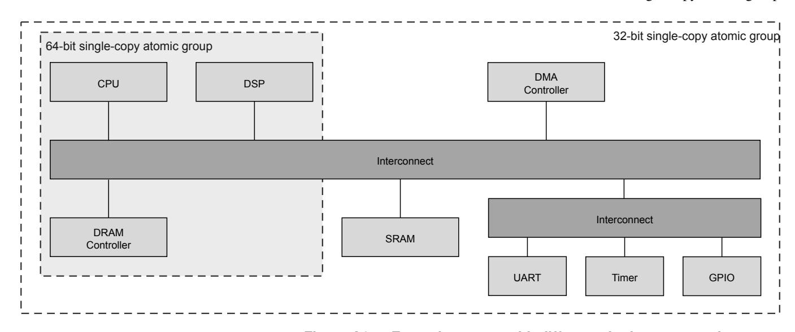

**Figure A6.1: Example system with different single-copy atomic groups**

A transaction never has an atomicity guarantee greater than the alignment of its start address. For example, a transaction in a 64-bit single-copy atomic group that is not aligned to an 8-byte boundary does not have any 64-bit single-copy atomic guarantee.

Byte strobes associated with a transaction do not affect the single-copy atomicity size.

# <span id="page-108-2"></span><span id="page-108-0"></span>**A6.2 Multi-copy write atomicity**

A system is defined as being multi-copy atomic if:

- Writes to the same location are observed in the same order by all agents.
- A write to a location that is observable by an agent, is observable by all agents.

To specify that a system provides multi-copy atomicity, a Multi\_Copy\_Atomicity property is defined.

**Table A6.1: Multi\_Copy\_Atomicity property**

| Multi_Copy_Atomicity | Default | Description                            |
|----------------------|---------|----------------------------------------|
| True                 |         | Multi_Copy_Atomicity is supported.     |
| False                | Y       | Multi_Copy_Atomicity is not supported. |

Multi-copy atomicity can be ensured by:

- Using a single Point of Serialization (PoS) for a given address, so that all accesses to the same location are ordered. This must ensure that all coherent cached copies of a location are invalidated before the new value of the location is made visible to any agents.
- Avoiding the use of forwarding buffers that are upstream of any agents. This prevents a buffered write of a location becoming visible to some agents before it is visible to all agents.

<span id="page-108-1"></span>It is required that the Multi\_Copy\_Atomicity property is True for Issue G and later of this specification.

# <span id="page-109-2"></span><span id="page-109-0"></span>**A6.3 Exclusive accesses**

The exclusive access mechanism can provide semaphore-type operations without requiring the connection to remain dedicated to a particular Manager during the operation.

The AxLOCK signals are used to indicate an exclusive access, and the BRESP and RRESP signals indicate the success or failure of the exclusive access write or read respectively.

**Table A6.2: AxLOCK signals**

<span id="page-109-5"></span><span id="page-109-4"></span>

| Name              | Width | Default | Description                                                        |
|-------------------|-------|---------|--------------------------------------------------------------------|
| AWLOCK,<br>ARLOCK | 1     | 0b0     | Asserted high to indicate that an exclusive access is<br>required. |

The Exclusive\_Accesses property is used to define whether a Manager issues exclusive accesses or whether a Subordinate supports them:

**Table A6.3: Exclusive\_Accesses property**

| Exclusive_Accesses | Default | Description                                                                                  |
|--------------------|---------|----------------------------------------------------------------------------------------------|
| True               | Y       | Exclusive accesses are supported. AWLOCK and<br>ARLOCK are present on the interface.         |
| False              |         | Exclusive accesses are not supported. AWLOCK and<br>ARLOCK are not present on the interface. |

<span id="page-109-3"></span>[Table](#page-109-3) [A6.4](#page-109-3) provides guidance that applies when connecting Manager and Subordinate components with different property values:

**Table A6.4: Exclusive Accesses Interoperability**

|                | Subordinate: False                                                                                   | Subordinate: True                                 |
|----------------|------------------------------------------------------------------------------------------------------|---------------------------------------------------|
| Manager: False | Compatible.                                                                                          | Compatible.<br>AWLOCK and ARLOCK are tied<br>LOW. |
| Manager: True  | Not compatible.<br>Exclusive accesses will continually fail,<br>but the interface will not deadlock. | Compatible.                                       |

### <span id="page-109-1"></span>**A6.3.1 Exclusive access sequence**

The mechanism of an exclusive access sequence is:

- 1. A Manager issues an exclusive read request from an address.
- 2. At some later time, the Manager attempts to complete the exclusive operation by issuing an exclusive write request to the same address, with an AWID that matches the ARID used for the exclusive read.
- 3. This exclusive write access is signaled as either:
  - Successful, if no other Manager has written to that location since the exclusive read access. In this case, the exclusive write updates memory.

• Failed, if another Manager has written to that location since the exclusive read access. In this case, the memory location is not updated.

A Manager might not complete the write portion of an exclusive operation. The exclusive access monitoring hardware monitors only one address for each transaction ID. If a Manager does not complete the write portion of an exclusive operation, a subsequent exclusive read by that Manager using the same transaction ID changes the address that is being monitored for exclusive accesses.

### <span id="page-110-0"></span>**A6.3.2 Exclusive access from the perspective of the Manager**

A Manager starts an exclusive operation by performing an exclusive read. If the transaction is successful, the Subordinate returns the EXOKAY response, indicating that the Subordinate recorded the address to be monitored for exclusive accesses.

If the Manager attempts an exclusive read from a Subordinate that does not support exclusive accesses, the Subordinate returns the OKAY response instead of the EXOKAY response. In this case, the read data is valid, but the location is not being monitored for exclusivity.

The Manager can treat the OKAY response as an error condition indicating that the exclusive access is not supported. It is recommended that the Manager does not perform the write portion of this exclusive operation.

At some time after the exclusive read, the Manager tries an exclusive write to the same location. If the contents of the addressed location have not been updated since the exclusive read, the exclusive write operation succeeds. The Subordinate returns the EXOKAY response, and updates the memory location.

If the contents of the addressed location have been updated since the exclusive read, the exclusive write attempt fails, and the Subordinate returns the OKAY response instead of the EXOKAY response. The exclusive write attempt does not update the memory location.

A Manager might not complete the write portion of an exclusive operation. If this happens, the Subordinate continues to monitor the address for exclusive accesses until another exclusive read starts a new exclusive access sequence.

A Manager must not start the write part of an exclusive access sequence until the read part is complete.

### <span id="page-110-2"></span><span id="page-110-1"></span>**A6.3.3 Exclusive access restrictions**

The following restrictions apply to exclusive accesses:

- The address of an exclusive access must be aligned to the total number of bytes in the transaction, that is, the product of Size and Length.
- The number of bytes to be transferred in an exclusive access transaction must be a power-of-2, that is, 1, 2, 4, 8, 16, 32, 64, or 128 bytes.
- The Length of an exclusive access must not exceed 16 transfers.
- The Domain must not be Shareable, see [A8.3.3](#page-133-3) *[Shareable Domain](#page-133-3)*.
- The Opcode must be ReadExclusive or WriteExclusive. See Chapter [A7](#page-122-0) *[Request Opcodes](#page-122-0)*.
- AWTAGOP must not be Match, see [A12.2](#page-189-0) *[Memory Tagging Extension \(MTE\)](#page-189-0)*.

Failure to observe these restrictions causes UNPREDICTABLE behavior.

For an exclusive sequence to be successful, the AxCACHE values must be appropriate to ensure that the read and write requests reach the exclusive access monitor.

The minimum number of bytes to be monitored during an exclusive operation is the product of Size and Length.

The Subordinate can monitor a larger number of bytes, up to 128, which is the maximum number of bytes in an exclusive access. However, this can result in a successful exclusive access being indicated as failing because a neighboring byte was updated.

<span id="page-111-1"></span>If any of the signals shown in [Table](#page-111-1) [A6.5](#page-111-1) are different between the read and write requests in an exclusive sequence, the exclusive write might fail even if the location has not been updated by another agent.

**Table A6.5: Signals that should be the same in an exclusive sequence**

| AxID    | AxADDR      | AxREGION  | AxSUBSYSID | AxDOMAIN        |
|---------|-------------|-----------|------------|-----------------|
| AxLEN   | AxSIZE      | AxBURST   | AxLOCK     | AxCACHE[1:0]    |
| AxPROT  | AxNSE       | AxPAS     | AxINST     | AxPRIV          |
| AxSNOOP | AxMMUVALID  | AxMMUATST | AxMMUFLOW  | AxMMUPASUNKNOWN |
| AxMMUPM | AxMMUSECSID | AxMMUSID  | AxMMUSSID  | AxMMUSSIDV      |

### <span id="page-111-0"></span>**A6.3.4 Exclusive access from the perspective of the Subordinate**

A Subordinate that supports exclusive access must have monitor hardware. It is recommended that such a Subordinate has a monitor unit for each exclusive-capable Manager ID that can access it.

When a Subordinate receives an exclusive read request, it records the address and ARID value of any exclusive read operation. Then it monitors that location until either a write occurs to that location or until another exclusive read with the same ARID value resets the monitor to a different address.

If the Subordinate can successfully process the exclusive read, it responds with EXOKAY for every read data transfer.

If the Subordinate cannot process the exclusive read, it responds with a response which is not EXOKAY. An exclusive read can have more than one response transfers. It is not permitted to have a mix of OKAY and EXOKAY responses for a single transaction.

When the Subordinate receives an exclusive write with a given AWID value, the monitor checks to see if that address is being monitored for exclusive access with that AWID. If it is, then this indicates that no write has occurred to that location since the exclusive read access, and the exclusive write proceeds, completing the exclusive access. The Subordinate returns the EXOKAY response to the Manager and updates the addressed memory location.

If the address is not being monitored with the same AWID value at the time of an exclusive write, this indicates one of the following:

- The location has been updated since the exclusive read access.
- The monitor has been reset to another location.
- The Manager did not issue an exclusive read with the same attributes as the exclusive write.

If the monitor deems the sequence to have failed, the exclusive write must not update the addressed location, and the Subordinate must return the OKAY response instead of the EXOKAY response.

If a Subordinate that does not support exclusive accesses receives an exclusive write, it responds with an OKAY response and the location is updated.

# <span id="page-112-2"></span><span id="page-112-0"></span>**A6.4 Atomic transactions**

Atomic transactions perform more than just a single access and have an operation that is associated with the transaction. Atomic transactions enable sending the operation to the data, permitting the operation to be performed closer to where the data is located. Atomic transactions are suited to situations where the data is located a significant distance from the agent that must perform the operation.

Compared with using exclusive accesses, this approach reduces the amount of time during which the data must be made inaccessible to other agents in the system.

Atomic transactions update the entire written location atomically, irrespective of the single-copy atomicity size of the component.

### <span id="page-112-1"></span>**A6.4.1 Overview**

In an atomic transaction, the Manager sends an address, control information, and outbound data. The Subordinate sends inbound data (except for AtomicStore) and a response. This specification supports four forms of Atomic transaction:

### *AtomicStore*

- The Manager sends a single data value with an address and the atomic operation to be performed.
- The Subordinate performs the operation using the sent data and value at the addressed location as operands.
- The result is stored in the address location.
- A single response is given without data.
- Outbound data size is 1, 2, 4, or 8 bytes.

### *AtomicLoad*

- The Manager sends a single data value with an address and the atomic operation to be performed.
- The Subordinate returns the original data value at the addressed location.
- The Subordinate performs the operation using the sent data and value at the addressed location as operands.
- The result is stored in the address location.
- Outbound data size is 1, 2, 4, or 8 bytes.
- Inbound data size is the same as the outbound data size.

### *AtomicSwap*

- The Manager sends a single data value with an address.
- The Subordinate swaps the value at the addressed location with the data value that is supplied in the transaction.
- The Subordinate returns the original data value at the addressed location.
- Outbound data size is 1, 2, 4, or 8 bytes.
- Inbound data size is the same as the outbound data size.

#### *AtomicCompare*

- The Manager sends two data values, the compare value and the swap value, to the addressed location. The compare and swap values are of equal size.
- The Subordinate checks the data value at the addressed location against the compare value:
  - If the values match, the swap value is written to the addressed location.
  - If the values do not match, the swap value is not written to the addressed location.
- The Subordinate returns the original data value at the addressed location.
- Outbound data size is 2, 4, 8, 16, or 32 bytes.
- Inbound data size is half of the outbound data size because the outbound data contains both compare and swap values, whereas the inbound data has only the original data value.

# <span id="page-113-2"></span><span id="page-113-0"></span>**A6.4.2 Atomic transaction operations**

This specification supports eight different operations that can be used with AtomicStore and AtomicLoad transactions as shown in [Table](#page-113-2) [A6.6.](#page-113-2)

**Table A6.6: Atomic transaction operators**

| Operator | Description                                                                                                             |
|----------|-------------------------------------------------------------------------------------------------------------------------|
| ADD      | The value in memory is added to the sent data and the result stored in memory.                                          |
| CLR      | Every set bit in the sent data clears the corresponding bit of the data in memory.                                      |
| EOR      | Bitwise exclusive OR of the sent data and value in memory.                                                              |
| SET      | Every set bit in the sent data sets the corresponding bit of the data in memory.                                        |
| SMAX     | The value stored in memory is the maximum of the existing value and sent data.<br>This operation assumes signed data.   |
| SMIN     | The value stored in memory is the minimum of the existing value and sent data.<br>This operation assumes signed data.   |
| UMAX     | The value stored in memory is the maximum of the existing value and sent data.<br>This operation assumes unsigned data. |
| UMIN     | The value stored in memory is the minimum of the existing value and sent data.<br>This operation assumes unsigned data. |

### <span id="page-113-1"></span>**A6.4.3 Atomic transactions attributes**

The rules for atomic transactions are as follows:

- AWLEN and AWSIZE specify the number of bytes of write data in the transaction. For AtomicCompare, the number of bytes must include both the compare and swap values.
- If AWLEN indicates a transaction length greater than one, AWSIZE is required to be the full data channel width.
- Write strobes that are not within the data window, as specified by AWADDR and AWSIZE, must be deasserted.
- Write strobes within the data window must be asserted.
- All atomic transactions are considered to be Regular.

#### *For AtomicStore, AtomicLoad, and AtomicSwap*

- The write data is 1, 2, 4, or 8 bytes and read data is 1, 2, 4, or 8 bytes respectively.
- AWADDR must be aligned to the total write data size.
- AWBURST must be INCR.

#### *For AtomicCompare*

- The write data is 2, 4, 8, 16, or 32 bytes and read data is 1, 2, 4, 8, or 16 bytes.
- AWADDR must be aligned to half the total write data size.
- If AWADDR points to the lower half of the transaction:
  - The compare value is sent first. The compare value is in the lower bytes of a single-transfer transaction, or in the first transfers of a multi-transfer transaction.
  - AWBURST must be INCR.
- If AWADDR points to the upper half of the transaction:
  - The swap value is sent first. The swap value is in the lower bytes of a single-transfer transaction, or in the first transfers of a multi-transfer transaction.
  - AWBURST must be WRAP.
- There are relaxations to the usual rules for transactions of type WRAP:
  - A Length of 1 is permitted.
  - AWADDR is not required to be aligned to the transfer size.
  - The property Wrap\_CLS\_Modifiable does not affect AtomicCompare. See [A3.1.4](#page-46-2) *[Wrapping address](#page-46-2) [\(WRAP\)](#page-46-2)* for more information.

Examples of AtomicCompare transactions with a 64-bit data channel are shown in [Figure](#page-115-1) [A6.2.](#page-115-1)

<span id="page-115-1"></span>

| AWADDR | AWSIZE | AWLEN | AWBURST | 67<br>345<br>012                     |
|--------|--------|-------|---------|--------------------------------------|
| 0x00   | 1 (2B) | 0     | INCR    | <br><br>CS-                          |
| 0x01   | 1 (2B) | 0     | WRAP    | <br><br>SC                           |
| 0x04   | 2 (4B) | 0     | INCR    | SS<br>CC<br>                         |
| 0x06   | 2 (4B) | 0     | WRAP    | CC<br>SS<br>                         |
| 0x00   | 3 (8B) | 0     | INCR    | SS<br>CSS<br>CC<br>C                 |
| 0x04   | 3 (8B) | 0     | WRAP    | CC<br>SCC<br>SS<br>S                 |
|        | 3 (8B) | 1     | INCR    | 1st Transfer<br>CC<br>CCC<br>CC<br>C |
| 0x00   |        |       |         | 2nd Transfer<br>SS<br>SSS<br>SS<br>S |
|        |        |       |         | 1st Transfer<br>SS<br>SSS<br>SS<br>S |
| 0x08   | 3 (8B) | 1     | WRAP    | 2nd Transfer<br>CC<br>CCC<br>CC<br>C |

**Figure A6.2: Examples showing the location of the Compare and Swap values for an AtomicCompare**

Note that the compare and swap values are sent in a different order in the last two examples.

### <span id="page-115-2"></span><span id="page-115-0"></span>**A6.4.4 ID use for Atomic transactions**

A single AXI ID is used for an Atomic transaction. The same AXI ID is used for the request, write response, and the read data. This requirement means that the Manager must only use ID values that can be signaled on both AWID and RID signals.

The ID must be unique-in-flight for Atomic transactions, which means:

- An AtomicStore request can only be issued if there are no outstanding transactions on the write channels using the same ID value.
- A Manager must not issue a request on the write channel with the same ID value as an outstanding AtomicStore request.
- An AtomicLoad, AtomicSwap or AtomicCompare request can only be issued if there are no outstanding transactions on the read or write channels using the same ID value.
- A Manager must not issue a request on the read or write channels with the same ID value as an outstanding AtomicLoad, AtomicSwap or AtomicCompare request.
- For Atomic transactions that use the read data channel, if the interface includes Unique ID signaling then RIDUNQ must be asserted if AWIDUNQ was asserted. See [A5.2](#page-90-0) *[Unique ID indicator](#page-90-0)* for more details.

These rules ensure there are no ordering requirements between Atomic transactions and other transactions.

### <span id="page-116-0"></span>**A6.4.5 Request attribute restrictions for Atomic transactions**

For Atomic transactions, the following restrictions apply for request attributes:

- AWCACHE and AWDOMAIN are permitted to be any combination valid for the interface type. See [Table](#page-135-2) [A8.7.](#page-135-2)
- AWSNOOP must be set to all zeros. If AWSNOOP has any other value, AWATOP must be all zeros.
- AWLOCK must be deasserted, not exclusive access.

### <span id="page-116-1"></span>**A6.4.6 Atomic transaction signaling**

To support Atomic transactions AWATOP is added to an interface.

**Table A6.7: AWATOP signal**

<span id="page-116-3"></span>

| Name   | Width | Default | Description                                                    |
|--------|-------|---------|----------------------------------------------------------------|
| AWATOP | 6     | 0x00    | Indicates the type and endianness of an<br>atomic transaction. |

<span id="page-116-2"></span>The encodings for AWATOP are shown in [Table](#page-116-2) [A6.8](#page-116-2) and [Table](#page-117-1) [A6.9.](#page-117-1)

**Table A6.8: AWATOP encodings**

| AWATOP[5:0] | Description          |
|-------------|----------------------|
| 0b000000    | Non-atomic operation |
| 0b01exxx    | AtomicStore          |
| 0b10exxx    | AtomicLoad           |
| 0b110000    | AtomicSwap           |
| 0b110001    | AtomicCompare        |

For AtomicStore and AtomicLoad transactions AWATOP[3] indicates the endianness that is required for the atomic operation:

- When deasserted, this bit indicates that the operation is little-endian.
- When asserted, this bit indicates that the operation is big-endian.

The value of AWATOP[3] applies to arithmetic operations only and is ignored for bitwise logical operations.

For AtomicStore and AtomicLoad transactions, [Table](#page-117-1) [A6.9](#page-117-1) shows the encodings for the operations on the lower-order AWATOP[2:0] signals.

**Table A6.9: Lower order AWATOP[2:0] encodings**

| AWATOP[2:0] | Operation | Description      |
|-------------|-----------|------------------|
| 0b000       | ADD       | Add              |
| 0b001       | CLR       | Bit clear        |
| 0b010       | EOR       | Exclusive OR     |
| 0b011       | SET       | Bit set          |
| 0b100       | SMAX      | Signed maximum   |
| 0b101       | SMIN      | Signed minimum   |
| 0b110       | UMAX      | Unsigned maximum |
| 0b111       | UMIN      | Unsigned minimum |

## <span id="page-117-1"></span><span id="page-117-0"></span>**A6.4.7 Transaction structure**

For AtomicLoad, AtomicSwap, and AtomicCompare transactions, the transaction structure is as follows:

- The request is issued on the AW channel.
- The associated transaction data is sent on the W channel.
- The number of write data transfers required on the W channel is determined by the AWLEN signal.
- The relative timing of the Atomic transaction request and the Atomic transaction write data is not specified.
- The Subordinate returns the original data value using the R channel.
- The number of read data transfers is determined from both AWLEN and the AWATOP signals. For the AtomicCompare operation, if AWLEN indicates a transaction length greater than 1, then the number of read data transfers is half that specified by AWLEN.
- A Subordinate is permitted to wait for all write data before sending read data. A Manager must be able to send all write data without receiving any read data.
- A Subordinate is permitted to send all read data before accepting any write data. A Manager must be able to accept all read data without any write data being accepted.
- A single write response is returned on the B channel. The write response must be given by the Subordinate only after it has received all write data transfers and the result of the atomic transaction is observable.

<span id="page-117-2"></span>The transfers involved in AtomicLoad, AtomicSwap, and AtomicCompare transactions are shown in [Figure](#page-117-2) [A6.3.](#page-117-2)

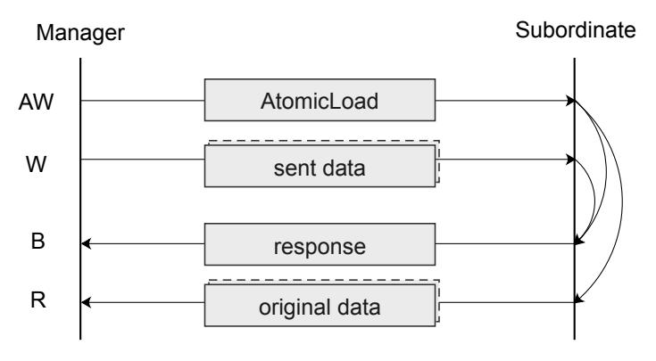

**Figure A6.3: AtomicLoad, AtomicSwap, or AtomicCompare transaction**

For AtomicStore transactions, the transaction structure is as follows:

- The request is issued on the AW channel.
- The associated transaction data is sent on the W channel.
- The number of write data transfers required on the W channel is determined by the AWLEN signal.
- The relative timing of the Atomic transaction request and the Atomic transaction write data is not specified.
- A single write response is returned on the B channel. The write response must be given only by the Subordinate after it has received all write data transfers and the result of the atomic transaction is observable.

<span id="page-118-1"></span>The transfers involved in AtomicStore transactions are shown in [Figure](#page-118-1) [A6.4.](#page-118-1)

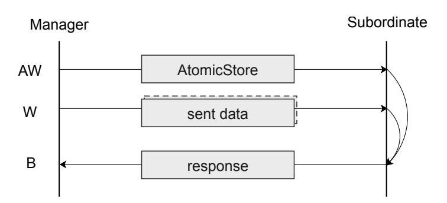

**Figure A6.4: AtomicStore transaction**

## <span id="page-118-0"></span>**A6.4.8 Response signaling**

The write response to an Atomic transaction indicates that the transaction is visible to all required observers.

Atomic transactions that include a read response are visible to all required observers from the point of receiving the first item of read data.

A Manager is permitted to use either a read or write response as an indication that a transaction is visible to all required observers.

There is no concept of an error that is associated with the operation, such as overflow. An operation is fully specified for all input combinations.

For transactions, such as AtomicCompare, where there are multiple outcomes for the transaction, no indication is provided on the outcome of the transaction. To determine if a Compare and Swap instruction has updated the memory location, it is necessary to inspect the original data value that is returned as part of the transaction.

It is permitted to give an error response to an Atomic transaction when the transaction reaches a component that does not support Atomic transactions.

For AtomicLoad, AtomicSwap, and AtomicCompare transactions:

- A Subordinate must send the correct number of read data transfers, even if the write response is DECERR or SLVERR.
- A Manager might ignore the write response and only use the response that comes with read data.
- If there is an error with the write part of the transaction, it is highly recommended that a DECERR or SLVERR response is signaled on the read and write responses, so it is not missed by the Manager.
- If there is an error on the write but not on the read, a Manager ignoring the write response must read the location again to determine whether it was updated.

### <span id="page-119-0"></span>**A6.4.9 Atomic transaction dependencies**

For AtomicLoad, AtomicSwap, and AtomicCompare transactions, [Figure](#page-120-1) [A6.5](#page-120-1) shows the following Atomic transaction handshake signal dependencies:

- The Manager must not wait for the Subordinate to assert AWREADY or WREADY before asserting AWVALID or WVALID.
- The Subordinate can wait for AWVALID or WVALID, or both, before asserting AWREADY.
- The Subordinate can assert AWREADY before AWVALID or WVALID, or both, are asserted.
- The Subordinate can wait for AWVALID or WVALID, or both, before asserting WREADY.
- The Subordinate can assert WREADY before AWVALID or WVALID, or both, are asserted.
- The Subordinate must wait for AWVALID, AWREADY, WVALID, and WREADY to be asserted before asserting BVALID.
- The Subordinate must also wait for WLAST to be asserted before asserting BVALID because the write response BRESP, must be signaled only after the last data transfer of a write transaction.
- The Subordinate must not wait for the Manager to assert BREADY before asserting BVALID.
- The Manager can wait for BVALID before asserting BREADY.
- The Manager can assert BREADY before BVALID is asserted.
- The Subordinate must wait for both AWVALID and AWREADY to be asserted before it asserts RVALID to indicate that valid data is available.
- The Subordinate must not wait for the Manager to assert RREADY before asserting RVALID.
- The Manager can wait for RVALID to be asserted before it asserts RREADY.
- The Manager can assert RREADY before RVALID is asserted.
- The Manager must not wait for the Subordinate to assert RVALID before asserting WVALID.
- The Subordinate can wait for WVALID to be asserted, for all write data transfers, before it asserts RVALID.
- The Manager can assert WVALID before RVALID is asserted.

In the dependency diagram that [Figure](#page-120-1) [A6.5](#page-120-1) shows:

- A single-headed arrow points to a signal that can be asserted before or after the signal at the start of the arrow.
- A double-headed arrow points to a signal that must be asserted only after assertion of the signal at the start of the arrow.

<span id="page-120-1"></span>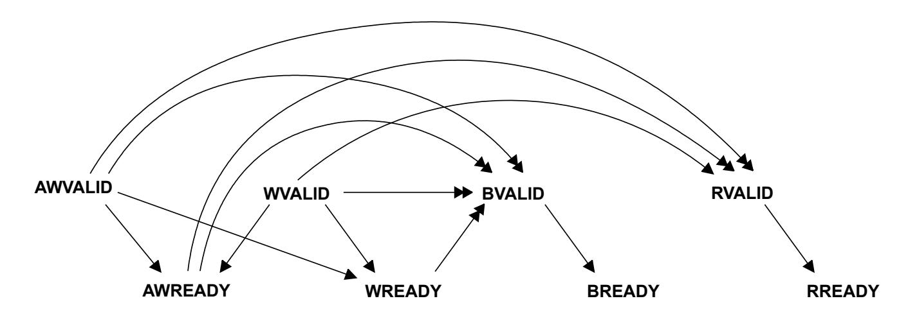

**Figure A6.5: Atomic transaction handshake dependencies**

### <span id="page-120-0"></span>**A6.4.10 Support for Atomic transactions**

The Atomic\_Transactions property is used to indicate whether a component supports Atomic transactions.

**Table A6.10: Atomic\_Transactions property**

| Atomic_Transactions | Default | Description                            |
|---------------------|---------|----------------------------------------|
| True                |         | Atomic Transactions are supported.     |
| False               | Y       | Atomic Transactions are not supported. |

In some implementations this will be a fixed interface attribute, other implementations might enable the design-time setting of the property.

If a Subordinate or interconnect component declares that it supports Atomic transactions, then it must support all operation types, sizes, and endianness.

#### *Manager support*

A Manager component that supports Atomic transactions can also include a mechanism to suppress the generation of Atomic transactions to ensure compatibility in systems where Atomic transactions are not supported.

An optional BROADCASTATOMIC pin is specified. When present and deasserted, Atomic transactions are not issued by the Manager.

**Table A6.11: BROADCASTATOMIC tie-off input**

<span id="page-120-2"></span>

| Name            | Width | Default | Description                                                                                     |
|-----------------|-------|---------|-------------------------------------------------------------------------------------------------|
| BROADCASTATOMIC | 1     | 0b1     | Manager tie-off input, used to control the issuing of<br>Atomic transactions from an interface. |

#### *Subordinate support*

It is optional for a Subordinate component to support Atomic transactions.

If a Subordinate component only supports Atomic transactions for particular memory types, or for particular address regions, then the Subordinate must give an appropriate error response for the Atomic transactions that it does not support.

#### *Interconnect support*

It is optional for an interconnect to support Atomic transactions.

If an interconnect does not support Atomic transactions, all attached Manager components must be configured to not generate Atomic transactions.

Atomic transactions can be supported at any point within an interconnect that supports them, including passing Atomic transactions downstream to Subordinate components.

Atomic transactions are not required to be supported for every address location. If Atomic transactions are not supported for a given address location, then an appropriate error response can be given for the transaction. See [A3.3](#page-60-0) *[Transaction response](#page-60-0)*.

For Device transactions, the Atomic transaction must be passed to the endpoint Subordinate. If the Subordinate is configured to indicate that it does not support Atomic transactions, then the interconnect must give an error response for the transaction. An Atomic transaction must not be passed to a component that does not support Atomic transactions.

For Cacheable transactions, the interconnect can either:

- Perform the atomic operation within the interconnect. This method requires that the interconnect performs the appropriate read, write, and snoop transactions to complete the operation.
- If the appropriate endpoint Subordinate is configured to indicate that it does support atomic operations, then the interconnect can pass the atomic operation to the Subordinate.

# <span id="page-122-0"></span>Chapter A7 **Request Opcodes**

The request Opcode indicates the function of a request and how it must be processed by a Subordinate.

This chapter summarizes all Opcodes that are available with links in the tables to detailed descriptions of how they work.

It contains the following sections:

- [A7.1](#page-123-0) *[Opcode signaling](#page-123-0)*
- [A7.2](#page-125-0) *[AWSNOOP encodings](#page-125-0)*
- [A7.3](#page-128-0) *[ARSNOOP encodings](#page-128-0)*

# <span id="page-123-0"></span>**A7.1 Opcode signaling**

The request Opcode is communicated using the AWSNOOP and ARSNOOP signals.

**Table A7.1: AxSNOOP signals**

<span id="page-123-2"></span>

| Name    | Width         | Default                                                                                  | Description                                   |
|---------|---------------|------------------------------------------------------------------------------------------|-----------------------------------------------|
| AWSNOOP | AWSNOOP_WIDTH | 0x00<br>(WriteNoSnoop /<br>WriteUniquePtl /<br>Atomic /<br>WriteExclusive /<br>WriteACT) | Opcode for requests using the write channels. |
| ARSNOOP | ARSNOOP_WIDTH | 0x0 (ReadNoSnoop<br>/ ReadOnce /<br>ReadExclusive /<br>ReadACT)                          | Opcode for requests using the read channels.  |

<span id="page-123-3"></span>WriteNoSnoop, WriteUniquePtl, ReadNoSnoop and ReadOnce are default Opcodes and are used for generic requests.

<span id="page-123-1"></span>The AxSNOOP width properties are defined in [Table](#page-123-1) [A7.2.](#page-123-1)

**Table A7.2: AxSNOOP width properties**

| Name          | Values  | Default | Description               |
|---------------|---------|---------|---------------------------|
| AWSNOOP_WIDTH | 0, 4, 5 | 4       | Width of AWSNOOP in bits. |
| ARSNOOP_WIDTH | 0, 4    | 4       | Width of ARSNOOP in bits. |

If any of the following properties are not False, AWSNOOP\_WIDTH must be 5:

- WriteDeferrable\_Transaction
- UnstashTranslation\_Transaction
- InvalidateHint\_Transaction

If any of the following properties are not False, AWSNOOP\_WIDTH must be 4 or 5:

- Shareable\_Cache\_Support
- WriteNoSnoopFull\_Transaction
- CMO\_On\_Write
- WriteZero\_Transaction
- Cache\_Stash\_Transactions
- Untranslated\_Transactions
- Prefetch\_Transaction

If any of the following properties are not False, ARSNOOP\_WIDTH must be 4:

- Shareable\_Cache\_Support
- DeAllocation\_Transactions

#### *Chapter A7. Request Opcodes A7.1. Opcode signaling*

- CMO\_On\_Read
- DVM\_Message\_Support

Any AxSNOOP bits not driven by an interface are assumed to be LOW.

A Manager that only uses Opcodes where AWSNOOP is LOW can set AWSNOOP\_WIDTH to 0 which omits the AWSNOOP output from its interface. An attached Subordinate must have its AWSNOOP input tied LOW.

A Manager that only uses Opcodes where ARSNOOP is LOW can set ARSNOOP\_WIDTH to 0 which omits the ARSNOOP output from its interface. An attached Subordinate must have its ARSNOOP input tied LOW.

# <span id="page-125-0"></span>**A7.2 AWSNOOP encodings**

The encodings for AWSNOOP are shown in [Table](#page-125-1) [A7.3.](#page-125-1) Some Opcodes depend on the Domain of the request. The Enable column lists the property expression that determines whether a Manager interface is permitted to use the Opcode and a Subordinate interface supports it.

Unlisted combinations of AWSNOOP and AWDOMAIN are illegal.

**Table A7.3: AWSNOOP encodings**

<span id="page-125-1"></span>

| AWSNOOP | AWDOMAIN1    | Opcode           | Enable                                                     | Description                                                                                                                                                                                   |
|---------|--------------|------------------|------------------------------------------------------------|-----------------------------------------------------------------------------------------------------------------------------------------------------------------------------------------------|
| 0b00000 | NSH, SYS     | WriteNoSnoop     | -                                                          | Write to a Non-shareable or<br>System location.                                                                                                                                               |
|         | SH           | WriteUniquePtl   | Shareable_Transactions                                     | Write to a Shareable location.                                                                                                                                                                |
|         | NSH, SH, SYS | Atomic           | Atomic_Transactions                                        | Atomic transaction, indicated by<br>nonzero AWATOP signal.                                                                                                                                    |
|         | NSH, SYS     | WriteExclusive   | Exclusive_Accesses                                         | Exclusive write access, indicated<br>by AWLOCK asserted.                                                                                                                                      |
|         | SYS          | WriteACT         | ACT_Support                                                | ACT write access, indicated by<br>AWACTV asserted.                                                                                                                                            |
| 0b00001 | NSH, SYS     | WriteNoSnoopFull | WriteNoSnoopFull_Transaction<br>or Shareable_Cache_Support | Cache line sized and Regular write<br>to a Non-shareable location.                                                                                                                            |
|         | SH           | WriteUniqueFull  | Shareable_Transactions                                     | Cache line sized and Regular write<br>to a Shareable location.                                                                                                                                |
| 0b00010 | -            | RESERVED         | -                                                          |                                                                                                                                                                                               |
| 0b00011 | SH           | WriteBackFull    | Shareable_Transactions and<br>Shareable_Cache_Support      | Cache line sized and Regular write<br>to a Shareable location. The line<br>was held in a coherent cache and<br>is Dirty.                                                                      |
| 0b00100 | -            | RESERVED         | -                                                          |                                                                                                                                                                                               |
| 0b00101 | SH           | WriteEvictFull   | Shareable_Transactions and<br>Shareable_Cache_Support      | Cache line sized and Regular write<br>to a Shareable location. The line<br>was held in a coherent cache and<br>is Clean.                                                                      |
| 0b00110 | NSH, SH      | CMO              | CMO_On_Write                                               | A data-less request which<br>indicates that a cache maintenance<br>operation must be performed. The<br>specific operation is encoded on<br>the AWCMO signal. Cache line<br>sized and Regular. |
| 0b00111 | NSH, SH, SYS | WriteZero        | WriteZero_Transaction                                      | Cache line sized and Regular<br>write, where the value of every<br>byte is zero.                                                                                                              |

Table A7.3 – *Continued from previous page*

| AWSNOOP | AWDOMAIN1    | Opcode               | Enable                                                    | Description                                                                                                                                                                                     |
|---------|--------------|----------------------|-----------------------------------------------------------|-------------------------------------------------------------------------------------------------------------------------------------------------------------------------------------------------|
| 0b01000 | SH           | WriteUniquePtlStash  | Shareable_Transactions and<br>Cache_Stash_Transactions    | Write to a Shareable location with<br>an indication that the data should<br>be allocated into a cache. Cache<br>line sized or smaller.                                                          |
| 0b01001 | SH           | WriteUniqueFullStash | Shareable_Transactions and<br>Cache_Stash_Transactions    | Cache line sized and Regular write<br>to a Shareable location with an<br>indication that the data should be<br>allocated into a cache.                                                          |
| 0b01010 | NSH, SH      | WritePtlCMO          | Write_Plus_CMO                                            | Write where any cached copies of<br>the line must be cleaned and/or<br>invalidated according to the<br>AWCMO signal. Cache line sized<br>or smaller.                                            |
| 0b01011 | NSH, SH      | WriteFullCMO         | Write_Plus_CMO                                            | Cache line sized and Regular write<br>where any cached copies of the<br>line must be cleaned and/or<br>invalidated according to the<br>AWCMO signal.                                            |
| 0b01100 | NSH, SH      | StashOnceShared      | Cache_Stash_Transactions                                  | A data-less request which<br>indicates that a cache line should<br>be fetched into a cache. Other<br>copies of the line are not required<br>to be invalidated. Cache line sized<br>and Regular. |
| 0b01101 | NSH, SH      | StashOnceUnique      | Cache_Stash_Transactions                                  | A data-less request which<br>indicates that a cache line should<br>be fetched into a cache. It is<br>recommended that all other copies<br>are invalidated. Cache line sized<br>and Regular.     |
| 0b01110 | NSH, SH, SYS | StashTranslation     | Untranslated_Transactions and<br>Cache_Stash_Transactions | A data-less request which<br>indicates that a translation should<br>be cached in an MMU.                                                                                                        |
| 0b01111 | NSH, SH      | Prefetch             | Prefetch_Transaction                                      | A data-less request which<br>indicates that a Manager might<br>read the addressed cache line at a<br>later time. Cache line sized and<br>Regular.                                               |
| 0b10000 | SYS          | WriteDeferrable      | WriteDeferrable_Transaction                               | A 64-byte atomic write where the<br>Subordinate can give a DEFER or<br>UNSUPPORTED response.                                                                                                    |
| 0b10001 | NSH, SH, SYS | UnstashTranslation   | UnstashTranslation_Transaction                            | A data-less request which is a hint<br>that a translation is not likely to be<br>used again.                                                                                                    |

Table A7.3 – *Continued from previous page*

| AWSNOOP               | AWDOMAIN1 | Opcode         | Enable                     | Description                                                                                                                                                                                  |
|-----------------------|-----------|----------------|----------------------------|----------------------------------------------------------------------------------------------------------------------------------------------------------------------------------------------|
| 0b10010               | NSH, SH   | InvalidateHint | InvalidateHint_Transaction | A data-less request which<br>indicates that a cache line is no<br>longer required and can be<br>invalidated. A write-back is<br>permitted but not required. Cache<br>line sized and Regular. |
| 0b10011 to<br>0b11111 | -         | RESERVED       | -                          | -                                                                                                                                                                                            |

<sup>1</sup> NSH is Non-shareable (0b00), SH is Shareable (0b01 or 0b10), SYS is System (0b11).

# <span id="page-128-0"></span>**A7.3 ARSNOOP encodings**

The encodings for ARSNOOP are shown in [Table](#page-128-1) [A7.4.](#page-128-1) Some Opcodes depend on the Domain of the request. The Enable column lists the property expression that determines whether a Manager interface is permitted to use the Opcode and a Subordinate interface supports it.

Unlisted combinations of ARSNOOP and ARDOMAIN are illegal.

**Table A7.4: ARSNOOP encodings**

<span id="page-128-1"></span>

| ARSNOOP | ARDOMAIN1 | Opcode               | Enable                                                  | Description                                                                                                                                                                        |
|---------|-----------|----------------------|---------------------------------------------------------|------------------------------------------------------------------------------------------------------------------------------------------------------------------------------------|
| 0b0000  | NSH, SYS  | ReadNoSnoop          | -                                                       | Read from a Non-shareable or<br>System location.                                                                                                                                   |
|         | SH        | ReadOnce             | Shareable_Transactions                                  | Read from a Shareable location<br>which the Manager will not<br>cache.                                                                                                             |
|         | NSH, SYS  | ReadExclusive        | Exclusive_Accesses                                      | Exclusive read access, indicated<br>by ARLOCK asserted.                                                                                                                            |
|         | SYS       | ReadACT              | ACT_Support                                             | ACT read access, indicated by<br>ARACTV asserted.                                                                                                                                  |
| 0b0001  | SH        | ReadShared           | Shareable_Transactions and<br>Shareable_Cache_Support   | Cache line sized and Regular<br>read from a Shareable location<br>which the Manager might cache.<br>Data can be Dirty.                                                             |
| 0b0010  | SH        | ReadClean            | Shareable_Transactions and<br>Shareable_Cache_Support   | Cache line sized and Regular<br>read from Shareable location<br>which the Manager might cache.<br>Data must not be Dirty.                                                          |
| 0b0011  | -         | RESERVED             | -                                                       | -                                                                                                                                                                                  |
| 0b0100  | SH        | ReadOnceCleanInvalid | Shareable_Transactions and<br>DeAllocation_Transactions | Read from a Shareable location<br>which the Manager will not<br>cache. Cached copies are<br>recommended to be cleaned and<br>invalidated. Cache line sized or<br>smaller.          |
| 0b0101  | SH        | ReadOnceMakeInvalid  | Shareable_Transactions and<br>DeAllocation_Transactions | Read from a Shareable location<br>which the Manager will not<br>cache. Cached copies are<br>recommended to be invalidated<br>without a write-back. Cache line<br>sized or smaller. |
| 0b0110  | -         | RESERVED             | -                                                       | -                                                                                                                                                                                  |
| 0b0111  | -         | RESERVED             | -                                                       | -                                                                                                                                                                                  |
| 0b1000  | NSH, SH   | CleanShared          | CMO_On_Read                                             | A request to clean all copies of a<br>cache line. Cache line sized and<br>Regular.                                                                                                 |

Table A7.4 – *Continued from previous page*

| ARSNOOP | ARDOMAIN1 | Opcode             | Enable                         | Description                                                                                                                                                            |
|---------|-----------|--------------------|--------------------------------|------------------------------------------------------------------------------------------------------------------------------------------------------------------------|
| 0b1001  | NSH, SH   | CleanInvalid       | CMO_On_Read                    | A request to clean and invalidate<br>all copies of a cache line. Cache<br>line sized and Regular.                                                                      |
| 0b1010  | NSH, SH   | CleanSharedPersist | CMO_On_Read and<br>Persist_CMO | A request to clean all copies of a<br>cache line. Cleaned data must<br>pass the Point of Persistence or<br>Point of Deep Persistence.<br>Cache line sized and Regular. |
| 0b1011  | -         | RESERVED           | -                              | -                                                                                                                                                                      |
| 0b1100  | -         | RESERVED           | -                              | -                                                                                                                                                                      |
| 0b1101  | NSH, SH   | MakeInvalid        | CMO_On_Read                    | A request to clean and invalidate<br>all copies of a cache line. Dirty<br>data is not required to be written<br>to memory. Cache line sized<br>and Regular.            |
| 0b1110  | SH        | DVM Complete       | DVM_Message_Support            | Indicates completion of a DVM<br>synchronization message.                                                                                                              |
| 0b1111  | -         | RESERVED           | -                              | -                                                                                                                                                                      |

<sup>1</sup> NSH is Non-shareable (0b00), SH is Shareable (0b01 or 0b10), SYS is System (0b11).

# <span id="page-130-0"></span>Chapter A8

# **Caches**

This chapter describes caching in the AXI protocol.

It contains the following sections:

- [A8.1](#page-131-0) *[Caching in AXI](#page-131-0)*
- [A8.2](#page-132-0) *[Cache line size](#page-132-0)*
- [A8.3](#page-133-0) *[Cache coherency and Domains](#page-133-0)*
- [A8.4](#page-136-0) *[I/O coherency](#page-136-0)*
- [A8.5](#page-137-0) *[Caching Shareable lines](#page-137-0)*
- [A8.6](#page-141-0) *[Prefetch transaction](#page-141-0)*
- [A8.7](#page-143-0) *[Cache Stashing](#page-143-0)*
- [A8.8](#page-148-0) *[Deallocating read transactions](#page-148-0)*
- [A8.9](#page-150-0) *[Invalidate hint](#page-150-0)*

# <span id="page-131-0"></span>A8.1 Caching in AXI

In this specification, the term *cache* is used for any storage structure, including caches, buffers, or other intermediate storage elements. Data can be cached at various points in a system. An example topology is shown in Figure A8.1. In the example, there is a system cache which is visible to all agents, local Shareable caches which are visible to all coherent agents and local Non-shareable caches which are visible to a single agent.

Fully coherent agents use hardware coherency with data snooping to keep their caches coherent. These will typically use an AMBA CHI interface [5].

I/O coherent agents can share data with fully coherent agents but any data that is cached locally to them must be manually maintained to ensure coherency.

<span id="page-131-1"></span>Non-coherent agents must use manual cache maintenance on any data that is shared with other agents and cached locally.

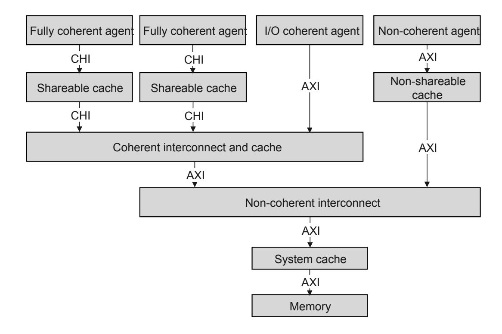

<span id="page-131-2"></span>Figure A8.1: Example system topology showing possible cache locations and type

# <span id="page-132-0"></span>**A8.2 Cache line size**

A cache line is defined as a cached copy of sequentially byte addressed memory locations, with the first address aligned to the total size of the cache line. A system which employs cache sharing must have a common cache line size. Some transactions only operate on entire cache lines and must be cache line sized.

The cache line size is fixed at design time and defined using the Cache\_Line\_Size property.

| Name            | Values                                | Default | Description               |
|-----------------|---------------------------------------|---------|---------------------------|
| Cache_Line_Size | 16, 32, 64, 128, 256, 512, 1024, 2048 | 64      | Cache line size in bytes. |

For any interfaces carrying cache line sized transactions, the data width must be wide enough to transport a cache line using 16 transfers or fewer.

To be compatible with AMBA CHI, cache line size must be 64 bytes.

<span id="page-132-1"></span>Opcodes where the transaction must be cache line sized and Regular are shown in [Table](#page-132-1) [A8.2.](#page-132-1) For more information on Regular transactions, see [A3.1.8](#page-51-0) *[Regular transactions](#page-51-0)*.

**Table A8.2: Opcodes which must be cache line sized and Regular**

| Transactions on the read channels | Transactions on the write channels |  |
|-----------------------------------|------------------------------------|--|
| ReadShared                        | WriteNoSnoopFull                   |  |
| ReadClean                         | WriteUniqueFull                    |  |
| CleanShared                       | WriteBackFull                      |  |
| CleanInvalid                      | WriteEvictFull                     |  |
| MakeInvalid                       | CMO                                |  |
| CleanSharedPersist                | WriteZero                          |  |
| ReadNoSnoop with MTE Fetch        | WriteUniqueFullStash               |  |
|                                   | WriteFullCMO                       |  |
|                                   | StashOnceShared                    |  |
|                                   | StashOnceUnique                    |  |
|                                   | Prefetch                           |  |
|                                   | InvalidateHint                     |  |

Cache line sized transactions have the following constraints:

- Size x Length must be equal to the cache line size.
- Transactions with write data must have all byte strobes asserted within the cache line container.

# <span id="page-133-0"></span>**A8.3 Cache coherency and Domains**

When multiple Managers share data, writes from those Managers must be coherent. This means writes to the same address location by two Managers are observable in the same order by all participating Managers.

If a system contains caches, measures must be taken to ensure that cached values do not become stale.

In AMBA, this can be achieved in three ways:

- Using Non-cacheable transactions.
- Software coherency with manual cache maintenance.
- Hardware coherency with snooping and automatic cache maintenance.

AXI supports these by attributing a Domain to every address location, this can be System, Non-shareable or Shareable. There must be a consistent definition of:

- Which address locations are in each Domain.
- Which Domain an address location is attributed.

## <span id="page-133-1"></span>**A8.3.1 System Domain**

Address locations in the System Domain must be visible to all Managers that are able to access them. This is achieved by ensuring that all System Domain requests are Non-cacheable and therefore not stored in any local caches. Using the System Domain makes coherency simple but is generally not high performance.

Requests to Device type memory are required to use the System Domain.

## <span id="page-133-2"></span>**A8.3.2 Non-shareable Domain**

Address locations in the Non-shareable Domain are not required to be visible to other Managers. Transactions to Non-shareable locations do not need to trigger hardware coherency mechanisms to ensure visibility.

If Non-shareable data is to be shared between Managers, then transactions known as Cache Maintenance Operations (CMOs) must be issued to clean and invalidate the data from any local caches before it is read. See Chapter [A9](#page-152-0) *[Cache maintenance](#page-152-0)* for more details.

Data sharing using CMOs is known as software coherency and can be an efficient approach if the sharing behavior between Managers is known. For example, if there are predictable data sets that are written by one agent then read by another. The main disadvantage of this approach is that it relies on software being correct. Coherency bugs in software can be easy to introduce and difficult to debug.

To avoid a loss of coherency, there are some rules when caching Non-shareable lines:

- The eviction and write-back of Clean Non-shareable data is not permitted. This is to avoid a Clean line from overwriting a Dirty line in a downstream cache that was written by another Manager.
- The passing of Dirty data on a read of a Non-shareable line from one cache to another is not permitted. The line must be passed as Clean and responsibility for writing back the line remains with the downstream cache. This avoids a subsequent write-back of the line from overwriting a later update from another Manager.

### <span id="page-133-3"></span>**A8.3.3 Shareable Domain**

Address locations in the Shareable Domain must be visible to all other Managers that also have those locations marked as Shareable. Requests with the Shareable attribute must snoop local caches and lookup in caches that might contain Shareable data from other Managers.

There are two reasons why an AXI component may need to support the Shareable Domain: to enable I/O coherency and to support the movement of Shareable cache lines between upstream and downstream caches. These cases are covered in [A8.4](#page-136-0) *[I/O coherency](#page-136-0)* and [A8.5](#page-137-0) *[Caching Shareable lines](#page-137-0)*.

Requests in the Shareable domain can use a Burst type of INCR or WRAP, not FIXED.

### <span id="page-134-0"></span>**A8.3.4 Domain signaling**

Domain signaling is optional, if an interface does not have Domain signaling then Non-cacheable requests are assumed to be in the System Domain and Cacheable requests are assumed to be in the Non-shareable Domain.

If a component is required to support the Shareable Domain, it must include the Domain signaling.

The Shareable\_Transactions property is used to describe whether an interface supports the Shareable Domain and therefore has Domain signaling.

**Table A8.3: Shareable\_Transactions property**

| Shareable_Transactions | Default | Description                                                                      |
|------------------------|---------|----------------------------------------------------------------------------------|
| True                   |         | Shareable domain supported, AxDOMAIN<br>signals are on the interface.            |
| False                  | Y       | Shareable domain not supported,<br>AxDOMAIN signals are not on the<br>interface. |

When Shareable\_Transactions is True, the following signals are included on the interface.

**Table A8.4: AxDOMAIN signals**

<span id="page-134-3"></span><span id="page-134-2"></span>

| Name                  | Width | Default | Description                       |
|-----------------------|-------|---------|-----------------------------------|
| AWDOMAIN,<br>ARDOMAIN | 2     | -       | Shareability domain of a request. |

<span id="page-134-1"></span>Shareable\_Transactions is encoded on the AxDOMAIN signals as shown in [Table](#page-134-1) [A8.5.](#page-134-1)

**Table A8.5: AxDOMAIN encodings**

| AxDOMAIN | Label         | Meaning              |
|----------|---------------|----------------------|
| 0b00     | Non-shareable | Non-shareable domain |
| 0b01     | Shareable     | Shareable domain     |
| 0b10     | Shareable     | Shareable domain     |
| 0b11     | System        | System domain        |

### If AxDOMAIN signals are not present:

- Non-cacheable requests are assumed to be in the System domain.
- Cacheable requests are assumed to be in the Shareable domain.

In previous versions of this specification, AxDOMAIN values of 0b01 and 0b10 indicated Inner Shareable and Outer Shareable respectively. In this version, it is recommended that 0b10 is used to indicate the Shareable domain.

Guidance for connecting Manager and Subordinate interfaces with different values of Shareable\_Transactions is shown in [Table](#page-135-3) [A8.6.](#page-135-3)

**Table A8.6: Shareable\_Transactions interoperability**

<span id="page-135-3"></span>

|                | Subordinate: False                               | Subordinate: True                                                                 |
|----------------|--------------------------------------------------|-----------------------------------------------------------------------------------|
| Manager: False | Compatible.                                      | Compatible if logic is added to generate default<br>AxDOMAIN values from AxCACHE. |
| Manager: True  | Compatible.<br>AxDOMAIN outputs are unconnected. | Compatible.                                                                       |

### <span id="page-135-0"></span>**A8.3.5 Domain consistency**

An address location can be marked as Shareable for one agent and Non-shareable for another. To avoid a loss of coherency, data cached as Non-shareable must be made visible using CMOs before being accessed by an agent that has the location marked as Shareable.

### <span id="page-135-1"></span>**A8.3.6 Domains and memory types**

The combination of Domain and memory type determines which caches must be accessed to complete the transactions.

Legal combinations of memory type and Domain are shown in [Table](#page-135-2) [A8.7.](#page-135-2) The table also indicates which caches must be accessed when processing a request.

- Peer caches are those which are accessed using snoop requests, this requires a coherent protocol such as AMBA CHI [\[5\]](#page-16-5).
- <span id="page-135-2"></span>• Inline caches are those which requests pass through while progressing towards memory.

**Table A8.7: Legal combinations of memory type and Domain**

| Memory type                                     | Domain               | Caches accessed        |  |
|-------------------------------------------------|----------------------|------------------------|--|
| Device<br>(AxCACHE[3:1] == 0b000)               | System               | None                   |  |
|                                                 | Non-shareable        | None                   |  |
| Normal Non-cacheable<br>(AxCACHE[3:1] == 0b001) | Shareable            | Peer caches            |  |
|                                                 | System (recommended) | None                   |  |
| Normal Cacheable<br>(AxCACHE[3:2] != 0b00)      | Non-shareable        | Inline caches          |  |
|                                                 | Shareable            | Inline and peer caches |  |

Note that Normal Non-cacheable Shareable is permitted but not expected. Some implementations might not look up in peer caches for Non-cacheable accesses.

# <span id="page-136-1"></span><span id="page-136-0"></span>**A8.4 I/O coherency**

An I/O coherent Manager can read and write data in the Sharable Domain through use of a coherent interconnect but it cannot be snooped, so it must not cache Shareable data. AXI does not support data snooping, so the coherent interconnect will typically be based on the AMBA CHI protocol [\[5\]](#page-16-5) with AXI interfaces for connecting I/O coherent Managers.

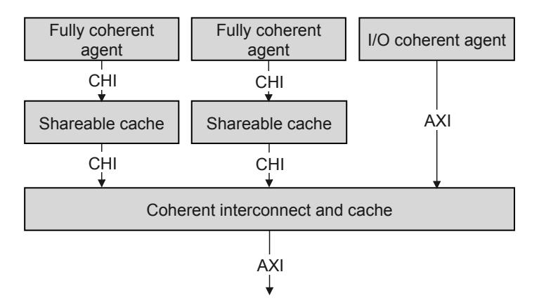

**Figure A8.2: Example use of I/O coherency**

When an I/O coherent Manager issues a Shareable read request, the coherent interconnect tries to find the data by snooping appropriate coherent caches and checking Shareable lines within its caches. If the data cannot be found, a request is sent downstream towards memory. When the data is returned, it must not be cached by the I/O coherent Manager because the data can become stale.

When an I/O coherent Manager issues a Shareable write request (WriteUniquePtl or WriteUniqueFull), the coherent interconnect issues clean and invalidation requests to the coherent caches to ensure that there are no local copies. It then writes the data into a cache or towards memory. For a partial cache line write, any Dirty data found in coherent caches can be merged with the write.

<span id="page-136-2"></span>The Shareable\_Cache\_Support property must be False for an I/O coherent interface.

# <span id="page-137-2"></span><span id="page-137-0"></span>**A8.5 Caching Shareable lines**

An AXI-based cache that is downstream of a coherent interconnect has the option to store Shareable lines in addition to Non-shareable cache lines. This has the advantages that:

- Clean evictions of Shareable lines can be cached but must not be written back to memory.
- Dirty data from Shareable lines can be passed to upstream Shareable caches.

To enable this, additional Opcodes and responses are required. The cache must also track which lines are Shareable if it also stores lines from the Non-shareable Domain. In this case, a valid cache line can have one of four states:

- Clean
- Dirty
- Shareable Clean
- Shareable Dirty

The rules regarding which Opcodes can hit which cache lines are shown in [Table](#page-137-1) [A8.8.](#page-137-1)

**Table A8.8: Rules for caching Shareable lines**

<span id="page-137-1"></span>

|                             |               | Cache state      |                  |                    |                    |
|-----------------------------|---------------|------------------|------------------|--------------------|--------------------|
| Opcode                      | Domain        | Clean            | Dirty            | Shareable<br>Clean | Shareable<br>Dirty |
| Read*                       | Non-shareable | Permitted to hit | Permitted to hit | Must not hit       | Permitted to hit1  |
|                             | Shareable     | Permitted to hit | Must hit         | Permitted to hit   | Must hit2          |
| Write*                      | Non-shareable | Must hit         | Must hit         | Must not hit       | Permitted to hit1  |
|                             | Shareable     | Must hit         | Must hit         | Must hit           | Must hit           |
| CleanShared*                | Non-shareable | Permitted to hit | Must hit         | Permitted to hit   | Permitted to hit3  |
|                             | Shareable     | Permitted to hit | Must hit         | Permitted to hit   | Must hit           |
| CleanInvalid* / MakeInvalid | Non-shareable | Must hit         | Must hit         | Permitted to hit3  | Permitted to hit3  |
|                             | Shareable     | Must hit         | Must hit         | Must hit           | Must hit           |
| InvalidateHint / Prefetch   | Non-shareable | Permitted to hit | Permitted to hit | Permitted to hit   | Permitted to hit   |
|                             | Shareable     | Permitted to hit | Permitted to hit | Permitted to hit   | Permitted to hit   |
| StashOnce*                  | Non-shareable | Permitted to hit | Permitted to hit | Must not hit       | Permitted to hit   |
|                             | Shareable     | Permitted to hit | Permitted to hit | Permitted to hit   | Permitted to hit   |

<sup>∗</sup> Includes all variants of the Opcode.

If Outer Cacheable mode is used by attached CPUs, transactions marked in the page tables as Inner Non-cacheable, Outer Cacheable will not use shareable read and write transactions and it is not expected that cache lines will be allocated as Shareable.

<sup>1</sup> The line must no longer be marked as Shareable.

<sup>2</sup> Dirty data can be provided upstream if the request was ReadShared.

<sup>3</sup> *Must hit* if RME\_Support is True.

### <span id="page-138-0"></span>**A8.5.1 Opcodes to support reading and writing full cache lines**

The following Opcodes can be used to read and write full cache lines of data.

Transactions using these Opcodes must be Modifiable, cache line sized and Regular. See [A4.2.2](#page-68-3) *[Modifiable](#page-68-3) [transactions](#page-68-3)*, [A8.2](#page-132-0) *[Cache line size](#page-132-0)* and [A3.1.8](#page-51-0) *[Regular transactions](#page-51-0)*.

<span id="page-138-6"></span>For write transactions all write strobes must be asserted.

#### *ReadClean*

A full cache line read from a Shareable location, where the data is likely to be allocated in an upstream cache. The read data must be Clean.

This Opcode can be used if the Shareable\_Cache\_Support and Shareable\_Transactions properties are both True.

#### <span id="page-138-1"></span>*ReadShared*

A full cache line read from a Shareable location, where the data is likely to be allocated in an upstream cache. The read data can be Clean or Dirty. If the data is Dirty, the line must be allocated upstream, and the response for all transfers of read data must be OKAYDIRTY instead of OKAY.

<span id="page-138-2"></span>This Opcode can be used if the Shareable\_Cache\_Support and Shareable\_Transactions properties are both True.

#### *WriteNoSnoopFull*

A Non-shareable write of a full cache line where the data is Dirty and not allocated upstream.

An upstream cache can issue a WriteNoSnoopFull transaction when it evicts a Non-shareable Dirty cache line or when streaming write data which is cache line sized. If a downstream cache receives a WriteNoSnoopFull request, it can allocate the line knowing that the line is not allocated upstream.

This Opcode can be used if the WriteNoSnoopFull\_Transaction or Shareable\_Cache\_Support property is True.

**Table A8.9: WriteNoSnoopFull\_Transaction property**

| WriteNoSnoopFull_Transaction | Default | Description                                                                  |
|------------------------------|---------|------------------------------------------------------------------------------|
| True                         |         | WriteNoSnoopFull is supported.                                               |
| False                        | Y       | WriteNoSnoopFull is not supported unless<br>Shareable_Cache_Support is True. |

#### <span id="page-138-3"></span>*WriteUniqueFull*

A Shareable write of a full cache line where the data is Dirty but was not allocated upstream. This transaction is used by an I/O coherent Manager to write to a cache line that might be stored in a cache within the coherent domain. A system cache can allocate the line as Shareable Dirty.

<span id="page-138-4"></span>This Opcode can be used if the Shareable\_Transactions property is True.

## *WriteBackFull*

A WriteBackFull transaction can be used when a Shareable Dirty line is evicted from a coherent cache. This transaction enables a system cache to allocate the line as Shareable Dirty.

<span id="page-138-5"></span>This Opcode can be used if the Shareable\_Cache\_Support and Shareable\_Transactions properties are both True.

#### *WriteEvictFull*

A WriteEvictFull transaction can be used when a Shareable Clean line is evicted from a coherent cache. This transaction enables a system cache to allocate the line as Shareable Clean.

A Shareable Clean line must not be exposed to any agents outside of the Shareable Domain because the line might become stale within caches in the Shareable Domain. For the same reason, data from a WriteEvictFull must not update memory.

This Opcode can be used if the Shareable\_Cache\_Support and Shareable\_Transactions properties are both True.

### <span id="page-139-0"></span>**A8.5.2 Configuration of Shareable cache support**

The Shareable\_Cache\_Support property is used to indicate whether an interface supports the additional transaction Opcodes required for the storage of coherent cache lines.

**Table A8.10: Shareable\_Cache\_Support property**

| Shareable_Cache_Support | Default | Description                                                        |
|-------------------------|---------|--------------------------------------------------------------------|
| True                    |         | Additional Opcodes for Shareable cache<br>lines are supported.     |
| False                   | Y       | Additional Opcodes for Shareable cache<br>lines are not supported. |

<span id="page-139-1"></span>The compatibility between Manager and Subordinate interfaces according to the values of the Shareable\_Cache\_Support property is shown in Table [A8.11.](#page-139-1)

**Table A8.11: Shareable\_Cache\_Support compatibility**

| Shareable_Cache_Support | Subordinate: False                                 | Subordinate: True |
|-------------------------|----------------------------------------------------|-------------------|
| Manager: False          | Compatible.                                        | Compatible.       |
| Manager: True           | Incompatible.<br>Alternative Opcodes must be used. | Compatible.       |

Shareable requests can also be controlled at reset-time using an optional Manager input signal, BROADCASTSHAREABLE.

**Table A8.12: BROADCASTSHAREABLE signal**

<span id="page-139-2"></span>

| Name               | Width | Default | Description                                                                                        |
|--------------------|-------|---------|----------------------------------------------------------------------------------------------------|
| BROADCASTSHAREABLE | 1     | 0b1     | Manager tie-off input, used to control the issuing of<br>Shareable transactions from an interface. |

When BROADCASTSHAREABLE is present and deasserted, all transactions are converted to Non-shareable equivalents before they are sent, as shown in Table [A8.13.](#page-140-0)

**Table A8.13: Opcode alternatives**

<span id="page-140-1"></span><span id="page-140-0"></span>

| Opcode                      | BROADCASTSHAREABLE is LOW        |
|-----------------------------|----------------------------------|
| WriteUniquePtl              | WriteNoSnoop                     |
| WriteUniqueFull             | WriteNoSnoop or WriteNoSnoopFull |
| WriteBackFull               | WriteNoSnoop or WriteNoSnoopFull |
| WriteEvictFull              | - (request must be dropped)      |
| CMO (Shareable)             | CMO (Non-shareable)              |
| WriteUniquePtlStash         | WriteNoSnoop                     |
| WriteUniqueFullStash        | WriteNoSnoop or WriteNoSnoopFull |
| WritePtlCMO (Shareable)     | WritePtlCMO (Non-shareable)      |
| StashOnceShared (Shareable) | StashOnceShared (Non-shareable)  |
| StashOnceUnique (Shareable) | StashOnceUnique (Non-shareable)  |
| Prefetch (Shareable)        | Prefetch (Non-shareable)         |
| ReadOnce                    | ReadNoSnoop                      |
| ReadShared                  | ReadNoSnoop                      |
| ReadClean                   | ReadNoSnoop                      |
| ReadOnceCleanInvalid        | ReadNoSnoop                      |
| ReadOnceMakeInvalid         | ReadNoSnoop                      |

# <span id="page-141-2"></span><span id="page-141-0"></span>**A8.6 Prefetch transaction**

When a Manager has indication that it might need data for an address but does not want to commit to reading it yet, it can send a Prefetch request to the system that it might be advantageous to prepare the location for reading. This request to the system can cause the allocation of data into a downstream cache or from off-chip memory before the Manager makes the actual read request.

The Prefetch request is not required to be ordered with respect to other requests such as CMOs, therefore a Prefetch must not be used to signal that a line can be fetched into a managed or visible cache.

The PREFETCHED response to a read request indicates that the transaction has hit upon prefetched data. The Manager can use this as part of a heuristic to determine if it continues issuing Prefetch requests.

In AMBA CHI [\[5\]](#page-16-5), the equivalent of a Prefetch request is PrefetchTgt which can be issued alongside a coherent request to the same address. The PrefetchTgt can bypass any coherency checks and cause the memory controller to prefetch the data in case the coherent request does not find the data in any shared caches. If the memory controller uses an AXI interface, the CHI PrefetchTgt request can be converted to an AXI Prefetch.

### <span id="page-141-1"></span>**A8.6.1 Rules for the prefetch transaction**

A Prefetch is a data-less transaction, the rules are:

- The Prefetch transaction consists of a request on the AW channel and a single response transfer on the B channel, there is no data transfer.
- A Prefetch request is signaled using the AWSNOOP Opcode of 0b01111.
- A Prefetch request must be cache line sized with the following constraints:
  - The transaction is Regular, see [A3.1.8](#page-51-0) *[Regular transactions](#page-51-0)*.
  - AWCACHE[1] is asserted, that is a Normal transaction.
  - AWDOMAIN is Non-shareable or Shareable.
  - AWLOCK is deasserted, not exclusive access.
- The ID value must be unique-in-flight, which means:
  - A Prefetch request can only be issued if there are no outstanding write transactions using the same AWID.
  - The Manager must not issue a request on the write channel with the same AWID as an outstanding Prefetch request.
  - If present on the interface, AWIDUNQ must be asserted for Prefetch transactions.
- The Manager may or may not follow a Prefetch request with a non-Prefetch request to the same address.
- A Subordinate interface at any level can chose to propagate or respond to a Prefetch request.
- It is permitted to respond to a Prefetch request with OKAY, DECERR, SLVERR, or TRANSFAULT (only if AWMMUFLOW is PRI).
- An OKAY response can be sent irrespective of whether the Subordinate acts on the Prefetch request.

<span id="page-142-1"></span>The Prefetch\_Transaction property is used to indicate whether a component supports the Prefetch Opcode as shown in Table [A8.14.](#page-142-1)

**Table A8.14: Prefetch\_Transaction property**

| Prefetch_Transaction | Default | Description                |
|----------------------|---------|----------------------------|
| True                 |         | Prefetch is supported.     |
| False                | Y       | Prefetch is not supported. |

## <span id="page-142-0"></span>**A8.6.2 Response for prefetched data**

If a read request hits on data which has been prepared due to a previous Prefetch request, the Subordinate may return a PREFETCHED response. This can be used by the Manager to determine the success rate of its Prefetch requests.

The PREFETCHED response has the following rules and recommendations:

- The PREFETCHED response is signaled using RRESP encoding of 0b100.
- When Prefetch\_Transaction is True, RRESP\_WIDTH must be 3 to enable the signaling of the PREFETCHED response.
- PREFETCHED indicates that read data is valid and has come from a prefetched source.
- PREFETCHED can be used for a response to the following Opcodes:
  - ReadNoSnoop
  - ReadOnce
  - ReadClean
  - ReadShared
  - ReadOnceCleanInvalid
  - ReadOnceMakeInvalid
- A PREFETCHED response cannot be sent for an exclusive read.
- It is recommended that within a cache line, the PREFETCHED response is used for all data transfers or no data transfers. If a transaction spans cache lines, there can be a mixture of PREFETCHED and other responses for each cache line accessed.
- A PREFETCHED response can only be sent if the Prefetch\_Transaction property is True for the interface.
- A PREFETCHED response can be sent to a Manager even if the Manager has not sent a Prefetch request to that location. For example, if a Manager happens to read data which was prefetched by another Manager.

# <span id="page-143-2"></span><span id="page-143-0"></span>**A8.7 Cache Stashing**

Cache stashing enables one component to indicate that data should be placed in another cache in the system. This technique can be used to ensure that data is located close to its point of use, potentially improving the performance of the overall system. The AXI protocol supports cache stashing requests with or without a stash target identifier.

Cache stashing is a hint. A cache, or system component can choose to ignore the stash part of a request.

I/O coherent AXI Managers can request that data is stashed in fully coherent Managers with AMBA CHI interfaces [\[5\]](#page-16-5).

### <span id="page-143-1"></span>**A8.7.1 Stash transaction Opcodes**

There are four Opcodes that can be used for cache stashing.

#### *WriteUniquePtlStash*

Write to a Shareable location with an indication that the data should be allocated into a cache. Any number of bytes within the cache line can be written, including all bytes or zero bytes.

#### *WriteUniqueFullStash*

Write a full cache line of data to a Shareable location with an indication that the data should be allocated into a cache. The transaction must be cache line sized and Regular. All write strobes must be asserted.

### *StashOnceShared*

A data-less transaction which indicates that a cache line should be fetched into a particular cache. Other copies of the line are not required to be invalidated.

#### *StashOnceUnique*

A data-less transaction which indicates that a cache line should be fetched into a particular cache. It is recommended that all other copies are invalidated.

A StashOnceUnique transaction can cause the invalidation of a cached copy of a cache line and care must be taken to ensure that such transactions do not interfere with exclusive access sequences.

For an interface that supports the Untranslated Transactions feature, an extra stash transaction is supported. The StashTranslation transaction is used to indicate to a *System Memory Management Unit* (SMMU) that a translation should be obtained for the address that is supplied with the StashTranslation transaction. See [A13.9](#page-218-0) *[StashTranslation Opcode](#page-218-0)*.

### <span id="page-144-0"></span>**A8.7.2 Stash transaction signaling**

Stash requests are signaled on the write request channel and have a single response transfer on the write response channel. Write with stash transactions also include write data.

<span id="page-144-2"></span>A stash request has constraints on Domain, Size, and Length shown in Table [A8.15.](#page-144-2) Cache stash transactions are not permitted to cross a cache line boundary.

**Table A8.15: Domain, Size, and Length constraints for stash requests**

| Opcode               | AWSNOOP | Domain                   | Size, Length                 |
|----------------------|---------|--------------------------|------------------------------|
| WriteUniquePtlStash  | 0b1000  | Shareable                | Cache size or smaller        |
| WriteUniqueFullStash | 0b1001  | Shareable                | Cache line sized and Regular |
| StashOnceShared      | 0b1100  | Non-shareable, Shareable | Cache line sized and Regular |
| StashOnceUnique      | 0b1101  | Non-shareable, Shareable | Cache line sized and Regular |

The following constraints also apply to all stash request Opcodes:

- AWCACHE[1] is 0b1 (Modifiable)
- AWLOCK is 0b0 (not exclusive access)
- AWTAGOP is 0b00 (Invalid)
- AWATOP is 0b000000 (Non-atomic operation)

### <span id="page-144-1"></span>**A8.7.3 Stash request Domain**

The Domain of a stash request determines which caches are checked for the cache line and how the line should be fetched and stored.

A stash request to a Shareable location implies that the line can be stored in a peer or inline cache. If the stash request causes a cache to issue a downstream request, it should be Shareable if possible. Writes with stash must always be to a Shareable location.

A stash request to a Non-shareable location implies that the line can be stored in an inline cache. If the stash request causes a cache to issue a downstream request, it must be Non-shareable. StashOnceShared and StashOnceUnique Opcodes can be to Shareable or Non-shareable locations.

### <span id="page-145-0"></span>**A8.7.4 Stash target identifiers**

A stash request can optionally include target identifiers to indicate a specific cache that is preferred for the data to be stored. This specification does not define the precise details of this identification mechanism. It is expected that any agent that is performing a stash operation knows the identifier to use for a given stash transaction.

This specification defines two levels of identification:

- A Node ID (NID) to identify the physical interface that the cache stash should be sent to.
- A Logical Processor ID (LPID) to identify a functional unit that is associated with that physical interface.

For example, a stash transaction can specify a processor cluster interface and specific cache within that cluster.

The signals used to indicate stash targets are shown in Table [A8.16.](#page-145-1)

**Table A8.16: Signals used to indicate stash targets**

<span id="page-145-3"></span><span id="page-145-2"></span><span id="page-145-1"></span>

| Name          | Width | Default | Description                                                              |
|---------------|-------|---------|--------------------------------------------------------------------------|
| AWSTASHNID    | 11    | 0x000   | Node Identifier of the target for a stash operation.                     |
| AWSTASHNIDEN  | 1     | 0b0     | HIGH to indicate that the AWSTASHNID signal is valid.                    |
| AWSTASHLPID   | 5     | 0x00    | Logical Processor Identifier within the target for a stash<br>operation. |
| AWSTASHLPIDEN | 1     | 0b0     | HIGH to indicate that the AWSTASHLPID signal is valid.                   |

<span id="page-145-5"></span><span id="page-145-4"></span>The NID and LPID signals are optional on an interface, controlled using the STASHNID\_Present and STASHLPID\_Present properties, respectively.

**Table A8.17: STASHNID\_Present property**

| STASHNID_Present | Default | Description                                  |  |
|------------------|---------|----------------------------------------------|--|
| True             |         | AWSTASHNID and AWSTASHNIDEN are present.     |  |
| False            | Y       | AWSTASHNID and AWSTASHNIDEN are not present. |  |

**Table A8.18: STASHLPID\_Present property**

| STASHLPID_Present | Default | Description                                    |  |
|-------------------|---------|------------------------------------------------|--|
| True              |         | AWSTASHLPID and AWSTASHLPIDEN are present.     |  |
| False             | Y       | AWSTASHLPID and AWSTASHLPIDEN are not present. |  |

Each stash target identifier has an enable signal so NID and LPID can be controlled independently.

- For stash transactions, any combination of target enables is permitted.
- For non-stash transactions, AWSTASHLPIDEN and AWSTASHNIDEN must be LOW.
- When AWSTASHNIDEN is LOW, AWSTASHNID is invalid and must be zero.
- When AWSTASHLPIDEN is LOW, AWSTASHLPID is invalid and must be zero.
- It is permitted, but not recommended to send a stash transaction with a stash target that indicates a component that does not support cache stashing. The indication of a stash target within a stash transaction does not affect which components are permitted to access and cache a given cache line.

For WriteUniquePtlStash and WriteUniqueFullStash requests without a target, the following is recommended:

- If the interconnect can determine that the line is held in a single cache before the write occurs, then stash the cache line back to that cache.
- If the cache line is not held in any cache before the write occurs, then stash the cache line in a shared system cache.

For StashOnceShared and StashOnceUnique requests without a target:

- If the interconnect can determine that the cache line is not in any cache, then it is recommended to stash the cache line in a shared system cache.
- A component can use this to prefetch a cache line to a downstream cache for its own use.

## <span id="page-146-0"></span>**A8.7.5 Transaction ID for stash transactions**

There are no constraints on the use of AXI ID values for WriteUniquePtlStash and WriteUniqueFullStash transactions.

StashOnceShared and StashOnceUnique can be referred to as StashOnce transactions.

StashOnce transactions must not use the same AXI ID values that are used by non-StashOnce transactions on the write channels that are outstanding at the same time. This rule ensures that there are no ordering constraints between StashOnce transactions and other transactions. Therefore, a component that discards a StashOnce request can give an immediate response without checking ID ordering requirements.

StashOnce transactions and non-StashOnce transactions are permitted to use the same AXI ID value, provided that the same ID value is not used by both a StashOnce transaction and a non-StashOnce at the same time.

There can be multiple outstanding StashOnce transactions with the same ID.

There can be multiple outstanding non-StashOnce transactions with the same ID.

The use of a unique ID value for a StashOnce transaction ensures that these transactions can be given an immediate response if they are not supported.

### <span id="page-147-1"></span><span id="page-147-0"></span>**A8.7.6 Support for stash transactions**

The Cache\_Stash\_Transactions property is used to indicate whether an interface supports cache stashing, as shown in Table [A8.19.](#page-147-1)

**Table A8.19: Cache\_Stash\_Transactions property**

| Cache_Stash_Transactions | Default | Description                                                                                                                                |
|--------------------------|---------|--------------------------------------------------------------------------------------------------------------------------------------------|
| True                     |         | All cache stashing Opcodes are supported. There may or<br>may not be a stash target.                                                       |
| Basic                    |         | Only the StashOnceShared Opcode is supported. A stash<br>target is not permitted, STASHLPID_Present and<br>STASHNID_Present must be False. |
| False                    | Y       | Cache stashing is not supported and associated signals are<br>omitted.                                                                     |

When Cache\_Stash\_Transactions is False, STASHNID\_Present and STASHLPID\_Present must both be False.

<span id="page-147-2"></span>The compatibility between Manager and Subordinate interfaces according to the values of the Cache\_Stash\_Transactions property is shown in Table [A8.20.](#page-147-2)

**Table A8.20: Stash transactions compatibility**

| Cache_Stash_Transactions | Subordinate: False                     | Subordinate: Basic                     | Subordinate: True |
|--------------------------|----------------------------------------|----------------------------------------|-------------------|
| Manager: False           | Compatible.                            | Compatible.                            | Compatible.       |
| Manager: Basic           | Incompatible, action<br>must be taken. | Compatible.                            | Compatible.       |
| Manager: True            | Incompatible, action<br>must be taken. | Incompatible, action<br>must be taken. | Compatible.       |

<span id="page-147-3"></span>If a Manager issues stash requests to a target that does not support them, action can be taken in the Manager or interconnect as shown in Table [A8.21.](#page-147-3)

**Table A8.21: Action needed if the target does not support stash transactions**

| Stash transaction    | Action                                           |
|----------------------|--------------------------------------------------|
| WriteUniquePtlStash  | Convert to WriteUniquePtl.                       |
| WriteUniqueFullStash | Convert to WriteUniqueFull.                      |
| StashOnceShared      | Do not propagate and give an immediate response. |
| StashOnceUnique      | Do not propagate and give an immediate response. |

# <span id="page-148-3"></span><span id="page-148-0"></span>**A8.8 Deallocating read transactions**

Deallocating read transactions can be used when a Manager requires data which is not likely to be used again by any Manager. A cache can use this as a hint to evict the line and make the resource available for other data.

The DeAllocation\_Transactions property is used to indicate whether a component supports deallocating transactions as shown in Table [A8.22.](#page-148-4)

<span id="page-148-4"></span>Interoperability between a component that issues deallocating transactions and a component that does not support them can be performed by converting the Opcode to ReadOnce.

**Table A8.22: DeAllocation\_Transactions property**

| DeAllocation_Transactions | Default | Description                                  |
|---------------------------|---------|----------------------------------------------|
| True                      |         | Deallocating transactions are supported.     |
| False                     | Y       | Deallocating transactions are not supported. |

### <span id="page-148-1"></span>**A8.8.1 Deallocating read Opcodes**

This specification defines two deallocating transaction Opcodes on the read request channel:

#### *ReadOnceCleanInvalid (ROCI)*

This request reads a snapshot of the current value of the cache line. It is recommended, but not required that any cached copy of the cache line is deallocated. If a Dirty copy of the cache line exists, and the cache line is deallocated, then the Dirty copy must be written back to main memory.

ReadOnceCleanInvalid is signaled using an ARSNOOP value of 0b0100.

#### *ReadOnceMakeInvalid (ROMI)*

This request reads a snapshot of the current value of the cache line. It is recommended, but not required that any cached copy of the cache line is deallocated. It is permitted, but not required that a Dirty copy of the cache line is discarded. The Dirty copy of the cache line does not need to be written back to main memory.

ReadOnceMakeInvalid is signaled using an ARSNOOP value of 0b0101.

### <span id="page-148-2"></span>**A8.8.2 Rules and recommendations**

Deallocating transactions are only permitted to access one cache line at a time and are not permitted to cross a cache line boundary. Size must be cache line sized or smaller.

A ROMI request to part of a cache line can result in the invalidation of the entire cache line. Some implementations might not support the deallocation behavior for transactions that are less than a cache line and instead convert the transaction to ReadOnce in such cases.

ROCI and ROMI are only supported in the Shareable Domain, so the Shareable\_Transactions property must be True if DeAllocation\_Transactions is True.

For a ROMI transaction, it is required that the invalidation of the cache line is committed before the return of the first item of read data for the transaction. The invalidation of the cache line is not required to have completed at this point. However, it must be ensured that any later write transaction from any agent that starts after this point, is guaranteed not to be invalidated by this transaction.

The following considerations apply to the use of deallocating transactions:

• Caution is needed when deallocating transactions are issued to the same cache line that other agents are using for exclusive accesses. This is because the deallocation can cause an exclusive sequence to fail.

#### *Chapter A8. Caches*

#### *A8.8. Deallocating read transactions*

- Apart from the interaction with exclusive accesses, the ROCI transaction only provides a hint for deallocation of a cache line and has no other impact on the correctness of a system.
- The use of the ROMI transaction can cause the loss of a Dirty cache line. The use of this transaction must be strictly limited to scenarios when it is known that it is safe to do so.
- Deallocating transactions do not guarantee that a cache line will be cleaned or invalidated, so cannot be used to ensure that data is visible to all observers.

# <span id="page-150-2"></span><span id="page-150-0"></span>**A8.9 Invalidate hint**

The InvalidateHint transaction is a data-less deallocation hint. It can be used when a Manager has finished working with a data set and that data might be allocated in a downstream cache. An InvalidateHint request informs the cache that the line is no longer required and can be invalidated. A write-back of the line is permitted but not required.

InvalidateHint is not required to be executed for functional correctness, so can be terminated at any point in the system by responding with BRESP of OKAY.

Care is needed when using an InvalidateHint transaction to avoid exposure of previously overwritten values. This can be achieved either by:

- Ensuring that a clean operation following a scrubbing write ensures that the write has been propagated sufficiently far that it is not removed by the Invalidate Hint transaction.
- Ensuring the use of the InvalidateHint transaction is limited to address ranges that will not contain sensitive information.

## <span id="page-150-1"></span>**A8.9.1 Invalidate Hint signaling**

InvalidateHint is a data-less transaction using AW and B channels.

The following constraints apply to an InvalidateHint request:

- AWSNOOP is 0b10010.
  - AWSNOOP must be 5b wide if the InvalidateHint\_Transaction property is True.
- AWDOMAIN can be Non-shareable or Shareable.
- AWBURST is INCR.
- AWSIZE and AWLEN must be cache line sized and Regular.
- AWCACHE is Normal Cacheable.
- AWID is unique-in-flight, which means:
  - An InvalidateHint request can only be issued if there are no outstanding transactions on the write channels using the same ID value.
  - A Manager must not issue a request on the write channels with the same ID as an outstanding InvalidateHint transaction.
  - If present, AWIDUNQ must be asserted for an InvalidateHint request.
- AWLOCK is deasserted, not an exclusive access.
- AWTAGOP is Invalid.
- AWATOP is Non-atomic operation.

### <span id="page-151-1"></span><span id="page-151-0"></span>**A8.9.2 Invalidate Hint support**

The InvalidateHint\_Transaction property is used to indicate whether an interface supports the InvalidateHint transaction, as shown in Table [A8.23.](#page-151-1)

**Table A8.23: InvalidateHint\_Transaction property**

| InvalidateHint_Transaction | Default | Description                      |
|----------------------------|---------|----------------------------------|
| True                       |         | InvalidateHint is supported.     |
| False                      | Y       | InvalidateHint is not supported. |

<span id="page-151-2"></span>The compatibility between Manager and Subordinate interfaces according to the values of the InvalidateHint\_Transaction property is shown in Table [A8.24.](#page-151-2)

**Table A8.24: InvalidateHint\_Transaction compatibility**

| InvalidateHint_Transaction | Subordinate: False                                                                                            | Subordinate: True |
|----------------------------|---------------------------------------------------------------------------------------------------------------|-------------------|
| Manager: False             | Compatible.                                                                                                   | Compatible.       |
| Manager: True              | Not compatible.<br>An adapter that responds OKAY to<br>InvalidateHint could be used to<br>make it compatible. | Compatible.       |

# <span id="page-152-0"></span>Chapter A9

# **Cache maintenance**

This chapter describes cache maintenance operations (CMOs) that assist with software cache management. It contains the following sections:

- [A9.1](#page-153-0) *[Cache Maintenance Operations](#page-153-0)*
- [A9.2](#page-154-0) *[Actions on receiving a CMO](#page-154-0)*
- [A9.3](#page-155-0) *[CMO request attributes](#page-155-0)*
- [A9.4](#page-156-0) *[CMO propagation](#page-156-0)*
- [A9.5](#page-157-0) *[CMOs on the write channels](#page-157-0)*
- [A9.6](#page-159-0) *[Write with CMO](#page-159-0)*
- [A9.7](#page-162-0) *[CMOs on the read channels](#page-162-0)*
- [A9.8](#page-163-0) *[CMOs for Persistence](#page-163-0)*
- [A9.9](#page-167-0) *[Cache maintenance and Realm Management Extension](#page-167-0)*
- [A9.10](#page-169-0) *[Cache maintenance to the Point of Physical Storage](#page-169-0)*
- [A9.11](#page-171-0) *[Processor cache maintenance instructions](#page-171-0)*

# <span id="page-153-0"></span>**A9.1 Cache Maintenance Operations**

Cache maintenance operations are requests that instruct caches to clean and invalidate cache lines. Unlike the allocation and deallocation hints, it is mandatory that a cache actions a CMO that targets a line it has cached.

CMOs can be transported on either the read or write channels.

Transporting CMOs on read channels is included in this specification to support legacy components. It is recommended that the new designs transmit CMOs on the write channels.

The specification supports the following cache maintenance operations.

#### *CleanShared (CS)*

When completed, all cached copies of the addressed line are Clean and any associated writes are observable.

#### *CleanSharedPersist (CSP)*

When completed, all cached copies of the addressed line are Clean and any associated writes are observable and have reached the Point of Persistence (PoP). See [A9.8](#page-163-0) *[CMOs for Persistence](#page-163-0)*.

### *CleanSharedDeepPersist (CSDP)*

When completed, all cached copies of the addressed line are Clean and any associated writes are observable and have reached the Point of Deep Persistence (PoDP). See [A9.8](#page-163-0) *[CMOs for Persistence](#page-163-0)*.

### *CleanInvalid (CI)*

When completed, all cached copies of the addressed line are invalidated, having been written to memory if they were Dirty. Any associated writes are observable.

### *CleanInvalidPoPA (CIPA)*

When completed, all cached copies of the addressed line are invalidated, and any Dirty cached copy is written past the Point of Physical Aliasing (PoPA). See [A9.9](#page-167-0) *[Cache maintenance and Realm Management Extension](#page-167-0)*.

### *CleanInvalidStorage (CIS)*

When completed, all cached copies of the addressed line are invalidated, and any Dirty cached copy is written past the Point of Physical Storage (PoPS). See [A9.10](#page-169-0) *[Cache maintenance to the Point of Physical Storage](#page-169-0)*.

#### *MakeInvalid (MI)*

When completed, all cached copies of the addressed line are invalidated, and any Dirty cached copy might have been discarded.

# <span id="page-154-0"></span>**A9.2 Actions on receiving a CMO**

When a component receives a CMO, it must do the following:

- 1. If the component is a cache and the CMO is cacheable, it must look up the line.
- 2. If the component is a coherent interconnect and the CMO is Shareable, a CMO snoop must be sent to any cache that might have the line:
  - Allocated, for an Invalidate CMO.
  - Dirty, for a Clean CMO.

Note that a coherent protocol such as AMBA CHI [\[5\]](#page-16-5) is required to send CMO snoop requests.

- 3. For a Clean CMO, write back any dirty data that is found in the cache or peer caches.
  - It is recommended that Write-Through No-Allocate is used for writes to memory which will be followed by a CMO to the same line. This ensures that the line will be looked up in any downstream cache but will not be allocated.
- 4. Wait for all snoops and associated writes to receive a response.
- 5. If the CMO does not need to be sent downstream, the component can issue a response to the CMO.
- <span id="page-154-1"></span>6. If the CMO does need to be sent downstream, the CMO must be sent and the response that is returned must be propagated when it is received from downstream.

# <span id="page-155-0"></span>**A9.3 CMO request attributes**

The following rules apply to CMO transactions:

- The request must be cache line sized and Regular. See [A3.1.8](#page-51-0) *[Regular transactions](#page-51-0)* for more details.
- The Domain can be Non-shareable or Shareable.
  - System Domain is not permitted, which means that CMO transactions must be Normal rather than Device.
  - If AxDOMAIN is omitted from the interface, CMO transactions are assumed to be Non-shareable.

<span id="page-155-1"></span>The AxCACHE and AxDOMAIN attributes indicate which caches must action a CMO, as shown in [Table](#page-155-1) [A9.1.](#page-155-1)

**Table A9.1: CMO applicability**

| AxCACHE       | AxDOMAIN      | CMO applies to                 |
|---------------|---------------|--------------------------------|
| Device        | System        | N/A (not legal for CMOs)       |
| Non-cacheable | Non-shareable | No caches                      |
|               | Shareable     | Peer caches                    |
| Cacheable     | Non-shareable | In-line caches                 |
|               | Shareable     | Peer caches and in-line caches |

To maintain coherency, the following recommendations apply to CMOs and non-CMOs:

- If a location is cacheable for non-CMO transactions, it should be cacheable for CMO transactions.
- If a location is in the Shareable Domain for non-CMO transactions, it should be in the Shareable Domain for CMO transactions.
- If a location is in the Non-shareable Domain for non-CMO transactions, it can be in the Non-shareable or Shareable Domain for CMO transactions.
- A Manager should not issue a read request that permits it to allocate a line, while there is an outstanding CMO to that line.
- Allocation hints, such as AxCACHE[3:2], are not required to match between CMO and non-CMO transactions to the same cache line.

# <span id="page-156-0"></span>**A9.4 CMO propagation**

The propagation of CMOs downstream of components depends on the system topology. A CMO must be propagated downstream if the CMO is cacheable and there is a downstream cache which might have allocated the line and there is an observer downstream of that cache.

Two mechanisms are defined for controlling whether CMOs are propagated from a Manager interface.

- At design-time, using the properties CMO\_On\_Write or CMO\_On\_Read.
- At run-time, using the optional BROADCASTCACHEMAINT and [BROADCASTSHAREABLE](#page-139-2) tie-off inputs to a Manager interface.

**Table A9.2: BROADCASTCACHEMAINT signal**

<span id="page-156-1"></span>

| Name                | Width | Default | Description                                                                      |
|---------------------|-------|---------|----------------------------------------------------------------------------------|
| BROADCASTCACHEMAINT | 1     | 0b1     | Manager tie-off input, used to control the issuing<br>of CMOs from an interface. |

When BROADCASTCACHEMAINT and BROADCASTSHAREABLE are both present and deasserted:

- CleanShared, CleanInvalid and MakeInvalid requests are not issued.
- WritePtlCMO with CleanShared or CleanInvalid is converted to WriteNoSnoop.
- WriteFullCMO with CleanShared or CleanInvalid is converted to WriteNoSnoop or WriteNoSnoopFull.

# <span id="page-157-1"></span><span id="page-157-0"></span>**A9.5 CMOs on the write channels**

The CMO\_On\_Write property is used to indicate whether an interface supports CMOs on the write channels.

**Table A9.3: CMO\_On\_Write property**

| CMO_On_Write | Default | Description                                                                                                                         |
|--------------|---------|-------------------------------------------------------------------------------------------------------------------------------------|
| True         |         | CMOs are supported on the AW and B channels.                                                                                        |
| False        | Y       | CMOs are not supported on the AW and B channels.<br>They are either signaled on the read channels or not used<br>by this interface. |

On the write channels, CMOs can be sent as a stand-alone operation or combined with a data write. The AWSNOOP encodings that can be used to signal CMO requests on the AW channel are shown in [Table](#page-157-2) [A9.4.](#page-157-2) For more information on the combined write with CMO operations see [A9.6](#page-159-0) *[Write with CMO](#page-159-0)*.

**Table A9.4: AWSNOOP encodings**

<span id="page-157-2"></span>

| AWSNOOP | Operation    | Enable property | Description                                                                 |
|---------|--------------|-----------------|-----------------------------------------------------------------------------|
| 0b0110  | CMO          | CMO_On_Write    | Stand-alone CMO.                                                            |
| 0b1010  | WritePtlCMO  | Write_Plus_CMO  | CMO combined with a write which is less than or<br>equal to one cache line. |
| 0b1011  | WriteFullCMO | Write_Plus_CMO  | CMO combined with a write which is exactly one<br>cache line.               |

The AWCMO signal indicates the type of CMO that is requested, it is present on the AW channel when CMO\_On\_Write is True.

**Table A9.5: AWCMO signal**

<span id="page-157-3"></span>

| Name  | Width       | Default                 | Description                                                                             |
|-------|-------------|-------------------------|-----------------------------------------------------------------------------------------|
| AWCMO | AWCMO_WIDTH | 0b000<br>(CleanInvalid) | Indicates the CMO type for write opcodes that<br>include a cache maintenance operation. |

The width of AWCMO is determined by the property AWCMO\_WIDTH.

**Table A9.6: AWCMO\_WIDTH property**

| Name        | Values  | Default | Description             |
|-------------|---------|---------|-------------------------|
| AWCMO_WIDTH | 0, 2, 3 | 0       | Width of AWCMO in bits. |

The rules for AWCMO\_WIDTH are:

- Must be 0 if CMO\_On\_Write is False. This means that AWCMO is not on the interface.
- Must be 2 if CMO\_On\_Write is True and RME\_Support is False.
- Must be 3 if CMO\_On\_Write is True and
  - RME\_Support is True or
  - Storage\_CMO is True.

The encodings for AWCMO are shown in [Table](#page-158-0) [A9.7.](#page-158-0) An encoding cannot be used if the associated enable property is False.

**Table A9.7: AWCMO encodings**

<span id="page-158-0"></span>

| AWCMO | Label                  | Enable property | Meaning                                                   |
|-------|------------------------|-----------------|-----------------------------------------------------------|
| 0b000 | CleanInvalid           | -               | Clean and invalidate                                      |
| 0b001 | CleanShared            | -               | Clean only                                                |
| 0b010 | CleanSharedPersist     | Persist_CMO     | Clean to the Point of Persistence                         |
| 0b011 | CleanSharedDeepPersist | Persist_CMO     | Clean to the Point of Deep Persistence                    |
| 0b100 | CleanInvalidPoPA       | RME_Support     | Clean and invalidate to the Point of<br>Physical Aliasing |
| 0b101 | CleanInvalidStorage    | Storage_CMO     | Clean and invalidate to the Point of<br>Physical Storage  |
| 0b110 | RESERVED               | -               | -                                                         |
| 0b111 | RESERVED               | -               | -                                                         |

Note that MakeInvalid is not supported on the write channels.

When AWSNOOP is not CMO, WritePtlCMO or WriteFullCMO, AWCMO must be 0b000.

A CMO transaction on the write channels consists of a request on the AW channel and a response on the B channel. There are no transfers on the W channel in a CMO transaction.

The write response to the CMOs CleanInvalid and CleanShared have a single response transfer on the B channel. This indicates that all caches are Clean and/or invalid within the specified Domain and any associated writes are observable.

Other CMOs are described in:

- [A9.8](#page-163-0) *[CMOs for Persistence](#page-163-0)*
- [A9.9](#page-167-0) *[Cache maintenance and Realm Management Extension](#page-167-0)*
- <span id="page-158-1"></span>• [A9.10](#page-169-0) *[Cache maintenance to the Point of Physical Storage](#page-169-0)*

# <span id="page-159-1"></span><span id="page-159-0"></span>**A9.6 Write with CMO**

Cache maintenance operations are often used with a write to memory. For example:

- A write from an I/O agent which must be made visible to observers which are downstream of caches.
- A write to persistent memory that must ensure that all copies of the line are also cleaned to the point of persistence.
- A CMO that causes a write back of dirty data, which must be followed by the CMO.

A write with CMO combines a write with a CMO to improve the efficiency of this type of scenario. It is expected that some Managers will natively generate a write with CMO. In other cases, a cache or interconnect will combine a CMO with a write before propagating them downstream.

The Write\_Plus\_CMO property is used to indicate whether a component supports combined write and CMOs on the write channels.

**Table A9.8: Write\_Plus\_CMO property**

| Write_Plus_CMO | Default | Description                                                           |
|----------------|---------|-----------------------------------------------------------------------|
| True           |         | Combined write and cache maintenance operations are<br>supported.     |
| False          | Y       | Combined write and cache maintenance operations are<br>not supported. |

If the Write\_Plus\_CMO property is True, the CMO\_On\_Write property must also be True.

When Write\_Plus\_CMO is True, the WritePtlCMO and WriteFullCMO Opcodes can be used to indicate a write with CMO.

A write with CMO can use any of the CMO types as indicated by AWCMO.

Some example uses of write with CMO are shown in the [Table](#page-159-2) [A9.9.](#page-159-2)

**Table A9.9: Examples of write with CMO transactions**

<span id="page-159-2"></span>

| Operation                                          | Primary use-case                                                                                                                               | Action                                                                                                                                                                                                                                                                      |
|----------------------------------------------------|------------------------------------------------------------------------------------------------------------------------------------------------|-----------------------------------------------------------------------------------------------------------------------------------------------------------------------------------------------------------------------------------------------------------------------------|
| Shareable WritePtlCMO<br>with CleanShared          | An I/O agent writing less than a cache<br>line to a Shareable region, where the<br>data must be visible to observers<br>downstream of a cache. | All in-line and peer caches must look up the<br>line and write back any dirty data. Data from<br>a Dirty cache line can be merged with the<br>partial write to form a WriteFullCMO with<br>CleanShared to go downstream.                                                    |
| Shareable WriteFullCMO<br>with CleadSharedPersist  | An I/O agent writing a cache line to a<br>Shareable region, where the data must<br>reach the Point of Persistence.                             | The coherent interconnect issues a<br>MakeInvalid snoop to coherent peer caches.<br>In-line caches look up the line and either<br>update or invalidate any copies. The write<br>and CleanSharedPersist must be propagated<br>if there is a Point of Persistence downstream. |
| Non-shareable<br>WriteFullCMO with<br>CleanInvalid | Issued by a cache when a CleanInvalid<br>CMO has hit a Dirty line and caused a<br>write to memory.                                             | All in-line and peer cache entries must be<br>cleaned and invalidated. The write and<br>CleanInvalid must be propagated if there are<br>observers downstream.                                                                                                               |

### <span id="page-160-0"></span>**A9.6.1 Attributes for write with CMO**

A write with CMO has the following attribute constraints:

- AWSNOOP is 0b1010 to indicate WritePtlCMO and 0b1011 to indicate WriteFullCMO.
- AWLOCK is deasserted, not an exclusive access.

A WriteFullCMO must be cache line sized and Regular, see [A8.2](#page-132-0) *[Cache line size](#page-132-0)* and [A3.1.8](#page-51-0) *[Regular transactions](#page-51-0)*.

A WritePtlCMO must be cache line sized or smaller and not cross a cache line boundary. The associated CMO applies to the whole of the addressed cache line. AWBURST must not be FIXED.

The cache maintenance part of the write with CMO is always treated as cacheable and Shareable, irrespective of AWCACHE and AWDOMAIN.

### <span id="page-160-1"></span>**A9.6.2 Propagation of write with CMO**

Propagation of a write with CMO follows the same rules as the propagation of a CMO. It is possible to split a write with CMO into separate write and CMO transactions for propagation downstream. In that case, either:

- The write is issued first, followed by the CMO on the write request channel with the same ID as the write.
- The write is issued first. When the write response is received, the CMO can be issued on the write or read channel.

When splitting a write and CMO, if AWDOMAIN is Shareable, then:

- WritePtlCMO becomes WriteUniquePtl.
- WriteFullCMO becomes WriteUniqueFull.

If AWDOMAIN is Non-shareable, then the write becomes WriteNoSnoop or WriteNoSnoopFull.

The CMO is sent as cacheable. If there is a downstream cache in the Shareable Domain, the CMO is sent as Shareable.

If there is no cache downstream that requires management by cache maintenance, the CMO part of the transaction can be discarded. If the discarded CMO is a CleanSharedPersist or CleanSharedDeepPersist, the BCOMP and BPERSIST signals must be set on the write response. See [A9.8](#page-163-0) *[CMOs for Persistence](#page-163-0)* for more details.

### <span id="page-160-2"></span>**A9.6.3 Response to write with CMOs**

Responses to writes with CMOs follow the same rules as CMOs on the write channel.

A write with CI or CS has a single response transfer which indicates that the write and CMO are both observable.

A write with a CSP or CSDP, has one response that indicates that the write is observable and one response that indicates that the write has reached the PoP / PoDP.

As with a standalone CSP/CSDP, a Subordinate can optionally combine the two responses into a single transfer.

A write with CMO is not permitted to use the MTE Match opcode, so a write response that is combined with Persist and Match responses is not necessary. See [A12.2](#page-189-0) *[Memory Tagging Extension \(MTE\)](#page-189-0)* for more details.

### <span id="page-161-0"></span>**A9.6.4 Example flow with a write plus CMO**

As an example of a flow using a write with CMO, [Figure](#page-161-1) [A9.1](#page-161-1) shows an I/O Coherent Manager issuing a Shareable CleanShared request on the AW channel into a CHI interconnect.

- The snoop generated by the coherent interconnect hits dirty data in the coherent cache.
- The interconnect then issues a Non-shareable WriteFullCMO with CleanShared.
- The system cache looks up the line, overwrites any existing copies and forwards the write request to the memory. The memory does not need to receive CMOs because its data is observable to all agents.
- The memory controller returns an OKAY response when the data is observable, which is propagated back to the Manager.

<span id="page-161-1"></span>

**Figure A9.1: Example write with CMO**

# <span id="page-162-1"></span><span id="page-162-0"></span>**A9.7 CMOs on the read channels**

The CMO\_On\_Read property is used to indicate whether an interface supports CMOs on the read channels.

**Table A9.10: CMO\_On\_Read property**

| CMO_On_Read | Default | Description                                                                                                                          |
|-------------|---------|--------------------------------------------------------------------------------------------------------------------------------------|
| True        | Y       | CMOs are supported on the AR and R channels.                                                                                         |
| False       |         | CMOs are not supported on the AR and R channels. They<br>are either signaled on the write channels or not used by<br>this interface. |

A CMO transaction on the read channels consists of a request on the AR channel and a single transfer response on the R channel. The response indicates that the CMO is observed, and all cache lines have been cleaned and invalidated if necessary.

<span id="page-162-2"></span>The ARSNOOP encodings used to signal CMO requests on the AR channel are shown in Table [A9.11.](#page-162-2)

**Table A9.11: ARSNOOP encodings**

| ARSNOOP | Operation          |
|---------|--------------------|
| 0b1000  | CleanShared        |
| 0b1001  | CleanInvalid       |
| 0b1010  | CleanSharedPersist |
| 0b1101  | MakeInvalid        |

# <span id="page-163-0"></span>**A9.8 CMOs for Persistence**

Cache maintenance operations for Persistence are used to provide a cache clean to the Point of Persistence or Point of Deep Persistence. These operations are used to ensure that a store operation, which might be held in a Dirty cache line, is moved downstream to persistent memory.

The Persist\_CMO property is used to indicate whether a component supports cache maintenance for Persistence.

**Table A9.12: Persist\_CMO property**

| Persist_CMO | Default | Description                        |
|-------------|---------|------------------------------------|
| True        |         | Persistent CMOs are supported.     |
| False       | Y       | Persistent CMOs are not supported. |

Persistent CMOs can be transmitted on either read or write channels, according to the CMO\_On\_Write and CMO\_On\_Read properties.

If CMO\_On\_Write and CMO\_On\_Read are both False, Persist\_CMO must be False.

### <span id="page-163-1"></span>**A9.8.1 Point of Persistence and Deep Persistence**

In systems with non-volatile memory, each memory location has a point in the hierarchy at which data can be relied upon to be persistent when power is removed. This is known as the Point of Persistence (PoP).

Some systems require multiple levels of guarantee regarding the persistence of data. For example, some data might need the guarantee that it is preserved on power failure and also backup battery failure. To support such a requirement, this specification also defines the Point of Deep Persistence (PoDP).

Systems might have different points for the PoP and PoDP, or they might be the same.

### <span id="page-163-2"></span>**A9.8.2 Persistent CMO (PCMO) transactions**

The specification supports the following PCMO transactions.

### *CleanSharedPersist (CSP)*

When this completes, all cached copies of the addressed line in the specified Domain are Clean and any associated writes are observable and have reached the Point of Persistence (PoP).

### *CleanSharedDeepPersist (CSDP)*

When this completes, all cached copies of the addressed line in the specified Domain are Clean and any associated writes are observable and have reached the Point of Deep Persistence (PoDP).

When a component receives a PCMO, it is processed in the same way as a CleanShared transaction. If a snoop is required, a CleanShared snoop transaction is used.

### <span id="page-164-0"></span>**A9.8.3 PCMO propagation**

The propagation of PCMOs downstream of components depends on the system topology. A PCMO must be propagated downstream in the following circumstances:

- 1. If the PCMO is cacheable and there is a downstream cache which might have allocated the cache line and there is an observer downstream of that cache.
- 2. If there is a PoP downstream of the component.
- 3. If the PCMO is a CleanSharedDeepPersist and there is a PoDP downstream of the component.

If (1) applies, but not (2) or (3), then a CleanSharedPersist or CleanSharedDeepPersist can be changed to a CleanShared before being sent downstream.

If the PCMO is changed to a CleanShared, the Persist response must be sent by the component doing the transformation.

The propagation of PCMOs can be controlled at reset-time using the optional Manager input BROADCASTPERSIST.

**Table A9.13: BROADCASTPERSIST signal**

<span id="page-164-3"></span>

| Name             | Width | Default | Description                                                                                                     |
|------------------|-------|---------|-----------------------------------------------------------------------------------------------------------------|
| BROADCASTPERSIST | 1     | 0b1     | Manager tie-off input, used to control the issuing<br>of CleanSharedPersist and<br>CleanSharedDeepPersist CMOs. |

When BROADCASTPERSIST is present and deasserted, CleanSharedPersist and CleanSharedDeepPersist are converted to CleanShared. This applies to standalone CMOs and write with CMOs.

Note that the issuing of the CleanShared is controlled by the BROADCASTSHAREABLE and BROADCASTCACHEMAINT signals.

### <span id="page-164-1"></span>**A9.8.4 PCMOs on write channels**

When using write channels to transport cache maintenance operations, CleanSharedPersist and CleanSharedDeepPersist are both supported.

### *PCMO request on the AW channel*

A PCMO request on the write channels is signaled by setting AWSNOOP to CMO, WritePtlCMO or WriteFullCMO. See [Table](#page-157-2) [A9.4](#page-157-2) for encodings.

The AWCMO signal then indicates CleanSharedPersist or CleanSharedDeepPersist, see [Table](#page-158-0) [A9.7.](#page-158-0)

<span id="page-164-2"></span>When Persist\_CMO is False, AWCMO must not indicate CleanSharedPersist or CleanSharedDeepPersist.

### *PCMO response on the B channel*

CleanSharedPersist and CleanSharedDeepPersist transactions on the AW channel have two responses: a Completion response and a Persist response.

Having separate responses enables system tracking resources to be freed up early, in the case that committing data to the PoP/PoDP takes a long time. The Completion and Persist responses can occur in any order and can be separated by responses from other transactions.

The Completion and Persist responses are signaled using two signals that are included on the write response (B) channel when CMO\_On\_Write and Persist\_CMO are both True.

**Table A9.14: Signals for responding to a PCMO**

<span id="page-165-0"></span>

| Name     | Width | Default | Description                                      |  |
|----------|-------|---------|--------------------------------------------------|--|
| BCOMP    | 1     | 0b1     | Asserted HIGH to indicate a Completion response. |  |
| BPERSIST | 1     | 0b0     | Asserted HIGH to indicate a Persist response.    |  |

The Completion response indicates that all caches are Clean, and any associated writes are observable. It has the following rules:

- BCOMP is asserted and BPERSIST is deasserted.
- BID is driven with the same value as AWID.
- If loopback signaling is supported, BLOOP is driven from AWLOOP.
- If AWIDUNQ was asserted, the ID can be reused when this response is received.
- BRESP can take any value that is legal for a PCMO request.
- The Completion response must follow normal response ordering rules.
- If BCOMP is present on an interface, it must be asserted for one response transfer in all transactions on the write channels.

The Persist response indicates that the data has reached the PoP or PoDP. It has the following rules:

- BCOMP is deasserted and BPERSIST is asserted.
- BID is driven from AWID.
- BIDUNQ can take any value, it is not required to have the same value as AWIDUNQ.
- BLOOP can take any value, it is not required to be driven from AWLOOP.
- BRESP can take any value that is legal for a PCMO request.
- The Persist response has no ordering requirements, it can overtake or be overtaken by other response transfers.
- If BPERSIST is present on an interface, it must be asserted for one transfer of a response to a CSP or CSDP. It must be deasserted for all other responses.

A Subordinate can optionally combine the two responses into a single transfer. The following rules apply:

- BCOMP and BPERSIST are both asserted.
- BID is driven from AWID.
- If loopback signaling is supported, BLOOP is driven from AWLOOP.
- BRESP can take any value that is legal for a PCMO request.
- The combined response must follow normal response ordering rules.
- If AWIDUNQ was asserted, the ID can be reused when this response is received.

A Manager can count the number of responses returned with BPERSIST asserted, allowing it to determine when it has no outstanding persistent operations.

#### *Example PCMO using write channels*

An example of a CleanSharedPersist transaction on the write channels is shown in [Figure](#page-166-3) [A9.2.](#page-166-3)

In this example, the write is observable to all other agents in the last-level cache, so the Completion response can be sent when the request has been hazarded at that point. The Non-volatile Memory sends a combined Completion and Persist response, so the cache must deassert BCOMP when it propagates the response upstream.

<span id="page-166-3"></span>

**Figure A9.2: Example PCMO transaction**

# <span id="page-166-2"></span><span id="page-166-0"></span>**A9.8.5 PCMOs on read channels**

If using read channels to transport cache maintenance operations, only the CleanSharedPersist transaction is supported. CleanSharedDeepPersist can only be used on the write channels.

A CleanSharedPersist is signaled by setting ARSNOOP to 0b1010.

When Persist\_CMO is False, ARSNOOP must not indicate CleanSharedPersist.

<span id="page-166-1"></span>There is a single response transfer on the R channel which indicates that the request is observed, and all cache lines have been cleaned to the PoP.

# <span id="page-167-0"></span>**A9.9 Cache maintenance and Realm Management Extension**

When using the Realm Management Extensions (RME), it is required that cache maintenance operations apply to all lines with the same address and physical address space as the CMO, irrespective of other attributes. [Table](#page-167-2) [A9.15](#page-167-2) illustrates which cache lines must be operated on by a CMO with and without RME support. See [A4.5](#page-76-0) *[Protection attributes](#page-76-0)* and [\[4\]](#page-16-4) for more information.

**Table A9.15: Cache lines operated on by a CMO**

<span id="page-167-2"></span>

| Attribute              | RME_Support is False | RME_Support is True |
|------------------------|----------------------|---------------------|
| Address                | Same cache line      | Same cache line     |
| Physical Address Space | Same                 | Same                |
| Memory attributes      | Any AxCACHE          | Any AxCACHE         |
| Shareability Domain    | Same Domain          | Any Domain          |

When acted upon by a CleanInvalid or CleanShared CMO, data must propagate to a point where it is observable to all agents using the same physical address space as the CMO.

# <span id="page-167-1"></span>**A9.9.1 CMO to PoPA**

RME defines the Point of Physical Aliasing (PoPA), which is the point in a system where data is observable to accesses from all agents, irrespective of physical address space.

There is a CMO named CleanInvalidPoPA, which helps transitioning ownership of a physical granule from one Security state to another.

The response to a CleanInvalidPoPA indicates that all cached copies are invalidated, and any Dirty cached copy is written past the PoPA.

CleanInvalidPoPA has the same rules as other CMOs, regarding lines that are acted upon and transaction attribute restrictions.

When RME\_Support is True, the AWCMO signal is extended to 3b to enable the signaling of a CleanInvalidPoPA, encodings are:

- 0b000: CleanInvalid
- 0b001: CleanShared
- 0b010: CleanSharedPersist
- 0b011: CleanSharedDeepPersist
- 0b100: CleanInvalidPoPA

A CleanInvalidPoPA can be used stand-alone or combined with a write transaction, so can be used with the following values of AWSNOOP:

- 0b0110: CMO
- 0b1010: WritePtlCMO
- 0b1011: WriteFullCMO

The CMO\_On\_Write property must be True to use a CleanInvalidPoPA.

The Write\_Plus\_CMO property must be True to use a write with CleanInvalidPoPA.

When using Memory Encryption Contexts, a CleanInvalidPoPA CMO can be used to ensure that data is cleaned and invalidated in all caches upstream of the Point of Encryption. See [A4.6](#page-80-0) *[Memory Encryption Contexts](#page-80-0)* for more information.

### <span id="page-168-0"></span>**A9.9.2 CMO to PoPA propagation**

An optional input signal, BROADCASTCMOPOPA can be used to control the propagation of CleanInvalidPoPA at reset-time.

**Table A9.16: BROADCASTCMOPOPA signal**

<span id="page-168-1"></span>

| Name             | Width | Default | Description                                                                      |
|------------------|-------|---------|----------------------------------------------------------------------------------|
| BROADCASTCMOPOPA | 1     | 0b1     | Manager tie-off input, used to control the issuing<br>of a CleanInvalidPoPA CMO. |

When BROADCASTCMOPOPA is present and deasserted, then CleanInvalidPoPA is converted to CleanInvalid. This applies to standalone CMOs and write with CMOs.

<span id="page-168-2"></span>Note that the issuing of the CleanInvalid is controlled by the BROADCASTSHAREABLE and BROADCASTCACHEMAINT signals.

# <span id="page-169-0"></span>**A9.10 Cache maintenance to the Point of Physical Storage**

For systems with long uptimes, such as server and HPC, software needs a mechanism to efficiently remove poison and detect which locations have persistent errors.

In order to remove poison from a location, it can be overwritten by a known good value and the value read back to check that the poison has been removed and the error is not persistent.

However, if the location is cached, this mechanism might not work. The write could be allocated into a local cache and only the cached copy modified. A subsequent read of the location would return the value from a cache and the test would show that the poison is removed. The cached copy might later be written back to memory where it could fail to remove poison if the fault is persistent.

To avoid this scenario, it is necessary to define the *Point of Physical Storage* (PoPS), which is the furthest point in the memory system to which a write transaction can propagate. This is expected to be at the memory interface, after all buffers and caches.

A CleanInvalidStorage can be used to clean and invalidate data from all caches and buffers between the requester and PoPS. After this completes, a read from the same cache line is guaranteed to return data from memory rather than a cache.

A programmer can issue a write to clear the poison, then a CleanInvalidStorage CMO to push the value to memory. A read of the location can be used to check that the poison is cleared.

The property Storage\_CMO indicates if an interface supports the CleanInvalidStorage operation.

**Table A9.17: Storage\_CMO property**

| Storage_CMO | Default | Description                               |  |
|-------------|---------|-------------------------------------------|--|
| True        |         | CleanInvalidStorage CMO is supported.     |  |
| False       | Y       | CleanInvalidStorage CMO is not supported. |  |

Storage\_CMO can only be True when CMO\_On\_Write is True.

CleanInvalidStorage can be used as a stand-alone CMO or as part of a full line write with CMO, using the AWCMO signal. That means the Opcode can be CMO or WriteFullCMO, but not WritePtlCMO.

<span id="page-169-1"></span>Table [A9.18](#page-169-1) shows compatibility between Manager and Subordinate interfaces, according to the values of the Storage\_CMO property.

**Table A9.18: Storage\_CMO compatibility**

| Storage_CMO    | Subordinate: False | Subordinate: True |  |
|----------------|--------------------|-------------------|--|
| Manager: False | Compatible.        | Compatible.       |  |
| Manager: True  | Not compatible.    | Compatible.       |  |

The propagation of CleanInvalidStorage can be controlled at reset-time using the optional Manager input BROADCASTSTORAGE.

**Table A9.19: BROADCASTSTORAGE signal**

<span id="page-170-0"></span>

| Name             | Width | Default | Description                                                                         |
|------------------|-------|---------|-------------------------------------------------------------------------------------|
| BROADCASTSTORAGE | 1     | 0b1     | Manager tie-off input, used to control the issuing<br>of a CleanInvalidStorage CMO. |

When BROADCASTSTORAGE is present and deasserted, CleanInvalidStorage is converted to CleanInvalid. This applies to standalone CMOs and write with CMOs.

# <span id="page-171-0"></span>**A9.11 Processor cache maintenance instructions**

The cache maintenance protocol requires that the cache maintenance operations use the AxCACHE and AxDOMAIN signals to identify the caches on which the cache maintenance operations must operate.

For a processor that has cache maintenance instructions that are required to operate on a different number of caches than are defined by the AxCACHE and AxDOMAIN values, the cacheability and shareability of the transaction must be adapted to meet the requirements of the processor.

For example, if a processor instruction performing a cache maintenance operation on a location with Device memory attributes is required to operate on all caches within the system, then the Manager must issue a cache maintenance transaction as Normal Cacheable, Shareable, since this is the most pervasive of the cache maintenance operations and operates on all the required caches.

### <span id="page-171-1"></span>**A9.11.1 Unpredictable behavior with software cache maintenance**

Cache maintenance can be used to reliably communicate shared memory data structures between a coherent group of Managers and non-coherent agents. This process must follow a particular sequence to reliably make the data structures visible as required.

When using cache maintenance to make the writes of a non-coherent agent visible to a coherent group of Managers, there are periods of time when writing and reading the data structures gives UNPREDICTABLE results and can cause a loss of coherency.

<span id="page-171-2"></span>The observation of a line that is being updated by a non-coherent agent is UNPREDICTABLE during the period between the clean transaction that starts the sequence and the invalidate transaction that completes it. During this period, it is permissible to see multiple transitions of a cache line that is being updated by a non-coherent agent.


**Figure A9.3: Required sequence of communication between coherent and non-coherent domains**

There are five stages of communication between a coherent domain and a non-coherent agent, shown in [Figure](#page-171-2) [A9.3.](#page-171-2) The five-stage sequence is:

- 1. The coherent domain has access. The coherent domain has full read and write access to the appropriate memory locations during this stage. This stage finishes when all required writes from the coherent domain are complete within the coherent domain.
- 2. The coherent domain is cleaned. A cache clean operation is required for all the address locations that are undergoing software cache maintenance during this stage. The coherent domain clean forces all previous writes to be visible to the non-coherent agent. This stage finishes when all required writes are complete and therefore visible to the non-coherent agent.
- 3. The non-coherent agent has access. The non-coherent agent has both read and write access to the defined memory locations during this stage. This stage finishes when all required writes from the non-coherent agent are complete.
- 4. The coherent domain is invalidated. A cache invalidate operation is required for all the address locations that are undergoing software cache maintenance during this stage. This coherent domain invalidate stage removes all cached copies of the defined locations ensuring that any subsequent access from the coherent domain observes the writes from the non-coherent agent. This stage finishes when all the required invalidations are complete.
- 5. The coherent domain has full access to the defined memory locations.

The following table shows when accesses from the coherent domain or the non-coherent agent are permitted. The remaining accesses can have UNPREDICTABLE results, with possible loss of coherency.

**Table A9.20: Permitted accesses from the Coherent domain and Non-coherent agent**

| Phase | Description                | Coherent domain |           | External agent |           |
|-------|----------------------------|-----------------|-----------|----------------|-----------|
|       |                            | Read            | Write     | Read           | Write     |
| 1     | Coherent domain access     | Permitted       | Permitted | –              | –         |
| 2     | Coherent domain clean      | –               | –         | –              | –         |
| 3     | External agent access      | –               | –         | Permitted      | Permitted |
| 4     | Coherent domain invalidate | –               | –         | –              | –         |
| 5     | Coherent domain access     | Permitted       | Permitted | –              | –         |

# <span id="page-173-0"></span>Chapter A10

# **Additional request qualifiers**

This chapter describes some additional request qualifiers for the AXI protocol.

It contains the following sections:

- [A10.1](#page-174-0) *[Non-secure Access Identifiers \(NSAID\)](#page-174-0)*
- [A10.2](#page-176-0) *[Page-based Hardware Attributes \(PBHA\)](#page-176-0)*
- [A10.3](#page-177-0) *[Subsystem Identifier](#page-177-0)*
- [A10.4](#page-178-0) *[Arm Compression Technology \(ACT\)](#page-178-0)*

# <span id="page-174-0"></span>**A10.1 Non-secure Access Identifiers (NSAID)**

To support the storage and processing of protected data, a set of signals can be added that enable access to particular Non-secure memory locations to be controlled. The signals supply a Non-secure Access Identifier (NSAID) alongside the transaction request. The NSAID can be checked to permit or deny access to a memory location.

The NSAccess\_Identifiers property is used to indicate whether a component supports these additional signals.

**Table A10.1: NSAccess\_Identifiers property**

| NSAccess_Identifiers | Default | Description                                      |  |
|----------------------|---------|--------------------------------------------------|--|
| True                 |         | NSAID signaling is present on the interface.     |  |
| False                | Y       | NSAID signaling is not present on the interface. |  |

### <span id="page-174-1"></span>**A10.1.1 NSAID signaling**

If the NSAccess\_Identifiers property is True, the following signals are added to the read and write request channels.

**Table A10.2: AxNSAID signals**

<span id="page-174-3"></span><span id="page-174-2"></span>

| Name                | Width | Default | Description                                                                                    |
|---------------------|-------|---------|------------------------------------------------------------------------------------------------|
| AWNSAID,<br>ARNSAID | 4     | 0x0     | Non-secure access identifier, can be checked to<br>permit or deny access to a memory location. |

A 4-bit NSAID value supports up to 16 unique identifiers. For each NSAID, there is a set of access permission that is defined which determine how locations in memory are permitted to be accessed. The access permissions can be:

- No access
- Read-only access
- Write-only access
- Read/write access

The mechanism that is used to define the access permissions for each NSAID is IMPLEMENTATION DEFINED. However, this mechanism is typically implemented using some form of *Memory Protection Unit* (MPU).

The following rules and recommendations apply to NSAID values:

- Requests to the Non-secure physical address space can use any NSAID value.
- Requests other address spaces must use an NSAID value of zero.
- It is permitted for transactions with different NSAID values to have access to overlapping memory locations.
- It is permitted for transactions with different NSAID values to have any combination of access permissions for a given memory location.
- It is recommended that Managers use the default NSAID value of zero when accessing data that is not protected, or when they do not have an assigned NSAID value.
- If a Manager is required to use a single NSAID value, then it is permitted for NSAID signals to be tied to a fixed value.

### <span id="page-175-0"></span>**A10.1.2 Caching and NSAID**

Where caching and system coherency is performed upstream of permission checking, accesses with different NSAID values that pass data between them must be subjected to permission checks.

The rules that are associated with NSAID use and coherency are as follows:

- When an agent caches a line of data that has been fetched using a particular NSAID value, it must ensure that any subsequent write to main memory or any response to a snoop uses the same NSAID value. This rule ensures that a Manager cannot move a cache line of data from one protected region to another.
- For a read request with a given NSAID value, if a snoop is used to obtain the data:
  - If the NSAID value of the snoop response matches the read request, then data can be provided directly.
  - If the NSAID value of the snoop response does not match the read request, then the cache line must first be written to memory using the NSAID value obtained through the snoop response, and then read from memory using the NSAID value of the original request. The write and subsequent read are only required to reach a point at which permission checking has occurred.
- Snoop transactions that invalidate cached copies, such as MakeInvalid, must not be used if memory protection is used. All such snoop transactions must be replaced with transactions that also clean the cache line to main memory, such as CleanInvalid.
- Any interconnect-generated write to main memory that occurs as the result of a snoop must use the NSAID value that is obtained from the snoop response.
- If a single Manager can issue transactions with multiple NSAID values, it must ensure that internal accesses to cached copies use the NSAID value that was used to fetch the cache line initially:
  - An access that has a cache line hit with the same address, but a different NSAID value, must clean and invalidate the cache line before refetching the cache line with the appropriate NSAID value. This process ensures that a protection check is performed.
  - If it is guaranteed that the Manager never accesses the same cache line with a different NSAID value, clean and invalidation operations are not necessary. This guarantee can be by design or be assured by using appropriate cache maintenance operations.
- Appropriate cache maintenance must be performed when changing the access permissions for NSAID values.

It is permitted for a Manager to write to a cache line when that agent does not have write permission to the location. It is also permitted for the updated cache line to be passed to other Managers using the same NSAID value. However, it is not permitted for the update to propagate to main memory or to an access using a different NSAID value.

# <span id="page-176-4"></span><span id="page-176-0"></span>**A10.2 Page-based Hardware Attributes (PBHA)**

Page-based hardware attributes (PBHA) are 4-bit descriptors associated with a translation table entry that can be annotated onto a transaction request.

This specification describes how they can be transported but their use is IMPLEMENTATION DEFINED.

The following signals are used on the read and write request channels to transfer PBHA values.

**Table A10.3: AxPBHA signals**

<span id="page-176-3"></span><span id="page-176-2"></span>

| Name              | Width | Default | Description                                                                                                                    |
|-------------------|-------|---------|--------------------------------------------------------------------------------------------------------------------------------|
| AWPBHA,<br>ARPBHA | 4     | -       | A 4b user-defined descriptor associated with a<br>translation table entry that can be annotated onto a<br>transaction request. |

The PBHA\_Support property is used to indicate whether an interface supports PBHA.

**Table A10.4: PBHA\_Support property**

| PBHA_Support | Default | Description                                                           |
|--------------|---------|-----------------------------------------------------------------------|
| True         |         | PBHA is supported. AWPBHA and ARPBHA are present<br>on the interface. |
| False        | Y       | PBHA is not supported.                                                |

### <span id="page-176-1"></span>**A10.2.1 PBHA values**

PBHA values can be added to the request during address translation and propagated through a system if they are supported by downstream components. At the MMU, all transactions to the same page and physical address space are likely to have the same value but accuracy of PBHA values might be degraded as they pass through the system.

Examples of where PBHA values might become inaccurate are:

- When an interconnect is combining transactions from different sources, some might have PBHA values attached, and others might take a fixed value.
- In a downstream cache, PBHA values might not be cached along with the data in all cases.
- In the case that PBHA values in translation tables are changed, values on in-flight transactions or cached data could become inconsistent. Appropriate TLB Invalidate or cache maintenance operations could be used to achieve consistency.

This list is not exhaustive, designers are encouraged to document situations where PBHA can become inaccurate within their component. A system integrator wanting to use PBHA must consider every component between the source and target to determine the requirements of the target can be met.

# <span id="page-177-5"></span><span id="page-177-0"></span>**A10.3 Subsystem Identifier**

The Subsystem Identifier (ID) is a field that can be added to transaction requests to indicate from which subsystem they originate. The Subsystem ID can be used to qualify the transaction address and provide isolation between parts of a system when they share memory or devices.

<span id="page-177-2"></span>The signals used to transfer the Subsystem ID are shown in Table [A10.5.](#page-177-2)

**Table A10.5: AxSUBSYSID signals**

<span id="page-177-4"></span><span id="page-177-3"></span>

| Name                      | Width          | Default | Description                                                                       |
|---------------------------|----------------|---------|-----------------------------------------------------------------------------------|
| AWSUBSYSID,<br>ARSUBSYSID | SUBSYSID_WIDTH | -       | Subsystem identifier that indicates from which<br>subsystem a request originates. |

The SUBSYSID\_WIDTH property is used to define the width and presence of the Subsystem ID signals. If the property is zero, the signals are not present.

**Table A10.6: SUBSYSID\_WIDTH property**

| Name           | Values | Default | Description                                 |
|----------------|--------|---------|---------------------------------------------|
| SUBSYSID_WIDTH | 08     | 0       | Width of AWSUBSYSID and ARSUBSYSID in bits. |

### <span id="page-177-1"></span>**A10.3.1 Subsystem ID usage**

This specification does not define the usage of Subsystem IDs.

Example implementations include:

- A Manager or group of Managers using a single Subsystem ID where they have common access rights to shared memory or peripherals.
- An interconnect combining requests from Managers in different subsystems. In this case, the interconnect Manager interface therefore uses different Subsystem IDs for different requests.
- Using the Subsystem ID as a look-up in a firewall or Memory Protection Unit (MPU) to isolate subsystems for safety or security reasons.
- Requiring that all Managers within a coherent domain use the same Subsystem ID, so it can be used in snoop filtering.
- Using Subsystem ID for performance profiling or monitoring.
- <span id="page-177-6"></span>• An interconnect that propagates Subsystem ID through some interfaces and not others.

# <span id="page-178-0"></span>**A10.4 Arm Compression Technology (ACT)**

Arm Compression Technology (ACT) is a block-based compression technology that allows data compression and decompression with a minimum of state. This enables the codec hardware to be separate from the components using the data, and a single codec to be shared between multiple agents.

When using ACT, a Manager generates loads and stores of uncompressed data that are routed by the interconnect to the ACT codec. The ACT codec performs the compression/decompression and generates any required memory transactions to the compressed data in memory. The codec uses information carried in the ACT payload of the request to perform the correct compression or decompression.

This feature extends AXI5 interfaces with signals to indicate ACT transactions and carry the ACT payload between a Manager and external codec.

The ACT\_Support property determines whether an interface supports Arm Compression Technology signaling.

**Table A10.7: ACT\_Support property**

| ACT_Support | Default | Description                                           |
|-------------|---------|-------------------------------------------------------|
| v1          |         | ACT is supported, ACT signals are present.            |
| False       | Y       | ACT is not supported, ACT signals are not<br>present. |

The ACT\_Support property can be True for the following interface classes:

• AXI5

When ACT\_Support is v1:

- The ACT signals are present, see Table [A10.9.](#page-179-2)
- WriteACT and ReadACT transactions are supported.
- The data bus width (DATA\_WIDTH) must be 128b or larger.
- Untranslated\_Transactions must not be False, because ACT transactions are to virtual addresses.

<span id="page-178-1"></span>When connecting Manager and Subordinate interfaces, the ACT\_Support property must be compatible as shown in Table [A10.8.](#page-178-1)

**Table A10.8: ACT\_Support property compatibility**

|                | Subordinate: False | Subordinate: v1                     |
|----------------|--------------------|-------------------------------------|
| Manager: False | Compatible         | Compatible. AxACTV inputs tied LOW. |
| Manager: v1    | Not compatible     | Compatible                          |

### <span id="page-179-2"></span><span id="page-179-0"></span>**A10.4.1 ACT signaling**

The following signals are required to support ACT.

**Table A10.9: ACT signals**

<span id="page-179-5"></span><span id="page-179-4"></span>

| Signal | Width       | Default   | Description                                                                                      |
|--------|-------------|-----------|--------------------------------------------------------------------------------------------------|
| AWACTV | 1           | 0b0       | Asserted HIGH to indicate that this is a WriteACT<br>request and AWACT contains a valid payload. |
| AWACT  | ACT_W_WIDTH | All zeros | ACT payload on the write request channel.                                                        |
| ARACTV | 1           | 0b0       | Asserted HIGH to indicate that this is a ReadACT<br>request and ARACT contains a valid payload.  |
| ARACT  | ACT_R_WIDTH | All zeros | ACT payload on the read request channel.                                                         |

<span id="page-179-7"></span><span id="page-179-6"></span><span id="page-179-3"></span>The properties that define the width of the ACT payload are shown in Table [A10.10.](#page-179-3)

**Table A10.10: ACT width properties**

| Name        | Values  | Default | Description             |
|-------------|---------|---------|-------------------------|
| ACT_W_WIDTH | 0, 1632 | 0       | Width of AWACT in bits. |
| ACT_R_WIDTH | 0, 1632 | 0       | Width of ARACT in bits. |

The following rules apply to the ACT signal widths:

- If ACT\_W\_WIDTH is 0, AWACT and AWACTV are not present.
- If ACT\_R\_WIDTH is 0, ARACT and ARACTV are not present.
- If ACT\_Support is False, ACT\_W\_WIDTH and ACT\_R\_WIDTH must be 0.

### <span id="page-179-1"></span>**A10.4.2 ACT requests**

A WriteACT request is signaled by setting AWSNOOP to 0x0 and AWACTV to 0b1.

• When AWACTV is HIGH, AWSNOOP must be 0x0.

A ReadACT request is signaled by setting ARSNOOP to 0x0 and ARACTV to 0b1.

• When ARACTV is HIGH, ARSNOOP must be 0x0.

WriteACT and ReadACT requests have the following constraints:

- Burst is INCR.
- AxCACHE is Device transaction.
- Domain is System.
- Size is the same as the data bus width if Length is greater than 1 transfer.
- AxADDR[13:0] is zero.
- For writes, all write strobes within the transaction container must be asserted.
- AxLOCK is Normal.
- TagOp is Invalid.

- ID is unique-in-flight, which means:
  - An ACT read request can only be issued if there are no outstanding transactions on the read channels with the same ID.
  - An ACT write request can only be issued if there are no outstanding transactions on the write channels with the same ID.
  - A request must not be issued on the read channels with the same ID as an outstanding ACT read request.
  - A request must not be issued on the write channels with the same ID as an outstanding ACT write request.
  - If present, AxIDUNQ must be asserted.

## <span id="page-180-0"></span>**A10.4.3 Modifying ACT transactions**

Transactions using ACT have a Non-modifiable memory attribute, which means there are limitations regarding which signals can be modified as the transaction progresses through a system.

The AXI specification permits Non-modifiable transactions to have their Size and Length changed in the following circumstances:

- If Length is greater than 16, but that is not supported by a Subordinate interface. In this case, a transaction is split into multiple smaller transactions.
- If the transaction is transported across an interconnect link with data width smaller than that of the request.

The ACT payload associated with a transaction is specific to the Size and Length of that transaction, so an ACT transaction must never have its Size or Length changed. This might limit the topology of subsystems transporting ACT transactions.

# <span id="page-181-0"></span>Chapter A11

# **Other write transactions**

This chapter describes additional write transactions supported in the AXI protocol.

It contains the following sections:

- [A11.1](#page-182-0) *[WriteZero Transaction](#page-182-0)*
- [A11.2](#page-183-0) *[WriteDeferrable Transaction](#page-183-0)*

# <span id="page-182-1"></span><span id="page-182-0"></span>**A11.1 WriteZero Transaction**

Many writes in a system, particularly from a CPU, have data set to zero. For example, while initializing or allocating memory. These writes with a zero value consume write data bandwidth and interconnect power that can be saved by using a data-less request.

The WriteZero transaction is used to write zero values to a cache line sized data location. The transaction consists of a write request and write response but has no associated write data transfer. It is functionally equivalent to a regular write to the same location with fully populated data lanes where all data has a value of zero.

The WriteZero\_Transaction property is used to indicate whether an interface supports the WriteZero transaction.

**Table A11.1: WriteZero\_Transaction property**

| WriteZero_Transaction | Default | Description                 |
|-----------------------|---------|-----------------------------|
| True                  |         | WriteZero is supported.     |
| False                 | Y       | WriteZero is not supported. |

The rules for a WriteZero transaction are:

- A WriteZero request indicates that the data at the locations indicated by address, size, and length attributes must be set to zero.
- A WriteZero transaction consists of a request on the AW channel and a single response on the B channel.
- A WriteZero transaction is cache line sized and Regular, see [A3.1.8](#page-51-0) *[Regular transactions](#page-51-0)*
- AWSNOOP must be 0b0111 or 0b00111.
- AWLOCK must be 0b0, not exclusive access.
- AWTAGOP must be Invalid.
- AWID must be unique-in-flight, which means:
  - A WriteZero transaction can only be issued if there are no outstanding write transactions using the same AWID value.
  - A Manager must not issue a request on the write channel with the same AWID as an outstanding WriteZero transaction.
  - If present, AWIDUNQ must be asserted for a WriteZero transaction.
- AWDOMAIN can take any value. If the Domain is Shareable, a WriteZero acts as a WriteUniqueFull with zero as data.
- A Manager that issues WriteZero requests cannot be connected to a Subordinate that does not support WriteZero.

# <span id="page-183-3"></span><span id="page-183-0"></span>**A11.2 WriteDeferrable Transaction**

In enterprise systems, accelerators are commonly used that are accessed across chip-to-chip connections using a 64-byte atomic store operation. These store operations are performed to shared queues within the accelerator. In some cases, it is possible that the store will not be accepted because the queue is full but might be accepted if retried later. This type of transaction is known as a WriteDeferrable.

PCIe Gen5 includes support for a deferrable write through the Deferrable Memory Write (DMWr) transaction. This requires a write response, so the DMWr is a non-posted Write. It is expected that a WriteDeferrable transaction in AXI translates to a PCIe DMWr transaction.

### <span id="page-183-1"></span>**A11.2.1 WriteDeferrable transaction support**

The WriteDeferrable\_Transaction property is used to indicate whether an interface supports the WriteDeferrable transaction.

**Table A11.2: WriteDeferrable\_Transaction property**

| WriteDeferrable_Transaction | Default | Description                       |
|-----------------------------|---------|-----------------------------------|
| True                        |         | WriteDeferrable is supported.     |
| False                       | Y       | WriteDeferrable is not supported. |

A Manager that issues WriteDeferrable requests cannot be connected to a Subordinate that does not support WriteDeferrable.

## <span id="page-183-2"></span>**A11.2.2 WriteDeferrable signaling**

When the WriteDeferrable\_Transaction property is True, AWSNOOP and BRESP must be wide enough to accommodate additional encodings:

- AWSNOOP\_WIDTH must be 5.
- BRESP\_WIDTH must be 3.

A WriteDeferrable transaction consists of a request, 64-bytes of write data and a write response.

The rules for a WriteDeferrable transaction are:

- AWSNOOP is 0b10000.
- AWDOMAIN is 0b11 (System shareable).
- AWCACHE is Device or Normal Non-cacheable.
- Legal combinations of Length x Size are:
  - 1 x 64-bytes
  - 2 x 32-bytes
  - 4 x 16-bytes
  - 8 x 8-bytes
  - 16 x 4-bytes
- All bits of WSTRB must be set within the 64-byte container.
- AWADDR is aligned to 64-bytes.
- AWBURST is INCR.

- AWLOCK is deasserted, not exclusive access.
- AWATOP is Non-atomic transaction.
- AWTAGOP is Invalid.
- The ID is unique-in-flight for all transactions, which means:
  - A WriteDeferrable transaction can only be issued if there are no outstanding transactions on the write channels with the same ID value.
  - A Manager must not issue a request on the write channels with the same ID as an outstanding WriteDeferrable transaction.
  - If present, AWIDUNQ must be asserted for a WriteDeferrable transaction.
- A WriteDeferrable transaction must be treated as 64-byte atomic, therefore:
  - It must only be to locations which have a single-copy atomicity size of 64-bytes or greater.
  - The request must not be split or merged with other transactions.

## <span id="page-184-1"></span><span id="page-184-0"></span>**A11.2.3 Response to a WriteDeferrable request**

Table [A11.3](#page-184-1) shows the meanings for the response to a WriteDeferrable request.

**Table A11.3: WriteDeferrable response meanings**

| BRESP[2:0] | Response    | Indication                                                                                                                                                                                                          |
|------------|-------------|---------------------------------------------------------------------------------------------------------------------------------------------------------------------------------------------------------------------|
| 0b000      | OKAY        | The write was accepted by a Subordinate that supports<br>WriteDeferrable transactions and was successful.                                                                                                           |
| 0b001      | EXOKAY      | Not a permitted response to WriteDeferrable.                                                                                                                                                                        |
| 0b010      | SLVERR      | Write has reached an end point but has been unsuccessful.                                                                                                                                                           |
| 0b011      | DECERR      | Write has not reached a point where data can be written.                                                                                                                                                            |
| 0b100      | DEFER       | Write was unsuccessful because it cannot be serviced at<br>this time but might be successful if resent later. The<br>location is not updated. This response is only permitted<br>for a WriteDeferrable transaction. |
| 0b101      | TRANSFAULT  | Write was terminated because of a translation fault which<br>might be resolved by a PRI request. This response is only<br>permitted if AWMMUFLOW is PRI.                                                            |
| 0b110      | RESERVED    | –                                                                                                                                                                                                                   |
| 0b111      | UNSUPPORTED | Write was unsuccessful because the transaction type is<br>not supported by the target. The location is not updated.<br>This response is only permitted for a WriteDeferrable<br>transaction.                        |

If an interconnect detects that a WriteDeferrable is targeting a Subordinate that does not support WriteDeferrable transactions, it must not propagate the request.

In this case, it is expected that an UNSUPPORTED response is sent, but SLVERR or DECERR are also permitted.

A Subordinate interface that can recognize a WriteDeferrable but cannot process it, has the WriteDeferrable\_Transaction property True but is expected to respond with UNSUPPORTED.

# <span id="page-185-0"></span>Chapter A12

# **System monitoring, debug, and user extensions**

This chapter describes the AXI features for system monitoring and debug. It also describes how to add user-defined extensions to each channel.

It contains the following sections:

- [A12.1](#page-186-0) *[Memory System Resource Partitioning and Monitoring \(MPAM\)](#page-186-0)*
- [A12.2](#page-189-0) *[Memory Tagging Extension \(MTE\)](#page-189-0)*
- [A12.3](#page-198-0) *[Trace signals](#page-198-0)*
- [A12.4](#page-199-0) *[User Loopback signaling](#page-199-0)*
- <span id="page-185-1"></span>• [A12.5](#page-201-0) *[User defined signaling](#page-201-0)*

# <span id="page-186-0"></span>**A12.1 Memory System Resource Partitioning and Monitoring (MPAM)**

Memory System Resource Partitioning and Monitoring (MPAM) is a technology for partitioning and monitoring memory system resources for physical and virtual machines. The full MPAM architecture is described in the Armv8.4 extensions [\[6\]](#page-16-6).

Each MPAM-enabled Manager adds MPAM information to its requests. The MPAM information is propagated through the system to memory components where it can be used to influence resource allocation decisions. Monitoring memory usage based on MPAM information can also enable the tuning of performance and accurate costing between machines.

### <span id="page-186-2"></span><span id="page-186-1"></span>**A12.1.1 MPAM signaling**

The MPAM\_Support property as shown in Table [A12.1](#page-186-2) is used to indicate whether an interface supports MPAM.

**Table A12.1: MPAM\_Support property**

| MPAM_Support | Default | Description                                                                                                                          |
|--------------|---------|--------------------------------------------------------------------------------------------------------------------------------------|
| MPAM_12_1    |         | The interface is enabled for MPAM and includes the<br>MPAM signals on AW and AR channels. The width of<br>PARTID is 12 and PMG is 1. |
| MPAM_9_1     |         | The interface is enabled for MPAM and includes the<br>MPAM signals on AW and AR channels. The width of<br>PARTID is 9 and PMG is 1.  |
| False        | Y       | MPAM is not supported, the interface is not MPAM<br>enabled and no MPAM signals are present on the<br>interface.                     |

<span id="page-186-3"></span>The signals used to support MPAM are shown in Table [A12.2.](#page-186-3)

**Table A12.2: AxMPAM signals**

<span id="page-186-5"></span><span id="page-186-4"></span>

| Name              | Width      | Default | Description                                                                             |
|-------------------|------------|---------|-----------------------------------------------------------------------------------------|
| AWMPAM,<br>ARMPAM | MPAM_WIDTH | -       | Memory System Resource Partitioning and<br>Monitoring (MPAM) information for a request. |

The value of MPAM\_WIDTH is determined by the MPAM\_Support and RME\_Support properties.

When MPAM\_Support is False, MPAM\_WIDTH must be zero.

### <span id="page-187-0"></span>**A12.1.2 MPAM fields**

MPAM fields are encoded within the AxMPAM signals depending on the MPAM\_Support and RME\_Support properties.

<span id="page-187-1"></span>When MPAM\_Support is MPAM\_9\_1 and RME\_Support is False, MPAM\_WIDTH must be 11 and the mapping is shown in Table [A12.3.](#page-187-1)

**Table A12.3: MPAM\_9\_1 fields when RME\_Support is False**

| Field   | Description               | Width | Mapping     |
|---------|---------------------------|-------|-------------|
| MPAM_NS | Security indicator        | 1     | AxMPAM[0]   |
| PARTID  | Partition identifier      | 9     | AxMPAM[9:1] |
| PMG     | Performance monitor group | 1     | AxMPAM[10]  |

<span id="page-187-2"></span>When MPAM\_Support is MPAM\_9\_1 and RME\_Support is True, MPAM\_WIDTH must be 12 and the mapping is shown in Table [A12.4.](#page-187-2)

**Table A12.4: MPAM\_9\_1 fields when RME\_Support is True**

| Field   | Description                      | Width | Mapping      |
|---------|----------------------------------|-------|--------------|
| MPAM_SP | Physical address space indicator | 2     | AxMPAM[1:0]  |
| PARTID  | Partition identifier             | 9     | AxMPAM[10:2] |
| PMG     | Performance monitor group        | 1     | AxMPAM[11]   |

<span id="page-187-3"></span>When MPAM\_Support is MPAM\_12\_1 and RME\_Support is False, MPAM\_WIDTH must be 14 and the mapping is shown in Table [A12.5.](#page-187-3)

**Table A12.5: MPAM\_12\_1 fields when RME\_Support is False**

| Field   | Description               | Width | Mapping      |
|---------|---------------------------|-------|--------------|
| MPAM_NS | Security indicator        | 1     | AxMPAM[0]    |
| PARTID  | Partition identifier      | 12    | AxMPAM[12:1] |
| PMG     | Performance monitor group | 1     | AxMPAM[13]   |

<span id="page-187-4"></span>When MPAM\_Support is MPAM\_12\_1 and RME\_Support is True, MPAM\_WIDTH must be 15 and the mapping is shown in Table [A12.6.](#page-187-4)

**Table A12.6: MPAM\_12\_1 fields when RME\_Support is True**

| Field   | Description                      | Width | Mapping      |
|---------|----------------------------------|-------|--------------|
| MPAM_SP | Physical address space indicator | 2     | AxMPAM[1:0]  |
| PARTID  | Partition identifier             | 12    | AxMPAM[13:2] |
| PMG     | Performance monitor group        | 1     | AxMPAM[14]   |

### <span id="page-188-0"></span>**A12.1.3 MPAM component interactions**

Implementation of MPAM technology has impacts on Manager, Interconnect, and Subordinate components.

If a Manager component is included in an MPAM-enabled system, but does not support MPAM signaling, then the system must add the MPAM information. The default behavior is IMPLEMENTATION DEFINED; one possible approach is to copy the physical address space of the request onto the least significant MPAM bits and zero-extend the remaining higher bits.

### *Manager components*

Manager components that are MPAM-enabled must drive MPAM signals when the corresponding AxVALID is asserted. Values used are IMPLEMENTATION DEFINED for all transaction types. It is expected, but not required, that a Manager uses the same sets of values for read and write requests. A Manager might not use all the PARTID or PMG values that can be signaled on the interface.

#### *Interconnect components*

MPAM identifiers have global scope. There is no requirement for interconnect components to make MPAM identifiers unique. When an interconnect Manager interface is connected to an MPAM-enabled Subordinate, it can use propagated values or IMPLEMENTATION DEFINED values.

#### *Subordinate components*

<span id="page-188-1"></span>A Subordinate component that is MPAM-enabled can use the MPAM information for memory partitioning and monitoring. MPAM signals are sampled when the corresponding AxVALID is asserted.

# <span id="page-189-0"></span>**A12.2 Memory Tagging Extension (MTE)**

The Memory Tagging Extension (MTE) provides a mechanism that can be used to detect memory safety violations.

When a region of memory is allocated for a particular use, it is given an Allocation Tag value. When the memory is subsequently accessed, a Physical Tag value is provided that corresponds to the physical address of the access. If the Physical Tag does not match with the Allocation Tag, a warning is generated.

Allocation Tags are stored in the memory system and can be cached in the same way as data. Each tag is 4 bits and is associated with a 16-byte aligned address location.

The following operations are supported:

- Updating the Allocation Tag value using a write transaction, with or without updating the associated data value.
- Reading of data with associated Allocation tag. The Requestor can then perform the check of Physical Tag against the Allocation Tag.
- Writing to memory with a Physical Tag to be compared with the Allocation Tag. The result is indicated in the transaction response.

When memory tagging is supported in a system, it is not required that every transaction uses memory tagging. It is also not required that every component in the system supports memory tagging.

The Memory Tagging Extension is supported on Arm A-profile architecture v8.5 onwards and is described in the *Arm® Architecture Reference Manual for A-profile architecture* [\[3\]](#page-16-3).

### <span id="page-189-1"></span>**A12.2.1 MTE support**

The MTE\_Support property of an interface is used to indicate the level of support for MTE. There are different levels of support that can be used, depending on the use-case.

**Table A12.7: MTE\_Support property**

| MTE_Support | Default | Description                                                                                                                                                                                                                                                                                    |
|-------------|---------|------------------------------------------------------------------------------------------------------------------------------------------------------------------------------------------------------------------------------------------------------------------------------------------------|
| Standard    |         | Memory tagging is fully supported on the interface, all MTE signals<br>are present.                                                                                                                                                                                                            |
| Simplified  |         | All memory tagging operations are supported except MTE Match.<br>Partial tag writes are not permitted, so when AWTAGOP is Update,<br>all WTAGUPDATE bits that correspond to the tags inside the<br>transaction container must be asserted. BTAGMATCH is not present.<br>BCOMP is not required. |
| Basic       |         | Memory tagging is supported on the interface at a basic level. A<br>limited set of tag operations are permitted. BTAGMATCH is not<br>present. BCOMP is not required.                                                                                                                           |
| False       | Y       | Memory tagging is not supported on the interface and no MTE<br>signals are present.                                                                                                                                                                                                            |

MTE\_Support must be False when:

- DATA\_WIDTH is 32 or smaller.
- Untranslated\_Transactions is True, v1 or v2.

The compatibility between Manager and Subordinate interfaces, according to the values of the MTE\_Support property is shown in Table [A12.8.](#page-190-2)

**Table A12.8: MTE\_Support**

<span id="page-190-2"></span>

|                        | Subordinate: False                                                                                                      | Subordinate:<br>Basic | Subordinate:<br>Simplified | Subordinate:<br>Standard |  |
|------------------------|-------------------------------------------------------------------------------------------------------------------------|-----------------------|----------------------------|--------------------------|--|
| Manager:<br>False      | Compatible.                                                                                                             | Compatible.           | Compatible.                | Compatible.              |  |
| Manager:<br>Basic      | Protocol compliant.<br>The Subordinate ignores<br>AxTAGOP, so write tags are<br>lost and read tag values are<br>static. | Compatible.           | Compatible.                | Compatible.              |  |
| Manager:<br>Simplified | Protocol compliant.<br>The Subordinate ignores<br>AxTAGOP, so write tags are<br>lost and read tag values are<br>static. | Not compatible.       | Compatible.                | Compatible.              |  |
| Manager:<br>Standard   | Not compatible.                                                                                                         | Not compatible.       | Not compatible.            | Compatible.              |  |

### <span id="page-190-0"></span>**A12.2.2 MTE signaling**

The signals required to support MTE are shown in Table [A12.9.](#page-190-3)

**Table A12.9: MTE signals**

<span id="page-190-9"></span><span id="page-190-8"></span><span id="page-190-5"></span><span id="page-190-4"></span><span id="page-190-3"></span>

| Name          | Width                  | Default           | Description                                                                                                                                                                                                                   |
|---------------|------------------------|-------------------|-------------------------------------------------------------------------------------------------------------------------------------------------------------------------------------------------------------------------------|
| AWTAGOP       | 2                      | 0b00<br>(Invalid) | Indicates if MTE tags are associated with a write<br>transaction.                                                                                                                                                             |
| ARTAGOP       | 2                      | 0b00<br>(Invalid) | Indicates if MTE tags are requested with a read<br>transaction.                                                                                                                                                               |
| WTAG,<br>RTAG | ceil(DATA_WIDTH/128)*4 | -                 | Memory tag associated with data. There is a 4-bit tag per<br>128-bits of data, with a minimum of 4-bits. It has the<br>same validity rules as the associated data. It is<br>recommended that invalid tags are driven to zero. |
| WTAGUPDATE    | ceil(DATA_WIDTH/128)   | -                 | Indicates which tags must be written to memory when<br>AWTAGOP is Update. There is 1 bit per 4 bits of tag.                                                                                                                   |
| BTAGMATCH     | 2                      | -                 | Indicates the result of a tag comparison on a write<br>transaction.                                                                                                                                                           |
| BCOMP         | 1                      | 0b1               | Asserted HIGH to indicate a Completion response.                                                                                                                                                                              |

## <span id="page-190-7"></span><span id="page-190-6"></span><span id="page-190-1"></span>**A12.2.3 Caching tags**

Allocation Tags that are cached must be kept hardware-coherent. The coherence mechanism is the same as for data. Applicable tag cache states are: Invalid, Clean, and Dirty. A line that is either Clean or Dirty is Valid.

Constraints on the combination of data cache state and tag cache state are:

- Tags can be Valid only when data is Valid.
- Tags can be Invalid when data is Valid.
- When a cached line is evicted and tags are Dirty, then it is permitted to treat clean data that is evicted as dirty.
- When Dirty tags are evicted from a cache, they must be either written back to memory or passed dirty to another cache.
- When Clean tags are evicted from a cache, they can be sent to other caches or dropped silently.
- A CMO which hits a line with Valid tags applies to the data and the tag.
- When a MakeInvalid or ROMI transaction hits a line with dirty tags, the tags must be written back to memory.

# <span id="page-191-1"></span><span id="page-191-0"></span>**A12.2.4 Transporting tags**

Tag values are transported using the WTAG signal when AWTAGOP is not Invalid.

Tag values are transported using the RTAG signal when ARTAGOP is not Invalid.

When transporting tags, the following rules apply in addition to other constraints based on the transaction type:

- The transaction must be cache line sized or smaller and not cross a cache line boundary.
- AxADDR must be a physical address, therefore AxMMUVALID must be LOW if present.
- AxBURST must be INCR or WRAP, not FIXED.
- The transaction must be to Normal Write-Back memory, which means:
  - The CACHE\_Present property must be True.
  - AxCACHE[3:2] is not 0b00.
  - AxCACHE[1:0] is 0b11.
- The ID value must be unique-in-flight, which means:
  - A read with tag Transfer or Fetch can only be issued if there are no outstanding read transactions using the same ARID value.
  - A Manager must not issue a request on the read channel with the same ARID as an outstanding read with tag Transfer or Fetch.
  - If present, ARIDUNQ must be asserted for a read with tag Transfer or Fetch.
  - A write with tag Transfer, Update or Match can only be issued if there are no outstanding write transactions using the same AWID value.
  - A Manager must not issue a request on the write channel with the same AWID as an outstanding write with tag Transfer, Update, or Match.
  - If present, AWIDUNQ must be asserted for a write with tag operations Transfer, Update, or Match.
- The memory tag is transported on RTAG or WTAG, where TAG[4n-1:4(n-1)] corresponds to DATA[128n-1:128(n-1)].
- For data widths wider than 128 bits, the tag signal carries multiple tags. The tags are driven appropriate to the data being transported, with the least significant tag bits used to transport the tag for the least significant 128 bits of data.
- For read transactions that use read data chunking, only tags which correspond to valid chunk strobes are required to be valid.

• For write transactions where multiple transfers address the same tag, WTAG and WTAGUPDATE values must be consistent for each 4-bit tag that is accessed by the transaction.

### <span id="page-192-3"></span><span id="page-192-1"></span><span id="page-192-0"></span>**A12.2.5 Reads with tags**

A read can request that Allocation Tags are returned along with data, which is determined by the value of ARTAGOP, as shown in Table [A12.10.](#page-192-1)

**Table A12.10: ARTAGOP encodings**

| ARTAGOP | Operation | Meaning                                                                                                                                                                                                                                        |
|---------|-----------|------------------------------------------------------------------------------------------------------------------------------------------------------------------------------------------------------------------------------------------------|
| 0b00    | Invalid   | Tags are not required to be returned with the data. In the response to this<br>request, RTAG is invalid and must be zero.                                                                                                                      |
| 0b01    | Transfer  | Each transfer of read data must have a valid tag value. Tags must be sent for<br>every 16-byte granule that is accessed, even if the address is not aligned to 16<br>bytes.                                                                    |
| 0b10    | RESERVED  | -                                                                                                                                                                                                                                              |
| 0b11    | Fetch     | Only tags are required to be fetched. Data is not required to be valid and must<br>not be used by the Manager. Transactions using Fetch must be cache line sized<br>and Regular. Tags must be sent for every 16-byte granule that is accessed. |

There are limitations on which read channel Opcodes can be used with MTE tag transfer. Table [A12.11](#page-192-2) shows the combinations of Opcode and TagOp that are legal for each configuration of MTE\_Support.

A TagOp encoding of Invalid is legal for all Opcodes.

An asterisk (\*) indicates all variants of the Opcode.

**Table A12.11: Legal tag operations for read transactions**

<span id="page-192-2"></span>

| Opcode               | MTE_Support = Basic |       |          | MTE_Support = Simplified | MTE_Support = Standard |       |  |
|----------------------|---------------------|-------|----------|--------------------------|------------------------|-------|--|
|                      | Transfer            | Fetch | Transfer | Fetch                    | Transfer               | Fetch |  |
| ReadNoSnoop          | Y                   | -     | Y        | Y                        | Y                      | Y     |  |
| ReadOnce             | Y                   | -     | Y        | -                        | Y                      | -     |  |
| ReadShared           | Y                   | -     | Y        | -                        | Y                      | -     |  |
| ReadClean            | Y                   | -     | Y        | -                        | Y                      | -     |  |
| ReadOnceCleanInvalid | -                   | -     | -        | -                        | -                      | -     |  |
| ReadOnceMakeInvalid  | -                   | -     | -        | -                        | -                      | -     |  |
| CleanInvalid*        | -                   | -     | -        | -                        | -                      | -     |  |
| CleanShared*         | -                   | -     | -        | -                        | -                      | -     |  |
| MakeInvalid          | -                   | -     | -        | -                        | -                      | -     |  |
| DVM Complete         | -                   | -     | -        | -                        | -                      | -     |  |

### <span id="page-193-0"></span>**A12.2.6 Writes with tags**

A write can request that Allocation Tags are written along with data or that the write includes a Physical Tag which is compared with the Allocation Tag already stored in memory. The signal AWTAGOP indicates the tag operation to be performed.

**Table A12.12: AWTAGOP encodings**

<span id="page-193-1"></span>

| AWTAGOP | Operation | Meaning                                                                                                                                                                                                                                                                                                                                                                                                                                                                                                                                                  |
|---------|-----------|----------------------------------------------------------------------------------------------------------------------------------------------------------------------------------------------------------------------------------------------------------------------------------------------------------------------------------------------------------------------------------------------------------------------------------------------------------------------------------------------------------------------------------------------------------|
| 0b00    | Invalid   | The tags are not valid; no tag updating or checking is required.<br>WTAGUPDATE must be deasserted.<br>WTAG must be zero.                                                                                                                                                                                                                                                                                                                                                                                                                                 |
| 0b01    | Transfer  | The tags are Clean. Tag check does not need to be performed. The completer of<br>the write can cache the tags if it is allocating the data.<br>WTAGUPDATE must be deasserted.<br>WTAG bits must be valid for every byte in the transaction container.                                                                                                                                                                                                                                                                                                    |
| 0b10    | Update    | Tag values have been updated and are dirty; the tags in memory must be<br>updated, according to WTAGUPDATE.<br>WTAGUPDATE can have any number of bits asserted, including none.<br>Tags that are only partially addressed in the transaction must have<br>WTAGUPDATE deasserted.<br>Write*Full* Opcodes must have all associated WTAGUPDATE bits asserted.<br>WTAG must be valid for every associated WTAGUPDATE bit that is asserted.                                                                                                                   |
| 0b11    | Match     | The tags in the write must be checked against the Allocation Tag values that are<br>obtained from memory. The Match operation must be performed for all tags<br>where any corresponding write data strobes are asserted. It is required to update<br>memory with the data, even if the match fails.<br>WTAGUPDATE must be deasserted.<br>WTAG bits must be valid for byte lanes that are enabled by WSTRB.<br>For interfaces with more than 4 bits of tags, the Match operation is performed<br>only on those tags that correspond to active byte lanes. |

For a write with tag Update, WTAGUPDATE indicates which tags must be written. It has the following rules:

- WTAGUPDATE[n] corresponds to WTAG[4n+3:4n].
- If a bit is asserted, then the corresponding tags must be written to memory.
- If a bit is deasserted, then the corresponding tags are invalid.
- WTAGUPDATE bits outside of the transaction container must be deasserted.
- For operations other than Update, WTAGUPDATE must be deasserted.
- A tag-only write can be achieved by asserting WTAGUPDATE and deasserting WSTRB.

There are limitations on which write channel Opcodes can be used with MTE tag transfer. Table [A12.13](#page-194-0) shows the combinations of Opcode and TagOp that are legal for each configuration of MTE\_Support.

A TagOp encoding of Invalid is legal for all Opcodes.

An asterisk (\*) indicates all variants of the Opcode.

**Table A12.13: Legal tag operations for write transactions**

<span id="page-194-0"></span>

|                    | MTE_Support = Basic |        |       | MTE_Support = Simplified |         |       | MTE_Support = Standard |        |       |
|--------------------|---------------------|--------|-------|--------------------------|---------|-------|------------------------|--------|-------|
| Opcode             | Transfer            | Update | Match | Transfer                 | Update1 | Match | Transfer               | Update | Match |
| WriteNoSnoop       | -                   | Y      | -     | -                        | Y       | -     | Y                      | Y      | Y2    |
| WriteUnique*       | -                   | Y      | -     | -                        | Y       | -     | -                      | Y      | -     |
| WriteNoSnoopFull   | -                   | Y      | -     | Y                        | Y       | -     | Y                      | Y      | Y     |
| WriteBackFull      | -                   | Y      | -     | Y                        | Y       | -     | Y                      | Y      | -     |
| WriteEvictFull     | Y                   | -      | -     | Y                        | -       | -     | Y                      | -      | -     |
| Atomic             | -                   | -      | -     | -                        | -       | -     | -                      | -      | Y     |
| CMO                | -                   | -      | -     | -                        | -       | -     | -                      | -      | -     |
| Write*CMO          | -                   | -      | -     | 3<br>Y                   | Y       | -     | 3<br>Y                 | Y      | -     |
| WriteZero          | -                   | -      | -     | -                        | -       | -     | -                      | -      | -     |
| WriteUnique*Stash  | -                   | -      | -     | -                        | -       | -     | -                      | -      | -     |
| StashOnce*         | -                   | -      | -     | -                        | -       | -     | -                      | -      | -     |
| StashTranslation   | -                   | -      | -     | -                        | -       | -     | -                      | -      | -     |
| Prefetch           | -                   | -      | -     | Y                        | -       | -     | Y                      | -      | -     |
| WriteDeferrable    | -                   | -      | -     | -                        | -       | -     | -                      | -      | -     |
| UnstashTranslation | -                   | -      | -     | -                        | -       | -     | -                      | -      | -     |
| InvalidateHint     | -                   | -      | -     | -                        | -       | -     | -                      | -      | -     |

<sup>1</sup> Partial tag updates are not supported.

<sup>2</sup> Not Exclusive write.

<sup>3</sup> Domain must be Non-shareable.

Write transactions with a tag Match operation (AWTAGOP is 0b11) have two parts to the response:

- A Completion response, which indicates that the write is observable.
- A Match response, which indicates whether the tag comparison passes or fails.

A two-part response enables components with separate data and tag storage parts to respond independently.

Response transfers can be sent in any order. The two parts can be optionally combined into a single response transfer.

<span id="page-195-0"></span>The responses are signaled using BCOMP and BTAGMATCH. Table [A12.14](#page-195-0) shows the encodings for BTAGMATCH.

**Table A12.14: BTAGMATCH encodings**

| BTAGMATCH | Operation | Meaning                                         |  |
|-----------|-----------|-------------------------------------------------|--|
| 0b00      | None      | No match result because not a match transaction |  |
| 0b01      | Separate  | Match result is in a separate response transfer |  |
| 0b10      | Fail      | Tags do not match                               |  |
| 0b11      | Pass      | Tags match                                      |  |

### *Completion response*

The Completion response indicates that the write is observable. It has the following rules:

- BCOMP must be asserted.
- BTAGMATCH must be 0b01 (Match result in separate response).
- BID must have the same value as AWID.
- If Loopback signaling is supported, BLOOP must have the same value as AWLOOP.
- BRESP can take any value that is legal for the request Opcode.
- The Completion response must follow normal response ordering rules.
- The ID value can be reused when this response is received.

#### *Match response*

The Match response indicates the result of the tag comparison on a write.

- If the tags match for every transfer of the entire transaction, then the response is Pass.
- If any tags associated with active write data byte lanes do not match those already stored, then the response is Fail.

A Match response has the following rules:

- BCOMP must be deasserted.
- BTAGMATCH must be 0b11 (Pass) or 0b10 (Fail).
- BID must have the same value as AWID.
- BIDUNQ can take any value, it is not required to have the same value as AWIDUNQ.
- BLOOP can take any value, it is not required to have the same value as AWLOOP.
- BRESP can take any value that is legal for the request Opcode.
- The Match response has no ordering requirements, it can overtake or be overtaken by any other response transfers.

#### *Combined response*

A Subordinate can optionally combine the two responses into a single transfer. The following rules apply:

- BCOMP must be asserted.
- BTAGMATCH must be 0b11 (Pass) or 0b10 (Fail).
- BID must have the same value as AWID.
- If Loopback signaling is supported, BLOOP must have the same value as AWLOOP.
- BRESP can take any value that is legal for the request Opcode.
- The combined response must follow normal response ordering rules.
- The ID value can be reused when this response is received.

<span id="page-196-2"></span>Possible responses to a Match operation are shown in Table [A12.15.](#page-196-2)

**Table A12.15: Possible responses to a Match operation**

| BTAGMATCH | BCOMP | Description                                               |  |
|-----------|-------|-----------------------------------------------------------|--|
| 0b00      | 0b0   | Not legal for a response to a request with tag Match.     |  |
| 0b00      | 0b1   | Not legal for a response to a request with tag Match.     |  |
| 0b01      | 0b0   | Not legal.                                                |  |
| 0b01      | 0b1   | Completion response, part of a two-part response.         |  |
| 0b10      | 0b0   | Match Fail, part of a two-part response.                  |  |
| 0b10      | 0b1   | Match Fail or MTE Match not supported, one-part response. |  |
| 0b11      | 0b0   | Match Pass, part of a two-part response.                  |  |
| 0b11      | 0b1   | Match Pass, one-part response.                            |  |

### <span id="page-196-0"></span>**A12.2.7 Memory tagging interoperability**

When an MTE operation is performed to a memory location that does not support memory tagging, the resultant data must be identical to that produced by a non-MTE operation to the same location.

- For a read with Transfer or Fetch, RTAG is recommended to be zero.
- For a write with Transfer or Update, the data must be written normally. The tag is discarded.
- For a write with Match, the data must be written normally and a single Combined response is given. BTAGMATCH must be 0b10 (Fail).

A Subordinate is expected to give an OKAY response to an MTE operation unless it would have given a different response to an equivalent non-MTE operation.

### <span id="page-196-1"></span>**A12.2.8 MTE and Atomic transactions**

An Atomic transaction to a location that is protected with memory tagging can use a write Match operation. Atomic transactions cannot be used with Transfer or Update operations.

AtomicCompare transactions with Match can be 16 bytes or 32 bytes. If the transaction is 32 bytes, the same tag value must be used for tag bits associated with the compare and swap bytes.

Read data that is returned within an Atomic Transaction does not have valid RTAG values, so RTAG is recommended to be zero.

### <span id="page-197-0"></span>**A12.2.9 MTE and Prefetch transactions**

A Prefetch transaction with AWTAGOP of Transfer indicates that the data should be prefetched with tags if possible. A Prefetch transaction has no write data, so no tag Transfer operation occurs within the transaction.

## <span id="page-197-2"></span><span id="page-197-1"></span>**A12.2.10 MTE and Poison**

Section [A16.1](#page-264-0) *[Data protection using Poison](#page-264-0)* discusses the concept of Poison associated with read and write data. There is no poison signaling directly associated with Allocation Tags. When writing a tag with poisoned data, the stored tag might be marked as poisoned.

The exact mechanism for this is IMPLEMENTATION DEFINED. Implementations might choose to do one of the following, but other implementations are possible.

- Poison associated with the data results in the tag being poisoned. Depending on the granularity of the poison associated with the tag, it may not be possible to clear the poison using the same techniques that would be used to clear poison associated with data.
- Poison associated with the data does not result in the tag being poisoned. This means that a corrupted tag might subsequently be used in an MTE Match operation, which could fail incorrectly. The rate at which this occurs should be significantly lower than the rate at which data corruption occurs.
- <span id="page-197-3"></span>• A combination of approaches may be employed, depending on the caching or storage structures in use.

# <span id="page-198-0"></span>**A12.3 Trace signals**

An optional Trace signal can be associated with each channel to support the debugging, tracing, and performance measurement of systems.

The Trace\_Signals property is used to indicate whether a component supports Trace signals.

**Table A12.16: Trace\_Signals property**

| Trace_Signals | Default | Description                                 |  |
|---------------|---------|---------------------------------------------|--|
| True          |         | Trace signals are included on all channels. |  |
| False         | Y       | Trace signals are not present.              |  |

<span id="page-198-1"></span>The Trace signals associated with each channel are shown in Table [A12.17.](#page-198-1) If the Trace\_Signals property is True, then the appropriate Trace signal must be present for all channels that are present.

**Table A12.17: Trace signals**

<span id="page-198-4"></span><span id="page-198-3"></span><span id="page-198-2"></span>

| Name    | Width | Default<br>Description |                                                          |
|---------|-------|------------------------|----------------------------------------------------------|
| AWTRACE | 1     | -                      | Trace signal associated with the write request channel.  |
| WTRACE  | 1     | -                      | Trace signal associated with the write data channel.     |
| BTRACE  | 1     | -                      | Trace signal associated with the write response channel. |
| ARTRACE | 1     | -                      | Trace signal associated with the read request channel.   |
| RTRACE  | 1     | -                      | Trace signal associated with the read data channel.      |

<span id="page-198-6"></span><span id="page-198-5"></span>The exact use for Trace signals is not detailed in this specification, but it is expected that the use of Trace signaling is coordinated across the system and only one use of the Trace signaling occurs at a given time. Trace signal behavior is IMPLEMENTATION DEFINED, but the following recommendations are given:

- A Manager interface can assert the Trace signal along with the address of a transaction that should be tracked through the system.
- A component that provides a response to a transaction with the Trace signal asserted in the request provides a response with the Trace signal asserted.
- A component that provides a response to a transaction with the Trace signal deasserted in the request provides a response with the Trace signal deasserted.
- Components that pass-through transactions, preserve the Trace attribute of requests and responses.
- If a downstream component does not support Trace signals, an interconnect can assert Trace on the appropriate transfers.
- A Subordinate that receives a request with AWTRACE asserted should assert the BTRACE signal alongside the response.
- If an interface includes BCOMP, then BTRACE can take any value for responses with BCOMP deasserted.
- WTRACE should be propagated through interconnect components.
- A Subordinate that receives a request with the ARTRACE signal asserted should assert the RTRACE signal alongside every transfer of the read response.
- <span id="page-198-7"></span>• For Atomic transactions that require a response on the read channel, the RTRACE signal should be asserted if AWTRACE was asserted.

# <span id="page-199-0"></span>**A12.4 User Loopback signaling**

User Loopback signaling permits an agent that is issuing requests to store information that is related to the transaction in an indexed table.

The transaction response can then use a fast table index to obtain the required information, rather than requiring a more complex lookup that uses the transaction ID.

The Loopback\_Signals property is used to indicate whether a component supports Loopback signals.

**Table A12.18: Loopback\_Signals property**

| Loopback_Signals<br>Default |   | Description                          |
|-----------------------------|---|--------------------------------------|
| True                        |   | Loopback signaling is supported.     |
| False                       | Y | Loopback signaling is not supported. |

<span id="page-199-1"></span>The Loopback signals associated with each channel are shown in Table [A12.19.](#page-199-1)

**Table A12.19: Loopback signals**

<span id="page-199-4"></span><span id="page-199-3"></span>

| Name   | Width        | Default   | Description                                                                                        |
|--------|--------------|-----------|----------------------------------------------------------------------------------------------------|
| AWLOOP | LOOP_W_WIDTH | All zeros | A user-defined value that must be reflected from a<br>write request to response transfers.         |
| BLOOP  | LOOP_W_WIDTH | All zeros | A user-defined value that is copied from the write<br>request to write responses.                  |
| ARLOOP | LOOP_R_WIDTH | All zeros | A user-defined value that must be reflected from a<br>read request to response and data transfers. |
| RLOOP  | LOOP_R_WIDTH | All zeros | A user-defined value that is copied from the read<br>request to response and data transfers.       |

<span id="page-199-6"></span><span id="page-199-5"></span><span id="page-199-2"></span>The width of the Loopback signals is determined by the properties shown in Table [A12.20.](#page-199-2) The maximum width is a recommendation.

**Table A12.20: Loopback signal width properties**

| Name         | Values | Default | Description                                                                  |
|--------------|--------|---------|------------------------------------------------------------------------------|
| LOOP_W_WIDTH | 08     | -       | Loop signal width on write channels in bits,<br>applies to AWLOOP and BLOOP. |
| LOOP_R_WIDTH | 08     | -       | Loop signal width on read channels in bits, applies<br>to ARLOOP and RLOOP.  |

The rules for the Loopback width properties are:

- If LOOP\_W\_WIDTH is 0, AWLOOP and BLOOP are not present.
- If LOOP\_R\_WIDTH is 0, ARLOOP and RLOOP are not present.
- If Loopback\_Signals is False, LOOP\_R\_WIDTH and LOOP\_W\_WIDTH must be 0.
- If Loopback\_Signals is True, LOOP\_W\_WIDTH or LOOP\_R\_WIDTH must be greater than 0.

The usage rules are:

- The value of BLOOP must be identical to the value that was on AWLOOP.
- If an interface includes BCOMP, then BLOOP can take any value for responses with BCOMP deasserted.
- The value of RLOOP must be identical to the value that was on ARLOOP for all read data transfers.
- For Atomic transactions that require a response on the read channel, the value of RLOOP must be identical to the value that was presented on AWLOOP. This means that the Manager must use loop values that can be signaled on both AWLOOP and RLOOP.

Loopback values are not required to be unique. Multiple outstanding transactions from the same Manager are permitted to use the same value.

It is not required that the Loopback value is preserved as a transaction progresses through a system. An intermediate component is permitted to store the Loopback value of a request it receives and use its own value for a request that it propagates downstream. When the component receives a response to the downstream transaction, it can retrieve the Loopback value for the original transaction.

# <span id="page-201-0"></span>**A12.5 User defined signaling**

An AXI interface can include a set of user-defined signals, called User signals. The signals can be used to augment information to a transaction, where there is a requirement that is not covered by the existing AMBA specification.

Information can be added to:

- A transaction request
- A transaction response
- Each transfer of read or write data within a transaction

Generally, it is recommended to avoid using User signals. The AXI protocol does not define the functions of these signals, which can lead to interoperability issues if two components use the same User signals in an incompatible manner.

### <span id="page-201-3"></span><span id="page-201-1"></span>**A12.5.1 Configuration**

The presence and width of User signals is specified by the properties in Table [A12.21:](#page-201-3)

**Table A12.21: User signal properties**

| Name            | Values | Default | Description                                                                     |
|-----------------|--------|---------|---------------------------------------------------------------------------------|
| USER_REQ_WIDTH  | 0128   | 0       | Width of user extensions to a request in<br>bits, applies to AWUSER and ARUSER. |
| USER_DATA_WIDTH | 0512   | 0       | Width of user extensions to data in bits,<br>applies to WUSER and RUSER.        |
| USER_RESP_WIDTH | 016    | 0       | Width of user extensions to responses in<br>bits, applies to BUSER and RUSER.   |

If a property has a value of zero, then the associated signals are not present on the interface.

The maximum signal widths are for guidance only, to set a reasonable maximum for configurable interfaces.

### <span id="page-201-4"></span><span id="page-201-2"></span>**A12.5.2 User signals**

The user signals that can be added to each channel are shown in Table [A12.22.](#page-201-4)

**Table A12.22: User signals**

<span id="page-201-9"></span><span id="page-201-8"></span><span id="page-201-7"></span><span id="page-201-6"></span><span id="page-201-5"></span>

| Name              | Width                                | Default   | Description                                          |
|-------------------|--------------------------------------|-----------|------------------------------------------------------|
| AWUSER,<br>ARUSER | USER_REQ_WIDTH                       | All zeros | User-defined extension to a request.                 |
| WUSER             | USER_DATA_WIDTH                      | All zeros | User-defined extension to write data.                |
| BUSER             | USER_RESP_WIDTH                      | All zeros | User-defined extension to a write response.          |
| RUSER             | USER_DATA_WIDTH +<br>USER_RESP_WIDTH | All zeros | User-defined extension to read data and<br>response. |

### <span id="page-202-0"></span>**A12.5.3 Usage considerations**

Where User signals are implemented:

- The design decision regarding presence and width of User signals is made independently for request, data, and response channels.
- It is not required that values on request User signals are reflected on response User signals.

To assist with data width and protocol conversion, it is recommended that:

- USER\_DATA\_WIDTH is an integer multiple of the width of the data channels in bytes.
- User response bits are the same value for every transfer of a read or write response.
- The lower bits of RUSER are used to transport per-transaction response information.
- <span id="page-202-1"></span>• The upper bits of RUSER are used to transport per-transfer read data information.

# <span id="page-203-0"></span>Chapter A13

# **Untranslated Transactions**

This chapter describes how AXI supports the use of virtual addresses and translation stash hints for components upstream of a System Memory Management Unit (SMMU). It contains the following sections:

- [A13.1](#page-204-0) *[Introduction to Distributed Virtual Memory](#page-204-0)*
- [A13.2](#page-205-0) *[Support for untranslated transactions](#page-205-0)*
- [A13.3](#page-206-0) *[Untranslated transaction signaling](#page-206-0)*
- [A13.4](#page-208-0) *[Translation identifiers](#page-208-0)*
- [A13.5](#page-211-0) *[PCIe considerations](#page-211-0)*
- [A13.6](#page-213-0) *[Translation fault flows](#page-213-0)*
- [A13.7](#page-216-0) *[Untranslated transaction qualifier](#page-216-0)*
- [A13.8](#page-217-0) *[Permitted combinations of MMU signals and PAS](#page-217-0)*
- [A13.9](#page-218-0) *[StashTranslation Opcode](#page-218-0)*
- [A13.10](#page-219-0) *[UnstashTranslation Opcode](#page-219-0)*

# <span id="page-204-1"></span><span id="page-204-0"></span>**A13.1 Introduction to Distributed Virtual Memory**

An example system using Distributed Virtual Memory (DVM) is shown in [Figure](#page-204-1) [A13.1.](#page-204-1)

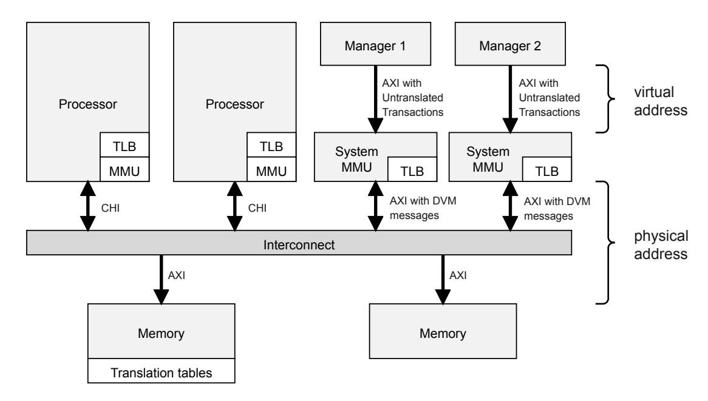

**Figure A13.1: Virtual memory system**

In Figure [A13.1,](#page-204-1) the System Memory Management Units (SMMUs) translate addresses in the virtual address space to addresses in the physical address space. Although all components in the system must use a single physical address space, SMMU components enable different Manager components to operate in their own independent virtual address or intermediate physical address space.

A typical process in the virtual memory system shown in [Figure](#page-204-1) [A13.1](#page-204-1) might operate as follows:

- 1. A Manager component operating in a virtual address (VA) space issues a transaction that uses a VA.
- 2. The SMMU receives the VA for translation to a physical address (PA):
  - If the SMMU has recently performed the requested translation, then it might obtain a cached copy of the translation from its TLB.
  - Otherwise, the SMMU must perform a translation table walk, accessing translation table in memory to obtain the required VA to PA translation.
- 3. The SMMU uses the PA to issue the transaction for the requesting component.

At step 2 of this process, the translation for the required VA might not exist. In this case, the translation table walk generates a fault that must be notified to the agent that maintains the translation tables. For the required access to proceed, that agent must then provide the required VA to PA translation. Typically, it updates the translation tables with the required information.

Maintaining the translation tables can require changes to translation table entries that are cached in TLBs. To prevent the use of these entries, a DVM message can be used to issue a TLB invalidate operation.

After the translation tables have been updated and the necessary TLB invalidations have been performed, a DVM Sync transaction is used to ensure that all required transactions have completed.

<span id="page-204-2"></span>Details of DVM messages used to maintain SMMUs can be found in Chapter [A15](#page-230-0) *[Distributed Virtual Memory](#page-230-0) [messages](#page-230-0)*.

# <span id="page-205-0"></span>**A13.2 Support for untranslated transactions**

AXI supports the use of virtual addresses through the untranslated transactions extension.

The Untranslated\_Transactions property is used to indicate which version of untranslated transactions is supported by an interface.

**Table A13.1: Untranslated\_Transactions property**

| Untranslated_Transactions | Default | Description                                       |
|---------------------------|---------|---------------------------------------------------|
| v4                        |         | Untranslated transactions version 4 is supported. |
| v3                        |         | Untranslated transactions version 3 is supported. |
| v2                        |         | Untranslated transactions version 2 is supported. |
| v1                        |         | Untranslated transactions version 1 is supported. |
| True                      |         | Untranslated transactions version 1 is supported. |
| False                     | Y       | Untranslated transactions are not supported.      |

Address translation is the process of translating an input address to an output address based on address mapping and memory attribute information that is held in translation tables. This process permits agents in the system to use their own virtual address space, but ensures that the addresses for all transactions are eventually translated to a single physical address space for the entire system.

The use of a single physical address space is required for the correct operation of hardware coherency and therefore the SMMU functionality is typically located before a coherent interconnect.

The additional signals that are specified in this section provide sufficient information for an SMMU to determine the translation that is required for a particular transaction and permit different transactions on the same interface to use different translation schemes.

All signals in the Untranslated Transactions extension are prefixed with AWMMU for write transactions and ARMMU for read transactions.

<span id="page-205-1"></span>In this specification, AxMMU indicates AWMMU or ARMMU.

# <span id="page-206-0"></span>**A13.3 Untranslated transaction signaling**

The signals to support untranslated transactions are shown in Table [A13.2.](#page-206-1) Each signal is described in following sections, including the property values which determine whether they are present.

**Table A13.2: Signals for Untranslated Transactions**

<span id="page-206-16"></span><span id="page-206-15"></span><span id="page-206-14"></span><span id="page-206-13"></span><span id="page-206-12"></span><span id="page-206-7"></span><span id="page-206-6"></span><span id="page-206-5"></span><span id="page-206-4"></span><span id="page-206-3"></span><span id="page-206-1"></span>

| Name                                | Width        | Default              | Description                                                                                                                  |
|-------------------------------------|--------------|----------------------|------------------------------------------------------------------------------------------------------------------------------|
| AWMMUSECSID,<br>ARMMUSECSID         | SECSID_WIDTH | 0b00<br>(Non-secure) | Secure Stream Identifier for untranslated<br>transactions.                                                                   |
| AWMMUSID,<br>ARMMUSID               | SID_WIDTH    | All zeros            | Stream Identifier for untranslated<br>transactions.                                                                          |
| AWMMUSSIDV,<br>ARMMUSSIDV           | 1            | 0b0                  | Asserted HIGH to indicate that a<br>transaction has a valid substream identifier.                                            |
| AWMMUSSID,<br>ARMMUSSID             | SSID_WIDTH   | All zeros            | Substream identifier for untranslated<br>transactions.                                                                       |
| AWMMUATST,<br>ARMMUATST             | 1            | 0b0                  | Indicates that the transaction has already<br>undergone PCIe ATS translation.                                                |
| AWMMUFLOW,<br>ARMMUFLOW             | 2            | 0b00<br>(Stall)      | Indicates the SMMU flow for managing<br>translation faults for this transaction.                                             |
| AWMMUVALID,<br>ARMMUVALID           | 1            | 0b1                  | MMU qualifier signal. When deasserted,<br>the transaction address is a physical<br>address and does not require translation. |
| AWMMUPM,<br>ARMMUPM                 | 1            | 0b0                  | Protected Mode indicator                                                                                                     |
| AWMMUPASUNKNOWN,<br>ARMMUPASUNKNOWN | 1            | 0b0                  | HIGH to indicate that there is no PAS<br>expectation                                                                         |

<span id="page-206-19"></span><span id="page-206-18"></span><span id="page-206-17"></span><span id="page-206-11"></span><span id="page-206-10"></span><span id="page-206-9"></span><span id="page-206-8"></span><span id="page-206-2"></span>When Untranslated\_Transactions is v2 or higher, RRESP and BRESP are extended to 3-bits to accommodate the signaling of the TRANSFAULT response. See [A3.3](#page-60-0) *[Transaction response](#page-60-0)* for encodings.

In Table [A13.3](#page-207-0) there is a summary of which MMU signals are present for which version of untranslated transactions.

- 'Y' indicates that the signal is mandatory.
- 'C' indicates that the presence is configurable.
- <span id="page-207-0"></span>• '-' indicates that the signal must not be present.

**Table A13.3: Signals in each version of untranslated transactions**

| Signals         | Version 1 | Version 2 | Version 3 | Version 4 |
|-----------------|-----------|-----------|-----------|-----------|
| AxMMUSECSID     | Y         | Y         | Y         | Y         |
| AxMMUSID        | C         | C         | C         | C         |
| AxMMUSSIDV      | C         | C         | C         | C         |
| AxMMUSSID       | C         | C         | C         | C         |
| AxMMUATST       | C         | -         | -         | -         |
| AxMMUFLOW       | -         | C         | C         | C         |
| AxMMUVALID      | -         | -         | Y         | Y         |
| AxMMUPM         | -         | -         | -         | C         |
| AxMMUPASUNKNOWN | -         | -         | -         | C         |

# <span id="page-208-0"></span>**A13.4 Translation identifiers**

Requests using virtual addressing can have up to three identifiers that are used during address translation:

- Secure Stream Identifier [A13.4.1](#page-208-1) *[Secure Stream Identifier \(SECSID\)](#page-208-1)*
- Stream Identifier [A13.4.2](#page-209-0) *[StreamID \(SID\)](#page-209-0)*
- Substream Identifier [A13.4.3](#page-209-1) *[SubstreamID \(SSID\)](#page-209-1)*

During the building of a system, it is possible that the stream identifiers for a given component have some ID bits provided by the component and some ID bits that are tied off for that component. This fixes the range of values in the stream identifier name space that can be used by that component. Typically, the low-order bits are provided by the component and the high-order bits are tied off.

Any additional identifier field bits for AxMMUSID or AxMMUSSID, that are not supplied by the component or hard coded by the interconnect, must be tied LOW.

## <span id="page-208-2"></span><span id="page-208-1"></span>**A13.4.1 Secure Stream Identifier (SECSID)**

The Secure Stream Identifier is used to indicate the virtual address space of the request. It is transported using the AxMMUSECSID signal, Table [A13.4](#page-208-2) shows the encodings.

**Table A13.4: AxMMUSECSID encodings**

| AxMMUSECSID | Label      | Meaning                  |
|-------------|------------|--------------------------|
| 0b00        | Non-secure | Non-secure address space |
| 0b01        | Secure     | Secure address space     |
| 0b10        | Realm      | Realm address space      |
| 0b11        | RESERVED   | -                        |

The width of AxMMUSECSID is determined by the property SECSID\_WIDTH.

**Table A13.5: SECSID\_WIDTH property**

| Name         | Values  | Default | Description                                      |
|--------------|---------|---------|--------------------------------------------------|
| SECSID_WIDTH | 0, 1, 2 | 0       | Width of AWMMUSECSID and<br>ARMMUSECSID in bits. |

The following rules apply:

- SECSID\_WIDTH must be 0 when Untranslated\_Transactions is False. AxMMUSECSID signals are not present.
- SECSID\_WIDTH must be 1 when Untranslated\_Transactions is not False and RME\_Support is False. Only Non-secure and Secure address spaces can be used.
- SECSID\_WIDTH must be 2 when Untranslated\_Transactions is not False and RME\_Support is True.
- When AxMMUSECSID is Non-secure, the physical address space must be Non-secure.
- When AxMMUSECSID is Secure, the physical address space must be Non-secure or Secure.
- When AxMMUSECSID is Realm, the physical address space must be Non-secure or Realm.

### <span id="page-209-0"></span>**A13.4.2 StreamID (SID)**

The StreamID can be used to map a request to a translation context in the MMU. Each address space uses a different namespace, so they can have the same Stream Identifier values.

The width of AxMMUSID is determined by the property SID\_WIDTH.

**Table A13.6: SID\_WIDTH property**

| Name      | Values | Default | Description                                                  |  |
|-----------|--------|---------|--------------------------------------------------------------|--|
| SID_WIDTH | 032    | 0       | StreamID width in bits, applies to<br>AWMMUSID and ARMMUSID. |  |

If SID\_WIDTH is 0, AxMMUSID signals are not present and the default value is used.

## <span id="page-209-1"></span>**A13.4.3 SubstreamID (SSID)**

The SubstreamID can be used with requests that have the same StreamID to associate different application address translations to different logical blocks.

There is a separate enable signal AxMMUSSIDV for the SubstreamID, so a Manager can issue requests with or without a SubstreamID.

• When AxMMUSSIDV is deasserted, AxMMUSSID must be 0.

Note that a stream with a SubstreamID of 0 is different from a stream with no valid substream (AxMMUSSIDV is deasserted).

The width of AxMMUSSID is determined by the property SSID\_WIDTH.

**Table A13.7: SSID\_WIDTH property**

| Name       | Values | Default | Description                                                       |  |
|------------|--------|---------|-------------------------------------------------------------------|--|
| SSID_WIDTH | 020    | 0       | SubstreamID width in bits, applies to<br>AWMMUSSID and ARMMUSSID. |  |

When SSID\_WIDTH is 0, AxMMUSSID and AxMMUSSIDV are not present on the interface and there are no valid SubstreamIDs.

### <span id="page-210-0"></span>**A13.4.4 Untranslated Transactions and GDI**

When using untranslated transactions and GDI, the Untranslated\_Transactions property must be v4 and the following signals are included.

**Table A13.8: AxMMUPM signals**

| Name                | Width | Default | Presence                                                   | Description              |
|---------------------|-------|---------|------------------------------------------------------------|--------------------------|
| AWMMUPM,<br>ARMMUPM | 1     | 0       | GDI_Support == True and<br>Untranslated_Transactions == v4 | Protected Mode indicator |

The Protected Mode (PM) indicator is used to indicate which address spaces the request is permitted to access. The following rules apply:

- AxMMUPM can only be asserted for requests with a Non-secure context.
- When ARMMUPM is asserted, it means that the request can read from both NS and NSP address spaces.
- When AWMMUPM is asserted, it means that the request can write to the NSP address space but is not permitted to write to the NS address space.
- Requests to the Non-secure Protected or System Agent physical address space must be physically addressed, that means:
  - When AxPAS is NSP or SA, AxMMUVALID must be LOW.
- When AxMMUPM is asserted, AxMMUFLOW must not be Stall.

# <span id="page-211-0"></span>**A13.5 PCIe considerations**

When the Untranslated\_Transactions signaling is used for interfacing to PCIe Root Complex, the following considerations apply:

- AxMMUSECSID must be Non-secure or Realm.
- AxMMUSID corresponds to the PCIe Requester ID.
- AxMMUSSID corresponds to the PCIe PASID.
- AxMMUSSIDV is asserted if the transaction had a PASID prefix, otherwise it is deasserted.

### <span id="page-211-1"></span>**A13.5.1 PCIe XT mode**

PCIe eXtended TEE (XT) extends the access modes available for PCIe requests.

To support PCIe XT mode, AxMMUPASUNKNOWN signals are included, present when Untranslated\_Transactions is v4, RME\_Support is True and PAS\_WIDTH is not 0.

**Table A13.9: AxMMUPASUNKNOWN signals**

| Name                                | Width | Default | Description                                          |
|-------------------------------------|-------|---------|------------------------------------------------------|
| AWMMUPASUNKNOWN,<br>ARMMUPASUNKNOWN | 1     | 0b0     | HIGH to indicate that there is no<br>PAS expectation |

The following rules apply when AxMMUVALID and AxMMUPASUNKNOWN are asserted:

- AxMMUSECSID must be Realm.
- AxPAS is inapplicable and must be Realm.

A PCIe device in eXtended TEE (XT) mode provides XT and T bits which should map to AXI as shown in [Table](#page-211-2) [A13.10.](#page-211-2)

**Table A13.10: Mapping PCIe T and XT to AXI**

<span id="page-211-2"></span>

| XT | T | AxMMUSECSID | AxPAS      | AxMMUPASUNKNOWN | Meaning                                                       |
|----|---|-------------|------------|-----------------|---------------------------------------------------------------|
| 0  | 0 | Non-secure  | Non-secure | 0               | Non-trusted request that must<br>target a Non-secure PAS.     |
| 0  | 1 | Realm       | Realm      | 1               | Trusted request that can target a<br>Realm or Non-secure PAS. |
| 1  | 0 | Realm       | Non-secure | 0               | Trusted request that must target<br>a Non-secure PAS.         |
| 1  | 1 | Realm       | Realm      | 0               | Trusted request that must target<br>a Realm PAS.              |

When PCIe XT mode is not used, the T bit should map to AXI as shown in Table [A13.11.](#page-212-0)

#### **Table A13.11: Mapping PCIe T bit to AXI**

<span id="page-212-1"></span><span id="page-212-0"></span>

| T | AxMMUSECSID | AxMMUPASUNKNOWN | AxPAS      | Meaning                                                   |
|---|-------------|-----------------|------------|-----------------------------------------------------------|
| 0 | Non-secure  | 0               | Non-secure | Non-trusted request that must<br>target a Non-secure PAS. |
| 1 | Realm       | 0               | Realm      | Trusted request that must target<br>a Realm PAS.          |

# <span id="page-213-0"></span>**A13.6 Translation fault flows**

An untranslated transaction can indicate which flow can be used when an SMMU encounters a translation fault.

If no flow is indicated, a *Stall* flow is assumed. The property MMUFLOW\_Present is used to indicate whether other SMMU flows are supported.

**Table A13.12: MMUFLOW\_Present property**

| MMUFLOW_Present | Default | Description                              |
|-----------------|---------|------------------------------------------|
| True            |         | AxMMUFLOW or AxMMUATST are present.      |
| False           | Y       | AxMMUFLOW and AxMMUATST are not present. |

MMUFLOW\_Present must be False if Untranslated\_Transactions is False.

If MMUFLOW\_Present is True, then:

- If Untranslated\_Transactions is True or v1, ARMMUATST and AWMMUATST are present on the interface.
- If Untranslated\_Transactions is v2 or higher, ARMMUFLOW and AWMMUFLOW are present on the interface.

Version 1 of the specification for untranslated transactions supports the Stall and ATST flows, using the AxMMUATST signals.

- When AxMMUATST is deasserted LOW, the Stall flow is used.
- When AxMMUATST is asserted HIGH, the ATST flow is used.

For version 2 and above, the AxMMUFLOW signals are used to indicate which flow can be used.

**Table A13.13: AxMMUFLOW encodings**

| AxMMUFLOW | Flow type | Meaning                             |
|-----------|-----------|-------------------------------------|
| 0b00      | Stall     | The SMMU Stall flow can be used.    |
| 0b01      | ATST      | The SMMU ATST flow must be used.    |
| 0b10      | NoStall   | The SMMU NoStall flow must be used. |
| 0b11      | PRI       | The SMMU PRI flow can be used.      |

The following sections describe each flow in turn.

### <span id="page-214-0"></span>**A13.6.1 Stall flow**

When the Stall flow is used, software can configure the SMMU to take one of the following actions when a translation fault occurs:

- Terminate the transaction with an SLVERR response.
- Terminate the transaction with an OKAY response, data is RAZ/WI.
- Stall the translation and inform software that the translation is stalled. Software can then instruct the SMMU to terminate the transaction or update the translation tables and retry the translation. The Manager is not aware of the stall.

This flow enables software to manage translation faults and demand paging without the Manager being aware. However, it has the following limitations:

- The Manager can see very long transaction latency, potentially triggering timeouts.
- Due to the dependence of software activity, the Stall flow can cause deadlocks in some systems.

For example, it is not recommended for use with PCIe because of dependencies between outgoing transactions to PCIe from a CPU, and incoming transactions from PCIe through the SMMU.

Enabling the Stall flow does not necessarily cause a stall when a translation fault occurs. Stalls only occur when enabled by software. Software does not normally enable stalling for PCIe endpoints.

## <span id="page-214-1"></span>**A13.6.2 ATST flow**

The Address Translation Service Translated (ATST) flow indicates that the transaction has already been translated by Address Translation Services (ATS). It is only used by PCIe Root Ports.

When the flow is ATST, the transaction might still undergo some translation, depending on the configuration of the SMMU. For more information, see *Arm® System Memory Management Unit Architecture Specification* [\[7\]](#page-16-7).

If a translation fault occurs, the transaction must be terminated with an SLVERR response.

When the flow is ATST, the following constraints apply:

- AxMMUSECSID must be Non-secure or Realm.
- If Untranslated\_Transactions is True, v1 or v2 then AxMMUSSIDV must be LOW.

When Untranslated\_Transactions is v3 or higher, it is permitted to assert AxMMUSSIDV when AxMMUFLOW indicates ATST. This is to enable the transport of PASID and other attributes from a PCIe transaction using the AxMMUSSID signal.

### <span id="page-214-2"></span>**A13.6.3 NoStall flow**

The NoStall flow is used by a Manager that is not able to be stalled.

If a translation fault occurs when using this flow, the Subordinate must terminate the transaction with an SLVERR or OKAY response, even if software has configured the device to be stalled when a translation fault occurs.

This flow is recommended for Managers such as PCIe Root Ports which might deadlock if stalling is enabled by software.

### <span id="page-215-0"></span>**A13.6.4 PRI flow**

The PRI flow is designed for use with a PCIe integrated endpoint. The Manager uses the PRI flow to enable software to respond to translation faults without risking deadlock.

When the flow is PRI and a translation fault occurs, the transaction is terminated with a TRANSFAULT response. The Manager can then use a separate mechanism to request that the page is made available, before retrying the transaction. This mechanism is normally PCIe PRI.

When this flow is used, software enables ATS but no ATS features are required in hardware.

A transaction that uses this flow might still be terminated by the SMMU with an SLVERR, if the translation failed for a reason which cannot be resolved by a PRI request, for example because the SMMU is incorrectly configured.

The following rules apply to a TRANSFAULT response:

- TRANSFAULT is indicated by setting RRESP or BRESP to 0b101. See [A3.3](#page-60-0) *[Transaction response](#page-60-0)* for all encodings.
- A TRANSFAULT response is only permitted for requests using the PRI flow.
- If TRANSFAULT is used for one response transfer, it must be used for all response transfers of a transaction.
- <span id="page-215-1"></span>• If RRESP is TRANSFAULT, the read data in that transfer is not valid.

# <span id="page-216-0"></span>**A13.7 Untranslated transaction qualifier**

When the Untranslated\_Transactions property is v3 or higher, a qualifier signal AxMMUVALID is added to the read and write request channels.

When AxMMUVALID is deasserted, the transaction address is a physical address and does not require translation. This enables a Manager to issue a mixture of translated and untranslated transactions.

The rules for using these signals are:

- When AxMMUVALID is asserted, the following signals are constrained:
  - AxTAGOP must be 0b00 (Invalid)
- When AxMMUVALID is deasserted, the following signals are not applicable and can take any value:
  - AxMMUSECSID
  - AxMMUSID
  - AxMMUSSIDV
  - AxMMUSSID
  - AxMMUFLOW
  - AxMMUPM
  - AxMMUPASUNKNOWN
- Translated and untranslated transactions must not use the same ID for in-flight transactions, and this applies to the following:
  - Transactions with AWMMUVALID asserted and others with AWMMUVALID deasserted.
  - Transactions with ARMMUVALID asserted and others with ARMMUVALID deasserted.

# <span id="page-217-0"></span>**A13.8 Permitted combinations of MMU signals and PAS**

Table [A13.14](#page-217-1) shows the legal combinations of AxMMU signals and PAS. Other combinations are not permitted.

**Table A13.14: Legal combinations of MMU signals and PAS**

<span id="page-217-1"></span>

| MUVALID<br>M<br>Ax | MUSECSID<br>M<br>Ax | W<br>MUFLO<br>M<br>Ax | M<br>MUP<br>M<br>Ax | WN<br>MUPASUNKNO<br>M<br>Ax | PAS        | Meaning                                          |
|--------------------|---------------------|-----------------------|---------------------|-----------------------------|------------|--------------------------------------------------|
| 0                  | -                   | -                     | -                   | -                           | Secure     | NoStreamID, Secure PAS                           |
| 0                  | -                   | -                     | -                   | -                           | Non-secure | NoStreamID, Non-secure PAS                       |
| 0                  | -                   | -                     | -                   | -                           | Root       | NoStreamID, Root PAS                             |
| 0                  | -                   | -                     | -                   | -                           | Realm      | NoStreamID, Realm PAS                            |
| 0                  | -                   | -                     | -                   | -                           | SA         | NoStreamID, System Agent PAS                     |
| 0                  | -                   | -                     | -                   | -                           | NSP        | NoStreamID, Non-secure Protected PAS             |
| 1                  | Non-secure          | Stall, NoStall, PRI   | 0                   | 0                           | Non-secure | Untranslated, Non-secure context                 |
| 1                  | Non-secure          | NoStall, PRI          | 1                   | 0                           | Non-secure | Untranslated, Non-secure context, Protected Mode |
| 1                  | Non-secure          | ATST                  | 0                   | 0                           | Non-secure | Translated, Non-secure context                   |
| 1                  | Non-secure          | ATST                  | 1                   | 0                           | Non-secure | Translated, Non-secure context, Protected Mode   |
| 1                  | Secure              | Stall, NoStall, PRI   | 0                   | 0                           | Secure     | Untranslated, Secure context, Secure PAS         |
| 1                  | Secure              | Stall, NoStall, PRI   | 0                   | 0                           | Non-secure | Untranslated, Secure context, Non-secure PAS     |
| 1                  | Realm               | Stall, NoStall, PRI   | 0                   | 0                           | Non-secure | Untranslated, Realm context, Non-secure PAS      |
| 1                  | Realm               | Stall, NoStall, PRI   | 0                   | 0                           | Realm      | Untranslated, Realm context, Realm PAS           |
| 1                  | Realm               | Stall, NoStall, PRI   | 0                   | 1                           | Realm      | Untranslated, Realm context, no PAS expectation  |
| 1                  | Realm               | ATST                  | 0                   | 0                           | Non-secure | Translated, Realm context, Non-secure PAS        |
| 1                  | Realm               | ATST                  | 0                   | 0                           | Realm      | Translated, Realm context, Realm PAS             |
| 1                  | Realm               | ATST                  | 0                   | 1                           | Realm      | Translated, Realm context, no PAS expectation    |

# <span id="page-218-1"></span><span id="page-218-0"></span>**A13.9 StashTranslation Opcode**

The StashTranslation Opcode is a hint that an MMU should cache the table entry required to process the given address, to reduce the latency for any future transactions using that table entry.

The requirements on the MMU depend on whether the address is virtual or physical, and if the Realm Management Extension is being used:

- If AWMMUVALID is asserted or not present, the StashTranslation request has a virtual address and the MMU should cache the relevant page table entry.
- If AWMMUVALID is deasserted, the StashTranslation request has a physical address and the MMU should cache the relevant Granule Protection Table entry.

If RME\_Support is False, AWMMUVALID must be asserted for a StashTranslation request.

The StashTranslation Opcode can be used by a Manager and supported by a Subordinate if the following property conditions apply:

- Untranslated\_Transactions is v1 or higher.
- Untranslated\_Transactions is True and Cache\_Stash\_Transactions is True.

The rules for a StashTranslation operation are:

- The StashTranslation transaction consists of a request on the AW channel and a single response transfer on the B channel. There are no write data transfers.
- AWSNOOP is 0b01110 to indicate StashTranslation, AWSNOOP\_WIDTH can be 4 or 5.
- No stash target is supported. If present, AWSTASHNID, AWSTASHNIDEN, AWSTASHLPID, and AWSTASHLPIDEN must be LOW.
- Any legal combination of AWCACHE and AWDOMAIN values is permitted. See [Table](#page-135-2) [A8.7.](#page-135-2)
- AWATOP is 0b000000 (Non-atomic transaction).
- AWTAGOP is 0b00 (Invalid).
- StashTranslation requests must not use the same AXI ID values that are used by non-StashTranslation transactions on the write channels that are outstanding at the same time. This rule ensures that there are no ordering constraints between StashTranslation transactions and other transactions, so a Subordinate that does not stash translations can respond immediately.
- An OKAY response indicates that the StashTranslation request has been accepted, not that the translation is stashed. The request is a hint and is not guaranteed to be acted upon by a Completer.

# <span id="page-219-1"></span><span id="page-219-0"></span>**A13.10 UnstashTranslation Opcode**

The UnstashTranslation Opcode is a hint that the page table or granule table entry that corresponds to the given transaction address and StreamID is not likely to be used again.

The requirements on the MMU depend on whether the address is virtual or physical, and if the Realm Management Extension is being used:

- If AWMMUVALID is asserted or not present, the UnstashTranslation request has a virtual address and the MMU should deallocate the relevant page table entry.
- If AWMMUVALID is deasserted, the StashTranslation request has a physical address and the MMU should deallocate the relevant Granule Protection Table entry.

If RME\_Support is False, AWMMUVALID must be asserted for an UnstashTranslation request.

The UnstashTranslation\_Transaction property is used to indicate whether an interface supports the UnstashTranslation Opcode.

**Table A13.15: UnstashTranslation\_Transaction property**

| UnstashTranslation_Transaction | Default | Description                          |
|--------------------------------|---------|--------------------------------------|
| True                           |         | UnstashTranslation is supported.     |
| False                          | Y       | UnstashTranslation is not supported. |

The following table shows compatibility between Manager and Subordinate interfaces, according to the values of the UnstashTranslation\_Transaction property.

**Table A13.16: UnstashTranslation\_Transaction compatibility**

| UnstashTranslation_Transaction | Subordinate: False | Subordinate: True |
|--------------------------------|--------------------|-------------------|
| Manager: False                 | Compatible.        | Compatible.       |
| Manager: True                  | Not compatible.    | Compatible.       |

The rules for an UnstashTranslation operation are:

- The UnstashTranslation transaction consists of a request on the AW channel and a single response transfer on the B channel. There are no write data transfers.
- AWSNOOP is 0b10001 to indicate UnstashTranslation, AWSNOOP\_WIDTH must be 5.
- No stash target is supported. If present, AWSTASHNID, AWSTASHNIDEN, AWSTASHLPID, and AWSTASHLPIDEN must be LOW.
- Any legal combination of AWCACHE and AWDOMAIN values is permitted. See [Table](#page-135-2) [A8.7.](#page-135-2)
- AWATOP is 0b000000 (Non-atomic transaction).
- AWTAGOP is 0b00 (Invalid).
- AWID is unique-in-flight, which means:
  - An UnstashTranslation request can only be issued if there are no outstanding transactions on the write channels using the same ID value.
  - A Manager must not issue a request on the write channels with the same ID as an outstanding UnstashTranslation transaction.

*Chapter A13. Untranslated Transactions A13.10. UnstashTranslation Opcode*

- If present, AWIDUNQ must be asserted for an UnstashTranslation request.
- An OKAY response indicates that the UnstashTranslation request has been accepted, not that the translation is deallocated. The request is a hint and is not guaranteed to be acted upon by a Completer.

# <span id="page-221-0"></span>Chapter A14 **Interface clock and power gating**

This chapter describes stopping and starting interfaces for the purposes of clock and power control. It contains the following sections:

- [A14.1](#page-222-0) *[Interface gating with Valid-Ready transport](#page-222-0)*
- [A14.2](#page-224-0) *[Interface gating with credited transport](#page-224-0)*

# <span id="page-222-4"></span><span id="page-222-0"></span>**A14.1 Interface gating with Valid-Ready transport**

When using a Valid-Ready transport, wake-up signals can be used to indicate when there is activity associated with the interface.

**Table A14.1: Wake-up signals**

<span id="page-222-3"></span><span id="page-222-2"></span>

| Name     | Width | Default | Description                                                                                                     |
|----------|-------|---------|-----------------------------------------------------------------------------------------------------------------|
| AWAKEUP  | 1     | -       | Manager output, asserted HIGH to indicate there<br>might be activity on the read and write request<br>channels. |
| ACWAKEUP | 1     | -       | Subordinate output, asserted HIGH to indicate<br>there might be activity on the snoop request<br>channel.       |

The signals can be routed to a clock controller or similar component to enable power and clocks to the connected components.

The wake-up signals are synchronous and must also be suitable for sampling asynchronously in a different clock domain. This requires the wake-up signals to be glitch-free, which can be achieved by for example being generated directly from a register, or from a glitch-free OR tree.

The wake-up signals must be asserted to guarantee that a transaction can be accepted, but once the transaction is in progress the assertion or deassertion of the wake-up signal is IMPLEMENTATION DEFINED.

It is recommended, but not required that a wake-up signal is deasserted when no further transactions are required.

The Wakeup\_Signals property is used to indicate whether a component includes wake-up signaling.

**Table A14.2: Wakeup\_Signals property**

| Wakeup_Signals | Default | Description                                                                    |
|----------------|---------|--------------------------------------------------------------------------------|
| True           |         | AWAKEUP is present. ACWAKEUP is present if<br>the interface has an AC channel. |
| False          | Y       | No wake-up signals are present.                                                |

Wakeup signals can only be used with Valid-Ready transport, which implies the following:

• When AXI\_Transport is Credited, Wakeup\_Signals must be False.

### <span id="page-222-1"></span>**A14.1.1 AWAKEUP rules and recommendations**

AWAKEUP is an output signal from a Manager interface and is asserted at the start of a transaction to indicate that there is a transaction to be processed. It has the following rules:

- It is recommended that AWAKEUP is asserted at least one cycle before the assertion of ARVALID, AWVALID, or WVALID to prevent the acceptance of a transaction request being delayed.
- It is permitted for AWAKEUP to be asserted at any point before or after the assertion of ARVALID, AWVALID, or WVALID.
- A Subordinate is permitted to wait for AWAKEUP to be asserted before asserting ARREADY, AWREADY, or WREADY.

- If AWAKEUP is asserted in a cycle where AWVALID is asserted and AWREADY is deasserted, then AWAKEUP must remain asserted until AWREADY is asserted.
- If AWAKEUP is asserted in a cycle when ARVALID is asserted and ARREADY is deasserted, then AWAKEUP must remain asserted until ARREADY is asserted.
- After the ARVALID, ARREADY handshake, or the AWVALID, AWREADY handshake, the interconnect must remain active until the transaction has completed.
- It is permitted, but not recommended, to assert AWAKEUP then deassert it without a transaction taking place.

There is no requirement relating to the assertion of AWAKEUP relative to WVALID. However, for components that can assert WVALID before AWVALID, the assertion of AWAKEUP at least one cycle before WVALID can prevent the acceptance of a new transaction being delayed.

If a Subordinate has an AWAKEUP input but the attached Manager does not have an AWAKEUP output, then either:

- Tie AWAKEUP high, however this might prevent the Subordinate interface from using low power states.
- Derive AWAKEUP from AxVALID and SYSCOREQ/ACK. This method allows the Subordinate to enter low power states, but it may introduce latency while the clock is enabled.

### <span id="page-223-0"></span>**A14.1.2 AWAKEUP and Coherency Connection signaling**

If wake-up and Coherency Connection signals are both present on an interface, there are additional considerations.

- It is required that the AWAKEUP signal is asserted to guarantee progress of a transition on the Coherency Connection signaling.
- It is permitted for AWAKEUP to be asserted at any point before or after the assertion of SYSCOREQ. However, it is required to be asserted to guarantee the corresponding assertion of SYSCOACK. When AWAKEUP is asserted with SYSCOREQ asserted and SYSCOACK deasserted, it must remain asserted until SYSCOACK is asserted.
- It is permitted for AWAKEUP to be asserted at any point before or after the deassertion of SYSCOREQ. However, it is required to be asserted to guarantee the corresponding deassertion of SYSCOACK. When AWAKEUP is asserted with SYSCOREQ deasserted and SYSCOACK asserted, it must remain asserted until SYSCOACK is deasserted.

See [A15.6](#page-259-0) *[Coherency Connection signaling](#page-259-0)* for more details.

# <span id="page-223-1"></span>**A14.1.3 ACWAKEUP rules and recommendations**

ACWAKEUP is an output signal from a Subordinate interface, usually on an interconnect, and is asserted at the start of a DVM message transaction to indicate that there is a transaction to be processed. It has the following rules:

- It is recommended that ACWAKEUP is asserted at least one cycle before the assertion of ACVALID to prevent the acceptance of a DVM request being delayed.
- ACWAKEUP must remain asserted until the associated ACVALID / ACREADY handshake to ensure progress of the DVM transaction.
- After the ACVALID / ACREADY handshake, the Manager must remain active until the DVM transaction has completed.
- It is permitted for ACWAKEUP to be asserted at any point before or after the assertion of ACVALID.
- It is permitted, but not recommended, to assert ACWAKEUP and then deassert it without ACVALID being asserted.

# <span id="page-224-0"></span>**A14.2 Interface gating with credited transport**

When using credited transport, an interface can include control signals to determine when channel receivers can give credits. This can be used to clock or power gate interfaces when they are idle.

The property Credit\_Control is used to indicate whether credit control signals are included on an interface. If credit control signals are not included, the interface is assumed to be running when not in reset.

Credits are implicitly returned during the STOP state and on exit from the STOP state all credits are with the receiver. Transmitters are not required to explicitly return all credits to the receiver before it stops.

**Table A14.3: Credit\_Control property**

| Credit_Control      | Default | Description                                                                                                                                                                                                                  |
|---------------------|---------|------------------------------------------------------------------------------------------------------------------------------------------------------------------------------------------------------------------------------|
| False               | Y       | Credit control signals are not included.<br>Credit exchange starts from reset and does not stop.                                                                                                                             |
| Implicit_Return_Uni |         | Credit control signals are included. Credits are implicitly returned to<br>the receiver when exiting the STOP state. Control is unidirectional<br>because only a Manager can initiate the move to ACTIVATE or<br>DEACTIVATE. |

The following rules apply to the Credit\_Control property:

- Credit\_Control must be False if the AXI\_Transport property is Ready.
- Connected interfaces must have the same value for Credit\_Control.

<span id="page-224-1"></span>Table [A14.4](#page-224-1) shows the signals that are included when Credit\_Control is Implicit\_Return\_Uni.

**Table A14.4: Credit control signals**

<span id="page-224-4"></span><span id="page-224-3"></span>

| Name        | Width | Default | Description                                                                                |
|-------------|-------|---------|--------------------------------------------------------------------------------------------|
| ACTIVATEREQ | 1     | 0b1     | Activation / deactivation request from a Manager.                                          |
| ACTIVATEACK | 1     | 0b1     | Activation / deactivation acknowledge from a Subordinate.                                  |
| ASKSTOP     | 1     | 0b0     | Asserted HIGH to indicate that the Subordinate wants the<br>Manager to stop the interface. |

<span id="page-224-5"></span><span id="page-224-2"></span>[Figure](#page-224-2) [A14.1](#page-224-2) shows connected AXI5 interfaces using credit control signaling.

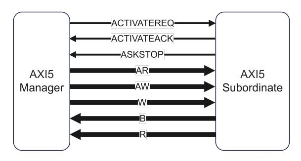

**Figure A14.1: AXI5 interfaces using credit control signaling**

### <span id="page-225-0"></span>**A14.2.1 Channel states**

When using credit control, an interface can be in one of four states: STOP, ACTIVATE, RUN, DEACTIVATE.

- RUN and STOP are stable states. An interface can remain in this state for an indefinite period.
- DEACTIVATE and ACTIVATE are transient states. It is expected that an interface moves to the next stable state in a relatively short period.

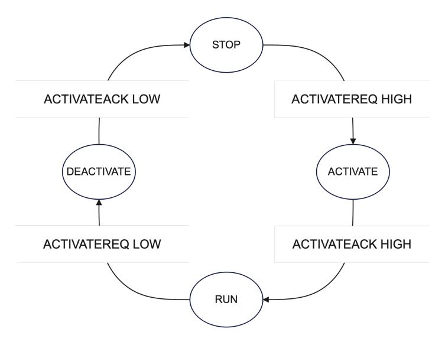

**Figure A14.2: Interface states**

### **A14.2.1.1 STOP state**

- There are no outstanding transactions, the interface is idle and can be clock gated or powered down.
- Managers and Subordinates have no credits and cannot send any transfers or credits.
- The Subordinate might receive credits after entering this state if there is a race between credits and ACTIVATEREQ deassertion, they must be discarded.
- If the Manager wants to start a transaction, it can assert ACTIVATEREQ.
- When ACTIVATEREQ is asserted, the interface moves into the ACTIVATE state.

# **A14.2.1.2 ACTIVATE state**

- This is a transient state, and the interface is expected to transition to RUN within a relatively short period.
- When the Subordinate is ready to start, it asserts ACTIVATEACK and starts to send credits.
- The Manager might receive credits due to a potential race between ACTIVATEACK and credit signals, these can be used to send transfers.
- When ACTIVATEACK is asserted, the interface moves into the RUN state.

### **A14.2.1.3 RUN state**

- The Manager and Subordinate can send credits and transfers.
- If the Manager wants to stop the interface and there are no outstanding transactions, it can stop sending credits and deassert ACTIVATEREQ.
- If the Subordinate wants the interface to stop, it can assert ASKSTOP.
- When ACTIVATEREQ is deasserted, the interface moves into the DEACTIVATE state.

### **A14.2.1.4 DEACTIVATE state**

- This is a transient state, and the interface is expected to transition to STOP within a relatively short period.
- The Manager must not send transfers or credits.
- The Subordinate will have no transfers to send because all outstanding transactions must be complete.
- The Subordinate stops sending credits and deasserts ACTIVATEACK.
- When ACTIVATEACK is deasserted, the interface moves into the STOP state.

### <span id="page-226-0"></span>**A14.2.2 Stop request signal, ASKSTOP**

The Manager controls the move from RUN to DEACTIVATE, but the Subordinate can use the ASKSTOP signal to ask the Manager to initiate the move to DEACTIVATE. This might be because the Subordinate is idle or because it is required to reconfigure or reset when all outstanding transactions are complete.

The following rules apply to ASKSTOP:

- ASKSTOP can only be HIGH when ACTIVATEACK is HIGH, that means in the RUN or DEACTIVATE states.
- If ASKSTOP is asserted, it must remain HIGH until ACTIVATEACK is LOW.
- ASKSTOP must be LOW when ACTIVATEACK is LOW.
- When ASKSTOP is HIGH, the Manager must deassert ACTIVATEREQ when there are no outstanding transactions.
- It is recommended that the Manager does not issue any new transaction requests when ASKSTOP is HIGH.

### <span id="page-226-1"></span>**A14.2.3 Credit control signal rules**

The following rules apply to the credit control signals:

- When ACTIVATEREQ is LOW there must be no outstanding transactions and the Manager must not send transfers.
- When ACTIVATEREQ is LOW or ACTIVATEACK is LOW, the Manager must not send credits.
- When ACTIVATEACK is LOW, the Subordinate must not send transfers or credits.
- ACTIVATEREQ, ACTIVATEACK and ASKSTOP must be LOW during reset.

### <span id="page-226-2"></span>**A14.2.4 Pipelining channels**

It can sometimes be required to add pipeline stages to channels to meet timing between interfaces. The following rules and notes apply:

- Register pipeline stages can be added to VALID, CRDT or CRDTSH paths of any channel independently.
- The Manager must not receive any credits in the STOP state.
  - If credit signals from the Subordinate have a longer transport delay than ACTIVATEACK, there must be a delay between sending the last credits and deasserting ACTIVATEACK.
- If credit signals from the Manager have a longer transport delay than ACTIVATEREQ, the Subordinate might receive credits in the STOP state. These credits must be discarded.
- If ACTIVATEACK has a longer transport delay than credit signals, the Manager might receive and use credits in the ACTIVATE state.
- ASKSTOP must be pipelined the same as ACTIVATEACK so the rules regarding ASKSTOP can be applied on both sides of the connection.

• When registering the VALID signals, the logic must ensure that associated payload signals remain aligned to VALID and the PENDING signals are HIGH in the cycle before VALID is HIGH.

## <span id="page-227-0"></span>**A14.2.5 Clock and power gating**

When an interface is in the STOP state, the transport logic can be clock or power gated. The following rules apply:

- Transfers will not be sent or received.
- Credits will not be sent.
- If credits are received, they are discarded.

A Subordinate interface can use the ACTIVATEREQ input to activate its clocks or power, therefore:

• ACTIVATEREQ must be glitch free and suitable for sampling in a different clock domain.

# <span id="page-228-1"></span><span id="page-228-0"></span>**A14.3 Sequence diagram**

[Figure](#page-228-1) [A14.3](#page-228-1) shows the sequence diagram for credit control in an AXI5 interface.

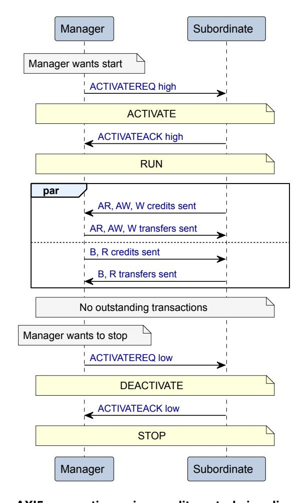

**Figure A14.3: Sequence diagram of an AXI5 connection using credit control signaling**

The following behavior is not shown in the sequence diagram:

- A Manager might receive credits in the DEACTIVATE state due to the opposite direction race.
- A Manager might receive credits in the ACTIVATE state due to pipelining, these can be used immediately.
- Due to pipelining, a Subordinate might receive credits during the STOP state, which must be discarded.

# <span id="page-229-0"></span>**A14.4 Example waveform**

An example interface control waveform is included to demonstrate a common case but does not indicate all permitted behavior. Not all signals are shown, for example PENDING signals must be included on all credited channels.

## <span id="page-229-1"></span>**A14.4.1 Transmitting one read transaction**

In this example, the Manager sends one read request, waits for the two data transfers then stops the interface.

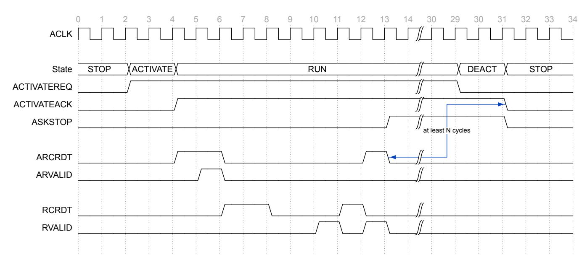

**Figure A14.4: Starting and stopping an interface after one read transaction**

| Cycle 0      | The link is inactive, both interfaces are in STOP.                                                                                                                                                                                        |
|--------------|-------------------------------------------------------------------------------------------------------------------------------------------------------------------------------------------------------------------------------------------|
| Cycle 2      | The Manager has a request to send, so asserts ACTIVATEREQ to wake the Subordinate.                                                                                                                                                        |
| Cycle 4      | The Subordinate asserts ACTIVATEACK. It sends a credit by asserting ARCRDT.                                                                                                                                                               |
| Cycle 5      | The Manager sends a transfer on AR and the Subordinate sends another AR credit.                                                                                                                                                           |
| Cycle 6      | The Manager starts sending credits on the R channel.                                                                                                                                                                                      |
| Cycle 10, 12 | The Subordinate sends two read data transfers and the transaction is complete.                                                                                                                                                            |
| Cycle 13     | The Subordinate wants the interface to stop so asserts ASKSTOP.                                                                                                                                                                           |
| Cycle 29     | There are no outstanding transactions so the Manager deasserts ACTIVATEREQ.                                                                                                                                                               |
| Cycle 31     | The Subordinate deasserts ACTIVATEACK and ASKSTOP and moves into STOP. This must be at least N<br>cycles after the Subordinate sent a credit, where N is the maximum number of cycles that any credit signal is<br>delayed by pipelining. |

# <span id="page-230-0"></span>Chapter A15

# **Distributed Virtual Memory messages**

This chapter describes how AXI supports distributed system MMUs using Distributed Virtual Memory (DVM) messages to maintain all MMUs in a virtual memory system.

It contains the following sections:

- [A15.1](#page-231-0) *[Introduction to DVM transactions](#page-231-0)*
- [A15.2](#page-232-0) *[Support for DVM messages](#page-232-0)*
- [A15.3](#page-233-0) *[DVM messages](#page-233-0)*
- [A15.4](#page-247-0) *[Transporting DVM messages](#page-247-0)*
- [A15.5](#page-257-0) *[DVM Sync and Complete](#page-257-0)*
- [A15.6](#page-259-0) *[Coherency Connection signaling](#page-259-0)*

# <span id="page-231-0"></span>**A15.1 Introduction to DVM transactions**

DVM transactions are an optional feature used to pass messages that support the maintenance of a virtual memory system. There are two types of DVM transactions: DVM message and DVM Complete.

A DVM message supports the following operations:

- TLB Invalidate
- Branch Predictor Invalidate
- Physical Instruction Cache Invalidate
- Virtual Instruction Cache Invalidate
- Synchronization
- Hint

DVM message requests are sent from a Subordinate interface, usually on an interconnect, to a Manager interface using the snoop request (AC) channel.

DVM message responses are sent from a Manager to Subordinate interface using the snoop response (CR) channel.

A DVM Complete transaction is issued on the read request channel (AR) in response to a DVM Synchronization (Sync) message, to indicate that all required operations and any associated transactions have completed.

# <span id="page-232-2"></span><span id="page-232-0"></span>**A15.2 Support for DVM messages**

The DVM\_Message\_Support property is used to indicate if an interface supports DVM messages.

**Table A15.1: DVM\_Message\_Support property**

| DVM_Message_Support | Default | Description                                                                                                                                                                                                                               |
|---------------------|---------|-------------------------------------------------------------------------------------------------------------------------------------------------------------------------------------------------------------------------------------------|
| Receiver            |         | DVM message and Synchronization transactions are<br>supported from Subordinate to Manager interfaces on the<br>AC/CR channels. DVM Complete transactions are<br>supported from Manager to Subordinate interfaces on the<br>AR/R channels. |
| False               | Y       | DVM message transactions are not supported.                                                                                                                                                                                               |

Note that the Bidirectional option for DVM\_Message\_Support in previous issues of this specification is deprecated in this specification.

DVM Complete messages require that ARDOMAIN is set to Shareable. Therefore, when DVM\_Message\_Support is Receiver the Shareable\_Transactions property must be True.

DVM messages were introduced in the Armv7 architecture and were extended in Armv8, Armv8.1, Armv8.4, and Armv9.2 architectures. It is essential that interfaces initiating and receiving DVM messages support the same architecture versions.

The following properties define the version that is supported by an interface:

- DVM\_v8
- DVM\_v8.1
- DVM\_v8.4
- DVM\_v9.2

Each property can take the values: True or False. If a property is not declared, then it is considered False.

In Table [A15.2](#page-232-1) there is an indication of which message versions are supported, depending on the property values. A component that supports DVM messages from a specific version must also support earlier architecture versions.

**Table A15.2: DVM message versions**

<span id="page-232-1"></span>

| DVM property |               |               |               | Architecture support |         |         |       |       |
|--------------|---------------|---------------|---------------|----------------------|---------|---------|-------|-------|
| DVM_v9.2     | DVM_v8.4      | DVM_v8.1      | DVM_v8        | Armv9.2              | Armv8.4 | Armv8.1 | Armv8 | Armv7 |
| True         | True or False | True or False | True or False | Y                    | Y       | Y       | Y     | Y     |
| False        | True          | True or False | True or False | -                    | Y       | Y       | Y     | Y     |
| False        | False         | True          | True or False | -                    | -       | Y       | Y     | Y     |
| False        | False         | False         | True          | -                    | -       | -       | Y     | Y     |
| False        | False         | False         | False         | -                    | -       | -       | -     | Y     |

# <span id="page-233-0"></span>**A15.3 DVM messages**

The following DVM messages are supported by the protocol:

- TLB Invalidate
- Branch Predictor Invalidate
- Physical Instruction Cache Invalidate
- Virtual Instruction Cache Invalidate
- Synchronization
- Hint

DVM transactions only operate on read-only structures, such as Instruction cache, Branch Predictor, and TLB, and therefore only invalidation operations are required. The concept of cleaning does not apply to a read-only structure. This means that it is functionally correct to invalidate more entries than the DVM message requires, although the extra invalidations can affect performance.

### <span id="page-233-2"></span><span id="page-233-1"></span>**A15.3.1 DVM message fields**

The fields in DVM messages are shown in Table [A15.3.](#page-233-2)

**Table A15.3: DVM message fields**

| Name    | Width   | Description                                                                                    |                                                                                                |  |  |
|---------|---------|------------------------------------------------------------------------------------------------|------------------------------------------------------------------------------------------------|--|--|
| VA      | 32-57   |                                                                                                | Virtual Address or Intermediate Physical Address (IPA).                                        |  |  |
| PA      | 32-52   | Physical Address                                                                               |                                                                                                |  |  |
| ASID    | 8 or 16 |                                                                                                | Address Space ID                                                                               |  |  |
| ASIDV   | 1       |                                                                                                | Asserted HIGH to indicate that the ASID field is valid.<br>When deasserted, ASID must be zero. |  |  |
| VMID    | 8 or 16 | Virtual Machine ID                                                                             |                                                                                                |  |  |
| VMIDV   | 1       | Asserted HIGH to indicate that the VMID field is valid.<br>When deasserted, VMID must be zero. |                                                                                                |  |  |
| DVMType | 3       | DVM message type:                                                                              |                                                                                                |  |  |
|         |         | 0b000                                                                                          | TLB Invalidate (TLBI)                                                                          |  |  |
|         |         | 0b001                                                                                          | Branch Predictor Invalidate (BPI)                                                              |  |  |
|         |         | 0b010                                                                                          | Physical Instruction Cache Invalidate (PICI)                                                   |  |  |
|         |         | 0b011                                                                                          | Virtual Instruction Cache Invalidate (VICI)                                                    |  |  |
|         |         | 0b100                                                                                          | Synchronization (Sync)                                                                         |  |  |
|         |         | 0b101                                                                                          | Reserved                                                                                       |  |  |
|         |         | 0b110                                                                                          | Hint                                                                                           |  |  |
|         |         | 0b111                                                                                          | Reserved                                                                                       |  |  |

Table A15.3 – *Continued from previous page*

| Name      | Width | Description                                                                                        |                                                                                                                                       |  |  |
|-----------|-------|----------------------------------------------------------------------------------------------------|---------------------------------------------------------------------------------------------------------------------------------------|--|--|
| Exception | 2     |                                                                                                    | Indicates the Exception level that the transaction applies to:                                                                        |  |  |
|           |       | 0b00                                                                                               | Hypervisor and all Guest OS                                                                                                           |  |  |
|           |       | 0b01                                                                                               | EL3                                                                                                                                   |  |  |
|           |       | 0b10                                                                                               | Guest OS                                                                                                                              |  |  |
|           |       | 0b11                                                                                               | Hypervisor                                                                                                                            |  |  |
| Security  | 2     |                                                                                                    | Indicates which Security state the invalidation applies to.<br>See Table A15.6 for encodings.                                         |  |  |
| Leaf      | 1     |                                                                                                    | Indicates whether only leaf entries are invalidated:                                                                                  |  |  |
|           |       | 0b0                                                                                                | Invalidate all associated translations.                                                                                               |  |  |
|           |       | 0b1                                                                                                | Invalidate Leaf Entry only.                                                                                                           |  |  |
| Stage     | 2     |                                                                                                    | Indicates which stages are invalidated:                                                                                               |  |  |
|           |       | 0b00                                                                                               | Armv7: Stage of invalidation varies with invalidation type.<br>Armv8 and later: Stage 1 and Stage 2 invalidation.                     |  |  |
|           |       | 0b01                                                                                               | Stage 1 only invalidation.                                                                                                            |  |  |
|           |       | 0b10                                                                                               | Stage 2 only invalidation.                                                                                                            |  |  |
|           |       | 0b11                                                                                               | GPT                                                                                                                                   |  |  |
| Num       | 5     | Used as a constant multiplication factor in the range calculation.<br>All binary values are valid. |                                                                                                                                       |  |  |
| Scale     | 2     | Used as a constant in address range exponent calculation.<br>All binary values are valid.          |                                                                                                                                       |  |  |
| TTL       | 2     |                                                                                                    | Hint of Translation Table Level (TTL) which includes the addresses to be<br>invalidated. See Table A15.4 and Table A15.5 for details. |  |  |
| TG        | 2     | 0b00                                                                                               | Translation Granule (TG).<br>For TLB Invalidations by range, TG indicates the granule size:<br>Reserved.                              |  |  |
|           |       | 0b01                                                                                               | 4KB                                                                                                                                   |  |  |
|           |       | 0b10                                                                                               | 16KB                                                                                                                                  |  |  |
|           |       | 0b11<br>Table A15.5.                                                                               | 64KB<br>For non-range TLB Invalidations, TG and TTL indicate the table level hint, see                                                |  |  |
| VI        | 16    |                                                                                                    | Virtual Index, used for PICI messages.                                                                                                |  |  |
| VIV       | 2     | Virtual Index Valid:<br>0b00                                                                       | Virtual Index not valid                                                                                                               |  |  |
|           |       | 0b01                                                                                               | Reserved                                                                                                                              |  |  |
|           |       | 0b10                                                                                               | Reserved                                                                                                                              |  |  |
|           |       | 0b11                                                                                               | Virtual Index valid                                                                                                                   |  |  |

Table A15.3 – *Continued from previous page*

| Name       | Width | Description                                                             |                                               |  |
|------------|-------|-------------------------------------------------------------------------|-----------------------------------------------|--|
| IS         | 4     | Invalidation Size encoding for GPT TLBI by PA operations:               |                                               |  |
|            |       | 0b0000                                                                  | 4KB                                           |  |
|            |       | 0b0001                                                                  | 16KB                                          |  |
|            |       | 0b0010                                                                  | 64KB                                          |  |
|            |       | 0b0011                                                                  | 2MB                                           |  |
|            |       | 0b0100                                                                  | 32MB                                          |  |
|            |       | 0b0101                                                                  | 512MB                                         |  |
|            |       | 0b0110                                                                  | 1GB                                           |  |
|            |       | 0b0111                                                                  | 16GB                                          |  |
|            |       | 0b1000                                                                  | 64GB                                          |  |
|            |       | 0b1001                                                                  | 512GB                                         |  |
|            |       | 0b1010-<br>0b1111                                                       | Reserved                                      |  |
| Addr       | 1     |                                                                         | Indicates if the message includes an address. |  |
|            |       | 0b0                                                                     | No address information.                       |  |
|            |       | 0b1                                                                     | Address included, this is a two-part message. |  |
| Range      | 1     | Asserted HIGH to indicate that the 2nd part indicates an address range. |                                               |  |
| Completion | 1     | Asserted HIGH to indicate that a Completion message is required.        |                                               |  |

#### *TLB Invalidate level hint*

<span id="page-236-0"></span>For TLB Invalidations by address range, the TTL field indicates which level of translation table walk holds the leaf entry for the address being invalidated. The encodings are shown in Table [A15.4.](#page-236-0)

**Table A15.4: Leaf entry hint for range-based TLB Invalidations**

| TTL  | Meaning                                                     |
|------|-------------------------------------------------------------|
| 0b00 | No level hint information.                                  |
| 0b01 | The leaf entry is on level 1 of the translation table walk. |
| 0b10 | The leaf entry is on level 2 of the translation table walk. |
| 0b11 | The leaf entry is on level 3 of the translation table walk. |

<span id="page-236-1"></span>For TLB Invalidations by non-range address, the TTL and TG fields indicate which level of translation table walk holds the leaf entry for the address being invalidated. The encodings are shown in Table [A15.5.](#page-236-1)

**Table A15.5: Leaf entry hint for non-range TLB Invalidations**

| TG   | TTL  | Meaning                                                     |
|------|------|-------------------------------------------------------------|
| 0b00 | 0b00 | No level hint                                               |
|      | 0b01 | Reserved                                                    |
|      | 0b10 | Reserved                                                    |
|      | 0b11 | Reserved                                                    |
| 0b01 | 0b00 | No level hint                                               |
|      | 0b01 | The leaf entry is on level 1 of the translation table walk. |
|      | 0b10 | The leaf entry is on level 2 of the translation table walk. |
|      | 0b11 | The leaf entry is on level 3 of the translation table walk. |
| 0b10 | 0b00 | No level hint                                               |
|      | 0b01 | No level hint                                               |
|      | 0b10 | The leaf entry is on level 2 of the translation table walk. |
|      | 0b11 | The leaf entry is on level 3 of the translation table walk. |
| 0b11 | 0b00 | No level hint                                               |
|      | 0b01 | The leaf entry is on level 1 of the translation table walk. |
|      | 0b10 | The leaf entry is on level 2 of the translation table walk. |
|      | 0b11 | The leaf entry is on level 3 of the translation table walk. |

#### *Security field*

<span id="page-237-0"></span>The Security field has different meanings depending on the DVM Type, as shown in Table [A15.6.](#page-237-0)

**Table A15.6: Security field encodings per DVM Type**

| Security | TLBI                                           | BPI                      | PICI All                                  | PICI by PA | VICI                     |
|----------|------------------------------------------------|--------------------------|-------------------------------------------|------------|--------------------------|
| 0b00     | Realm                                          | Secure and<br>Non-secure | Root, Realm,<br>Secure, and<br>Non-secure | Root       | Secure and<br>Non-secure |
| 0b01     | Non-secure<br>address from a<br>Secure context | Reserved                 | Realm and<br>Non-secure                   | Realm      | Reserved                 |
| 0b10     | Secure                                         | Reserved                 | Secure and<br>Non-secure                  | Secure     | Secure                   |
| 0b11     | Non-secure                                     | Reserved                 | Non-secure                                | Non-secure | Non-secure               |

#### <span id="page-237-1"></span>*ASID field*

The ASID field contains an 8-bit or 16-bit Address Space ID.

- Armv7 supports only an 8-bit ASID.
- Armv8 and above support both 8-bit and 16-bit ASID.

It cannot be determined from a DVM message whether the message uses an 8-bit or 16-bit ASID. All 8-bit ASID messages are required to set the ASID[15:8] bits to zero.

It is expected that most systems will use a single ASID size across the entire system, either 8-bit ASID or 16-bit ASID.

In a system that contains a mix of 8-bit ASID and 16-bit ASID components, it is expected that all maintenance is done by an agent that uses 16-bit ASID. This ensures that the agent can perform maintenance on both the 8-bit ASID and 16-bit ASID components.

The interoperability requirements are:

- For an 8-bit ASID agent sending a message to a 16-bit ASID agent, a message appears as a 16-bit ASID with the upper 8 bits set to zero.
- For a 16-bit ASID agent sending a message to an 8-bit ASID agent:
  - If the upper 8 bits are zero, the message was received correctly.
  - If the upper 8 bits are non-zero, then over-invalidation will occur, since the 8-bit ASID agent ignores the upper 8 bits.

### *VMID field*

The VMID field contains an 8-bit or 16-bit Virtual Machine ID.

- Armv7 and Armv8 support only 8-bit VMIDs.
- Armv8.1 and above support both 8-bit and 16-bit VMIDs.

It cannot be determined from a DVM message whether the message uses an 8-bit or 16-bit VMID. All 8-bit VMID messages are required to set the VMID[15:8] field to zero.

It is expected that most systems use a single VMID size across the entire system, either 8-bit VMID or 16-bit VMID.

In a system that contains a mix of 8-bit VMID and 16-bit VMID components, it is expected that all maintenance is done by an agent that uses 16-bit VMID. This ensures that the agent can perform maintenance on both the 8-bit VMID and 16-bit VMID components.

The interoperability requirements are:

- For an 8-bit VMID agent sending a message to a 16-bit VMID agent, a message appears as a 16-bit VMID with the upper 8 bits set to zero.
- For a 16-bit VMID agent sending a message to an 8-bit VMID agent:
  - If the upper 8 bits are zero, the message was received correctly.
  - If the upper 8 bits are nonzero, then over-invalidation will occur, since the 8-bit VMID agent ignores the upper 8 bits.

When Armv8.1 and above is supported, ACVMIDEXT is included on the AC channel to transport the upper byte of 16-bit VMIDs. See [A15.4](#page-247-0) *[Transporting DVM messages](#page-247-0)* for more details.

### <span id="page-238-1"></span><span id="page-238-0"></span>**A15.3.2 TLB Invalidate messages**

This section details the TLB Invalidate (TLBI) message.

For a TLBI message some fields have a fixed value, as shown in Table [A15.7.](#page-238-1)

**Table A15.7: Fixed field values for a TLBI message**

| Name       | Value | Meaning                  |  |  |  |  |
|------------|-------|--------------------------|--|--|--|--|
| DVMType    | 0b000 | TLB Invalidate opcode.   |  |  |  |  |
| Completion | 0b0   | Completion not required. |  |  |  |  |

The entries on which the TLBI must operate depends on the fields in the message. All supported TLBI operations are shown in Table [A15.8.](#page-238-2)

The Arm column indicates the minimum Arm architecture version required to support the message.

The field to signal mappings for TLBI messages are detailed in Table [A15.20.](#page-251-0)

**Table A15.8: TLBI messages**

<span id="page-238-2"></span>

| Operation                                            | Arm  | Exception | Security | VMIDV | ASIDV | Leaf | Stage | Addr |
|------------------------------------------------------|------|-----------|----------|-------|-------|------|-------|------|
| EL3 TLBI all                                         | v8   | 0b01      | 0b10     | 0b0   | 0b0   | 0b0  | 0b00  | 0b0  |
| EL3 TLBI by VA                                       | v8   | 0b01      | 0b10     | 0b0   | 0b0   | 0b0  | 0b00  | 0b1  |
| EL3 TLBI by VA, Leaf only                            | v8   | 0b01      | 0b10     | 0b0   | 0b0   | 0b1  | 0b00  | 0b1  |
| Secure Guest OS TLBI by Non-secure IPA               | v8.4 | 0b10      | 0b01     | 0b1   | 0b0   | 0b0  | 0b10  | 0b1  |
| Secure Guest OS TLBI by Non-secure IPA,<br>Leaf only | v8.4 | 0b10      | 0b01     | 0b1   | 0b0   | 0b1  | 0b10  | 0b1  |
| Secure TLBI all                                      | v7   | 0b10      | 0b10     | 0b0   | 0b0   | 0b0  | 0b00  | 0b0  |
| Secure TLBI by VA                                    | v7   | 0b10      | 0b10     | 0b0   | 0b0   | 0b0  | 0b00  | 0b1  |
| Secure TLBI by VA, Leaf only                         | v8   | 0b10      | 0b10     | 0b0   | 0b0   | 0b1  | 0b00  | 0b1  |

Table A15.8 – *Continued from previous page*

|                                                     |      |           |          | Table A15.8 – Continued from previous page |       |      |       |      |
|-----------------------------------------------------|------|-----------|----------|--------------------------------------------|-------|------|-------|------|
| Operation                                           | Arm  | Exception | Security | VMIDV                                      | ASIDV | Leaf | Stage | Addr |
| Secure TLBI by ASID                                 | v7   | 0b10      | 0b10     | 0b0                                        | 0b1   | 0b0  | 0b00  | 0b0  |
| Secure TLBI by ASID and VA                          | v7   | 0b10      | 0b10     | 0b0                                        | 0b1   | 0b0  | 0b00  | 0b1  |
| Secure TLBI by ASID and VA, Leaf only               | v8   | 0b10      | 0b10     | 0b0                                        | 0b1   | 0b1  | 0b00  | 0b1  |
| Secure Guest OS TLBI all                            | v8.4 | 0b10      | 0b10     | 0b1                                        | 0b0   | 0b0  | 0b00  | 0b0  |
| Secure Guest OS TLBI by VA                          | v8.4 | 0b10      | 0b10     | 0b1                                        | 0b0   | 0b0  | 0b00  | 0b1  |
| Secure Guest OS TLBI all, Stage 1 only              | v8.4 | 0b10      | 0b10     | 0b1                                        | 0b0   | 0b0  | 0b01  | 0b0  |
| Secure Guest OS TLBI by Secure IPA                  | v8.4 | 0b10      | 0b10     | 0b1                                        | 0b0   | 0b0  | 0b10  | 0b1  |
| Secure Guest OS TLBI by VA, Leaf only               | v8.4 | 0b10      | 0b10     | 0b1                                        | 0b0   | 0b1  | 0b00  | 0b1  |
| Secure Guest OS TLBI by Secure IPA,<br>Leaf only    | v8.4 | 0b10      | 0b10     | 0b1                                        | 0b0   | 0b1  | 0b10  | 0b1  |
| Secure Guest OS TLBI by ASID                        | v8.4 | 0b10      | 0b10     | 0b1                                        | 0b1   | 0b0  | 0b00  | 0b0  |
| Secure Guest OS TLBI by ASID and VA                 | v8.4 | 0b10      | 0b10     | 0b1                                        | 0b1   | 0b0  | 0b00  | 0b1  |
| Secure Guest OS TLBI by ASID and VA,<br>Leaf only   | v8.4 | 0b10      | 0b10     | 0b1                                        | 0b1   | 0b1  | 0b00  | 0b1  |
| All OS TLBI all                                     | v7   | 0b10      | 0b11     | 0b0                                        | 0b0   | 0b0  | 0b00  | 0b0  |
| Guest OS TLBI all, Stage 1 and 2                    | v7   | 0b10      | 0b11     | 0b1                                        | 0b0   | 0b0  | 0b00  | 0b0  |
| Guest OS TLBI by VA                                 | v7   | 0b10      | 0b11     | 0b1                                        | 0b0   | 0b0  | 0b00  | 0b1  |
| Guest OS TLBI all, Stage 1 only                     | v8   | 0b10      | 0b11     | 0b1                                        | 0b0   | 0b0  | 0b01  | 0b0  |
| Guest OS TLBI by IPA                                | v8   | 0b10      | 0b11     | 0b1                                        | 0b0   | 0b0  | 0b10  | 0b1  |
| Guest OS TLBI by VA, Leaf only                      | v8   | 0b10      | 0b11     | 0b1                                        | 0b0   | 0b1  | 0b00  | 0b1  |
| Guest OS TLBI by IPA, Leaf only                     | v8   | 0b10      | 0b11     | 0b1                                        | 0b0   | 0b1  | 0b10  | 0b1  |
| Guest OS TLBI by ASID                               | v7   | 0b10      | 0b11     | 0b1                                        | 0b1   | 0b0  | 0b00  | 0b0  |
| Guest OS TLBI by ASID and VA                        | v7   | 0b10      | 0b11     | 0b1                                        | 0b1   | 0b0  | 0b00  | 0b1  |
| Guest OS TLBI by ASID and VA, Leaf<br>only          | v8   | 0b10      | 0b11     | 0b1                                        | 0b1   | 0b1  | 0b00  | 0b1  |
| Secure Hypervisor TLBI all                          | v8.4 | 0b11      | 0b10     | 0b0                                        | 0b0   | 0b0  | 0b00  | 0b0  |
| Secure Hypervisor TLBI by VA                        | v8.4 | 0b11      | 0b10     | 0b0                                        | 0b0   | 0b0  | 0b00  | 0b1  |
| Secure Hypervisor TLBI by VA, Leaf only             | v8.4 | 0b11      | 0b10     | 0b0                                        | 0b0   | 0b1  | 0b00  | 0b1  |
| Secure Hypervisor TLBI by ASID                      | v8.4 | 0b11      | 0b10     | 0b0                                        | 0b1   | 0b0  | 0b00  | 0b0  |
| Secure Hypervisor TLBI by ASID and VA               | v8.4 | 0b11      | 0b10     | 0b0                                        | 0b1   | 0b0  | 0b00  | 0b1  |
| Secure Hypervisor TLBI by ASID and VA,<br>Leaf only | v8.4 | 0b11      | 0b10     | 0b0                                        | 0b1   | 0b1  | 0b00  | 0b1  |
| Hypervisor TLBI all                                 | v7   | 0b11      | 0b11     | 0b0                                        | 0b0   | 0b0  | 0b00  | 0b0  |
| Hypervisor TLBI by VA                               | v7   | 0b11      | 0b11     | 0b0                                        | 0b0   | 0b0  | 0b00  | 0b1  |
|                                                     |      |           |          |                                            |       |      |       |      |

Table A15.8 – *Continued from previous page*

| Operation                                          | Arm  | Exception | Security | VMIDV | ASIDV | Leaf | Stage | Addr |
|----------------------------------------------------|------|-----------|----------|-------|-------|------|-------|------|
| Hypervisor TLBI by VA, Leaf only                   | v8   | 0b11      | 0b11     | 0b0   | 0b0   | 0b1  | 0b00  | 0b1  |
| Hypervisor TLBI by ASID                            | v8.1 | 0b11      | 0b11     | 0b0   | 0b1   | 0b0  | 0b00  | 0b0  |
| Hypervisor TLBI by ASID and VA                     | v8.1 | 0b11      | 0b11     | 0b0   | 0b1   | 0b0  | 0b00  | 0b1  |
| Hypervisor TLBI by ASID and VA, Leaf<br>only       | v8.1 | 0b11      | 0b11     | 0b0   | 0b1   | 0b1  | 0b00  | 0b1  |
| Realm TLBI all                                     | v9.2 | 0b10      | 0b00     | 0b0   | 0b0   | 0b0  | 0b00  | 0b0  |
| Realm Guest OS TLBI all, Stage 1 only              | v9.2 | 0b10      | 0b00     | 0b1   | 0b0   | 0b0  | 0b01  | 0b0  |
| Realm Guest OS TLBI all, Stage 1 and 2             | v9.2 | 0b10      | 0b00     | 0b1   | 0b0   | 0b0  | 0b00  | 0b0  |
| Realm Guest OS TLBI by VA                          | v9.2 | 0b10      | 0b00     | 0b1   | 0b0   | 0b0  | 0b00  | 0b1  |
| Realm Guest OS TLBI by VA, Leaf only               | v9.2 | 0b10      | 0b00     | 0b1   | 0b0   | 0b1  | 0b00  | 0b1  |
| Realm Guest OS TLBI by ASID                        | v9.2 | 0b10      | 0b00     | 0b1   | 0b1   | 0b0  | 0b00  | 0b0  |
| Realm Guest OS TLBI by ASID and VA                 | v9.2 | 0b10      | 0b00     | 0b1   | 0b1   | 0b0  | 0b00  | 0b1  |
| Realm Guest OS TLBI by ASID and VA,<br>Leaf only   | v9.2 | 0b10      | 0b00     | 0b1   | 0b1   | 0b1  | 0b00  | 0b1  |
| Realm Guest OS TLBI by IPA                         | v9.2 | 0b10      | 0b00     | 0b1   | 0b0   | 0b0  | 0b10  | 0b1  |
| Realm Guest OS TLBI by IPA, Leaf only              | v9.2 | 0b10      | 0b00     | 0b1   | 0b0   | 0b1  | 0b10  | 0b1  |
| Realm Hypervisor TLBI all                          | v9.2 | 0b11      | 0b00     | 0b0   | 0b0   | 0b0  | 0b00  | 0b0  |
| Realm Hypervisor TLBI by VA                        | v9.2 | 0b11      | 0b00     | 0b0   | 0b0   | 0b0  | 0b00  | 0b1  |
| Realm Hypervisor TLBI by VA, Leaf only             | v9.2 | 0b11      | 0b00     | 0b0   | 0b0   | 0b1  | 0b00  | 0b1  |
| Realm Hypervisor TLBI by ASID                      | v9.2 | 0b11      | 0b00     | 0b0   | 0b1   | 0b0  | 0b00  | 0b0  |
| Realm Hypervisor TLBI by ASID and VA               | v9.2 | 0b11      | 0b00     | 0b0   | 0b1   | 0b0  | 0b00  | 0b1  |
| Realm Hypervisor TLBI by ASID and VA,<br>Leaf only | v9.2 | 0b11      | 0b00     | 0b0   | 0b1   | 0b1  | 0b00  | 0b1  |
| GPT TLBI by PA                                     | v9.2 | 0b01      | 0b10     | 0b0   | 0b0   | 0b0  | 0b11  | 0b1  |
| GPT TLBI by PA, Leaf only                          | v9.2 | 0b01      | 0b10     | 0b0   | 0b0   | 0b1  | 0b11  | 0b1  |
| GPT TLBI all                                       | v9.2 | 0b01      | 0b10     | 0b0   | 0b0   | 0b0  | 0b11  | 0b0  |
|                                                    |      |           |          |       |       |      |       |      |

#### <span id="page-241-0"></span>*Range field*

The Range field indicates that an invalidation operates on a range of addresses.

Range can be 0b1 for messages where both of the following apply:

- Arm is v8.4 or later.
- The Addr bit is 0b1, so the message includes an address.

#### *Range based TLB Invalidate by IPA or VA*

When the Range field is 0b1 for a TLBI by VA or IPA, the address range to invalidate is calculated using the following formula:

BaseAddr ≤ AddressRange < BaseAddr+ (Num + 1) × 2 (5×Scale+1) × T ranslation\_Granule\_Size

### Where:

- *Translation\_Granule\_Size* in bytes is determined from the TG value provided in the message. See [Table](#page-233-2) [A15.3](#page-233-2) for encodings.
- *Scale* is provided in the message, it can take any value from 0-3.
- *Num* is provided in the message, it can take any value from 0-31.
- *BaseAddr* is the base address of the range, based on TG:
  - 4K: BaseAddr is VA[MaxVA:12].
  - 16K: BaseAddr is VA[MaxVA:14], VA[13:12] must be zero.
  - 64K: BaseAddr is VA[MaxVA:16], VA[15:12] must be zero.

A TLBI by Range is a 2-part message with field mappings described in Table [A15.20.](#page-251-0)

#### *GPT TLB Invalidate*

Granule Protection Table (GPT) TLBI by PA operations perform range-based invalidation and invalidate TLB entries starting from the PA, within the range as specified in the *Invalidation Size* (IS) field. See Table [A15.3](#page-233-2) for encodings.

If the PA is not aligned to the IS value, no TLB entries are required to be invalidated.

The IS field is applicable only in GPT TLBI by PA operations.

- A *GPT TLBI all* message is signaled using a 1-part message with the Range field set to 0b0.
- A *GPT TLBI by PA* message is signaled using a 2-part message with the Range field set to 0b1.

The field to signal mappings for GPT TLBI messages are shown in Table [A15.20.](#page-251-0)

### <span id="page-242-0"></span>**A15.3.3 Branch Predictor Invalidate messages**

The *Branch Predictor Invalidate* (BPI) message is used to invalidate virtual addresses from branch predictors.

<span id="page-242-1"></span>A BPI message is signaled using a 1-part or 2-part message with field to signal mappings detailed in Table [A15.21.](#page-253-0) The fixed field values for a BPI message are shown in Table [A15.9.](#page-242-1)

**Table A15.9: Fixed field values for a BPI message**

| Name       | Value | Meaning                            |
|------------|-------|------------------------------------|
| DVMType    | 0b001 | Branch Predictor Invalidate opcode |
| Completion | 0b0   | Completion not required            |
| Range      | 0b0   | Address is not a range             |
| VMIDV      | 0b0   | VMID field not valid               |
| ASIDV      | 0b0   | ASID field not valid               |
| Exception  | 0b00  | Hypervisor and all Guest OS        |
| Security   | 0b00  | Secure and Non-secure              |
| Leaf       | 0b0   | Leaf information is N/A            |
| Stage      | 0b00  | Stage information is N/A           |

All supported BPI operations are shown in Table [A15.10.](#page-242-2)

<span id="page-242-2"></span>The Arm column indicates the minimum Arm architecture version required to support the message.

**Table A15.10: BPI messages**

| Operation                         | Arm | Addr |
|-----------------------------------|-----|------|
| Branch Predictor Invalidate all   | v7  | 0b0  |
| Branch Predictor Invalidate by VA | v7  | 0b1  |

### <span id="page-243-0"></span>**A15.3.4 Instruction cache invalidations**

Instruction caches can use either a physical address or a virtual address to tag the data they contain. A system might contain a mixture of both forms of cache.

The DVM protocol includes instruction cache invalidation operations that use physical addresses and operations that use virtual addresses. A component that receives DVM messages must support both forms of message, independent of the style of instruction cache implemented. It might be necessary to over-invalidate in the case where a message is received in a format that is not native to the cache type.

### *Physical Instruction Cache Invalidate*

This section lists the *Physical Instruction Cache Invalidate* (PICI) operations that the DVM message supports. This message type is also used for Instruction Caches which are *Virtually Indexed Physically Tagged* (VIPT).

<span id="page-243-1"></span>A PICI message is signaled using a 1-part or 2-part message with field to signal mappings detailed in [Table](#page-255-0) [A15.22.](#page-255-0) The fixed field values for a PICI message are shown in Table [A15.11.](#page-243-1)

**Table A15.11: Fixed field values for a PICI message**

| Name       | Value | Meaning                                      |
|------------|-------|----------------------------------------------|
| DVMType    | 0b010 | Physical Instruction Cache Invalidate opcode |
| Completion | 0b0   | Completion not required                      |
| Range      | 0b0   | Address is not a range                       |
| Exception  | 0b00  | Hypervisor and all Guest OS                  |
| Leaf       | 0b0   | Leaf information is N/A                      |
| Stage      | 0b00  | Stage information is N/A                     |

All supported PICI operations are shown in Table [A15.12.](#page-244-0)

**Table A15.12: PICI messages**

<span id="page-244-0"></span>

| Operation                                         | Arm  | Security | VIV  | Addr |
|---------------------------------------------------|------|----------|------|------|
| PICI all Root, Realm, Secure and Non-secure       | v9.2 | 0b00     | 0b00 | 0b0  |
| PICI by PA without Virtual Index, Root only       |      | 0b00     | 0b00 | 0b1  |
| PICI by PA with Virtual Index, Root only          | v9.2 | 0b00     | 0b11 | 0b1  |
| PICI all Realm and Non-secure                     | v9.2 | 0b01     | 0b00 | 0b0  |
| PICI by PA without Virtual Index, Realm only      | v9.2 | 0b01     | 0b00 | 0b1  |
| PICI by PA with Virtual Index, Realm only         | v9.2 | 0b01     | 0b11 | 0b1  |
| PICI all Secure and Non-secure                    | v7   | 0b10     | 0b00 | 0b0  |
| PICI by PA without Virtual Index, Secure only     | v7   | 0b10     | 0b00 | 0b1  |
| PICI by PA with Virtual Index, Secure only        | v7   | 0b10     | 0b11 | 0b1  |
| PICI all, Non-secure only                         | v7   | 0b11     | 0b00 | 0b0  |
| PICI by PA without Virtual Index, Non-secure only | v7   | 0b11     | 0b00 | 0b1  |
| PICI by PA with Virtual Index, Non-secure only    | v7   | 0b11     | 0b11 | 0b1  |

When the Virtual Index Valid (VIV) field is 0b11, then VI[27:12] is used as part of the Physical Address.

Note that in previous issues of this specification, a *PICI all* with Security value of 0b10 was incorrectly labeled as *Secure only* when it should have been *Secure and Non-secure*.

### *Virtual Instruction Cache Invalidate*

This section lists the *Virtual Instruction Cache Invalidate* (VICI) operations that the DVM message supports.

A VICI message is signaled using a 1-part or 2-part message with field to signal mappings detailed in [Table](#page-255-0) [A15.22.](#page-255-0)

<span id="page-244-1"></span>The fixed field values for a VICI message are shown in Table [A15.13.](#page-244-1)

**Table A15.13: Fixed field values for a VICI message**

| Name       | Value | Meaning                                     |
|------------|-------|---------------------------------------------|
| DVMType    | 0b011 | Virtual Instruction Cache Invalidate opcode |
| Completion | 0b0   | Completion not required                     |
| Range      | 0b0   | Address is not a range                      |
| Leaf       | 0b0   | Leaf information is N/A                     |
| Stage      | 0b00  | Stage information is N/A                    |

All supported VICI operations are shown in Table [A15.14.](#page-245-0)

The Arm column indicates the minimum Arm architecture version required to support the message.

**Table A15.14: VICI messages**

<span id="page-245-0"></span>

| Operation                                                   |      | Exception | Security | VMIDV | ASIDV | Addr |
|-------------------------------------------------------------|------|-----------|----------|-------|-------|------|
| Hypervisor and all Guest OS VICI all, Secure and Non-secure | v7   | 0b00      | 0b00     | 0b0   | 0b0   | 0b0  |
| Hypervisor and all Guest OS VICI all, Non-secure only       | v7   | 0b00      | 0b11     | 0b0   | 0b0   | 0b0  |
| All Guest OS VICI by ASID and VA, Secure only               | v7   | 0b10      | 0b10     | 0b0   | 0b1   | 0b1  |
| All Guest OS VICI by VMID, Secure only                      |      | 0b10      | 0b10     | 0b1   | 0b0   | 0b0  |
| All Guest OS VICI by ASID, VA and VMID, Secure only         |      | 0b10      | 0b10     | 0b1   | 0b1   | 0b1  |
| All Guest OS VICI by VMID, Non-secure only                  | v7   | 0b10      | 0b11     | 0b1   | 0b0   | 0b0  |
| All Guest OS VICI by ASID, VA and VMID, Non-secure only     | v7   | 0b10      | 0b11     | 0b1   | 0b1   | 0b1  |
| Hypervisor VICI by VA, Non-secure only                      |      | 0b11      | 0b11     | 0b0   | 0b0   | 0b1  |
| Hypervisor VICI by ASID and VA, Non-secure only             | v8.1 | 0b11      | 0b11     | 0b0   | 0b1   | 0b1  |

### <span id="page-246-0"></span>**A15.3.5 Synchronization message**

A Synchronization (Sync) message is used when the requester needs to know when all previous invalidations are complete. For more information on how to use the Sync message, see [A15.5](#page-257-0) *[DVM Sync and Complete](#page-257-0)*.

A Sync message is signaled using a 1-part message with field to signal mappings detailed in Table [A15.21.](#page-253-0)

<span id="page-246-2"></span>The fixed field values for a Sync message are shown in Table [A15.15.](#page-246-2)

**Table A15.15: Fixed field values for a Sync message**

| Name       | Value | Meaning                      |
|------------|-------|------------------------------|
| DVMType    | 0b100 | Sync opcode                  |
| Completion | 0b1   | Completion required          |
| ASIDV      | 0b0   | No ASID information          |
| VMIDV      | 0b0   | No VMID information          |
| Addr       | 0b0   | No address information       |
| Range      | 0b0   | No address range             |
| Exception  | 0b00  | Exception information is N/A |
| Security   | 0b00  | Security information is N/A  |
| Leaf       | 0b0   | Leaf information is N/A      |
| Stage      | 0b00  | Stage information is N/A     |

### <span id="page-246-3"></span><span id="page-246-1"></span>**A15.3.6 Hint message**

A reserved message address space is provided for future Hint messages.

<span id="page-246-4"></span>The fixed field values for a Hint message are shown in Table [A15.16.](#page-246-3)

**Table A15.16: Fixed field values for a Hint message**

| Name       | Value | Meaning                 |
|------------|-------|-------------------------|
| DVMType    | 0b110 | Hint opcode             |
| Completion | 0b0   | Completion not required |

# <span id="page-247-0"></span>**A15.4 Transporting DVM messages**

To transport DVM messages, two channels are added to an interface:

- Snoop request channel, used to transfer DVM message requests. Signals on this channel have the prefix AC.
- Snoop response channel, used to transfer DVM message responses. Signals on this channel have the prefix CR.

A DVM message transaction consists of one request transfer on the snoop request channel and one response on the snoop response channel. There can be one or two transactions per message, the *Addr* field in the first request indicates if another transaction is required.

DVM messages that do not include an address are sent using one transaction.

DVM messages that include an address are sent using two transactions.

An interconnect is usually used to replicate and distribute DVM message requests to participating Manager components. Managers can use the Coherency Connection signaling to opt into receiving messages at runtime, see [A15.6](#page-259-0) *[Coherency Connection signaling](#page-259-0)*.

Flows for one-part and two-part messages are shown in Figure [A15.1.](#page-247-1)

<span id="page-247-1"></span>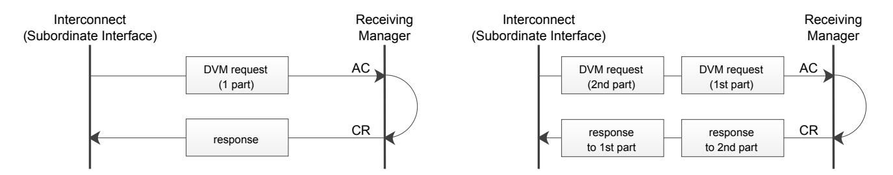

**Figure A15.1: DVM message flows**

The following rules apply to two-part DVM messages:

- The requests are always sent as successive transfers, with no other message requests between them.
- A component issuing a two-part DVM message must be able to issue the second part of the message without requiring a response to the first part of the message.

### <span id="page-248-0"></span>**A15.4.1 Signaling for DVM messages**

Snoop channels for DVM messages use the same transport as the other AXI channels as determined by the AXI\_Transport property. See [A2.2](#page-27-0) *[AXI transport options](#page-27-0)* for more details on transport.

DVM message requests use the snoop request channel from a Subordinate to a Manager interface. Table [A15.17](#page-248-1) shows the signals that can be included in the snoop request channel.

**Table A15.17: Snoop request channel**

<span id="page-248-1"></span>

| Name      | Width      | Source      | Presence                                                         | Description                                                 |
|-----------|------------|-------------|------------------------------------------------------------------|-------------------------------------------------------------|
| ACVALID   | 1          | Subordinate | DVM_Message_Support                                              | DVM message request valid<br>indicator.                     |
| ACREADY   | 1          | Manager     | DVM_Message_Support and<br>AXI_Transport == Ready                | DVM message request ready<br>indicator.                     |
| ACPENDING | 1          | Subordinate | DVM_Message_Support and<br>AXI_Transport == Credited             | Pending signal for the AC<br>channel.                       |
| ACCRDT    | 1          | Manager     | DVM_Message_Support and<br>AXI_Transport == Credited             | Asserted high to give one<br>DVM message request<br>credit. |
| ACADDR    | ADDR_WIDTH | Subordinate | DVM_Message_Support                                              | Used to carry the payload<br>for DVM message requests.      |
| ACVMIDEXT | 4          | Subordinate | DVM_Message_Support and<br>(DVM_v8.1 or DVM_v8.4 or<br>DVM_v9.2) | Extension to support 16-bit<br>VMID in DVM messages.        |
| ACTRACE   | 1          | Subordinate | DVM_Message_Support and<br>Trace_Signals                         | Trace signal for the AC<br>channel.                         |

<span id="page-248-5"></span><span id="page-248-4"></span><span id="page-248-3"></span><span id="page-248-2"></span>The response to a DVM request is transported on the snoop response channel from a Manager to a Subordinate interface. Table [A15.18](#page-248-2) shows the signals that can be included in the snoop response channel.

**Table A15.18: Snoop response channel**

| Name      | Width | Source      | Presence                                             | Description                                                  |
|-----------|-------|-------------|------------------------------------------------------|--------------------------------------------------------------|
| CRVALID   | 1     | Manager     | DVM_Message_Support                                  | DVM message response<br>valid indicator.                     |
| CRREADY   | 1     | Subordinate | DVM_Message_Support and<br>AXI_Transport == Ready    | DVM message response<br>ready indicator.                     |
| CRPENDING | 1     | Manager     | DVM_Message_Support and<br>AXI_Transport == Credited | Pending signal for the CR<br>channel.                        |
| CRCRDT    | 1     | Subordinate | DVM_Message_Support and<br>AXI_Transport == Credited | Asserted high to give one<br>DVM message response<br>credit. |
| CRTRACE   | 1     | Manager     | DVM_Message_Support and<br>Trace_Signals             | Trace signal for the CR<br>channel.                          |

<span id="page-248-6"></span>A DVM response acknowledges that the request has been received but does not indicate the success or failure of a

DVM message. Reordering is not supported on the AC or CR channels, so responses are returned in the same order as the AC requests were issued.

The ACTRACE and CRTRACE signals act the same as trace signals on other channels, see [A12.3](#page-198-0) *[Trace signals](#page-198-0)* for more information.

### <span id="page-249-0"></span>**A15.4.2 Snoop channels using Valid-Ready transport**

When using a Valid-Ready transport, the following rules apply:

- ACVALID must only be asserted by a Subordinate when there is valid address and control information.
- When asserted, ACVALID must remain asserted until the rising clock edge after the Manager asserts the ACREADY signal.
- CRVALID is asserted to indicate that the Manager has acknowledged the DVM message.
- When asserted, CRVALID must remain asserted until the rising clock edge after the Subordinate asserts the CRREADY signal.

The rules for dependencies between the snoop request and response channels are listed below and illustrated in [Figure](#page-249-3) [A15.2.](#page-249-3)

- The Subordinate must not wait for the Manager to assert ACREADY before asserting ACVALID.
- The Manager can wait for ACVALID to be asserted before it asserts ACREADY.
- The Manager can assert ACREADY before ACVALID is asserted.
- The Manager must wait for both ACVALID and ACREADY to be asserted before it asserts CRVALID to indicate that a valid response is available.
- The Manager must not wait for the Subordinate to assert CRREADY before asserting CRVALID.
- The Subordinate can wait for CRVALID to be asserted before it asserts CRREADY.
- <span id="page-249-3"></span>• The Subordinate can assert CRREADY before CRVALID is asserted.

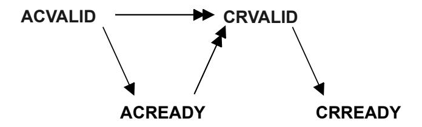

**Figure A15.2: Snoop transaction handshake dependencies**

### <span id="page-249-1"></span>**A15.4.3 Snoop channels using credited transport**

When using credited transport, the rules of [A2.4](#page-32-0) *[Credited transport](#page-32-0)* and [A2.4.4](#page-37-0) *[Transfer-level clock gating](#page-37-0)* apply to the snoop channels. In addition:

- The Manager must wait for a DVM message request before sending a DVM message response.
- Multiple Resource Planes and shared credits are not supported on the snoop channels.

### <span id="page-249-2"></span>**A15.4.4 Address widths in DVM messages**

The property ADDR\_WIDTH is used to specify the width of ARADDR, AWADDR, and ACADDR. This sets the physical address width used by an interface.

<span id="page-250-1"></span>The ACADDR signal is also used to transport the Virtual Address (VA), so the required VA width also sets a minimum constraint on ADDR\_WIDTH. Table [A15.19](#page-250-1) shows some common VA widths and the minimum ADDR\_WIDTH required.

**Table A15.19: Common VA widths and minimum ADDR\_WIDTH**

| VA width | Minimum<br>ADDR_WIDTH |
|----------|-----------------------|
| 32       | 32                    |
| 41       | 40                    |
| 49       | 44                    |
| 53       | 48                    |
| 57       | 48                    |

VA widths greater than 57-bits are not supported.

If the PA width exceeds the VA width, then virtual address operations might receive additional address information in a DVM message. In this case, any additional address information must be ignored and operations performed using only the supported address bits.

If a component supports a larger VA width than its PA width, the component must take appropriate action regarding the additional physical address bits. See [A3.1.5](#page-48-0) *[Transfer address](#page-48-0)* for more details on mismatched address widths.

### <span id="page-250-2"></span><span id="page-250-0"></span>**A15.4.5 Mapping message fields to signals**

The fields in DVM messages are transported using bits of the ACADDR and ACVMIDEXT signals.

There are different mappings for each message type, shown in the tables below. The bit position allocation might appear irregular but is used to ease the translation between implementations with different address widths.

For Hint messages, the Completion (0b0) and DVMType (0b110) fields are at ACADDR[15] and ACADDR[14:12] respectively, other mappings are IMPLEMENTATION DEFINED.

The mappings for TLB Invalidate messages are shown in Table [A15.20.](#page-251-0)

**Table A15.20: Field mappings for TLB Invalidate messages**

<span id="page-251-0"></span>

| 0b0<br>0b0<br>0b0<br>0b0<br>0b0<br>ACADDR[51]<br>0b0<br>0b0<br>0b0<br>0b0<br>0b0<br>ACADDR[50]<br>0b0<br>0b0<br>0b0<br>0b0<br>0b0<br>ACADDR[49]<br>0b0<br>0b0<br>0b0<br>0b0<br>0b0<br>ACADDR[48]<br>0b0<br>0b0<br>ACADDR[47]<br>VA[56]<br>VA[52]<br>VA[52]<br>0b0<br>0b0<br>ACADDR[46]<br>VA[55]<br>VA[51]<br>VA[51]<br>0b0<br>0b0<br>ACADDR[45]<br>VA[54]<br>VA[50]<br>VA[50]<br>0b0<br>0b0<br>ACADDR[44]<br>VA[53]<br>VA[49]<br>VA[49]<br>0b0<br>ACADDR[43]<br>VMID[15]<br>VA[48]<br>VA[44]<br>VA[44]<br>0b0<br>ACADDR[42]<br>VMID[14]<br>VA[47]<br>VA[43]<br>VA[43]<br>0b0<br>ACADDR[41]<br>VMID[13]<br>VA[46]<br>VA[42]<br>VA[42]<br>0b0<br>ACADDR[40]<br>VMID[12]<br>VA[45]<br>VA[41]<br>VA[41]<br>0b0<br>ACADDR[39]<br>ASID[15]<br>ASID[15]<br>VA[39]<br>VA[39]<br>0b0<br>ACADDR[38]<br>ASID[14]<br>ASID[14]<br>VA[38]<br>VA[38]<br>0b0<br>ACADDR[37]<br>ASID[13]<br>ASID[13]<br>VA[37]<br>VA[37]<br>0b0<br>ACADDR[36]<br>ASID[12]<br>ASID[12]<br>VA[36]<br>VA[36]<br>0b0<br>ACADDR[35]<br>ASID[11]<br>ASID[11]<br>VA[35]<br>VA[35]<br>0b0<br>ACADDR[34]<br>ASID[10]<br>ASID[10]<br>VA[34]<br>VA[34]<br>0b0<br>ACADDR[33]<br>ASID[9]<br>ASID[9]<br>VA[33]<br>VA[33]<br>0b0<br>ACADDR[32]<br>ASID[8]<br>ASID[8]<br>VA[32]<br>VA[32]<br>0b0<br>ACADDR[31]<br>VMID[7]<br>VMID[7]<br>VA[31]<br>VA[31]<br>0b0<br>ACADDR[30]<br>VMID[6]<br>VMID[6]<br>VA[30]<br>VA[30]<br>0b0<br>ACADDR[29]<br>VMID[5]<br>VMID[5]<br>VA[29]<br>VA[29]<br>0b0<br>ACADDR[28]<br>VMID[4]<br>VMID[4]<br>VA[28]<br>VA[28]<br>0b0<br>ACADDR[27]<br>VMID[3]<br>VMID[3]<br>VA[27]<br>VA[27] | GPT TLBI<br>GPT TLBI<br>1st part<br>2nd part |
|---------------------------------------------------------------------------------------------------------------------------------------------------------------------------------------------------------------------------------------------------------------------------------------------------------------------------------------------------------------------------------------------------------------------------------------------------------------------------------------------------------------------------------------------------------------------------------------------------------------------------------------------------------------------------------------------------------------------------------------------------------------------------------------------------------------------------------------------------------------------------------------------------------------------------------------------------------------------------------------------------------------------------------------------------------------------------------------------------------------------------------------------------------------------------------------------------------------------------------------------------------------------------------------------------------------------------------------------------------------------------------------------------------------------------------------------------------------------------------------------------------------------------------------------------------------------|----------------------------------------------|
|                                                                                                                                                                                                                                                                                                                                                                                                                                                                                                                                                                                                                                                                                                                                                                                                                                                                                                                                                                                                                                                                                                                                                                                                                                                                                                                                                                                                                                                                                                                                                                     | PA[51]                                       |
|                                                                                                                                                                                                                                                                                                                                                                                                                                                                                                                                                                                                                                                                                                                                                                                                                                                                                                                                                                                                                                                                                                                                                                                                                                                                                                                                                                                                                                                                                                                                                                     | PA[50]                                       |
|                                                                                                                                                                                                                                                                                                                                                                                                                                                                                                                                                                                                                                                                                                                                                                                                                                                                                                                                                                                                                                                                                                                                                                                                                                                                                                                                                                                                                                                                                                                                                                     | PA[49]                                       |
|                                                                                                                                                                                                                                                                                                                                                                                                                                                                                                                                                                                                                                                                                                                                                                                                                                                                                                                                                                                                                                                                                                                                                                                                                                                                                                                                                                                                                                                                                                                                                                     | PA[48]                                       |
|                                                                                                                                                                                                                                                                                                                                                                                                                                                                                                                                                                                                                                                                                                                                                                                                                                                                                                                                                                                                                                                                                                                                                                                                                                                                                                                                                                                                                                                                                                                                                                     | PA[47]                                       |
|                                                                                                                                                                                                                                                                                                                                                                                                                                                                                                                                                                                                                                                                                                                                                                                                                                                                                                                                                                                                                                                                                                                                                                                                                                                                                                                                                                                                                                                                                                                                                                     | PA[46]                                       |
|                                                                                                                                                                                                                                                                                                                                                                                                                                                                                                                                                                                                                                                                                                                                                                                                                                                                                                                                                                                                                                                                                                                                                                                                                                                                                                                                                                                                                                                                                                                                                                     | PA[45]                                       |
|                                                                                                                                                                                                                                                                                                                                                                                                                                                                                                                                                                                                                                                                                                                                                                                                                                                                                                                                                                                                                                                                                                                                                                                                                                                                                                                                                                                                                                                                                                                                                                     | PA[44]                                       |
|                                                                                                                                                                                                                                                                                                                                                                                                                                                                                                                                                                                                                                                                                                                                                                                                                                                                                                                                                                                                                                                                                                                                                                                                                                                                                                                                                                                                                                                                                                                                                                     | PA[43]                                       |
|                                                                                                                                                                                                                                                                                                                                                                                                                                                                                                                                                                                                                                                                                                                                                                                                                                                                                                                                                                                                                                                                                                                                                                                                                                                                                                                                                                                                                                                                                                                                                                     | PA[42]                                       |
|                                                                                                                                                                                                                                                                                                                                                                                                                                                                                                                                                                                                                                                                                                                                                                                                                                                                                                                                                                                                                                                                                                                                                                                                                                                                                                                                                                                                                                                                                                                                                                     | PA[41]                                       |
|                                                                                                                                                                                                                                                                                                                                                                                                                                                                                                                                                                                                                                                                                                                                                                                                                                                                                                                                                                                                                                                                                                                                                                                                                                                                                                                                                                                                                                                                                                                                                                     | PA[40]                                       |
|                                                                                                                                                                                                                                                                                                                                                                                                                                                                                                                                                                                                                                                                                                                                                                                                                                                                                                                                                                                                                                                                                                                                                                                                                                                                                                                                                                                                                                                                                                                                                                     | PA[39]                                       |
|                                                                                                                                                                                                                                                                                                                                                                                                                                                                                                                                                                                                                                                                                                                                                                                                                                                                                                                                                                                                                                                                                                                                                                                                                                                                                                                                                                                                                                                                                                                                                                     | PA[38]                                       |
|                                                                                                                                                                                                                                                                                                                                                                                                                                                                                                                                                                                                                                                                                                                                                                                                                                                                                                                                                                                                                                                                                                                                                                                                                                                                                                                                                                                                                                                                                                                                                                     | PA[37]                                       |
|                                                                                                                                                                                                                                                                                                                                                                                                                                                                                                                                                                                                                                                                                                                                                                                                                                                                                                                                                                                                                                                                                                                                                                                                                                                                                                                                                                                                                                                                                                                                                                     | PA[36]                                       |
|                                                                                                                                                                                                                                                                                                                                                                                                                                                                                                                                                                                                                                                                                                                                                                                                                                                                                                                                                                                                                                                                                                                                                                                                                                                                                                                                                                                                                                                                                                                                                                     | PA[35]                                       |
|                                                                                                                                                                                                                                                                                                                                                                                                                                                                                                                                                                                                                                                                                                                                                                                                                                                                                                                                                                                                                                                                                                                                                                                                                                                                                                                                                                                                                                                                                                                                                                     | PA[34]                                       |
|                                                                                                                                                                                                                                                                                                                                                                                                                                                                                                                                                                                                                                                                                                                                                                                                                                                                                                                                                                                                                                                                                                                                                                                                                                                                                                                                                                                                                                                                                                                                                                     | PA[33]                                       |
|                                                                                                                                                                                                                                                                                                                                                                                                                                                                                                                                                                                                                                                                                                                                                                                                                                                                                                                                                                                                                                                                                                                                                                                                                                                                                                                                                                                                                                                                                                                                                                     | PA[32]                                       |
|                                                                                                                                                                                                                                                                                                                                                                                                                                                                                                                                                                                                                                                                                                                                                                                                                                                                                                                                                                                                                                                                                                                                                                                                                                                                                                                                                                                                                                                                                                                                                                     | PA[31]                                       |
|                                                                                                                                                                                                                                                                                                                                                                                                                                                                                                                                                                                                                                                                                                                                                                                                                                                                                                                                                                                                                                                                                                                                                                                                                                                                                                                                                                                                                                                                                                                                                                     | PA[30]                                       |
|                                                                                                                                                                                                                                                                                                                                                                                                                                                                                                                                                                                                                                                                                                                                                                                                                                                                                                                                                                                                                                                                                                                                                                                                                                                                                                                                                                                                                                                                                                                                                                     | PA[29]                                       |
|                                                                                                                                                                                                                                                                                                                                                                                                                                                                                                                                                                                                                                                                                                                                                                                                                                                                                                                                                                                                                                                                                                                                                                                                                                                                                                                                                                                                                                                                                                                                                                     | PA[28]                                       |
|                                                                                                                                                                                                                                                                                                                                                                                                                                                                                                                                                                                                                                                                                                                                                                                                                                                                                                                                                                                                                                                                                                                                                                                                                                                                                                                                                                                                                                                                                                                                                                     | PA[27]                                       |
| 0b0<br>ACADDR[26]<br>VMID[2]<br>VMID[2]<br>VA[26]<br>VA[26]                                                                                                                                                                                                                                                                                                                                                                                                                                                                                                                                                                                                                                                                                                                                                                                                                                                                                                                                                                                                                                                                                                                                                                                                                                                                                                                                                                                                                                                                                                         | PA[26]                                       |
| 0b0<br>ACADDR[25]<br>VMID[1]<br>VMID[1]<br>VA[25]<br>VA[25]                                                                                                                                                                                                                                                                                                                                                                                                                                                                                                                                                                                                                                                                                                                                                                                                                                                                                                                                                                                                                                                                                                                                                                                                                                                                                                                                                                                                                                                                                                         | PA[25]                                       |
| 0b0<br>ACADDR[24]<br>VMID[0]<br>VMID[0]<br>VA[24]<br>VA[24]                                                                                                                                                                                                                                                                                                                                                                                                                                                                                                                                                                                                                                                                                                                                                                                                                                                                                                                                                                                                                                                                                                                                                                                                                                                                                                                                                                                                                                                                                                         | PA[24]                                       |
| 0b0<br>ACADDR[23]<br>ASID[7]<br>ASID[7]<br>VA[23]<br>VA[23]                                                                                                                                                                                                                                                                                                                                                                                                                                                                                                                                                                                                                                                                                                                                                                                                                                                                                                                                                                                                                                                                                                                                                                                                                                                                                                                                                                                                                                                                                                         | PA[23]                                       |
| 0b0<br>ACADDR[22]<br>ASID[6]<br>ASID[6]<br>VA[22]<br>VA[22]                                                                                                                                                                                                                                                                                                                                                                                                                                                                                                                                                                                                                                                                                                                                                                                                                                                                                                                                                                                                                                                                                                                                                                                                                                                                                                                                                                                                                                                                                                         | PA[22]                                       |
| 0b0<br>ACADDR[21]<br>ASID[5]<br>ASID[5]<br>VA[21]<br>VA[21]                                                                                                                                                                                                                                                                                                                                                                                                                                                                                                                                                                                                                                                                                                                                                                                                                                                                                                                                                                                                                                                                                                                                                                                                                                                                                                                                                                                                                                                                                                         | PA[21]                                       |

Table A15.20 – *Continued from previous page*

| Signal       | TLBI 1-part         | TLBI 1st of<br>2-part | TLBI 2nd<br>part by VA<br>or IPA | TLBI 2nd<br>part by range | GPT TLBI<br>1st part | GPT TLBI<br>2nd part |
|--------------|---------------------|-----------------------|----------------------------------|---------------------------|----------------------|----------------------|
| ACADDR[20]   | ASID[4]             | ASID[4]               | VA[20]                           | VA[20]                    | 0b0                  | PA[20]               |
| ACADDR[19]   | ASID[3]             | ASID[3]               | VA[19]                           | VA[19]                    | 0b0                  | PA[19]               |
| ACADDR[18]   | ASID[2]             | ASID[2]               | VA[18]                           | VA[18]                    | 0b0                  | PA[18]               |
| ACADDR[17]   | ASID[1]             | ASID[1]               | VA[17]                           | VA[17]                    | 0b0                  | PA[17]               |
| ACADDR[16]   | ASID[0]             | ASID[0]               | VA[16]                           | VA[16]                    | 0b0                  | PA[16]               |
| ACADDR[15]   | 0b0<br>(Completion) | 0b0<br>(Completion)   | VA[15]                           | VA[15]                    | 0b0<br>(Completion)  | PA[15]               |
| ACADDR[14]   | 0b0<br>(DVMType[2]) | 0b0<br>(DVMType[2])   | VA[14]                           | VA[14]                    | 0b0<br>(DVMType[2])  | PA[14]               |
| ACADDR[13]   | 0b0<br>(DVMType[1]) | 0b0<br>(DVMType[1])   | VA[13]                           | VA[13]                    | 0b0<br>(DVMType[1])  | PA[13]               |
| ACADDR[12]   | 0b0<br>(DVMType[0]) | 0b0<br>(DVMType[0])   | VA[12]                           | VA[12]                    | 0b0<br>(DVMType[0])  | PA[12]               |
| ACADDR[11]   | Exception[1]        | Exception[1]          | TG[1]                            | TG[1]                     | Exception[1]         | IS[3]                |
| ACADDR[10]   | Exception[0]        | Exception[0]          | TG[0]                            | TG[0]                     | Exception[0]         | IS[2]                |
| ACADDR[9]    | Security[1]         | Security[1]           | TTL[1]                           | TTL[1]                    | Security[1]          | IS[1]                |
| ACADDR[8]    | Security[0]         | Security[0]           | TTL[0]                           | TTL[0]                    | Security[0]          | IS[0]                |
| ACADDR[7]    | 0b0 (Range)         | Range                 | 0b0                              | Scale[1]                  | Range                | 0b0                  |
| ACADDR[6]    | VMIDV               | VMIDV                 | 0b0                              | Scale[0]                  | 0b0<br>(VMIDV)       | 0b0                  |
| ACADDR[5]    | ASIDV               | ASIDV                 | 0b0                              | Num[4]                    | 0b0 (ASIDV)          | 0b0                  |
| ACADDR[4]    | 0b0                 | Leaf                  | 0b0                              | Num[3]                    | Leaf                 | 0b0                  |
| ACADDR[3]    | Stage[1]            | Stage[1]              | VA[40]                           | VA[40]                    | Stage[1]             | 0b0                  |
| ACADDR[2]    | Stage[0]            | Stage[0]              | 0b0                              | Num[2]                    | Stage[0]             | 0b0                  |
| ACADDR[1]    | 0b0                 | 0b0                   | 0b0                              | Num[1]                    | 0b0                  | 0b0                  |
| ACADDR[0]    | 0b0 (Addr)          | 0b1 (Addr)            | 0b0                              | Num[0]                    | Addr                 | 0b0                  |
| ACVMIDEXT[3] | VMID[11]            | VMID[11]              | VMID[15]                         | VMID[15]                  | 0b0                  | 0b0                  |
| ACVMIDEXT[2] | VMID[10]            | VMID[10]              | VMID[14]                         | VMID[14]                  | 0b0                  | 0b0                  |
| ACVMIDEXT[1] | VMID[9]             | VMID[9]               | VMID[13]                         | VMID[13]                  | 0b0                  | 0b0                  |
| ACVMIDEXT[0] | VMID[8]             | VMID[8]               | VMID[12]                         | VMID[12]                  | 0b0                  | 0b0                  |

<span id="page-253-0"></span>The mappings for Branch Predictor Invalidate and Sync messages are shown in Table [A15.21.](#page-253-0)

**Table A15.21: Field mappings for BPI and Sync messages**

| 0b0<br>0b0<br>0b0<br>ACADDR[51]<br>0b0<br>0b0<br>0b0<br>ACADDR[50]<br>0b0<br>0b0<br>0b0<br>ACADDR[49]<br>0b0<br>0b0<br>0b0<br>ACADDR[48]<br>0b0<br>ACADDR[47]<br>VA[56]<br>VA[52]<br>0b0<br>ACADDR[46]<br>VA[55]<br>VA[51]<br>0b0<br>ACADDR[45]<br>VA[54]<br>VA[50]<br>0b0<br>ACADDR[44]<br>VA[53]<br>VA[49]<br>0b0<br>ACADDR[43]<br>VA[48]<br>VA[44]<br>0b0<br>ACADDR[42]<br>VA[47]<br>VA[43]<br>0b0<br>ACADDR[41]<br>VA[46]<br>VA[42]<br>0b0<br>ACADDR[40]<br>VA[45]<br>VA[41]<br>0b0<br>0b0<br>ACADDR[39]<br>VA[39]<br>0b0<br>0b0<br>ACADDR[38]<br>VA[38]<br>0b0<br>0b0<br>ACADDR[37]<br>VA[37]<br>0b0<br>0b0<br>ACADDR[36]<br>VA[36]<br>0b0<br>0b0<br>ACADDR[35]<br>VA[35]<br>0b0<br>0b0<br>ACADDR[34]<br>VA[34]<br>0b0<br>0b0<br>ACADDR[33]<br>VA[33]<br>0b0<br>0b0<br>ACADDR[32]<br>VA[32]<br>0b0<br>0b0<br>ACADDR[31]<br>VA[31]<br>0b0<br>0b0<br>ACADDR[30]<br>VA[30]<br>0b0<br>0b0<br>ACADDR[29]<br>VA[29]<br>0b0<br>0b0<br>ACADDR[28]<br>VA[28]<br>0b0<br>0b0<br>ACADDR[27]<br>VA[27]<br>0b0<br>0b0<br>ACADDR[26]<br>VA[26]<br>0b0<br>0b0<br>ACADDR[25]<br>VA[25]<br>0b0<br>0b0<br>ACADDR[24]<br>VA[24]<br>0b0<br>0b0<br>ACADDR[23]<br>VA[23]<br>0b0<br>0b0<br>ACADDR[22]<br>VA[22] | Signal     | BPI all or Sync | BPI by VA 1st part | BPI by VA 2nd part |
|----------------------------------------------------------------------------------------------------------------------------------------------------------------------------------------------------------------------------------------------------------------------------------------------------------------------------------------------------------------------------------------------------------------------------------------------------------------------------------------------------------------------------------------------------------------------------------------------------------------------------------------------------------------------------------------------------------------------------------------------------------------------------------------------------------------------------------------------------------------------------------------------------------------------------------------------------------------------------------------------------------------------------------------------------------------------------------------------------------------------------------------------------------------------------------------------|------------|-----------------|--------------------|--------------------|
|                                                                                                                                                                                                                                                                                                                                                                                                                                                                                                                                                                                                                                                                                                                                                                                                                                                                                                                                                                                                                                                                                                                                                                                              |            |                 |                    |                    |
|                                                                                                                                                                                                                                                                                                                                                                                                                                                                                                                                                                                                                                                                                                                                                                                                                                                                                                                                                                                                                                                                                                                                                                                              |            |                 |                    |                    |
|                                                                                                                                                                                                                                                                                                                                                                                                                                                                                                                                                                                                                                                                                                                                                                                                                                                                                                                                                                                                                                                                                                                                                                                              |            |                 |                    |                    |
|                                                                                                                                                                                                                                                                                                                                                                                                                                                                                                                                                                                                                                                                                                                                                                                                                                                                                                                                                                                                                                                                                                                                                                                              |            |                 |                    |                    |
|                                                                                                                                                                                                                                                                                                                                                                                                                                                                                                                                                                                                                                                                                                                                                                                                                                                                                                                                                                                                                                                                                                                                                                                              |            |                 |                    |                    |
|                                                                                                                                                                                                                                                                                                                                                                                                                                                                                                                                                                                                                                                                                                                                                                                                                                                                                                                                                                                                                                                                                                                                                                                              |            |                 |                    |                    |
|                                                                                                                                                                                                                                                                                                                                                                                                                                                                                                                                                                                                                                                                                                                                                                                                                                                                                                                                                                                                                                                                                                                                                                                              |            |                 |                    |                    |
|                                                                                                                                                                                                                                                                                                                                                                                                                                                                                                                                                                                                                                                                                                                                                                                                                                                                                                                                                                                                                                                                                                                                                                                              |            |                 |                    |                    |
|                                                                                                                                                                                                                                                                                                                                                                                                                                                                                                                                                                                                                                                                                                                                                                                                                                                                                                                                                                                                                                                                                                                                                                                              |            |                 |                    |                    |
|                                                                                                                                                                                                                                                                                                                                                                                                                                                                                                                                                                                                                                                                                                                                                                                                                                                                                                                                                                                                                                                                                                                                                                                              |            |                 |                    |                    |
|                                                                                                                                                                                                                                                                                                                                                                                                                                                                                                                                                                                                                                                                                                                                                                                                                                                                                                                                                                                                                                                                                                                                                                                              |            |                 |                    |                    |
|                                                                                                                                                                                                                                                                                                                                                                                                                                                                                                                                                                                                                                                                                                                                                                                                                                                                                                                                                                                                                                                                                                                                                                                              |            |                 |                    |                    |
|                                                                                                                                                                                                                                                                                                                                                                                                                                                                                                                                                                                                                                                                                                                                                                                                                                                                                                                                                                                                                                                                                                                                                                                              |            |                 |                    |                    |
|                                                                                                                                                                                                                                                                                                                                                                                                                                                                                                                                                                                                                                                                                                                                                                                                                                                                                                                                                                                                                                                                                                                                                                                              |            |                 |                    |                    |
|                                                                                                                                                                                                                                                                                                                                                                                                                                                                                                                                                                                                                                                                                                                                                                                                                                                                                                                                                                                                                                                                                                                                                                                              |            |                 |                    |                    |
|                                                                                                                                                                                                                                                                                                                                                                                                                                                                                                                                                                                                                                                                                                                                                                                                                                                                                                                                                                                                                                                                                                                                                                                              |            |                 |                    |                    |
|                                                                                                                                                                                                                                                                                                                                                                                                                                                                                                                                                                                                                                                                                                                                                                                                                                                                                                                                                                                                                                                                                                                                                                                              |            |                 |                    |                    |
|                                                                                                                                                                                                                                                                                                                                                                                                                                                                                                                                                                                                                                                                                                                                                                                                                                                                                                                                                                                                                                                                                                                                                                                              |            |                 |                    |                    |
|                                                                                                                                                                                                                                                                                                                                                                                                                                                                                                                                                                                                                                                                                                                                                                                                                                                                                                                                                                                                                                                                                                                                                                                              |            |                 |                    |                    |
|                                                                                                                                                                                                                                                                                                                                                                                                                                                                                                                                                                                                                                                                                                                                                                                                                                                                                                                                                                                                                                                                                                                                                                                              |            |                 |                    |                    |
|                                                                                                                                                                                                                                                                                                                                                                                                                                                                                                                                                                                                                                                                                                                                                                                                                                                                                                                                                                                                                                                                                                                                                                                              |            |                 |                    |                    |
|                                                                                                                                                                                                                                                                                                                                                                                                                                                                                                                                                                                                                                                                                                                                                                                                                                                                                                                                                                                                                                                                                                                                                                                              |            |                 |                    |                    |
|                                                                                                                                                                                                                                                                                                                                                                                                                                                                                                                                                                                                                                                                                                                                                                                                                                                                                                                                                                                                                                                                                                                                                                                              |            |                 |                    |                    |
|                                                                                                                                                                                                                                                                                                                                                                                                                                                                                                                                                                                                                                                                                                                                                                                                                                                                                                                                                                                                                                                                                                                                                                                              |            |                 |                    |                    |
|                                                                                                                                                                                                                                                                                                                                                                                                                                                                                                                                                                                                                                                                                                                                                                                                                                                                                                                                                                                                                                                                                                                                                                                              |            |                 |                    |                    |
|                                                                                                                                                                                                                                                                                                                                                                                                                                                                                                                                                                                                                                                                                                                                                                                                                                                                                                                                                                                                                                                                                                                                                                                              |            |                 |                    |                    |
|                                                                                                                                                                                                                                                                                                                                                                                                                                                                                                                                                                                                                                                                                                                                                                                                                                                                                                                                                                                                                                                                                                                                                                                              |            |                 |                    |                    |
|                                                                                                                                                                                                                                                                                                                                                                                                                                                                                                                                                                                                                                                                                                                                                                                                                                                                                                                                                                                                                                                                                                                                                                                              |            |                 |                    |                    |
|                                                                                                                                                                                                                                                                                                                                                                                                                                                                                                                                                                                                                                                                                                                                                                                                                                                                                                                                                                                                                                                                                                                                                                                              |            |                 |                    |                    |
|                                                                                                                                                                                                                                                                                                                                                                                                                                                                                                                                                                                                                                                                                                                                                                                                                                                                                                                                                                                                                                                                                                                                                                                              |            |                 |                    |                    |
|                                                                                                                                                                                                                                                                                                                                                                                                                                                                                                                                                                                                                                                                                                                                                                                                                                                                                                                                                                                                                                                                                                                                                                                              | ACADDR[21] | 0b0             | 0b0                | VA[21]             |

Table A15.21 – *Continued from previous page*

| Signal       | BPI all or Sync    | BPI by VA 1st part | BPI by VA 2nd part |
|--------------|--------------------|--------------------|--------------------|
| ACADDR[20]   | 0b0                | 0b0                | VA[20]             |
| ACADDR[19]   | 0b0                | 0b0                | VA[19]             |
| ACADDR[18]   | 0b0                | 0b0                | VA[18]             |
| ACADDR[17]   | 0b0                | 0b0                | VA[17]             |
| ACADDR[16]   | 0b0                | 0b0                | VA[16]             |
| ACADDR[15]   | Completion         | 0b0 (Completion)   | VA[15]             |
| ACADDR[14]   | DVMType[2]         | 0b0 (DVMType[2])   | VA[14]             |
| ACADDR[13]   | DVMType[1]         | 0b0 (DVMType[1])   | VA[13]             |
| ACADDR[12]   | DVMType[0]         | 0b1 (DVMType[0])   | VA[12]             |
| ACADDR[11]   | 0b0 (Exception[1]) | 0b0 (Exception[1]) | VA[11]             |
| ACADDR[10]   | 0b0 (Exception[0]) | 0b0 (Exception[0]) | VA[10]             |
| ACADDR[9]    | 0b0 (Security[1])  | 0b0 (Security[1])  | VA[9]              |
| ACADDR[8]    | 0b0 (Security[0])  | 0b0 (Security[0])  | VA[8]              |
| ACADDR[7]    | 0b0 (Range)        | 0b0 (Range)        | VA[7]              |
| ACADDR[6]    | 0b0 (VMIDV)        | 0b0 (VMIDV)        | VA[6]              |
| ACADDR[5]    | 0b0 (ASIDV)        | 0b0 (ASIDV)        | VA[5]              |
| ACADDR[4]    | 0b0 (Leaf)         | 0b0 (Leaf)         | VA[4]              |
| ACADDR[3]    | 0b0 (Stage[1])     | 0b0 (Stage[1])     | VA[40]             |
| ACADDR[2]    | 0b0 (Stage[0])     | 0b0 (Stage[0])     | 0b0                |
| ACADDR[1]    | 0b0                | 0b0                | 0b0                |
| ACADDR[0]    | 0b0 (Addr)         | 0b1 (Addr)         | 0b0                |
| ACVMIDEXT[3] | 0b0                | 0b0                | 0b0                |
| ACVMIDEXT[2] | 0b0                | 0b0                | 0b0                |
| ACVMIDEXT[1] | 0b0                | 0b0                | 0b0                |
| ACVMIDEXT[0] | 0b0                | 0b0                | 0b0                |
|              |                    |                    |                    |

The mappings for Instruction Cache Invalidation messages are shown in Table [A15.22.](#page-255-0)

**Table A15.22: Field mappings for VICI and PICI messages**

<span id="page-255-0"></span>

| Signal     | VICI all | VICI by VA 1st<br>part | VICI by VA 2nd<br>part | PICI 1st part | PICI 2nd part |
|------------|----------|------------------------|------------------------|---------------|---------------|
| ACADDR[51] | 0b0      | 0b0                    | 0b0                    | 0b0           | PA[51]        |
| ACADDR[50] | 0b0      | 0b0                    | 0b0                    | 0b0           | PA[50]        |
| ACADDR[49] | 0b0      | 0b0                    | 0b0                    | 0b0           | PA[49]        |
| ACADDR[48] | 0b0      | 0b0                    | 0b0                    | 0b0           | PA[48]        |
| ACADDR[47] | 0b0      | VA[56]                 | VA[52]                 | 0b0           | PA[47]        |
| ACADDR[46] | 0b0      | VA[55]                 | VA[51]                 | 0b0           | PA[46]        |
| ACADDR[45] | 0b0      | VA[54]                 | VA[50]                 | 0b0           | PA[45]        |
| ACADDR[44] | 0b0      | VA[53]                 | VA[49]                 | 0b0           | PA[44]        |
| ACADDR[43] | VMID[15] | VA[48]                 | VA[44]                 | 0b0           | PA[43]        |
| ACADDR[42] | VMID[14] | VA[47]                 | VA[43]                 | 0b0           | PA[42]        |
| ACADDR[41] | VMID[13] | VA[46]                 | VA[42]                 | 0b0           | PA[41]        |
| ACADDR[40] | VMID[12] | VA[45]                 | VA[41]                 | 0b0           | PA[40]        |
| ACADDR[39] | ASID[15] | ASID[15]               | VA[39]                 | 0b0           | PA[39]        |
| ACADDR[38] | ASID[14] | ASID[14]               | VA[38]                 | 0b0           | PA[38]        |
| ACADDR[37] | ASID[13] | ASID[13]               | VA[37]                 | 0b0           | PA[37]        |
| ACADDR[36] | ASID[12] | ASID[12]               | VA[36]                 | 0b0           | PA[36]        |
| ACADDR[35] | ASID[11] | ASID[11]               | VA[35]                 | 0b0           | PA[35]        |
| ACADDR[34] | ASID[10] | ASID[10]               | VA[34]                 | 0b0           | PA[34]        |
| ACADDR[33] | ASID[9]  | ASID[9]                | VA[33]                 | 0b0           | PA[33]        |
| ACADDR[32] | ASID[8]  | ASID[8]                | VA[32]                 | 0b0           | PA[32]        |
| ACADDR[31] | VMID[7]  | VMID[7]                | VA[31]                 | VI[27]        | PA[31]        |
| ACADDR[30] | VMID[6]  | VMID[6]                | VA[30]                 | VI[26]        | PA[30]        |
| ACADDR[29] | VMID[5]  | VMID[5]                | VA[29]                 | VI[25]        | PA[29]        |
| ACADDR[28] | VMID[4]  | VMID[4]                | VA[28]                 | VI[24]        | PA[28]        |
| ACADDR[27] | VMID[3]  | VMID[3]                | VA[27]                 | VI[23]        | PA[27]        |
| ACADDR[26] | VMID[2]  | VMID[2]                | VA[26]                 | VI[22]        | PA[26]        |
| ACADDR[25] | VMID[1]  | VMID[1]                | VA[25]                 | VI[21]        | PA[25]        |
| ACADDR[24] | VMID[0]  | VMID[0]                | VA[24]                 | VI[20]        | PA[24]        |
| ACADDR[23] | ASID[7]  | ASID[7]                | VA[23]                 | VI[19]        | PA[23]        |
| ACADDR[22] | ASID[6]  | ASID[6]                | VA[22]                 | VI[18]        | PA[22]        |
|            |          |                        |                        |               |               |

Table A15.22 – *Continued from previous page*

<span id="page-256-0"></span>

| ACADDR[21]<br>ASID[5]<br>ASID[5]<br>VA[21]<br>VI[17]<br>PA[21]<br>ACADDR[20]<br>ASID[4]<br>ASID[4]<br>VA[20]<br>VI[16]<br>PA[20]<br>ACADDR[19]<br>ASID[3]<br>ASID[3]<br>VA[19]<br>VI[15]<br>PA[19]<br>ACADDR[18]<br>ASID[2]<br>ASID[2]<br>VA[18]<br>VI[14]<br>PA[18]<br>ACADDR[17]<br>ASID[1]<br>ASID[1]<br>VA[17]<br>VI[13]<br>PA[17]<br>ACADDR[16]<br>ASID[0]<br>ASID[0]<br>VA[16]<br>VI[12]<br>PA[16]<br>0b0<br>0b0<br>0b0<br>ACADDR[15]<br>VA[15]<br>PA[15]<br>(Completion)<br>(Completion)<br>(Completion)<br>0b0<br>0b0<br>0b0<br>ACADDR[14]<br>VA[14]<br>PA[14]<br>(DVMType[2])<br>(DVMType[2])<br>(DVMType[2])<br>0b1<br>0b1<br>0b1<br>ACADDR[13]<br>VA[13]<br>PA[13]<br>(DVMType[1])<br>(DVMType[1])<br>(DVMType[1])<br>0b1<br>0b1<br>0b0<br>ACADDR[12]<br>VA[12]<br>PA[12]<br>(DVMType[0])<br>(DVMType[0])<br>(DVMType[0])<br>0b0<br>ACADDR[11]<br>Exception[1]<br>Exception[1]<br>VA[11]<br>PA[11]<br>(Exception[1])<br>0b0<br>ACADDR[10]<br>Exception[0]<br>Exception[0]<br>VA[10]<br>PA[10]<br>(Exception[0])<br>ACADDR[9]<br>Security[1]<br>Security[1]<br>VA[9]<br>Security[1]<br>PA[9]<br>ACADDR[8]<br>Security[0]<br>Security[0]<br>VA[8]<br>Security[0]<br>PA[8]<br>0b0 (Range)<br>0b0 (Range)<br>0b0 (Range)<br>ACADDR[7]<br>VA[7]<br>PA[7]<br>ACADDR[6]<br>VMIDV<br>VMIDV<br>VA[6]<br>VIV[1]<br>PA[6]<br>ACADDR[5]<br>ASIDV<br>ASIDV<br>VA[5]<br>VIV[0]<br>PA[5]<br>0b0 (Leaf)<br>0b0 (Leaf)<br>0b0<br>ACADDR[4]<br>VA[4]<br>PA[4]<br>0b0 (Stage[1])<br>0b0 (Stage[1])<br>0b0<br>0b0<br>ACADDR[3]<br>VA[40] | Signal | VICI all | VICI by VA 1st<br>part | VICI by VA 2nd<br>part | PICI 1st part | PICI 2nd part |
|---------------------------------------------------------------------------------------------------------------------------------------------------------------------------------------------------------------------------------------------------------------------------------------------------------------------------------------------------------------------------------------------------------------------------------------------------------------------------------------------------------------------------------------------------------------------------------------------------------------------------------------------------------------------------------------------------------------------------------------------------------------------------------------------------------------------------------------------------------------------------------------------------------------------------------------------------------------------------------------------------------------------------------------------------------------------------------------------------------------------------------------------------------------------------------------------------------------------------------------------------------------------------------------------------------------------------------------------------------------------------------------------------------------------------------------------------------------------------------------------------------------------------------|--------|----------|------------------------|------------------------|---------------|---------------|
|                                                                                                                                                                                                                                                                                                                                                                                                                                                                                                                                                                                                                                                                                                                                                                                                                                                                                                                                                                                                                                                                                                                                                                                                                                                                                                                                                                                                                                                                                                                                 |        |          |                        |                        |               |               |
|                                                                                                                                                                                                                                                                                                                                                                                                                                                                                                                                                                                                                                                                                                                                                                                                                                                                                                                                                                                                                                                                                                                                                                                                                                                                                                                                                                                                                                                                                                                                 |        |          |                        |                        |               |               |
|                                                                                                                                                                                                                                                                                                                                                                                                                                                                                                                                                                                                                                                                                                                                                                                                                                                                                                                                                                                                                                                                                                                                                                                                                                                                                                                                                                                                                                                                                                                                 |        |          |                        |                        |               |               |
|                                                                                                                                                                                                                                                                                                                                                                                                                                                                                                                                                                                                                                                                                                                                                                                                                                                                                                                                                                                                                                                                                                                                                                                                                                                                                                                                                                                                                                                                                                                                 |        |          |                        |                        |               |               |
|                                                                                                                                                                                                                                                                                                                                                                                                                                                                                                                                                                                                                                                                                                                                                                                                                                                                                                                                                                                                                                                                                                                                                                                                                                                                                                                                                                                                                                                                                                                                 |        |          |                        |                        |               |               |
|                                                                                                                                                                                                                                                                                                                                                                                                                                                                                                                                                                                                                                                                                                                                                                                                                                                                                                                                                                                                                                                                                                                                                                                                                                                                                                                                                                                                                                                                                                                                 |        |          |                        |                        |               |               |
|                                                                                                                                                                                                                                                                                                                                                                                                                                                                                                                                                                                                                                                                                                                                                                                                                                                                                                                                                                                                                                                                                                                                                                                                                                                                                                                                                                                                                                                                                                                                 |        |          |                        |                        |               |               |
|                                                                                                                                                                                                                                                                                                                                                                                                                                                                                                                                                                                                                                                                                                                                                                                                                                                                                                                                                                                                                                                                                                                                                                                                                                                                                                                                                                                                                                                                                                                                 |        |          |                        |                        |               |               |
|                                                                                                                                                                                                                                                                                                                                                                                                                                                                                                                                                                                                                                                                                                                                                                                                                                                                                                                                                                                                                                                                                                                                                                                                                                                                                                                                                                                                                                                                                                                                 |        |          |                        |                        |               |               |
|                                                                                                                                                                                                                                                                                                                                                                                                                                                                                                                                                                                                                                                                                                                                                                                                                                                                                                                                                                                                                                                                                                                                                                                                                                                                                                                                                                                                                                                                                                                                 |        |          |                        |                        |               |               |
|                                                                                                                                                                                                                                                                                                                                                                                                                                                                                                                                                                                                                                                                                                                                                                                                                                                                                                                                                                                                                                                                                                                                                                                                                                                                                                                                                                                                                                                                                                                                 |        |          |                        |                        |               |               |
|                                                                                                                                                                                                                                                                                                                                                                                                                                                                                                                                                                                                                                                                                                                                                                                                                                                                                                                                                                                                                                                                                                                                                                                                                                                                                                                                                                                                                                                                                                                                 |        |          |                        |                        |               |               |
|                                                                                                                                                                                                                                                                                                                                                                                                                                                                                                                                                                                                                                                                                                                                                                                                                                                                                                                                                                                                                                                                                                                                                                                                                                                                                                                                                                                                                                                                                                                                 |        |          |                        |                        |               |               |
|                                                                                                                                                                                                                                                                                                                                                                                                                                                                                                                                                                                                                                                                                                                                                                                                                                                                                                                                                                                                                                                                                                                                                                                                                                                                                                                                                                                                                                                                                                                                 |        |          |                        |                        |               |               |
|                                                                                                                                                                                                                                                                                                                                                                                                                                                                                                                                                                                                                                                                                                                                                                                                                                                                                                                                                                                                                                                                                                                                                                                                                                                                                                                                                                                                                                                                                                                                 |        |          |                        |                        |               |               |
|                                                                                                                                                                                                                                                                                                                                                                                                                                                                                                                                                                                                                                                                                                                                                                                                                                                                                                                                                                                                                                                                                                                                                                                                                                                                                                                                                                                                                                                                                                                                 |        |          |                        |                        |               |               |
|                                                                                                                                                                                                                                                                                                                                                                                                                                                                                                                                                                                                                                                                                                                                                                                                                                                                                                                                                                                                                                                                                                                                                                                                                                                                                                                                                                                                                                                                                                                                 |        |          |                        |                        |               |               |
|                                                                                                                                                                                                                                                                                                                                                                                                                                                                                                                                                                                                                                                                                                                                                                                                                                                                                                                                                                                                                                                                                                                                                                                                                                                                                                                                                                                                                                                                                                                                 |        |          |                        |                        |               |               |
|                                                                                                                                                                                                                                                                                                                                                                                                                                                                                                                                                                                                                                                                                                                                                                                                                                                                                                                                                                                                                                                                                                                                                                                                                                                                                                                                                                                                                                                                                                                                 |        |          |                        |                        |               |               |
| 0b0 (Stage[0])<br>0b0 (Stage[0])<br>0b0<br>0b0<br>0b0<br>ACADDR[2]                                                                                                                                                                                                                                                                                                                                                                                                                                                                                                                                                                                                                                                                                                                                                                                                                                                                                                                                                                                                                                                                                                                                                                                                                                                                                                                                                                                                                                                              |        |          |                        |                        |               |               |
| 0b0<br>0b0<br>0b0<br>0b0<br>0b0<br>ACADDR[1]                                                                                                                                                                                                                                                                                                                                                                                                                                                                                                                                                                                                                                                                                                                                                                                                                                                                                                                                                                                                                                                                                                                                                                                                                                                                                                                                                                                                                                                                                    |        |          |                        |                        |               |               |
| 0b0 (Addr)<br>0b1 (Addr)<br>0b0<br>0b0<br>ACADDR[0]<br>Addr                                                                                                                                                                                                                                                                                                                                                                                                                                                                                                                                                                                                                                                                                                                                                                                                                                                                                                                                                                                                                                                                                                                                                                                                                                                                                                                                                                                                                                                                     |        |          |                        |                        |               |               |
| 0b0<br>0b0<br>ACVMIDEXT[3]<br>VMID[11]<br>VMID[11]<br>VMID[15]                                                                                                                                                                                                                                                                                                                                                                                                                                                                                                                                                                                                                                                                                                                                                                                                                                                                                                                                                                                                                                                                                                                                                                                                                                                                                                                                                                                                                                                                  |        |          |                        |                        |               |               |
| 0b0<br>0b0<br>ACVMIDEXT[2]<br>VMID[10]<br>VMID[10]<br>VMID[14]                                                                                                                                                                                                                                                                                                                                                                                                                                                                                                                                                                                                                                                                                                                                                                                                                                                                                                                                                                                                                                                                                                                                                                                                                                                                                                                                                                                                                                                                  |        |          |                        |                        |               |               |
| 0b0<br>0b0<br>ACVMIDEXT[1]<br>VMID[9]<br>VMID[9]<br>VMID[13]                                                                                                                                                                                                                                                                                                                                                                                                                                                                                                                                                                                                                                                                                                                                                                                                                                                                                                                                                                                                                                                                                                                                                                                                                                                                                                                                                                                                                                                                    |        |          |                        |                        |               |               |
| 0b0<br>0b0<br>ACVMIDEXT[0]<br>VMID[8]<br>VMID[8]<br>VMID[12]                                                                                                                                                                                                                                                                                                                                                                                                                                                                                                                                                                                                                                                                                                                                                                                                                                                                                                                                                                                                                                                                                                                                                                                                                                                                                                                                                                                                                                                                    |        |          |                        |                        |               |               |

# <span id="page-257-1"></span><span id="page-257-0"></span>**A15.5 DVM Sync and Complete**

A DVM Sync message is used when the requester needs to know when all previous invalidations are complete.

A DVM Complete request is sent when a component has received a DVM Sync message and all preceding invalidation operations are complete. The following rules apply in determining when an operation is complete:

#### TLB Invalidate

Complete when a Manager can no longer use an invalidated translation and all previous transactions that could have used an invalidated translation are complete.

#### Branch Predictor Invalidate

Complete when cached copies of predicted instruction fetches have been invalidated and can no longer be accessed by the associated Manager. The invalidated cached copies might be from any virtual address or from a specified virtual address.

#### Instruction Cache Invalidate

Complete when cached instructions have been invalidated and can no longer be accessed by the associated Manager.

The synchronization flow between an interconnect and one receiving Manager is shown in [Figure](#page-257-2) [A15.3.](#page-257-2)

The process is:

- 1. The Manager acknowledges receipt of the DVM Sync message using the snoop response (CR) channel. This response must not be dependent on the forward progress of any transactions on the AR or AW channels.
- 2. The Manager must issue a DVM Complete request on the AR channel when it has completed all the necessary actions. This must be after the handshake of the associated DVM Sync on the snoop request channel of the same Manager. The Manager must send a DVM Complete in a timely manner, even if it continues to receive more DVM invalidation operations and more DVM Sync messages.
- <span id="page-257-2"></span>3. The interconnect component responds to the DVM Complete request using the read data (R) channel of the component that issued the DVM Complete. Read data is not valid in this response.

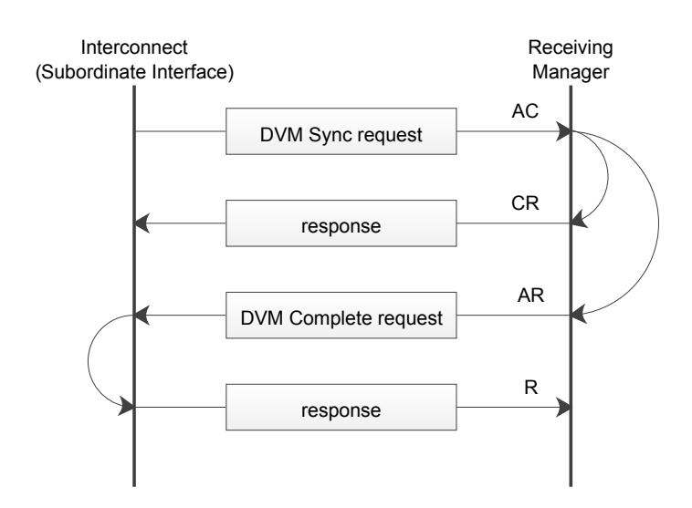

**Figure A15.3: DVM Synchronization flow**

Every DVM Sync message must have one corresponding DVM Complete request.

A DVM Complete request can only be sent if there is a corresponding DVM Sync message.

<span id="page-258-0"></span>A DVM Complete request is signaled on the AR channel, Table [A15.23](#page-258-0) shows the constraints on other AR channel signals if they are present.

**Table A15.23: DVM Complete request constraints**

| Signal     | Constraint                                                                                                  |
|------------|-------------------------------------------------------------------------------------------------------------|
| ARSNOOP    | Must be 0b1110.                                                                                             |
| ARADDR     | Must be zero.                                                                                               |
| ARID       | Must be different from that of any outstanding, non-DVM<br>Complete transaction on the read channels.       |
| ARBURST    | Must be INCR (0b01).                                                                                        |
| ARLEN      | Must be 1 transfer (0x00).                                                                                  |
| ARSIZE     | Must be equal to the data channel width or<br>Max_Transaction_Bytes if that is smaller than the data width. |
| ARDOMAIN   | Must be Shareable (0b01 or 0b10).                                                                           |
| ARCACHE    | Must be Modifiable, Non-cacheable (0b0010).                                                                 |
| ARCHUNKEN  | Must be 0b0.                                                                                                |
| ARMMUVALID | Must be 0b0. If not present, ARMMUVALID is assumed to be<br>0b0 for a DVM Complete request.                 |
| ARMMUATST  | Must be 0b0.                                                                                                |
| ARMMUFLOW  | Must be 0b00.                                                                                               |
| ARTAGOP    | Must be 0b00.                                                                                               |
| ARLOCK     | Must be 0b0.                                                                                                |

When using credited transport, a DVM Complete message can use any value for ARRP, but all DVM Complete messages on an interface must use the same RP.

# <span id="page-259-0"></span>**A15.6 Coherency Connection signaling**

DVM message requests are transferred from a Subordinate to a Manager interface, which is the opposite direction to other requests. A Manager which is idle might be powered down and unable to accept any DVM requests. Coherency Connection signaling can be used to enable a Manager to control whether it receives DVM message requests.

The Coherency\_Connection\_Signals property is used to indicate whether a component supports the Coherency Connection signals.

**Table A15.24: Coherency\_Connection\_Signals property**

| Coherency_Connection_Signals | Default | Description                                      |
|------------------------------|---------|--------------------------------------------------|
| True                         |         | Coherency Connection signaling is supported.     |
| False                        | Y       | Coherency Connection signaling is not supported. |

When Coherency\_Connection\_Signals is True, the following signals are included on an interface.

**Table A15.25: Coherency Connection signals**

<span id="page-259-3"></span><span id="page-259-2"></span>

| Name     | Width | Default | Description                                                                                                                           |
|----------|-------|---------|---------------------------------------------------------------------------------------------------------------------------------------|
| SYSCOREQ | 1     | -       | Output from a Manager, asserted HIGH to request<br>that it receives DVM messages on the AC channel.                                   |
| SYSCOACK | 1     | -       | Output from a Subordinate, asserted HIGH to<br>acknowledge that the attached Manager might<br>receive DVM messages on the AC channel. |

Coherency Connection signals do not have default values, so connected interfaces must both support or not support Coherency Connection signaling.

The Coherency Connection signals use a four-phase scheme which can safely cross clock domains.

Disconnecting from DVM messages is typically used before entering a low-power state in which DVM requests cannot be processed.

### <span id="page-259-4"></span><span id="page-259-1"></span>**A15.6.1 Coherency Connection Handshake**

SYSCOREQ and SYSCOACK must be deasserted when ARESETn is asserted. When not in reset, the following requests are permitted:

- A Manager requests to receive DVM messages by asserting SYSCOREQ HIGH. The interconnect indicates that DVM messages are enabled by asserting SYSCOACK HIGH.
- The Manager requests to stop receiving DVM messages by deasserting SYSCOREQ LOW. The interconnect indicates that DVM messages is disabled by deasserting SYSCOACK LOW.

The handshake timing is shown in [Figure](#page-260-0) [A15.4.](#page-260-0)

<span id="page-260-0"></span>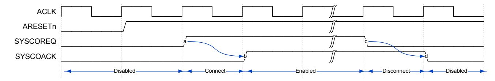

**Figure A15.4: Coherency Connection handshake timing**

The connection signaling obeys the four-phase handshake rules:

- A Manager can only change SYSCOREQ when SYSCOACK is at the same level.
- A Subordinate can only change SYSCOACK when SYSCOREQ is at the opposite level.

The rules for Managers and Subordinate components in each state are shown in Table [A15.26.](#page-260-1)

**Table A15.26: Coherency Connection signaling states**

<span id="page-260-1"></span>

| State    | SYSCOREQ | SYSCOACK | Rules                                                                                                                                                                                                                                                                                                                                                                                                                   |
|----------|----------|----------|-------------------------------------------------------------------------------------------------------------------------------------------------------------------------------------------------------------------------------------------------------------------------------------------------------------------------------------------------------------------------------------------------------------------------|
| Disabled | 0        | 0        | Manager:<br>• Must not fetch and use DVM-managed translation table<br>data to perform translations.<br>• Asserts SYSCOREQ if it needs to perform DVM-managed<br>translations.<br>Subordinate:<br>• Must not issue any DVM message requests.<br>• Must not issue any DVM Sync requests, these are assumed<br>to complete immediately.                                                                                    |
| Connect  | 1        | 0        | Manager:<br>• Must not fetch and use DVM-managed translation table<br>data to perform translations.<br>• Must be able to receive and respond to DVM message<br>requests.<br>• Waiting for SYSCOACK to be asserted before using<br>DVM-managed translations.<br>Subordinate:<br>• Asserts SYSCOACK when it has enabled DVM messages<br>to the attached Manager.                                                          |
| Enabled  | 1        | 1        | Manager:<br>• Can fetch and use DVM-managed translation table data.<br>• Must be able to receive and respond to DVM message<br>requests.<br>• Deasserts SYSCOREQ if it has finished using<br>DVM-managed translation table data and wants to enter a<br>low power state. Any transaction using previously fetched<br>data must have been completed.<br>Subordinate:<br>• Can send DVM messages to the attached Manager. |

Table A15.26 – *Continued from previous page*

| State      | SYSCOREQ | SYSCOACK | Rules                                                                                                                                                                                                                                                                                                                                                                                                                                                                                                                     |
|------------|----------|----------|---------------------------------------------------------------------------------------------------------------------------------------------------------------------------------------------------------------------------------------------------------------------------------------------------------------------------------------------------------------------------------------------------------------------------------------------------------------------------------------------------------------------------|
| Disconnect | 0        | 1        | Manager:<br>• Must not fetch or use any DVM-managed translation table<br>data.<br>• Must be able to receive and respond to DVM message<br>requests.<br>• Waiting for SYSCOACK to be deasserted before disabling<br>DVM-managed logic.<br>Subordinate:<br>• Must wait for all outstanding DVM messages to receive a<br>response before deasserting SYSCOACK.<br>• Must stop issuing DVM messages in a timely manner.<br>• Must issue the second part of a 2-part DVM message if the<br>first part has already been issued. |

Note that a Subordinate is not permitted to send DVM messages in the Connect state, but a Manager must be able to receive DVM messages in the Connect state. This is because there might be a race between the assertion of SYSCOACK and ACVALID.

If an interconnect has sent a DVM Sync message that requires a DVM Complete message on the AR channel, then the interconnect is permitted to deassert SYSCOACK before the DVM Complete request is received. The Manager is required to send the DVM Complete request on the AR channel, even when DVM messages are disabled.

Transitions on the Coherency Connection signals might rely on AWAKEUP being asserted, see [A14.1.2](#page-223-0) *[AWAKEUP and Coherency Connection signaling](#page-223-0)* for details.

# <span id="page-262-0"></span>**A15.7 Snoop channels credit control**

When using credited transport, the snoop channels can include control signals to determine when channel receivers can give credits. This can be used to clock or power gate snoop channels when they are idle.

The following rules apply:

- Credit control is independent of the other channels on the interface. For example, the DVM channels can be in RUN when other channels are in STOP.
- All of the rules in [A14.2](#page-224-0) *[Interface gating with credited transport](#page-224-0)* apply to the DVM credit control signals, but the Manager and Subordinate terms are swapped.
- A DVM transaction is considered to be complete when the response is received on CR. For a DVM Sync, the DVM channels can be stopped once the CR response is received. The Manager must start the main channels to send a DVM Complete request on the AR channel.
- Credit control is independent of the coherency connection state. For example, DVM messages might be enabled by setting SYSCOREQ and SYSCOACK HIGH, but the AC and CR channels remain in STOP until a DVM message needs to be sent.

<span id="page-262-1"></span>Table [A15.27](#page-262-1) shows the signals that are included when DVM\_Message\_Support is Receiver and Credit\_Control is Implicit\_Return\_Uni.

**Table A15.27: Credit control signals**

<span id="page-262-4"></span><span id="page-262-3"></span><span id="page-262-2"></span>

| Name         | Width | Default | Description                                                                                     |  |
|--------------|-------|---------|-------------------------------------------------------------------------------------------------|--|
| ACTIVATEREQD | 1     | 0b1     | Activation / deactivation request from a Subordinate for the<br>snoop channels.                 |  |
| ACTIVATEACKD | 1     | 0b1     | Activation / deactivation acknowledge from a Manager for the<br>snoop channels.                 |  |
| ASKSTOPD     | 1     | 0b0     | Asserted HIGH to indicate that the Manager wants the<br>Subordinate to stop the snoop channels. |  |

<span id="page-263-0"></span>

| Chapter A16                   |  |
|-------------------------------|--|
| Interface and data protection |  |

This chapter specifies schemes for the protection of data and interfaces using poison and parity signaling. It contains the following sections:

- [A16.1](#page-264-0) *[Data protection using Poison](#page-264-0)*
- <span id="page-263-1"></span>• [A16.2](#page-265-0) *[Parity protection for data and interface signals](#page-265-0)*

# <span id="page-264-0"></span>**A16.1 Data protection using Poison**

Poison signaling is used to indicate that a set of data bytes has been previously corrupted. Passing the Poison signaling alongside the data permits any future user of the data to be notified that the data might be corrupt. Poison signaling is supported at the granularity of 1 bit for every 64 bits of data.

**Table A16.1: Poison signals**

<span id="page-264-2"></span><span id="page-264-1"></span>

| Name                | Width                 | Default | Description                                                                                                     |
|---------------------|-----------------------|---------|-----------------------------------------------------------------------------------------------------------------|
| WPOISON,<br>RPOISON | ceil(DATA_WIDTH / 64) | -       | Asserted high to indicate that the data in this transfer<br>is corrupted. There is one bit per 64-bits of data. |

The presence of Poison signals is configured using the *Poison* property.

**Table A16.2: Poison property**

| Poison | Default | Description                        |
|--------|---------|------------------------------------|
| True   |         | Poison signaling is supported.     |
| False  | Y       | Poison signaling is not supported. |

The validity of the Poison signaling is identical to the validity of the associated data.

Poison signaling is independent of error response signaling:

- It is permitted to signal an error with no Poison violation.
- It is permitted to signal a Poison violation without signaling an error response.

A 64-bit granule is defined as an 8-byte address range that is aligned to an 8-byte boundary.

Where the transaction size, as indicated by AxSIZE, is less than 64-bits then it is permitted for the Poison bit to be different on each data transfer. In this situation the receiving component must examine all data transfers to determine if the 64-bit granule is poisoned.

Poison bits can be set for data lanes that are invalid for a transfer. For example, a 64-bit transfer on a 128-bit channel can have both Poison bits set.

For implications of Poison with MTE Tags, see [A12.2.10](#page-197-1) *[MTE and Poison](#page-197-1)*.

# <span id="page-265-0"></span>**A16.2 Parity protection for data and interface signals**

For safety-critical applications it is necessary to detect and possibly correct, transient and functional errors on individual wires within an SoC.

An error in a system component can propagate and cause multiple errors within connected components. Error detection and correction (EDC) is required to operate end-to-end, covering all logic and wires from source to destination.

One way to implement end-to-end protection, is to employ customized EDC schemes in components and implement a simple error detection scheme between components. Between these components there is no logic and single bit errors do not propagate to multi-bit errors. This section describes a parity scheme for detecting single-bit errors on the AMBA interface between components. Multi-bit errors can be detected if they occur in different parity signal groups. [Figure](#page-265-3) [A16.1](#page-265-3) shows locations where parity can be used in AMBA.

<span id="page-265-3"></span>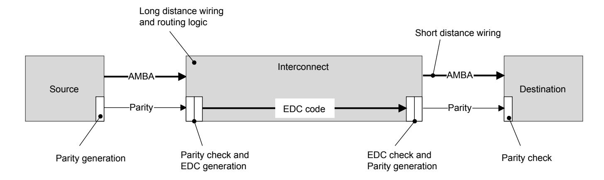

**Figure A16.1: Parity use in AMBA**

### <span id="page-265-1"></span>**A16.2.1 Configuration of parity protection**

The protection scheme employed on an interface is defined by the property *Check\_Type*.

**Table A16.3: Check\_Type property**

| Check_Type           | Default | Description                                                                                                                                                                                            |
|----------------------|---------|--------------------------------------------------------------------------------------------------------------------------------------------------------------------------------------------------------|
| Odd_Parity_Byte_All  |         | Odd parity checking included for all signals. Each bit of<br>the parity signal generally covers up to 8 bits. However, a<br>parity bit can cover more than 8 bits if the configuration<br>requires it. |
| Odd_Parity_Byte_Data |         | Odd parity checking included for data signals with names<br>that end in DATA. Each bit of the parity signal covers<br>exactly 8 bits.                                                                  |
| False                | Y       | No checking signals on the interface.                                                                                                                                                                  |

# <span id="page-265-2"></span>**A16.2.2 Error detection behavior**

This specification is not prescriptive regarding component or system behavior when a parity error is detected. Depending on the system and affected signals, a flipped bit can have a wide range of effects. It might be harmless, cause performance issues, data corruption, security violations, or deadlock. The transaction response is independent of parity error detection.

When an error is detected, the receiver can do any of the following:

- Terminate or propagate the transaction. Termination might or might not be protocol compliant.
- Correct the parity check signal or propagate the signal in error.
- Update its memory or leave untouched. The location might be marked as poisoned.
- Signal an error response through other means, for example with an interrupt.

### <span id="page-266-1"></span><span id="page-266-0"></span>**A16.2.3 Parity check signals**

The parity check signals are listed in Table [A16.4.](#page-267-0) They have the following attributes and rules:

- Odd parity is used.
  - Odd parity means that check signals are added to groups of signals on the interface and driven such that there is always an odd number of asserted bits in that group.
- Parity signals covering data and payload are defined such that in most cases there are no more than 8 bits per group.
  - This limitation assumes that there is a maximum of 3 logic levels available in the timing budget for generating each parity bit.
- Parity signals covering critical control signals, which are likely to have a smaller timing budget available, are defined with a single odd parity bit. This single odd parity bit is the inversion of the original critical control signal.
- Check signals are synchronous to ACLK and must be driven correctly in every cycle that the signal in the *Check enable* column is HIGH, see Table [A16.4.](#page-267-0)
- Control signals have ARESETn as the Check enable.
  - If the check signal for a control signal is wider than 1 bit, check bit [n] corresponds to bit [n] in the control signal.
- Payload signals have xVALID as the Check enable.
  - If the check signal for a payload signal is wider than 1 bit:
    - \* Where a check signal covers multiple signals, parity is calculated by concatenating the signals in the order they are listed in Table [A16.4,](#page-267-0) with the first signal listed at the LSB.
    - \* Check bit [n] corresponds to bits [(8n+7):8n] in the payload, with the following exceptions:
      - · WTAGCHK[n] is the parity of {WTAGUPDATE[n],WTAG[4n+3:4n]}.
      - · RTAGCHK[n] is the parity of RTAG[4n+3:4n].
    - \* If the payload is not an integer number of bytes, the most significant bit of the check signal covers fewer than 8-bits in the most significant portion of the payload.
- Parity signals must be driven appropriately to all the bits in the associated payload, irrespective of whether those bits are actively used in the transfer. For example, all bits of WDATACHK must be driven correctly when WVALID is asserted, even if some byte lanes are not being used.
- If none of the signals covered by a check signal are present on an interface, then the check signal is omitted from the interface.

The following rules apply for CHK signals which cover multiple signals where one or more of the inputs or outputs are missing:

- If there is a missing signal output, the value is assumed to be the default for that signal. Signals with a non-zero default must be considered when calculating parity, for example BCOMP which has a default value of 0b1.
- If there is an output signal with no corresponding input, the missing input cannot be assumed to take a fixed value. Therefore, the CHK signal cannot be used reliably.
- It is recommended that input signals that are part of a CHK group are either all present or all not present.

**Table A16.4: Parity check signals**

<span id="page-267-0"></span>

| Name           | Signals covered                                | Width                                            | Check enable |
|----------------|------------------------------------------------|--------------------------------------------------|--------------|
| AWVALIDCHK     | AWVALID                                        | 1                                                | ARESETn      |
| AWREADYCHK     | AWREADY                                        | 1                                                | ARESETn      |
| AWPENDINGCHK   | AWPENDING                                      | 1                                                | ARESETn      |
| AWCRDTCHK      | AWCRDT                                         | Num_RP_AWW                                       | ARESETn      |
| AWCRDTSHCHK    | AWCRDTSH                                       | 1                                                | ARESETn      |
| AWRPCHK        | AWRP                                           | 1                                                | AWVALID      |
| AWSHAREDCRDCHK | AWSHAREDCRD                                    | 1                                                | AWVALID      |
| AWIDCHK        | AWID<br>AWIDUNQ                                | ceil((ID_W_WIDTH +<br>int(Unique_ID_Support))/8) | AWVALID      |
| AWADDRCHK      | AWADDR                                         | ceil(ADDR_WIDTH/8)                               | AWVALID      |
| AWLENCHK       | AWLEN                                          | 1                                                | AWVALID      |
| AWCTLCHK0      | AWSIZE<br>AWBURST<br>AWLOCK<br>AWPROT<br>AWNSE | 1                                                | AWVALID      |
| AWCTLCHK1      | AWREGION<br>AWCACHE<br>AWQOS                   | 1                                                | AWVALID      |
| AWCTLCHK2      | AWDOMAIN<br>AWSNOOP                            | 1                                                | AWVALID      |
| AWCTLCHK3      | AWATOP<br>AWCMO<br>AWTAGOP                     | 1                                                | AWVALID      |
| AWPASCHK       | AWPAS                                          | 1                                                | AWVALID      |
| AWINSTPRIVCHK  | AWINST<br>AWPRIV                               | 1                                                | AWVALID      |
| AWUSERCHK      | AWUSER                                         | ceil(USER_REQ_WIDTH/8)                           | AWVALID      |
| AWSTASHNIDCHK  | AWSTASHNID<br>AWSTASHNIDEN                     | 1                                                | AWVALID      |
| AWSTASHLPIDCHK | AWSTASHLPID<br>AWSTASHLPIDEN                   | 1                                                | AWVALID      |

Table A16.4 – *Continued from previous page*

| Name               | Signals covered                                                   | Width                   | Check enable |
|--------------------|-------------------------------------------------------------------|-------------------------|--------------|
| AWTRACECHK         | AWTRACE                                                           | 1                       | AWVALID      |
| AWLOOPCHK          | AWLOOP                                                            | ceil(LOOP_W_WIDTH/8)    | AWVALID      |
| AWMMUCHK           | AWMMUATST<br>AWMMUFLOW<br>AWMMUSECSID<br>AWMMUSSIDV<br>AWMMUVALID | 1                       | AWVALID      |
| AWMMUSIDCHK        | AWMMUSID                                                          | ceil(SID_WIDTH/8)       | AWVALID      |
| AWMMUSSIDCHK       | AWMMUSSID                                                         | ceil(SSID_WIDTH/8)      | AWVALID      |
| AWMMUPASUNKNOWNCHK | AWMMUPASUNKNOWN                                                   | 1                       | AWVALID      |
| AWMMUPMCHK         | AWMMUPM                                                           | 1                       | AWVALID      |
| AWPBHACHK          | AWPBHA                                                            | 1                       | AWVALID      |
| AWMECIDCHK         | AWMECID                                                           | ceil(MECID_WIDTH/8)     | AWVALID      |
| AWNSAIDCHK         | AWNSAID                                                           | 1                       | AWVALID      |
| AWMPAMCHK          | AWMPAM                                                            | 1                       | AWVALID      |
| AWSUBSYSIDCHK      | AWSUBSYSID                                                        | 1                       | AWVALID      |
| AWACTCHK           | AWACTV<br>AWACT                                                   | ceil((ACT_W_WIDTH+1)/8) | AWVALID      |
| WVALIDCHK          | WVALID                                                            | 1                       | ARESETn      |
| WREADYCHK          | WREADY                                                            | 1                       | ARESETn      |
| WPENDINGCHK        | WPENDING                                                          | 1                       | ARESETn      |
| WCRDTCHK           | WCRDT                                                             | Num_RP_AWW              | ARESETn      |
| WCRDTSHCHK         | WCRDTSH                                                           | 1                       | ARESETn      |
| WRPCHK             | WRP                                                               | 1                       | WVALID       |
| WSHAREDCRDCHK      | WSHAREDCRD                                                        | 1                       | WVALID       |
| WDATACHK           | WDATA                                                             | DATA_WIDTH/8            | WVALID       |
| WSTRBCHK           | WSTRB                                                             | ceil(DATA_WIDTH/64)     | WVALID       |
| WTAGCHK            | WTAG<br>WTAGUPDATE                                                | ceil(DATA_WIDTH/128)    | WVALID       |
| WLASTCHK           | WLAST                                                             | 1                       | WVALID       |
| WUSERCHK           | WUSER                                                             | ceil(USER_DATA_WIDTH/8) | WVALID       |
| WPOISONCHK         | WPOISON                                                           | ceil(DATA_WIDTH/512)    | WVALID       |
| WTRACECHK          | WTRACE                                                            | 1                       | WVALID       |
| BVALIDCHK          | BVALID                                                            | 1                       | ARESETn      |
| BREADYCHK          | BREADY                                                            | 1                       | ARESETn      |

Table A16.4 – *Continued from previous page*

| Name           | Signals covered                                  | Width                                            | Check enable |
|----------------|--------------------------------------------------|--------------------------------------------------|--------------|
| BPENDINGCHK    | BPENDING                                         | 1                                                | ARESETn      |
| BCRDTCHK       | BCRDT                                            | 1                                                | ARESETn      |
| BIDCHK         | BID<br>BIDUNQ                                    | ceil((ID_W_WIDTH +<br>int(Unique_ID_Support))/8) | BVALID       |
| BRESPCHK       | BRESP<br>BCOMP<br>BPERSIST<br>BTAGMATCH<br>BBUSY | 1                                                | BVALID       |
| BUSERCHK       | BUSER                                            | ceil(USER_RESP_WIDTH/8)                          | BVALID       |
| BTRACECHK      | BTRACE                                           | 1                                                | BVALID       |
| BLOOPCHK       | BLOOP                                            | ceil(LOOP_W_WIDTH/8)                             | BVALID       |
| ARVALIDCHK     | ARVALID                                          | 1                                                | ARESETn      |
| ARREADYCHK     | ARREADY                                          | 1                                                | ARESETn      |
| ARPENDINGCHK   | ARPENDING                                        | 1                                                | ARESETn      |
| ARCRDTCHK      | ARCRDT                                           | Num_RP_AR                                        | ARESETn      |
| ARCRDTSHCHK    | ARCRDTSH                                         | 1                                                | ARESETn      |
| ARRPCHK        | ARRP                                             | 1                                                | ARVALID      |
| ARSHAREDCRDCHK | ARSHAREDCRD                                      | 1                                                | ARVALID      |
| ARIDCHK        | ARID<br>ARIDUNQ                                  | ceil((ID_R_WIDTH +<br>int(Unique_ID_Support))/8) | ARVALID      |
| ARADDRCHK      | ARADDR                                           | ceil(ADDR_WIDTH/8)                               | ARVALID      |
| ARLENCHK       | ARLEN                                            | 1                                                | ARVALID      |
| ARCTLCHK0      | ARSIZE<br>ARBURST<br>ARLOCK<br>ARPROT<br>ARNSE   | 1                                                | ARVALID      |
| ARCTLCHK1      | ARREGION<br>ARCACHE<br>ARQOS                     | 1                                                | ARVALID      |
| ARCTLCHK2      | ARDOMAIN<br>ARSNOOP                              | 1                                                | ARVALID      |
| ARCTLCHK3      | ARCHUNKEN<br>ARTAGOP                             | 1                                                | ARVALID      |
| ARPASCHK       | ARPAS                                            | 1                                                | ARVALID      |
| ARINSTPRIVCHK  | ARINST<br>ARPRIV                                 | 1                                                | ARVALID      |

Table A16.4 – *Continued from previous page*

| Name               | Signals covered                                                   | Width                                            | Check enable |
|--------------------|-------------------------------------------------------------------|--------------------------------------------------|--------------|
| ARUSERCHK          | ARUSER                                                            | ceil(USER_REQ_WIDTH/8)                           | ARVALID      |
| ARTRACECHK         | ARTRACE                                                           | 1                                                | ARVALID      |
| ARLOOPCHK          | ARLOOP                                                            | ceil(LOOP_R_WIDTH/8)                             | ARVALID      |
| ARMMUCHK           | ARMMUATST<br>ARMMUFLOW<br>ARMMUSECSID<br>ARMMUSSIDV<br>ARMMUVALID | 1                                                | ARVALID      |
| ARMMUSIDCHK        | ARMMUSID                                                          | ceil(SID_WIDTH/8)                                | ARVALID      |
| ARMMUSSIDCHK       | ARMMUSSID                                                         | ceil(SSID_WIDTH/8)                               | ARVALID      |
| ARMMUPASUNKNOWNCHK | ARMMUPASUNKNOWN                                                   | 1                                                | ARVALID      |
| ARMMUPMCHK         | ARMMUPM                                                           | 1                                                | ARVALID      |
| ARNSAIDCHK         | ARNSAID                                                           | 1                                                | ARVALID      |
| ARMPAMCHK          | ARMPAM                                                            | 1                                                | ARVALID      |
| ARPBHACHK          | ARPBHA                                                            | 1                                                | ARVALID      |
| ARMECIDCHK         | ARMECID                                                           | ceil(MECID_WIDTH/8)                              | ARVALID      |
| ARSUBSYSIDCHK      | ARSUBSYSID                                                        | 1                                                | ARVALID      |
| ARACTCHK           | ARACTV<br>ARACT                                                   | ceil((ACT_R_WIDTH+1)/8)                          | ARVALID      |
| RVALIDCHK          | RVALID                                                            | 1                                                | ARESETn      |
| RREADYCHK          | RREADY                                                            | 1                                                | ARESETn      |
| RPENDINGCHK        | RPENDING                                                          | 1                                                | ARESETn      |
| RCRDTCHK           | RCRDT                                                             | 1                                                | ARESETn      |
| RIDCHK             | RID<br>RIDUNQ                                                     | ceil((ID_R_WIDTH +<br>int(Unique_ID_Support))/8) | RVALID       |
| RDATACHK           | RDATA                                                             | DATA_WIDTH/8                                     | RVALID       |
| RTAGCHK            | RTAG                                                              | ceil(DATA_WIDTH/128)                             | RVALID       |
| RRESPCHK           | RRESP<br>RBUSY                                                    | 1                                                | RVALID       |
| RLASTCHK           | RLAST                                                             | 1                                                | RVALID       |
| RCHUNKCHK          | RCHUNKV<br>RCHUNKNUM<br>RCHUNKSTRB                                | 1                                                | RVALID       |
| RUSERCHK           | RUSER                                                             | ceil((USER_DATA_WIDTH +<br>USER_RESP_WIDTH)/8)   | RVALID       |
| RPOISONCHK         | RPOISON                                                           | ceil(DATA_WIDTH/512)                             | RVALID       |

Table A16.4 – *Continued from previous page*

| Name            | Signals covered | Width                | Check enable |
|-----------------|-----------------|----------------------|--------------|
| RTRACECHK       | RTRACE          | 1                    | RVALID       |
| RLOOPCHK        | RLOOP           | ceil(LOOP_R_WIDTH/8) | RVALID       |
| ACVALIDCHK      | ACVALID         | 1                    | ARESETn      |
| ACREADYCHK      | ACREADY         | 1                    | ARESETn      |
| ACPENDINGCHK    | ACPENDING       | 1                    | ARESETn      |
| ACCRDTCHK       | ACCRDT          | 1                    | ARESETn      |
| ACADDRCHK       | ACADDR          | ceil(ADDR_WIDTH/8)   | ACVALID      |
| ACVMIDEXTCHK    | ACVMIDEXT       | 1                    | ACVALID      |
| ACTRACECHK      | ACTRACE         | 1                    | ACVALID      |
| CRVALIDCHK      | CRVALID         | 1                    | ARESETn      |
| CRREADYCHK      | CRREADY         | 1                    | ARESETn      |
| CRPENDINGCHK    | CRPENDING       | 1                    | ARESETn      |
| CRCRDTCHK       | CRCRDT          | 1                    | ARESETn      |
| CRTRACECHK      | CRTRACE         | 1                    | CRVALID      |
| VAWQOSACCEPTCHK | VAWQOSACCEPT    | 1                    | ARESETn      |
| VARQOSACCEPTCHK | VARQOSACCEPT    | 1                    | ARESETn      |
| AWAKEUPCHK      | AWAKEUP         | 1                    | ARESETn      |
| ACWAKEUPCHK     | ACWAKEUP        | 1                    | ARESETn      |
| ACTIVATEREQCHK  | ACTIVATEREQ     | 1                    | ARESETn      |
| ACTIVATEACKCHK  | ACTIVATEACK     | 1                    | ARESETn      |
| ASKSTOPCHK      | ASKSTOP         | 1                    | ARESETn      |
| ACTIVATEREQDCHK | ACTIVATEREQD    | 1                    | ARESETn      |
| ACTIVATEACKDCHK | ACTIVATEACKD    | 1                    | ARESETn      |
| ASKSTOPDCHK     | ASKSTOPD        | 1                    | ARESETn      |
| SYSCOREQCHK     | SYSCOREQ        | 1                    | None         |
| SYSCOACKCHK     | SYSCOACK        | 1                    | None         |
|                 |                 |                      |              |

<span id="page-272-0"></span>**Part B Appendices**

# <span id="page-273-0"></span>Chapter B1 **Signal list**

This appendix lists all the signals described within this specification. Some channels and signals are optional, so are not included on every interface. Each signal name contains a hyperlink to the section in which the signal is defined.

Parity check signals are not included in this chapter but are listed in [A16.2.3](#page-266-0) *[Parity check signals](#page-266-0)*.

Signals are grouped based on channel and category as described in the following sections:

- [B1.1](#page-274-0) *[Write channels](#page-274-0)*
- [B1.2](#page-278-0) *[Read channels](#page-278-0)*
- [B1.3](#page-281-0) *[Snoop channels](#page-281-0)*
- [B1.4](#page-282-0) *[Interface level signals](#page-282-0)*

# <span id="page-274-0"></span>**B1.1 Write channels**

The write channels are used to transfer requests, data, and responses for write transactions and some other data-less transactions.

### <span id="page-274-1"></span>**B1.1.1 Write request channel**

The write request channel carries all the required address and control information for transactions that use the write channels. Signals on this channel have the prefix AW.

**Table B1.1: Write request channel signals**

| Name         | Width             | Source      | Description                                |
|--------------|-------------------|-------------|--------------------------------------------|
| AWVALID      | 1                 | Manager     | Valid indicator                            |
| AWREADY      | 1                 | Subordinate | Ready indicator                            |
| AWPENDING    | 1                 | Manager     | Pending indicator                          |
| AWCRDT       | Num_RP_AWW        | Subordinate | Credit grant                               |
| AWCRDTSH     | 1                 | Subordinate | Shared credit grant                        |
| AWRP         | clog2(Num_RP_AWW) | Manager     | Resource Plane indicator                   |
| AWSHAREDCRD  | 1                 | Manager     | Shared credit indicator                    |
| AWID         | ID_W_WIDTH        | Manager     | Transaction identifier for a write request |
| AWADDR       | ADDR_WIDTH        | Manager     | Transaction address                        |
| AWREGION     | 4                 | Manager     | Region identifier                          |
| AWLEN        | 8                 | Manager     | Transaction length                         |
| AWSIZE       | 3                 | Manager     | Transaction size                           |
| AWBURST      | 2                 | Manager     | Burst attribute                            |
| AWLOCK       | 1                 | Manager     | Exclusive access indicator                 |
| AWCACHE      | 4                 | Manager     | Memory attributes                          |
| AWPROT       | 3                 | Manager     | Protection attributes                      |
| AWNSE        | 1                 | Manager     | Non-secure extension bit for RME           |
| AWPAS        | PAS_WIDTH         | Manager     | Physical Address Space                     |
| AWINST       | 1                 | Manager     | Data or instruction request indicator      |
| AWPRIV       | 1                 | Manager     | Privileged request indicator               |
| AWQOS        | 4                 | Manager     | QoS identifier                             |
| AWUSER       | USER_REQ_WIDTH    | Manager     | User-defined extension to a request        |
| AWDOMAIN     | 2                 | Manager     | Shareability domain of a request           |
| AWSNOOP      | AWSNOOP_WIDTH     | Manager     | Write request opcode                       |
| AWSTASHNID   | 11                | Manager     | Stash Node ID                              |
| AWSTASHNIDEN | 1                 | Manager     | Stash Node ID enable                       |

Table B1.1 – *Continued from previous page*

| Name            | Width          | Source  | Description                             |
|-----------------|----------------|---------|-----------------------------------------|
| AWSTASHLPID     | 5              | Manager | Stash Logical Processor ID              |
| AWSTASHLPIDEN   | 1              | Manager | Stash Logical Processor ID enable       |
| AWTRACE         | 1              | Manager | Trace signal                            |
| AWLOOP          | LOOP_W_WIDTH   | Manager | Loopback signals on the write channels  |
| AWMMUVALID      | 1              | Manager | MMU signal qualifier                    |
| AWMMUSECSID     | SECSID_WIDTH   | Manager | Secure Stream ID                        |
| AWMMUSID        | SID_WIDTH      | Manager | StreamID                                |
| AWMMUSSIDV      | 1              | Manager | SubstreamID valid                       |
| AWMMUSSID       | SSID_WIDTH     | Manager | SubstreamID                             |
| AWMMUATST       | 1              | Manager | Address translated indicator            |
| AWMMUFLOW       | 2              | Manager | SMMU flow type                          |
| AWMMUPASUNKNOWN | 1              | Manager | PAS unknown indicator                   |
| AWMMUPM         | 1              | Manager | Protected Mode indicator                |
| AWPBHA          | 4              | Manager | Page-based Hardware Attributes          |
| AWMECID         | MECID_WIDTH    | Manager | Memory Encryption Context identifier    |
| AWNSAID         | 4              | Manager | Non-secure Access ID                    |
| AWSUBSYSID      | SUBSYSID_WIDTH | Manager | Subsystem ID                            |
| AWATOP          | 6              | Manager | Atomic transaction opcode               |
| AWMPAM          | MPAM_WIDTH     | Manager | MPAM information with a request         |
| AWIDUNQ         | 1              | Manager | Unique ID indicator                     |
| AWCMO           | AWCMO_WIDTH    | Manager | CMO type                                |
| AWTAGOP         | 2              | Manager | Memory Tag operation for write requests |
| AWACT           | ACT_W_WIDTH    | Manager | ACT payload                             |
| AWACTV          | 1              | Manager | ACT valid indicator                     |
|                 |                |         |                                         |

### <span id="page-276-0"></span>**B1.1.2 Write data channel**

The write data channel carries write data and control information from a Manager to a Subordinate. Signals on this channel have the prefix W.

**Table B1.2: Write data channel signals**

| Name       | Width                  | Source      | Description                                |
|------------|------------------------|-------------|--------------------------------------------|
| WVALID     | 1                      | Manager     | Valid indicator                            |
| WREADY     | 1                      | Subordinate | Ready indicator                            |
| WPENDING   | 1                      | Manager     | Pending indicator                          |
| WCRDT      | Num_RP_AWW             | Subordinate | Credit grant                               |
| WCRDTSH    | 1                      | Subordinate | Shared credit grant                        |
| WRP        | clog2(Num_RP_AWW)      | Manager     | Resource Plane indicator for the W channel |
| WSHAREDCRD | 1                      | Manager     | Shared credit indicator                    |
| WDATA      | DATA_WIDTH             | Manager     | Write data                                 |
| WSTRB      | DATA_WIDTH / 8         | Manager     | Write data strobes                         |
| WTAG       | ceil(DATA_WIDTH/128)*4 | Manager     | Memory Tag                                 |
| WTAGUPDATE | ceil(DATA_WIDTH/128)   | Manager     | Memory Tag update                          |
| WLAST      | 1                      | Manager     | Last write data                            |
| WUSER      | USER_DATA_WIDTH        | Manager     | User-defined extension to write data       |
| WPOISON    | ceil(DATA_WIDTH / 64)  | Manager     | Poison indicator                           |
| WTRACE     | 1                      | Manager     | Trace signal                               |

### <span id="page-277-0"></span>**B1.1.3 Write response channel**

The write response channel carries responses from Subordinate to Manager for transactions using the write data channels. Signals on this channel have the prefix B.

**Table B1.3: Write response channel signals**

| Name      | Width           | Source      | Description                                   |
|-----------|-----------------|-------------|-----------------------------------------------|
| BVALID    | 1               | Subordinate | Valid indicator                               |
| BREADY    | 1               | Manager     | Ready indicator                               |
| BPENDING  | 1               | Subordinate | Pending indicator                             |
| BCRDT     | 1               | Manager     | Credit grant                                  |
| BID       | ID_W_WIDTH      | Subordinate | Transaction identifier for a write response   |
| BIDUNQ    | 1               | Subordinate | Unique ID indicator                           |
| BRESP     | BRESP_WIDTH     | Subordinate | Write response                                |
| BCOMP     | 1               | Subordinate | Completion response indicator                 |
| BPERSIST  | 1               | Subordinate | Persist response                              |
| BTAGMATCH | 2               | Subordinate | Memory Tag Match response                     |
| BUSER     | USER_RESP_WIDTH | Subordinate | User-defined extension to a write response    |
| BTRACE    | 1               | Subordinate | Trace signal                                  |
| BLOOP     | LOOP_W_WIDTH    | Subordinate | Loopback signal on the write response channel |
| BBUSY     | 2               | Subordinate | Busy indicator                                |
|           |                 |             |                                               |

# <span id="page-278-0"></span>**B1.2 Read channels**

The read channels are used to transfer requests, data, and responses for read transactions, cache maintenance operations, and DVM Complete messages.

### <span id="page-278-1"></span>**B1.2.1 Read request channel**

The read request channel carries all the required address and control information for transactions that use the read channels. Signals on this channel have the prefix AR.

**Table B1.4: Read request channel signals**

| Name        | Width            | Source      | Description                                 |
|-------------|------------------|-------------|---------------------------------------------|
| ARVALID     | 1                | Manager     | Valid indicator                             |
| ARREADY     | 1                | Subordinate | Ready indicator                             |
| ARPENDING   | 1                | Manager     | Pending indicator                           |
| ARCRDT      | Num_RP_AR        | Subordinate | Credit grant                                |
| ARCRDTSH    | 1                | Subordinate | Shared credit grant                         |
| ARRP        | clog2(Num_RP_AR) | Manager     | Resource Plane indicator                    |
| ARSHAREDCRD | 1                | Manager     | Shared credit indicator                     |
| ARID        | ID_R_WIDTH       | Manager     | Transaction identifier for a read request   |
| ARADDR      | ADDR_WIDTH       | Manager     | Transaction address                         |
| ARREGION    | 4                | Manager     | Region identifier                           |
| ARLEN       | 8                | Manager     | Transaction length                          |
| ARSIZE      | 3                | Manager     | Transaction size                            |
| ARBURST     | 2                | Manager     | Burst attribute                             |
| ARLOCK      | 1                | Manager     | Exclusive access indicator                  |
| ARCACHE     | 4                | Manager     | Memory attributes                           |
| ARPROT      | 3                | Manager     | Protection attributes                       |
| ARNSE       | 1                | Manager     | Non-secure extension bit for RME            |
| ARPAS       | PAS_WIDTH        | Manager     | Physical Address Space                      |
| ARINST      | 1                | Manager     | Data or instruction request indicator       |
| ARPRIV      | 1                | Manager     | Privileged request indicator                |
| ARQOS       | 4                | Manager     | QoS identifier                              |
| ARUSER      | USER_REQ_WIDTH   | Manager     | User-defined extension to a request         |
| ARDOMAIN    | 2                | Manager     | Shareability domain of a request            |
| ARSNOOP     | ARSNOOP_WIDTH    | Manager     | Read request opcode                         |
| ARTRACE     | 1                | Manager     | Trace signal                                |
| ARLOOP      | LOOP_R_WIDTH     | Manager     | Loopback signal on the read request channel |

Table B1.4 – *Continued from previous page*

| Name            | Width          | Source  | Description                            |
|-----------------|----------------|---------|----------------------------------------|
| ARMMUVALID      | 1              | Manager | MMU signal qualifier                   |
| ARMMUSECSID     | SECSID_WIDTH   | Manager | Secure Stream ID                       |
| ARMMUSID        | SID_WIDTH      | Manager | StreamID                               |
| ARMMUSSIDV      | 1              | Manager | SubstreamID valid                      |
| ARMMUSSID       | SSID_WIDTH     | Manager | SubstreamID                            |
| ARMMUATST       | 1              | Manager | Address translated indicator           |
| ARMMUFLOW       | 2              | Manager | SMMU flow type                         |
| ARMMUPASUNKNOWN | 1              | Manager | PAS unknown indicator                  |
| ARMMUPM         | 1              | Manager | Protected Mode indicator               |
| ARPBHA          | 4              | Manager | Page-based Hardware Attributes         |
| ARMECID         | MECID_WIDTH    | Manager | Memory Encryption Context identifier   |
| ARNSAID         | 4              | Manager | Non-secure Access ID                   |
| ARSUBSYSID      | SUBSYSID_WIDTH | Manager | Subsystem ID                           |
| ARMPAM          | MPAM_WIDTH     | Manager | MPAM information with a request        |
| ARCHUNKEN       | 1              | Manager | Read data chunking enable              |
| ARIDUNQ         | 1              | Manager | Unique ID indicator                    |
| ARTAGOP         | 2              | Manager | Memory Tag operation for read requests |
| ARACT           | ACT_R_WIDTH    | Manager | ACT payload                            |
| ARACTV          | 1              | Manager | ACT valid indicator                    |

## <span id="page-280-0"></span>**B1.2.2 Read data channel**

The read data channel carries read data and responses from a Subordinate to a Manager. Signals on this channel have the prefix R.

**Table B1.5: Read data channel signals**

| Name       | Width                                | Source      | Description                                         |
|------------|--------------------------------------|-------------|-----------------------------------------------------|
| RVALID     | 1                                    | Subordinate | Valid indicator                                     |
| RREADY     | 1                                    | Manager     | Ready indicator                                     |
| RPENDING   | 1                                    | Subordinate | Pending indicator                                   |
| RCRDT      | 1                                    | Manager     | Credit grant                                        |
| RID        | ID_R_WIDTH                           | Subordinate | Transaction identifier for read data                |
| RIDUNQ     | 1                                    | Subordinate | Unique ID indicator                                 |
| RDATA      | DATA_WIDTH                           | Subordinate | Read data                                           |
| RTAG       | ceil(DATA_WIDTH/128)*4               | Subordinate | Memory Tag                                          |
| RRESP      | RRESP_WIDTH                          | Subordinate | Read response                                       |
| RLAST      | 1                                    | Subordinate | Last read data                                      |
| RUSER      | USER_DATA_WIDTH +<br>USER_RESP_WIDTH | Subordinate | User-defined extension to read data and<br>response |
| RPOISON    | ceil(DATA_WIDTH / 64)                | Subordinate | Poison indicator                                    |
| RTRACE     | 1                                    | Subordinate | Trace signal                                        |
| RLOOP      | LOOP_R_WIDTH                         | Subordinate | Loopback signal on the read data channel            |
| RCHUNKV    | 1                                    | Subordinate | Read data chunking valid                            |
| RCHUNKNUM  | RCHUNKNUM_WIDTH                      | Subordinate | Read data chunk number                              |
| RCHUNKSTRB | RCHUNKSTRB_WIDTH                     | Subordinate | Read data chunk strobe                              |
| RBUSY      | 2                                    | Subordinate | Busy indicator                                      |

# <span id="page-281-0"></span>**B1.3 Snoop channels**

In this specification, the snoop channels are only used to transport DVM messages.

### <span id="page-281-1"></span>**B1.3.1 Snoop request channel**

The snoop request channel carries address and control information for DVM message requests. Signals on this channel have the prefix AC.

**Table B1.6: Snoop request channel signals**

| Name      | Width      | Source      | Description                     |
|-----------|------------|-------------|---------------------------------|
| ACVALID   | 1          | Subordinate | Valid indicator                 |
| ACREADY   | 1          | Manager     | Ready indicator                 |
| ACPENDING | 1          | Subordinate | Pending indicator               |
| ACCRDT    | 1          | Manager     | Credit grant                    |
| ACADDR    | ADDR_WIDTH | Subordinate | DVM message payload             |
| ACVMIDEXT | 4          | Subordinate | VMID extension for DVM messages |
| ACTRACE   | 1          | Subordinate | Trace signal                    |

### <span id="page-281-2"></span>**B1.3.2 Snoop response channel**

The snoop response channel carries responses to DVM messages. Signals on this channel have the prefix CR.

**Table B1.7: Snoop response channel signals**

| Name      | Width | Source      | Description       |
|-----------|-------|-------------|-------------------|
| CRVALID   | 1     | Manager     | Valid indicator   |
| CRREADY   | 1     | Subordinate | Ready indicator   |
| CRPENDING | 1     | Manager     | Pending indicator |
| CRCRDT    | 1     | Subordinate | Credit grant      |
| CRTRACE   | 1     | Manager     | Trace signal      |

# <span id="page-282-0"></span>**B1.4 Interface level signals**

Interface level signals are non-channel signals. There can be up to one set of each per interface.

### <span id="page-282-1"></span>**B1.4.1 Clock and reset signals**

All signals on an interface are synchronous to a global clock and are reset using a global reset signal.

**Table B1.8: Clock and reset signals**

| Name    | Width | Source   | Description         |
|---------|-------|----------|---------------------|
| ACLK    | 1     | External | Global clock signal |
| ARESETn | 1     | External | Global reset signal |

## <span id="page-282-2"></span>**B1.4.2 Credit control signals**

Credit control signals are used with a credited link layer, to determine when channel receivers can give credits and therefore when transmitters can send transfers.

**Table B1.9: Credit control signals**

| Name         | Width | Source      | Description                               |
|--------------|-------|-------------|-------------------------------------------|
| ACTIVATEREQ  | 1     | Manager     | Activation request                        |
| ACTIVATEACK  | 1     | Subordinate | Activation acknowledge                    |
| ASKSTOP      | 1     | Subordinate | Stop request                              |
| ACTIVATEREQD | 1     | Subordinate | Activation request for snoop channels     |
| ACTIVATEACKD | 1     | Manager     | Activation acknowledge for snoop channels |
| ASKSTOPD     | 1     | Manager     | Stop request for snoop channels           |

### <span id="page-282-3"></span>**B1.4.3 Wakeup signals**

The wake-up signals are used to indicate that there is activity associated with the interface.

**Table B1.10: Wake-up signals**

| Name     | Width | Source      | Description                                            |
|----------|-------|-------------|--------------------------------------------------------|
| AWAKEUP  | 1     | Manager     | Wake-up signal associated with read and write channels |
| ACWAKEUP | 1     | Subordinate | Wake-up signal associated with snoop channels          |

### <span id="page-283-0"></span>**B1.4.4 QoS Accept signals**

QoS Accept signals can be used by a Subordinate interface to indicate the minimum QoS value of requests that it accepts.

**Table B1.11: QoS Accept signals**

| Name         | Width | Source      | Description                             |
|--------------|-------|-------------|-----------------------------------------|
| VAWQOSACCEPT | 4     | Subordinate | QoS acceptance level for write requests |
| VARQOSACCEPT | 4     | Subordinate | QoS acceptance level for read requests  |

### <span id="page-283-1"></span>**B1.4.5 Coherency Connection signals**

The coherency connection signals are used by a Manager to control whether it receives DVM messages on the AC channel.

**Table B1.12: Coherency connection signals**

| Name     | Width | Source      | Description                   |
|----------|-------|-------------|-------------------------------|
| SYSCOREQ | 1     | Manager     | Coherency connect request     |
| SYSCOACK | 1     | Subordinate | Coherency connect acknowledge |

### <span id="page-283-2"></span>**B1.4.6 Interface control signals**

The interface control signals are static inputs to a Manager interface that can be used to configure interface behavior.

**Table B1.13: Interface control signals**

<span id="page-283-3"></span>

| Name                | Width | Source  | Description                                                     |
|---------------------|-------|---------|-----------------------------------------------------------------|
| BROADCASTATOMIC     | 1     | Tie-off | Control input for Atomic transactions                           |
| BROADCASTSHAREABLE  | 1     | Tie-off | Control input for Shareable transactions                        |
| BROADCASTCACHEMAINT | 1     | Tie-off | Control input for cache maintenance operations                  |
| BROADCASTCMOPOPA    | 1     | Tie-off | Control input for the CleanInvalidPoPA CMO                      |
| BROADCASTPERSIST    | 1     | Tie-off | Control input for CleanSharedPersist and CleanSharedDeepPersist |
| BROADCASTSTORAGE    | 1     | Tie-off | Control input for CleanInvalidStorage CMO                       |

# <span id="page-284-0"></span>Chapter B2

# **Interface classes**

The specification part in this document describes a generic fully-featured protocol, with some features being mandatory and others optional, based on properties. Previous issues of this specification defined a number of interface classes for different use-cases. These can all now be described by constraining certain properties to limit the functionality and signaling on that interface.

This chapter describes the following interface classes:

- [B2.1.1](#page-286-0) *AXI5*
- [B2.1.2](#page-286-1) *[ACE5-Lite](#page-286-1)*
- [B2.1.3](#page-286-2) *[ACE5-LiteDVM](#page-286-2)*
- [B2.1.4](#page-286-3) *[ACE5-LiteACP](#page-286-3)*
- [B2.1.5](#page-287-0) *[AXI5-Lite](#page-287-0)*

There are also signal and property tables with columns for each interface class:

- [B2.2](#page-288-0) *[Signal matrix](#page-288-0)*
- [B2.3](#page-295-0) *[Parity check signal matrix](#page-295-0)*
- [B2.4](#page-299-0) *[Property matrix](#page-299-0)*

Note that ACE, ACE5, AXI3, AXI4, and AXI4-Lite interface classes are not described in this specification. See [\[1\]](#page-16-1) for more information on these interfaces.

# <span id="page-285-1"></span><span id="page-285-0"></span>**B2.1 Summary of interface classes**

An example of where different interface classes might be used is shown in [Figure](#page-285-1) [B2.1.](#page-285-1) Note that an AXI5 interface can be configured to meet all of the use-cases.

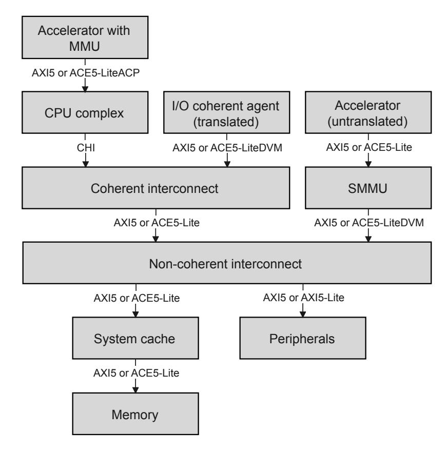

**Figure B2.1: Example system topology showing possible interface classes**

### <span id="page-286-0"></span>**B2.1.1 AXI5**

The AXI5 interface class is a generic interface with no property constraints.

Compared with Issue H of this specification, the following properties are now permitted to be enabled for an AXI5 interface:

- Shareable\_Transactions
- CMO\_On\_Read
- CMO\_On\_Write
- Write\_Plus\_CMO
- WriteZero\_Transaction
- Prefetch\_Transaction
- Cache\_Stash\_Transactions
- DVM\_Message\_Support (Receiver only)
- DVM\_v8, DVM\_v8.1, DVM\_v8.4, DVM\_v9.2
- Coherency\_Connection\_Signals
- DeAllocation\_Transactions
- Persist\_CMO

## <span id="page-286-1"></span>**B2.1.2 ACE5-Lite**

An ACE5-Lite interface was previously needed if an AXI interface included any functionality that required AxSNOOP signals. With this version of the specification, an AXI5 interface is recommended for new designs as it now supports all functionality.

# <span id="page-286-4"></span><span id="page-286-2"></span>**B2.1.3 ACE5-LiteDVM**

An ACE5-LiteDVM interface was previously needed if an interface was required to send or receive DVM messages. With this version of the specification, an AXI5 interface is recommended for new designs as it now supports all functionality.

The most common use-case for an ACE5-LiteDVM interface is for a system MMU to receive invalidation messages on the AC channel. The issuing of DVM messages on the AR channel is mostly done by fully coherent CPUs, so is beyond the scope of this specification.

Note that there are some differences between the definition of ACE5-LiteDVM in this specification, compared with Issue H [\[1\]](#page-16-1).

In this specification, snoop data transfer and bidirectional DVM messages are not supported. Therefore, the following signals described in earlier issues of this specification are no longer required on an ACE5-LiteDVM interface:

- ACSNOOP, all requests on the AC channel can be assumed to be DVM messages.
- ACPROT, not required for DVM messages.
- CRRESP, not required for DVM messages.

# <span id="page-286-5"></span><span id="page-286-3"></span>**B2.1.4 ACE5-LiteACP**

ACE5-LiteACP, which is a subset of ACE5-Lite, is intended for tightly coupling accelerator components to a processor cluster. The interface is optimized for coherent cache line accesses and is less complex than an ACE5-Lite interface.

### *B2.1. Summary of interface classes*

The following constraints apply to ACE5-LiteACP in order to reduce complexity.

- Data width must be 128b (DATA\_WIDTH = 128).
- Size must be 128b (SIZE\_Present = False).
- Length must be 1 or 4 transfers.
- Burst must be INCR (BURST\_Present = False).
- Memory type must be Write-back, that is AxCACHE[1:0] is 0b11 and AxCACHE[3:2] is not 0b00.
- Cache line size must be 64.
- Some other optional features are not permitted, as [Table](#page-299-1) [B2.4](#page-299-1) describes.

## <span id="page-287-0"></span>**B2.1.5 AXI5-Lite**

AXI5-Lite is a subset of AXI5 where all transactions have one data transfer. It is intended for communication with register-based components and simple memories when bursts of data transfer are not advantageous.

The key functionality of AXI5-Lite is:

- All transactions have burst length 1.
- Supported Opcodes are WriteNoSnoop and ReadNoSnoop.
- Reordering of responses is permitted when requests have different IDs.
- All accesses are considered Device Non-bufferable.
- Exclusive accesses are not supported.

<span id="page-287-1"></span>Note that the burst type is assumed to be INCR, this must be taken into account when calculating a parity value for the AxCTLCHK0 signal.

# <span id="page-288-3"></span><span id="page-288-0"></span>**B2.2 Signal matrix**

In [Table](#page-288-1) [B2.2,](#page-288-1) there is a list of all signals with codes that describe the presence requirements for each interface class. The Presence column describes the property condition used to specify the presence of the signal.

<span id="page-288-2"></span>The list of codes that are used is shown in [Table](#page-288-2) [B2.1.](#page-288-2)

**Table B2.1: Key to signals table**

| Code | Manager interfaces | Subordinate interfaces |
|------|--------------------|------------------------|
| Y    | Mandatory          | Mandatory              |
| YM   | Mandatory          | Optional               |
| YS   | Optional           | Mandatory              |
| O    | Optional           | Optional               |
| NS   | Optional           | Not present            |
| N    | Not present        | Not present            |

**Table B2.2: Summary of signal presence for each interface class**

<span id="page-288-1"></span>

| Signal      | Presence                  | AXI5 | ACE5-<br>Lite | ACE5-<br>LiteDVM | ACE5-<br>LiteACP | AXI5-<br>Lite |
|-------------|---------------------------|------|---------------|------------------|------------------|---------------|
| ACLK        | -                         | Y    | Y             | Y                | Y                | Y             |
| ARESETn     | -                         | Y    | Y             | Y                | Y                | Y             |
| AWVALID     | -                         | Y    | Y             | Y                | Y                | Y             |
| AWREADY     | AXI_Transport == Ready    | O    | Y             | Y                | Y                | Y             |
| AWPENDING   | AXI_Transport == Credited | O    | N             | N                | N                | N             |
| AWCRDT      | AXI_Transport == Credited | O    | N             | N                | N                | N             |
| AWCRDTSH    | Shared_Credits_AW == True | O    | N             | N                | N                | N             |
| AWRP        | Num_RP_AWW > 1            | O    | N             | N                | N                | N             |
| AWSHAREDCRD | Shared_Credits_AW == True | O    | N             | N                | N                | N             |
| AWID        | ID_W_WIDTH > 0            | YS   | YS            | YS               | YS               | YS            |
| AWADDR      | -                         | Y    | Y             | Y                | Y                | Y             |
| AWREGION    | REGION_Present            | O    | O             | O                | N                | N             |
| AWLEN       | LEN_Present               | YS   | YS            | YS               | YS               | N             |
| AWSIZE      | SIZE_Present              | YS   | YS            | YS               | N                | O             |
| AWBURST     | BURST_Present             | YS   | YS            | YS               | N                | N             |
| AWLOCK      | Exclusive_Accesses        | O    | O             | O                | N                | N             |
| AWCACHE     | CACHE_Present             | O    | O             | O                | O                | N             |

Table B2.2 – *Continued from previous page*

|                 |                                                                                                                                      |      | Table B2.2 – Continued from previous page |                  |                  |               |  |
|-----------------|--------------------------------------------------------------------------------------------------------------------------------------|------|-------------------------------------------|------------------|------------------|---------------|--|
| Signal          | Presence                                                                                                                             | AXI5 | ACE5-<br>Lite                             | ACE5-<br>LiteDVM | ACE5-<br>LiteACP | AXI5-<br>Lite |  |
| AWPROT          | PROT_Present                                                                                                                         | O    | YM                                        | YM               | YM               | YM            |  |
| AWNSE           | RME_Support                                                                                                                          | O    | O                                         | O                | N                | N             |  |
| AWPAS           | PAS_WIDTH > 0                                                                                                                        | O    | N                                         | N                | N                | N             |  |
| AWINST          | INSTPRIV_Present                                                                                                                     | O    | N                                         | N                | N                | N             |  |
| AWPRIV          | INSTPRIV_Present                                                                                                                     | O    | N                                         | N                | N                | N             |  |
| AWQOS           | QOS_Present                                                                                                                          | O    | O                                         | O                | N                | N             |  |
| AWUSER          | USER_REQ_WIDTH > 0                                                                                                                   | O    | O                                         | O                | O                | O             |  |
| AWDOMAIN        | Shareable_Transactions                                                                                                               | O    | Y                                         | Y                | Y                | N             |  |
| AWSNOOP         | AWSNOOP_WIDTH > 0                                                                                                                    | O    | YS                                        | YS               | YS               | N             |  |
| AWSTASHNID      | STASHNID_Present                                                                                                                     | O    | O                                         | O                | O                | N             |  |
| AWSTASHNIDEN    | STASHNID_Present                                                                                                                     | O    | O                                         | O                | O                | N             |  |
| AWSTASHLPID     | STASHLPID_Present                                                                                                                    | O    | O                                         | O                | O                | N             |  |
| AWSTASHLPIDEN   | STASHLPID_Present                                                                                                                    | O    | O                                         | O                | O                | N             |  |
| AWTRACE         | Trace_Signals                                                                                                                        | O    | O                                         | O                | O                | O             |  |
| AWLOOP          | Loopback_Signals                                                                                                                     | O    | O                                         | O                | N                | N             |  |
| AWMMUVALID      | Untranslated_Transactions == v3 or<br>Untranslated_Transactions == v4                                                                | O    | O                                         | N                | N                | N             |  |
| AWMMUSECSID     | SECSID_WIDTH > 0                                                                                                                     | O    | O                                         | N                | N                | N             |  |
| AWMMUSID        | SID_WIDTH > 0                                                                                                                        | O    | O                                         | N                | N                | N             |  |
| AWMMUSSIDV      | SSID_WIDTH > 0                                                                                                                       | O    | O                                         | N                | N                | N             |  |
| AWMMUSSID       | SSID_WIDTH > 0                                                                                                                       | O    | O                                         | N                | N                | N             |  |
| AWMMUATST       | MMUFLOW_Present and<br>(Untranslated_Transactions == v1 or<br>Untranslated_Transactions == True)                                     | O    | O                                         | N                | N                | N             |  |
| AWMMUFLOW       | MMUFLOW_Present and<br>(Untranslated_Transactions == v2 or<br>Untranslated_Transactions == v3 or<br>Untranslated_Transactions == v4) | O    | O                                         | N                | N                | N             |  |
| AWMMUPASUNKNOWN | Untranslated_Transactions == v4 and<br>RME_Support and PAS_WIDTH > 0                                                                 | O    | N                                         | N                | N                | N             |  |
| AWMMUPM         | GDI_Support and<br>Untranslated_Transactions == v4                                                                                   | O    | N                                         | N                | N                | N             |  |
| AWPBHA          | PBHA_Support                                                                                                                         | O    | O                                         | O                | N                | N             |  |
| AWMECID         | MEC_Support                                                                                                                          | O    | O                                         | O                | N                | N             |  |
| AWNSAID         | NSAccess_Identifiers                                                                                                                 | O    | O                                         | O                | N                | N             |  |

Table B2.2 – *Continued from previous page*

|            |                                                              |      | Table B2.2 – Continued from previous page |                  |                  |               |  |  |
|------------|--------------------------------------------------------------|------|-------------------------------------------|------------------|------------------|---------------|--|--|
| Signal     | Presence                                                     | AXI5 | ACE5-<br>Lite                             | ACE5-<br>LiteDVM | ACE5-<br>LiteACP | AXI5-<br>Lite |  |  |
| AWSUBSYSID | SUBSYSID_WIDTH > 0                                           | O    | O                                         | O                | N                | O             |  |  |
| AWATOP     | Atomic_Transactions                                          | O    | O                                         | O                | N                | N             |  |  |
| AWMPAM     | MPAM_Support != False                                        | O    | O                                         | O                | O                | N             |  |  |
| AWIDUNQ    | Unique_ID_Support                                            | O    | O                                         | O                | O                | O             |  |  |
| AWCMO      | CMO_On_Write                                                 | O    | O                                         | O                | N                | N             |  |  |
| AWTAGOP    | MTE_Support != False                                         | O    | O                                         | O                | N                | N             |  |  |
| AWACT      | ACT_Support != False                                         | O    | N                                         | N                | N                | N             |  |  |
| AWACTV     | ACT_Support != False                                         | O    | N                                         | N                | N                | N             |  |  |
| WVALID     | -                                                            | Y    | Y                                         | Y                | Y                | Y             |  |  |
| WREADY     | AXI_Transport == Ready                                       | O    | Y                                         | Y                | Y                | Y             |  |  |
| WPENDING   | AXI_Transport == Credited                                    | O    | N                                         | N                | N                | N             |  |  |
| WCRDT      | AXI_Transport == Credited                                    | O    | N                                         | N                | N                | N             |  |  |
| WCRDTSH    | Shared_Credits_W == True                                     | O    | N                                         | N                | N                | N             |  |  |
| WRP        | Num_RP_AWW > 1                                               | O    | N                                         | N                | N                | N             |  |  |
| WSHAREDCRD | Shared_Credits_W == True                                     | O    | N                                         | N                | N                | N             |  |  |
| WDATA      | -                                                            | Y    | Y                                         | Y                | Y                | Y             |  |  |
| WSTRB      | WSTRB_Present                                                | YS   | YS                                        | YS               | YS               | YS            |  |  |
| WTAG       | MTE_Support != False                                         | O    | O                                         | O                | N                | N             |  |  |
| WTAGUPDATE | MTE_Support != False                                         | O    | O                                         | O                | N                | N             |  |  |
| WLAST      | WLAST_Present                                                | YM   | YM                                        | YM               | YM               | N             |  |  |
| WUSER      | USER_DATA_WIDTH > 0                                          | O    | O                                         | O                | O                | O             |  |  |
| WPOISON    | Poison                                                       | O    | O                                         | O                | O                | O             |  |  |
| WTRACE     | Trace_Signals                                                | O    | O                                         | O                | O                | O             |  |  |
| BVALID     | -                                                            | Y    | Y                                         | Y                | Y                | Y             |  |  |
| BREADY     | AXI_Transport == Ready                                       | O    | Y                                         | Y                | Y                | Y             |  |  |
| BPENDING   | AXI_Transport == Credited                                    | O    | N                                         | N                | N                | N             |  |  |
| BCRDT      | AXI_Transport == Credited                                    | O    | N                                         | N                | N                | N             |  |  |
| BID        | ID_W_WIDTH > 0                                               | YS   | YS                                        | YS               | YS               | YS            |  |  |
| BIDUNQ     | Unique_ID_Support                                            | O    | O                                         | O                | O                | O             |  |  |
| BRESP      | BRESP_WIDTH > 0                                              | O    | O                                         | O                | O                | O             |  |  |
| BCOMP      | (Persist_CMO and CMO_On_Write)<br>or MTE_Support == Standard | O    | O                                         | O                | N                | N             |  |  |
|            |                                                              |      |                                           |                  |                  |               |  |  |

Table B2.2 – *Continued from previous page*

| Signal      | Presence                     | AXI5 | ACE5-<br>Lite | ACE5-<br>LiteDVM | ACE5-<br>LiteACP | AXI5-<br>Lite |  |
|-------------|------------------------------|------|---------------|------------------|------------------|---------------|--|
| BPERSIST    | Persist_CMO and CMO_On_Write | O    | O             | O                | N                | N             |  |
| BTAGMATCH   | MTE_Support == Standard      | O    | O             | N                | N                | N             |  |
| BUSER       | USER_RESP_WIDTH > 0          | O    | O             | O                | O                | O             |  |
| BTRACE      | Trace_Signals                | O    | O             | O                | O                | O             |  |
| BLOOP       | Loopback_Signals             | O    | O             | O                | N                | N             |  |
| BBUSY       | Busy_Support                 | O    | O             | O                | N                | N             |  |
| ARVALID     | -                            | Y    | Y             | Y                | Y                | Y             |  |
| ARREADY     | AXI_Transport == Ready       | O    | Y             | Y                | Y                | Y             |  |
| ARPENDING   | AXI_Transport == Credited    | O    | N             | N                | N                | N             |  |
| ARCRDT      | AXI_Transport == Credited    | O    | N             | N                | N                | N             |  |
| ARCRDTSH    | Shared_Credits_AR == True    | O    | N             | N                | N                | N             |  |
| ARRP        | Num_RP_AR > 1                | O    | N             | N                | N                | N             |  |
| ARSHAREDCRD | Shared_Credits_AR == True    | O    | N             | N                | N                | N             |  |
| ARID        | ID_R_WIDTH > 0               | YS   | YS            | YS               | YS               | YS            |  |
| ARADDR      | -                            | Y    | Y             | Y                | Y                | Y             |  |
| ARREGION    | REGION_Present               | O    | O             | O                | N                | N             |  |
| ARLEN       | LEN_Present                  | YS   | YS            | YS               | YS               | N             |  |
| ARSIZE      | SIZE_Present                 | YS   | YS            | YS               | N                | O             |  |
| ARBURST     | BURST_Present                | YS   | YS            | YS               | N                | N             |  |
| ARLOCK      | Exclusive_Accesses           | O    | O             | O                | N                | N             |  |
| ARCACHE     | CACHE_Present                | O    | O             | O                | O                | N             |  |
| ARPROT      | PROT_Present                 | O    | YM            | YM               | YM               | YM            |  |
| ARNSE       | RME_Support                  | O    | O             | O                | N                | N             |  |
| ARPAS       | PAS_WIDTH > 0                | O    | N             | N                | N                | N             |  |
| ARINST      | INSTPRIV_Present             | O    | N             | N                | N                | N             |  |
| ARPRIV      | INSTPRIV_Present             | O    | N             | N                | N                | N             |  |
| ARQOS       | QOS_Present                  | O    | O             | O                | N                | N             |  |
| ARUSER      | USER_REQ_WIDTH > 0           | O    | O             | O                | O                | O             |  |
| ARDOMAIN    | Shareable_Transactions       | O    | Y             | Y                | Y                | N             |  |
| ARSNOOP     | ARSNOOP_WIDTH > 0            | O    | YS            | YS               | O                | N             |  |
| ARTRACE     | Trace_Signals                | O    | O             | O                | O                | O             |  |
| ARLOOP      | Loopback_Signals             | O    | O             | O                | N                | N             |  |
|             |                              |      |               |                  |                  |               |  |

Table B2.2 – *Continued from previous page*

| Signal          | Presence                                                                                                                             | AXI5 | ACE5-<br>Lite | ACE5-<br>LiteDVM | ACE5-<br>LiteACP | AXI5-<br>Lite |  |
|-----------------|--------------------------------------------------------------------------------------------------------------------------------------|------|---------------|------------------|------------------|---------------|--|
| ARMMUVALID      | Untranslated_Transactions == v3 or<br>Untranslated_Transactions == v4                                                                | O    | O             | N                | N                | N             |  |
| ARMMUSECSID     | SECSID_WIDTH > 0                                                                                                                     | O    | O             | N                | N                | N             |  |
| ARMMUSID        | SID_WIDTH > 0                                                                                                                        | O    | O             | N                | N                | N             |  |
| ARMMUSSIDV      | SSID_WIDTH > 0                                                                                                                       | O    | O             | N                | N                | N             |  |
| ARMMUSSID       | SSID_WIDTH > 0                                                                                                                       | O    | O             | N                | N                | N             |  |
| ARMMUATST       | MMUFLOW_Present and<br>(Untranslated_Transactions == v1 or<br>Untranslated_Transactions == True)                                     | O    | O             | N                | N                | N             |  |
| ARMMUFLOW       | MMUFLOW_Present and<br>(Untranslated_Transactions == v2 or<br>Untranslated_Transactions == v3 or<br>Untranslated_Transactions == v4) | O    | O             | N                | N                | N             |  |
| ARMMUPASUNKNOWN | Untranslated_Transactions == v4 and<br>RME_Support and PAS_WIDTH > 0                                                                 | O    | N             | N                | N                | N             |  |
| ARMMUPM         | GDI_Support and<br>Untranslated_Transactions == v4                                                                                   | O    | N             | N                | N                | N             |  |
| ARPBHA          | PBHA_Support                                                                                                                         | O    | O             | O                | N                | N             |  |
| ARMECID         | MEC_Support                                                                                                                          | O    | O             | O                | N                | N             |  |
| ARNSAID         | NSAccess_Identifiers                                                                                                                 | O    | O             | O                | N                | N             |  |
| ARSUBSYSID      | SUBSYSID_WIDTH > 0                                                                                                                   | O    | O             | O                | N                | O             |  |
| ARMPAM          | MPAM_Support != False                                                                                                                | O    | O             | O                | O                | N             |  |
| ARCHUNKEN       | Read_Data_Chunking                                                                                                                   | O    | O             | O                | O                | N             |  |
| ARIDUNQ         | Unique_ID_Support                                                                                                                    | O    | O             | O                | O                | O             |  |
| ARTAGOP         | MTE_Support != False                                                                                                                 | O    | O             | O                | N                | N             |  |
| ARACT           | ACT_Support != False                                                                                                                 | O    | N             | N                | N                | N             |  |
| ARACTV          | ACT_Support != False                                                                                                                 | O    | N             | N                | N                | N             |  |
| RVALID          | -                                                                                                                                    | Y    | Y             | Y                | Y                | Y             |  |
| RREADY          | AXI_Transport == Ready                                                                                                               | O    | Y             | Y                | Y                | Y             |  |
| RPENDING        | AXI_Transport == Credited                                                                                                            | O    | N             | N                | N                | N             |  |
| RCRDT           | AXI_Transport == Credited                                                                                                            | O    | N             | N                | N                | N             |  |
| RID             | ID_R_WIDTH > 0                                                                                                                       | YS   | YS            | YS               | YS               | YS            |  |
| RIDUNQ          | Unique_ID_Support                                                                                                                    | O    | O             | O                | O                | O             |  |
| RDATA           | -                                                                                                                                    | Y    | Y             | Y                | Y                | Y             |  |
| RTAG            | MTE_Support != False                                                                                                                 | O    | O             | O                | N                | N             |  |

Table B2.2 – *Continued from previous page*

| Signal     | Presence                                                         | AXI5 | ACE5-<br>Lite | ACE5-<br>LiteDVM | ACE5-<br>LiteACP | AXI5-<br>Lite |
|------------|------------------------------------------------------------------|------|---------------|------------------|------------------|---------------|
| RRESP      | RRESP_WIDTH > 0                                                  | O    | O             | O                | O                | O             |
| RLAST      | RLAST_Present                                                    | YS   | YS            | YS               | YS               | N             |
| RUSER      | USER_DATA_WIDTH > 0 or<br>USER_RESP_WIDTH > 0                    | O    | O             | O                | O                | O             |
| RPOISON    | Poison                                                           | O    | O             | O                | O                | O             |
| RTRACE     | Trace_Signals                                                    | O    | O             | O                | O                | O             |
| RLOOP      | Loopback_Signals                                                 | O    | O             | O                | N                | N             |
| RCHUNKV    | Read_Data_Chunking                                               | O    | O             | O                | O                | N             |
| RCHUNKNUM  | RCHUNKNUM_WIDTH > 0                                              | O    | O             | O                | O                | N             |
| RCHUNKSTRB | RCHUNKSTRB_WIDTH > 0                                             | O    | O             | O                | O                | N             |
| RBUSY      | Busy_Support                                                     | O    | O             | O                | N                | N             |
| ACVALID    | DVM_Message_Support                                              | O    | N             | Y                | N                | N             |
| ACREADY    | DVM_Message_Support and<br>AXI_Transport == Ready                | O    | N             | Y                | N                | N             |
| ACPENDING  | DVM_Message_Support and<br>AXI_Transport == Credited             | O    | N             | N                | N                | N             |
| ACCRDT     | DVM_Message_Support and<br>AXI_Transport == Credited             | O    | N             | N                | N                | N             |
| ACADDR     | DVM_Message_Support and<br>AXI_Transport == Credited             | O    | N             | Y                | N                | N             |
| ACVMIDEXT  | DVM_Message_Support and<br>(DVM_v8.1 or DVM_v8.4 or<br>DVM_v9.2) | O    | N             | O                | N                | N             |
| ACTRACE    | DVM_Message_Support and<br>Trace_Signals                         | O    | N             | O                | N                | N             |
| CRVALID    | DVM_Message_Support                                              | O    | N             | Y                | N                | N             |
| CRREADY    | DVM_Message_Support and<br>AXI_Transport == Ready                | O    | N             | Y                | N                | N             |
| CRPENDING  | DVM_Message_Support and<br>AXI_Transport == Credited             | O    | N             | N                | N                | N             |
| CRCRDT     | DVM_Message_Support and<br>AXI_Transport == Credited             | O    | N             | N                | N                | N             |
| CRTRACE    | DVM_Message_Support and<br>Trace_Signals                         | O    | N             | O                | N                | N             |
| AWAKEUP    | Wakeup_Signals                                                   | O    | O             | O                | O                | O             |

Table B2.2 – *Continued from previous page*

<span id="page-294-0"></span>

| Signal              | Presence                                                            | AXI5 | ACE5-<br>Lite | ACE5-<br>LiteDVM | ACE5-<br>LiteACP | AXI5-<br>Lite |  |
|---------------------|---------------------------------------------------------------------|------|---------------|------------------|------------------|---------------|--|
| ACWAKEUP            | Wakeup_Signals and<br>DVM_Message_Support                           | O    | N             | O                | N                | N             |  |
| ACTIVATEREQ         | Credit_Control ==<br>Implicit_Return_Uni                            | O    | N             | N                | N                | N             |  |
| ACTIVATEACK         | Credit_Control ==<br>Implicit_Return_Uni                            | O    | N             | N                | N                | N             |  |
| ASKSTOP             | Credit_Control ==<br>Implicit_Return_Uni                            | O    | N             | N                | N                | N             |  |
| ACTIVATEREQD        | DVM_Message_Support and<br>Credit_Control ==<br>Implicit_Return_Uni | O    | N             | N                | N                | N             |  |
| ACTIVATEACKD        | DVM_Message_Support and<br>Credit_Control ==<br>Implicit_Return_Uni | O    | N             | N                | N                | N             |  |
| ASKSTOPD            | DVM_Message_Support and<br>Credit_Control ==<br>Implicit_Return_Uni | O    | N             | N                | N                | N             |  |
| VARQOSACCEPT        | QoS_Accept                                                          | O    | O             | O                | N                | N             |  |
| VAWQOSACCEPT        | QoS_Accept                                                          | O    | O             | O                | N                | N             |  |
| SYSCOREQ            | Coherency_Connection_Signals                                        | O    | N             | O                | N                | N             |  |
| SYSCOACK            | Coherency_Connection_Signals                                        | O    | N             | O                | N                | N             |  |
| BROADCASTATOMIC     | -                                                                   | NS   | NS            | NS               | N                | N             |  |
| BROADCASTSHAREABLE  | -                                                                   | NS   | NS            | NS               | NS               | N             |  |
| BROADCASTCACHEMAINT | -                                                                   | NS   | NS            | NS               | N                | N             |  |
| BROADCASTCMOPOPA    | -                                                                   | NS   | NS            | NS               | N                | N             |  |
| BROADCASTPERSIST    | -                                                                   | NS   | NS            | NS               | N                | N             |  |
| BROADCASTSTORAGE    | -                                                                   | NS   | N             | N                | N                | N             |  |
|                     |                                                                     |      |               |                  |                  |               |  |

# <span id="page-295-1"></span><span id="page-295-0"></span>**B2.3 Parity check signal matrix**

Parity check signals for each interface type are shown in [Table](#page-295-1) [B2.3,](#page-295-1) using the codes defined in [Table](#page-288-2) [B2.1.](#page-288-2) Parity check signals are described in [A16.2.3](#page-266-0) *[Parity check signals](#page-266-0)*.

**Table B2.3: Summary of check signal presence for each interface class**

| Signal             | AXI5 | ACE5-<br>Lite | ACE5-<br>LiteDVM | ACE5-<br>LiteACP | AXI5-<br>Lite |
|--------------------|------|---------------|------------------|------------------|---------------|
| AWVALIDCHK         | O    | O             | O                | O                | O             |
| AWREADYCHK         | O    | O             | O                | O                | O             |
| AWPENDINGCHK       | O    | N             | N                | N                | N             |
| AWCRDTCHK          | O    | N             | N                | N                | N             |
| AWCRDTSHCHK        | O    | N             | N                | N                | N             |
| AWRPCHK            | O    | N             | N                | N                | N             |
| AWSHAREDCRDCHK     | O    | N             | N                | N                | N             |
| AWIDCHK            | O    | O             | O                | O                | O             |
| AWADDRCHK          | O    | O             | O                | O                | O             |
| AWLENCHK           | O    | O             | O                | O                | N             |
| AWCTLCHK0          | O    | O             | O                | O                | O             |
| AWCTLCHK1          | O    | O             | O                | O                | N             |
| AWCTLCHK2          | O    | O             | O                | O                | N             |
| AWCTLCHK3          | O    | O             | O                | N                | N             |
| AWPASCHK           | O    | N             | N                | N                | N             |
| AWINSTPRIVCHK      | O    | N             | N                | N                | N             |
| AWUSERCHK          | O    | O             | O                | O                | O             |
| AWSTASHNIDCHK      | O    | O             | O                | O                | N             |
| AWSTASHLPIDCHK     | O    | O             | O                | O                | N             |
| AWTRACECHK         | O    | O             | O                | O                | O             |
| AWLOOPCHK          | O    | O             | O                | N                | N             |
| AWMMUCHK           | O    | O             | N                | N                | N             |
| AWMMUSIDCHK        | O    | O             | N                | N                | N             |
| AWMMUSSIDCHK       | O    | O             | N                | N                | N             |
| AWMMUPASUNKNOWNCHK | O    | N             | N                | N                | N             |
| AWMMUPMCHK         | O    | N             | N                | N                | N             |
| AWPBHACHK          | O    | O             | O                | N                | N             |
| AWNSAIDCHK         | O    | O             | O                | N                | N             |

Table B2.3 – *Continued from previous page*

| Signal        | AXI5 | ACE5-<br>Lite | ACE5-<br>LiteDVM | ACE5-<br>LiteACP | AXI5-<br>Lite |
|---------------|------|---------------|------------------|------------------|---------------|
| AWMPAMCHK     | O    | O             | O                | O                | N             |
| AWSUBSYSIDCHK | O    | O             | O                | N                | O             |
| AWMECIDCHK    | O    | O             | O                | N                | N             |
| AWACTCHK      | O    | N             | N                | N                | N             |
| WVALIDCHK     | O    | O             | O                | O                | O             |
| WREADYCHK     | O    | O             | O                | O                | O             |
| WPENDINGCHK   | O    | N             | N                | N                | N             |
| WCRDTCHK      | O    | N             | N                | N                | N             |
| WCRDTSHCHK    | O    | N             | N                | N                | N             |
| WRPCHK        | O    | N             | N                | N                | N             |
| WSHAREDCRDCHK | O    | N             | N                | N                | N             |
| WDATACHK      | O    | O             | O                | O                | O             |
| WSTRBCHK      | O    | O             | O                | O                | O             |
| WTAGCHK       | O    | O             | O                | N                | N             |
| WLASTCHK      | O    | O             | O                | O                | N             |
| WUSERCHK      | O    | O             | O                | O                | O             |
| WPOISONCHK    | O    | O             | O                | O                | O             |
| WTRACECHK     | O    | O             | O                | O                | O             |
| BVALIDCHK     | O    | O             | O                | O                | O             |
| BREADYCHK     | O    | O             | O                | O                | O             |
| BPENDINGCHK   | O    | N             | N                | N                | N             |
| BCRDTCHK      | O    | N             | N                | N                | N             |
| BIDCHK        | O    | O             | O                | O                | O             |
| BRESPCHK      | O    | O             | O                | O                | O             |
| BUSERCHK      | O    | O             | O                | O                | O             |
| BTRACECHK     | O    | O             | O                | O                | O             |
| BLOOPCHK      | O    | O             | O                | N                | N             |
| ARVALIDCHK    | O    | O             | O                | O                | O             |
| ARREADYCHK    | O    | O             | O                | O                | O             |
| ARPENDINGCHK  | O    | N             | N                | N                | N             |
| ARCRDTCHK     | O    | N             | N                | N                | N             |
| ARCRDTSHCHK   | O    | N             | N                | N                | N             |

Table B2.3 – *Continued from previous page*

| Signal             | AXI5 | ACE5- | Table B2.3 – Continued from previous page<br>ACE5- | ACE5-   | AXI5- |
|--------------------|------|-------|----------------------------------------------------|---------|-------|
|                    |      | Lite  | LiteDVM                                            | LiteACP | Lite  |
| ARRPCHK            | O    | N     | N                                                  | N       | N     |
| ARSHAREDCRDCHK     | O    | N     | N                                                  | N       | N     |
| ARIDCHK            | O    | O     | O                                                  | O       | O     |
| ARADDRCHK          | O    | O     | O                                                  | O       | O     |
| ARLENCHK           | O    | O     | O                                                  | O       | N     |
| ARCTLCHK0          | O    | O     | O                                                  | O       | O     |
| ARCTLCHK1          | O    | O     | O                                                  | O       | N     |
| ARCTLCHK2          | O    | O     | O                                                  | O       | N     |
| ARCTLCHK3          | O    | O     | O                                                  | O       | N     |
| ARPASCHK           | O    | N     | N                                                  | N       | N     |
| ARINSTPRIVCHK      | O    | N     | N                                                  | N       | N     |
| ARUSERCHK          | O    | O     | O                                                  | O       | O     |
| ARTRACECHK         | O    | O     | O                                                  | O       | O     |
| ARLOOPCHK          | O    | O     | O                                                  | N       | N     |
| ARMMUCHK           | O    | O     | N                                                  | N       | N     |
| ARMMUSIDCHK        | O    | O     | N                                                  | N       | N     |
| ARMMUSSIDCHK       | O    | O     | N                                                  | N       | N     |
| ARMMUPASUNKNOWNCHK | O    | N     | N                                                  | N       | N     |
| ARMMUPMCHK         | O    | N     | N                                                  | N       | N     |
| ARNSAIDCHK         | O    | O     | O                                                  | N       | N     |
| ARMPAMCHK          | O    | O     | O                                                  | O       | N     |
| ARPBHACHK          | O    | O     | O                                                  | N       | N     |
| ARSUBSYSIDCHK      | O    | O     | O                                                  | N       | O     |
| ARMECIDCHK         | O    | O     | O                                                  | N       | N     |
| ARACTCHK           | O    | N     | N                                                  | N       | N     |
| RVALIDCHK          | O    | O     | O                                                  | O       | O     |
| RREADYCHK          | O    | O     | O                                                  | O       | O     |
| RPENDINGCHK        | O    | N     | N                                                  | N       | N     |
| RCRDTCHK           | O    | N     | N                                                  | N       | N     |
| RIDCHK             | O    | O     | O                                                  | O       | O     |
| RDATACHK           | O    | O     | O                                                  | O       | O     |
| RTAGCHK            | O    | O     | O                                                  | N       | N     |
|                    |      |       |                                                    |         |       |

Table B2.3 – *Continued from previous page*

<span id="page-298-0"></span>

| Signal          | AXI5 | ACE5-<br>Lite | ACE5-<br>LiteDVM | ACE5-<br>LiteACP | AXI5-<br>Lite |
|-----------------|------|---------------|------------------|------------------|---------------|
| RRESPCHK        | O    | O             | O                | O                | O             |
| RLASTCHK        | O    | O             | O                | O                | N             |
| RCHUNKCHK       | O    | O             | O                | O                | N             |
| RUSERCHK        | O    | O             | O                | O                | O             |
| RPOISONCHK      | O    | O             | O                | O                | O             |
| RTRACECHK       | O    | O             | O                | O                | O             |
| RLOOPCHK        | O    | O             | O                | N                | N             |
| ACVALIDCHK      | O    | N             | O                | N                | N             |
| ACREADYCHK      | O    | N             | O                | N                | N             |
| ACPENDINGCHK    | O    | N             | N                | N                | N             |
| ACCRDTCHK       | O    | N             | N                | N                | N             |
| ACADDRCHK       | O    | N             | O                | N                | N             |
| ACVMIDEXTCHK    | O    | N             | O                | N                | N             |
| ACTRACECHK      | O    | N             | O                | N                | N             |
| CRVALIDCHK      | O    | N             | O                | N                | N             |
| CRREADYCHK      | O    | N             | O                | N                | N             |
| CRPENDINGCHK    | O    | N             | N                | N                | N             |
| CRCRDTCHK       | O    | N             | N                | N                | N             |
| CRTRACECHK      | O    | N             | O                | N                | N             |
| VAWQOSACCEPTCHK | O    | O             | O                | N                | N             |
| VARQOSACCEPTCHK | O    | O             | O                | N                | N             |
| AWAKEUPCHK      | O    | O             | O                | O                | O             |
| ACWAKEUPCHK     | O    | N             | O                | N                | N             |
| ACTIVATEREQCHK  | O    | N             | N                | N                | N             |
| ACTIVATEACKCHK  | O    | N             | N                | N                | N             |
| ASKSTOPCHK      | O    | N             | N                | N                | N             |
| ACTIVATEREQDCHK | O    | N             | N                | N                | N             |
| ACTIVATEACKDCHK | O    | N             | N                | N                | N             |
| ASKSTOPDCHK     | O    | N             | N                | N                | N             |
| SYSCOREQCHK     | O    | N             | O                | N                | N             |
| SYSCOACKCHK     | O    | N             | O                | N                | N             |

# <span id="page-299-0"></span>**B2.4 Property matrix**

A list of all properties is shown in [Table](#page-299-1) [B2.4.](#page-299-1)

The table shows the document issue in which the property was introduced and all legal values for the property. There is a column for each interface class which shows the legal values of that property for that interface class. A dash means there are no constraints on the property value.

Note that for User signals and User Loopback signals, the maximum width values are a recommendation rather than a rule. See [A12.5](#page-201-0) *[User defined signaling](#page-201-0)* and [A12.4](#page-199-0) *[User Loopback signaling](#page-199-0)* for more information.

**Table B2.4: Summary of interface property constraints**

<span id="page-299-1"></span>

| Property                     | Issue | Values                                                 | AXI5 | ACE5-<br>Lite | ACE5-<br>LiteDVM | ACE5-<br>LiteACP | AXI5-<br>Lite |
|------------------------------|-------|--------------------------------------------------------|------|---------------|------------------|------------------|---------------|
| ACT_Support                  | L     | v1, False                                              | -    | False         | False            | False            | False         |
| ACT_R_WIDTH                  | L     | 0, 1632                                                | -    | 0             | 0                | 0                | 0             |
| ACT_W_WIDTH                  | L     | 0, 1632                                                | -    | 0             | 0                | 0                | 0             |
| ADDR_WIDTH                   | H     | 164                                                    | -    | -             | -                | -                | -             |
| ARSNOOP_WIDTH                | J     | 0, 4                                                   | -    | -             | -                | -                | 0             |
| Atomic_Transactions          | F     | True, False                                            | -    | -             | -                | False            | False         |
| AWCMO_WIDTH                  | J     | 0, 2, 3                                                | -    | -             | -                | 0                | 0             |
| AWSNOOP_WIDTH                | J     | 0, 4, 5                                                | -    | -             | -                | -                | 0             |
| AXI_Transport                | L     | Ready, Credited                                        | -    | Ready         | Ready            | Ready            | Ready         |
| BRESP_WIDTH                  | J     | 0, 2, 3                                                | -    | -             | -                | -                | -             |
| BURST_Present                | J     | True, False                                            | -    | -             | -                | False            | False         |
| Busy_Support                 | J     | True, False                                            | -    | -             | -                | False            | False         |
| Cache_Line_Size              | K     | 16, 32, 64, 128, 256,<br>512, 1024, 2048               | -    | -             | -                | 64               | -             |
| CACHE_Present                | J     | True, False                                            | -    | -             | -                | -                | False         |
| Cache_Stash_Transactions     | F     | True, Basic, False                                     | -    | -             | -                | -                | False         |
| Check_Type                   | F     | Odd_Parity_Byte_All,<br>Odd_Parity_Byte_Data,<br>False | -    | -             | -                | -                | -             |
| CMO_On_Read                  | G     | True, False                                            | -    | -             | -                | False            | False         |
| CMO_On_Write                 | G     | True, False                                            | -    | -             | -                | False            | False         |
| Coherency_Connection_Signals | F     | True, False                                            | -    | False         | -                | False            | False         |
| Consistent_DECERR            | H     | True, False                                            | -    | -             | -                | -                | True          |
| Credit_Control               | L     | False,<br>Implicit_Return_Uni                          | -    | False         | False            | False            | False         |
| DATA_WIDTH                   | H     | 8, 16, 32, 64, 128, 256,<br>512, 1024                  | -    | -             | -                | 128              | -             |

Table B2.4 – *Continued from previous page*

| Property                   | Issue | Values                                 | AXI5 | ACE5-<br>Lite | ACE5-<br>LiteDVM | ACE5-<br>LiteACP | AXI5-<br>Lite |
|----------------------------|-------|----------------------------------------|------|---------------|------------------|------------------|---------------|
| DeAllocation_Transactions  | F     | True, False                            | -    | -             | -                | False            | False         |
| Device_Normal_Independence | K     | True, False                            | -    | -             | -                | -                | -             |
| DVM_Message_Support        | H     | Receiver, False                        | -    | False         | Receiver         | False            | False         |
| DVM_v8                     | E     | True, False                            | -    | False         | -                | False            | False         |
| DVM_v8.1                   | F     | True, False                            | -    | False         | -                | False            | False         |
| DVM_v8.4                   | H     | True, False                            | -    | False         | -                | False            | False         |
| DVM_v9.2                   | J     | True, False                            | -    | False         | -                | False            | False         |
| Exclusive_Accesses         | H     | True, False                            | -    | -             | -                | False            | False         |
| Fixed_Burst_Disable        | K     | True, False                            | -    | -             | -                | False            | False         |
| GDI_Support                | L     | True, False                            | -    | False         | False            | False            | False         |
| ID_R_WIDTH                 | H     | 032                                    | -    | -             | -                | -                | -             |
| ID_W_WIDTH                 | H     | 032                                    | -    | -             | -                | -                | -             |
| INSTPRIV_Present           | L     | True, False                            | -    | False         | False            | False            | False         |
| InvalidateHint_Transaction | J     | True, False                            | -    | -             | -                | False            | False         |
| LEN_Present                | J     | True, False                            | -    | -             | -                | -                | False         |
| LOOP_R_WIDTH               | H     | 08                                     | -    | -             | -                | 0                | 0             |
| LOOP_W_WIDTH               | H     | 08                                     | -    | -             | -                | 0                | 0             |
| Loopback_Signals           | F     | True, False                            | -    | -             | -                | False            | False         |
| Max_Transaction_Bytes      | H     | 64, 128, 256, 512,<br>1024, 2048, 4096 | -    | -             | -                | -                | -             |
| MMUFLOW_Present            | J     | True, False                            | -    | -             | False            | False            | False         |
| MEC_Support                | K     | True, False                            | -    | -             | -                | False            | False         |
| MECID_WIDTH                | K     | 0, 16                                  | -    | -             | -                | 0                | 0             |
| MPAM_Support               | K     | MPAM_9_1,<br>MPAM_12_1, False          | -    | -             | -                | -                | False         |
| MPAM_WIDTH                 | K     | 0, 11, 12, 14, 15                      | -    | -             | -                | -                | 0             |
| MTE_Support                | K     | Standard, Simplified,<br>Basic, False  | -    | -             | Basic,<br>False  | False            | False         |
| Multi_Copy_Atomicity       | E     | True, False                            | -    | -             | -                | -                | -             |
| NSAccess_Identifiers       | F     | True, False                            | -    | -             | -                | False            | False         |
| Num_RP_AR                  | L     | 18                                     | -    | 1             | 1                | 1                | 1             |
| Num_RP_AWW                 | L     | 18                                     | -    | 1             | 1                | 1                | 1             |
| Ordered_Write_Observation  | E     | True, False                            | -    | -             | -                | -                | -             |

Table B2.4 – *Continued from previous page*

| Property                   | Issue | Values           | AXI5 | ACE5-<br>Lite | ACE5-<br>LiteDVM | ACE5-<br>LiteACP | AXI5-<br>Lite |
|----------------------------|-------|------------------|------|---------------|------------------|------------------|---------------|
| PAS_WIDTH                  | L     | 03               | -    | 0             | 0                | 0                | 0             |
| PBHA_Support               | J     | True, False      | -    | -             | -                | False            | False         |
| PROT_Present               | J     | True, False      | -    | -             | -                | -                | -             |
| Persist_CMO                | F     | True, False      | -    | -             | -                | False            | False         |
| Poison                     | F     | True, False      | -    | -             | -                | -                | -             |
| Prefetch_Transaction       | H     | True, False      | -    | -             | -                | False            | False         |
| QoS_Accept                 | F     | True, False      | -    | -             | -                | False            | False         |
| QOS_Present                | J     | True, False      | -    | -             | -                | False            | False         |
| RCHUNKNUM_WIDTH            | J     | 0, 1, 5, 6, 7, 8 | -    | -             | -                | -                | 0             |
| RCHUNKSTRB_WIDTH           | J     | 0, 1, 2, 4, 8    | -    | -             | -                | -                | 0             |
| Read_Data_Chunking         | G     | True, False      | -    | -             | -                | -                | False         |
| Read_Interleaving_Disabled | G     | True, False      | -    | -             | -                | -                | False         |
| REGION_Present             | J     | True, False      | -    | -             | -                | False            | False         |
| Regular_Transactions_Only  | H     | True, False      | -    | -             | -                | False            | False         |
| RLAST_Present              | J     | True, False      | -    | -             | -                | -                | False         |
| RME_Support                | J     | True, False      | -    | -             | -                | False            | False         |
| RRESP_WIDTH                | J     | 0, 2, 3          | -    | -             | -                | -                | -             |
| SECSID_WIDTH               | J     | 0, 1, 2          | -    | -             | 0                | 0                | 0             |
| Shareable_Cache_Support    | J     | True, False      | -    | -             | False            | False            | False         |
| Shareable_Transactions     | H     | True, False      | -    | True          | True             | True             | False         |
| Shared_Credits_AR          | L     | True, False      | -    | False         | False            | False            | False         |
| Shared_Credits_AW          | L     | True, False      | -    | False         | False            | False            | False         |
| Shared_Credits_W           | L     | True, False      | -    | False         | False            | False            | False         |
| SID_WIDTH                  | H     | 032              | -    | -             | 0                | 0                | 0             |
| SIZE_Present               | J     | True, False      | -    | -             | -                | False            | -             |
| SSID_WIDTH                 | H     | 020              | -    | -             | 0                | 0                | 0             |
| STASHLPID_Present          | J     | True, False      | -    | -             | -                | -                | False         |
| STASHNID_Present           | J     | True, False      | -    | -             | -                | -                | False         |
| Storage_CMO                | L     | True, False      | -    | False         | False            | False            | False         |
| SUBSYSID_WIDTH             | J     | 08               | -    | -             | -                | 0                | -             |
| Trace_Signals              | F     | True, False      | -    | -             | -                | -                | -             |
| Unique_ID_Support          | G     | True, False      | -    | -             | -                | -                | -             |

Table B2.4 – *Continued from previous page*

<span id="page-302-0"></span>

| Property                       | Issue | Values                         | AXI5 | ACE5-<br>Lite | ACE5-<br>LiteDVM | ACE5-<br>LiteACP | AXI5-<br>Lite |
|--------------------------------|-------|--------------------------------|------|---------------|------------------|------------------|---------------|
| UnstashTranslation_Transaction | J     | True, False                    | -    | -             | False            | False            | False         |
| Untranslated_Transactions      | F     | v4, v3, v2, v1, True,<br>False | -    | -             | False            | False            | False         |
| USER_DATA_WIDTH                | H     | 0DATA_WIDTH/2                  | -    | -             | -                | -                | -             |
| USER_REQ_WIDTH                 | H     | 0128                           | -    | -             | -                | -                | -             |
| USER_RESP_WIDTH                | H     | 016                            | -    | -             | -                | -                | -             |
| Wrap_CLS_Modifiable            | L     | True, False                    | -    | -             | -                | -                | False         |
| WLAST_Present                  | J     | True, False                    | -    | -             | -                | -                | False         |
| WSTRB_Present                  | J     | True, False                    | -    | -             | -                | -                | -             |
| Wakeup_Signals                 | F     | True, False                    | -    | -             | -                | -                | -             |
| Write_Plus_CMO                 | H     | True, False                    | -    | -             | -                | False            | False         |
| WriteDeferrable_Transaction    | J     | True, False                    | -    | -             | -                | False            | False         |
| WriteZero_Transaction          | H     | True, False                    | -    | -             | -                | False            | False         |
| WriteNoSnoopFull_Transaction   | K     | True, False                    | -    | -             | -                | False            | False         |

<span id="page-303-0"></span>

| Chapter B3                |
|---------------------------|
| Summary of ID constraints |

This appendix is a summary of ID usage constraints in this document.

Must use an ID that is unique in-flight on the same channels:

- Atomic transactions
- Prefetch transactions
- WriteZero transactions
- WriteDeferrable transactions
- InvalidateHint transactions
- Read transactions with data chunking enabled
- Transactions which transport MTE tags
- UnstashTranslation transactions
- ACT transactions

Must not use the same ID for in-flight transactions on the same channels:

- DVM Complete and non-DVM Complete transactions
- StashOnce and non-StashOnce transactions
- Translated and untranslated transactions
- StashTranslation and non-StashTranslation transactions

Must use the same ID:

- Multiple outstanding requests that require ordering between them.
- Transactions in an exclusive access pair.

# <span id="page-305-0"></span>Chapter B4 **Revisions**

This appendix describes the technical changes between released issues of this specification.

It contains the following sections:

- [B4.1](#page-306-0) *[Differences between Issue H.c and Issue J](#page-306-0)*
- [B4.2](#page-308-0) *[Differences between Issue J and Issue K](#page-308-0)*
- [B4.3](#page-310-0) *[Differences between Issue K and Issue L](#page-310-0)*

# <span id="page-306-0"></span>**B4.1 Differences between Issue H.c and Issue J**

| Feature                                                                  | Change        | Detail                                                                                                                                                                                                                                                                         |  |
|--------------------------------------------------------------------------|---------------|--------------------------------------------------------------------------------------------------------------------------------------------------------------------------------------------------------------------------------------------------------------------------------|--|
| AXI3, AXI4, AXI4-Lite<br>interfaces                                      | Removal       | AXI3, AXI4, and AXI4-Lite content is removed from the specification.<br>These interface types are not recommended for new designs and have<br>been superseded by the AXI5 interface. Removed content can be<br>accessed by downloading earlier versions of this specification. |  |
| ACE and ACE5<br>interfaces                                               | Removal       | ACE and ACE5 content is removed from the specification. AMBA CHI<br>is recommended for fully coherent agents and is actively supported.                                                                                                                                        |  |
| ACE5-Lite,<br>ACE5-LiteDVM,<br>ACE5-LiteACP, and<br>AXI5-Lite interfaces | Update        | ACE5-Lite, ACE5-LiteDVM, ACE5-LiteACP, and AXI5-Lite interfaces<br>are described through constraints on property values and signal<br>presence.                                                                                                                                |  |
| AXI5 interface                                                           | New feature   | All optional features in this specification are now applicable to AXI5<br>class interfaces. AXI5 is expected to be used for general-purpose<br>interfaces.                                                                                                                     |  |
| Caching shareable lines                                                  | New feature   | Support for storing shareable lines in a system cache.                                                                                                                                                                                                                         |  |
| Cache stashing                                                           | New feature   | There is an additional Basic option for cache stashing to support<br>interfaces which use only a sub-set of the cache stashing protocol.                                                                                                                                       |  |
| Invalidate hint                                                          | New feature   | InvalidateHint transaction, which can be used by an agent when it is<br>finished working with a data set and that data might be allocated in a<br>downstream cache.                                                                                                            |  |
| WriteDeferrable<br>transaction                                           | New feature   | A 64-byte atomic store operation that might not be accepted by the<br>Subordinate.                                                                                                                                                                                             |  |
| Realm Management<br>Extension (RME)                                      | New feature   | Enhanced memory protection.                                                                                                                                                                                                                                                    |  |
| DVM v9.2                                                                 | New feature   | New messages to support the Armv9.2 architecture.                                                                                                                                                                                                                              |  |
| Untranslated transactions                                                | New feature   | Version 3 adds support for mixing translated and untranslated<br>transactions.                                                                                                                                                                                                 |  |
|                                                                          | New feature   | UnstashTranslation transaction, used as a deallocation hint for an<br>address translation cache.                                                                                                                                                                               |  |
| Page-based Hardware<br>Attributes (PBHA)                                 | New feature   | 4-bit descriptors associated with a translation table entry that can be<br>annotated onto a transaction request.                                                                                                                                                               |  |
| Subsystem Identifier                                                     | New feature   | An additional identifier that can be added to transaction requests to<br>indicate from which subsystem they originate.                                                                                                                                                         |  |
| Subordinate busy                                                         | New feature   | Response signal that indicates the level of activity of a Subordinate.                                                                                                                                                                                                         |  |
| Unique ID indicator                                                      | Clarification | Added rules for the Unique ID Indicator and Atomic transactions that<br>include read and write responses.                                                                                                                                                                      |  |
|                                                                          | Correction    | BIDUNQ is not required to follow AWIDUNQ for non-Completion<br>write responses such as Persist and MTE Match.                                                                                                                                                                  |  |
| Memory Tagging<br>Extension (MTE)                                        | Clarification | A WritePtlCMO or WriteFullCMO with AWTAGOP Transfer must be<br>Non-shareable. This is because a WriteUnique with AWTAGOP of<br>Transfer is not permitted.                                                                                                                      |  |
|                                                                          |               |                                                                                                                                                                                                                                                                                |  |

Table B4.1 – *Continued from previous page*

| Feature              | Change                    | Detail                                                                                                                                                                                     |
|----------------------|---------------------------|--------------------------------------------------------------------------------------------------------------------------------------------------------------------------------------------|
|                      | Clarification             | Transactions that carry MTE tags must not cross a cache line boundary.                                                                                                                     |
|                      | Additional<br>requirement | Read transactions with the MTE opcode of Fetch must be Regular.                                                                                                                            |
|                      | Enhancement               | The text describing MTE and Poison is enhanced with additional<br>guidance.                                                                                                                |
| Prefetch transaction | Clarification             | A Prefetch request must not be used to signal that a line can be fetched<br>into a managed or visible cache.                                                                               |
| Wakeup signals       | Clarification             | It is permitted for Wakeup signals to be driven from a glitch-free OR<br>tree if that implementation is safe for asynchronous sampling.                                                    |
| Multi-copy atomicity | Update                    | The requirements for multi-copy atomicity are updated for the Armv8<br>architecture.                                                                                                       |
| Exclusive accesses   | Update                    | New signals are added to the rules for an exclusive sequence.                                                                                                                              |
|                      | Clarification             | The requirements for AxCACHE in an exclusive access have been<br>redefined to be easier to understand.                                                                                     |
| Read response        | Clarification             | For read responses where data is not required to be valid, the Manager<br>might still sample the RDATA value so the Subordinate should not rely<br>on the response to hide sensitive data. |
| Interface parity     | Enhancement               | The description regarding how to handle missing signals in CHK groups<br>is enhanced to cover the case where either the input or output is missing.                                        |
| Signal matrix        | Correction                | The ARDOMAIN and AWDOMAIN entries in the signal matrix are<br>corrected to be dependent on the Shareable_Transactions property and<br>marked as Configurable rather than Mandatory.        |
| Cache stashing       | Correction                | "AWSTASHLPIDEN must be driven to all zeros when<br>AWSTASHLPIDEN is deasserted"<br>is corrected to:<br>"When AWSTASHLPIDEN is LOW, AWSTASHLPID is invalid and must<br>be zero"             |

# <span id="page-308-0"></span>**B4.2 Differences between Issue J and Issue K**

| Feature                                                | Change        | Detail                                                                                                                                                                                                                       |
|--------------------------------------------------------|---------------|------------------------------------------------------------------------------------------------------------------------------------------------------------------------------------------------------------------------------|
| Memory Encryption<br>Contexts (MEC)                    | New feature   | The Memory Encryption Contexts (MEC) feature is added to the Realm<br>Management Extension (RME).                                                                                                                            |
| MPAM extension                                         | Enhancement   | A new configuration option is defined for MPAM to support a wider<br>PartID field.                                                                                                                                           |
| MTE extension                                          | Enhancement   | A new configuration option is defined for MTE to support components<br>which transport tags but do not support the Match operation.                                                                                          |
| Fixed_Burst_Disable                                    | Enhancement   | A new property is defined that allows components to not support a Burst<br>type of FIXED.                                                                                                                                    |
| Cache_Line_Size                                        | Enhancement   | A new property is defined to capture the cache line size of an interface.                                                                                                                                                    |
| WriteNoSnoopFull<br>Transaction                        | Enhancement   | A new WriteNoSnoopFull_Transaction property is defined to enable an<br>interface to support WriteNoSnoopFull without having to support all<br>transactions related to caching shareable lines.                               |
| Write channel<br>dependency                            | Clarification | It is clarified that a Subordinate must not block acceptance of data-less<br>write requests due to transactions with leading write data.                                                                                     |
| Length attribute                                       | Clarification | It is clarified that Size x Length defines that maximum number of bytes<br>in a transaction rather than the actual number in all cases.                                                                                      |
| Transaction equations                                  | Correction    | The Data_Bytes variable is corrected to be DATA_WIDTH/8.                                                                                                                                                                     |
| Transaction pseudocode                                 | Clarification | Variable names changed to align with earlier sections.                                                                                                                                                                       |
| Ordering between<br>Device and Normal<br>Non-cacheable | Enhancement   | A property Device_Normal_Independence is added to control whether<br>Device and Normal Non-cacheable requests are required to be ordered<br>against each other.                                                              |
| CACHE_Present                                          | Clarification | It is clarified that the CACHE_Present property determines whether<br>AxCACHE signals are present on an interface.                                                                                                           |
| Cache stash property                                   | Correction    | In the paragraph text and Table A8.19, the Cache_Stash_Transactions<br>property was incorrectly referred to as Stash_Transactions.                                                                                           |
| Max_Transaction_Bytes                                  | Clarification | Clarification on the meaning of the Max_Transaction_Bytes property.                                                                                                                                                          |
| Write data strobes                                     | Clarification | Clarification of the rules for WSTRB.                                                                                                                                                                                        |
| Read data interleaving                                 | Clarification | It is clarified that read data transfers in Atomic transactions can be<br>interleaved.                                                                                                                                       |
| Modifiable transactions                                | Clarification | It is clarified that AxNSE must not be modified, along with AxPROT.                                                                                                                                                          |
| Exclusive accesses                                     | Clarification | It is clarified that AWATOP must not be Match for exclusive writes.                                                                                                                                                          |
| PREFETCHED response                                    | Change        | The recommendation for PREFETCHED response is changed to be:<br>within a cache line, the PREFETCHED response is used for all data<br>transfers or no data transfers. This aligns better with the CHI<br>DataSource response. |
| Caching shareable lines                                | Clarification | It is clarified that clean evictions of Shareable lines must not be written<br>back to memory.                                                                                                                               |
|                                                        | Clarification | In Table A8.8, CacheStash* is replaced with StashOnce*.                                                                                                                                                                      |

Table B4.2 – *Continued from previous page*

| Feature                                     | Change        | Detail                                                                                                                                                                                                            |
|---------------------------------------------|---------------|-------------------------------------------------------------------------------------------------------------------------------------------------------------------------------------------------------------------|
| Memory Tagging                              | Clarification | A footnote is added to Table A12.13 to clarify that a WriteNoSnoop<br>with tag Match must not be Exclusive.                                                                                                       |
|                                             | Correction    | In Table A12.12, the value for Tags match is corrected to be 0b11, not<br>0b10.                                                                                                                                   |
| User Loopback signaling                     | Clarification | Clarification of the rules for LOOP_x_WIDTH properties.                                                                                                                                                           |
| MMUFLOW_Present<br>property default         | Correction    | The default value for MMUFLOW_Present is corrected to be False to<br>make it compatible with the default for the Untranslated_Transactions<br>property.                                                           |
| StashTranslation and<br>UnstashTranslation  | Enhancement   | StashTranslation and UnstashTranslation are enhanced to enable the<br>stash or unstash of Granule Protection Table entries.                                                                                       |
| DVM messages                                | Clarification | It is clarified that the AC and CR channels are ordered.                                                                                                                                                          |
|                                             | Correction    | The mapping for the 2nd part of a PICI message was incorrect in Table<br>A15.22. ACADDR[11:4] should be PA[11:4].                                                                                                 |
| Poison                                      | Correction    | The width of WPOISON and RPOISON is corrected to be<br>ceil(DATA_WIDTH/64) rather than DATA_WIDTH/64.                                                                                                             |
| Interface parity for<br>CRTRACE             | Correction    | In Table A16.4, the enable signal for CRTRACECHK was indicated as<br>ACVALID when it should be CRVALID.                                                                                                           |
| Loopback check signal<br>width              | Change        | In Table A16.4, the width of check signals for Loopback signals is<br>changed from 1 to ceil(LOOP_x_WIDTH) to cover cases where the<br>maximum recommendation of 8 for loopback width is exceeded.                |
| ACE5-LiteDVM<br>interface                   | Correction    | The list of signals no longer supported in ACE5-LiteDVM is corrected<br>to ACSNOOP, ACPROT and CRRESP.                                                                                                            |
|                                             | Correction    | DVM_Message_Support must be Receiver for ACE5-LiteDVM<br>interfaces. Therefore, the snoop channels are mandatory rather than<br>optional.                                                                         |
| BROADCAST* signals                          | Correction    | In the signal matrix Table B2.2, the BROADCAST* signal presence was<br>listed as dependent on a Broadcast_Signals property which was not<br>defined. Presence conditions for these signals have now been removed. |
| Parity check signal<br>matrix               | Clarification | A matrix of parity check signals vs interface type is added for clarity.                                                                                                                                          |
| Read Interleaving<br>Disabled and AXI5-Lite | Correction    | Read_Interleaving_Disabled was incorrectly constrained to True for<br>AXI5-Lite interfaces, it should be False.                                                                                                   |

# <span id="page-310-0"></span>**B4.3 Differences between Issue K and Issue L**

| Feature                             | Change        | Detail                                                                                                                                                                                                                      |
|-------------------------------------|---------------|-----------------------------------------------------------------------------------------------------------------------------------------------------------------------------------------------------------------------------|
| Credited transport                  | New feature   | New credited transport option for all channels.                                                                                                                                                                             |
| Arm Compression<br>Technology       | New feature   | Added support for Arm Compression Technology.                                                                                                                                                                               |
| Protection attributes               | New feature   | New options for signaling physical address space and other protection<br>attributes.                                                                                                                                        |
| RME - Granular Data<br>Isolation    | New feature   | Added support for the GDI extension to RME.                                                                                                                                                                                 |
| Reset                               | Clarification | It is clarified that all signals that are required to be deasserted during<br>reset must wait until at least the rising ACLK edge after ARESETn is<br>HIGH.                                                                 |
| Memory Encryption<br>Contexts (MEC) | Correction    | In Table B2.4, the MECID_WIDTH row has been corrected to say<br>values can be 0,16 (two values) rather than 016 (range).                                                                                                    |
|                                     | Clarification | It is clarified that the constraint for zero MECID only applies to requests<br>where MECID is applicable.                                                                                                                   |
|                                     | Clarification | Removed misleading paragraph regarding mismatched widths of<br>AxMECID.                                                                                                                                                     |
| Untranslated<br>Transactions        | Correction    | The default value for AWMMUVALID and ARMMUVALID is<br>corrected to be 0b1 rather than 0b0.                                                                                                                                  |
|                                     | Correction    | When the AxMMUVALID signals were added to the specification, it<br>was expected that translated and untranslated transactions would use<br>different AXI ID values, but these rules were missing from the<br>specification. |
|                                     | New feature   | New v4 option for Untranslated Transactions supports address<br>translation with GDI and PCIe XT mode.                                                                                                                      |
| Transaction address<br>calculation  | Correction    | The expression to determine the address states for a wrap transaction<br>has been corrected to:<br>Address_N<br>=<br>Aligned_Addr<br>+<br>((N<br>-<br>1)<br>Size)<br>-<br>*<br>(Size<br>Length)<br>*                        |
| Wrapping bursts                     | New feature   | New property Wrap_CLS_Modifiable, used to determine whether<br>WRAP transactions must be cache line sized and Modifiable.                                                                                                   |
| Exclusive accesses                  | Clarification | It is clarified that mismatched attributes do not always cause a failure.                                                                                                                                                   |
| Atomic Transactions                 | Clarification | It is clarified that Atomic transactions must update the entire written<br>location atomically.                                                                                                                             |
|                                     | Clarification | AtomicCompare transactions count as a Regular Transaction, even<br>though the address might not be aligned to Size.                                                                                                         |
|                                     | Clarification | Clarification of ID rules for Atomic transactions.                                                                                                                                                                          |
| Memory Tagging<br>Extension (MTE)   | Clarification | If is clarified that transactions that carry tags must be physically<br>addressed.                                                                                                                                          |

Table B4.3 – *Continued from previous page*

| Feature                          | Change        | Detail                                                                                                                                                                                                                                                                                                                  |
|----------------------------------|---------------|-------------------------------------------------------------------------------------------------------------------------------------------------------------------------------------------------------------------------------------------------------------------------------------------------------------------------|
| Cache line sized<br>transactions | Change        | The following Opcodes can now be Non-modifiable or Modifiable:<br>WriteZero, WriteNoSnoopFull, WritePtlCMO, WriteFullCMO.                                                                                                                                                                                               |
| Caching Shareable lines          | Correction    | In Table A8.8, the entry for a Non-shareable CleanShared CMO has a<br>footnote added that it must hit a Shareable Dirty line if RME_Support is<br>True.                                                                                                                                                                 |
|                                  | Enhancement   | Added a statement regarding Outer Cacheable mode in attached CPUs.                                                                                                                                                                                                                                                      |
| Cache maintenance<br>operations  | Clarification | It is clarified that if the AxDOMAIN signals are missing, a CMO is<br>assumed to be Non-shareable.                                                                                                                                                                                                                      |
|                                  | Correction    | In the example of a Non-shareable WriteFullCMO with CleanInvalid,<br>all in-line and peer caches must be cleaned and invalidated because the<br>CMO is considered to be shareable.                                                                                                                                      |
|                                  | New feature   | New cache maintenance operation, CleanInvalidStorage.                                                                                                                                                                                                                                                                   |
| DVM Messages                     | Correction    | In the ASID field section, the statement "For a 16-bit ASID agent<br>sending a message to an 8-bit VMID agent" has been corrected to "For a<br>16-bit ASID agent sending a message to an 8-bit ASID agent".                                                                                                             |
|                                  | Clarification | The use of the Range field in DVM TLBI messages is clarified.                                                                                                                                                                                                                                                           |
|                                  | Clarification | It is clarified that the range calculation uses the Translation Granule size<br>in bytes, derived from TG.                                                                                                                                                                                                              |
| DVM Complete<br>transaction      | Clarification | When DATA_WIDTH is 1024 and Max_Transaction_Bytes is 64 bytes,<br>it is not possible that a DVM Complete can have ARSIZE equal to data<br>channel width. It is clarified that for a DVM Complete, ARSIZE must<br>be equal to the data channel width or Max_Transaction_Bytes if that is<br>smaller than the data width. |
| DVM connection                   | Clarification | It is clarified that there might be a race between the assertion of<br>SYSCOACK and ACVALID.                                                                                                                                                                                                                            |
| AWCACHE meanings                 | Correction    | The meaning of the Bufferable bit (AWCACHE[0]) is corrected to say<br>that the write response indicates that the data has reached its final<br>destination only if AWCACHE[3:2] are both deasserted.                                                                                                                    |
| ACE-LiteACP cache line<br>size   | Clarification | It is clarified that the constraints on ACE5-LiteACP interfaces include a<br>cache line size of 64 bytes.                                                                                                                                                                                                               |
| Trace signals                    | Clarification | Added recommendation that a component that provides a response to a<br>transaction with the Trace signal deasserted in the request provides a<br>response with the Trace signal deasserted.                                                                                                                             |
| Loopback signals                 | Clarification | It is clarified that Loopback signals can be used on only read or only<br>write channels.                                                                                                                                                                                                                               |
| Cache line sized and<br>Regular  | Clarification | ReadNoSnoop with MTE Fetch is added to the list of Opcodes that must<br>be cache line sized and Regular.                                                                                                                                                                                                                |
| ID constraints                   | Clarification | It is clarified that transactions with unique ID constraints are only<br>constrained against other transactions on the same channels.                                                                                                                                                                                   |

<span id="page-312-0"></span>**Part C Glossary** <span id="page-313-0"></span>Chapter C1 **Glossary**

#### **Aligned**

A data item stored at an address that is divisible by the highest power of 2 that divides into its size in bytes. Aligned halfwords, words and doublewords therefore have addresses that are divisible by 2, 4 and 8 respectively.

An aligned access is one where the address of the access is aligned to the size of each element of the access.

### **At approximately the same time**

Two events occur at approximately the same time if a remote observer might not be able to determine the order in which they occurred.

#### **Barrier**

An operation that forces a defined ordering of other actions.

#### **Big-endian memory**

Means that *the most significant byte* (MSB) of the data is stored in the memory location with the lowest address.

#### **Blocking**

Describes an operation that prevents following actions from continuing until the operation completes.

#### **Branch prediction**

Is where a processor selects a future execution path to fetch along. For example, after a branch instruction, the processor can choose to speculatively fetch either the instruction following the branch or the instruction at the branch target.

#### **Byte**

An 8-bit data item.

### <span id="page-314-1"></span>**Cache**

Any cache, buffer, or other storage structure in a caching Manager that can hold a copy of the data value for a particular address location.

# **Cache hit**

A memory access that can be processed at high speed because the data it addresses is already in the cache.

# <span id="page-314-2"></span>**Cache line**

The basic unit of storage in a cache. Its size in words is always a power of two. A cache line must be aligned to the size of the cache line.

### **Cache miss**

A memory access that cannot be processed at high speed because the data it addresses is not in the cache.

#### **ceil()**

A function that returns the lowest integer value that is equal to or greater than the input to the function.

### **Coherent**

Data accesses from a set of observers to a memory location are coherent accesses to that memory location by the members of the set of observers are consistent with there being a single total order of all writes to that memory location by all members of the set of observers.

### <span id="page-314-0"></span>**Component**

A distinct functional unit that has at least one AMBA interface. Component can be used as a general term for Manager, Subordinate, peripheral, and interconnect components.

#### **Deprecated**

Something that is present in the specification for backwards compatibility. Whenever possible you must avoid using deprecated features. These features might not be present in future versions of the specification.

#### <span id="page-315-1"></span>**Downstream**

An AXI transaction operates between a Manager component and one or more Subordinate components, and can pass through one or more intermediate components. At any intermediate component, for a given transaction, *downstream* means between that component and a destination Subordinate component, and includes the destination Subordinate component.

Downstream and upstream are defined relative to the transaction as a whole, not relative to individual data flows within the transaction.

### **Downstream cache**

A downstream cache is defined from the perspective of an initiating Manager. A downstream cache for a Manager is one that it accesses using the fundamental AXI transaction channels. An initiating Manager can allocate cache lines into a downstream cache.

### **Endianness**

An aspect of the system memory mapping.

### **Full coherency**

A fully coherent Manager can share data with other Managers and allocate that data in its local caches; it can snoop and be snooped.

### **I/O coherency**

An I/O coherent Manager can share data with other Managers but cannot allocate that data in its local caches; it can snoop but not be snooped.

### **IMPLEMENTATION DEFINED**

Means that the behavior is not defined by this specification, but must be defined and documented by individual implementations.

#### <span id="page-315-2"></span>**in a timely manner**

The protocol cannot define an absolute time within which something must occur. However, in a sufficiently idle system, it will make progress and complete without requiring any explicit action.

#### **Initiating Manager**

A Manager that issues a transaction that starts a sequence of events. When describing a sequence of transactions, the term initiating Manager distinguishes the Manager that triggers the sequence of events from any snooped Manager that is accessed as a result of the action of the initiating Manager.

Initiating Manager is a temporal definition, meaning it applies at particular points in time, and typically is used when describing sequences of events. A Manager that is an initiating Manager for one sequence of events can be a snooped Manager for another sequence of events.

### <span id="page-315-0"></span>**Interconnect component**

A component with more than one AMBA interface that connects one or more Manager components to one or more Subordinate components.

An interconnect component can be used to group together either:

- A set of Managers so that they appear as a single Manager interface.
- A set of Subordinates so that they appear as a single Subordinate interface.

### **Little-endian memory**

Means that the *least significant byte* (LSB) of the data is stored in the memory location with the lowest address.

### **Load**

The action of a Manager component reading the value held at a particular address location. For a processor, a load occurs as the result of executing a particular instruction. Whether the load results in the Manager issuing a read transaction depends on whether the accessed cache line is held in the local cache.

#### **Local cache**

A local cache is defined from the perspective of an initiating Manager. A local cache is one that is internal to the Manager. Any access to the local cache is performed within the Manager.

### **Main memory**

The memory that holds the data value of an address location when no cached copies of that location exist. For any location, main memory can be out of date with respect to the cached copies of the location, but main memory is updated with the most recent data value when no cached copies exist.

Main memory can be referred to as memory when the context makes the intended meaning clear.

#### **Manager**

An agent that initiates transactions.

#### <span id="page-316-0"></span>**Manager component**

A component that initiates transactions.

It is possible that a single component can act as both a Manager component and as a Subordinate component. For example, a *Direct Memory Access* (DMA) component can be a Manager component when it is initiating transactions to move data, and a Subordinate component when it is being programmed.

#### **Memory Encryption Contexts (MEC)**

Memory Encryption Contexts are configurations of encryption that are associated with areas of memory, assigned by the MMU.

MEC is an extension to the *Arm Realm Management Extension (RME)*. The RME system architecture requires that the Realm, Secure, and Root Physical Address Spaces (PAS) are encrypted. The encryption key or encryption context, used with each of these PASs is global within that PAS. For example, for the Realm PAS, all Realm memory uses the same encryption context. With MEC this concept is broadened, and for the Realm PAS specifically, each Realm is allowed to have a unique encryption context. This provides additional defense in depth to the isolation already provided in RME. MECIDs are identifying tags that are associated with different Memory Encryption Contexts.

#### **Memory Management Unit (MMU)**

Provides detailed control of the part of a memory system that provides address translation. Most of the control is provided using translation tables that are held in memory, and define the attributes of different regions of the physical memory map.

### <span id="page-316-1"></span>**Memory Subordinate component**

A Memory Subordinate component, or *Memory Subordinate*, is a Subordinate component with the following properties:

- A read of a byte from a Memory Subordinate returns the last value written to that byte location.
- A write to a byte location in a Memory Subordinate updates the value at that location to a new value that is obtained by subsequent reads.
- Reading a location multiple times has no side-effects on any other byte location.
- Reading or writing one byte location has no side-effects on any other byte location.

### **Observer**

A processor or other Manager component, such as a peripheral device, that can generate reads from or writes to memory.

### **Page-based Hardware Attributes (PBHA)**

Page Based Hardware Attributes (PBHA) is an optional, implementation defined feature. It allows software to set up to 4 bits in the translation tables, which are then propagated though the memory system with transactions, and can be used in the system to control system components. The meaning of the bits is specific to the system design.

#### **Peer cache**

A peer cache is defined from the perspective of an initiating Manager. A peer cache for that Manager is one that is accessed using snoop channels. An initiating Manager cannot allocate cache lines into a peer cache.

#### <span id="page-317-0"></span>**Peripheral Subordinate component**

A Peripheral Subordinate component is also described as a *Peripheral Subordinate*. A Peripheral Subordinate typically has an IMPLEMENTATION DEFINED method of access that is described in the data sheet for the component. Any access that is not defined as permitted might cause the Peripheral Subordinate to fail, but must complete in a protocol-correct manner to prevent system deadlock. The protocol does not require continued correct operation of the peripheral.

In the context of the descriptions in this specification, Peripheral Subordinate is synonymous with *peripheral*, *peripheral component*, *peripheral device*, and *device*.

#### **PoS**

Point of Serialization. The point through which all transactions to a given address must pass and the order in which the transactions are processed is determined.

#### **Prefetching**

Prefetching refers to speculatively fetching instructions or data from the memory system. In particular, instruction prefetching is the process of fetching instructions from memory before the instructions that precede them, in simple sequential execution of the program, have finished executing. Prefetching an instruction does not mean that the instruction has to be executed.

In this specification, references to instruction or data fetching apply also to prefetching, unless the context explicitly indicates otherwise.

#### **RAZ/WI, Read-As-Zero, Writes Ignored**

Hardware must implement the field as Read-as-Zero, and must ignore writes to the field. Software can rely on the field reading as all 0s, and on writes being ignored. This description can apply to a single bit that reads as 0, or to a field that reads as all 0s.

#### **Realm Management Extensions (RME)**

The Realm Management Extension (RME) is an extension to the Armv9 A-profile architecture. RME is one component of the Arm Confidential Compute Architecture (Arm CCA). Together with the other components of the Arm CCA, RME enables support for dynamic, attestable and trusted execution environments (Realms) to be run on an Arm PE. RME adds two additional Security states (Root and Realm) and two physical address spaces (Root and Realm), and provides hardware-based isolation that allows execution contexts to run in different Security states and share resources in the system.

### **Snoop filter**

A precise snoop filter that is able to track precisely the cache lines that might be allocated within a Manager.

#### **Snooped cache**

A hardware-coherent cache on a snooped Manager. That is, it is a hardware-coherent cache that receives snoop transactions.

The term snooped cache is used in preference to the term snooped Manager when the sequence of events being described only involves the cache and does not involve any actions or events on the associated Manager.

### **Snooped Manager**

A caching Manager that receives snoop transactions.

Snooped Manager is a temporal definition, meaning it applies at particular points in time, and typically is used when describing sequences of events. A Manager that is a snooped Manager for one sequence of events can be an initiating Manager for another sequence of events.

#### **Speculative read**

A transaction that a Manager issues when it might not need the transaction to be performed because it already has a copy of the accessed cache line in its local cache. Typically, a Manager issues a speculative read in parallel with a local cache lookup. This gives lower latency than looking in the local cache first, and then issuing a read transaction only if the required cache line is not found in the local cache.

#### **Store**

The action of a Manager component changing the value held at a particular address location. For a processor, a store occurs as the result of executing a particular instruction. Whether the store results in the Manager issuing a read or write transaction depends on whether the accessed cache line is held in the local cache, and if it is in the local cache, the state it is in.

### **Subordinate**

An agent that receives and responds to requests.

#### <span id="page-318-0"></span>**Subordinate component**

A component that receives transactions and responds to them.

It is possible that a single component can act as both a Subordinate component and as a Manager component. For example, a *Direct Memory Access* (DMA) component can be a Subordinate component when it is being programmed and a Manager component when it is initiating transactions to move data.

#### **System Memory Management Unit (SMMU)**

A system-level MMU. That is, a system component that provides address translation from one address space to another. An SMMU provides one or more of:

- *virtual address* (VA) to *physical address* (PA) translation.
- VA to *intermediate physical address* (IPA) translation.
- IPA to PA translation.

When using the Realm Management Extension (RME), an SMMU can also perform the Granule Protection Check.

### **Transaction**

An AXI Manager initiates an AXI transaction to communicate with an AXI Subordinate. Typically, the transaction requires information to be exchanged between the Manager and Subordinate on multiple channels. The complete set of required information exchanges form the AXI transaction.

#### **Translation Lookaside Buffer (TLB)**

A memory structure containing the results of translation table walks. TLBs help to reduce the average cost of a memory access.

# **Translation table**

A table held in memory that defines the properties of memory areas of various sizes from 1KB.

#### **Translation table walk**

The process of doing a full translation table lookup.

#### **Unaligned**

An unaligned access is an access where the address of the access is not aligned to the size of an element of the access.

#### **Unaligned memory accesses**

Are memory accesses that are not, or might not be, appropriately halfword-aligned, word-aligned, or doubleword-aligned.

#### **UNPREDICTABLE**

In the AMBA AXI Architecture means that the behavior cannot be relied upon.

UNPREDICTABLE behavior must not be documented or promoted as having a defined effect.

### <span id="page-319-0"></span>**Upstream**

An AXI transaction operates between a Manager component and one or more Subordinate components, and can pass through one or more intermediate components. At any intermediate component, for a given transaction, *upstream* means between that component and the originating Manager component, and includes the originating Manager component.

Downstream and upstream are defined relative to the transaction as a whole, not relative to individual data flows within the transaction.

#### **Write-Back cache**

A cache in which when a cache hit occurs on a store access, the data is only written to the cache. Data in the cache can therefore be more up-to-date than data in main memory. Any such data is written back to main memory when the cache line is cleaned or re-allocated. Another common term for a Write-Back cache is a *copy-back cache*.

#### **Write-Through cache**

A cache in which when a cache hit occurs on a store access, the data is written both to the cache and to main memory. This is normally done via a write buffer to avoid slowing down the processor.