# RISC-V IOMMU Architecture Specification

Version v1.0.1, 2025-08-28: Ratified

# **Table of Contents**

| Preamble                                                                  | 1  |
|---------------------------------------------------------------------------|----|
| Copyright and license information                                         | 2  |
| Contributors                                                              | 3  |
| 1. Preface                                                                | 4  |
| 2. Introduction                                                           | 6  |
| 2.1. Glossary                                                             | 8  |
| 2.2. Usage models                                                         | 10 |
| 2.2.1. Non-virtualized OS                                                 | 10 |
| 2.2.2. Hypervisor                                                         | 11 |
| 2.2.3. Guest OS                                                           | 12 |
| 2.3. Placement and data flow                                              | 13 |
| 2.4. IOMMU features                                                       | 17 |
| 3. Data Structures                                                        | 18 |
| 3.1. Device-Directory-Table (DDT)                                         | 19 |
| 3.1.1. Non-leaf DDT entry                                                 | 20 |
| 3.1.2. Leaf DDT entry                                                     | 21 |
| 3.1.3. Device-context fields                                              |    |
| 3.1.3.1. Translation control (tc)                                         | 22 |
| 3.1.3.2. IO hypervisor guest address translation and protection (iohgatp) | 24 |
| 3.1.3.3. Translation attributes (ta)                                      | 25 |
| 3.1.3.4. First-Stage context (fsc)                                        | 25 |
| 3.1.3.5. MSI page table pointer (msiptp)                                  | 27 |
| 3.1.3.6. MSI address mask (msi_addr_mask) and pattern (msi_addr_pattern)  | 28 |
| 3.1.4. Device-context configuration checks                                | 28 |
| 3.2. Process-Directory-Table (PDT)                                        | 30 |
| 3.2.1. Non-leaf PDT entry                                                 | 30 |
| 3.2.2. Leaf PDT entry                                                     | 30 |
| 3.2.3. Process-context fields                                             | 31 |
| 3.2.3.1. Translation attributes (ta)                                      | 31 |
| 3.2.3.2. First-Stage context (fsc)                                        | 31 |
| 3.2.4. Process-context configuration checks                               | 32 |
| 3.3. Process to translate an IOVA                                         |    |
| 3.3.1. Process to locate the Device-context                               | 35 |
| 3.3.2. Process to locate the Process-context                              | 35 |
| 3.3.3. Process to translate addresses of MSIs                             | 36 |
| 3.4. IOMMU updating of PTE accessed (A) and dirty (D) updates             | 38 |
| 3.5. Faults from virtual address translation process                      | 39 |
| 3.6. PCIe ATS translation request handling                                | 39 |
| 3.7. PCIe ATS Page Request handling                                       |    |
| 3.8. Caching in-memory data structures                                    |    |
| 3.9. Updating in-memory data structure entries                            |    |
| 3.10. Endianness of in-memory data structures                             |    |
| 4. In-memory queue interface                                              | 45 |

| 4.1. Command-Queue (CQ)                                           | 46 |
|-------------------------------------------------------------------|----|
| 4.1.1. IOMMU Page-Table cache invalidation commands               | 47 |
| 4.1.2. IOMMU Command-queue Fence commands                         | 49 |
| 4.1.3. IOMMU directory cache invalidation commands                | 50 |
| 4.1.4. IOMMU PCIe ATS commands                                    | 51 |
| 4.2. Fault/Event-Queue (FQ)                                       | 53 |
| 4.3. Page-Request-Queue (PQ)                                      | 56 |
| 5. Debug support                                                  | 58 |
| 6. Memory-mapped register interface                               | 59 |
| 6.1. Register layout                                              | 59 |
| 6.2. Reset behavior                                               | 60 |
| 6.3. IOMMU capabilities (capabilities)                            | 60 |
| 6.4. Features-control register (fctl)                             | 63 |
| 6.5. Device-directory-table pointer (ddtp)                        | 64 |
| 6.6. Command-queue base (cqb)                                     | 65 |
| 6.7. Command-queue head (cqh)                                     |    |
| 6.8. Command-queue tail (cqt)                                     | 66 |
| 6.9. Fault queue base (fqb)                                       | 66 |
| 6.10. Fault queue head (fqh)                                      |    |
| 6.11. Fault queue tail (fqt)                                      | 67 |
| 6.12. Page-request-queue base (pqb)                               | 68 |
| 6.13. Page-request-queue head (pqh)                               | 68 |
| 6.14. Page-request-queue tail (pqt)                               | 69 |
| 6.15. Command-queue CSR (cqcsr)                                   | 70 |
| 6.16. Fault queue CSR (fqcsr)                                     | 72 |
| 6.17. Page-request-queue CSR (pqcsr)                              | 73 |
| 6.18. Interrupt pending status register (ipsr)                    | 74 |
| 6.19. Performance-monitoring counter overflow status (iocountovf) | 76 |
| 6.20. Performance-monitoring counter inhibits (iocountinh)        | 76 |
| 6.21. Performance-monitoring cycles counter (iohpmcycles)         |    |
| 6.22. Performance-monitoring event counters (iohpmctr1-31)        | 77 |
| 6.23. Performance-monitoring event selectors (iohpmevt1-31)       |    |
| 6.24. Translation-request IOVA (tr_req_iova)                      | 80 |
| 6.25. Translation-request control (tr_req_ctl)                    |    |
| 6.26. Translation-response (tr_response)                          |    |
| 6.27. IOMMU QoS ID (iommu_qosid)                                  |    |
| 6.28. Interrupt-cause-to-vector register (icvec)                  |    |
| 6.29. MSI configuration table (msi_cfg_tbl)                       |    |
| 7. Software guidelines                                            |    |
| 7.1. Reading and writing IOMMU registers                          |    |
| 7.2. Guidelines for initialization                                |    |
| 7.3. Guidelines for invalidations                                 |    |
| 7.3.1. Changing device directory table entry                      |    |
| 7.3.2. Changing process directory table entry                     |    |
| 7.3.3. Changing MSI page table entry                              |    |
|                                                                   |    |

| 7.3.4. Changing second-stage page table entry                    | 89  |
|------------------------------------------------------------------|-----|
| 7.3.5. Changing first-stage page table entry                     | 90  |
| 7.3.6. Accessed (A)/Dirty (D) bit updates and page promotions    | 91  |
| 7.3.7. Device Address Translation Cache invalidations            | 91  |
| 7.3.8. Caching invalid entries                                   | 92  |
| 7.3.9. Guidelines for emulating an IOMMU                         | 92  |
| 7.4. Reconfiguring PMAs                                          | 92  |
| 7.5. Guidelines for handling interrupts from IOMMU               | 92  |
| 7.6. Guidelines for enabling and disabling ATS and/or PRI        | 93  |
| 8. Hardware guidelines                                           | 95  |
| 8.1. Integrating an IOMMU as a PCIe device                       | 95  |
| 8.2. Faults from PMA and PMP                                     | 95  |
| 8.3. Aborting transactions                                       | 95  |
| 8.4. Reliability, Availability, and Serviceability (RAS)         | 95  |
| 9. IOMMU Extensions                                              | 97  |
| 9.1. Quality-of-Service (QoS) Identifiers Extension, Version 1.0 | 97  |
| 9.1.1. Reset Behavior                                            | 97  |
| 9.1.2. Sizing QoS Identifiers                                    | 98  |
| 9.1.3. IOMMU ATC Capacity Allocation and Monitoring              | 98  |
| 9.2. Non-leaf PTE Invalidation Extension, Version 1.0            | 99  |
| 9.2.1. Non-leaf PTE Invalidation by IOTINVAL.VMA                 | 99  |
| 9.2.2. Non-leaf PTE Invalidation by IOTINVAL.GVMA                | 99  |
| 9.3. Address Range Invalidation Extension, Version 1.0           | 101 |
| 9.4. PTE Reserved-for-Software Bits 60-59, Version 1.0           |     |
| Bibliography                                                     | 103 |

# <span id="page-4-0"></span>Preamble


*This document is [Ratified](http://riscv.org/spec-state).*

*No changes are allowed. Any desired or needed changes can be the subject of a follow-on new extension. Ratified extensions are never revised.*

# <span id="page-5-0"></span>Copyright and license information

This specification is licensed under the Creative Commons Attribution 4.0 International License (CC-BY 4.0). The full license text is available at [creativecommons.org/licenses/by/4.0/.](https://creativecommons.org/licenses/by/4.0/)

Copyright 2023 by RISC-V International.

# <span id="page-6-0"></span>Contributors

This RISC-V specification has been contributed to directly or indirectly by (in alphabetical order):

Aaron Durbin, Allen Baum, Anup Patel, Daniel Gracia Pérez, David Kruckemyer, Greg Favor, Ahmad Fawal, Guerney D Hunt, John Hauser, Josh Scheid, Matt Evans, Manuel Rodriguez, Nick Kossifidis, Paul Donahue, Paul Walmsley, Perrine Peresse, Philipp Tomsich, Rieul Ducousso, Scott Nelson, Siqi Zhao, Sunil V.L, Tomasz Jeznach, Vassilis Papaefstathiou, Vedvyas Shanbhogue

# <span id="page-7-0"></span>Chapter 1. Preface

# *Preface to Version 20250828*

This document describes the RISC-V IOMMU architecture. This release, version 20250828, includes the following versions of the RISC-V IOMMU Base Architecture specification and standard extensions:

| Specification                                  | Version | Status   |
|------------------------------------------------|---------|----------|
| RISC-V IOMMU Base Architecture Specification   | 1.0     | Ratified |
| Quality-of-Service (QoS) Identifiers Extension | 1.0     | Ratified |
| Non-leaf PTE Invalidation Extension            | 1.0     | Ratified |
| Address Range Invalidation Extension           | 1.0     | Ratified |
| PTE Reserved-for-Software Bits 60-59           | 1.0     | Ratified |

The following backward-compatible changes—comprising a set of clarifications and corrections—have been made since version 20250620:

- ⚫ Corrected typographic errors and made editorial updates.
- ⚫ Clarified the types of faults that may be caused by G-stage due to implicit PDT accesses.
- ⚫ Updated the software guideline indicating that wired-signaled interrupts are supported when IGS is either WSI or BOTH.
- ⚫ Clarified that ATS Translation responses with U=1 include the granted permissions.
- ⚫ Clarified that MSI PTEs do not include A/D bits, but these bits may be assumed to be 1.
- ⚫ Included definitions for TLB and Walk in the Glossary.

The following change has been made which, while not strictly backwards compatible, is not expected to cause software portability issues in practice:

⚫ While the MSI address mask and pattern fields are 52 bits wide, any bits beyond the maximum GPA width supported by the IOMMU are reserved for future standard use.

These changes were made through PR#569, [[1\]](#page-106-1).

# *Preface to Version 20250620*

This document describes the RISC-V IOMMU architecture. This release, version 20250620, includes the following versions of the RISC-V IOMMU Base Architecture specification and standard extensions:

| Specification                                  | Version | Status   |
|------------------------------------------------|---------|----------|
| RISC-V IOMMU Base Architecture Specification   | 1.0     | Ratified |
| Quality-of-Service (QoS) Identifiers Extension | 1.0     | Ratified |
| Non-leaf PTE Invalidation Extension            | 1.0     | Ratified |
| Address Range Invalidation Extension           | 1.0     | Ratified |

The following backward-compatible changes—comprising a set of clarifications and corrections—have been made since version 20240901:

- ⚫ Typographic errors have been corrected, and editorial updates have been made.
- ⚫ Clarified that the translation size is implementation-defined when both stages are bare.
- ⚫ Clarified that the size of a queue is one less than the number of its entries.

These changes were made through PR#441, [[2\]](#page-106-2).

# *Preface to Version 20240901*

Chapters 2 through 8 of this document form the RISC-V IOMMU Base Architecture Specification. Chapter 9 includes the standard extensions to the base architecture. This release, version 20240901, contains the following versions of the RISC-V IOMMU Base Architecture specification and standard extensions:

| Specification                                  | Version | Status   |
|------------------------------------------------|---------|----------|
| RISC-V IOMMU Base Architecture specification   | 1.0     | Ratified |
| Quality-of-Service (QoS) Identifiers Extension | 1.0     | Ratified |

The following backward-compatible changes, comprising a set of clarifications and corrections, have been made since version 1.0.0:

- ⚫ A set of typographic errors and editorial updates were made.
- ⚫ Translations cached, if any, in Bare mode do not require invalidation.
- ⚫ Clarified that memory faults encountered by commands also set the cqmf flag.
- ⚫ Values tested by algorithms in SW Guidelines are before modifications made by the algorithms.
- ⚫ Included SW guidelines for modifying non-leaf PDT entries.
- ⚫ Clarified the behavior for in-flight transactions observed at the time of ddtp write operations.
- ⚫ Clarified the behavior when IOTINVAL is invoked with an invalid address.
- ⚫ Stated that faults leading to UR/CA ATS responses are reported in the Fault Queue.
- ⚫ Added a detailed description of the capabilities.PAS field.
- ⚫ SW guidelines for changing IOMMU modes and programming tr\_req\_ctl and HPM counters.
- ⚫ PCIe ATS Translation Resp. grants execute permission only if requested.
- ⚫ Clarified the handling of hardware implementations that internally split 8-byte transactions.
- ⚫ Shadow stack encodings introduced by Zicfiss are reserved for IOMMU use.
- ⚫ Listed the fault codes reported for faults detected by Page Request.
- ⚫ Updated Fig 31 to remove the unused Destination ID field for ATS.PRGR
- ⚫ Included a software guideline for IOMMU emulation.

These changes were made through PR#243 [[3\]](#page-106-3).

# *Preface to Version 1.0.0*

⚫ Ratified version of the RISC-V IOMMU Architecture Specification.

# <span id="page-9-0"></span>Chapter 2. Introduction

The Input-Output Memory Management Unit (IOMMU), sometimes referred to as a System MMU (SMMU), is a system-level Memory Management Unit (MMU) that connects direct-memory-access-capable Input/Output (I/O) devices to system memory.

For each I/O device connected to the system through an IOMMU, software can configure at the IOMMU a device context, which associates with the device a specific virtual address space and other per-device parameters. By giving each device its own separate device context at an IOMMU, each device can be individually configured for a separate operating system, which may be a guest OS or the main (host) OS. On every memory access initiated by a device, the IOMMU identifies the originating device by some form of unique device identifier, which the IOMMU then uses to locate the appropriate device context within data structures supplied by software. For PCIe [\[4\]](#page-106-4), for example, the originating device may be identified by the unique 16-bit triplet of PCI bus number (8-bit), device number (5-bit), and function number (3-bit) (collectively known as routing identifier or RID) and optionally up to 8-bit segment number when the IOMMU supports multiple Hierarchies. This specification refers to such unique device identifier as device\_id and supports up to 24-bit wide identifiers.


*A Hierarchy is a PCI Express I/O interconnect topology, wherein the Configuration Space addresses, referred to as the tuple of Bus/Device/Function Numbers, are unique. In some contexts, a Hierarchy is also called a Segment, and in Flit Mode, the Segment number is sometimes included in the ID of a Function.*

Some devices may support shared virtual addressing which is the ability to share process address spaces with devices. Sharing process address spaces with devices allows to rely on core kernel memory management for DMA, removing some complexity from application and device drivers. After binding to a device, applications can instruct it to perform DMA on statically or dynamically allocated buffers. To support such addressing, software can configure one or more process contexts into the device context. Every memory access initiated by such a device is accompanied by a unique process identifier, which the IOMMU uses in conjunction with the unique device identifier to locate the appropriate process context configured by software in the device context. For PCIe, for example, the process context may be identified by the unique 20-bit process address space identifier (PASID). This specification refers to such unique process identifiers as process\_id and supports up to 20-bit wide identifiers.

The IOMMU employs a two-stage address translation process to translate the IOVA to an SPA and to enforce memory protections for the DMA. To perform address translation and memory protection the IOMMU uses same page table formats as used by the CPU's MMU for the first-stage and second-stage address translation. Using the same page table formats as the CPU's MMU removes some of the memory management complexity for DMA. Use of an identical format also allows the same page tables to be used simultaneously by both the CPU MMU and the IOMMU.

Although there is no option to disable two-stage address translation, either stage may be effectively disabled by configuring the virtual memory scheme for that stage to be Bare i.e. perform no address translation or memory protection.

The virtual memory scheme employed by the IOMMU may be configured individually per device in the IOMMU. Devices perform DMA using an I/O virtual address (IOVA). Depending on the virtual memory scheme selected for a device, the IOVA used by the device may be a supervisor physical address (SPA), guest physical address (GPA), or a virtual address (VA).

If the virtual memory scheme selected for both stages is Bare then the IOVA is a SPA. There is no address translation or protection performed by the IOMMU.

If the virtual memory scheme selected for first-stage is Bare but the scheme for the second-stage is not Bare then the IOVA is a GPA. The first-stage is effectively disabled. The second-stage translates the GPA to SPA and enforces the configured memory protections. Such a configuration would be typically employed when the device control is passed through to a virtual machine but the Guest OS in the VM does not use first-stage address translation to further constrain memory accesses from such devices. Comparing to a RISC-V hart, this configuration is analogous to two-stage address translation being in effect on a RISC-V hart with the G-stage active and the VS-stage set to Bare.

If the virtual memory scheme selected for first-stage is not Bare but the scheme for the second-stage is Bare then IOVA is a VA. The second-stage is effectively disabled. The first-stage translates the VA to a SPA and enforces the configured memory protections. This configuration would be typically employed when the IOMMU is used by a native OS or when the control of the device is retained by the hypervisor itself. Comparing to a RISC-V hart, this configuration is analogous to single-stage address translation being in effect on a RISC-V hart.

If the virtual memory scheme selected for neither stage is Bare then the IOVA is a VA. Two-stage address translation is in effect. The first-stage translates the VA to a GPA and the second-stage translates the GPA to a SPA. Each stage enforces the configured memory protections. Such a configuration would be typically be employed when the device control is passed-through to a virtual machine and the Guest OS in the VM uses the first-stage address translation to further constrain the memory accessed by such devices and associated privileges and memory protections. Comparing to a RISC-V hart, this configuration is analogous to two-stage address translation being in effect on a RISC-V hart with both G-stage and VS-stage active (not Bare).

DMA address translation in the IOMMU has certain performance implications for DMA accesses as the access time may be lengthened by the time required to determine the SPA using the software provided data structures. Similar overheads in the CPU MMU are mitigated typically through the use of a translation look-aside buffer (TLB) to cache these address translations such that they may be re-used to reduce the translation overhead on subsequent accesses. The IOMMU may employ similar address translation caches, referred as IOMMU Address Translation Cache (IOATC). The IOMMU provides mechanisms for software to synchronize the IOATC with the memory resident data structures used for address translation when they are modified. Software may configure the device context with a software defined context identifier called guest soft-context identifier (GSCID) to indicate that a collection of devices are assigned to the same VM and thus access a common virtual address space. Software may configure the process context with a software defined context identifier called process soft-context identifier (PSCID) to identify a collection of processes that share a common virtual address space. The IOMMU may use the GSCID and PSCID to tag entries in the IOATC to avoid duplication and simplify invalidation operations.

Some devices may participate in the translation process and provide a device side ATC (DevATC) for its own memory accesses. By providing a DevATC, the device shares the translation caching responsibility and thereby reduce probability of "thrashing" in the IOATC. The DevATC may be sized by the device to suit its unique performance requirements and may also be used by the device to optimize DMA latency by prefetching translations. Such mechanisms require close cooperation of the device and the IOMMU using a protocol. For PCIe, for example, the Address Translation Services (ATS) protocol may be used by the device to request translations to cache in the DevATC and to synchronize it with updates made by software address translation data structures. The device participating in the address translation process also enables the use of I/O page faults to avoid the core kernel memory manager from having to make all physical memory that may be accessed by the device resident at all times. For PCIe, for example, the device may implement the Page Request Interface (PRI) to dynamically request the memory manager to make a page resident if it discovers the page for which it requested a translation was not available. An IOMMU may support specialized software interfaces and protocols with the device to enable services such as PCIe ATS and PCIe PRI [[4](#page-106-4)].

In systems built with an Incoming Message-Signaled Interrupt Controller (IMSIC), the IOMMU may be programmed by the hypervisor to direct message-signaled interrupts (MSI) from devices controlled by the guest OS to a guest interrupt file in an IMSIC. Because MSIs from devices are simply memory writes, they would naturally be subject to the same address translation that an IOMMU applies to other memory writes. However, the RISC-V Advanced Interrupt Architecture [\[5](#page-106-5)] requires that IOMMUs treat MSIs directed to virtual machines specially, in part to simplify software, and in part to allow optional support for memoryresident interrupt files. The device context is configured by software with parameters to identify memory accesses to a virtual interrupt file and to be translated using a MSI address translation table configured by software in the device context.

# <span id="page-11-0"></span>2.1. Glossary

*Table 1. Terms and definitions*

| Term                   | Definition                                                                                                                                                                                                                                                                                                                   |  |  |  |  |  |
|------------------------|------------------------------------------------------------------------------------------------------------------------------------------------------------------------------------------------------------------------------------------------------------------------------------------------------------------------------|--|--|--|--|--|
| AIA                    | RISC-V Advanced Interrupt Architecture [5].                                                                                                                                                                                                                                                                                  |  |  |  |  |  |
| ATS / PCIe ATS         | Address Translation Services: A PCIe protocol to support DevATC [4].                                                                                                                                                                                                                                                         |  |  |  |  |  |
| CXL                    | Compute Express Link bus standard.                                                                                                                                                                                                                                                                                           |  |  |  |  |  |
| DC / Device<br>Context | A hardware representation of state that identifies a device and the VM to which the<br>device is assigned.                                                                                                                                                                                                                   |  |  |  |  |  |
| DDT                    | Device-directory-table: A radix-tree structure traversed using the unique device<br>identifier to locate the Device Context structure.                                                                                                                                                                                       |  |  |  |  |  |
| DDI                    | Device-directory-index: A sub-field of the unique device identifier used as a index<br>into a leaf or non-leaf DDT structure.                                                                                                                                                                                                |  |  |  |  |  |
| Device ID              | An identification number that is up to 24-bits to identify the source of a DMA or<br>interrupt request. For PCIe devices this is the routing identifier (RID) [4].                                                                                                                                                           |  |  |  |  |  |
| DevATC                 | An address translation cache at the device.                                                                                                                                                                                                                                                                                  |  |  |  |  |  |
| DMA                    | Direct Memory Access.                                                                                                                                                                                                                                                                                                        |  |  |  |  |  |
| GPA                    | Guest Physical Address: An address in the virtualized physical memory space of a<br>virtual machine.                                                                                                                                                                                                                         |  |  |  |  |  |
| GSCID                  | Guest soft-context identifier: An identification number used by software to uniquely<br>identify a collection of devices assigned to a virtual machine. An IOMMU may tag<br>IOATC entries with the GSCID. Device contexts programmed with the same GSCID<br>must also be programmed with identical second-stage page tables. |  |  |  |  |  |
| Guest                  | Software in a virtual machine.                                                                                                                                                                                                                                                                                               |  |  |  |  |  |
| HPM                    | Hardware Performance Monitor.                                                                                                                                                                                                                                                                                                |  |  |  |  |  |
| Hypervisor             | Software entity that controls virtualization.                                                                                                                                                                                                                                                                                |  |  |  |  |  |
| ID                     | Identifier.                                                                                                                                                                                                                                                                                                                  |  |  |  |  |  |
| IMSIC                  | Incoming Message-signaled Interrupt Controller.                                                                                                                                                                                                                                                                              |  |  |  |  |  |
| IOATC                  | IOMMU Address Translation Cache: cache in IOMMU that caches data structures<br>used for address translations.                                                                                                                                                                                                                |  |  |  |  |  |
| IOVA                   | I/O Virtual Address: Virtual address for DMA by devices.                                                                                                                                                                                                                                                                     |  |  |  |  |  |
| MSI                    | Message Signaled Interrupts.                                                                                                                                                                                                                                                                                                 |  |  |  |  |  |
| OS                     | Operating System.                                                                                                                                                                                                                                                                                                            |  |  |  |  |  |
| PASID                  | Process Address Space Identifier: It identifies the address space of a process. The<br>PASID value is provided in the PASID TLP prefix of the request.                                                                                                                                                                       |  |  |  |  |  |
| PBMT                   | Page-Based Memory Types.                                                                                                                                                                                                                                                                                                     |  |  |  |  |  |
| PC                     | Process Context.                                                                                                                                                                                                                                                                                                             |  |  |  |  |  |
| PCIe                   | Peripheral Component Interconnect Express bus standard [4].                                                                                                                                                                                                                                                                  |  |  |  |  |  |

| Term           | Definition                                                                                                                                                                                                                                                                                                                                                                                               |
|----------------|----------------------------------------------------------------------------------------------------------------------------------------------------------------------------------------------------------------------------------------------------------------------------------------------------------------------------------------------------------------------------------------------------------|
| PDI            | Process-directory-index: a sub field of the unique process identifier used to index<br>into a leaf or non-leaf PDT structure.                                                                                                                                                                                                                                                                            |
| PDT            | Process-directory-table: A radix tree data structure traversed using the unique<br>Process identifier to locate the process context structure.                                                                                                                                                                                                                                                           |
| PMA            | Physical Memory Attributes.                                                                                                                                                                                                                                                                                                                                                                              |
| PMP            | Physical Memory Protection.                                                                                                                                                                                                                                                                                                                                                                              |
| PPN            | Physical Page Number.                                                                                                                                                                                                                                                                                                                                                                                    |
| PRI            | Page Request Interface - a PCIe protocol [4] that enables devices to request OS<br>memory manager services to make pages resident.                                                                                                                                                                                                                                                                       |
| Process ID     | An identification number that is up to 20-bits to identify a process context. For PCIe<br>devices this is the PASID [4].                                                                                                                                                                                                                                                                                 |
| PSCID          | Process soft-context identifier: An identification number used by software to<br>identify a unique address space. The IOMMU may tag IOATC entries with PSCID.                                                                                                                                                                                                                                            |
| PT             | Page Table.                                                                                                                                                                                                                                                                                                                                                                                              |
| PTE            | Page Table Entry. A leaf or non-leaf entry in a page table.                                                                                                                                                                                                                                                                                                                                              |
| Reserved       | A register or data structure field reserved for future use. Reserved fields in data<br>structures must be set to 0 by software. Software must ignore reserved fields in<br>registers and preserve the value held in these fields when writing values to other<br>fields in the same register.                                                                                                            |
| RID / PCIe RID | PCIe routing identifier [4].                                                                                                                                                                                                                                                                                                                                                                             |
| RO             | Read-only - Register bits are read-only and cannot be altered by software. Where<br>explicitly defined, these bits are used to reflect changing hardware state, and as a<br>result bit values can be observed to change at run time.<br>If the optional feature that would Set the bits is not implemented, the bits must be<br>hardwired to Zero                                                        |
| RW             | Read-Write - Register bits are read-write and are permitted to be either Set or<br>Cleared by software to the desired state.<br>If the optional feature that is associated with the bits is not implemented, the bits<br>are permitted to be hardwired to Zero.                                                                                                                                          |
| RW1C           | Write-1-to-clear status - Register bits indicate status when read. A Set bit indicates a<br>status event which is Cleared by writing a 1b. Writing a 0b to RW1C bits has no<br>effect.<br>If the optional feature that would Set the bit is not implemented, the bit must be<br>read-only and hardwired to Zero                                                                                          |
| RW1S           | Read-Write-1-to-set - register bits indicate status when read. The bit may be Set by<br>writing 1b. Writing a 0b to RW1S bits has no effect.<br>If the optional feature that introduces the bit is not implemented, the bit must be<br>read-only and hardwired to Zero                                                                                                                                   |
| SOC            | System on a chip, also referred as system-on-a-chip and system-on-chip.                                                                                                                                                                                                                                                                                                                                  |
| SPA            | Supervisor Physical Address: Physical address used to to access memory and<br>memory-mapped resources.                                                                                                                                                                                                                                                                                                   |
| TLB            | Translation Lookaside Buffer. A cache that stores virtual-to-physical address<br>translations to reduce translation latency. On a TLB hit, the translation is completed<br>without accessing the first-stage and/or second-stage page tables. On a TLB miss, a<br>page table walk is performed. Some implementations cache non-leaf levels of the<br>page tables, reducing the number of walks required. |
| TLP            | Transaction Layer Packet.                                                                                                                                                                                                                                                                                                                                                                                |
| VA             | Virtual Address.                                                                                                                                                                                                                                                                                                                                                                                         |

| Term | Definition                                                                                                                                                                                                                                                                               |
|------|------------------------------------------------------------------------------------------------------------------------------------------------------------------------------------------------------------------------------------------------------------------------------------------|
| VM   | Virtual Machine: An efficient, isolated duplicate of a real computer system. In this<br>specification it refers to the collection of resources and state that is accessible when<br>a RISC-V hart supporting the hypervisor extension executes with the virtualization<br>mode set to 1. |
| VMM  | Virtual Machine Monitor. Also referred to as hypervisor.                                                                                                                                                                                                                                 |
| VS   | Virtual Supervisor: Supervisor privilege in virtualization mode.                                                                                                                                                                                                                         |
| Walk | A single memory access by the IOMMU to load a table entry. Each entry load—leaf<br>or non-leaf—is one walk. The number of walks required to load the leaf entry<br>depends on the number of table levels and may be fewer if non-leaf levels are<br>already cached.                      |
| WARL | Write Any values, Reads Legal values: Attribute of a register field that is only defined<br>for a subset of bit encodings, but allow any value to be written while guaranteeing to<br>return a legal value whenever read.                                                                |
| WPRI | Writes Preserve values, Reads Ignore values: Attribute of a register field that is<br>reserved for future use.                                                                                                                                                                           |

# <span id="page-13-0"></span>2.2. Usage models

### <span id="page-13-1"></span>2.2.1. Non-virtualized OS

A non-virtualized OS may use the IOMMU for the following significant system-level functionalities:

- 1. Protect the operating system from bad memory accesses from errant devices
- 2. Support 32-bit devices in 64-bit environment (avoidance of bounce buffers)
- 3. Support mapping of contiguous virtual addresses to an underlying fragmented physical addresses (avoidance of scatter/gather lists)
- 4. Support shared virtual addressing

In the absence of an IOMMU a device could access any memory, such as privileged memory, and cause malicious or unintended corruptions. This may be due to hardware bugs, device driver bugs, or due to malicious software/hardware.

The IOMMU offers a mechanism for the OS to defend against such unintended corruptions by limiting the memory that can be accessed by devices. As depicted in [Figure 1](#page-14-1) the OS may configure the IOMMU with a page table to translate the IOVA and thereby limit the addresses that may be accessed to those allowed by the page table.

<span id="page-14-1"></span>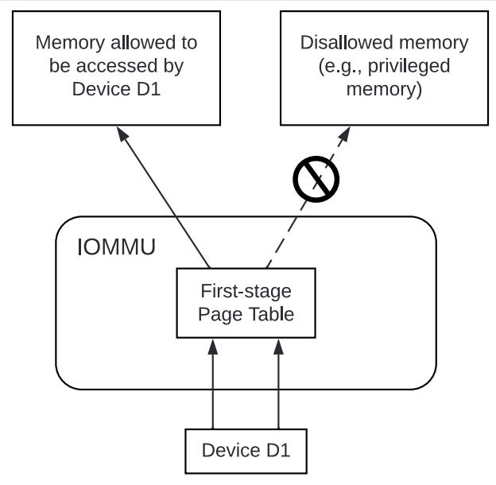

*Figure 1. Device isolation in non-virtualized OS*

Legacy 32-bit devices cannot access the memory above 4 GiB. The IOMMU, through its address remapping capability, offers a simple mechanism for the device to directly access any address in the system (with appropriate access permission). Without an IOMMU, the OS must resort to copying data through buffers (also known as bounce buffers) allocated in memory below 4 GiB. In this scenario the IOMMU improves the system performance.

The IOMMU can be useful to perform scatter/gather DMA as it permits to allocate large regions of memory for I/O without the need for all of the memory to be contiguous. A contiguous virtual address range can map to such fragmented physical addresses and the device programmed with the virtual address range.

The IOMMU can be used to support shared virtual addressing which is the ability to share a process address space with devices. The virtual addresses used for DMA are then translated by the IOMMU to an SPA.

When the IOMMU is used by a non-virtualized OS, the first-stage suffices to provide the required address translation and protection function and the second-stage may be set to Bare.

#### <span id="page-14-0"></span>2.2.2. Hypervisor

IOMMU makes it possible for a guest operating system, running in a virtual machine, to be given direct control of an I/O device with only minimal hypervisor intervention.

A guest OS with direct control of a device will program the device with guest physical addresses, because that is all the OS knows. When the device then performs memory accesses using those addresses, an IOMMU is responsible for translating those guest physical addresses into supervisor physical addresses, referencing address-translation data structures supplied by the hypervisor.

[Figure 2](#page-15-1) illustrates the concept. The device D1 is directly assigned to VM-1 and device D2 is directly assigned to VM-2. The VMM configures a second-stage page table to be used for each device and restricts the memory that can be accessed by D1 to VM-1 associated memory and from D2 to VM-2 associated memory.

<span id="page-15-1"></span>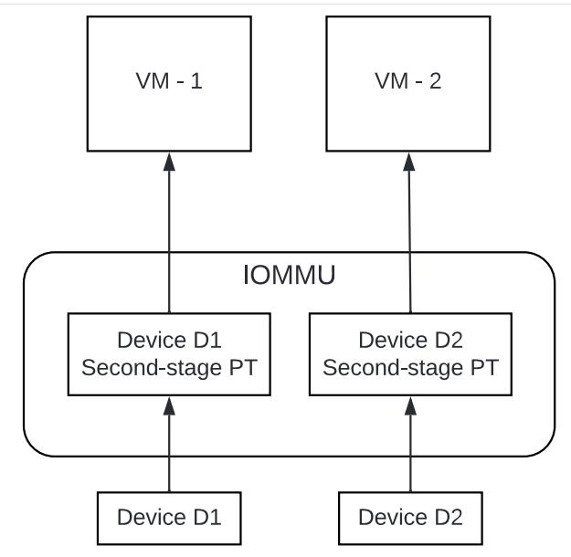

*Figure 2. DMA translation to enable direct device assignment*

To handle MSIs from a device controlled by a guest OS, the hypervisor configures an IOMMU to redirect those MSIs to a guest interrupt file in an IMSIC (see [Figure 3](#page-15-2)) or to a memory-resident interrupt file. The IOMMU is responsible to use the MSI address-translation data structures supplied by the hypervisor to perform the MSI redirection. Because every interrupt file, real or virtual, occupies a naturally aligned 4-KiB page of address space, the required address translation is from a virtual (guest) page address to a physical page address, the same as supported by regular RISC-V page-based address translation.

<span id="page-15-2"></span>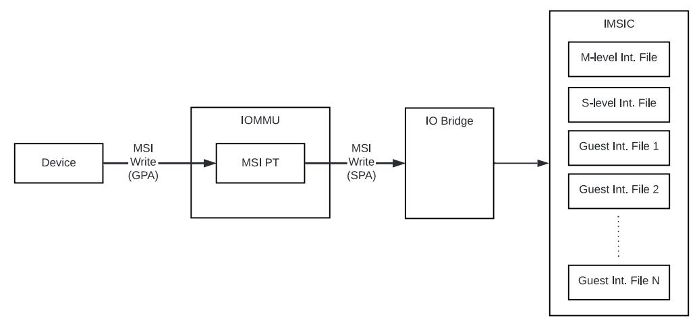

*Figure 3. MSI address translation to direct guest programmed MSI to IMSIC guest interrupt files*

#### <span id="page-15-0"></span>2.2.3. Guest OS

The hypervisor may provide a virtual IOMMU facility, through hardware emulation or by enlightening the guest OS to use a software interface with the Hypervisor (also known as para-virtualization). The guest OS may then use the facilities provided by the virtual IOMMU to avail the same benefits as those discussed for a non-virtualized OS through the use of a first-stage page table that it controls. The hypervisor establishes a second-stage page table that it controls to virtualize the address space for the virtual machine and to contain memory accesses from the devices passed through to the VM to the memory associated with the VM.

With two-stage address translations active, the IOVA is first translated to a GPA using the first-stage page tables managed by the guest OS and the GPA translated to a SPA using the second-stage page tables managed by the hypervisor.

[Figure 4](#page-16-1) illustrates the concept.

<span id="page-16-1"></span>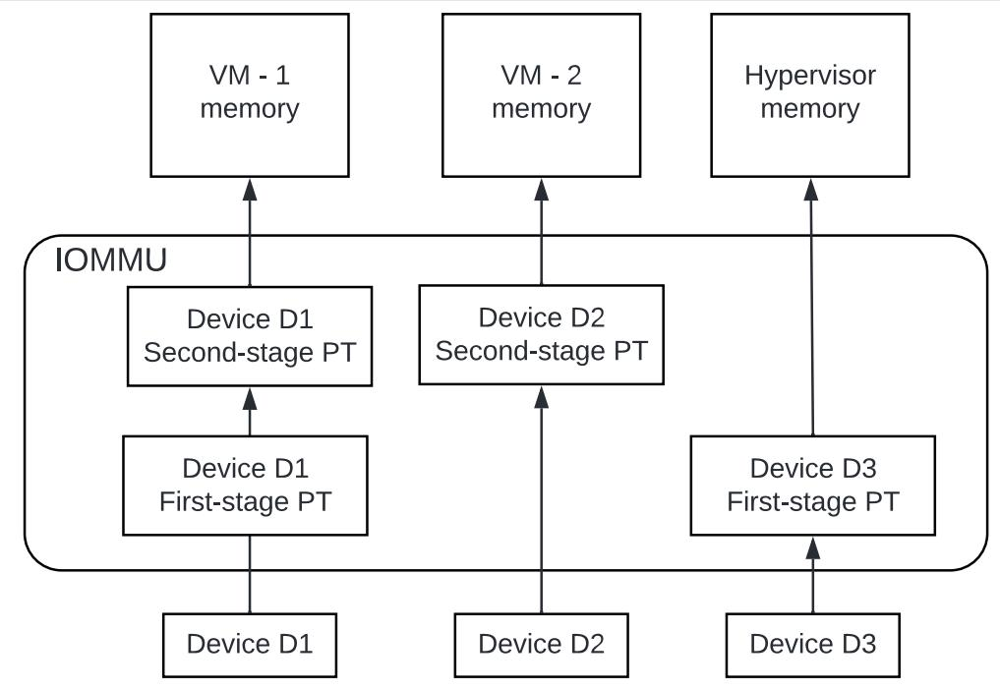

*Figure 4. Address translation in IOMMU for Guest OS*

The IOMMU is configured to perform address translation using a first-stage and second-stage page table for device D1. The second-stage is typically used by the hypervisor to translate GPA to SPA and limit the device D1 to memory associated with VM-1. The first-stage is typically configured by the Guest OS to translate a VA to a GPA and contain device D1 access to a subset of VM-1 memory.

For device D2 only the second-stage is active and the first-stage is set to Bare.

The host OS or hypervisor may also retain a device, such as D3, for its own use. The first-stage suffices to provide the required address translation and protection function for device D3 and the second-stage is set to Bare.

### <span id="page-16-0"></span>2.3. Placement and data flow

[Figure 5](#page-17-0) shows an example of a typical system on a chip (SOC) with RISC-V hart(s). The SOC incorporates memory controllers and several IO devices. This SOC also incorporates two instances of the IOMMU. A device may be directly connected to the IO Bridge and the system interconnect or may be connected through a Root Port when a IO protocol transaction to system interconnect transaction translation is required. In case of PCIe [\[4\]](#page-106-4), for example, the Root Port is a PCIe port that maps a portion of a hierarchy through an associated virtual PCI-PCI bridge and maps the PCIe IO protocol transactions to the system interconnect transactions.

The first IOMMU instance, IOMMU 0 (associated with the IO Bridge 0), interfaces a Root Port to the system fabric/interconnect. One or more endpoint devices are interfaced to the SoC through this Root Port. In the case of PCIe, the Root Port incorporates an ATS interface to the IOMMU that is used to support the PCIe ATS protocol by the IOMMU. The example shows an endpoint device with a device side ATC (DevATC) that holds translations obtained by the device from IOMMU 0 using the PCIe ATS protocol [\[4](#page-106-4)].

When such IO-protocol-to-system-fabric-protocol translation using a Root Port is not required, the devices may interface directly with the system fabric. The second IOMMU instance, IOMMU 1 (associated with the IO Bridge 1), illustrates interfacing devices (IO Devices A and B) to the system fabric without the use of a Root Port.

The IO Bridge is placed between the device(s) and the system interconnect to process DMA transactions. IO Devices may perform DMA transactions using IO Virtual Addresses (VA, GVA or GPA). The IO Bridge invokes the associated IOMMU to translate the IOVA to a Supervisor Physical Addresses (SPA).

The IOMMU is not invoked for outbound transactions.

<span id="page-17-0"></span>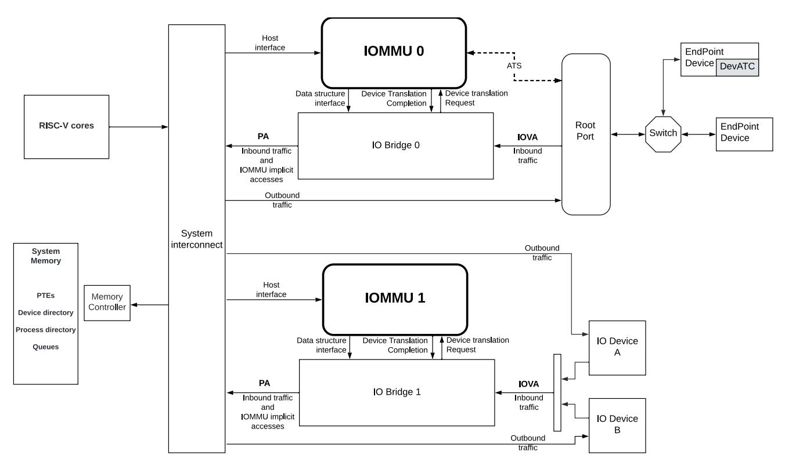

*Figure 5. Example of IOMMUs integration in SoC.*

The IOMMU is invoked by the IO Bridge for address translation and protection for inbound transactions. The data associated with the inbound transactions is not processed by the IOMMU. The IOMMU behaves like a look-aside IP to the IO Bridge and has several interfaces (see [Figure 6\)](#page-19-0):

- ⚫ Host interface: it is an interface to the IOMMU for the harts to access its memory-mapped registers and perform global configuration and/or maintenance operations.
- ⚫ Device Translation Request interface: it is an interface, which receives the translation requests from the IO Bridge. On this interface the IO Bridge provides information about the request such as:
  - a. The hardware identities associated with transaction the device\_id and if applicable the process\_id and its validity. The IOMMU uses the hardware identities to retrieve the context information to perform the requested address translations.
  - b. The IOVA and the type of the transaction (Translated or Untranslated).
  - c. Whether the request is for a read, write, execute, or an atomic operation.
    - i. Execute requested must be explicitly associated with the request (e.g., using a PCIe PASID). When not explicitly requested, the default must be 0.
  - d. The privilege mode associated with the request. When a privilege mode is not explicitly associated with the request (e.g., using a PCIe PASID), the default privilege mode must be User. For requests without a process\_id the privilege mode must be User.

- e. The number of bytes accessed by the request.
- f. The IO Bridge may also provide some additional opaque information (e.g. tags) that are not interpreted by the IOMMU but returned along with the response from the IOMMU to the IO Bridge. As the IOMMU is allowed to complete translation requests out of order, such information may be used by the IO Bridge to correlate completions to previous requests.
- ⚫ Data Structure interface: it is used by the IOMMU for implicit access to memory. It is a requester interface to the IO Bridge and is used to fetch the required data structure from main memory. This interface is used to access:
  - a. The device and process directories to get the context information and translation rules.
  - b. The first-stage and/or second-stage page table entries to translate the IOVA.
  - c. The in-memory queues (command-queue, fault-queue, and page-request-queue) used to interface with software.
- ⚫ Device Translation Completion interface: it is an interface which provides the completion response from the IOMMU for previously requested address translations. The completion interface may provide information such as:
  - a. The status of the request, indicating if the request completed successfully or a fault occurred.
  - b. If the request was completed successfully; the Supervisor Physical Address (SPA).
  - c. Opaque information (e.g. tags), if applicable, associated with the request.
  - d. The page-based memory types (PBMT), if Svpbmt is supported, obtained from the IOMMU address translation page tables. The IOMMU provides the page-based memory type as resolved between the first-stage and second-stage page table entries.
- ⚫ ATS interface: The ATS interface, if the optional PCIe ATS capability is supported by the IOMMU, is used to communicate with ATS capable endpoints through the PCIe Root Port. This interface is used:
  - a. To receive ATS translation requests from the endpoints and to return the completions to the endpoints. The Root Port may provide an indication if the endpoint originating the request is a CXL type 1 or type 2 device.
  - b. To send ATS "Invalidation Request" messages to the endpoints and to receive the "Invalidation Completion" messages from the endpoints.
  - c. To receive "Page Request" and "Stop Marker" messages from the endpoints and to send "Page Request Group Response" messages to the endpoints.

The interfaces related to recording an incoming MSI in a memory-resident interrupt file (MRIF) (See RISC-V Advanced Interrupt Architecture [[5\]](#page-106-5)) are implementation-specific. The partitioning of responsibility between the IOMMU and the IO bridge for recording the incoming MSI in an MRIF and generating the associated *notice* MSI are implementation-specific.

*Figure 6. IOMMU interfaces.*

<span id="page-19-0"></span>Similar to the RISC-V harts, physical memory attributes (PMA) and physical memory protection (PMP) checks must be completed on all inbound IO transactions even when the IOMMU is in bypass (Bare mode). The placement and integration of the PMA and PMP checkers is a platform choice. PMA and PMP checkers reside outside the IOMMU. The example above is showing them in the IO Bridge.

Implicit accesses by the IOMMU itself through the Data Structure interface are checked by the PMA checker. PMAs are tightly tied to a given physical platform's organization, and many details are inherently platform-specific.

The memory accesses performed by the IOMMU using the Data Structure interface need not be ordered in general with the device-initiated memory accesses.


*The IOMMU may generate implicit memory accesses on the Data Structure interface to access data structures needed to perform the address translations. Such accesses must not be blocked by the original device-initiated memory access.*

*The IO bridge may perform ordering of memory accesses on the Data Structure interface to satisfy the necessary hazard checks and other rules as defined by the IO bridge and the system interconnect.*

The IOMMU provides the resolved PBMT (PMA, IO, NC) along with the translated address on the device translation completion interface to the IO Bridge. The PMA checker in the IO Bridge may use the provided PBMT to override the PMA(s) for the associated memory pages.

The PMP checker may use the hardware ID of the bus access initiator to determine physical memory access privileges. As the IOMMU itself is a bus access initiator for its implicit accesses, the IOMMU hardware ID may be used by the PMP checker to select the appropriate access control rules.

*The IOMMU does not validate the authenticity of the hardware IDs provided by the IO bridge.*


*The IO bridge and/or the root ports must include suitable mechanisms to authenticate the hardware IDs. In some SOCs this may be trivially achieved as a property of the devices being integrated into the SOC and their IDs being immutable. For PCIe, for example, the PCIe defined Access Control Services (ACS) Source Validation capabilities may be used to authenticate the hardware IDs. Other implementation-specific methods in the IO bridge may be provided to perform such authentication.*

# <span id="page-20-0"></span>2.4. IOMMU features

Version 1.0 of the RISC-V IOMMU specification supports the following features:

- ⚫ Memory-based device context to locate parameters and address translation structures. The device context is located using the hardware-provided unique device\_id. The supported device\_id width may be up to 24 bits.
- ⚫ Memory-based process context to locate parameters and address translation structures using hardware-provided unique process\_id. The supported process\_id may be up to 20 bits.
- ⚫ 16-bit GSCIDs and 20-bit PSCIDs.
- ⚫ Two-stage address translation.
- ⚫ Page based virtual-memory system as specified by the RISC-V Privileged specification [\[6\]](#page-106-6) to allow software flexibility to either use a common page table for the CPU MMU as well as the IOMMU or to use a separate page table for the IOMMU.
- ⚫ Up to 57-bit virtual-address width, 56-bit system-physical-address, and 59-bit guest-physical-address width.
- ⚫ Hardware updating of PTE Accessed and Dirty bits.
- ⚫ Identifying memory accesses to a virtual interrupt file and MSI address translation using MSI page tables specified by the RISC-V Advanced Interrupt Architecture [\[5](#page-106-5)].
- ⚫ Svnapot and Svpbmt extensions.
- ⚫ PCIe ATS and PRI services [[4](#page-106-4)]. Support for translating an IOVA to a GPA instead of a SPA in response to a translation request.
- ⚫ A hardware performance monitor (HPM).
- ⚫ MSI and wire-signaled interrupts to request service from software.
- ⚫ A register interface for software to request an address translation to support debug.

Features supported by the IOMMU may be discovered using the capabilities register [Section 6.3](#page-63-1).

# <span id="page-21-0"></span>Chapter 3. Data Structures

A data structure called device-context (DC) is used by the IOMMU to associate a device with an address space and to hold other per-device parameters used by the IOMMU to perform address translations. A radix-tree data structure called device directory table (DDT) that is traversed using the device\_id is used to locate the DC.

The address space used by a device may require second-stage address translation and protection when the control of the device is passed through to a Guest OS. A Guest OS may optionally provide a first-stage page table for translating IOVA used by a device controlled by the Guest OS to a GPA. When the use of a firststage is not required, then it may be effectively disabled by selecting the first-stage address translation scheme to be Bare. The second-stage is used to translate the GPA to a SPA.

When the control of the device is retained by the hypervisor or Host OS itself then only the first-stage suffices to perform necessary address translations and protections; the second-stage scheme may be effectively disabled for the device by programming the second-stage address translation scheme to be Bare.

When second-stage address translation is not Bare, the DC holds the PPN of the root second-stage page table; a guest-soft-context-ID (GSCID), which facilitates invalidation of cached address translations on a per-virtual-machine basis; and the second-stage address translation scheme.

Some devices support multiple process contexts where each context may be associated with a different process and thus a different virtual address space. The context in such devices may be configured with a process\_id that identifies the address space. When making a memory access, such devices signal the process\_id along with the device\_id to identify the accessed address space. An example of such a device may be a GPU that supports multiple process contexts, where each context is associated with a different user process, such that the GPU may access memory using the virtual address provided by the user process itself. To support selecting an address space associated with the process\_id, the DC holds the PPN of the root Process Directory Table (PDT), a radix-tree data structure, indexed using fields of the process\_id to locate a data structure called the Process Context (PC).

When a PDT is active, the controls for first-stage address translation are held in the (PC).

When a PDT is not active, the controls for first-stage address translation are held in the DC itself.

The first-stage address translation controls include the PPN of the root first-stage page table; a processsoft-context-ID (PSCID), which facilitates invalidation of cached address translations on a per-addressspace basis; and the first-stage address translation scheme.

To handle MSIs from a device controlled by a guest OS, an IOMMU must be able to redirect those MSIs to a guest interrupt file in an IMSIC. Because MSIs from devices are simply memory writes, they would naturally be subject to the same address translation that an IOMMU applies to other memory writes. However, the IOMMU architecture may treat MSIs directed to virtual machines specially, in part to simplify software, and in part to allow optional support for memory-resident interrupt files. To support this capability, the architecture adds to the device contexts an MSI address mask and address pattern, used together to identify pages in the guest physical address space that are the destinations of MSIs; and the real physical address of an MSI page table for controlling the translation and/or conversion of MSIs from the device. The IOMMU support for MSIs to virtual machines is specified by the Advanced Interrupt Architecture specification.

The DC further holds controls for the type of transactions that a device is allowed to generate. One example of such a control is whether the device is allowed to use the PCIe defined Address Translation Service (ATS) [\[4\]](#page-106-4).

Two formats of the device-context structure are supported:

- ⚫ Base Format is 32-bytes in size used when the special treatment of MSI as specified in [Section 3.3.3](#page-39-0) is not supported by the IOMMU.
- ⚫ Extended Format is 64-bytes in size and extends the base format DC with additional fields to translate MSIs as specified in [Section 3.3.3.](#page-39-0)

If capabilities.MSI\_FLAT is 1 then the Extended Format is used else the Base Format is used.

The DDT used to locate the DC may be configured to be a 1, 2, or 3 level radix-tree depending on the maximum width of the device\_id supported. The partitioning of the device\_id to obtain the device directory indexes (DDI) to traverse the DDT radix-tree are as follows:

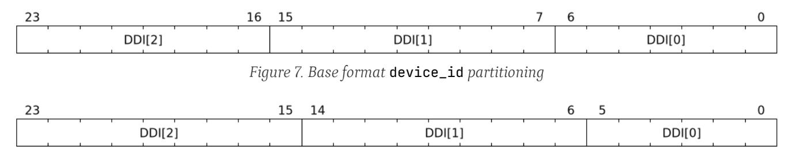

*Figure 8. Extended format* device\_id *partitioning*

The PDT may be configured to be a 1, 2, or 3 level radix-tree depending on the maximum width of the process\_id supported by that device. The partitioning of the process\_id to obtain the process directory indices (PDI) to traverse the PDT radix-tree are as follows:

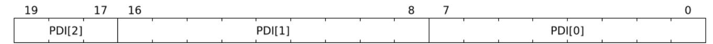

*Figure 9.* process\_id *partitioning for PDT radix-tree traversal*


*The* process\_id *partitioning is designed to require a maximum of 4 KiB, a page, of memory for each process directory table. The root of the table when using a 20-bit wide* process\_id *is not fully populated. The option of making the root table occupy 32 KiB was considered but not adopted as these tables are allocated at run time and contiguous memory allocation larger than a page may stress the Guest and hypervisor memory allocators.*


*All RISC-V IOMMU implementations are required to support DDT and PDT located in main memory. Supporting data structures in I/O memory is not required but is not prohibited by this specification.*

# <span id="page-22-0"></span>3.1. Device-Directory-Table (DDT)

The DDT is a 1, 2, or 3-level radix-tree indexed using the device directory index (DDI) bits of the device\_id to locate a DC.

The following diagrams illustrate the DDT radix-tree. The PPN of the root device-directory-table is held in a memory-mapped register called the device-directory-table pointer (ddtp).

Each valid non-leaf (NL) entry is 8-bytes in size and holds the PPN of the next device-directory-table.

A valid leaf device-directory-table entry holds the device-context (DC).

**Device Directory Table (DDT) Radix-Tree Traversal**

* **3-Level Traversal:**
    * `ddtp` ➔ **[ NL ]** （Indexed by `DDI[2]` 9-bit）
    * ➔ **[ NL ]** （Indexed by `DDI[1]` 9-bit）
    * ➔ **[ DC ]** （Indexed by `DDI[0]` 6-bit）

* **2-Level Traversal:**
    * `ddtp` ➔ **[ NL ]** （Indexed by `DDI[1]` 9-bit）
    * ➔ **[ DC ]** （Indexed by `DDI[0]` 6-bit）

* **1-Level Traversal:**
    * `ddtp` ➔ **[ DC ]** （Indexed by `DDI[0]` 6-bit）

> ※ `ddtp`: Device Directory Table Pointer / `NL`: Node Level (Directory) / `DC`: Device Context

*Figure 10. Three, two and single-level device directory with extended format* DC

* **3-Level Traversal:**
    * `ddtp` ➔ **[ NL ]** （Indexed by `DDI[2]` 8-bit）
    * ➔ **[ NL ]** （Indexed by `DDI[1]` 9-bit）
    * ➔ **[ DC ]** （Indexed by `DDI[0]` 7-bit）

* **2-Level Traversal:**
    * `ddtp` ➔ **[ NL ]** （Indexed by `DDI[1]` 9-bit）
    * ➔ **[ DC ]** （Indexed by `DDI[0]` 7-bit）

* **1-Level Traversal:**
    * `ddtp` ➔ **[ DC ]** （Indexed by `DDI[0]` 7-bit）

*Figure 11. Three, two and single-level device directory with base format* DC

#### <span id="page-23-0"></span>3.1.1. Non-leaf DDT entry

A valid (V==1) non-leaf DDT entry provides the PPN of the next level DDT.

| Bits  | 63:54    | 53:10 | 9:1      | 0 |
| :---- | :------: | :---: | :------: | :-: |
| **Field** | reserved | PPN   | reserved | V |

*Figure 12. Non-leaf device-directory-table entry*

### <span id="page-24-0"></span>3.1.2. Leaf DDT entry

The leaf DDT page is indexed by DDI[0] and holds the device-context (DC).

In base-format the DC is 32-bytes. In extended-format the DC is 64-bytes.


| Bits | Field |
| :--- | :--- |
| **255:192** | First-stage-context (`fsc`) |
| **191:128** | Translation-attributes (`ta`) |
| **127:64** | IO Hypervisor guest address translation and protection (`iohgatp`) |
| **63:0** | Translation-control (`tc`) |

*Figure 13. Base-format device-context*

| Bits | Field |
| :--- | :--- |
| **511:448** | reserved |
| **447:384** | MSI-address-pattern (`msi_addr_pattern`) |
| **383:320** | MSI-address-mask (`msi_addr_mask`) |
| **319:256** | MSI-page-table pointer (`msiptp`) |
| **255:192** | First-stage-context (`fsc`) |
| **191:128** | Translation-attributes (`ta`) |
| **127:64** | IO Hypervisor guest address translation and protection (`iohgatp`) |
| **63:0** | Translation-control (`tc`) |

*Figure 14. Extended-format device-context*

The DC is interpreted as four 64-bit doublewords in base-format and as eight 64-bit doublewords in extended-format. The byte order of each of the doublewords in memory, little-endian or big-endian, is the endianness as determined by fctl.BE ([Section 6.4](#page-66-0)). The IOMMU may read the DC fields in any order.

### <span id="page-25-0"></span>3.1.3. Device-context fields

### <span id="page-25-1"></span>3.1.3.1. Translation control (**tc**)

| Bits | Field |
| :--- | :--- |
| **63:32** | reserved |
| **31:24** | custom |
| **23:12** | reserved |
| **11** | SXL |
| **10** | SBE |
| **9** | DPE |
| **8** | SADE |
| **7** | GADE |
| **6** | PRPR |
| **5** | PDTV |
| **4** | DTF |
| **3** | T2GPA |
| **2** | EN_PRI |
| **1** | EN_ATS |
| **0** | V |
*Figure 15. Translation control (*tc*) field*

DC is valid if the V bit is 1; If it is 0, all other bits in DC are don't-care and may be freely used by software.

If the IOMMU supports PCIe ATS specification [\[4](#page-106-4)] (see capabilities register), the EN\_ATS bit is used to enable ATS transaction processing. If EN\_ATS is set to 1, IOMMU supports the following inbound transactions; otherwise they are treated as unsupported requests.

- ⚫ Translated read for execute transaction
- ⚫ Translated read transaction
- ⚫ Translated write/AMO transaction
- ⚫ PCIe ATS Translation Request
- ⚫ PCIe ATS Invalidation Completion Message

If the EN\_ATS bit is 1 and the T2GPA bit is set to 1 the IOMMU performs the two-stage address translation to determine the permissions and the size of the translation to be provided in the completion of a PCIe ATS Translation Request from the device. However, the IOMMU returns a GPA, instead of a SPA, as the translation of an IOVA in the response. In this mode of operation, the ATC in the device caches a GPA as a translation for an IOVA and uses the GPA as the address in subsequent translated memory access transactions. Usually, translated requests use a SPA and need no further translation to be performed by the IOMMU. However when T2GPA is 1, translated requests from a device use a GPA and are translated by the IOMMU using the second-stage page table to a SPA. The T2GPA control enables a hypervisor to contain DMA from a device, even if the device misuses the ATS capability and attempts to access memory that is not associated with the VM.


*When* T2GPA *is enabled, the addresses provided to the device in response to a PCIe ATS Translation Request cannot be directly routed by the I/O fabric (e.g. PCI switches) that connect the device to other peer devices and to host. Such addresses also cannot be routed within the device when peer-to-peer transactions within the device (e.g. between functions of a device) are supported.*

*Use of* T2GPA *set to 1 may not be compatible with devices that implement caches tagged by the translated address returned in response to a PCIe ATS Translation Request.*

*Hypervisors that configure* T2GPA *to 1 must ensure through protocol-specific means that translated accesses are routed through the host such that the IOMMU may translate the GPA and then route the transaction based on PA to memory or to a peer device. For PCIe, for example, the Access Control Service (ACS) must be configured to always redirect peer-to-peer (P2P) requests upstream to the host.*


*As an alternative to setting* T2GPA *to 1, the hypervisor may establish a trust relationship with the device if authentication protocols are supported by the device. For PCIe, for example, the PCIe component measurement and authentication (CMA) capability provides a mechanism to verify the device's configuration and firmware/executable (Measurement) and hardware identities (Authentication) to establish such a trust relationship.*

If EN\_PRI bit is 0, then PCIe "Page Request" messages from the device are invalid requests. A "Page Request" message received from a device is responded to with a "Page Request Group Response" message. Normally, a software handler generates this response message. However, under some conditions the IOMMU itself may generate a response. For IOMMU-generated "Page Request Group Response" messages the PRGresponse-PASID-required (PRPR) bit when set to 1 indicates that the IOMMU response message should include a PASID if the associated "Page Request" had a PASID.


*Functions that support PASID and have the "PRG Response PASID Required" capability bit set to 1, expect that "Page Request Group Response" messages will contain a PASID if the associated "Page Request" message had a PASID. If the capability bit is 0, the function does not expect PASID on any "Page Request Group Response" message and the behavior of the function if it receives the response with a PASID is undefined. The* PRPR *bit should be configured with the value held in the "PRG Response PASID Required" capability bit.*

Setting the disable-translation-fault (DTF) bit to 1 disables reporting of faults encountered in the address translation process. Setting DTF to 1 does not disable error responses from being generated to the device in response to faulting transactions. Setting DTF to 1 does not disable reporting of faults from the IOMMU that are not related to the address translation process. The faults that are not reported when DTF is 1 are listed in [Table 13.](#page-56-1)


*A hypervisor may set* DTF *to 1 to disable fault reporting when it has identified conditions that may lead to a flurry of errors such as due to an abnormal termination of a virtual machine.*

The DC.fsc field holds the context for first-stage translation. If the PDTV bit is 1, the field holds the processdirectory table pointer (pdtp). If the PDTV bit is 0, the DC.fsc field holds (iosatp).

The PDTV bit is expected to be set to 1 when DC is associated with a device that supports multiple process contexts and thus generates a valid process\_id with its memory accesses. For PCIe, for example, if the request has a PASID then the PASID is used as the process\_id.

When PDTV is 1, the DPE bit may set to 1 to enable the use of 0 as the default value of process\_id for translating requests without a valid process\_id. When PDTV is 0, the DPE bit is reserved for future standard extension.

The IOMMU supports the 1 setting of GADE and SADE bits if capabilities.AMO\_HWAD is 1. When capabilities.AMO\_HWAD is 0, these bits are reserved.

If GADE is 1, the IOMMU updates A and D bits in second-stage PTEs atomically. If GADE is 0, the IOMMU causes a guest-page-fault corresponding to the original access type if the A bit is 0 or if the memory access is a store and the D bit is 0.

If SADE is 1, the IOMMU updates A and D bits in first-stage PTEs atomically. If SADE is 0, the IOMMU causes a page-fault corresponding to the original access type if the A bit is 0 or if the memory access is a store and the D bit is 0.

If SBE is 0, implicit memory accesses to PDT entries and first-stage PTEs are little-endian else they are bigendian. The supported values of SBE are the same as that of the fctl.BE field.

The SXL field controls the supported paged virtual-memory schemes as defined in [Table 4](#page-29-0) and [Table 5](#page-29-1). If fctl.GXL is 1 then the SXL field must be 1; otherwise the legal values for the SXL field are the same as those for the fctl.GXL field.

When SXL is 1, the following rules apply:

- ⚫ If the first-stage is not Bare, then a page fault corresponding to the original access type occurs if the IOVA has bits beyond bit 31 set to 1.
- ⚫ If the second-stage is not Bare, then a guest page fault corresponding to the original access type occurs if the incoming GPA has bits beyond bit 33 set to 1.

#### <span id="page-27-0"></span>3.1.3.2. IO hypervisor guest address translation and protection (**iohgatp**)

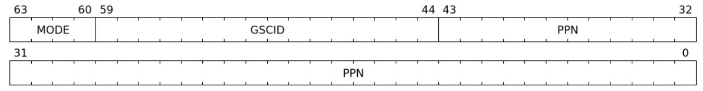

*Figure 16. IO hypervisor guest address translation and protection (*iohgatp*) field*

The iohgatp field holds the PPN of the root second-stage page table and a virtual machine identified by a guest soft-context ID (GSCID), to facilitate address-translation fences on a per-virtual-machine basis. If multiple devices are associated to a VM with a common second-stage page table, the hypervisor is expected to program the same GSCID in each iohgatp. The MODE field is used to select the second-stage address translation scheme.

The second-stage page table formats are as defined by the Privileged specification. The fctl.GXL field controls the supported address-translation schemes for guest physical addresses as defined in [Table 2](#page-27-1) and [Table 3.](#page-27-2)

<span id="page-27-1"></span>The iohgatp MODE field identifies the paged virtual-memory schemes and its encodings are as follows:

| Value | Name | Description                                                            |
|-------|------|------------------------------------------------------------------------|
| 0     | Bare | No translation or protection.                                          |
| 1-7   | —    | Reserved for standard use.                                             |
| 8     |      | Sv39x4 Page-based 41-bit virtual addressing (2-bit extension of Sv39). |
| 9     |      | Sv48x4 Page-based 50-bit virtual addressing (2-bit extension of Sv48). |
| 10    |      | Sv57x4 Page-based 59-bit virtual addressing (2-bit extension of Sv57). |
| 11-15 | —    | Reserved for standard use.                                             |

*Table 2. Encodings of* iohgatp.MODE *field when* fctl.GXL=0

*Table 3. Encodings of* iohgatp.MODE *field when* fctl.GXL=1

<span id="page-27-2"></span>

| Value | Name | Description                   |
|-------|------|-------------------------------|
| 0     | Bare | No translation or protection. |
| 1-7   | —    | Reserved for standard use.    |

| Value | Name | Description                                                            |
|-------|------|------------------------------------------------------------------------|
| 8     |      | Sv32x4 Page-based 34-bit virtual addressing (2-bit extension of Sv32). |
| 9-15  | —    | Reserved for standard use.                                             |

Implementations are not required to support all defined mode settings for iohgatp. The IOMMU only needs to support the modes also supported by the MMU in the harts integrated into the system or a subset thereof.

The root page table as determined by iohgatp.PPN is 16 KiB and must be aligned to a 16-KiB boundary.


*The* GSCID *field of* iohgatp *identifies an address space. If an identical* GSCID *is configured in two* DC *when the second-stage page-table referenced by the two* DC *are not identical then it is unpredictable whether the IOMMU uses the PTEs from the first page table or the second page table. These are the only expected behaviors.*

#### <span id="page-28-0"></span>3.1.3.3. Translation attributes (**ta**)

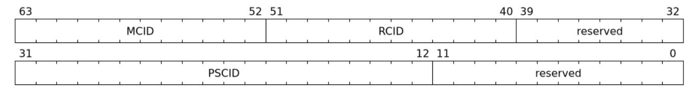

*Figure 17. Translation attributes (*ta*) field*

The PSCID field of ta provides the process soft-context ID that identifies the address-space of the process. PSCID facilitates address-translation fences on a per-address-space basis. The PSCID field in ta is used as the address-space ID if DC.tc.PDTV is 0 and the iosatp.MODE field is not Bare. When DC.tc.PDTV is 1, the PSCID field in ta is ignored.

The RCID and MCID fields are added by the QoS ID extension. If capabilities.QOSID is 0, these bits are reserved and must be set to 0. IOMMU-initiated requests for accessing the following data structures use the value configured in the RCID and MCID fields of DC.ta.

- ⚫ Process directory table (PDT)
- ⚫ Second-stage page table
- ⚫ First-stage page table
- ⚫ MSI page table
- ⚫ Memory-resident interrupt file (MRIF)

The RCID and MCID configured in DC.ta are provided to the IO bridge on successful address translations. The IO bridge should associate these QoS IDs with device-initiated requests.

### <span id="page-28-1"></span>3.1.3.4. First-Stage context (**fsc**)

If DC.tc.PDTV is 0, the DC.fsc field holds the iosatp that provides the controls for first-stage address translation and protection.

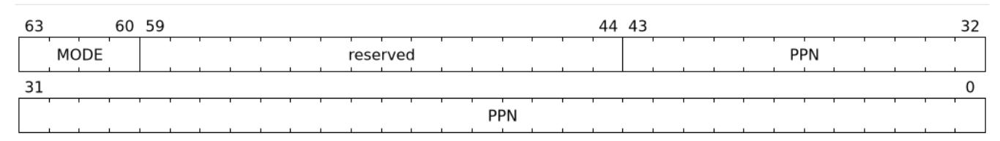

*Figure 18. IO Supervisor address translation and prot. (*iosatp*) field*

The first-stage page table formats are as defined by the Privileged specification.

The DC.tc.SXL field controls the supported paged virtual-memory schemes.

The iosatp.MODE identifies the paged virtual-memory schemes and is encoded as defined in [Table 4](#page-29-0) and [Table 5.](#page-29-1) The iosatp.PPN field holds the PPN of the root page of a first-stage page table.

<span id="page-29-0"></span>When second-stage address translation is not Bare, the iosatp.PPN is a guest PPN. The GPA of the root page is then converted by guest physical address translation process, as controlled by the iohgatp, into a supervisor physical address.

| Value | Name | Description                           |  |
|-------|------|---------------------------------------|--|
| 0     | Bare | No translation or protection.         |  |
| 1-7   | —    | Reserved for standard use.            |  |
| 8     | Sv39 | Page-based 39-bit virtual addressing. |  |
| 9     | Sv48 | Page-based 48-bit virtual addressing. |  |
| 10    | Sv57 | Page-based 57-bit virtual addressing. |  |
| 11-13 | —    | Reserved for standard use.            |  |
| 14-15 | —    | Designated for custom use.            |  |

*Table 4. Encodings of* iosatp.MODE *field when* DC.tc.SXL=0

*Table 5. Encodings of* iosatp.MODE *field when* DC.tc.SXL=1

| Value | Name | Description                           |
|-------|------|---------------------------------------|
| 0     | Bare | No translation or protection.         |
| 1-7   | —    | Reserved for standard use.            |
| 8     | Sv32 | Page-based 32-bit virtual addressing. |
| 9-15  | —    | Reserved for standard use.            |

<span id="page-29-1"></span>When DC.tc.PDTV is 1, the DC.fsc field holds the process-directory table pointer (pdtp). When the device supports multiple process contexts, selected by the process\_id, the PDT is used to determine the first-stage page table and associated PSCID for virtual address translation and protection.

The pdtp field holds the PPN of the root PDT and the MODE field that determines the number of levels of the PDT.


*Figure 19. Process-directory table pointer (*pdtp*) field*

When second-stage address translation is not Bare, the pdtp.PPN field holds a guest PPN. The GPA of the root PDT is then converted by guest physical address translation process, as controlled by the iohgatp, into a supervisor physical address. Translating addresses of PDT using a second-stage page table, allows the PDT to be held in memory allocated by the guest OS and allows the guest OS to directly edit the PDT to associate a virtual-address space identified by a first-stage page table with a process\_id.

*Table 6. Encodings of* pdtp.MODE *field*

| Value | Name | Description                                                                                                                                                         |
|-------|------|---------------------------------------------------------------------------------------------------------------------------------------------------------------------|
| 0     | Bare | No first-stage address translation or protection.                                                                                                                   |
| 1     | PD8  | 8-bit process ID enabled. The directory has 1 levels with 256 entries.The bits 19:8 of process_id must<br>be 0.                                                     |
| 2     | PD17 | 17-bit process ID enabled. The directory has 2 levels. The root PDT page has 512 entries and leaf level<br>has 256 entries. The bits 19:17 of process_id must be 0. |
| 3     | PD20 | 20-bit process ID enabled. The directory has 3 levels. The root PDT has 8 entries and the next non-leaf<br>level has 512 entries. The leaf level has 256 entries.   |
| 4-13  | —    | Reserved for standard use.                                                                                                                                          |
| 14-15 | —    | Designated for custom use.                                                                                                                                          |

### <span id="page-30-0"></span>3.1.3.5. MSI page table pointer (**msiptp**)

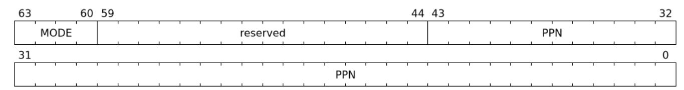

*Figure 20. MSI page table pointer (*msiptp*) field*

The msiptp.PPN field holds the PPN of the root MSI page table used to direct an MSI to a guest interrupt file in an IMSIC. The MSI page table formats are defined by the Advanced Interrupt Architecture specification.

The msiptp.MODE field is used to select the MSI address translation scheme.

*Table 7. Encodings of* msiptp.MODE *field*

| Value | Name | Description                                                                                                 |  |  |
|-------|------|-------------------------------------------------------------------------------------------------------------|--|--|
| 0     | Off  | Recognition of accesses to a virtual interrupt file using MSI address mask and pattern is not<br>performed. |  |  |
| 1     | Flat | Flat MSI page table                                                                                         |  |  |
| 2-13  | —    | Reserved for standard use.                                                                                  |  |  |
| 14-15 | —    | Designated for custom use.                                                                                  |  |  |

### <span id="page-31-0"></span>3.1.3.6. MSI address mask (**msi\_addr\_mask**) and pattern (**msi\_addr\_pattern**)

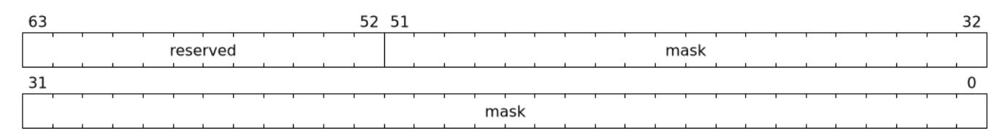

*Figure 21. MSI address mask (*msi\_addr\_mask*) field*

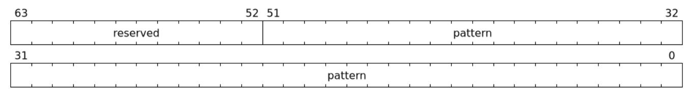

*Figure 22. MSI address pattern (*msi\_addr\_pattern*) field*

The MSI address mask (msi\_addr\_mask) and pattern (msi\_addr\_pattern) fields are used to identify the 4- KiB pages of virtual interrupt files in the guest physical address space of the relevant VM. An incoming memory access made by a device is recognized as an access to a virtual interrupt file if the destination guest physical page matches the supplied address pattern in all bit positions that are zeros in the supplied address mask. In detail, a memory access to guest physical address A is recognized as an access to a virtual interrupt file's memory-mapped page if:

#### (A >> 12) & ~msi\_addr\_mask = (msi\_addr\_pattern & ~msi\_addr\_mask)

where >> 12 represents shifting right by 12 bits, an ampersand (&) represents bitwise logical AND, and ~msi\_addr\_mask is the bitwise logical complement of the address mask.

While the MSI address mask and pattern fields are 52 bits wide, if , then bits are reserved for future standard use and must be set to zero by software. MGPAW is determined as follows:

- ⚫ If capabilities.Sv57x4 is 1, then MGPAW = 59
- ⚫ Else if capabilities.Sv48x4 is 1, then MGPAW = 50
- ⚫ Else if capabilities.Sv39x4 is 1, then MGPAW = 41
- ⚫ Else if capabilities.Sv32x4 is 1, then MGPAW = 34
- ⚫ Otherwise, MGPAW = capabilities.PAS

### <span id="page-31-1"></span>3.1.4. Device-context configuration checks

A DC with DC.tc.V=1 is considered as misconfigured if any of the following conditions are true. If misconfigured then, stop and report "DDT entry misconfigured" (cause = 259).

- 1. If any bits or encodings that are reserved for future standard use are set.
- 2. capabilities.ATS is 0 and DC.tc.EN\_ATS, or DC.tc.EN\_PRI, or DC.tc.PRPR is 1
- 3. DC.tc.EN\_ATS is 0 and DC.tc.T2GPA is 1
- 4. DC.tc.EN\_ATS is 0 and DC.tc.EN\_PRI is 1
- 5. DC.tc.EN\_PRI is 0 and DC.tc.PRPR is 1
- 6. capabilities.T2GPA is 0 and DC.tc.T2GPA is 1
- 7. DC.tc.T2GPA is 1 and DC.iohgatp.MODE is Bare
- 8. DC.tc.PDTV is 1 and DC.fsc.pdtp.MODE is not a supported mode
  - a. capabilities.PD20 is 0 and DC.fsc.pdtp.MODE is PD20
  - b. capabilities.PD17 is 0 and DC.fsc.pdtp.MODE is PD17
  - c. capabilities.PD8 is 0 and DC.fsc.pdtp.MODE is PD8
- 9. DC.tc.PDTV is 0 and DC.fsc.iosatp.MODE encoding is not a valid encoding as determined by [Table 4](#page-29-0) and [Table 5.](#page-29-1)
- 10. DC.tc.PDTV is 0 and DC.tc.SXL is 0 DC.fsc.iosatp.MODE is not one of the supported modes
  - a. capabilities.Sv39 is 0 and DC.fsc.iosatp.MODE is Sv39
  - b. capabilities.Sv48 is 0 and DC.fsc.iosatp.MODE is Sv48
  - c. capabilities.Sv57 is 0 and DC.fsc.iosatp.MODE is Sv57
- 11. DC.tc.PDTV is 0 and DC.tc.SXL is 1 DC.fsc.iosatp.MODE is not one of the supported modes
  - a. capabilities.Sv32 is 0 and DC.fsc.iosatp.MODE is Sv32
- 12. DC.tc.PDTV is 0 and DC.tc.DPE is 1
- 13. DC.iohgatp.MODE encoding is not a valid encoding as determined by [Table 2](#page-27-1) and [Table 3](#page-27-2).
- 14. fctl.GXL is 0 and DC.iohgatp.MODE is not a supported mode
  - a. capabilities.Sv39x4 is 0 and DC.iohgatp.MODE is Sv39x4
  - b. capabilities.Sv48x4 is 0 and DC.iohgatp.MODE is Sv48x4
  - c. capabilities.Sv57x4 is 0 and DC.iohgatp.MODE is Sv57x4
- 15. fctl.GXL is 1 and DC.iohgatp.MODE is not a supported mode
  - a. capabilities.Sv32x4 is 0 and DC.iohgatp.MODE is Sv32x4
- 16. capabilities.MSI\_FLAT is 1 and DC.msiptp.MODE is not Off and not Flat
- 17. DC.iohgatp.MODE is not Bare and the root page table determined by DC.iohgatp.PPN is not aligned to a 16-KiB boundary.
- 18. capabilities.AMO\_HWAD is 0 and DC.tc.SADE or DC.tc.GADE is 1
- 19. capabilities.END is 0 and fctl.BE != DC.tc.SBE
- 20. DC.tc.SXL value is not a legal value. If fctl.GXL is 1, then DC.tc.SXL must be 1. If fctl.GXL is 0 and is writable, then DC.tc.SXL may be 0 or 1. If fctl.GXL is 0 and is not writable then DC.tc.SXL must be 0.
- 21. DC.tc.SBE value is not a legal value. If fctl.BE is writable then DC.tc.SBE may be 0 or 1. If fctl.BE is not writable then DC.tc.SBE must be the same as fctl.BE.
- 22. capabilities.QOSID is 1 and DC.ta.RCID or DC.ta.MCID values are wider than that supported by the IOMMU.

*Some* DC *fields hold supervisor physical addresses or guest physical addresses. Some*

*implementations may verify the validity of the addresses - e.g. the supervisor physical address is not wider than that supported as determined by* capabilities.PAS*, etc. at the time of locating the* DC*. Such implementations may cause a "DDT entry misconfigured" (cause = 259) fault.*

*Other implementations only detect such addresses to be invalid when the data structure referenced by these fields needs to be accessed. Such implementations may detect accessviolation faults in the process of making the access.*

# <span id="page-33-0"></span>3.2. Process-Directory-Table (PDT)

The PDT is a 1, 2, or 3-level radix-tree indexed using the process directory index (PDI) bits of the process\_id.

The following diagrams illustrate the PDT radix-tree. The root process-directory page number is located using the process-directory-table pointer (pdtp) field of the device-context. Each non-leaf (NL) entry provides the PPN of the next level process-directory-table. The leaf process-directory-table entry holds the process-context (PC).

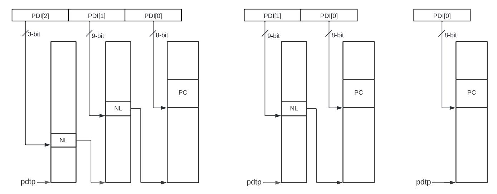

*Figure 23. Three, two and single-level process directory*

#### <span id="page-33-1"></span>3.2.1. Non-leaf PDT entry

A valid (V==1) non-leaf PDT entry holds the PPN of the next-level PDT.

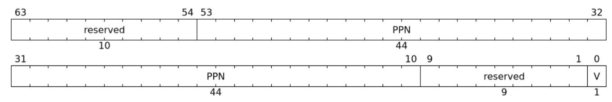

*Figure 24. Non-leaf process-directory-table entry*

#### <span id="page-33-2"></span>3.2.2. Leaf PDT entry

The leaf PDT page is indexed by PDI[0] and holds the 16-byte process-context (PC).

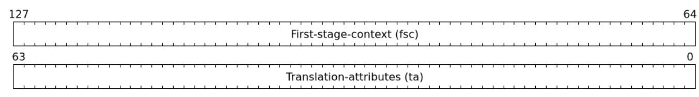

*Figure 25. Process-context*

The PC is interpreted as two 64-bit doublewords. The byte order of each of the doublewords in memory, little-endian or big-endian, is the endianness as determined by DC.tc.SBE. The IOMMU may read the PC fields in any order.

### <span id="page-34-0"></span>3.2.3. Process-context fields

#### <span id="page-34-1"></span>3.2.3.1. Translation attributes (**ta**)

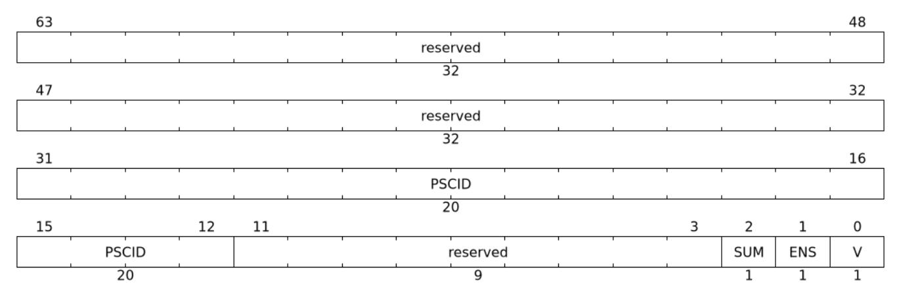

*Figure 26. Translation attributes (*ta*) field*

PC is valid if the V bit is 1; If it is 0, all other bits in PC are don't care and may be freely used by software.

When Enable-Supervisory-access (ENS) is 1, transactions requesting supervisor privilege are allowed with this process\_id else the transaction is treated as an unsupported request.

When ENS is 1, the SUM (permit Supervisor User Memory access) bit modifies the privilege with which supervisor privilege transactions access virtual memory. When SUM is 0, supervisor privilege transactions to pages mapped with U bit in PTE set to 1 are disallowed.

When ENS is 1, supervisor privilege transactions that read with execute intent to pages mapped with U bit in PTE set to 1 are disallowed, regardless of the value of SUM.

The software assigned process soft-context ID (PSCID) is used as the address space ID for the process identified by the first-stage page table when first-stage address translation is not Bare.

#### <span id="page-34-2"></span>3.2.3.2. First-Stage context (**fsc**)

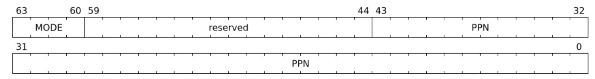

*Figure 27. Process First-Stage context*

The PC.fsc field provides the controls for first-stage address translation and protection.

The PC.fsc.MODE is used to determine the first-stage paged virtual-memory scheme and its encodings are as defined in [Table 4](#page-29-0) and [Table 5.](#page-29-1) The DC.tc.SXL field controls the supported paged virtual-memory schemes. When PC.fsc.MODE is not Bare, the PC.fsc.PPN field holds the PPN of the root page of a firststage page table.

When second-stage address translation is not Bare, the PC.fsc.PPN field holds a guest PPN of the root of a first-stage page table. Addresses of the first-stage page table entries are then converted by guest physical address translation process, as controlled by the DC.iohgatp, into a supervisor physical address. A guest OS may thus directly edit the first-stage page table to limit access by the device to a subset of its memory and specify permissions for the device accesses.


*The* PC.ta.PSCID *identifies an address space. If an identical* PSCID *is configured in two* PC *when the page-table referenced by the two* PC *are not identical then it is unpredictable whether the IOMMU uses the PTEs from the first page table or the second page table. These are the only expected behaviors.*

### <span id="page-35-0"></span>3.2.4. Process-context configuration checks

A PC with PC.ta.V=1 is considered as misconfigured if any of the following conditions are true. If misconfigured then stop and report "PDT entry misconfigured" (cause = 267).

- 1. If any bits or encoding that are reserved for future standard use are set
- 2. PC.fsc.MODE encoding is not valid as determined by [Table 4](#page-29-0) and [Table 5](#page-29-1).
- 3. DC.tc.SXL is 0 and PC.fsc.MODE is not one of the supported modes
  - a. capabilities.Sv39 is 0 and PC.fsc.MODE is Sv39
  - b. capabilities.Sv48 is 0 and PC.fsc.MODE is Sv48
  - c. capabilities.Sv57 is 0 and PC.fsc.MODE is Sv57
- 4. DC.tc.SXL is 1 and PC.fsc.MODE is not one of the supported modes
  - a. capabilities.Sv32 is 0 and PC.fsc.MODE is Sv32


*Some* PC *fields hold supervisor physical addresses or guest physical addresses. Some implementations may verify the validity of the addresses - e.g. the supervisor physical address is not wider than that supported as determined by* capabilities.PAS*, etc. at the time of locating the* PC*. Such implementations may cause a "PDT entry misconfigured" (cause = 267) fault.*

*Other implementations only detect such addresses to be invalid when the data structure referenced by these fields needs to be accessed. Such implementations may detect accessviolation faults in the process of making the access.*

# <span id="page-36-0"></span>3.3. Process to translate an IOVA

The process to translate an IOVA uses the hardware IDs (device\_id and process\_id) to locate the Device-Context and the Process-Context. The Device-context and Process-context provide the root PPN of the page tables, PSCID, GSCID, and other control parameters that affect the address translation and protection process. When address translation caches [\(Section 3.8\)](#page-46-0) are implemented, the translation process may use the GSCID and PSCID to associate the cached translations with their address spaces.

The process to translate an IOVA is as follows:

- 1. If ddtp.iommu\_mode == Off then stop and report "All inbound transactions disallowed" (cause = 256).
- 2. If ddtp.iommu\_mode == Bare and any of the following conditions hold then stop and report "Transaction type disallowed" (cause = 260); else go to step 20 with translated address same as the IOVA.
  - a. Transaction type is a Translated request (read, write/AMO, read-for-execute) or is a PCIe ATS Translation request.
- 3. If capabilities.MSI\_FLAT is 0 then the IOMMU uses base-format device context. Let DDI[0] be device\_id[6:0], DDI[1] be device\_id[15:7], and DDI[2] be device\_id[23:16].
- 4. If capabilities.MSI\_FLAT is 1 then the IOMMU uses extended-format device context. Let DDI[0] be device\_id[5:0], DDI[1] be device\_id[14:6], and DDI[2] be device\_id[23:15].
- 5. If the device\_id is wider than that supported by the IOMMU mode, as determined by the following checks then stop and report "Transaction type disallowed" (cause = 260).
  - a. ddtp.iommu\_mode is 2LVL and DDI[2] is not 0
  - b. ddtp.iommu\_mode is 1LVL and either DDI[2] is not 0 or DDI[1] is not 0
- 6. Use device\_id to then locate the device-context (DC) as specified in [Section 3.3.1](#page-38-0).
- 7. If any of the following conditions hold then stop and report "Transaction type disallowed" (cause = 260).
  - a. Transaction type is a Translated request (read, write/AMO, read-for-execute) or is a PCIe ATS Translation request and DC.tc.EN\_ATS is 0.
  - b. Transaction has a valid process\_id and DC.tc.PDTV is 0.
  - c. Transaction has a valid process\_id and DC.tc.PDTV is 1 and the process\_id is wider than that supported by pdtp.MODE.
  - d. Transaction type is not supported by the IOMMU.
- 8. If request is a Translated request and DC.tc.T2GPA is 0 then the translation process is complete. Go to step 20.
- 9. If request is a Translated request and DC.tc.T2GPA is 1 then the IOVA is a GPA. Go to step 17 with following page table information:

- a. Let A be the IOVA (the IOVA is a GPA).
- b. Let iosatp.MODE be Bare
  - i. The PSCID value is not used when first-stage is Bare.
- c. Let iohgatp be the value in the DC.iohgatp field
- 10. If DC.tc.PDTV is set to 0 then go to step 17 with the following page table information:
  - a. Let iosatp.MODE be the value in the DC.fsc.MODE field
  - b. Let iosatp.PPN be the value in the DC.fsc.PPN field
  - c. Let PSCID be the value in the DC.ta.PSCID field
  - d. Let iohgatp be the value in the DC.iohgatp field
- 11. If DPE is 1 and there is no process\_id associated with the transaction then let process\_id be the default value of 0.
- 12. If DPE is 0 and there is no process\_id associated with the transaction then then go to step 17 with the following page table information:
  - a. Let iosatp.MODE be Bare
    - i. The PSCID value is not used when first-stage is Bare.
  - b. Let iohgatp be the value in the DC.iohgatp field
- 13. If DC.fsc.pdtp.MODE = Bare then go to step 17 with the following page table information:
  - a. Let iosatp.MODE be Bare
    - i. The PSCID value is not used when first-stage is Bare.
  - b. Let iohgatp be value in DC.iohgatp field
- 14. Locate the process-context (PC) as specified in [Section 3.3.2.](#page-38-1)
- 15. if any of the following conditions hold then stop and report "Transaction type disallowed" (cause = 260).
  - a. The transaction requests supervisor privilege but PC.ta.ENS is not set.
- 16. Go to step 17 with the following page table information:
  - a. Let iosatp.MODE be the value in the PC.fsc.MODE field
  - b. Let iosatp.PPN be the value in the PC.fsc.PPN field
  - c. Let PSCID be the value in the PC.ta.PSCID field
  - d. Let iohgatp be the value in the DC.iohgatp field
- 17. Use the process specified in Section "Two-Stage Address Translation" of the RISC-V Privileged specification [[6](#page-106-6)] to determine the GPA accessed by the transaction. If a fault is detected by the first stage address translation process then stop and report the fault. If the translation process is completed successfully then let A be the translated GPA.
- 18. If MSI address translations using MSI page tables is enabled (i.e., DC.msiptp.MODE != Off) then the MSI address translation process specified in [Section 3.3.3](#page-39-0) is invoked. If the GPA A is not determined to be the address of a virtual interrupt file then the process continues at step 19. If a fault is detected by the MSI address translation process then stop and report the fault else the process continues at step 20.
- 19. Use the second-stage address translation process specified in Section "Two-Stage Address Translation" of the RISC-V Privileged specification [[6\]](#page-106-6) to translate the GPA A to determine the SPA accessed by the transaction. If a fault is detected by the address translation process then stop and report the fault.
- 20. Translation process is complete

When checking the U bit in a second-stage PTE, the transaction is treated as not requesting supervisor privilege. The pte.xwr=010 encoding, as specified by the Zicfiss [\[7](#page-106-7)] extension for the Shadow Stack page type in single-stage and VS-stage page tables, remains a reserved encoding for IO transactions.

When the translation process reports a fault, and the request is an Untranslated request or a Translated request, the IOMMU requests the IO bridge to abort the transaction. Guidelines for handling faulting transactions in the IO bridge are provided in [Section 8.3.](#page-98-3) The fault may be reported using the fault/event reporting mechanism and fault record formats specified in [Section 4.2](#page-56-0).

If the fault was detected by a PCIe ATS Translation Request then the IOMMU may provide a PCIe protocol defined response instead of reporting fault to software or causing an abort. The handling of faulting PCIe ATS Translation Requests is specified in [Section 3.6](#page-42-1).

### <span id="page-38-0"></span>3.3.1. Process to locate the Device-context

The process to locate the Device-context for transaction using its device\_id is as follows:

- 1. Let a be ddtp.PPN x 2<sup>12</sup> and let i = LEVELS 1. When ddtp.iommu\_mode is 3LVL, LEVELS is three. When ddtp.iommu\_mode is 2LVL, LEVELS is two. When ddtp.iommu\_mode is 1LVL, LEVELS is one.
- 2. If i == 0 go to step 8.
- 3. Let ddte be the value of the eight bytes at address a + DDI[i] x 8. If accessing ddte violates a PMA or PMP check, then stop and report "DDT entry load access fault" (cause = 257).
- 4. If ddte access detects a data corruption (a.k.a. poisoned data), then stop and report "DDT data corruption" (cause = 268).
- 5. If ddte.V == 0, stop and report "DDT entry not valid" (cause = 258).
- 6. If any bits or encoding that are reserved for future standard use are set within ddte, stop and report "DDT entry misconfigured" (cause = 259).
- 7. Let i = i 1 and let a = ddte.PPN x 2<sup>12</sup>. Go to step 2.
- 8. Let DC be the value of DC\_SIZE bytes at address a + DDI[0] \* DC\_SIZE. If capabilities.MSI\_FLAT is 1 then DC\_SIZE is 64-bytes else it is 32-bytes. If accessing DC violates a PMA or PMP check, then stop and report "DDT entry load access fault" (cause = 257). If DC access detects a data corruption (a.k.a. poisoned data), then stop and report "DDT data corruption" (cause = 268).
- 9. If DC.tc.V == 0, stop and report "DDT entry not valid" (cause = 258).
- 10. If the DC is misconfigured as determined by rules outlined in [Section 3.1.4](#page-31-1) then stop and report "DDT entry misconfigured" (cause = 259).
- 11. The device-context has been successfully located.

#### <span id="page-38-1"></span>3.3.2. Process to locate the Process-context

The device-context provides the PDT root page PPN (pdtp.ppn). When DC.iohgatp.mode is not Bare, pdtp.PPN as well as pdte.PPN are Guest Physical Addresses (GPA) which must be translated into Supervisor Physical Addresses (SPA) using the second-stage page table pointed to by DC.iohgatp. The memory accesses to the PDT are treated as implicit read memory accesses by the second-stage. However, any guestpage fault exception raised by the second stage is always reported using the original access type (instruction, load, or store/AMO). An access fault in the second stage is reported as "PDT entry load access fault" (cause = 265). If the second-stage accesses detect data corruption (i.e., poisoned data), it is reported as "PDT data corruption" (cause = 269).

The process to locate the Process-context for a transaction using its process\_id is as follows:

- 1. Let a be pdtp.PPN x 2<sup>12</sup> and let i = LEVELS 1. When pdtp.MODE is PD20, LEVELS is three. When pdtp.MODE is PD17, LEVELS is two. When pdtp.MODE is PD8, LEVELS is one.
- 2. If DC.iohgatp.mode != Bare, then a is a GPA. Invoke the process to translate a to a SPA as an implicit memory access. If faults occur during second-stage address translation of a then stop and report the fault detected by the second-stage address translation process. The translated a is used in subsequent steps.
- 3. If i == 0 go to step 9.
- 4. Let pdte be the value of the eight bytes at address a + PDI[i] x 8. If accessing pdte violates a PMA or PMP check, then stop and report "PDT entry load access fault" (cause = 265).
- 5. If pdte access detects a data corruption (a.k.a. poisoned data), then stop and report "PDT data corruption" (cause = 269).
- 6. If pdte.V == 0, stop and report "PDT entry not valid" (cause = 266).
- 7. If any bits or encoding that are reserved for future standard use are set within pdte, stop and report "PDT entry misconfigured" (cause = 267).
- 8. Let i = i 1 and let a = pdte.PPN x 2<sup>12</sup>. Go to step 2.
- 9. Let PC be the value of the 16-bytes at address a + PDI[0] x 16. If accessing PC violates a PMA or PMP check, then stop and report "PDT entry load access fault" (cause = 265). If PC access detects a data corruption (a.k.a. poisoned data), then stop and report "PDT data corruption" (cause = 269).
- 10. If PC.ta.V == 0, stop and report "PDT entry not valid" (cause = 266).
- 11. If the PC is misconfigured as determined by rules outlined in [Section 3.2.4](#page-35-0) then stop and report "PDT entry misconfigured" (cause = 267).
- 12. The Process-context has been successfully located.

#### <span id="page-39-0"></span>3.3.3. Process to translate addresses of MSIs

When an I/O device is configured directly by a guest operating system, MSIs from the device are expected to be targeted to virtual IMSICs within the guest OS's virtual machine, using guest physical addresses that are inappropriate and unsafe for the real machine. An IOMMU must recognize certain incoming writes from such devices as MSIs and convert them as needed for the real machine.

MSIs originating from a single device that require conversion are expected to have been configured at the device by a single guest OS running within one RISC-V virtual machine. Assuming the VM itself conforms to the RISC-V Advanced Interrupt Architecture [\[5](#page-106-5)], MSIs are sent to virtual harts within the VM by writing to the memory-mapped registers of the interrupt files of virtual IMSICs. Each of these virtual interrupt files occupies a separate 4-KiB page in the VM's guest physical address space, the same as real interrupt files do in a real machine's physical address space. A write to a guest physical address can thus be recognized as an MSI to a virtual hart if the write is to a page occupied by an interrupt file of a virtual IMSIC within the VM.

When MSI address translation is supported (capabilities.MSI\_FLAT, [Section 6.3](#page-63-1)), the process to identify an incoming IOVA as the address of a virtual interrupt file and translating the address using the MSI page table is as follows:

- 1. Let A be the GPA
- 2. Let DC be the device-context located using the device\_id of the device using the process outlined in [Section 3.3.1](#page-38-0).
- 3. Determine if the address A is an access to a virtual interrupt file as specified in [Section 3.1.3.6](#page-31-0).
- 4. If the address is not determined to be that of a virtual interrupt file then stop this process and instead

use the regular translation data structures to do the address translation.

- 5. Extract an interrupt file number I from A as I = extract(A >> 12, DC.msi\_addr\_mask). The bit extract function extract(x, y) discards all bits from x whose matching bits in the same positions in the mask y are zeros, and packs the remaining bits from x contiguously at the least-significant end of the result, keeping the same bit order as x and filling any other bits at the most-significant end of the result with zeros. For example, if the bits of x and y are:
  - ⚫ x = a b c d e f g h
  - ⚫ y = 1 0 1 0 0 1 1 0
  - ⚫ then the value of extract(x, y) has bits 0 0 0 0 a c f g.
- 6. Let m be (DC.msiptp.PPN x 2<sup>12</sup>).
- 7. Let msipte be the value of sixteen bytes at address (m | (I x 16)). If accessing msipte violates a PMA or PMP check, then stop and report "MSI PTE load access fault" (cause = 261).
- 8. If msipte access detects a data corruption (a.k.a. poisoned data), then stop and report "MSI PT data corruption" (cause = 270).
- 9. If msipte.V == 0, then stop and report "MSI PTE not valid" (cause = 262).
- 10. If msipte.C == 1, then further processing to interpret the PTE is implementation defined.
- 11. If msipte.C == 0 then the process is outlined in subsequent steps.
- 12. If msipte.M == 0 or msipte.M == 2, then stop and report "MSI PTE misconfigured" (cause = 263).
- 13. If msipte.M == 3 the PTE is in basic translate mode and the translation process is as follows:
  - a. If any bits or encoding that are reserved for future standard use are set within msipte, stop and report "MSI PTE misconfigured" (cause = 263).
  - b. Compute the translated address as msipte.PPN << 12 | A[11:0].
- 14. If msipte.M == 1 the PTE is in MRIF mode and the translation process is as follows:
  - a. If capabilities.MSI\_MRIF == 0, stop and report "MSI PTE misconfigured" (cause = 263).
  - b. If any bits or encoding that are reserved for future standard use are set within msipte, stop and report "MSI PTE misconfigured" (cause = 263).
  - c. The address of the destination MRIF is msipte.MRIF\_Address[55:9] \* 512.
  - d. The destination address of the notice MSI is msipte.NPPN << 12.
  - e. Let NID be (msipte.N10 << 10) | msipte.N[9:0]. The data value for notice MSI is the 11-bit NID value zero-extended to 32-bits.
- 15. The access permissions associated with the translation determined through this process are equivalent to that of a regular RISC-V second-stage PTE with R=W=U=1 and X=0. Similar to a second-stage PTE, when checking the U bit, the transaction is treated as not requesting supervisor privilege.
  - a. If the transaction is an Untranslated or Translated read-for-execute then stop and report "Instruction access fault" (cause = 1).
- 16. MSI address translation process is complete.

*Unlike regular RISC-V leaf PTEs, MSI PTEs do not have an accessed (*A*) or dirty (*D*) bit. An IOMMU may treat an MSI PTE* as if *the* A *and* D *bits are always set to 1.*


*In MRIF mode, the Advanced Interrupt Architecture Specification defines the operation to store the incoming MSIs into the destination MRIF and to generate the notice MSI. These operations may be performed by the IOMMU itself or the IOMMU may provide the destination MRIF address, the notice MSI address, and the notice MSI data value to the I/O bridge in* *response to the translation request and the operations may be performed by the I/O bridge.*

# <span id="page-41-0"></span>3.4. IOMMU updating of PTE accessed (A) and dirty (D) updates

When capabilities.AMO\_HWAD is 1, the IOMMU supports updating the A and D bits in PTEs atomically. When updating of A and D bits in second-stage PTEs is enabled (DC.tc.GADE=1) and/or updating of A and D bits in first-stage PTEs is enabled (DC.tc.SADE=1) the following rules apply:

- 1. The A and/or D bit updates by the IOMMU must follow the rules specified by the Privileged specification for validity, permission checking, and atomicity.
- 2. The PTE update must be globally visible before a memory access using the translated address provided by the IOMMU becomes globally visible. Specifically, when a translated address is provided to a device in an ATS Translation completion, the PTE update must be globally visible before a memory access from the device using the translated address becomes globally visible.


*The A and D bits are never cleared by the IOMMU. If the supervisor software does not rely on accessed and/or dirty bits, e.g. if it does not swap memory pages to secondary storage or if the pages are being used to map I/O space, it should set them to 1 in the PTE to improve performance.*

# <span id="page-42-0"></span>3.5. Faults from virtual address translation process

Faults detected during the two-stage address translation specified in the RISC-V Privileged specification [[6\]](#page-106-6) cause the IOVA translation process to stop and report the detected fault.

# <span id="page-42-1"></span>3.6. PCIe ATS translation request handling

ATS [\[4\]](#page-106-4) translation requests that encounter a configuration error results in a Completer Abort (CA) response to the requester. The following cause codes belong to this category:

- ⚫ Instruction access fault (cause = 1)
- ⚫ Read access fault (cause = 5)
- ⚫ Write/AMO access fault (cause = 7)
- ⚫ MSI PTE load access fault (cause = 261)
- ⚫ MSI PTE misconfigured (cause = 263)
- ⚫ PDT entry load access fault (cause = 265)
- ⚫ PDT entry misconfigured (cause = 267)

If there is a permanent error or if ATS transactions are disabled then an Unsupported Request (UR) response is generated. The following cause codes belong to this category:

- ⚫ All inbound transactions disallowed (cause = 256)
- ⚫ DDT entry load access fault (cause = 257)
- ⚫ DDT entry not valid (cause = 258)
- ⚫ DDT entry misconfigured (cause = 259)
- ⚫ Transaction type disallowed (cause = 260)

When translation could not be completed due to the following causes a Success Response with R and W bits set to 0 is generated. No faults are logged in the fault queue on these errors. The translated address returned with such completions is UNSPECIFIED.

- ⚫ Instruction page fault (cause = 12)
- ⚫ Read page fault (cause = 13)
- ⚫ Write/AMO page fault (cause = 15)
- ⚫ Instruction guest page fault (cause = 20)
- ⚫ Read guest-page fault (cause = 21)
- ⚫ Write/AMO guest-page fault (cause = 23)
- ⚫ PDT entry not valid (cause = 266)
- ⚫ MSI PTE not valid (cause = 262)

If the translation request has a PASID with "Privilege Mode Requested" field set to 0, or the request does

not have a PASID then the request does not target privileged memory. If the U-bit that indicates if the memory is accessible to user mode is 0 then a Success response with R and W bits set to 0 is generated.

If the translation request has a PASID with "Privilege Mode Requested" field set to 1, then the request targets privileged memory. If the U-bit that indicates if the page is accessible to user mode is 1 and the SUM bit in the ta field of the process-context is 0 then a Success response with R and W bits set to 0 is generated.

If the translation could be successfully completed but the requested permissions are not present in either stage (Execute requested but no execute permission; no-write not requested and no write permission; no read permission) then a Success response is returned with the denied permission (R, W or X) set to 0 and the other permission bits set to the value determined from the page tables. The X permission is granted only if the R permission is also granted and the execute permission was requested. Execute-only translations are not compatible with PCIe ATS as PCIe requires read permission to be granted if the execute permission is granted.

When a Success response is generated for an ATS translation request, no fault records are reported to software through the fault/event reporting mechanism, even when the response indicates no access was granted or some permissions were denied. Conversely, when a UR or CA response is generated for an ATS translation request, the corresponding fault is reported to software through the fault/event reporting mechanism.

If the translation request is successfully completed and the address is determined to be an MSI address using the rules defined by the [Section 3.1.3.6,](#page-31-0) but the MSI PTE is configured in MRIF mode, a Success response is generated with the U bit (Untranslated access only) set to 1. The U bit being set to 1 in the response instructs the device that it must use only Untranslated requests to access the implied 4 KiB memory range. The R, W, and Exe bits in the response indicate the granted permissions.


*When a MSI PTE is configured in MRIF mode, a MSI write with data value* D *requires the IOMMU to set the interrupt-pending bit for interrupt identity* D *in the MRIF. A translation request from a device to a GPA that is mapped through a MRIF mode MSI PTE is not eligible to receive a translated address. This is accomplished by setting "Untranslated Access Only" (U) field of the returned response to 1.*


*The translation range size returned in a Success response to an ATS translation request, when either stages of address translation are Bare, is implementation-defined. However, it is recommended that the translation range size be large, such as 2 MiB or 1 GiB.*

When a Success response is generated for an ATS translation request, the setting of the Priv, N, CXL.io, Global, and AMA fields is as follows:

- ⚫ Priv field of the ATS translation completion is always set to 0 if the request does not have a PASID. When a PASID is present then the Priv field is set to the value in "Privilege Mode Requested" field as the permissions provided correspond to those the privilege mode indicate in the request.
- ⚫ N field of the ATS translation completion is always set to 0. The device may use other means to determine if the No-snoop flag should be set in the translated requests.
- ⚫ Global field is set to the value determined from the first-stage page tables if translation could be successfully completed and the request had a PASID present. In all other cases, including MSI address translations, this field is set to 0.
- ⚫ If requesting device is not a CXL device then CXL.io is set to 0.
- ⚫ If requesting device is a CXL type 1 or type 2 device
  - ⚫ If the address is determined to be a MSI then the CXL.io bit is set to 1.

- ⚫ Else if T2GPA is 1 in the device context then the CXL.io bit is set to 1.
- ⚫ Else if the memory type, as determined by the Svpbmt extension, is NC or IO then the CXL.io bit is set to 1. If the memory type is PMA then the determination of the setting of this bit is UNSPECIFIED. If the Svpbmt extension is not supported then the setting of this bit is UNSPECIFIED.
- ⚫ In all other cases the setting of this bit is UNSPECIFIED.
- ⚫ The AMA field is by default set to 000b. The IOMMU may support an implementation-specific method to provide other encodings.

*The IO bridge may override the CXL.io bit in the ATS translation completion based on the PMA of the translated address. Other implementations may provide an implementation-defined method for determining PMA for the translated address to set the CXL.io bit.*


*Use of* T2GPA *set to 1 may not be compatible with CXL type 1 or type 2 devices as they use the CXL.cache protocol to implement caches tagged by the translated address returned in response to a PCIe ATS Translation Request. The IOMMU may not be invoked for translating addresses in CXL.cache transactions.*

# <span id="page-44-0"></span>3.7. PCIe ATS Page Request handling

To process a "Page Request" or "Stop Marker" message [[4](#page-106-4)], the IOMMU first locates the device-context to determine if ATS and PRI are enabled for the requester. If ATS and PRI are enabled, i.e. EN\_ATS and EN\_PRI are both set to 1, the IOMMU queues the message into an in-memory queue called the page-request-queue (PQ) (See [Section 4.3](#page-59-0)). Following suitable processing of the "Page Request", a software handler may generate a "Page Request Group Response" message to the device.

When PRI is enabled for a device, the IOMMU may still be unable to report "Page Request" or "Stop Marker" messages through the PQ due to error conditions such as the queue being disabled, queue being full, or the IOMMU encountering access faults when attempting to access queue memory. These error conditions are specified in [Section 4.3](#page-59-0).

If the ddtp.iommu\_mode is Bare or is Off, then the IOMMU cannot locate a device-context for the requester.

If EN\_PRI is set to 0, or EN\_ATS is set to 0, or if the IOMMU is unable to locate the DC to determine the EN\_PRI configuration, or the request could not be queued into PQ then the IOMMU behavior depends on the type of "Page Request".

- ⚫ If the "Page Request" does not require a response, i.e. the "Last Request in PRG" field of the message is set to 0, then such messages are silently discarded. "Stop Marker" messages do not require a response and are always silently discarded on such errors.
- ⚫ If the "Page Request" needs a response, then the IOMMU itself may generate a "Page Request Group Response" message to the device.

When the IOMMU generates the response, the status field of the response depends on the cause of the error. If a fault condition prevents locating a valid device context then the PRPR value assumed is 0.

The status is set to Response Failure if the following faults are encountered:

- ⚫ ddtp.iommu\_mode is Off (cause = 256)
- ⚫ DDT entry load access fault (cause = 257)
- ⚫ DDT entry misconfigured (cause = 259)
- ⚫ DDT entry not valid (cause = 258)
- ⚫ Page-request queue is not enabled (pqcsr.pqen == 0 or pqcsr.pqon == 0)
- ⚫ Page-request queue encountered a memory access fault (pqcsr.pqmf == 1)

The status is set to Invalid Request if the following faults are encountered:

- ⚫ ddtp.iommu\_mode is Bare (cause = 260)
- ⚫ EN\_PRI is set to 0 (cause = 260)

The status is set to Success if no other faults were encountered but the "Page Request" could not be queued due to the page-request queue being full (pqt == pqh - 1) or had a overflow (pqcsr.pqof == 1).


*When SR-IOV VF is used as a unit of allocation, a hypervisor may disable page requests from one of the virtual functions by setting* EN\_PRI *to 0. However the page-request interface is shared by the PF and all VFs. The IOMMU protocol specific logic classifies this condition (cause = 260) as a non-catastrophic failure, an Invalid Request, in its response to avoid the shared PRI in the device being disabled for all PFs/VFs.*


*A "Stop Marker" is encoded as a "Page Request" with a PASID but with the L, W, and R fields set to 1, 0, and 0 respectively.*

For IOMMU-generated "Page Request Group Response" messages that have status Invalid Request or Success, the PRG-response-PASID-required (PRPR) bit when set to 1 indicates that the IOMMU response message should include a PASID if the associated "Page Request" had a PASID.

For IOMMU-generated "Page Request Group Response" with response code set to Response Failure, if the "Page Request" had a PASID then response is generated with a PASID.

No faults are logged in the fault queue for PCIe ATS "Page Request" messages for the following conditions:

- ⚫ Page-request queue is not enabled (pqcsr.pqen == 0 or pqcsr.pqon == 0)
- ⚫ Page-request queue encountered a memory access fault (pqcsr.pqmf == 1)
- ⚫ "Page Request" could not be queued due to the page-request queue being full (pqt == pqh 1) or had a overflow (pqcsr.pqof == 1).

# <span id="page-46-0"></span>3.8. Caching in-memory data structures

To speed up Direct Memory Access (DMA) translations, the IOMMU may make use of translation caches to hold entries from device-directory-table, process-directory-table, first-stage and second-stage translation tables, and MSI page tables. These caches are collectively referred to as the IOMMU Address Translation Caches (IOATC).

This specification does not allow the caching of first/second-stage PTEs whose V (valid) bit is clear, nonleaf DDT entries whose V (valid) bit is clear, Device-context whose V (valid) bit is clear, non-leaf PDT entries whose V (valid) bit is clear, Process-context whose V (valid) bit is clear, or MSI PTEs whose V bit is clear.

These IOATC do not observe modifications to the in-memory data structures using explicit loads and stores by RISC-V harts or by device DMA. Software must use the IOMMU commands to invalidate the cached data structure entries using IOMMU commands to synchronize the IOMMU operations to observe updates to in-memory data structures. A simpler implementation may not implement IOATC for some or any of the in-memory data structures. The IOMMU commands may use one or more IDs to tag the cached entries to identify a specific entry or a group of entries.

| Data Structure cached                                  | IDs used to tag entries | Invalidation command |
|--------------------------------------------------------|-------------------------|----------------------|
| Device Directory Table                                 | device_id               | IODIR.INVAL_DDT      |
| Process Directory Table                                | device_id, process_id   | IODIR.INVAL_PDT      |
| First-stage page table (when second-stage is not Bare) | GSCID, PSCID, and IOVA  | IOTINVAL.VMA         |
| First-stage page table (when second-stage is Bare)     | PSCID, and IOVA         | IOTINVAL.VMA         |
| Second-stage page table                                | GSCID, GPA              | IOTINVAL.GVMA        |
| MSI page table                                         | GSCID, GPA              | IOTINVAL.GVMA        |

*Table 8. Identifiers used to tag IOATC entries*

# <span id="page-46-1"></span>3.9. Updating in-memory data structure entries

The RISC-V memory model requires memory access from a hart to be single-copy atomic. When RV32 is implemented the size of a single-copy atomic memory access is up to 32-bits. When RV64 is implemented the size of a single-copy atomic memory access is up to 64-bits. The size of a single-copy atomic memory access implemented by the IOMMU is UNSPECIFIED but is required to be at least 32-bits if all of the harts in the system implement RV32 and is required to be at least 64-bits if any of the harts in the system implement RV64.

The IOMMU data structure entries have a V bit that when set to 1 indicates that the entry is valid.

Software is allowed to make updates to a data structure entry that has the V bit set to 1. However, some rules as outlined below must be followed.

- ⚫ It is generally unsafe for software to update fields of a valid data structure entry using a set of stores of width less than the minimal single-copy atomic memory access supported by an IOMMU as it is legal for an IOMMU to read the entry at any time, including when only some of the partial stores have taken effect.
- ⚫ For an update to an IOMMU data structure entry to be atomic, software must use a single store of width equal to the minimal single-copy atomic memory access supported by an IOMMU.
- ⚫ If the update to a field will make the field inconsistent with another field of the entry then software must first set the V field to 0 and use the commands outlined in [Section 3.8](#page-46-0) to invalidate any previous copies of that entry that may be in IOMMU caches before updating other fields of that entry.

⚫ The IOMMU is not required to immediately observe the software update to an entry. Software must use the commands outlined in [Section 3.8](#page-46-0) to invalidate any previous copies of that entry that may be in IOMMU caches to synchronize the updates to the entry with the operation of the IOMMU.


*If a data structure entry is changed, the IOMMU may use the old value of the entry or the new value of the entry and the choice is unpredictable until software uses the commands outlined in [Section 3.8](#page-46-0) to invalidate any previous copies of that entry that may be in IOMMU caches to synchronize updates to the entry with the operation of the IOMMU. These are the only behaviors expected.*

# <span id="page-47-0"></span>3.10. Endianness of in-memory data structures

The RISC-V memory model specifies byte-invariance for the entire address space. When mixed-endian mode of operation is supported, the IO bridge and the IOMMU must implement byte-invariant addressing such that a byte access to a given address accesses the same memory location in both little-endian and bigendian mode of operation.

<span id="page-47-1"></span>The endianness of implicit memory access to in-memory data structures is determined by fctl.BE or by DC.tc.SBE as follows:

*Table 9. Endianness of memory access to data structures*

| Data Structure          | Controlled by |
|-------------------------|---------------|
| Device directory table  | fctl.BE       |
| Second-stage page table | fctl.BE       |
| MSI page table          | fctl.BE       |
| Process directory Table | DC.tc.SBE     |
| First-stage page table  | DC.tc.SBE     |


*The* PSCID *field of first-stage context, along with the* GSCID *(when two-stage address translation is active), identifies an address space. Configuring an identical* GSCID *and* PSCID *in two DC but with different* SBE *is not expected and if done may lead to the IOMMU interpreting a first-stage PTE as big-endian or little-endian. These are the only behaviors expected.*


*Software must use an appropriate software sequence to swap bytes as necessary to create a mutually agreed to data representation when sharing data with an IO agent that does not share its endianness. Software must use an LR/SC sequence to perform atomic operations in non-native endian format when the data shared with such IO agents must be accessed atomically.*

# <span id="page-48-0"></span>Chapter 4. In-memory queue interface

Software and IOMMU interact using 3 in-memory queue data structures.

- ⚫ A command-queue (CQ) used by software to queue commands to the IOMMU.
- ⚫ A fault/event queue (FQ) used by IOMMU to bring faults and events to software's attention.
- ⚫ A page-request queue (PQ) used by IOMMU to report "Page Request" messages received from PCIe devices. This queue is supported if the IOMMU supports PCIe [[4](#page-106-4)] defined Page Request Interface.

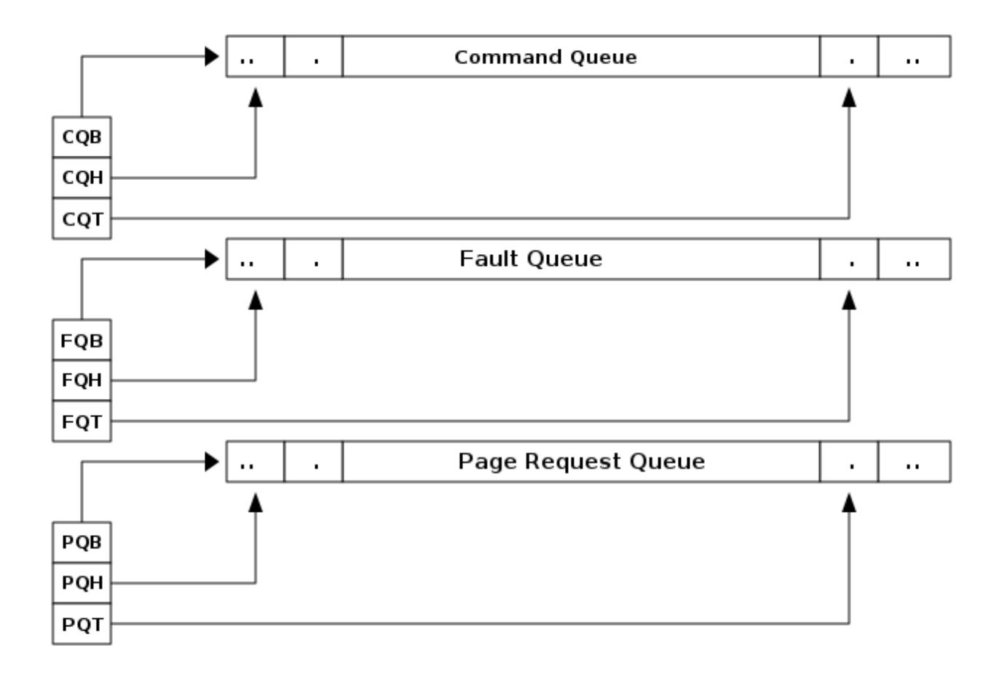

*Figure 28. IOMMU in-memory queues*

Each queue is a circular buffer with a head controlled by the consumer of data from the queue and a tail controlled by the producer of data into the queue. IOMMU is the producer of records into PQ and FQ and controls the tail register. IOMMU is the consumer of commands produced by software into the CQ and controls the head register. The tail register holds the index into the queue where the next entry will be written by the producer. The head register holds the index into the queue where the consumer will read the next entry to process.

A queue is empty if the head is equal to the tail. A queue is full if the tail is the head minus one. The head and tail wrap around when they reach the end of the circular buffer.

The producer of data must ensure that the data written to a queue and the tail update are ordered such that the consumer that observes an update to the tail register must also observe all data produced into the queue between the offsets determined by the head and the tail.


*All RISC-V IOMMU implementations are required to support in-memory queues located in main memory. Supporting in-memory queues in I/O memory is not required but is not prohibited by this specification.*

*The implication of the queue being considered full when tail is head minus one is that the effective size of the queue is one less than the number of entries in the queue.*

# <span id="page-49-0"></span>4.1. Command-Queue (CQ)

Command queue is used by software to queue commands to be processed by the IOMMU. Each command is 16 bytes.

The PPN of the base of this in-memory queue and the size of the queue is configured into a memorymapped register called command-queue base (cqb).

The tail of the command-queue resides in a software-controlled read/write memory-mapped register called command-queue tail (cqt). The cqt is an index into the next command queue entry that software will write. Subsequent to writing the command(s), software advances the cqt by the count of the number of commands written.

The head of the command-queue resides in a read-only memory-mapped IOMMU controlled register called command-queue head (cqh). The cqh is an index into the command queue that IOMMU should process next. Subsequent to reading each command the IOMMU may advance the cqh by 1. If cqh == cqt, the command-queue is empty. If cqt == (cqh - 1) the command-queue is full.

When an error bit or the fence\_w\_ip bit in cqcsr is 1, the command-queue interrupt pending (cip) bit is set in the ipsr if interrupts from command-queue are enabled (i.e. cqcsr.cie is 1).

IOMMU commands are grouped into a major command group determined by the opcode and within each group the func3 field specifies the function invoked by that command. The opcode defines the format of the operand fields. One or more of those fields may be used by the specific function invoked. The opcode encodings 64 to 127 are designated for custom use.

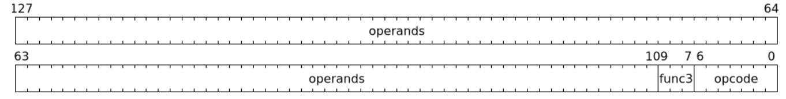

*Figure 29. Format of an IOMMU command*

The commands are interpreted as two 64-bit doublewords. The byte order of each of the doublewords in memory, little-endian or big-endian, is the endianness as determined by fctl.BE [\(Section 6.4\)](#page-66-0).

The following command opcodes are defined:

| opcode   | Encoding | Description                                   |
|----------|----------|-----------------------------------------------|
| IOTINVAL | 1        | IOMMU page-table cache invalidation commands. |
| IOFENCE  | 2        | IOMMU command-queue fence commands.           |
| IODIR    | 3        | IOMMU directory cache invalidation commands.  |
| ATS      | 4        | IOMMU PCIe [4] ATS commands.                  |
| Reserved | 5-63     | Reserved for future standard use.             |

*Table 10. IOMMU command opcodes*

| opcode | Encoding | Description                |
|--------|----------|----------------------------|
| Custom | 64-127   | Designated for custom use. |

All undefined functions of command opcodes 0 through 63 are reserved for future standard use.

A command is determined to be illegal if it uses a reserved encoding or if a reserved bit is set to 1. A command is unsupported if it is defined but not implemented as determined by the IOMMU capabilities register. If an illegal or unsupported command is fetched and decoded by the command-queue then the command-queue sets the cqcsr.cmd\_ill bit and stops processing commands from the command-queue. To re-enable command processing software should clear the cmd\_ill bit by writing 1 to it.

### 4.1.1. IOMMU Page-Table cache invalidation commands

<span id="page-50-0"></span>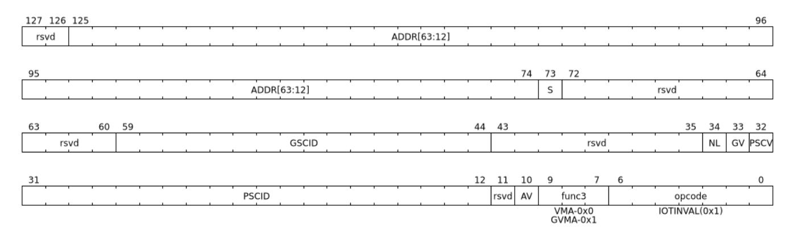

IOMMU operations cause implicit reads to PDT, first-stage and second-stage page tables. To reduce latency of such reads, the IOMMU may cache entries from the first-stage and/or second-stage page tables in the IOMMU-address-translation-cache (IOATC). These caches might not observe modifications performed by software to these data structures in memory.

The IOMMU translation-table cache invalidation commands, IOTINVAL.VMA and IOTINVAL.GVMA synchronize updates to in-memory first-stage and second-stage page table data structures respectively with the operation of the IOMMU and invalidate the matching IOATC entries.

The GV operand indicates if the Guest-Soft-Context ID (GSCID) operand is valid. The PSCV operand indicates if the Process Soft-Context ID (PSCID) operand is valid. Setting PSCV to 1 is allowed only for IOTINVAL.VMA. The AV operand indicates if the address (ADDR) operand is valid. When GV is 0, the translations associated with the host (i.e. those where the second-stage is Bare) are operated on. When GV is 0, the GSCID operand is ignored. When AV is 0, the ADDR operand is ignored. When PSCV operand is 0, the PSCID operand is ignored. When the AV operand is set to 1, if the ADDR operand specifies an invalid address, the command may or may not perform any invalidations.

The definition of the NL bit is provided by the non-leaf PTE invalidation extension [Section 9.2.](#page-102-0) The definition of the S bit is provided by the address range invalidation extension [Section 9.3.](#page-104-0)


*When an invalid address is specified, an implementation may either complete the command with no effect or may complete the command using an alternate, yet* UNSPECIFIED*, legal value for the address. Note that entries may generally be invalidated from the address translation cache at any time.*

IOTINVAL.VMA ensures that previous stores made to the first-stage page tables by the harts are observed by the IOMMU before all subsequent implicit reads from IOMMU to the corresponding first-stage page tables.

*Table 11.* IOTINVAL.VMA *operands and operations*

<span id="page-51-0"></span>

|   | GV AV | PSC<br>V | Operation                                                                                                                                                                                                                                                            |
|---|-------|----------|----------------------------------------------------------------------------------------------------------------------------------------------------------------------------------------------------------------------------------------------------------------------|
| 0 | 0     | 0        | Invalidates all address-translation cache entries, including those that contain global mappings, for all<br>host address spaces.                                                                                                                                     |
| 0 | 0     | 1        | Invalidates all address-translation cache entries for the host address space identified by PSCID operand,<br>except for entries containing global mappings.                                                                                                          |
| 0 | 1     | 0        | Invalidates all address-translation cache entries that contain first-stage leaf page table entries,<br>including those that contain global mappings, corresponding to the IOVA in ADDR operand, for all host<br>address spaces.                                      |
| 0 | 1     | 1        | Invalidates all address-translation cache entries that contain first-stage leaf page table entries<br>corresponding to the IOVA in ADDR operand and that match the host address space identified by PSCID<br>operand, except for entries containing global mappings. |
| 1 | 0     | 0        | Invalidates all address-translation cache entries, including those that contain global mappings, for all<br>VM address spaces associated with GSCID operand.                                                                                                         |
| 1 | 0     | 1        | Invalidates all address-translation cache entries for the VM address space identified by PSCID and<br>GSCID operands, except for entries containing global mappings.                                                                                                 |
| 1 | 1     | 0        | Invalidates all address-translation cache entries that contain first-stage leaf page table entries,<br>including those that contain global mappings, corresponding to the IOVA in ADDR operand, for all VM<br>address spaces associated with the GSCID operand.      |
| 1 | 1     | 1        | Invalidates all address-translation cache entries that contain first-stage leaf page table entries<br>corresponding to the IOVA in ADDR operand, for the VM address space identified by PSCID and GSCID<br>operands, except for entries containing global mappings.  |

IOTINVAL.GVMA ensures that previous stores made to the second-stage page tables are observed before all subsequent implicit reads from IOMMU to the corresponding second-stage page tables. Setting PSCV to 1 with IOTINVAL.GVMA is illegal.

*Table 12.* IOTINVAL.GVMA *operands and operations*

<span id="page-51-1"></span>

| GV | AV | Operation                                                                                                                                                                                                |
|----|----|----------------------------------------------------------------------------------------------------------------------------------------------------------------------------------------------------------|
| 0  |    | ignored Invalidates information cached from any level of the second-stage page table, for all VM address spaces.                                                                                         |
| 1  | 0  | Invalidates information cached from any level of the second-stage page tables, but only for VM address<br>spaces identified by the GSCID operand.                                                        |
| 1  | 1  | Invalidates information cached from leaf second-stage page table entries corresponding to the guest<br>physical-address in ADDR operand, but only for VM address spaces identified by the GSCID operand. |


*Conceptually, an implementation might contain two address-translation caches: one that maps guest virtual addresses to guest physical addresses, and another that maps guest physical addresses to supervisor physical addresses.* IOTINVAL.GVMA *need not invalidate the former cache, but it must invalidate entries from the latter cache that match the* IOTINVAL.GVMA *address and* GSCID *operands.*

*More commonly, implementations contain address-translation caches that map guest virtual addresses directly to supervisor physical addresses, removing a level of indirection. For such implementations, any entry whose guest virtual address maps to a guest physical address that matches the* IOTINVAL.GVMA *address and* GSCID *arguments must be invalidated. Selectively invalidating entries in this fashion requires tagging them with the guest physical address, which is costly, and so a common technique is to invalidate all entries that match the* GSCID *argument, regardless of the address argument.*

*Simpler implementations may ignore the operand of* IOTINVAL.VMA *and/or* IOTINVAL.GVMA *and perform a global invalidation of all address-translation entries.*

*Some implementations may cache an identity-mapped translation for the stage of address translation operating in* Bare *mode. Since these identity mappings are invariably correct, an explicit invalidation is unnecessary.*

*A consequence of this specification is that an implementation may use any translation for an address that was valid at any time since the most recent* IOTINVAL *that subsumes that address. In particular, if a leaf PTE is modified but a subsuming* IOTINVAL *is not executed, either the old translation or the new translation will be used, but the choice is unpredictable. The behavior is otherwise well-defined.*

*In a conventional TLB design, it is possible for multiple entries to match a single address if, for example, a page is upgraded to a larger page without first clearing the original non-leaf PTE's valid bit and executing an* IOTINVAL.VMA *or* IOTINVAL.GVMA *as applicable with* AV=0*. In this case, a similar remark applies: it is unpredictable whether the old non-leaf PTE or the new leaf PTE is used, but the behavior is otherwise well defined.*

*Another consequence of this specification is that it is generally unsafe to update a PTE using a set of stores of a width less than the width of the PTE, as it is legal for the implementation to read the PTE at any time, including when only some of the partial stores have taken effect.*

#### <span id="page-52-0"></span>4.1.2. IOMMU Command-queue Fence commands

| 127 126 | 125 |  |  |      |      |   |      |      |         |        |       |    |    |     |    |   |       |   |   |   |         |      |       | 96   |
|---------|-----|--|--|------|------|---|------|------|---------|--------|-------|----|----|-----|----|---|-------|---|---|---|---------|------|-------|------|
| rsvd    |     |  |  | <br> |      |   | _    | <br> | <br>    | ADDR   | (63:2 | :] |    |     |    |   |       |   |   |   |         |      |       | <br> |
| 95      |     |  |  |      |      |   |      |      |         |        |       |    |    |     |    |   |       |   |   |   |         |      |       | 64   |
|         |     |  |  | <br> |      |   |      |      | <br>ADD | R[63:2 | 2]    |    |    |     |    |   |       |   |   |   |         |      |       | <br> |
| 63      |     |  |  |      |      |   |      |      |         |        |       |    |    |     |    |   |       |   |   |   |         |      |       | 3    |
|         |     |  |  | <br> |      |   |      | <br> |         | DATA   |       |    |    |     |    |   |       |   |   |   |         |      |       | <br> |
| 31      |     |  |  |      |      |   |      |      |         |        | 14    | 13 | 12 | 11  | 10 | 9 |       | 7 | 6 | į |         |      |       | (    |
|         |     |  |  |      | rsvd | 1 |      |      |         |        |       | PW | PR | WSI | AV |   | func3 | 3 |   |   | <br>0   | pcod | de    |      |
|         |     |  |  | <br> |      |   | <br> | <br> | <br>    |        |       |    |    |     |    |   | C-0x0 | ) |   |   | <br>OFE | NCE  | (0x2) | <br> |

The IOMMU fetches commands from the CQ in order but the IOMMU may execute the fetched commands out of order. The IOMMU advancing cqh is not a guarantee that the commands fetched by the IOMMU have been executed or committed.

A IOFENCE.C command completion, as determined by cqh advancing past the index of the IOFENCE.C command in the CQ, guarantees that all previous commands fetched from the CQ have been completed and committed.

If the IOFENCE.C times out waiting on completion of previous commands that are specified to have a timeout, then the cmd\_to bit in cqcsr [Section 6.15](#page-73-0) is set to signal this condition. The cqh holds the index of the IOFENCE.C that timed out and all previous commands that are not specified to have a timeout have been completed and committed.


*In this version of the specification, only the* ATS.INVAL *command is specified to have a timeout.*

The commands may be used to order memory accesses from I/O devices connected to the IOMMU as viewed by the IOMMU, other RISC-V harts, and external devices or co-processors.

The PR bit, when set to 1, can be used to request that the IOMMU ensure that all previous read requests from devices that have already been processed by the IOMMU be committed to a global ordering point such that they can be observed by all RISC-V harts and IOMMUs in the system.

The PW bit, when set to 1, can be used to request that the IOMMU ensure that all previous write requests from devices that have already been processed by the IOMMU be committed to a global ordering point such that they can be observed by all RISC-V harts and IOMMUs in the system.

The wire-signaled-interrupts (WSI) bit when set to 1 causes a wired-interrupt from the command queue to be generated (by setting cqcsr.fence\_w\_ip - [Section 6.15\)](#page-73-0) on completion of IOFENCE.C. This bit is reserved if the IOMMU does not support wired-interrupts or wired-interrupts have not been enabled (i.e., fctl.WSI == 0).

> *Software should ensure that all previous read and writes processed by the IOMMU have been committed to a global ordering point before reclaiming memory that was previously made accessible to a device. A safe sequence for such memory reclamation is to first update the page tables to disallow access to the memory from the device and then use the* IOTINVAL.VMA *or* IOTINVAL.GVMA *appropriately to synchronize the IOMMU with the update to the page table. As part of the synchronization if the memory reclaimed was previously made read accessible to the device then request ordering of all previous reads; else if the memory reclaimed was previously made write accessible to the device then request ordering of all previous reads and writes. Ordering previous reads may be required if the reclaimed memory will be used to hold data that must not be made visible to the device.*


*The* IOFENCE.C *with* PR *and/or* PW *set to 1 only ensures that requests that have been already processed by the IOMMU are committed to the global ordering point. Software must perform an interconnect-specific fence action if there is a need to ensure that all in-flight requests from a device that have not yet been processed by the IOMMU are observed. For PCIe, for example, a completion from device in response to a read from the device memory has the property of ensuring that previous posted writes are observed by the IOMMU as completions may not pass previous posted writes.*

*The ordering guarantees are made for accesses to main-memory. For accesses to I/O memory, the ordering guarantees are implementation and I/O protocol defined. Simpler implementations may unconditionally order all previous memory accesses globally.*

The AV command operand indicates if ADDR[63:2] and DATA operands are valid. If AV=1, the IOMMU writes DATA to memory at a 4-byte aligned address ADDR[63:2] \* 4 as a 4-byte store when the command completes. When AV is 0, the ADDR[63:2] and DATA operands are ignored. If the attempt to perform this write encounters a memory fault, the cmd\_mf bit in cqcsr [Section 6.15](#page-73-0) is set to signal this condition, and the cqh holds the index of the IOFENCE.C that encountered such a memory fault and did not complete.


*Software may configure the* ADDR[63:2] *command operand to specify the address of the* seteipnum\_le*/*seteipnum\_be *register in an IMSIC to cause an external interrupt notification on* IOFENCE.C *completion. Alternatively, software may program* ADDR[63:2] *to a memory location and use* IOFENCE.C *to set a flag in memory indicating command completion.*

#### <span id="page-53-0"></span>4.1.3. IOMMU directory cache invalidation commands

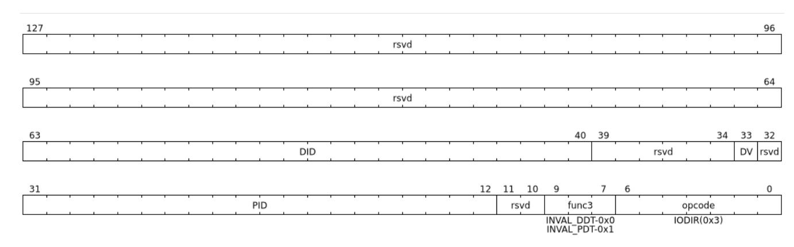

IOMMU operations cause implicit reads to DDT and/or PDT. To reduce latency of such reads, the IOMMU may cache entries from the DDT and/or PDT in IOMMU directory caches. These caches might not observe modifications performed by software to these data structures in memory.

<span id="page-54-1"></span>The IOMMU DDT cache invalidation command, IODIR.INVAL\_DDT, synchronizes updates to DDT with the operation of the IOMMU and flushes the matching cached entries.

<span id="page-54-2"></span>The IOMMU PDT cache invalidation command, IODIR.INVAL\_PDT, synchronizes updates to PDT with the operation of the IOMMU and flushes the matching cached entries.

The DV operand indicates if the device ID (DID) operand is valid. The DV operand must be 1 for IODIR.INVAL\_PDT else the command is illegal. When DV operand is 1, the value of the DID operand must not be wider than that supported by the ddtp.iommu\_mode.

IODIR.INVAL\_DDT guarantees that any previous stores made by a RISC-V hart to the DDT are observed before all subsequent implicit reads from IOMMU to DDT. If DV is 0, then the command invalidates all DDT and PDT entries cached for all devices; the DID operand is ignored. If DV is 1, then the command invalidates cached leaf-level DDT entry for the device identified by DID operand and all associated PDT entries. The PID operand is reserved for the IODIR.INVAL\_DDT command.

IODIR.INVAL\_PDT guarantees that any previous stores made by a RISC-V hart to the PDT are observed before all subsequent implicit reads from IOMMU to PDT. The command invalidates cached leaf PDT entry for the specified PID and DID. The PID operand of IODIR.INVAL\_PDT must not be wider than the width supported by the IOMMU (see [Section 6.3](#page-63-1)).

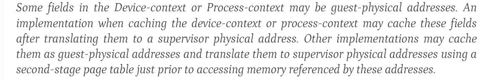

*If second-stage page tables used for these translations are modified, software must issue the appropriate* IODIR *command as some implementations may choose to cache the translated supervisor physical address pointer in the IOMMU directory caches.*

*The* IOTINVAL *command has no effect on the IOMMU directory caches.*

#### <span id="page-54-0"></span>4.1.4. IOMMU PCIe ATS commands

This command is supported if capabilities.ATS is set to 1.

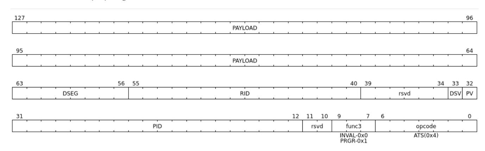

The ATS.INVAL command instructs the IOMMU to send an "Invalidation Request" message to the PCIe device function identified by RID. An "Invalidation Request" message is used to clear a specific subset of the address range from the address translation cache in a device function. The ATS.INVAL command completes when an "Invalidation Completion" response message is received from the device or a protocol-defined timeout occurs while waiting for a response. The IOMMU may advance the cqh and fetch more commands from CQ while a response is awaited. If a timeout occurs, it is reported when a subsequent IOFENCE.C command is executed.

*Software that needs to know if the invalidation operation completed on the device may use the IOMMU command-queue fence command (*IOFENCE.C*) to wait for the responses to all prior "Invalidation Request" messages. The* IOFENCE.C *is guaranteed to not complete before all previously fetched commands were executed and completed. A previously fetched ATS command to invalidate device ATC does not complete until either the request times out or a valid response is received from the device.*

*If one or more ATS invalidation commands preceding the* IOFENCE.C *have timed out, then software may make the CQ operational again and resubmit the invalidation commands that may have timed out. If the* ATS.INVAL *commands queued before the* IOFENCE.C *were directed at multiple devices then software may resubmit these commands as* ATS.INVAL *and* IOFENCE.C *pairs to identify the device that caused the timeout.*

The ATS.PRGR command instructs the IOMMU to send a "Page Request Group Response" message to the PCIe device function identified by the RID. The "Page Request Group Response" message is used by system hardware and/or software to communicate with the device functions page-request interface to signal completion of a "Page Request", or the catastrophic failure of the interface.

If the PV operand is set to 1, the message is generated with a PASID with the PASID field set to the PID operand. if PV operand is set to 0, then the PID operand is ignored and the message is generated without a PASID.

The PAYLOAD operand of the command is used to form the message body and its fields are as specified by the PCIe specification [[4](#page-106-4)]. The PAYLOAD field is formatted as follows:

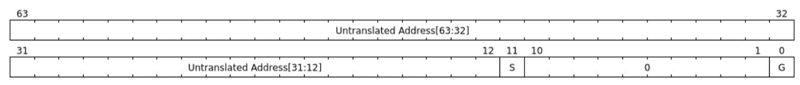

*Figure 30.* PAYLOAD *of an* ATS.INVAL *command*

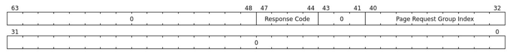

*Figure 31.* PAYLOAD *of an* ATS.PRGR *command*

If the DSV operand is 1, then a valid destination segment number is specified by the DSEG operand. If the DSV operand is 0, then the DSEG operand is ignored.


*A Hierarchy is a PCI Express I/O interconnect topology, wherein the Configuration Space addresses, referred to as the tuple of Bus/Device/Function Numbers, are unique. In some contexts, a Hierarchy is also called a Segment, and in Flit Mode, the Segment number is sometimes included in the ID of a Function.*

# <span id="page-56-0"></span>4.2. Fault/Event-Queue (**FQ**)

Fault/Event queue is an in-memory queue data structure used to report events and faults raised when processing transactions. Each fault record is 32 bytes.

The PPN of the base of this in-memory queue and the size of the queue is configured into a memorymapped register called fault-queue base (fqb).

The tail of the fault-queue resides in an IOMMU controlled read-only memory-mapped register called fqt. The fqt is an index into the next fault record that IOMMU will write in the fault-queue. Subsequent to writing the record, the IOMMU advances the fqt by 1. The head of the fault-queue resides in a read/write memory-mapped software controlled register called fqh. The fqh is an index into the fault record that SW should process next. Subsequent to processing fault record(s) software advances the fqh by the count of the number of fault records processed. If fqh == fqt, the fault-queue is empty. If fqt == (fqh - 1) the faultqueue is full.

The fault records are interpreted as four 64-bit doublewords. The byte order of each of the doublewords in memory, little-endian or big-endian, is the endianness as determined by fctl.BE [\(Section 6.4\)](#page-66-0).

| 255 |   |   |  |   |     |   |     |      |          |     |    |    |   |    |    |     |      |    |      | 224  |
|-----|---|---|--|---|-----|---|-----|------|----------|-----|----|----|---|----|----|-----|------|----|------|------|
|     |   |   |  |   |     |   |     |      | iotval2  |     |    |    |   |    |    |     |      |    |      |      |
| 223 | · | , |  | · |     | · | ,   |      | •        |     | ,  |    | · | •  |    |     | ,    |    | •    | 192  |
|     |   |   |  |   |     |   |     |      | iotval2  |     |    |    |   |    |    |     |      |    |      |      |
| 191 |   |   |  |   |     |   |     |      |          |     |    |    |   |    |    |     |      |    |      | 160  |
|     |   |   |  |   |     |   |     | <br> | iotval   |     |    |    |   |    |    |     |      |    |      |      |
| 159 |   |   |  |   |     |   |     |      |          |     |    |    |   |    |    |     |      |    |      | 128  |
|     |   |   |  |   |     |   |     |      | iotval   |     |    |    |   |    |    |     |      |    |      |      |
| 127 |   |   |  |   |     |   |     |      |          |     |    |    |   |    |    |     |      |    |      | 96   |
| '   |   |   |  |   |     |   |     |      | reserved |     |    |    |   |    |    |     |      |    |      |      |
| 95  | · | , |  | · |     | · | ,   |      | •        |     | ,  |    | · | •  |    |     | ,    |    | •    | 64   |
|     |   |   |  |   |     |   |     | for  | custom ι | ıse |    |    |   |    |    |     |      |    |      |      |
| 63  |   |   |  |   |     |   |     |      |          |     |    |    |   | 40 | 39 |     |      | 34 | 33   | 32   |
|     |   |   |  |   |     |   | DID |      |          |     |    |    |   |    |    |     | TTYP |    | PRIV | / PV |
| 31  |   | • |  | • |     | • | •   | '    | •        |     | 12 | 11 |   |    |    |     | 1    |    |      | 0    |
|     |   |   |  |   | PID |   |     | '    |          |     | ,  |    | - |    |    | CAU | SE   |    |      |      |

*Figure 32. Fault-queue record*

<span id="page-56-1"></span>The CAUSE is a code indicating the cause of the fault/event.

*Table 13. Fault record* CAUSE *field encodings*

| CAUSE | Description                  | Reported if DTF is 1? |
|-------|------------------------------|-----------------------|
| 1     | Instruction access fault     | No                    |
| 4     | Read address misaligned      | No                    |
| 5     | Read access fault            | No                    |
| 6     | Write/AMO address misaligned | No                    |
| 7     | Write/AMO access fault       | No                    |

| CAUSE | Description                           | Reported if DTF is 1? |
|-------|---------------------------------------|-----------------------|
| 12    | Instruction page fault                | No                    |
| 13    | Read page fault                       | No                    |
| 15    | Write/AMO page fault                  | No                    |
| 20    | Instruction guest page fault          | No                    |
| 21    | Read guest-page fault                 | No                    |
| 23    | Write/AMO guest-page fault            | No                    |
| 256   | All inbound transactions disallowed   | Yes                   |
| 257   | DDT entry load access fault           | Yes                   |
| 258   | DDT entry not valid                   | Yes                   |
| 259   | DDT entry misconfigured               | Yes                   |
| 260   | Transaction type disallowed           | No                    |
| 261   | MSI PTE load access fault             | No                    |
| 262   | MSI PTE not valid                     | No                    |
| 263   | MSI PTE misconfigured                 | No                    |
| 264   | MRIF access fault                     | No                    |
| 265   | PDT entry load access fault           | No                    |
| 266   | PDT entry not valid                   | No                    |
| 267   | PDT entry misconfigured               | No                    |
| 268   | DDT data corruption                   | Yes                   |
| 269   | PDT data corruption                   | No                    |
| 270   | MSI PT data corruption                | No                    |
| 271   | MSI MRIF data corruption              | No                    |
| 272   | Internal data path error              | Yes                   |
| 273   | IOMMU MSI write access fault          | Yes                   |
| 274   | First/second-stage PT data corruption | No                    |

The CAUSE encodings 275 through 2047 are reserved for future standard use and the encodings 2048 through 4095 are designated for custom use. Encodings between 0 and 275 that are not specified in [Table](#page-56-1) are reserved for future standard use.

If a fault condition prevents locating a valid device context then the DTF value assumed for reporting such faults is 0.

The TTYP field reports inbound transaction type.

*Table 14. Fault record* TTYP *field encodings*

| TTYP | Description                                       |
|------|---------------------------------------------------|
| 0    | None. Fault not caused by an inbound transaction. |
| 1    | Untranslated read for execute transaction         |
| 2    | Untranslated read transaction                     |
| 3    | Untranslated write/AMO transaction                |
| 4    | Reserved                                          |

| TTYP    | Description                             |
|---------|-----------------------------------------|
| 5       | Translated read for execute transaction |
| 6       | Translated read transaction             |
| 7       | Translated write/AMO transaction        |
| 8       | PCIe ATS Translation Request            |
| 9       | PCIe Message Request                    |
| 10 - 31 | Reserved                                |
| 31 - 63 | Designated for custom use               |

If the TTYP is a transaction with an IOVA, the IOVA is reported in iotval. If the TTYP is a PCIe message request, the message code of the PCIe message is reported in iotval. If TTYP is 0, the values reported in iotval and iotval2 fields are as defined by the CAUSE.


*The* IOVA *is partitioned into a virtual page number (VPN) and page offset. Whereas the VPN is translated into a physical page number (PPN) by the address translation process, the page offset is not required for this process. The IO bridge in some implementations may not provide the page offset part of the* IOVA *to the IOMMU and the IOMMU may report the page offset in* iotval *as 0. Likewise, an IOMMU may report the page offset of a GPA in* iotval2 *as 0.*

DID holds the device\_id of the transaction. If PV is 0, then PID and PRIV are 0. If PV is 1, the PID holds a process\_id of the transaction and if the privilege of the transaction was Supervisor then the PRIV bit is 1 else it's 0. The DID, PV, PID, and PRIV fields are 0 if TTYP is 0.

If the CAUSE is a guest-page fault then bits 63:2 of the zero-extended guest-physical-address are reported in iotval2[63:2]. If bit 0 of iotval2 is 1, then the guest-page-fault was caused by an implicit memory access for first-stage address translation. If bit 0 of iotval2 is 1, and the implicit access was a write then bit 1 of iotval2 is set to 1 else it is set to 0.

*The bit 1 of* iotval2 *is set for the case where the implementation supports hardware updating of A/D bits and the implicit memory access was attempted to automatically update A and/or D in first-stage page tables. All other implicit memory accesses for first-stage address translation will be reads. If the hardware updating of A/D bits is not implemented, the write case will never arise.*

*When the second-stage is not Bare, the memory accesses for reading PDT entries to locate the Process-context are implicit memory accesses for first-stage address translation. If a guestpage fault was caused by implicit memory access to read PDT entries, then bit 0 of* iotval2 *is reported as 1 and bit 1 as 0.*

The IOMMU may be unable to report faults through the fault-queue due to error conditions such as the fault-queue being full or the IOMMU encountering access faults when attempting to access the queue memory. A memory-mapped fault control and status register (fqcsr) holds information about such faults. If the fault-queue full condition is detected, the IOMMU sets the fault-queue overflow (fqof) bit in fqcsr. If the IOMMU encounters a fault in accessing the fault-queue memory, the IOMMU sets the fault-queue memory access fault (fqmf) bit in fqcsr. While either error bit is set in fqcsr, the IOMMU discards the record that led to the fault and all further fault records. When an error bit in fqcsr is 1 or when a new fault record is produced in the fault-queue, the fault interrupt pending (fip) bit is set in ipsr if interrupts from the fault-queue are enabled i.e. fqcsr.fie is 1.

The IOMMU may identify multiple requests as having detected an identical fault. In such cases the IOMMU may report each of those faults individually, or report the fault for a subset, including one, of requests.

# <span id="page-59-0"></span>4.3. Page-Request-Queue (**PQ**)

Page-request queue is an in-memory queue data structure used to report PCIe ATS "Page Request" and "Stop Marker" messages [[4](#page-106-4)] to software. The base PPN of this in-memory queue and the size of the queue is configured into a memory-mapped register called page-request queue base (pqb). Each Page-Request record is 16 bytes.

The tail of the queue resides in an IOMMU controlled read-only memory-mapped register called pqt. The pqt holds an index into the queue where the next page-request message will be written by the IOMMU. Subsequent to writing the message, the IOMMU advances the pqt by 1.

The head of the queue resides in a software controlled read/write memory-mapped register called pqh. The pqh holds an index into the queue where the next page-request message will be received by software. Subsequent to processing the message(s) software advances the pqh by the count of the number of messages processed.

If pqh == pqt, the page-request queue is empty.

If pqt == (pqh - 1) the page-request queue is full.

The IOMMU may be unable to report "Page Request" messages through the queue due to error conditions such as the queue being disabled, queue being full, or the IOMMU encountering access faults when attempting to access queue memory. A memory-mapped page-request queue control and status register (pqcsr) is used to hold information about such faults. On a page queue full condition the page-requestqueue overflow (pqof) bit is set in pqcsr. If the IOMMU encountered a fault in accessing the queue memory, the page-request-queue memory access fault (pqmf) bit is set in pqcsr. While either error bit is set in pqcsr, the IOMMU discards all subsequent "Page Request" messages, including the message that caused the error bits to be set. "Page request" messages that do not require a response, i.e. those with the "Last Request in PRG" field is 0, are silently discarded. "Page request" messages that require a response, i.e. those with "Last Request in PRG" field set to 1 and are not "Stop Marker" messages, may be auto-completed by an IOMMU generated "Page Request Group Response" message as specified in [Section 3.7](#page-44-0).

When an error bit in pqcsr is 1 or when a new message is produced in the queue, the page-request-queue interrupt pending (pip) bit is set in the ipsr if interrupts from page-request-queue are enabled i.e. pqcsr.pie is 1.

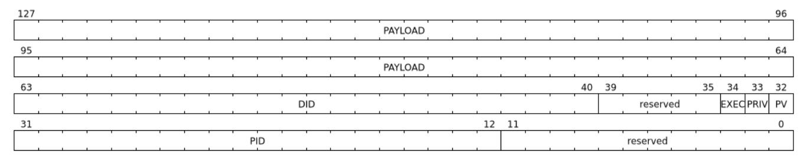

*Figure 33. Page-request-queue record*

The DID field holds the requester ID from the message. The PID field is valid if PV is 1 and reports the PASID from message. PRIV is set to 0 if the message did not have a PASID, otherwise it holds the "Privilege Mode Requested" bit from the TLP. The EXEC bit is set to 0 if the message did not have a PASID, otherwise it reports the "Execute Requested" bit from the TLP. All other fields are set to 0. The payload of the "Page Request" message (bytes 0x08 through 0x0F of the message) is held in the PAYLOAD field. If R and W are both 0 and L is 1, the message is "Stop Marker".

The page-request-queue records are interpreted as two 64-bit doublewords. The byte order of each of the doublewords in memory, little-endian or big-endian, is the endianness as determined by fctl.BE [\(Section](#page-66-0) [6.4](#page-66-0)).

The PAYLOAD holds the message body and its fields are as specified by the PCIe specification [\[4\]](#page-106-4). The PAYLOAD field is formatted as follows:

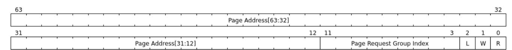

*Figure 34.* PAYLOAD *of a "Page request" message*

# <span id="page-61-0"></span>Chapter 5. Debug support

To support software debug, the IOMMU may provide an optional register interface that may be used by software to request IOMMU to perform an address translation. The IOMMU supports this capability when capabilities.DBG is 1. The interface consists of two set of registers; translation-request registers that are used by software to program an IOVA and other inputs needed by the process to translate an IOVA [\(Section](#page-36-0) [3.3](#page-36-0)) as an Untranslated Request. The result of the translation, if the process completes successfully, is reported through the translation-response registers. If the process stops due to faults then the faults are reported normally in the fault-queue and the translation-response registers updated with a failure indicator. If the IOVA is determined to be that of a virtual interrupt file ([Section 3.1.3.6](#page-31-0)) and the corresponding MSI PTE is in MRIF mode, then the process stops and reports a "Transaction type disallowed" (cause = 260) fault.

When the process to translate an IOVA is invoked for this purpose, the IOMMU may or may not cache first-stage PTEs, second-stage PTEs, DDT entries, PDT entries, or MSI PTEs accessed for the translation process in the IOATC. The IOMMU is allowed to use any PTEs or directory structure entries that may already be cached in the IOATC. The IOMMU may update the Accessed (A) and/or Dirty (D) bits in the PTEs used for the translation process if supported by the IOMMU. When the IOMMU implements a HPM, the HPM counters may be updated normally by the IOMMU. For the purpose of counting in the HPM, these requests are treated as Untranslated Requests.

The translation-request interface consists of the following 64-bit WARL registers:

- ⚫ tr\_req\_iova ([Section 6.24\)](#page-83-0)
- ⚫ tr\_req\_ctl [\(Section 6.25\)](#page-83-1)

The translation-response interface consists of a single 64-bit RO register tr\_response [\(Section 6.26](#page-84-0))

To request a translation, the tr\_req\_iova register is written first with the desired IOVA and the tr\_req\_ctl register is written next. The 'Go/Busy` bit is set in tr\_req\_ctl to indicate a valid request in the registers. The Go/Busy bit is a read-write-sticky (RWS) bit that once set cannot be cleared by writing the register. The Go/Busy bit will be cleared to 0 by the IOMMU when the process completes (successfully or due to encountering a fault). When the Go/Busy bit goes from 1 to 0, a response is valid in the tr\_response register.

When the Go/Busy bit is 1, the IOMMU behavior is UNSPECIFIED if:

- ⚫ The tr\_req\_iova or tr\_req\_ctl are modified.
- ⚫ IOMMU configurations, such as ddtp.iommu\_mode, are modified.

The time to complete a translation request through this debug interface is UNSPECIFIED but is required to be finite. If the IOMMU is serving translation requests from the IO bridge when a request is made through this register interface then the time to complete the request may be longer than when the IOMMU is otherwise idle.


*The debug interface is optional but recommended to be implemented to aid software debug and to implement architectural compliance tests.*

# <span id="page-62-0"></span>Chapter 6. Memory-mapped register interface

The IOMMU provides a memory-mapped programming interface. The memory-mapped registers of each IOMMU are located within a naturally aligned 4-KiB region (a page) of physical address space.

The IOMMU behavior for register accesses where the address is not aligned to the size of the access, or if the access spans multiple registers, or if the size of the access is not 4 bytes or 8 bytes, is UNSPECIFIED. A 4 byte access to an IOMMU register must be single-copy atomic. Whether an 8 byte access to an IOMMU register is single-copy atomic is UNSPECIFIED, and such an access may appear, internally to the IOMMU, as if two separate 4 byte accesses — first to the high half and second to the low half — were performed.


*The 8-byte IOMMU registers are defined in such a way that software can perform two individual 4-byte accesses, or hardware can perform two independent 4-byte transactions resulting from an 8-byte access, to the high and low halves of the register, in that order, as long as the register semantics, with regard to side-effects, are respected between the two software accesses, or two hardware transactions, respectively.*

The IOMMU registers have little-endian byte order, even for systems where all harts are big-endian-only.


*Big-endian-configured harts that make use of an IOMMU are expected to implement the* REV8 *byte-reversal instruction defined by the Zbb extension. If* REV8 *is not implemented, then endianness conversion may be implemented using a sequence of instructions.*

If a register is optional, as determined by the corresponding capabilities register bit being 0, then a read from the memory-mapped register offset of the register returns 0 and writes to that offset are ignored.

# <span id="page-62-1"></span>6.1. Register layout

*Table 15. IOMMU Memory-mapped register layout*

| Offset | Name         | Size | Description                    | Is Optional?           |
|--------|--------------|------|--------------------------------|------------------------|
| 0      | capabilities | 8    | Capabilities of the IOMMU      | No                     |
| 8      | fctl         | 4    | Features control               | No                     |
| 12     | custom       | 4    | Designated For custom use      |                        |
| 16     | ddtp         | 8    | Device directory table pointer | No                     |
| 24     | cqb          | 8    | Command-queue base             | No                     |
| 32     | cqh          | 4    | Command-queue head             | No                     |
| 36     | cqt          | 4    | Command-queue tail             | No                     |
| 40     | fqb          | 8    | Fault-queue base               | No                     |
| 48     | fqh          | 4    | Fault-queue head               | No                     |
| 52     | fqt          | 4    | Fault-queue tail               | No                     |
| 56     | pqb          | 8    | Page-request-queue base        | if capabilities.ATS==0 |
| 64     | pqh          | 4    | Page-request-queue head        | if capabilities.ATS==0 |
| 68     | pqt          | 4    | Page-request-queue tail        | if capabilities.ATS==0 |
| 72     | cqcsr        | 4    | Command-queue CSR              | No                     |
| 76     | fqcsr        | 4    | Fault-queue CSR                | No                     |
| 80     | pqcsr        | 4    | Page-request-queue CSR         | if capabilities.ATS==0 |

| Offset | Name         | Size | Description                        | Is Optional?             |
|--------|--------------|------|------------------------------------|--------------------------|
| 84     | ipsr         | 4    | Interrupt pending status register  | No                       |
| 88     | iocountovf   | 4    | HPM counter overflows              | if capabilities.HPM==0   |
| 92     | iocountinh   | 4    | HPM counter inhibits               | if capabilities.HPM==0   |
| 96     | iohpmcycles  | 8    | HPM cycles counter                 | if capabilities.HPM==0   |
| 104    | iohpmctr1-31 | 248  | HPM event counters                 | if capabilities.HPM==0   |
| 352    | iohpmevt1-31 | 248  | HPM event selector                 | if capabilities.HPM==0   |
| 600    | tr_req_iova  | 8    | Translation-request IOVA           | if capabilities.DBG==0   |
| 608    | tr_req_ctl   | 8    | Translation-request control        | if capabilities.DBG==0   |
| 616    | tr_response  | 8    | Translation-request response       | if capabilities.DBG==0   |
| 624    | iommu_qosid  | 4    | IOMMU QoS ID                       | if capabilities.QOSID==0 |
| 628    | Reserved     | 60   | Reserved for future use (WPRI)     |                          |
| 688    | custom       | 72   | Designated for custom use (WARL)   |                          |
| 760    | icvec        | 8    | Interrupt cause to vector register | No                       |
| 768    | msi_cfg_tbl  | 256  | MSI Configuration Table            | if capabilities.IGS==WSI |
| 1024   | Reserved     | 3072 | Reserved for standard use          |                          |

### <span id="page-63-0"></span>6.2. Reset behavior

The reset value is 0 for the following registers fields.

- ⚫ cqcsr cqen, cqie, cqon, and busy
- ⚫ fqcsr fqen, fqie, fqon, and busy
- ⚫ pqcsr pqen, pqie, pqon, and busy
- ⚫ tr\_req\_ctl.Go/Busy
- ⚫ ddtp.busy

The reset value is 0 for the following registers.

⚫ ipsr

Reset value for ddtp.iommu\_mode field must be either Off or Bare.

After a reset the caches [\(Section 3.8\)](#page-46-0) must have no valid entries.


*The reset value for the* iommu\_mode *is recommended to be* Off*.*

The reset value is UNSPECIFIED for all other registers and/or fields.

# <span id="page-63-1"></span>6.3. IOMMU capabilities (**capabilities**)

The capabilities register is a read-only register reporting features supported by the IOMMU. Each field if not clear indicates the presence of that feature in the IOMMU. At reset, the register shall contain the IOMMU supported features.

| 63       | _           |          |          |        |        |        | 56       |
|----------|-------------|----------|----------|--------|--------|--------|----------|
|          |             |          | cus      | stom   |        |        |          |
| 55       |             |          |          |        |        |        | 48       |
|          |             |          | rese     | erved  |        |        |          |
| 47       |             |          | 44       | 43     | 42     | 41     | 40       |
|          | rese        | rved     |          | s      | NL     | QOSID  | PD20     |
| 39       | 38          | 37       |          |        |        |        | 32       |
| PD17     | PD8         |          |          | P      | AS     |        |          |
| 31       | 30          | 29       | 28       | 27     | 26     | 25     | 24       |
| DBG      | НРМ         | IC       | S        | END    | T2GPA  | ATS    | AMO_HWAD |
| 23       | 22          | 21       | 20       | 19     | 18     | 17     | 16       |
| MSI_MRIF | MSI_FLAT    | AMO_MRIF | reserved | Sv57x4 | Sv48x4 | Sv39x4 | Sv32x4   |
| 15       | 14          | 13       | 12       | 11     | 10     | 9      | 8        |
| Svpbmt   | Svrsw60t59b | rese     | rved     | Sv57   | Sv48   | Sv39   | Sv32     |
| 7        | 1           | 1        | •        | •      | 1      | •      | 0        |
|          | T           | 1        | ver      | rsion  | 1      | 1      |          |

*Figure 35. IOMMU capabilities register fields*

| Bits  | Field           | Attribut<br>e | Description                                                                                                                                                                                                                                                                                                                                |  |  |
|-------|-----------------|---------------|--------------------------------------------------------------------------------------------------------------------------------------------------------------------------------------------------------------------------------------------------------------------------------------------------------------------------------------------|--|--|
| 7:0   | version         | RO            | The version field holds the version of the specification implemented by the IOMMU.<br>The low nibble is used to hold the minor version of the specification and the upper<br>nibble is used to hold the major version of the specification. For example, an<br>implementation that supports version 1.0 of the specification reports 0x10. |  |  |
| 8     | Sv32            | RO            | Page-based 32-bit virtual addressing is supported.                                                                                                                                                                                                                                                                                         |  |  |
| 9     | Sv39            | RO            | Page-based 39-bit virtual addressing is supported.                                                                                                                                                                                                                                                                                         |  |  |
| 10    | Sv48            | RO            | Page-based 48-bit virtual addressing is supported.<br>When Sv48 is set, Sv39 must be set.                                                                                                                                                                                                                                                  |  |  |
| 11    | Sv57            | RO            | Page-based 57-bit virtual addressing is supported<br>When Sv57 is set, Sv48 must be set.                                                                                                                                                                                                                                                   |  |  |
| 13:12 | reserved        | RO            | Reserved for standard use.                                                                                                                                                                                                                                                                                                                 |  |  |
| 14    | Svrsw60t<br>59b | RO            | PTE Reserved-for-Software Bits 60-59.                                                                                                                                                                                                                                                                                                      |  |  |
| 15    | Svpbmt          | RO            | Page-based memory types.                                                                                                                                                                                                                                                                                                                   |  |  |
| 16    | Sv32x4          | RO            | Page-based 34-bit virtual addressing for second-stage address translation is supported.                                                                                                                                                                                                                                                    |  |  |
| 17    | Sv39x4          | RO            | Page-based 41-bit virtual addressing for second-stage address translation is supported.                                                                                                                                                                                                                                                    |  |  |
| 18    | Sv48x4          | RO            | Page-based 50-bit virtual addressing for second-stage address translation is supported.                                                                                                                                                                                                                                                    |  |  |
| 19    | Sv57x4          | RO            | Page-based 59-bit virtual addressing for second-stage address translation is supported.                                                                                                                                                                                                                                                    |  |  |
| 20    | reserved        | RO            | Reserved for standard use.                                                                                                                                                                                                                                                                                                                 |  |  |
| 21    | AMO_MRIF        | RO            | Atomic updates to MRIF is supported.                                                                                                                                                                                                                                                                                                       |  |  |
| 22    | MSI_FLAT        | RO            | MSI address translation using Pass-through mode MSI PTE is supported.                                                                                                                                                                                                                                                                      |  |  |
| 23    | MSI_MRIF        | RO            | MSI address translation using MRIF mode MSI PTE is supported.                                                                                                                                                                                                                                                                              |  |  |
| 24    | AMO_HWAD        | RO            | Atomic updates to PTE accessed (A) and dirty (D) bit is supported.                                                                                                                                                                                                                                                                         |  |  |
| 25    | ATS             | RO            | PCIe Address Translation Services (ATS) and page-request interface (PRI) [4] is<br>supported.                                                                                                                                                                                                                                              |  |  |
| 26    | T2GPA           | RO            | Returning guest-physical-address in ATS translation completions is supported.                                                                                                                                                                                                                                                              |  |  |

| Bits      | Field          | Attribut<br>e | Description                                                                                                                                              |                                                   |                                                                                                                         |  |  |
|-----------|----------------|---------------|----------------------------------------------------------------------------------------------------------------------------------------------------------|---------------------------------------------------|-------------------------------------------------------------------------------------------------------------------------|--|--|
| 27        | END            | RO            | When 0, IOMMU supports one endianness (either little or big). When 1, IOMMU<br>supports both endianness. The endianness is defined in the fctl register. |                                                   |                                                                                                                         |  |  |
| 29:2<br>8 | IGS            | RO            | IOMMU interrupt generation support.                                                                                                                      |                                                   |                                                                                                                         |  |  |
|           |                |               | Value                                                                                                                                                    | Name                                              | Description                                                                                                             |  |  |
|           |                |               | 0                                                                                                                                                        | MSI                                               | IOMMU supports only message- signaled-interrupt<br>generation.                                                          |  |  |
|           |                |               | 1                                                                                                                                                        | WSI                                               | IOMMU supports only wire- signaled-interrupt<br>generation.                                                             |  |  |
|           |                |               | 2                                                                                                                                                        | BOTH                                              | IOMMU supports both MSI and WSI generation.<br>The interrupt generation method must be defined<br>in the fctl register. |  |  |
|           |                |               | 3                                                                                                                                                        | 0                                                 | Reserved for standard use                                                                                               |  |  |
| 30        | HPM            | RO            | IOMMU implements a hardware performance monitor.                                                                                                         |                                                   |                                                                                                                         |  |  |
| 31        | DBG            | RO            | IOMMU supports the translation-request interface                                                                                                         |                                                   |                                                                                                                         |  |  |
| 37:32 PAS |                | RO            | Physical Address Size supported by the IOMMU.                                                                                                            |                                                   |                                                                                                                         |  |  |
| 38        | PD8            | RO            | One level PDT with 8-bit process_id supported.                                                                                                           |                                                   |                                                                                                                         |  |  |
| 39        | PD17           | RO            |                                                                                                                                                          | Two level PDT with 17-bit process_id supported.   |                                                                                                                         |  |  |
| 40        | PD20           | RO            |                                                                                                                                                          | Three level PDT with 20-bit process_id supported. |                                                                                                                         |  |  |
| 41        | QOSID          | RO            | Associating QoS IDs with requests is supported.                                                                                                          |                                                   |                                                                                                                         |  |  |
| 42        | NL             | RO            | Non-leaf PTE invalidation extension is supported.                                                                                                        |                                                   |                                                                                                                         |  |  |
| 43        | S              | RO            | Address range invalidation extension is supported.                                                                                                       |                                                   |                                                                                                                         |  |  |
|           | 55:44 reserved | RO            | Reserved for standard use.                                                                                                                               |                                                   |                                                                                                                         |  |  |
| 63:5<br>6 | custom         | RO            | Designated for custom use.                                                                                                                               |                                                   |                                                                                                                         |  |  |

When HPM is 1, the iohpmcycles and the iohpmctr1 registers must be present and be at least 32-bits wide.

At least one method, MSI or WSI, of generating interrupts from the IOMMU must be supported.

IOMMU implementations must support the Svnapot standard extension for NAPOT Translation Contiguity.

The physical address space addressable by the IOMMU ranges from 0 to .

*Hypervisor may provide an SW emulated IOMMU to allow the guest to manage the first-stage page tables for fine grained control on memory accessed by guest controlled devices.*


*A hypervisor that provides such an emulated IOMMU to the guest may retain control of the second-stage address translation and clear the* SvNx4 *fields of the emulated* capabilities *register.*

*A hypervisor that provides such an emulated IOMMU to the guest may retain control of the MSI page tables used to direct MSIs to guest interrupt files in an IMSIC or to a memoryresident-interrupt-file and clear the* MSI\_FLAT *and* MSI\_MRIF *fields of the emulated* capabilities *register.*


*The* AMO\_HWAD*/*AMO\_MRIF *bits do not indicate support for device-initiated atomic memory operations. Support for device-initiated atomic memory operations must be discovered through other means.*

*The IOMMU is designed to provide a highly modular and extensible set of capabilities allowing implementations to include only the exact set of capabilities required for an application. In addition, implementations may add their own custom extensions to the IOMMU.*


*The IOMMU must support all the virtual memory extensions that are supported by any of the harts in the system.*

*RISC-V platform specifications may mandate a set of IOMMU capabilities that must be provided by an implementation to be compliant to those specifications.*

# <span id="page-66-0"></span>6.4. Features-control register (**fctl**)

This register must be readable in any implementation. An implementation may allow one or more fields in the register to be writable to support enabling or disabling the feature controlled by that field.

If software enables or disables a feature when the IOMMU is not OFF (i.e. when ddtp.iommu\_mode != Off) then the IOMMU behavior is UNSPECIFIED.

If software enables or disables a feature when the IOMMU in-memory queues are enabled (i.e. cqcsr.cqon/cqen == 1, fqcsr.fqon/cqen == 1, or pqcsr.pqon/pqen == 1) then the IOMMU behavior is UNSPECIFIED.

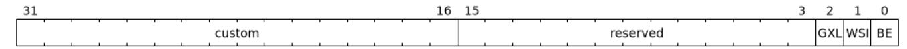

*Figure 36. Feature-control register fields*

| Bits | Field | Attribute | Description                                                                                                                                                                                              |
|------|-------|-----------|----------------------------------------------------------------------------------------------------------------------------------------------------------------------------------------------------------|
| 0    | BE    | WARL      | When 0, IOMMU accesses to memory resident data structures,<br>as specified in Table 9, and accesses to in-memory queues are<br>performed as little-endian accesses and when 1 as big-endian<br>accesses. |

| Bits  | Field    | Attribute | Description                                                                                                                  |
|-------|----------|-----------|------------------------------------------------------------------------------------------------------------------------------|
| 1     | WSI      | WARL      | When 1, IOMMU interrupts are signaled as wire-signaled<br>interrupts else they are signaled as message-signaled-interrupts.  |
| 2     | GXL      | WARL      | Controls the address-translation schemes that may be used for<br>guest physical addresses as defined in Table 2 and Table 3. |
| 15:3  | reserved | WPRI      | Reserved for standard use.                                                                                                   |
| 31:16 | custom   | WPRI      | Designated for custom use.                                                                                                   |

# <span id="page-67-0"></span>6.5. Device-directory-table pointer (**ddtp**)

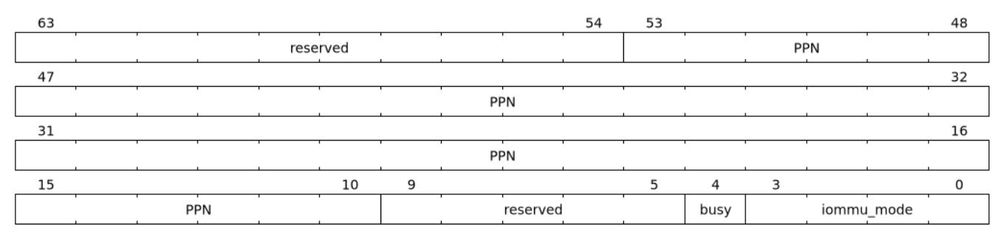

*Figure 37. Device-directory-table pointer register fields*

| Bits | Field      | Attribute |                                                                                                                                                                                                                                                                                                                                                                                                                                                                                                                                                                                                                                                                                                           |          | Description                                                                         |
|------|------------|-----------|-----------------------------------------------------------------------------------------------------------------------------------------------------------------------------------------------------------------------------------------------------------------------------------------------------------------------------------------------------------------------------------------------------------------------------------------------------------------------------------------------------------------------------------------------------------------------------------------------------------------------------------------------------------------------------------------------------------|----------|-------------------------------------------------------------------------------------|
| 3:0  | iommu_mode | WARL      | The IOMMU may be configured to be in the following modes:                                                                                                                                                                                                                                                                                                                                                                                                                                                                                                                                                                                                                                                 |          |                                                                                     |
|      |            |           | Value                                                                                                                                                                                                                                                                                                                                                                                                                                                                                                                                                                                                                                                                                                     | Name     | Description                                                                         |
|      |            |           | 0                                                                                                                                                                                                                                                                                                                                                                                                                                                                                                                                                                                                                                                                                                         | Off      | No inbound memory transactions are<br>allowed by the IOMMU.                         |
|      |            |           | 1                                                                                                                                                                                                                                                                                                                                                                                                                                                                                                                                                                                                                                                                                                         | Bare     | No translation or protection. All<br>inbound memory accesses are passed<br>through. |
|      |            |           | 2                                                                                                                                                                                                                                                                                                                                                                                                                                                                                                                                                                                                                                                                                                         | 1LVL     | One-level device-directory-table                                                    |
|      |            |           | 3                                                                                                                                                                                                                                                                                                                                                                                                                                                                                                                                                                                                                                                                                                         | 2LVL     | Two-level device-directory-table                                                    |
|      |            |           | 4                                                                                                                                                                                                                                                                                                                                                                                                                                                                                                                                                                                                                                                                                                         | 3LVL     | Three-level device-directory-table                                                  |
|      |            |           | 5-13                                                                                                                                                                                                                                                                                                                                                                                                                                                                                                                                                                                                                                                                                                      | reserved | Reserved for standard use.                                                          |
|      |            |           | 14-15                                                                                                                                                                                                                                                                                                                                                                                                                                                                                                                                                                                                                                                                                                     | custom   | Designated for custom use.                                                          |
| 4    | busy       | RO        | A write to ddtp.iommu_mode may require the IOMMU to<br>perform many operations that may not occur synchronously to<br>the write. When a write is observed by the ddtp.iommu_mode,<br>the busy bit is set to 1. When the busy bit is 1, behavior of<br>additional writes to the ddtp is UNSPECIFIED. Some<br>implementations may ignore the second write and others may<br>perform the actions determined by the second write. Software<br>must verify that the busy bit is 0 before writing to the ddtp.<br>If the busy bit reads 0 then the IOMMU has completed the<br>operations associated with the previous write to<br>ddtp.iommu_mode.<br>An IOMMU that can complete these operations synchronously |          | may hard-wire this bit to 0.                                                        |

| Bits  | Field    | Attribute | Description                                                   |
|-------|----------|-----------|---------------------------------------------------------------|
| 9:5   | reserved | WPRI      | Reserved for standard use                                     |
| 53:10 | PPN      | WARL      | Holds the PPN of the root page of the device-directory-table. |
| 63:54 | reserved | WPRI      | Reserved for standard use                                     |

The device-context is 64-bytes in size if capabilities.MSI\_FLAT is 1 else it is 32-bytes.

When the iommu\_mode is Bare or Off, the PPN field is don't-care. When in Bare mode only Untranslated requests are allowed. Translated requests, Translation request, and PCIe message transactions are unsupported.

All IOMMUs must support Off and Bare mode. An IOMMU is allowed to support a subset of directory-table levels and device-context widths. At a minimum one of the modes must be supported.

When the iommu\_mode field value is changed to Off the IOMMU guarantees that in-flight transactions, observed at the time of the write to this field, from devices connected to the IOMMU will either be processed with the configurations applicable to the old value of the iommu\_mode field or be aborted [\(Section](#page-98-3) [8.3\)](#page-98-3). It also ensures that all transactions and previous requests from devices that have already been processed by the IOMMU are committed to a global ordering point such that they can be observed by all RISC-V harts, devices, and IOMMUs in the platform. Software must not change the PPN field value when transitioning the iommu\_mode to Off.

The IOMMU behavior of writing iommu\_mode to 1LVL, 2LVL, or 3LVL, when the previous value of the iommu\_mode is not Off or Bare is UNSPECIFIED. To change DDT levels, the IOMMU must first be transitioned to Bare or Off state. The behavior resulting from changing the iommu\_mode to Bare when the previous value of the iommu\_mode was not Off is UNSPECIFIED.

When an IOMMU is transitioned to Bare or Off state, the IOMMU may retain information cached from inmemory data structures such as page tables, DDT, PDT, etc. Software must use suitable invalidation commands to invalidate cached entries.


*In RV32, only the low order 32-bits of the register (22-bit* PPN *and 4-bit* iommu\_mode*) need to be written.*

# <span id="page-68-0"></span>6.6. Command-queue base (**cqb**)

This 64-bit register (RW) holds the PPN of the root page of the command-queue and number of entries in the queue. Each command is 16 bytes.

The IOMMU behavior on writing cqb when cqcsr.busy or cqon bits are 1 is UNSPECIFIED. The software recommended sequence to change cqb is to first disable the command-queue by clearing cqen and wait for both cqcsr.busy and cqon to be 0 before changing the cqb. The status of bits 31:cqb.LOG2SZ in cqt following a write to cqb is 0 and the bits cqb.LOG2SZ-1:0 in cqt assume a valid but otherwise UNSPECIFIED value.

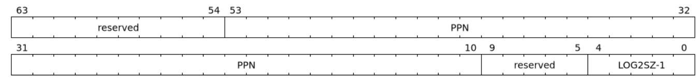

*Figure 38. Command-queue base register fields*

| Bits  | Field    | Attribute | Description                                                                                                                                                                                                                                                                                                                                                                                                                            |
|-------|----------|-----------|----------------------------------------------------------------------------------------------------------------------------------------------------------------------------------------------------------------------------------------------------------------------------------------------------------------------------------------------------------------------------------------------------------------------------------------|
| 4:0   | LOG2SZ-1 | WARL      | The LOG2SZ-1 field holds the number of entries in command-queue as a log<br>to base 2 minus 1. A value of 0 indicates a queue of 2 entries. Each IOMMU<br>command is 16-bytes. If the command-queue has 256 or fewer entries then<br>the base address of the queue is always aligned to 4-KiB. If the command<br>queue has more than 256 entries then the command-queue base address<br>LOG2SZ x 16.<br>must be naturally aligned to 2 |
| 9:5   | reserved | WPRI      | Reserved for standard use                                                                                                                                                                                                                                                                                                                                                                                                              |
| 53:10 | PPN      | WARL      | Holds the PPN of the root page of the in-memory command-queue used by<br>software to queue commands to the IOMMU. If the base address as<br>determined by PPN is not aligned as required, all entries in the queue appear<br>to an IOMMU as UNSPECIFIED and any address an IOMMU may compute<br>and use for accessing an entry in the queue is also UNSPECIFIED.                                                                       |
| 63:54 | reserved | WPRI      | Reserved for standard use                                                                                                                                                                                                                                                                                                                                                                                                              |


*In RV32, only the low order 32-bits of the register (22-bit* PPN *and 5-bit* LOG2SZ-1*) need to be written.*

# <span id="page-69-0"></span>6.7. Command-queue head (**cqh**)

This 32-bit register (RO) holds the index into the command-queue where the IOMMU will fetch the next command.

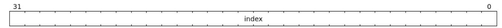

*Figure 39. Command-queue head register fields*

| Bits | Field | Attribute | Description                                                                                         |
|------|-------|-----------|-----------------------------------------------------------------------------------------------------|
| 31:0 | index | RO        | Holds the index into the command-queue from where the next command<br>will be fetched by the IOMMU. |

# <span id="page-69-1"></span>6.8. Command-queue tail (**cqt**)

This 32-bit register (RW) holds the index into the command-queue where the software queues the next command for the IOMMU.

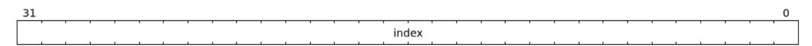

*Figure 40. Command-queue tail register fields*

| Bits | Field | Attribute | Description                                                                                                                    |
|------|-------|-----------|--------------------------------------------------------------------------------------------------------------------------------|
| 31:0 | index | WARL      | Holds the index into the command-queue where software queues the next<br>command for IOMMU. Only LOG2SZ-1:0 bits are writable. |

### <span id="page-69-2"></span>6.9. Fault queue base (**fqb**)

This 64-bit register (RW) holds the PPN of the root page of the fault-queue and number of entries in the queue. Each fault record is 32 bytes.

The IOMMU behavior on writing fqb when fqcsr.busy or fqon bits are 1 is UNSPECIFIED. The software

recommended sequence to change fqb is to first disable the fault-queue by clearing fqen and wait for both fqcsr.busy and fqon to be 0 before changing the fqb. The status of bits 31:fqb.LOG2SZ in fqh following a write to fqb is 0 and the bits fqb.LOG2SZ-1:0 in fqh assume a valid but otherwise UNSPECIFIED value.

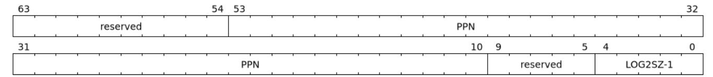

*Figure 41. Fault queue base register fields*

| Bits  | Field    | Attribute | Description                                                                                                                                                                                                                                                                                                                                                                                                                       |
|-------|----------|-----------|-----------------------------------------------------------------------------------------------------------------------------------------------------------------------------------------------------------------------------------------------------------------------------------------------------------------------------------------------------------------------------------------------------------------------------------|
| 4:0   | LOG2SZ-1 | WARL      | The LOG2SZ-1 field holds the number of entries in the fault-queue as a log<br>to-base-2 minus 1. A value of 0 indicates a queue of 2 entries. Each fault<br>record is 32-bytes. If the fault-queue has 128 or fewer entries then the base<br>address of the queue is always aligned to 4-KiB. If the fault-queue has more<br>than 128 entries then the fault-queue base address must be naturally aligned<br>LOG2SZ x 32.<br>to 2 |
| 9:5   | reserved | WPRI      | Reserved for standard use                                                                                                                                                                                                                                                                                                                                                                                                         |
| 53:10 | PPN      | WARL      | Holds the PPN of the root page of the in-memory fault-queue used by IOMMU<br>to queue fault record. If the base address as determined by PPN is not aligned<br>as required, all entries in the queue appear to an IOMMU as UNSPECIFIED<br>and any address an IOMMU may compute and use for accessing an entry in<br>the queue is also UNSPECIFIED.                                                                                |
| 63:54 | reserved | WPRI      | Reserved for standard use                                                                                                                                                                                                                                                                                                                                                                                                         |


*In RV32, only the low order 32-bits of the register (22-bit* PPN *and 5-bit* LOG2SZ-1*) need to be written.*

# <span id="page-70-0"></span>6.10. Fault queue head (**fqh**)

This 32-bit register (RW) holds the index into the fault-queue where the software will fetch the next fault record.

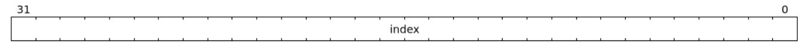

*Figure 42. Fault queue head register fields*

| Bits | Field | Attribute | Description                                                                                                                 |
|------|-------|-----------|-----------------------------------------------------------------------------------------------------------------------------|
| 31:0 | index | WARL      | Holds the index into the fault-queue from which software reads the next<br>fault record. Only LOG2SZ-1:0 bits are writable. |

# <span id="page-70-1"></span>6.11. Fault queue tail (**fqt**)

This 32-bit register (RO) holds the index into the fault-queue where the IOMMU queues the next fault record.

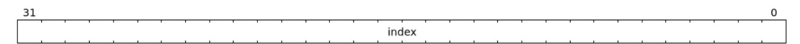

*Figure 43. Fault queue tail register fields*

| Bits | Field | Attribute | Description                                                                       |
|------|-------|-----------|-----------------------------------------------------------------------------------|
| 31:0 | index | RO        | Holds the index into the fault-queue where IOMMU writes the next fault<br>record. |

# <span id="page-71-0"></span>6.12. Page-request-queue base (**pqb**)

This 64-bit register (WARL) holds the PPN of the root page of the page-request-queue and number of entries in the queue. Each "Page Request" message is 16 bytes.

The IOMMU behavior on writing pqb when pqcsr.busy or pqon bits are 1 is UNSPECIFIED. The software recommended sequence to change pqb is to first disable the page-request-queue by clearing pqen and wait for both pqcsr.busy and pqon to be 0 before changing the pqb. The status of bits 31:pqb.LOG2SZ in pqh following a write to pqb is 0 and the bits pqb.LOG2SZ-1:0 in pqh assume a valid but otherwise UNSPECIFIED value.

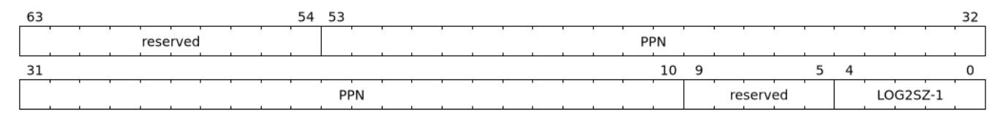

*Figure 44. Page-Request-queue base register fields*

| Bits  | Field    | Attribute | Description                                                                                                                                                                                                                                                                                                                                                                                                                                                   |
|-------|----------|-----------|---------------------------------------------------------------------------------------------------------------------------------------------------------------------------------------------------------------------------------------------------------------------------------------------------------------------------------------------------------------------------------------------------------------------------------------------------------------|
| 4:0   | LOG2SZ-1 | WARL      | The LOG2SZ-1 field holds the number of entries in the page-request-queue as<br>a log-to-base-2 minus 1. A value of 0 indicates a queue of 2 entries. Each page<br>request is 16-bytes. If the page-request-queue has 256 or fewer entries then<br>the base address of the queue is always aligned to 4-KiB. If the page-request<br>queue has more than 256 entries then the page-request-queue base address<br>LOG2SZ x 16.<br>must be naturally aligned to 2 |
| 9:5   | reserved | WPRI      | Reserved for standard use                                                                                                                                                                                                                                                                                                                                                                                                                                     |
| 53:10 | PPN      | WARL      | Holds the PPN of the root page of the in-memory page-request-queue used by<br>IOMMU to queue "Page Request" messages. If the base address as determined<br>by PPN is not aligned as required, all entries in the queue appear to an<br>IOMMU as UNSPECIFIED and any address an IOMMU may compute and use<br>for accessing an entry in the queue is also UNSPECIFIED.                                                                                          |
| 63:54 | reserved | WPRI      | Reserved for standard use                                                                                                                                                                                                                                                                                                                                                                                                                                     |


*In RV32, only the low order 32-bits of the register (22-bit* PPN *and 5-bit* LOG2SZ-1*) need to be written.*

# <span id="page-71-1"></span>6.13. Page-request-queue head (**pqh**)

This 32-bit register (RW) holds the index into the page-request-queue where software will fetch the next page-request.

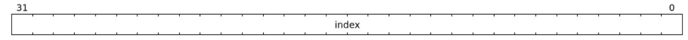

*Figure 45. Page-request-queue head register fields*

| Bits | Field | Attribute | Description                                                                                                                                  |
|------|-------|-----------|----------------------------------------------------------------------------------------------------------------------------------------------|
| 31:0 | index | WARL      | Holds the index into the page-request-queue from which software reads the<br>next "Page Request" message. Only LOG2SZ-1:0 bits are writable. |

### <span id="page-72-0"></span>6.14. Page-request-queue tail (**pqt**)

This 32-bit register (RO) holds the index into the page-request-queue where the IOMMU writes the next page-request.


*Figure 46. Page-request-queue tail register fields*

| Bits | Field | Attribute | Description                                                                                        |
|------|-------|-----------|----------------------------------------------------------------------------------------------------|
| 31:0 | index | RO        | Holds the index into the page-request-queue where IOMMU writes the next<br>"Page Request" message. |

### <span id="page-73-0"></span>6.15. Command-queue CSR (**cqcsr**)

This 32-bit register (RW) is used to control the operations and report the status of the command-queue.

| 31 |          |      | 28   | 27         |         |        | 24   |
|----|----------|------|------|------------|---------|--------|------|
|    | custom   |      |      |            | rese    | rved   |      |
| 23 |          |      |      |            | 18      | 17     | 16   |
|    |          | rese | rved |            |         | busy   | cqon |
| 15 |          |      | 12   | 11         | 10      | 9      | 8    |
|    | reserved |      |      | fence_w_ip | cmd_ill | cmd_to | cqmf |
| 7  |          |      |      |            | 2       | 1      | 0    |
|    | '        | rese | rved |            |         | cie    | cqen |

*Figure 47. Command-queue CSR register fields*

| Bits  | Field          | Attribute | Description                                                                                                                                                                                                                                                                                                                                                                                                                                                                                                                |
|-------|----------------|-----------|----------------------------------------------------------------------------------------------------------------------------------------------------------------------------------------------------------------------------------------------------------------------------------------------------------------------------------------------------------------------------------------------------------------------------------------------------------------------------------------------------------------------------|
| 0     | cqen           | RW        | The command-queue-enable bit enables the command- queue when set to 1.                                                                                                                                                                                                                                                                                                                                                                                                                                                     |
|       |                |           | Changing cqen from 0 to 1 sets the cqh register and the cqcsr bits cmd_ill<br>,cmd_to, cqmf, fence_w_ip to 0. The command-queue may take some time<br>to be active following setting the cqen to 1. During this delay the busy bit is 1.<br>When the command queue is active, the cqon bit reads 1.                                                                                                                                                                                                                        |
|       |                |           | When cqen is changed from 1 to 0, the command queue may stay active (with<br>busy asserted) until the commands already fetched from the command<br>queue are being processed and/or there are outstanding implicit loads from<br>the command-queue. When the command-queue turns off the cqon bit reads<br>0.<br>When the cqon bit reads 0, the IOMMU guarantees that no implicit memory<br>accesses to the command queue are in-flight and the command-queue will<br>not generate new implicit loads to the queue memory. |
| 1     | cie            | RW        | Command-queue-interrupt-enable bit enables generation of interrupts from<br>command-queue when set to 1.                                                                                                                                                                                                                                                                                                                                                                                                                   |
| 7:2   | reserved       | WPRI      | Reserved for standard use                                                                                                                                                                                                                                                                                                                                                                                                                                                                                                  |
| 8     | cqmf           | RW1C      | If command-queue access to fetch a command or a memory access made by a<br>command leads to a memory fault, then the command-queue-memory-fault<br>bit is set to 1, and the command-queue stalls until this bit is cleared. To re<br>enable command processing, software should clear this bit by writing 1.                                                                                                                                                                                                               |
| 9     | cmd_to         | RW1C      | If the execution of a command leads to a timeout (e.g. a command to<br>invalidate device ATC may timeout waiting for a completion), then the<br>command-queue sets the cmd_to bit and stops processing from the<br>command-queue. To re-enable command processing, software should clear<br>this bit by writing 1.                                                                                                                                                                                                         |
| 10    | cmd_ill        | RW1C      | If an illegal or unsupported command is fetched and decoded by the<br>command-queue then the command-queue sets the cmd_ill bit and stops<br>processing from the command-queue. To re-enable command processing<br>software should clear this bit by writing 1.                                                                                                                                                                                                                                                            |
| 11    | fence_w_i<br>p | RW1C      | An IOMMU that supports wire-signaled-interrupts sets the fence_w_ip bit to<br>indicate completion of an IOFENCE.C command. To re-enable interrupts on<br>IOFENCE.C completion, software should clear this bit by writing 1. This bit is<br>reserved if the IOMMU does not support wire-signaled-interrupts or wire<br>signaled-interrupts are not enabled (i.e., fctl.WSI == 0).                                                                                                                                           |
| 15:12 | reserved       | WPRI      | Reserved for standard use                                                                                                                                                                                                                                                                                                                                                                                                                                                                                                  |
| 16    | cqon           | RO        | The command-queue is active if cqon is 1.                                                                                                                                                                                                                                                                                                                                                                                                                                                                                  |

| Bits  | Field    | Attribute | Description                                                                                                                                                                                                  |
|-------|----------|-----------|--------------------------------------------------------------------------------------------------------------------------------------------------------------------------------------------------------------|
| 17    | busy     | RO        | A write to cqcsr may require the IOMMU to perform many operations that<br>may not occur synchronously to the write. When a write is observed by the<br>cqcsr, the busy bit is set to 1.                      |
|       |          |           | When the busy bit is 1, behavior of additional writes to the cqcsr is<br>UNSPECIFIED. Some implementations may ignore the second write and<br>others may perform the actions determined by the second write. |
|       |          |           | Software must verify that the busy bit is 0 before writing to the cqcsr.                                                                                                                                     |
|       |          |           | An IOMMU that can complete these operations synchronously may hard-wire<br>this bit to 0.                                                                                                                    |
| 27:18 | reserved | WPRI      | Reserved for standard use.                                                                                                                                                                                   |
| 31:28 | custom   | WPRI      | Designated for custom use.                                                                                                                                                                                   |

When cmd\_ill or cqmf is 1 in cqcsr, the cqh references the command in the CQ that caused the error. Previous commands may have completed, timed out, or their execution aborted by the IOMMU.


*If software makes the CQ operational again after a* cmd\_ill *or* cqmf *error, then software should resubmit the commands submitted since the last* IOFENCE.C *that successfully completed.*

The cmd\_to bit is set when a IOFENCE.C command detects that one or more previous commands that are specified to have timeouts have timed out but all other commands previous to the IOFENCE.C have completed. When cmd\_to is 1, cqh references the IOFENCE.C command that detected the timeout.


*Command-queue being empty does not imply that all commands fetched from the commandqueue have been completed. When the command-queue is requested to be disabled, an implementation may either complete the already fetched commands or abort execution of those commands. Software must use an* IOFENCE.C *command to wait for all previous commands to be committed, if so desired, before turning off the command-queue.*

### <span id="page-75-0"></span>6.16. Fault queue CSR (**fqcsr**)

This 32-bit register (RW) is used to control the operations and report the status of the fault-queue.

| 31 | ,      | 28   | 27 |      |      | 24   |
|----|--------|------|----|------|------|------|
|    | custom |      |    | rese | rved |      |
| 23 |        |      |    | 18   | 17   | 16   |
|    | reser  | rved |    |      | busy | fqon |
| 15 |        |      |    | 10   | 9    | 8    |
|    | reser  | rved |    |      | fqof | fqmf |
| 7  |        |      |    | 2    | 1    | 0    |
|    | reser  | rved |    |      | fie  | fqen |

*Figure 48. Fault queue CSR register fields*

| Bits  | Field    | Attribute | Description                                                                                                                                                                                                                                                                                                                                                                                                                                                                                                                                                                                                                                                                                                                                    |
|-------|----------|-----------|------------------------------------------------------------------------------------------------------------------------------------------------------------------------------------------------------------------------------------------------------------------------------------------------------------------------------------------------------------------------------------------------------------------------------------------------------------------------------------------------------------------------------------------------------------------------------------------------------------------------------------------------------------------------------------------------------------------------------------------------|
| 0     | fqen     | RW        | The fault-queue enable bit enables the fault-queue when set to 1.<br>Changing fqen from 0 to 1 sets the fqt register and the fqcsr bits fqof and<br>fqmf to 0. The fault-queue may take some time to be active following setting<br>the fqen to 1. During this delay the busy bit is 1. When the fault queue is<br>active, the fqon bit reads 1.<br>When fqen is changed from 1 to 0, the fault-queue may stay active (with<br>busy asserted) until in-flight fault-recording is completed. When the fault<br>queue is off the fqon bit reads 0.<br>When fqon reads 0, the IOMMU guarantees that there are no in-flight<br>implicit writes to the fault-queue in progress and that no new fault records<br>will be written to the fault-queue. |
| 1     | fie      | RW        | Fault queue interrupt enable bit enables generation of interrupts from fault<br>queue when set to 1.                                                                                                                                                                                                                                                                                                                                                                                                                                                                                                                                                                                                                                           |
| 7:2   | reserved | WPRI      | Reserved for standard use                                                                                                                                                                                                                                                                                                                                                                                                                                                                                                                                                                                                                                                                                                                      |
| 8     | fqmf     | RW1C      | The fqmf bit is set to 1 if the IOMMU encounters an access fault when storing<br>a fault record to the fault queue. The fault-record that was attempted to be<br>written is discarded and no more fault records are generated until software<br>clears the fqmf bit by writing 1 to the bit.                                                                                                                                                                                                                                                                                                                                                                                                                                                   |
| 9     | fqof     | RW1C      | The fault-queue-overflow bit is set to 1 if the IOMMU needs to queue a fault<br>record but the fault-queue is full (i.e., fqt == fqh - 1).<br>The fault-record is discarded and no more fault records are generated until<br>software clears fqof by writing 1 to the bit.                                                                                                                                                                                                                                                                                                                                                                                                                                                                     |
| 15:10 | reserved | WPRI      | Reserved for standard use                                                                                                                                                                                                                                                                                                                                                                                                                                                                                                                                                                                                                                                                                                                      |
| 16    | fqon     | RO        | The fault-queue is active if fqon reads 1.                                                                                                                                                                                                                                                                                                                                                                                                                                                                                                                                                                                                                                                                                                     |
| 17    | busy     | RO        | Write to fqcsr may require the IOMMU to perform many operations that<br>may not occur synchronously to the write. When a write is observed by the<br>fqcsr, the busy bit is set to 1. When the busy bit is 1, behavior of additional<br>writes to the fqcsr are UNSPECIFIED. Some implementations may ignore the<br>second write and others may perform the actions determined by the second<br>write.<br>Software should ensure that the busy bit is 0 before writing to the fqcsr.<br>An IOMMU that can complete controls synchronously may hard-wire this bit                                                                                                                                                                               |

| Bits  | Field    | Attribute | Description                |
|-------|----------|-----------|----------------------------|
| 27:18 | reserved | WPRI      | Reserved for standard use. |
| 31:28 | custom   | WPRI      | Designated for custom use. |

# <span id="page-76-0"></span>6.17. Page-request-queue CSR (**pqcsr**)

This 32-bit register (RW) is used to control the operations and report the status of the page-request-queue.

| 31 |            | 28   | 27 |      |      | 24   |
|----|------------|------|----|------|------|------|
|    | Custom use |      |    | rese | rved |      |
| 23 |            |      |    | 18   | 17   | 16   |
|    | rese       | rved |    |      | busy | pqon |
| 15 |            |      |    | 10   | 9    | 8    |
|    | rese       | rved |    |      | pqof | pqmf |
| 7  |            |      |    | 2    | 1    | 0    |
|    | reser      | rved |    | ,    | pie  | pqen |

*Figure 49. Page-request-queue CSR register fields*

| Bits | Field    | Attribute | Description                                                                                                                                                                                                                                                                                                                                                                                                                                                                                                                                                                                                                                                                                                                                                                                                                                                                                                                                                       |
|------|----------|-----------|-------------------------------------------------------------------------------------------------------------------------------------------------------------------------------------------------------------------------------------------------------------------------------------------------------------------------------------------------------------------------------------------------------------------------------------------------------------------------------------------------------------------------------------------------------------------------------------------------------------------------------------------------------------------------------------------------------------------------------------------------------------------------------------------------------------------------------------------------------------------------------------------------------------------------------------------------------------------|
| 0    | pqen     | RW        | The page-request-enable bit enables the page-request-queue when set to 1.<br>Changing pqen from 0 to 1, sets the pqt register and the pqcsr bits pqmf and<br>pqof to 0. The page-request-queue may take some time to be active following<br>setting the pqen to 1. During this delay the busy bit is 1. When the page<br>request-queue is active, the pqon bit reads 1.<br>When pqen is changed from 1 to 0, the page-request-queue may stay active<br>(with busy asserted) until in-flight page-request writes are completed. When<br>the page-request-queue turns off, the pqon bit reads 0.<br>When pqon reads 0, the IOMMU guarantees that there are no older in-flight<br>implicit writes to the queue memory and no further implicit writes will be<br>generated to the queue memory.<br>The IOMMU may respond to "Page Request" messages received when page<br>request-queue is off or in the process of being turned off, as specified in<br>Section 3.7. |
| 1    | pie      | RW        | The page-request-queue-interrupt-enable bit when set to 1, enables generation<br>of interrupts from page-request-queue.                                                                                                                                                                                                                                                                                                                                                                                                                                                                                                                                                                                                                                                                                                                                                                                                                                           |
| 7:2  | reserved | WPRI      | Reserved for standard use                                                                                                                                                                                                                                                                                                                                                                                                                                                                                                                                                                                                                                                                                                                                                                                                                                                                                                                                         |
| 8    | pqmf     | RW1C      | The pqmf bit is set to 1 if the IOMMU encounters an access fault when storing<br>a "Page Request" message to the page-request-queue.<br>The "Page Request" message that caused the pqmf or pqof error and all<br>subsequent "Page Request" messages are discarded until software clears the<br>pqof and/or pqmf bits by writing 1 to it.<br>The IOMMU may respond to "Page Request" messages that caused the pqof<br>or pqmf bit to be set and all subsequent "Page Request" messages received<br>while these bits are 1 as specified in Section 3.7.                                                                                                                                                                                                                                                                                                                                                                                                             |

| Bits  | Field    | Attribute | Description                                                                                                                                                                                                                                                                                                                                                                                                                                                                                                                                                                                                              |
|-------|----------|-----------|--------------------------------------------------------------------------------------------------------------------------------------------------------------------------------------------------------------------------------------------------------------------------------------------------------------------------------------------------------------------------------------------------------------------------------------------------------------------------------------------------------------------------------------------------------------------------------------------------------------------------|
| 9     | pqof     | RW1C      | The page-request-queue-overflow bit is set to 1 if the page-request queue<br>overflows i.e. IOMMU needs to queue a "Page Request" message but the page<br>request queue is full (i.e., pqt == pqh - 1).<br>The "Page Request" message that caused the pqmf or pqof error and all<br>subsequent "Page Request" messages are discarded until software clears the<br>pqof and/or pqmf bits by writing 1 to it.<br>The IOMMU may respond to "Page Request" messages that caused the pqof<br>or pqmf bit to be set and all subsequent "Page Request" messages received<br>while these bits are 1 as specified in Section 3.7. |
| 15:10 | reserved | WPRI      | Reserved for standard use                                                                                                                                                                                                                                                                                                                                                                                                                                                                                                                                                                                                |
| 16    | pqon     | RO        | The page-request is active when pqon reads 1.                                                                                                                                                                                                                                                                                                                                                                                                                                                                                                                                                                            |
| 17    | busy     | RO        | A write to pqcsr may require the IOMMU to perform many operations that<br>may not occur synchronously to the write. When a write is observed by the<br>pqcsr, the busy bit is set to 1.<br>When the busy bit is 1, behavior of additional writes to the pqcsr are<br>UNSPECIFIED. Some implementations may ignore the second write and<br>others may perform the actions determined by the second write. Software<br>should ensure that the busy bit is 0 before writing to the pqcsr.<br>An IOMMU that can complete controls synchronously may hard-wire this bit<br>to 0                                               |
| 27:18 | reserved | WPRI      | Reserved for standard use                                                                                                                                                                                                                                                                                                                                                                                                                                                                                                                                                                                                |
| 31:28 | custom   | WPRI      | Designated for custom use.                                                                                                                                                                                                                                                                                                                                                                                                                                                                                                                                                                                               |

# <span id="page-77-0"></span>6.18. Interrupt pending status register (**ipsr**)

This 32-bit register (RW1C) reports the pending interrupts which require software service. Each interruptpending bit in the register corresponds to a interrupt source in the IOMMU. The interrupt-pending bit in the register once set to 1 stays 1 till software clears that interrupt-pending bit by writing 1 to clear it.

When fctl.WSI is 1, the interrupt-pending bit drives the wire selected by the corresponding icvec field to signal an interrupt.

When fctl.WSI is 0, the IOMMU signals interrupts using messages. MSI have edge semantics and an interrupt message is generated when an interrupt-pending bit transitions from 0 to 1. The address and data for the message are obtained from the msi\_cfg\_tbl entry selected by the icvec field corresponding to the interrupt-pending bit.

<span id="page-77-1"></span>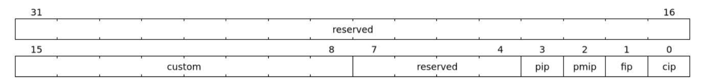

*Figure 50. Interrupt pending status register fields*

*Table 16. Interrupt pending status register fields*

| Bits  | Field    | Attribute | Description                                                                                                                                                                                                                |
|-------|----------|-----------|----------------------------------------------------------------------------------------------------------------------------------------------------------------------------------------------------------------------------|
| 0     | cip      | RW1C      | The command-queue-interrupt-pending bit is set to 1 if cqcsr.cie is 1 and<br>any of the following are true:<br>⚫<br>cqcsr.fence_w_ip is 1.<br>⚫<br>cqcsr.cmd_ill is 1.<br>⚫<br>cqcsr.cmd_to is 1.<br>⚫<br>cqcsr.cqmf is 1. |
| 1     | fip      | RW1C      | The fault-queue-interrupt-pending bit is set to 1 if fqcsr.fie is 1 and any of<br>the following are true:<br>⚫<br>fqcsr.fqof is 1.<br>⚫<br>fqcsr.fqmf is 1.<br>⚫<br>A new record is produced in the FQ.                    |
| 2     | pmip     | RW1C      | The performance-monitoring-interrupt-pending is set to 1 when OF bit in<br>iohpmcycles or in any of the iohpmctr1-31 registers transitions from 0 to<br>1.                                                                 |
| 3     | pip      | RW1C      | The page-request-queue-interrupt-pending is set to 1 if pqcsr.pie is 1 and<br>any of the following are true:<br>⚫<br>pqcsr.pqof is 1.<br>⚫<br>pqcsr.pqmf is 1.<br>⚫<br>A new message is produced in the PQ.                |
| 7:4   | reserved | WPRI      | Reserved for standard use.                                                                                                                                                                                                 |
| 15:8  | custom   | WPRI      | Designated for custom use.                                                                                                                                                                                                 |
| 31:16 | reserved | WPRI      | Reserved for standard use                                                                                                                                                                                                  |

If a bit in ipsr is 1 then a write of 1 to the bit transitions the bit from 1→0. If the conditions to set that bit are still present (See [Table 16\)](#page-77-1) or if they occur after the bit is cleared then that bit transitions again from 0→1.

# <span id="page-79-0"></span>6.19. Performance-monitoring counter overflow status (**iocountovf**)

The performance-monitoring counter overflow status is a 32-bit read-only register that contains shadow copies of the OF bits in the iohpmevt1-31 registers - where iocountovf bit X corresponds to iohpmevtX and bit 0 corresponds to the OF bit of iohpmcycles.

This register enables overflow interrupt handler software to quickly and easily determine which counter(s) have overflowed.

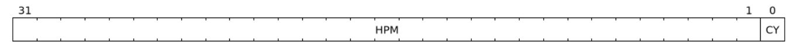

*Figure 51. Performance-monitoring counter overflow status register fields*

| Bits | Field | Attribute | Description                 |
|------|-------|-----------|-----------------------------|
| 0    | CY    | RO        | Shadow of iohpmcycles.OF    |
| 31:1 | HPM   | RO        | Shadow of iohpmevt[1-31].OF |

# <span id="page-79-1"></span>6.20. Performance-monitoring counter inhibits (**iocountinh**)

The performance-monitoring counter inhibits is a 32-bit WARL register that contains bits to inhibit the corresponding counters from counting. Bit X when set inhibits counting in iohpmctrX and bit 0 inhibits counting in iohpmcycles.

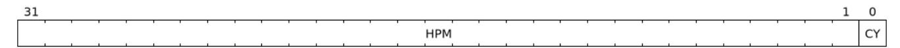

*Figure 52. Performance-monitoring counter inhibits register fields*

| Bits | Field | Attribute | Description                                                           |
|------|-------|-----------|-----------------------------------------------------------------------|
| 0    | CY    | RW        | When set, iohpmcycles counter is inhibited from counting.             |
| 31:1 | HPM   | WARL      | When bit X is set, then counting of events in iohpmctrX is inhibited. |

*When the* iohpmcycles *counter is not needed, it is desirable to conditionally inhibit it to reduce energy consumption. Providing a single register to inhibit all counters allows a) one or more counters to be atomically programmed with events to count b) one or more counters to be sampled atomically.*

*To initialize an event counter or the cycles counter to a desired value, it should be first inhibited if it is enabled to count. This measure ensures that it does not count during the update process. The inhibition should be removed after the register has been programmed with the desired value.*

# <span id="page-80-0"></span>6.21. Performance-monitoring cycles counter (**iohpmcycles**)

This 64-bit register is a free running clock cycle counter. There is no associated iohpmevt0.

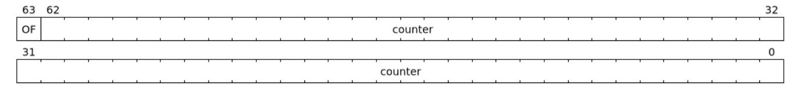

*Figure 53. Performance-monitoring cycles counter register fields*

| Bits | Field   | Attribute | Description           |  |  |
|------|---------|-----------|-----------------------|--|--|
| 62:0 | counter | WARL      | Cycles counter value. |  |  |
| 63   | OF      | RW        | Overflow              |  |  |

The OF bit is set when the iohpmcycles counter overflows, and remains set until cleared by software. Since iohpmcycles value is an unsigned value, overflow is defined as unsigned overflow. Note that there is no loss of information after an overflow since the counter wraps around and keeps counting while the sticky OF bit remains set.

If the iohpmcycles counter overflows when the OF bit is zero, then a HPM Counter Overflow interrupt is generated by setting ipsr.pmip bit to 1. If the OF bit is already one, then no interrupt request is generated. Consequently the OF bit also functions as a count overflow interrupt disable for the iohpmcycles.

# <span id="page-80-1"></span>6.22. Performance-monitoring event counters (**iohpmctr1-31**)

These registers are 64-bit WARL counter registers.

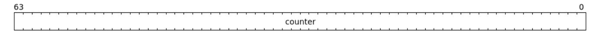

*Figure 54. Performance-monitoring event counters register fields*

| Bits | Field   | Attribute | Description          |
|------|---------|-----------|----------------------|
| 63:0 | counter | WARL      | Event counter value. |

# <span id="page-80-2"></span>6.23. Performance-monitoring event selectors (**iohpmevt1-31**)

These performance-monitoring event registers are 64-bit RW registers. When a transaction processed by the IOMMU causes an event that is programmed to count in a counter then the counter is incremented. In addition to matching events, the event selector may be programmed with additional filters based on device\_id, process\_id, GSCID, and PSCID such that the counter is incremented conditionally based on the transaction matching these additional filters. When such device\_id based filtering is used, the match may be configured to be a precise match or a partial match. A partial match allows transactions with a range of IDs to be counted by the counter.

| 63    | 62    | 61      | 60      | 59      |           | 56 |
|-------|-------|---------|---------|---------|-----------|----|
| OF    | IDT   | DV_GSCV | PV_PSCV |         | DID_GSCID |    |
| 55    |       |         |         |         |           | 48 |
| ·     |       |         | DID_C   | SCID    | <u>'</u>  |    |
| 47    |       |         |         |         | ,         | 40 |
|       |       |         | DID_C   | SCID    | ,         |    |
| 39    |       |         | 36      | 35      |           | 32 |
|       | DID_C | SCID    |         |         | PID_PSCID |    |
| 31    |       |         |         |         | ,         | 24 |
|       |       |         | PID_P   | SCID    |           |    |
| 23    |       |         |         | -       | ,         | 16 |
|       |       |         | PID_P   | SCID    | ,         |    |
| 15    | 14    |         |         |         |           | 8  |
| DMASK |       |         |         | eventID |           |    |
| 7     |       |         |         | ,       | ,         | 0  |
|       |       |         | eve     | ntID    | T         | ,  |

*Figure 55. Performance-monitoring event selector register fields*

| Bits  | Field     | Attribute | Description                                                                                                                                                                                                                                                                                                      |
|-------|-----------|-----------|------------------------------------------------------------------------------------------------------------------------------------------------------------------------------------------------------------------------------------------------------------------------------------------------------------------|
| 14:0  | eventID   | WARL      | Indicates the event to count. A value of 0 indicates no events are<br>counted.<br>Encodings 1 to 16383 are reserved for standard events defined in<br>the Table 19.<br>Encodings 16384 to 32767 are for designated for custom use.<br>When eventID is changed, including to 0, the counter retains<br>its value. |
| 15    | DMASK     | RW        | When set to 1, partial matching of the DID_GSCID is performed<br>for the transaction. The lower bits of the DID_GSCID all the way<br>to the first low order 0 bit (including the 0 bit position itself) are<br>masked.                                                                                           |
| 35:16 | PID_PSCID | RW        | process_id if IDT is 0, PSCID if IDT is 1                                                                                                                                                                                                                                                                        |
| 59:36 | DID_GSCID | RW        | device_id if IDT is 0, GSCID if IDT is 1.                                                                                                                                                                                                                                                                        |
| 60    | PV_PSCV   | RW        | If set, only transactions with matching process_id or PSCID<br>(based on the Filter ID Type) are counted.                                                                                                                                                                                                        |
| 61    | DV_GSCV   | RW        | If set, only transactions with matching device_id or GSCID<br>(based on the Filter ID Type) are counted.                                                                                                                                                                                                         |
| 62    | IDT       | RW        | Filter ID Type: This field indicates the type of ID to filter on.<br>When 0, the DID_GSCID field holds a device_id and the<br>PID_PSCID field holds a process_id. When 1, the DID_GSCID<br>field holds a GSCID and PID_PSCID field holds a PSCID.                                                                |
| 63    | OF        | RW        | Overflow status or Interrupt disable                                                                                                                                                                                                                                                                             |

The table below summarizes the filtering option for events that support filtering by IDs.

*Table 17. filtering options*

| IDT | DV_GSCV | PV_PSCV | Operation                                                                                         |
|-----|---------|---------|---------------------------------------------------------------------------------------------------|
| 0/1 | 0       | 0       | Counter increments. No ID based filtering.                                                        |
| 0   | 0       | 1       | If the transaction has a valid process_id, counter increments if<br>process_id matches PID_PSCID. |
| 0   | 1       | 0       | Counter increments if device_id matches DID_GSCID.                                                |

| IDT | DV_GSCV | PV_PSCV | Operation                                                                                                                         |
|-----|---------|---------|-----------------------------------------------------------------------------------------------------------------------------------|
| 0   | 1       | 1       | If the transaction has a valid process_id, counter increments if<br>device_id matches DID_GSCID and process_id matches PID_PSCID. |
| 1   | 0       | 1       | If the transaction has a valid PSCID, counter increments if the PSCID of<br>that process matches PID_PSCID.                       |
| 1   | 1       | 0       | Counter increments if GSCID is valid and matches DID_GSCID.                                                                       |
| 1   | 1       | 1       | Counter increments if GSCID is valid and matches DID_GSCID and if<br>PSCID is valid and matches PID_PSCID.                        |

When filtering by device\_id or GSCID is selected and the event supports ID based filtering, the DMASK field can be used to configure a partial match. When DMASK is set to 1, partial matching of the DID\_GSCID is performed for the transaction. The lower bits of the DID\_GSCID all the way to the first low order 0 bit (including the 0 bit position itself) are masked.

The following example illustrates the use of DMASK and filtering by device\_id.

*Table 18.* DMASK *with* IDT *set to* device\_id *based filtering*

| DMASK | DID_GSCID                  | Comment                       |
|-------|----------------------------|-------------------------------|
| 0     | yyyyyyyy yyyyyyyy yyyyyyyy | One specific seg:bus:dev:func |
| 1     | yyyyyyyy yyyyyyyy yyyyy011 | seg:bus:dev - any func        |
| 1     | yyyyyyyy yyyyyyyy 01111111 | seg:bus - any dev:func        |
| 1     | yyyyyyyy 01111111 11111111 | seg - any bus:dev:func        |

The following table lists the standard events that can be counted:

*Table 19. Standard Events list*

<span id="page-82-0"></span>

| eventID   | Event counted                        | IDT settings supported |  |  |  |  |
|-----------|--------------------------------------|------------------------|--|--|--|--|
| 0         | Do not count                         |                        |  |  |  |  |
| 1         | Untranslated requests                | 0                      |  |  |  |  |
| 2         | Translated requests                  | 0                      |  |  |  |  |
| 3         | ATS Translation requests             | 0                      |  |  |  |  |
| 4         | TLB miss                             | 0/1                    |  |  |  |  |
| 5         | Device Directory Walks               | 0                      |  |  |  |  |
| 6         | Process Directory Walks              | 0                      |  |  |  |  |
| 7         | First-stage Page Table Walks         | 0/1                    |  |  |  |  |
| 8         | Second-stage Page Table Walks<br>0/1 |                        |  |  |  |  |
| 9 - 16383 | reserved for future standard         | -                      |  |  |  |  |

When the programmed IDT setting is not supported for an event then the associated counter does not increment.

The OF bit is set when the corresponding iohpmctr1-31 counter overflows, and remains set until cleared by software. Since iohpmctr1-31 values are unsigned values, overflow is defined as unsigned overflow. Note that there is no loss of information after an overflow since the counter wraps around and keeps counting while the sticky OF bit remains set.

If a iohpmctr1-31 counter overflows when the associated OF bit is zero, then a HPM Counter Overflow

interrupt is generated by setting ipsr.pmip bit to 1. If the OF bit is already one, then no interrupt request is generated. Consequently the OF bit also functions as a count overflow interrupt disable for the associated iohpmctr1-31.


*There are not separate overflow status and overflow interrupt enable bits. In practice, enabling overflow interrupt generation (by clearing the* OF *bit) is done in conjunction with initializing the counter to a starting value. Once a counter has overflowed, it and the* OF *bit must be reinitialized before another overflow interrupt can be generated.*

*In RV32, memory-mapped writes to* iohpmevt1-31 *modify only one 32-bit part of the register. The following sequence may be used to update the register without counting events spuriously due to the intermediate value of the register:*


- ⚫ *Write the low order 32-bits to set* eventID *to 0.*
- ⚫ *Write the high order 32-bits with the new desired values.*
- ⚫ *Write the low order 32-bits the new desired values, including that of the* eventID *field.*

*Alternatively, the counter may first be inhibited such that no events count during the update and the inhibit removed after the register has been programmed with the desired value.*


*If* capabilities.HPM *is 1 then a minimum of one programmable event counter besides the cycles counter is required to comply with this specification. One counter may be used in a time multiplexed manner to sample events but such analysis may take longer to complete. The IOMMU, unlike the CPU MMU, services multiple streams of IO and the HPM may be used by a performance analyst to analyze one or more of those streams concurrently. Typically, a performance analyst may require four programmable counters to count events for an IO stream. To support concurrent analysis of at least two streams of IO it is recommended to support seven programmable counters.*

# <span id="page-83-0"></span>6.24. Translation-request IOVA (**tr\_req\_iova**)

The tr\_req\_iova is a 64-bit register used to implement a translation-request interface for debug. This register is present when capabilities.DBG == 1.

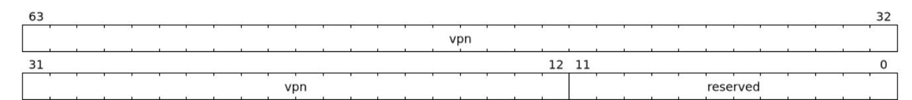

*Figure 56. Translation-request IOVA register fields*

| Bits  | Field    | Attribute | Description                  |  |  |
|-------|----------|-----------|------------------------------|--|--|
| 11:0  | reserved | WPRI      | Reserved for standard use    |  |  |
| 63:12 | vpn      | WARL      | The IOVA virtual page number |  |  |

# <span id="page-83-1"></span>6.25. Translation-request control (**tr\_req\_ctl**)

The tr\_req\_ctl is a 64-bit WARL register used to implement a translation-request interface for debug. This register is present when capabilities.DBG == 1.

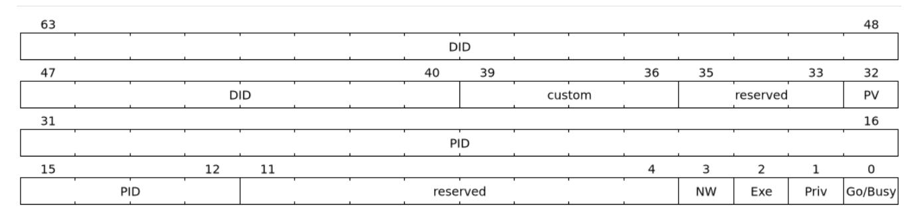

*Figure 57. Translation-request control register fields*

| Bits  | Field    | Attribute | Description                                                                                                                                                                                                                                                                                                      |  |
|-------|----------|-----------|------------------------------------------------------------------------------------------------------------------------------------------------------------------------------------------------------------------------------------------------------------------------------------------------------------------|--|
| 0     | Go/Busy  | RW1S      | This bit is set to indicate a valid request has been setup in the<br>tr_req_iova/tr_req_ctl registers for the IOMMU to translate.<br>The IOMMU indicates completion of the requested translation by clearing<br>this bit to 0. On completion, the results of the translation are in the<br>tr_response register. |  |
| 1     | Priv     | WARL      | If set to 1, Privileged Mode access is requested else no Privileged Mode access<br>is not requested.                                                                                                                                                                                                             |  |
| 2     | Exe      | WARL      | If set to 1, execute permission is requested else execute permission is not<br>requested.                                                                                                                                                                                                                        |  |
| 3     | NW       | WARL      | If set to 1, read permission is requested. If set to 0, both read and write<br>permissions are requested.                                                                                                                                                                                                        |  |
| 11:4  | reserved | WPRI      | Reserved for standard use                                                                                                                                                                                                                                                                                        |  |
| 31:12 | PID      | WARL      | If PV is 1, this field provides the process_id input for this translation<br>request. If PV is 0 then this field is not used.                                                                                                                                                                                    |  |
| 32    | PV       | WARL      | If set to 1, the PID field of the register is valid and provides the process_id<br>for this translation request. If set to 0 then the PID field is not used and a<br>process_id is not valid for this translation request.                                                                                       |  |
| 35:33 | reserved | WPRI      | Reserved for standard use.                                                                                                                                                                                                                                                                                       |  |
| 39:36 | custom   | WPRI      | Designated for custom use.                                                                                                                                                                                                                                                                                       |  |
| 63:40 | DID      | WARL      | This field provides the device_id for this translation request.                                                                                                                                                                                                                                                  |  |


*In RV32, the high half of the register should be written first, followed by the low half, which includes the* Go/Busy *bit, to initiate a translation.*

# <span id="page-84-0"></span>6.26. Translation-response (**tr\_response**)

The tr\_response is a 64-bit RO register used to hold the results of a translation requested using the translation-request interface. This register is present when capabilities.DBG == 1.

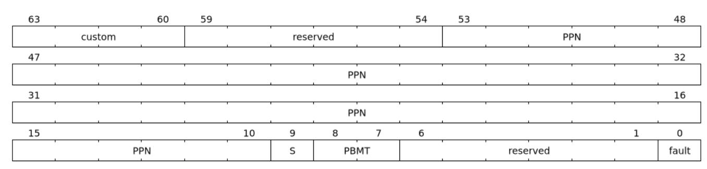

*Figure 58. Translation-response register fields*

| Bits  | Field    | Attribute | Description                                                                                                                                                                                                                                                                                                                                                                                                                                                                                                                                                                                                                                                         |                                                         |  |         |  |
|-------|----------|-----------|---------------------------------------------------------------------------------------------------------------------------------------------------------------------------------------------------------------------------------------------------------------------------------------------------------------------------------------------------------------------------------------------------------------------------------------------------------------------------------------------------------------------------------------------------------------------------------------------------------------------------------------------------------------------|---------------------------------------------------------|--|---------|--|
| 0     | fault    | RO        | If the process to translate the IOVA detects a fault then the fault field is set<br>to 1. The detected fault may be reported through the fault-queue.                                                                                                                                                                                                                                                                                                                                                                                                                                                                                                               |                                                         |  |         |  |
| 6:1   | reserved | RO        | Reserved for standard use                                                                                                                                                                                                                                                                                                                                                                                                                                                                                                                                                                                                                                           |                                                         |  |         |  |
| 8:7   | PBMT     | RO        | Memory type determined for the translation using the PBMT fields in the<br>first-stage and/or the second-stage page tables used for the translation. This<br>value of this field is UNSPECIFIED if the fault field is 1.                                                                                                                                                                                                                                                                                                                                                                                                                                            |                                                         |  |         |  |
| 9     | S        | RO        | Translation range size field, when set to 1 indicates that the translation applies<br>to a range that is larger than 4 KiB and the size of the translation range is<br>encoded in the PPN field. The value of this field is UNSPECIFIED if the fault<br>field is 1.                                                                                                                                                                                                                                                                                                                                                                                                 |                                                         |  |         |  |
| 53:10 | PPN      | RO        | If the fault bit is 0, then this field provides the PPN determined as a result<br>of translating the vpn in tr_req_iova.<br>If the fault bit is 1, then the value of this field is UNSPECIFIED.<br>If the S bit is 0, then the size of the translation is 4 KiB - a page.<br>If the S bit is 1, then the translation resulted in a superpage, and the size of the<br>superpage is encoded in the PPN itself. If scanning from bit position 0 to bit<br>position 43, the first bit with a value of 0 at position X, then the superpage size<br>X+1 * 4 KiB.<br>is 2<br>If X is not 0, then all bits at position 0 through X-1 are each encoded with a<br>value of 1. |                                                         |  |         |  |
|       |          |           |                                                                                                                                                                                                                                                                                                                                                                                                                                                                                                                                                                                                                                                                     | Table 20. Example of encoding of super page size in PPN |  |         |  |
|       |          |           | Size<br>PPN<br>S                                                                                                                                                                                                                                                                                                                                                                                                                                                                                                                                                                                                                                                    |                                                         |  |         |  |
|       |          |           | 0 4 KiB<br>yyyyyyyy yyyy yyyy<br>1 64 KiB<br>yyyyyyyy yyyy 0111<br>1 2 MiB<br>yyyyyyy0 1111 1111                                                                                                                                                                                                                                                                                                                                                                                                                                                                                                                                                                    |                                                         |  |         |  |
|       |          |           |                                                                                                                                                                                                                                                                                                                                                                                                                                                                                                                                                                                                                                                                     |                                                         |  |         |  |
|       |          |           |                                                                                                                                                                                                                                                                                                                                                                                                                                                                                                                                                                                                                                                                     |                                                         |  |         |  |
|       |          |           |                                                                                                                                                                                                                                                                                                                                                                                                                                                                                                                                                                                                                                                                     | yyyyyy01 1111 1111                                      |  | 1 4 MiB |  |
| 59:54 | reserved | RO        | Reserved for standard use.                                                                                                                                                                                                                                                                                                                                                                                                                                                                                                                                                                                                                                          |                                                         |  |         |  |
| 63:60 | custom   | RO        | Designated for custom use.                                                                                                                                                                                                                                                                                                                                                                                                                                                                                                                                                                                                                                          |                                                         |  |         |  |


*An IOMMU implementation is not required to report a superpage translation or support reporting all possible superpage sizes. An implementation is allowed to report a 4 KiB translation corresponding to the requested* vpn *or report a translation size that is smaller than the superpage size configured in the page tables.*

### <span id="page-85-0"></span>6.27. IOMMU QoS ID (**iommu\_qosid**)

The iommu\_qosid register fields are defined as follows:

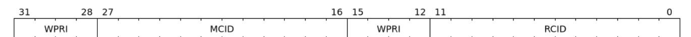

*Figure 59.* iommu\_qosid *register fields*

| Bits  | Field    | Attribute | Description                        |
|-------|----------|-----------|------------------------------------|
| 11:0  | RCID     | WARL      | RCID for IOMMU-initiated requests. |
| 15:12 | reserved | WPRI      | Reserved for standard use.         |
| 27:16 | MCID     | WARL      | MCID for IOMMU-initiated requests. |
| 31:28 | reserved | WPRI      | Reserved for standard use.         |

IOMMU-initiated requests for accessing the following data structures use the value programmed in the RCID and MCID fields of the iommu\_qosid register.

- ⚫ Device directory table (DDT)
- ⚫ Fault queue (FQ)
- ⚫ Command queue (CQ)
- ⚫ Page-request queue (PQ)
- ⚫ IOMMU-initiated MSI (Message-signaled interrupts)

When ddtp.iommu\_mode == Bare, all device-originated requests are associated with the QoS IDs configured in the iommu\_qosid register.

# <span id="page-86-0"></span>6.28. Interrupt-cause-to-vector register (**icvec**)

Interrupt-cause-to-vector register maps a cause to a vector. All causes can be mapped to the same vector or a cause can be given a unique vector.

The vector is used:

- 1. By an IOMMU that generates interrupts as MSIs, to index into MSI configuration table (msi\_cfg\_tbl) to determine the MSI to generate. An IOMMU is capable of generating interrupts as a MSI if capabilities.IGS==MSI or if capabilities.IGS==BOTH. When capabilities.IGS==BOTH the IOMMU may be configured to generate interrupts as MSI by setting fctl.WSI to 0.
- 2. By an IOMMU that generates WSI, to determine the wire to signal the interrupt. An IOMMU is capable of generating wire-signaled- interrupts if capabilities.IGS==WSI or if capabilities.IGS==BOTH. When capabilities.IGS==BOTH the IOMMU may be configured to generate wire-signaled- interrupts by setting fctl.WSI to 1.

If an implementation only supports a single vector then all bits of this register may be hardwired to 0 (WARL). Likewise if only two vectors are supported then only bit 0 for each cause could be writable.

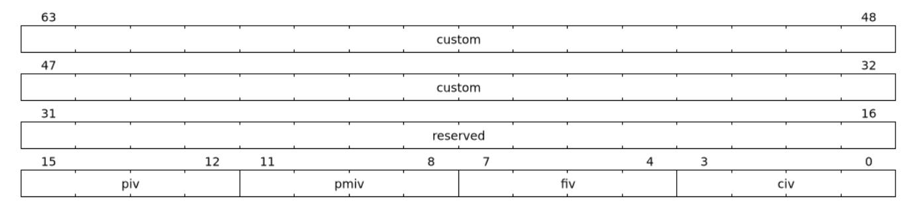

*Figure 60. Interrupt-cause-to-vector register fields*

| Bits | Field | Attribute | Description                                                                                               |
|------|-------|-----------|-----------------------------------------------------------------------------------------------------------|
| 3:0  | civ   | WARL      | The command-queue-interrupt-vector (civ) is the vector number assigned to<br>the command-queue-interrupt. |

| Bits  | Field    | Attribute | Description                                                                                                                  |
|-------|----------|-----------|------------------------------------------------------------------------------------------------------------------------------|
| 7:4   | fiv      | WARL      | The fault-queue-interrupt-vector (fiv) is the vector number assigned to the<br>fault-queue-interrupt.                        |
| 11:8  | pmiv     | WARL      | The performance-monitoring-interrupt-vector (pmiv) is the vector number<br>assigned to the performance-monitoring-interrupt. |
| 15:12 | piv      | WARL      | The page-request-queue-interrupt-vector (piv) is the vector number assigned<br>to the page-request-queue-interrupt.          |
| 31:16 | reserved | WPRI      | Reserved for standard use.                                                                                                   |
| 63:32 | custom   | WPRI      | Designated for custom use.                                                                                                   |

# <span id="page-87-0"></span>6.29. MSI configuration table (**msi\_cfg\_tbl**)

An IOMMU that supports generating IOMMU-originated interrupts (i.e., capabilities.IGS == MSI or capabilities.IGS == BOTH) as MSIs implements a MSI configuration table that is indexed by the vector from icvec to determine a MSI table entry. Each MSI table entry for interrupt vector x has three registers msi\_addr\_x, msi\_data\_x, and msi\_vec\_ctl\_x. These registers are hardwired to 0 if capabilities.IGS == WSI.

If an access fault is detected on a MSI write using msi\_addr\_x, then the IOMMU reports a "IOMMU MSI write access fault" (cause 273) fault, with TTYP set to 0 and iotval set to the value of msi\_addr\_x.

*Table 21. MSI configuration table structure*

| bit 63                   |                          | bit 0 Byte Offset |  |  |  |  |  |  |
|--------------------------|--------------------------|-------------------|--|--|--|--|--|--|
| Entry 0: Message address |                          |                   |  |  |  |  |  |  |
| Entry 0: Vector Control  | Entry 0: Message Data    | +008h             |  |  |  |  |  |  |
|                          | Entry 1: Message address |                   |  |  |  |  |  |  |
| Entry 1: Vector Control  | Entry 1: Message Data    | +018h             |  |  |  |  |  |  |
|                          | …                        | +020h             |  |  |  |  |  |  |

| 63 |          |    | 56 | 55 |  |   |   |    |     |   |   |     |   |  |   |   |  |   |   | 32 |
|----|----------|----|----|----|--|---|---|----|-----|---|---|-----|---|--|---|---|--|---|---|----|
|    | reserved | į. |    |    |  |   |   |    |     |   |   | ADD | R |  |   |   |  |   |   |    |
| 31 |          |    |    |    |  | • | • | •  |     | • | • |     |   |  | • | • |  | 2 | 1 | 0  |
|    |          |    |    |    |  |   |   | AI | DDR |   |   |     |   |  |   |   |  |   |   | 0  |

*Figure 61. Message address register fields*

| Bits  | Field    | Attribute | Description                           |
|-------|----------|-----------|---------------------------------------|
| 1:0   | 0        | RO        | Fixed to 0                            |
| 55:2  | ADDR     | WARL      | Holds the 4-byte aligned MSI address. |
| 63:56 | reserved | WPRI      | Reserved for standard use.            |

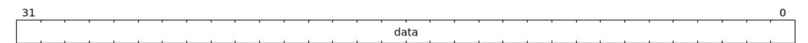

*Figure 62. Message data register fields*

| Bits | Field | Attribute | Description        |
|------|-------|-----------|--------------------|
| 31:0 | data  | WARL      | Holds the MSI data |

| 31 |      |      |      |      |      |      |               |    |      |     |      |      |      |  |       |                   |      | 1 | 0 |        |
|----|------|------|------|------|------|------|---------------|----|------|-----|------|------|------|--|-------|-------------------|------|---|---|--------|
|    | <br> | <br> | <br> | <br> | <br> | <br> | $\overline{}$ |    | -    |     | <br> | <br> | <br> |  | <br>_ | <br>$\overline{}$ | <br> |   |   | $\neg$ |
|    |      |      |      |      |      |      |               | re | eser | ved |      |      |      |  |       |                   |      |   | М |        |
|    | <br> | <br> | <br> | <br> | <br> | <br> |               |    |      |     | <br> | <br> | <br> |  | <br>  | <br>              | <br> |   |   |        |

*Figure 63. Vector control register fields*

| Bits | Field    | Attribute | Description                                                                                                                                                                                                                                          |
|------|----------|-----------|------------------------------------------------------------------------------------------------------------------------------------------------------------------------------------------------------------------------------------------------------|
| 0    | M        | RW        | When the mask bit M is 1, the corresponding interrupt vector is masked and<br>the IOMMU is prohibited from sending the associated message. Pending<br>messages for that vector are later generated if the corresponding mask bit is<br>cleared to 0. |
| 31:1 | reserved | WPRI      | Reserved for standard use.                                                                                                                                                                                                                           |

# <span id="page-89-0"></span>Chapter 7. Software guidelines

This section provides guidelines to software developers on the correct and expected sequence of using the IOMMU interfaces. The behavior of the IOMMU if these guidelines are not followed is implementation defined.

# <span id="page-89-1"></span>7.1. Reading and writing IOMMU registers

Read or write access to IOMMU registers must follow the following rules:

- ⚫ Address of the access must be aligned to the size of the access.
- ⚫ The access must not span multiple registers.
- ⚫ Registers that are 64-bit wide may be accessed using either a 32-bit or a 64-bit access.
- ⚫ Registers that are 32-bit wide must only be accessed using a 32-bit access.

# <span id="page-89-2"></span>7.2. Guidelines for initialization

The guidelines for initializing the IOMMU are as follows:

- 1. Read the capabilities register to discover the capabilities of the IOMMU.
- 2. Stop and report failure if capabilities.version is not supported.
- 3. Read the feature control register (fctl).
- 4. Stop and report failure if big-endian memory access is needed and the capabilities.END field is 0 (i.e. only one endianness) and fctl.BE is 0 (i.e. little endian).
- 5. If big-endian memory access is needed and the capabilities.END field is 1 (i.e. both endiannesses supported), set fctl.BE to 1 (i.e. big endian) if the field is not already 1.
- 6. Stop and report failure if wire-signaled-interrupts are needed for IOMMU initiated interrupts and capabilities.IGS is neither WSI nor BOTH.
- 7. If wire-signaled-interrupts are needed for IOMMU initiated interrupts and capabilities.IGS is BOTH, set fctl.WSI to 1 if the field is not already 1.
- 8. Stop and report failure if other required capabilities (e.g. virtual-addressing modes, MSI translation, etc.) are not supported.
- 9. The icvec register is used to program an interrupt vector for each interrupt cause. Determine the number of vectors supported by the IOMMU by writing 0xF to each field and reading back the number of writable bits. If the number of writable bits is N then the number of supported vectors is 2 N . For each cause C associate a vector V with the cause. V is a number between 0 and (2<sup>N</sup> - 1).
- 10. If the IOMMU is configured to use wired interrupts, then each vector V corresponds to an interrupt wire connected to a platform level interrupt controller (e.g. APLIC). Determine the interrupt controller configuration register to be programmed for each such wire using configuration information provided by configuration mechanisms such as device tree and program the interrupt controller.
- 11. If the IOMMU is configured to use MSI, then each vector V is an index into the msi\_cfg\_tbl. For each vector V, allocate a MSI address A and an interrupt identity D. Configure the msi\_addr\_V register with value A, msi\_data\_V register with value D. Configure the interrupt mask M in msi\_vec\_ctl\_V register appropriately.
- 12. To program the command queue, first determine the number of entries N needed in the command queue. The number of entries in the command queue must be a power of two. Allocate a N x 16-bytes

sized memory buffer that is naturally aligned to the greater of 4-KiB or N x 16-bytes. Let k=log2(N) and B be the physical page number (PPN) of the allocated memory buffer. Program the command queue registers as follows:

```
⚫ temp_cqb_var.PPN = B
⚫ temp_cqb_var.LOG2SZ-1 = (k - 1)
⚫ cqb = temp_cqb_var
⚫ cqt = 0
⚫ cqcsr.cqen = 1
```

- ⚫ Poll on cqcsr.cqon until it reads 1
- 13. To program the fault queue, first determine the number of entries N needed in the fault queue. The number of entries in the fault queue is always a power of two. Allocate a N x 32-bytes sized memory buffer that is naturally aligned to the greater of 4-KiB or N x 32-bytes. Let k=log2(N) and B be the PPN of the allocated memory buffer. Program the fault queue registers as follows:

```
⚫ temp_fqb_var.PPN = B
⚫ temp_fqb_var.LOG2SZ-1 = (k - 1)
⚫ fqb = temp_fqb_var
⚫ fqh = 0
⚫ fqcsr.fqen = 1
⚫ Poll on fqcsr.fqon until it reads 1
```

14. To program the page-request queue, first determine the number of entries N needed in the page-request queue. The number of entries in the page-request queue is always a power of two. Allocate a N x 16 bytes sized buffer that is naturally aligned to the greater of 4-KiB or N x 16-bytes. Let k=log2(N) and B be the PPN of the allocated memory buffer. Program the page-request queue registers as follows:

```
⚫ temp_pqb_var.PPN = B
⚫ temp_pqb_var.LOG2SZ-1 = (k - 1)
⚫ pqb = temp_pqb_var
⚫ pqh = 0
⚫ pqcsr.pqen = 1
⚫ Poll on pqcsr.pqon until it reads 1
```

- 15. To program the DDT pointer, first determine the supported device\_id width Dw and the format of the device-context data structure. If capabilities.MSI is 0, then the IOMMU uses base-format devicecontexts else extended-format device-contexts are used. Allocate a page (4 KiB) of memory to use as the root table of the DDT. Initialize the allocated memory to all 0. Let B be the PPN of the allocated memory. Determine the mode M of the DDT based on Dw and the IOMMU device-contexts format as follows:
  - ⚫ Determine the values supported by ddtp.iommu\_mode by writing legal values and reading it to see if the value was retained. Stop and report a failure if the supported modes do not support the required Dw.
  - ⚫ If extended-format device-contexts are used then
    - a. If Dw is less than or equal to 6-bits and 1LVL is supported then M = 1LVL
    - b. If Dw is less than or equal to 15-bits and 2LVL is supported then M = 2LVL
    - c. If Dw is less than or equal to 24-bits and 3LVL is supported then M = 3LVL

- ⚫ If base-format device-contexts are used then
  - a. If Dw is less than or equal to 7-bits and 1LVL is supported then M = 1LVL
  - b. If Dw is less than or equal to 16-bits and 2LVL is supported then M = 2LVL
  - c. If Dw is less than or equal to 24-bits and 3LVL is supported then M = 3LVL
- ⚫ Program the ddtp register as follows:

```
a. temp_ddtp_var.iommu_mode = M
```

- b. temp\_ddtp\_var.PPN = B
- c. ddtp = temp\_ddtp\_var

The IOMMU is initialized and may be now be configured with device-contexts for devices in scope of the IOMMU.

### <span id="page-91-0"></span>7.3. Guidelines for invalidations

This section provides guidelines to software on the invalidation commands to send to the IOMMU through the CQ when modifying the IOMMU in-memory data structures. Software must perform the invalidation after the update is globally visible. The ordering on stores provided by FENCE instructions and the acquire/ release bits on atomic instructions also orders the data structure updates associated with those stores as observed by IOMMU.

A IOFENCE.C command may be used by software to ensure that all previous commands fetched from the CQ have been completed and committed. The PR and/or PW bits may be set to 1 in the IOFENCE.C command to request that all previous read and/or write requests, that have already been processed by the IOMMU, be committed to a global ordering point as part of the IOFENCE.C command.

In subsequent sections, when an algorithm step tests values in the in-memory data structures to determine the type of invalidation operation to perform, the data values tested are the old values i.e. values before a change is made.

### <span id="page-91-1"></span>7.3.1. Changing device directory table entry

If software changes a leaf-level DDT entry (i.e, a device context (DC), of device with device\_id = D) then the following invalidations must be performed:

- ⚫ IODIR.INVAL\_DDT with DV=1 and DID=D
- ⚫ If DC.iohgatp.MODE != Bare
  - ⚫ IOTINVAL.VMA with GV=1, AV=PSCV=0, and GSCID=DC.iohgatp.GSCID
  - ⚫ IOTINVAL.GVMA with GV=1, AV=0, and GSCID=DC.iohgatp.GSCID
- ⚫ else
  - ⚫ If DC.tc.PDTV==1
    - IOTINVAL.VMA with GV=AV=PSCV=0
  - ⚫ else if DC.fsc.MODE != Bare
    - IOTINVAL.VMA with GV=AV=0 and PSCV=1, and PSCID=DC.ta.PSCID

If software changes a non-leaf-level DDT entry the following invalidations must be performed:

⚫ IODIR.INVAL\_DDT with DV=0

Between a change to the DDT entry and when an invalidation command to invalidate the cached entry is processed by the IOMMU, the IOMMU may use the old value or the new value of the entry.

### <span id="page-92-0"></span>7.3.2. Changing process directory table entry

If software changes a leaf-level PDT entry (i.e, a process context (PC), for device\_id=D and process\_id=P) then the following invalidations must be performed:

- ⚫ IODIR.INVAL\_PDT with DV=1, DID=D and PID=P
- ⚫ If DC.iohgatp.MODE != Bare
  - ⚫ IOTINVAL.VMA with GV=1, AV=0, PSCV=1, GSCID=DC.iohgatp.GSCID, and PSCID=PC.PSCID
- ⚫ else
  - ⚫ IOTINVAL.VMA with GV=0, AV=0, PSCV=1, and PSCID=PC.PSCID

If software changes a non-leaf-level PDT entry the following invalidations must be performed:

⚫ IODIR.INVAL\_DDT with DV=1 and DID=D

Between a change to the PDT entry and when an invalidation command to invalidate the cached entry is processed by the IOMMU, the IOMMU may use the old value or the new value of the entry.

### <span id="page-92-1"></span>7.3.3. Changing MSI page table entry

If software changes a MSI page-table entry identified by interrupt file number I that corresponds to an untranslated MSI address A then the following invalidations must be performed:

⚫ IOTINVAL.GVMA with GV=AV=1, ADDR[63:12]=A[63:12] and GSCID=DC.iohgatp.GSCID

To invalidate all cache entries from a MSI page table the following invalidations must be performed:

⚫ IOTINVAL.GVMA with GV=1, AV=0, and GSCID=DC.iohgatp.GSCID

Between a change to the MSI PTE and when an invalidation command to invalidate the cached PTE is processed by the IOMMU, the IOMMU may use the old PTE value or the new PTE value. An IOFENCE.C command with PW=1 may be used to to ensure that all previous writes, including MSI writes, that have been previously processed by the IOMMU are committed to a global ordering point such that they can be observed by all RISC-V harts and IOMMUs in the system.

### <span id="page-92-2"></span>7.3.4. Changing second-stage page table entry

If software changes a leaf second-stage page-table entry of a VM where the change affects translation for a guest-PPN G then the following invalidations must be performed:

⚫ IOTINVAL.GVMA with GV=AV=1, GSCID=DC.iohgatp.GSCID, and ADDR[63:12]=G

If software changes a non-leaf second-stage page-table entry of a VM then the following invalidations must be performed:

⚫ IOTINVAL.GVMA with GV=1, AV=0, GSCID=DC.iohgatp.GSCID

The DC has fields that hold a guest-PPN. An implementation may translate such fields to a supervisor-PPN as part of caching the DC. If the second-stage page table update affects translation of guest-PPN held in the DC then software must invalidate all such cached DC using IODIR.INVAL\_DDT with DV=1 and DID set to the corresponding device\_id. Alternatively, an IODIR.INVAL\_DDT with DV=0 may be used to invalidate all cached DC.

Between a change to the second-stage PTE and when an invalidation command to invalidate the cached PTE is processed by the IOMMU, the IOMMU may use the old PTE value or the new PTE value.

### <span id="page-93-0"></span>7.3.5. Changing first-stage page table entry

A DC may be configured with a first-stage page table (when DC.tc.PDTV=0) or a directory of first-stage page tables selected using process\_id from a process-directory-table (when DC.tc.PDTV=1).

When a change is made to a first-stage page table, and the second-stage is Bare, then software must perform invalidations using IOTINVAL.VMA with GV=0 and AV and PSCV operands appropriate for the modification as specified in [Table 11](#page-51-0).

When a change is made to a first-stage page table, and the second-stage is not Bare, then software must perform invalidations using IOTINVAL.VMA with GV=1, GSCID=DC.iohgatp.GSCID and AV and PSCV operands appropriate for the modification as specified in [Table 11.](#page-51-0)

Between a change to the first-stage PTE and when an invalidation command to invalidate the cached PTE is processed by the IOMMU, the IOMMU may use the old PTE value or the new PTE value.

### <span id="page-94-0"></span>7.3.6. Accessed (A)/Dirty (D) bit updates and page promotions

When IOMMU supports hardware-managed A and D bit updates, if software clears the A and/or D bit in the first-stage and/or second-stage PTEs then software must invalidate corresponding PTE entries that may be cached by the IOMMU. If such invalidations are not performed, then the IOMMU may not set these bits when processing subsequent transactions that use such entries.

When software upgrades a page in a first-stage PT and/or a second-stage PT to a superpage without first clearing the original non-leaf PTE's valid bit and invalidating cached translations in the IOMMU then it is possible for the IOMMU to cache multiple entries that match a single address. The IOMMU may use either the old non-leaf PTE or the new non-leaf PTE but the behavior is otherwise well defined.

When promoting and/or demoting page sizes, software must ensure that the original and new PTEs have identical permission and memory type attributes and the physical address that is determined as a result of translation using either the original or the new PTE is otherwise identical for any given input. The only PTE update supported by the IOMMU without first clearing the V bit in the original PTE and executing a appropriate IOTINVAL command is to do a page size promotion or demotion. The behavior of the IOMMU if other attributes are changed in this fashion is implementation defined.

# <span id="page-94-1"></span>7.3.7. Device Address Translation Cache invalidations

When first-stage and/or second-stage page tables are modified, invalidations may be needed to the DevATC in the devices that may have cached translations from the modified page tables. Invalidation of such page tables requires generating ATS invalidations using ATS.INVAL command. Software must specify the PAYLOAD following the rules defined in PCIe ATS specifications [\[4\]](#page-106-4).

If software generates ATS invalidate requests at a rate that exceeds the average DevATC service rate then flow control mechanisms may be triggered by the device to throttle the rate. A side effect of this is congestion spreading to other channels and links which could lead to performance degradation. An ATS capable device publishes the maximum number of invalidations it can buffer before causing back-pressure through the Queue Depth field of the ATS capability structure. When the device is virtualized using PCIe SR-IOV, this queue depth is shared among all the VFs of the device. Software must limit the number of outstanding ATS invalidations queued to the device advertised limit.

The RID field is used to specify the routing ID of the ATS invalidation request message destination. A PASID specific invalidation may be performed by setting PV=1 and specifying the PASID in PID. When the IOMMU supports multiple segments then the RID must be qualified by the destination segment number by setting DSV=1 with the segment number provided in DSEG.

When ATS protocol is enabled for a device, the IOMMU may still cache translations in its IOATC in addition to providing translations to the DevATC. Software must not skip IOMMU translation cache invalidations even when ATS is enabled in the device context of the device. Since a translation request from the DevATC may be satisfied by the IOMMU from the IOATC, to ensure correct operation software must first invalidate the IOATC before sending invalidations to the DevATC.

### <span id="page-95-0"></span>7.3.8. Caching invalid entries

This specification does not allow the caching of first/second-stage PTEs whose V (valid) bit is clear, nonleaf DDT entries whose V (valid) bit is clear, Device-context whose V (valid) bit is clear, non-leaf PDT entries whose V (valid) bit is clear, Process-context whose V (valid) bit is clear, or MSI PTEs whose V bit is clear. Software need not perform invalidations when changing the V bit in these entries from 0 to 1.

### <span id="page-95-1"></span>7.3.9. Guidelines for emulating an IOMMU

Certain uses may involve emulating a RISC-V IOMMU. In such cases, the emulator may require the IOMMU driver to notify the emulator for efficient operation when updates are made to in-memory data structure entries, including when making such entries valid. Queueing an appropriate invalidation command when making such updates is a common way to provide notifications to the emulator. While usually an invalidation is not required when marking an invalid entry as valid, the emulator may indicate the need to invoke such invalidation commands for emulation efficiency purposes through a suitable flag in the device tree or ACPI table describing such emulated IOMMU instances.

# <span id="page-95-2"></span>7.4. Reconfiguring PMAs

Where platforms support dynamic reconfiguration of PMAs, a machine-mode driver is usually provided that can correctly configure the platform. In some platforms that might involve platform-specific operations and if the IOMMU must participate in these operations then platform-specific operations in the IOMMU are used by the machine-mode driver to perform such reconfiguration.

# <span id="page-95-3"></span>7.5. Guidelines for handling interrupts from IOMMU

IOMMU may generate an interrupt from the CQ, the FQ, the PQ, or the HPM. Each interrupt source may be configured with a unique vector or a vector may be shared among one or more interrupt sources. The interrupt may be delivered as a MSI or a wire-signaled-interrupt. The interrupt handler may perform the following actions:

- 1. Read the ipsr register to determine the source of the pending interrupts
- 2. If the ipsr.cip bit is set then an interrupt is pending from the CQ.
  - a. Read the cqcsr register.
  - b. Determine if an error caused the interrupt and if so, the cause of the error by examining the state of the cmd\_to, cmd\_ill, and cqmf bits. If any of these bits are set then the CQ encountered an error and command processing is temporarily disabled.
  - c. If errors have occurred, correct the cause of the error and clear the bits corresponding to the corrected errors in cqcsr by writing 1 to the bits.
    - i. Clearing all error indication bits in cqcsr re-enables command processing.
  - d. An IOMMU that supports wired-interrupts may be requested to generate an interrupt from the command queue on completion of a IOFENCE.C command. This cause is indicated by the fence\_w\_ip bit. Note that command processing does not stop when fence\_w\_ip is set to 1. Software handler may re-enable interrupts from CQ on IOFENCE.C completions by clearing this bit by writing 1 to it.
  - e. Clear ipsr.cip by writing 1 to the bit.
- 3. If the ipsr.fip bit is set then an interrupt is pending from the FQ.
  - a. Read the fqcsr register.

- b. Determine if an error caused the interrupt and if so, the cause of the error by examining the state of the fqmf and fqof bits. If either of these bits are set then the FQ encountered an error and fault/event reporting is temporarily disabled.
- c. If errors have occurred, correct the cause of the error and clear the bits corresponding to the corrected errors in fqcsr by writing 1 to the bits.
  - i. Clearing all error indication bits in fqcsr re-enables fault/event reporting.
- d. Clear ipsr.fip by writing 1 to the bit.
- e. Read the fqt and fqh registers.
- f. If value of fqt is not equal to value of fqh then the FQ is not empty and contains fault/event reports that need processing.
- g. Process pending fault/event reports that need processing and remove them from the FQ by advancing the fqh by the number of records processed.
- 4. If the ipsr.pip bit is set then an interrupt is pending from the PQ.
  - a. Read the pqcsr register.
  - b. Determine if an error caused the interrupt and if so, the cause of the error by examining the state of the pqmf and pqof bits. If either of these bits are set then the PQ encountered an error and "Page Request" reporting is temporarily disabled.
  - c. If errors have occurred, correct the cause of the error and clear the bits corresponding to the corrected errors in pqcsr by writing 1 to the bits.
    - i. Clearing all error indication bits in pqcsr re-enables "Page Request" reporting.
  - d. Clear ipsr.pip by writing 1 to the bit.
  - e. Read the pqt and pqh registers.
  - f. If value of pqt is not equal to the value of pqh then the PQ is not empty and contains "Page Request" messages that need processing.
  - g. Process pending "Page Request" messages that need processing and remove them from the PQ by advancing the pqh by the number of records processed.
    - i. When a PQ overflow condition occurs, software may observe incomplete page-request groups due to the "Page Request" messages being dropped. The IOMMU might have automatically responded (see [Section 3.7](#page-44-0)) to a dropped "Page Request" in such groups if the "Last Request in PRG" flag was set to 1 in the message. Software should ignore and not service the such incomplete groups.
    - ii. The automatic response to the "Page Request" with "Last request in PRG" set to 1 on a PQ overflow is expected to cause the device to retry the ATS translation request. However, since the IOMMU generated response was without actually resolving the condition that caused the "Page Request" to be originally sent by the device, this will likely lead to the device sending the "Page Request" messages again. These retried messages may now be stored in the PQ if the overflow condition has been corrected by creating space in the PQ.
- 5. If ipsr.pmip bit is set then an interrupt is pending from the HPM.
  - a. Clear ipsr.pmip by writing 1 to the bit.
  - b. Process the performance monitoring counter overflows.

# <span id="page-96-0"></span>7.6. Guidelines for enabling and disabling ATS and/or PRI

To enable ATS and/or PRI:

- 1. Place the device in an idle state such that no transactions are generated by the device.
- 2. If the device-context for the device is already valid then first mark the device-context as invalid and queue commands to the IOMMU to invalidate all cached first/second-stage page table entries, DDT entries, MSI PT entries (if required), and PDT entries (if required).
- 3. Program the device-context with EN\_ATS set to 1 and if required the T2GPA field set to 1. Set EN\_PRI to 1 if required. If EN\_PRI is set to 1 then set PRPR to 1 if required.
- 4. Mark the device-context as valid.
- 5. Enable device to use ATS and if required enable the PRI.

### To disable ATS and/or PRI:

- 1. Place the device in an idle state such that no transactions are generated by the device.
- 2. Disable ATS and/or PRI at the device
- 3. Set EN\_ATS and/or EN\_PRI to 0 in the device-context. If EN\_ATS is set to 0 then set EN\_PRI and T2GPA to 0. If EN\_PRI is set to 0 then set PRPR to 0.
- 4. Queue commands to the IOMMU to invalidate all cached first/second-stage page table entries, DDT entries, MSI PT entries (if required), and PDT entries (if required).
- 5. Queue commands to the IOMMU to invalidate DevATC by generating Invalidation Request messages.
- 6. Enable DMA operations in the device.

# <span id="page-98-0"></span>Chapter 8. Hardware guidelines

This section provides guidelines to the system/hardware integrator of the IOMMU in the platform.

# <span id="page-98-1"></span>8.1. Integrating an IOMMU as a PCIe device

The IOMMU may be constructed as a PCIe device itself and be discoverable as a dedicated PCIe function with PCIe defined Base Class 08h, Sub-Class 06h, and Programming Interface 00h [[8\]](#page-106-8).

Such IOMMU must map the IOMMU registers defined in this specification as PCIe BAR mapped registers.

The IOMMU may support MSI or MSI-X or both. When MSI-X is supported, the MSI-X capability block must point to the msi\_cfg\_tbl in BAR mapped registers such that system software can configure MSI address and data pairs for each message supported by the IOMMU. The MSI-X PBA may be located in the same BAR or another BAR of the IOMMU. The IOMMU is recommended to support MSI-X capability.

### <span id="page-98-2"></span>8.2. Faults from PMA and PMP

The IO bridge may invoke a PMA and/or a PMP checker on memory accesses from IO devices or those generated by the IOMMU implicitly to access the in-memory data structures. When a memory access violates a PMA check or violates a PMP check, the IO bridge may abort the memory access as specified in [Section 8.3.](#page-98-3)

# <span id="page-98-3"></span>8.3. Aborting transactions

If the aborted transaction is an IOMMU-initiated implicit memory access then the IO bridge signals such access faults to the IOMMU itself. The details of such signaling is implementation defined.

If the aborted transaction is a write then the IO bridge may discard the write; the details of how the write is discarded are implementation defined. If the IO protocol requires a response for write transactions (e.g., AXI) then a response as defined by the IO protocol may be generated by the IO bridge (e.g., SLVERR on BRESP - Write Response channel). For PCIe, for example, write transactions are posted and no response is returned when a write transaction is discarded.

If the faulting transaction is a read then the device expects a completion. The IO bridge may provide a completion to the device. The data, if returned, in such completion is implementation defined; usually it is a fixed value such as all 0 or all 1. A status code may be returned to the device in the completion to indicate this condition. For AXI, for example, the completion status is provided by SLVERR on RRESP (Read Data channel). For PCIe, for example, the completion status field may be set to "Unsupported Request" (UR) or "Completer Abort" (CA).

# <span id="page-98-4"></span>8.4. Reliability, Availability, and Serviceability (RAS)

The IOMMU may support a RAS architecture that specifies the methods for enabling error detection, logging the detected errors (including their severity, nature, and location), and configuring means to report the error to an error handler.

Some errors, such as those in the IOATC, may be correctable by reloading the cached in-memory data structures when the error is detected. Such errors are not expected to affect the functioning of the IOMMU.

Some errors may corrupt critical internal state of the IOMMU and such errors may lead the IOMMU to a failed state. Examples of such state may include registers such as the ddtp, cqb, etc. On entering such a failed state, the IOMMU may request the IO bridge to abort all incoming transactions.

Some errors, such as corruptions that occur within the internal data paths of the IOMMU, may not be correctable but the effects of such errors may be contained to the transaction being processed by the IOMMU.

As part of processing a transaction, the IOMMU may need to read data from in-memory data structures such as the DDT, PDT, or first/second-stage page tables. The provider (a memory controller or a cache) of the data may detect that the data requested has an uncorrectable error and signal that the data is corrupted and defer the error to the IOMMU. Such technique to defer the handling of the corrupted data to the consumer of the data is also commonly known as data poisoning. The effects of such errors may be contained to the transaction that caused the corrupted data to be accessed.

In the cases where the error affects the transaction being processed but otherwise allows the IOMMU to continue providing service, the IOMMU may abort (see [Section 8.3](#page-98-3)) the transaction and report the the fault by queuing a fault record in the FQ. For PCIe, for example, a "Completer Abort (CA)" response is appropriate to abort the transaction. The following cause codes are used to report such faulting transactions:

- ⚫ DDT data corruption (cause = 268)
- ⚫ PDT data corruption (cause = 269)
- ⚫ MSI PT data corruption (cause = 270)
- ⚫ MSI MRIF data corruption (cause = 271)
- ⚫ Internal data-path error (cause = 272)
- ⚫ First/second-stage PT data corruption (cause = 274)

If the IO bridge is not capable of signaling such deferred errors uniquely from other errors that prevent the IOMMU from accessing in-memory data structures then the IOMMU may report such errors as access faults instead of using the differentiated data corruption cause codes.

# <span id="page-100-0"></span>Chapter 9. IOMMU Extensions

This chapter specifies the following standard extensions to the IOMMU Base Architecture:

| Specification                                  | Version | Status   |
|------------------------------------------------|---------|----------|
| Quality-of-Service (QoS) Identifiers Extension | 1.0     | Ratified |
| Non-leaf PTE Invalidation Extension            | 1.0     | Ratified |
| Address Range Invalidation Extension           | 1.0     | Ratified |
| PTE Reserved-for-Software Bits 60-59           | 1.0     | Ratified |

# <span id="page-100-1"></span>9.1. Quality-of-Service (QoS) Identifiers Extension, Version 1.0

Quality of Service (QoS) is defined as the minimal end-to-end performance guaranteed in advance by a service level agreement (SLA) to a workload. Performance metrics might include measures such as instructions per cycle (IPC), latency of service, etc.

When multiple workloads execute concurrently on modern processors — equipped with large core counts, multiple cache hierarchies, and multiple memory controllers — the performance of any given workload becomes less deterministic, or even non-deterministic, due to shared resource contention [[9](#page-106-9)].

To manage performance variability, system software needs resource allocation and monitoring capabilities. These capabilities allow for the reservation of resources like cache and bandwidth, thus meeting individual performance targets while minimizing interference [[10](#page-106-10)]. For resource management, hardware should provide monitoring features that allow system software to profile workload resource consumption and allocate resources accordingly.

To facilitate this, the QoS Identifiers ISA extension (Ssqosid) [[11](#page-106-11)] introduces the srmcfg register, which configures a hart with two identifiers: a Resource Control ID (RCID) and a Monitoring Counter ID (MCID). These identifiers accompany each request issued by the hart to shared resource controllers.

These identifiers are crucial for the RISC-V Capacity and Bandwidth Controller QoS Register Interface [[12\]](#page-106-12), which provides methods for setting resource usage limits and monitoring resource consumption. The RCID controls resource allocations, while the MCID is used for tracking resource usage.

The IOMMU QoS ID extension provides a method to associate QoS IDs with requests to access resources by the IOMMU, as well as with devices governed by it. This complements the Ssqosid extension that provides a method to associate QoS IDs with requests originated by the RISC-V harts. Assocating QoS IDs with device and IOMMU originated requests is required for effective monitoring and allocation of shared resources.

The IOMMU capabilities register ([Section 6.3](#page-63-1)) is extended with a QOSID field which enumerates support for associating QoS IDs with requests made through the IOMMU. When capabilities.QOSID is 1, the memory-mapped register layout is extended to add a register named iommu\_qosid ([Section 6.27\)](#page-85-0). This register is used to configure the Quality of Service (QoS) IDs associated with IOMMU-originated requests. The ta field of the device context [\(Section 3.1.3.3](#page-28-0)) is extended with two fields, RCID and MCID, to configure the QoS IDs to associate with requests originated by the devices.

# <span id="page-100-2"></span>9.1.1. Reset Behavior

If the reset value for ddtp.iommu\_mode field is Bare, then the iommu\_qosid.RCID field must have a reset value of 0.


*At reset, it is required that the* RCID *field of* iommu\_qosid *is set to 0 if the IOMMU is in* Bare *mode, as typically the resource controllers in the SoC default to a reset behavior of associating all capacity or bandwidth to the* RCID *value of 0. When the reset value of the* ddtp.iommu\_mode *is not* Bare*, the* iommu\_qosid *register should be initialized by software before changing the mode to allow DMA.*

### <span id="page-101-0"></span>9.1.2. Sizing QoS Identifiers

The size (or width) of RCID and MCID, as fields in registers or in data structures, supported by the IOMMU must be at least as large as that supported by any RISC-V application processor hart in the system.

### <span id="page-101-1"></span>9.1.3. IOMMU ATC Capacity Allocation and Monitoring

Some IOMMUs might support capacity allocation and usage monitoring in the IOMMU address translation cache (IOATC) by implementing the capacity controller register interface.

Additionally, some IOMMUs might support multiple IOATCs, each potentially having different capacities. In scenarios where multiple IOATCs are implemented, such as an IOATC for each supported page size, the IOMMU can implement a capacity controller register interface for each IOATC to facilitate individual capacity allocation.

### <span id="page-102-0"></span>9.2. Non-leaf PTE Invalidation Extension, Version 1.0

The RISC-V IOMMU Version 1.0 specification provides commands to invalidate leaf page table entries from address translation caches when performing an address-specific invalidation operation. The non-leaf PTE invalidation extension provides commands to optionally also invalidate non-leaf PTE entries from the address translation caches when performing an address-specific invalidation operation.

The non-leaf PTE invalidation extension is implemented if the capabilities.NL (bit 42) is 1. When the capabilities.NL bit is 1, a non-leaf (NL) field is defined at bit 34 in the IOTINVAL.VMA and IOTINVAL.GVMA commands by this extension. When the capabilities.NL bit is 0, bit 34 remains reserved.


*The non-leaf PTE invalidation extension enables optimizations in shared virtual addressing use cases by providing the ability to invalidate non-leaf PTEs corresponding to the IOVA being invalidated from the IOMMU address translation caches.*

If the address range invalidation extension is also implemented, the NL operand applies to the address range determined by the ADDR and S operands.

### <span id="page-102-1"></span>9.2.1. Non-leaf PTE Invalidation by **IOTINVAL.VMA**

- ⚫ When the AV operand is 0, the NL operand is ignored and the IOTINVAL.VMA command operations are as specified in RISC-V IOMMU Version 1.0 specification.
- ⚫ When the AV operand is 1 and the NL operand is 0, the IOTINVAL.VMA command operations are as specified in RISC-V IOMMU Version 1.0 specification.
- ⚫ When both the AV and NL operands are 1, the IOTINVAL.VMA command performs the following operations:
  - ⚫ When GV=0 and PSCV=0: Invalidates information cached from all levels of first-stage page table entries corresponding to the IOVA in the ADDR operand for all host address spaces, including entries containing global mappings.
  - ⚫ When GV=0 and PSCV=1: Invalidates information cached from all levels of first-stage page table entries corresponding to the IOVA in the ADDR operand and the host address space identified by the PSCID operand, except for entries containing global mappings.
  - ⚫ When GV=1 and PSCV=0: Invalidates information cached from all levels of first-stage page table entries corresponding to the IOVA in the ADDR operand for all VM address spaces associated with the GSCID operand, including entries that contain global mappings.
  - ⚫ When GV=1 and PSCV=1: Invalidates information cached from all levels of first-stage page table entries corresponding to the IOVA in the ADDR operand and the VM address space identified by the PSCID and GSCID operands, except for entries containing global mappings.

### <span id="page-102-2"></span>9.2.2. Non-leaf PTE Invalidation by **IOTINVAL.GVMA**

- ⚫ When the GV operand is 0, both the AV and NL operands are ignored and the IOTINVAL.GVMA command operations are as specified in RISC-V IOMMU Version 1.0 specification.
- ⚫ When the GV operand is 1 and the AV operand is 0, the NL operand is ignored and the IOTINVAL.GVMA command operations are as specified in RISC-V IOMMU Version 1.0 specification.
- ⚫ When the GV and AV operands are 1 and the NL operand is 0, the IOTINVAL.GVMA command operations are as specified in RISC-V IOMMU Version 1.0 specification.
- ⚫ When GV, AV, and NL are all 1, the IOTINVAL.GVMA command performs the following operations:
  - ⚫ Invalidates information cached from all levels of second-stage page table entries corresponding to

| the guest-physical address in the ADDR operand and the VM address spaces identified by the GSCID<br>operand. |
|--------------------------------------------------------------------------------------------------------------|
|                                                                                                              |
|                                                                                                              |
|                                                                                                              |
|                                                                                                              |
|                                                                                                              |
|                                                                                                              |
|                                                                                                              |
|                                                                                                              |
|                                                                                                              |
|                                                                                                              |
|                                                                                                              |
|                                                                                                              |
|                                                                                                              |
|                                                                                                              |
|                                                                                                              |
|                                                                                                              |
|                                                                                                              |
|                                                                                                              |
|                                                                                                              |
|                                                                                                              |

### <span id="page-104-0"></span>9.3. Address Range Invalidation Extension, Version 1.0

The address range invalidation extension enables specifying a range of addresses in an IOMMU ATC invalidation command, reducing the number of commands queued to the IOMMU. This facility is especially useful when superpages are employed in page tables.

The address range invalidation extension is implemented if capabilities.S (bit 43) is 1. When capabilities.S is 1, a range-size (S) operand is defined at bit 73 in the IOTINVAL.VMA and IOTINVAL.GVMA commands by this extension. When the capabilities.S bit is 0, bit 73 remains reserved.

When the GV operand is 0, both the AV and S operands are ignored by the IOTINVAL.GVMA command. When the AV operand is 0, the S operand is ignored in both the IOTINVAL.VMA and IOTINVAL.GVMA commands. When the S operand is ignored or set to 0, the operations of the IOTINVAL.VMA and IOTINVAL.GVMA commands are as specified in the RISC-V IOMMU Version 1.0 specification.

When the S operand is not ignored and is 1, the ADDR operand represents a NAPOT range encoded in the operand itself. Starting from bit position 0 of the ADDR operand, if the first 0 bit is at position X, the range size is 2 (X+1) \* 4 KiB. When X is 0, the size of the range is 8 KiB.

If the S operand is not ignored and is 1 and all bits of the ADDR operand are 1, the behavior is UNSPECIFIED.

If the S operand is not ignored and is 1 and the most significant bit of the ADDR operand is 0 while all other bits are 1, the specified address range covers the entire address space.


*The NAPOT range encoding used by this extension follows the convention used by PCIe ATS Invalidation Requests to denote address ranges. This convention is also used to encode the translation range size in* tr\_response *([Section 6.26\)](#page-84-0) register.*

*Simpler implementations may invalidate all address-translation cache entries when the* S *bit is set to 1.*

# <span id="page-105-0"></span>9.4. PTE Reserved-for-Software Bits 60-59, Version 1.0

| The Svrsw60t59b extension is implemented if capabilities.Svrsw60t59b (bit 14) is set to 1. |
|--------------------------------------------------------------------------------------------|
|                                                                                            |
|                                                                                            |
|                                                                                            |
|                                                                                            |
|                                                                                            |
|                                                                                            |
|                                                                                            |
|                                                                                            |
|                                                                                            |
|                                                                                            |
|                                                                                            |
|                                                                                            |
|                                                                                            |
|                                                                                            |
|                                                                                            |
|                                                                                            |
|                                                                                            |
|                                                                                            |
|                                                                                            |
|                                                                                            |
|                                                                                            |
|                                                                                            |
|                                                                                            |
|                                                                                            |
|                                                                                            |
|                                                                                            |
|                                                                                            |
|                                                                                            |
|                                                                                            |
|                                                                                            |
|                                                                                            |
|                                                                                            |
|                                                                                            |
|                                                                                            |
|                                                                                            |
|                                                                                            |
|                                                                                            |
|                                                                                            |
|                                                                                            |

# <span id="page-106-0"></span>Bibliography

- <span id="page-106-1"></span>[1] "Clarification updates to IOMMU v06252025." [Online]. Available: [github.com/riscv-non-isa/riscv](https://github.com/riscv-non-isa/riscv-iommu/pull/569/commits)[iommu/pull/569/commits](https://github.com/riscv-non-isa/riscv-iommu/pull/569/commits).
- <span id="page-106-2"></span>[2] "Clarification updates to IOMMU v1.0.1." [Online]. Available: [github.com/riscv-non-isa/riscv-iommu/](https://github.com/riscv-non-isa/riscv-iommu/pull/441/commits) [pull/441/commits.](https://github.com/riscv-non-isa/riscv-iommu/pull/441/commits)
- <span id="page-106-3"></span>[3] "Clarification updates to IOMMU v1.0.0." [Online]. Available: [github.com/riscv-non-isa/riscv-iommu/](https://github.com/riscv-non-isa/riscv-iommu/pull/243/commits) [pull/243/commits](https://github.com/riscv-non-isa/riscv-iommu/pull/243/commits).
- <span id="page-106-4"></span>[4] "PCI Express® Base Specification Revision 6.0." [Online]. Available: [pcisig.com/pci-express-6.0](https://pcisig.com/pci-express-6.0-specification) [specification.](https://pcisig.com/pci-express-6.0-specification)
- <span id="page-106-5"></span>[5] "RISC-V Advanced Interrupt Architecture." [Online]. Available: [github.com/riscv/riscv-aia.](https://github.com/riscv/riscv-aia)
- <span id="page-106-6"></span>[6] "RISC-V Instruction Set Manual, Volume II: Privileged Architecture." [Online]. Available: [github.com/](https://github.com/riscv/riscv-isa-manual) [riscv/riscv-isa-manual](https://github.com/riscv/riscv-isa-manual).
- <span id="page-106-7"></span>[7] "RISC-V Shadow Stacks and Landing Pads." [Online]. Available: [github.com/riscv/riscv-cfi.](https://github.com/riscv/riscv-cfi)
- <span id="page-106-8"></span>[8] "PCI Code and ID Assignment Specification Revision 1.1." [Online]. Available: [pcisig.com/sites/default/](https://pcisig.com/sites/default/files/files/PCI_Code-ID_r_1_11__v24_Jan_2019.pdf) [files/files/PCI\\_Code-ID\\_r\\_1\\_11\\_\\_v24\\_Jan\\_2019.pdf.](https://pcisig.com/sites/default/files/files/PCI_Code-ID_r_1_11__v24_Jan_2019.pdf)
- <span id="page-106-9"></span>[9] K. Du Bois, S. Eyerman, and L. Eeckhout, "Per-Thread Cycle Accounting in Multicore Processors," *ACM Trans. Archit. Code Optim.*, vol. 9, no. 4, Jan. 2013, doi: 10.1145/2400682.2400688.
- <span id="page-106-10"></span>[10] D. Lo, L. Cheng, R. Govindaraju, P. Ranganathan, and C. Kozyrakis, "Heracles: Improving Resource Efficiency at Scale," in *Proceedings of the 42nd Annual International Symposium on Computer Architecture*, New York, NY, USA, 2015, pp. 450–462, doi: 10.1145/2749469.2749475.
- <span id="page-106-11"></span>[11] "RISC-V Quality-of-Service (QoS) Identifiers." [Online]. Available: [github.com/riscv/riscv-ssqosid](https://github.com/riscv/riscv-ssqosid).
- <span id="page-106-12"></span>[12] "RISC-V Capacity and Bandwidth QoS Register Interface." [Online]. Available: [github.com/riscv-non](https://github.com/riscv-non-isa/riscv-cbqri)[isa/riscv-cbqri.](https://github.com/riscv-non-isa/riscv-cbqri)