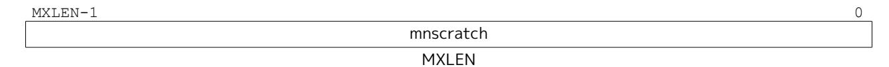

## Chapter 8. "Smrnmi" Extension for Resumable Non-Maskable Interrupts, Version 1.0

The base machine-level architecture supports only unresumable non-maskable interrupts (UNMIs), where the NMI jumps to a handler in machine mode, overwriting the current mepc and mcause register values. If the hart had been executing machine-mode code in a trap handler, the previous values in mepc and mcause would not be recoverable and so execution is not generally resumable.

The Smrnmi extension adds support for resumable non-maskable interrupts (RNMIs) to RISC-V. The extension adds four new CSRs (mnepc, mncause, mnstatus, and mnscratch) to hold the interrupted state, and one new instruction, MNRET, to resume from the RNMI handler.

## 8.1. RNMI Interrupt Signals

The rnmi interrupt signals are inputs to the hart. These interrupts have higher priority than any other interrupt or exception on the hart and cannot be disabled by software. Specifically, they are not disabled by clearing the mstatus.MIE register.

## 8.2. RNMI Handler Addresses

The RNMI interrupt trap handler address is implementation-defined.

RNMI also has an associated exception trap handler address, which is implementation defined.

*For example, some implementations might use the address specified in* mtvec *as the RNMI exception trap handler.*

## 8.3. RNMI CSRs

This extension adds additional M-mode CSRs to enable a resumable non-maskable interrupt (RNMI).

*Figure 38. Resumable NMI scratch register* mnscratch

The mnscratch CSR holds an MXLEN-bit read-write register which enables the RNMI trap handler to save and restore the context that was interrupted.

*Figure 39. Resumable NMI program counter* mnepc*.*

The mnepc CSR is an MXLEN-bit read-write register which on entry to the RNMI trap handler holds the PC of the instruction that took the interrupt.

The low bit of mnepc (mnepc[0]) is always zero. On implementations that support only IALIGN=32, the two low bits (mnepc[1:0]) are always zero.

If an implementation allows IALIGN to be either 16 or 32 (by changing CSR misa, for example), then, whenever IALIGN=32, bit mnepc[1] is masked on reads so that it appears to be 0. This masking occurs also for the implicit read by the MNRET instruction. Though masked, mnepc[1] remains writable when IALIGN=32.

mnepc is a WARL register that must be able to hold all valid virtual addresses. It need not be capable of holding all possible invalid addresses. Prior to writing mnepc, implementations may convert an invalid address into some other invalid address that mnepc is capable of holding.

*Figure 40. Resumable NMI cause* mncause*.*

The mncause CSR holds the reason for the RNMI. If the reason is an interrupt, bit MXLEN-1 is set to 1, and the RNMI cause is encoded in the least-significant bits. If the reason is an interrupt and RNMI causes are not supported, bit MXLEN-1 is set to 1, and zero is written to the least-significant bits. If the reason is an exception within M-mode that results in a double trap as specified in the Smdbltrp extension, bit MXLEN-1 is set to 0 and the least-significant bits are set to the cause code corresponding to the exception that precipitated the double trap.

*Figure 41. Resumable NMI status register* mnstatus*.*

The mnstatus CSR holds a two-bit field, MNPP, which on entry to the RNMI trap handler holds the privilege mode of the interrupted context, encoded in the same manner as mstatus.MPP. It also holds a one-bit field, MNPV, which on entry to the RNMI trap handler holds the virtualization mode of the interrupted context, encoded in the same manner as mstatus.MPV.

If the Zicfilp extension is implemented, mnstatus also holds the MNPELP field, which on entry to the RNMI trap handler holds the previous ELP state. When an RNMI trap is taken, MNPELP is set to ELP and ELP is set to 0.

mnstatus also holds the NMIE bit. When NMIE=1, non-maskable interrupts are enabled. When NMIE=0, *all* interrupts are disabled.

When NMIE=0, the hart behaves as though mstatus.MPRV were clear, regardless of the current setting of mstatus.MPRV.

Upon reset, NMIE contains the value 0.

*RNMIs are masked out of reset to give software the opportunity to initialize data structures and devices for subsequent RNMI handling.*

Software can set NMIE to 1, but attempts to clear NMIE have no effect.

*Normally, only reset sequences will explicitly set the NMIE bit.*

*That the NMIE bit is settable does not suffice to support the nesting of RNMIs. To support this feature in a direct manner would have required allowing software to clear the NMIE bit—a design choice that would have contravened the concept of non-maskability.*

*Software that wishes to minimize the latency until the next RNMI is taken can follow the tophalf/bottom-half model, where the RNMI handler itself only enqueues a task to a task queue* *then returns. The bulk of the interrupt servicing is performed later, with RNMIs enabled.*

For the purposes of the WFI instruction, NMIE is a global interrupt enable, meaning that the setting of NMIE does not affect the operation of the WFI instruction.

The other bits in mnstatus are *reserved*; software should write zeros and hardware implementations should return zeros.

## 8.4. MNRET Instruction

MNRET is an M-mode-only instruction that uses the values in mnepc and mnstatus to return to the program counter, privilege mode, and virtualization mode of the interrupted context. This instruction also sets mnstatus.NMIE. If MNRET changes the privilege mode to a mode less privileged than M, it also sets mstatus.MPRV to 0. If the Zicfilp extension is implemented, then if the new privileged mode is *y*, MNRET sets ELP to the logical AND of *y*LPE (see [Section 23.1.1\)](#page-201-2) and mnstatus.MNPELP.

## 8.5. RNMI Operation

When an RNMI interrupt is detected, the interrupted PC is written to the mnepc CSR, the type of RNMI to the mncause CSR, and the privilege mode of the interrupted context to the mnstatus CSR. The mnstatus.NMIE bit is cleared, masking all interrupts.

The hart then enters machine-mode and jumps to the RNMI trap handler address.

The RNMI handler can resume original execution using the new MNRET instruction, which restores the PC from mnepc, the privilege mode from mnstatus, and also sets mnstatus.NMIE, which re-enables interrupts.

If the hart encounters an exception while executing in M-mode with the mnstatus.NMIE bit clear, the actions taken are the same as if the exception had occurred while mnstatus.NMIE were set, except that the program counter is set to the RNMI exception trap handler address.

*The Smrnmi extension does not change the behavior of the MRET and SRET instructions. In particular, MRET and SRET are unaffected by the* mnstatus*.NMIE bit, and their execution does not alter the* mnstatus*.NMIE bit.*
