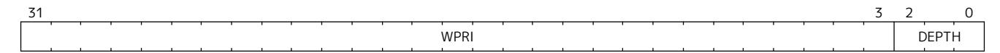
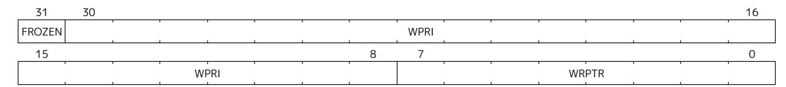
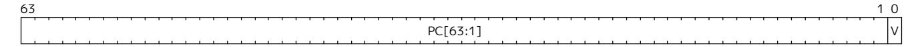
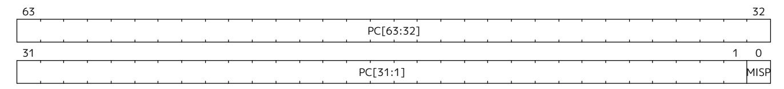
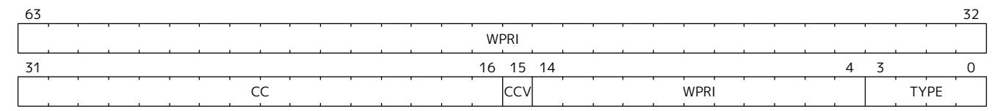
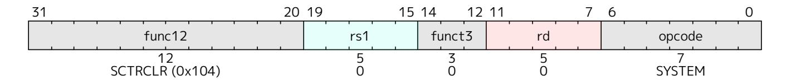

## <span id="page-106-0"></span>Chapter 11. "Smctr" Control Transfer Records Extension, Version 1.0

A method for recording control flow transfer history is valuable not only for performance profiling but also for debugging. Control flow transfers refer to jump instructions (including function calls and returns), taken branch instructions, traps, and trap returns. Profiling tools, such as Linux perf, collect control transfer history when sampling software execution, thereby enabling tools, like AutoFDO, to identify hot paths for optimization.

Control flow trace capabilities offer very deep transfer history, but the volume of data produced can result in significant performance overheads due to memory bandwidth consumption, buffer management, and decoder overhead. The Control Transfer Records (CTR) extension provides a method to record a limited history in register-accessible internal chip storage, with the intent of dramatically reducing the performance overhead and complexity of collecting transfer history.

CTR defines a circular (FIFO) buffer. Each buffer entry holds a record for a single recorded control flow transfer. The number of records that can be held in the buffer depends upon both the implementation (the maximum supported depth) and the CTR configuration (the software selected depth).

Only qualified transfers are recorded. Qualified transfers are those that meet the filtering criteria, which include the privilege mode and the transfer type.

Recorded transfers are inserted at the write pointer, which is then incremented, while older recorded transfers may be overwritten once the buffer is full. Or the user can enable RAS (Return Address Stack) emulation mode, where only function calls are recorded, and function returns pop the last call record. The source PC, target PC, and some optional metadata (transfer type, elapsed cycles) are stored for each recorded transfer.

The CTR buffer is accessible through an indirect CSR interface, such that software can specify which logical entry in the buffer it wishes to read or write. Logical entry 0 always corresponds to the youngest recorded transfer, followed by entry 1 as the next youngest, and so on.

The machine-level extension, Smctr, encompasses all newly added Control Status Registers (CSRs), instructions, and behavior modifications for a hart across all privilege levels. The corresponding supervisor-level extension, Ssctr, is essentially identical to Smctr, except that it excludes machine-level CSRs and behaviors not intended to be directly accessible at the supervisor level.

Smctr and Ssctr depend on both the implementation of S-mode and the Sscsrind extension.

## <span id="page-106-1"></span>11.1. CSRs

#### <span id="page-106-2"></span>11.1.1. Machine Control Transfer Records Control Register (**mctrctl**)

The mctrctl register is a 64-bit read/write register that enables and configures the CTR capability.

| 63         |            |         | 60         | 59        |           |            | 56         |
|------------|------------|---------|------------|-----------|-----------|------------|------------|
|            |            | Custom  |            |           |           | WPRI       |            |
| 55         |            |         |            |           |           |            | 48         |
|            |            |         |            | WPRI      |           |            |            |
| 47         | 46         | 45      | 44         | 43        | 42        | 41         | 40         |
| DIRLJMPINH | INDLJMPINH | RETINH  | CORSWAPINH | DIRJMPINH | INDJMPINH | DIRCALLINH | INDCALLINH |
| 39         | 38         | 37      | 36         | 35        | 34        | 33         | 32         |
|            | WPRI       | TKBRINH | NTBREN     | TRETINH   | INTRINH   | EXCINH     | WPRI       |
| 31         |            |         |            |           |           |            | 24         |
|            |            |         |            | WPRI      |           |            |            |
| 23         |            |         |            |           |           |            | 16         |
|            |            |         |            | WPRI      |           |            |            |
| 15         |            | 13      | 12         | 11        | 10        | 9          | 8          |
|            | WPRI       |         | LCOFIFRZ   | BPFRZ     | WPRI      | MTE        | STE        |
| 7          | 6          |         |            | 3         | 2         | 1          | 0          |
| RASEMU     |            |         | WPRI       |           | M         | S          | U          |

*Figure 42. Machine Control Transfer Records Control Register Format*

*Table 26. Machine Control Transfer Records Control Register Field Definitions*

| Field       | Description                                                                                                              |
|-------------|--------------------------------------------------------------------------------------------------------------------------|
| M, S, U     | Enable transfer recording in the selected privileged mode(s).                                                            |
| RASEMU      | Enables RAS (Return Address Stack) Emulation Mode. See Section 11.5.4.                                                   |
| MTE         | Enables recording of traps to M-mode when M=0. See Section 11.5.1.2.                                                     |
| STE         | Enables recording of traps to S-mode when S=0. See Section 11.5.1.2.                                                     |
| BPFRZ       | Set sctrstatus.FROZEN on a breakpoint exception that traps to M-mode or S-mode. See<br>Section 11.5.5.                   |
| LCOFIFRZ    | Set sctrstatus.FROZEN on local-counter-overflow interrupt (LCOFI) that traps to M-mode<br>or S-mode. See Section 11.5.5. |
| EXCINH      | Inhibit recording of exceptions. See Section 11.5.2.                                                                     |
| INTRINH     | Inhibit recording of interrupts. See Section 11.5.2.                                                                     |
| TRETINH     | Inhibit recording of trap returns. See Section 11.5.2.                                                                   |
| NTBREN      | Enable recording of not-taken branches. See Section 11.5.2.                                                              |
| TKBRINH     | Inhibit recording of taken branches. See Section 11.5.2.                                                                 |
| INDCALLINH  | Inhibit recording of indirect calls. See Section 11.5.2.                                                                 |
| DIRCALLINH  | Inhibit recording of direct calls. See Section 11.5.2.                                                                   |
| INDJMPINH   | Inhibit recording of indirect jumps (without linkage). See Section 11.5.2.                                               |
| DIRJMPINH   | Inhibit recording of direct jumps (without linkage). See Section 11.5.2.                                                 |
| CORSWAPINH  | Inhibit recording of co-routine swaps. See Section 11.5.2.                                                               |
| RETINH      | Inhibit recording of function returns. See Section 11.5.2.                                                               |
| INDLJMPINH  | Inhibit recording of other indirect jumps (with linkage). See Section 11.5.2.                                            |
| DIRLJMPINH  | Inhibit recording of other direct jumps (with linkage). See Section 11.5.2.                                              |
| Custom[3:0] | WARL bits designated for custom use. The value 0 must correspond to standard behavior. See<br>Section 11.6.              |

All fields are optional except for M, S, U, and BPFRZ. All unimplemented fields are read-only 0, while all implemented fields are writable. If the Sscofpmf extension is implemented, LCOFIFRZ must be writable.


*Because the ROI of CTR is perceived to be low for RV32 implementations, CTR does not fully support RV32. While control flow transfers in RV32 can be recorded, RV32 cannot access* x*ctrctl bits 63:32. A future extension could add support for RV32 by adding 3 new CSRs (mctrctlh, sctrctlh, and vsctrctlh) to provide this access.*

#### <span id="page-108-0"></span>11.1.2. Supervisor Control Transfer Records Control Register (**sctrctl**)

The sctrctl register provides supervisor mode access to a subset of mctrctl.

Bits 2 and 9 in sctrctl are read-only 0. As a result, the M and MTE fields in mctrctl are not accessible through sctrctl. All other mctrctl fields are accessible through sctrctl.

#### <span id="page-108-1"></span>11.1.3. Virtual Supervisor Control Transfer Records Control Register (**vsctrctl**)

If the H extension is implemented, the vsctrctl register is a 64-bit read/write register that is VS-mode's version of supervisor register sctrctl. When V=1, vsctrctl substitutes for the usual sctrctl, so instructions that normally read or modify sctrctl actually access vsctrctl instead.

| 63         |            |         | 60         | 59        |           |            | 56         |  |  |
|------------|------------|---------|------------|-----------|-----------|------------|------------|--|--|
|            |            | Custom  |            |           |           | WPRI       |            |  |  |
| 55         |            |         |            |           |           |            | 48         |  |  |
|            | WPRI       |         |            |           |           |            |            |  |  |
| 47         | 46         | 45      | 44         | 43        | 42        | 41         | 40         |  |  |
| DIRLJMPINH | INDLJMPINH | RETINH  | CORSWAPINH | DIRJMPINH | INDJMPINH | DIRCALLINH | INDCALLINH |  |  |
| 39         | 38         | 37      | 36         | 35        | 34        | 33         | 32         |  |  |
| WPRI       |            | TKBRINH | NTBREN     | TRETINH   | INTRINH   | EXCINH     | WPRI       |  |  |
| 31         |            |         |            |           |           |            | 24         |  |  |
|            |            |         |            | WPRI      |           |            |            |  |  |
| 23         |            |         |            |           |           |            | 16         |  |  |
|            | WPRI       |         |            |           |           |            |            |  |  |
| 15         |            | 13      | 12         | 11        | 10        | 9          | 8          |  |  |
|            | WPRI       |         | LCOFIFRZ   | BPFRZ     | WPRI      |            | STE        |  |  |
| 7          | 6          |         |            |           | 2         | 1          | 0          |  |  |
| RASEMU     |            |         | WPRI       |           |           | S          | U          |  |  |

*Figure 43. Virtual Supervisor Control Transfer Records Control Register Format*

*Table 27. Virtual Supervisor Control Transfer Records Control Register Field Definitions*

| Field    | Description                                                                                                     |
|----------|-----------------------------------------------------------------------------------------------------------------|
| S        | Enable transfer recording in VS-mode.                                                                           |
| U        | Enable transfer recording in VU-mode.                                                                           |
| STE      | Enables recording of traps to VS-mode when S=0. See Section 11.5.1.2.                                           |
| BPFRZ    | Set sctrstatus.FROZEN on a breakpoint exception that traps to VS-mode. See Section 11.5.5.                      |
| LCOFIFRZ | Set sctrstatus.FROZEN on local-counter-overflow interrupt (LCOFI) that traps to VS-mode.<br>See Section 11.5.5. |

Other field definitions match those of sctrctl. The optional fields implemented in vsctrctl should match those implemented in sctrctl.


*Unlike the CTR status register or the CTR entry registers, the CTR control register has a VSmode version. This allows a guest to manage the CTR configuration directly, without requiring traps to HS-mode, while ensuring that the guest configuration (most notably the privilege mode enable bits) do not impact CTR behavior when V=0.*

### <span id="page-109-0"></span>11.1.4. Supervisor Control Transfer Records Depth Register (**sctrdepth**)

The 32-bit sctrdepth register specifies the depth of the CTR buffer.



*Figure 44. Supervisor Control Transfer Records Depth Register Format*

*Table 28. Supervisor Control Transfer Records Depth Register Field Definitions*

| Field | Description                                                                                                                                                                                                                                                                                                                                                                        |
|-------|------------------------------------------------------------------------------------------------------------------------------------------------------------------------------------------------------------------------------------------------------------------------------------------------------------------------------------------------------------------------------------|
| DEPTH | WARL field that selects the depth of the CTR buffer. Encodings:                                                                                                                                                                                                                                                                                                                    |
|       | '000 - 16                                                                                                                                                                                                                                                                                                                                                                          |
|       | '001 - 32                                                                                                                                                                                                                                                                                                                                                                          |
|       | '010 - 64                                                                                                                                                                                                                                                                                                                                                                          |
|       | '011 - 128                                                                                                                                                                                                                                                                                                                                                                         |
|       | '100 - 256                                                                                                                                                                                                                                                                                                                                                                         |
|       | '11x - reserved                                                                                                                                                                                                                                                                                                                                                                    |
|       | The depth of the CTR buffer dictates the number of entries to which the hardware records transfers.<br>For a depth of N, the hardware records transfers to entries 0N-1. All Entry Registers read as '0' and<br>are read-only when the selected entry is in the range N to 255. When the depth is increased, the<br>newly accessible entries contain unspecified but legal values. |
|       | It is implementation-specific which DEPTH value(s) are supported.                                                                                                                                                                                                                                                                                                                  |

Attempts to access sctrdepth from VS-mode or VU-mode raise a virtual-instruction exception, unless CTR state enable access restrictions apply. See [Section 11.4](#page-112-3).

> *It is expected that operating systems (OSs) will access sctrdepth only at boot, to select the maximum supported depth value. More frequent accesses may result in reduced performance in virtualization scenarios, as a result of traps from VS-mode incurred.*


*There may be scenarios where software chooses to operate on only a subset of the entries, to reduce overhead. In such cases tools may choose to read only the lower entries, and OSs may choose to save/restore only on the lower entries while using SCTRCLR to clear the others.*

*The value in configurable depth lies in supporting VM migration. It is expected that a platform spec may specify that one or more CTR depth values must be supported. A hypervisor may wish to restrict guests to using one of these required depths, in order to ensure that such guests can be migrated to any system that complies with the platform spec. The trapping behavior specified for VS-mode accesses to sctrdepth ensures that the hypervisor can impose such restrictions.*

#### <span id="page-109-1"></span>11.1.5. Supervisor Control Transfer Records Status Register (**sctrstatus**)

The 32-bit sctrstatus register grants access to CTR status information and is updated by the hardware

whenever CTR is active. CTR is active when the current privilege mode is enabled for recording and CTR is not frozen.



*Figure 45. Supervisor Control Transfer Records Status Register Format*

*Table 29. Supervisor Control Transfer Records Status Register Field Definitions*

| Field  | Description                                                                                                                                                                                                                                                                                                                                                                                                                                                                                                                                                                    |
|--------|--------------------------------------------------------------------------------------------------------------------------------------------------------------------------------------------------------------------------------------------------------------------------------------------------------------------------------------------------------------------------------------------------------------------------------------------------------------------------------------------------------------------------------------------------------------------------------|
| WRPTR  | WARL field that indicates the physical CTR buffer entry to be written next. It is incremented after<br>new transfers are recorded (see Section 11.5), though there are exceptions when x<br>ctrctl.RASEMU=1, see Section 11.5.4. For a given CTR depth (where depth = 2(DEPTH+4)), WRPTR<br>wraps to 0 on an increment when the value matches depth-1, and to depth-1 on a decrement when<br>the value is 0. Bits above those needed to represent depth-1 (e.g., bits 7:4 for a depth of 16) are read<br>only 0. On depth changes, WRPTR holds an unspecified but legal value. |
| FROZEN | Inhibit transfer recording. See Section 11.5.5.                                                                                                                                                                                                                                                                                                                                                                                                                                                                                                                                |

Undefined bits in sctrstatus are WPRI. Status fields may be added by future extensions, and software should ignore but preserve any fields that it does not recognize. Undefined bits must be implemented as read-only 0, unless a custom extension is implemented and enabled (see [Section 11.6\)](#page-120-0).


*Logical entry 0, accessed via sireg\* when siselect=0x200, is always the physical buffer entry preceding the WRPTR entry. More generally, the physical buffer entry Y associated with logical entry X (X < depth) can be determined using the formula Y = (WRPTR - X - 1) % depth, where depth = 2(DEPTH+4). Logical entries >= depth are read-only 0.*


*Because the sctrstatus register is updated by hardware, writes should be performed with caution. If a multi-instruction read-modify-write to sctrstatus is performed while CTR is active, and between the read and write a qualified transfer or trap that causes CTR freeze completes, a hardware update could be lost. Software may wish to ensure that CTR is inactive before performing a read-modify-write, by ensuring that either sctrstatus.FROZEN=1, or that the current privilege mode is not enabled for recording.*

*When restoring CTR state, sctrstatus should be written before CTR entry state is restored. This ensures that the software writes to logical CTR entries modify the proper physical entries.*


*Exposing the WRPTR provides a more efficient means for synthesizing CTR entries. If a qualified control transfer is emulated, the emulator can simply increment the WRPTR, then write the synthesized record to logical entry 0. If a qualified function return is emulated while RASEMU=1, the emulator can clear ctrsource.V for logical entry 0, then decrement the WRPTR.*

*Exposing the WRPTR may also allow support for Linux perf's [stack stitching](https://lwn.net/Articles/802821) capability.*


*Smctr/Ssctr depends upon implementation of S-mode because much of CTR state is accessible only through S-mode CSRs. If, in the future, it becomes desirable to remove this dependency, an extension could add mctrdepth and mctrstatus CSRs that reflect the same state as sctrdepth and sctrstatus, respectively. Further, such an extension should make CTR entries accessible via miselect/mireg\*. See [Section 11.2.](#page-111-0)*

## <span id="page-111-0"></span>11.2. Entry Registers

Control transfer records are stored in a CTR buffer, such that each buffer entry stores information about a single transfer. The CTR buffer entries are logically accessed via the indirect register access mechanism defined by the Sscsrind extension. The siselect index range 0x200 through 0x2FF is reserved for CTR logical entries 0 through 255. When siselect holds a value in this range, sireg provides access to ctrsource, sireg2 provides access to ctrtarget, and sireg3 provides access to ctrdata. sireg4, sireg5, and sireg6 are read-only 0.

When vsiselect holds a value in 0x200..0x2FF, the vsireg\* registers provide access to the same CTR entry register state as the analogous sireg\* registers. There is not a separate set of entry registers for V=1.

See [Section 11.4](#page-112-3) for cases where CTR accesses from S-mode and VS-mode may be restricted.

#### <span id="page-111-1"></span>11.2.1. Control Transfer Record Source Register (**ctrsource**)

The ctrsource register contains the source program counter, which is the pc of the recorded control transfer instruction, or the epc of the recorded trap. The valid (V) bit is set by the hardware when a transfer is recorded in the selected CTR buffer entry, and implies that data in ctrsource, ctrtarget, and ctrdata is valid for this entry.

ctrsource is an MXLEN-bit WARL register that must be able to hold all valid virtual or physical addresses that can serve as a pc. It need not be able to hold any invalid addresses; implementations may convert an invalid address into a valid address that the register is capable of holding. When XLEN < MXLEN, both explicit writes (by software) and implicit writes (for recorded transfers) will be zero-extended.



*Figure 46. Control Transfer Record Source Register Format for MXLEN=64*


*CTR entry registers are defined as MXLEN, despite the* x*ireg\* CSRs used to access them being XLEN, to ensure that entries recorded in RV64 are not truncated, as a result of CSR Width Modulation, on a transition to RV32.*

#### <span id="page-111-2"></span>11.2.2. Control Transfer Record Target Register (**ctrtarget**)

The ctrtarget register contains the target (destination) program counter of the recorded transfer. For a not-taken branch, ctrtarget holds the PC of the next sequential instruction following the branch. The optional MISP bit is set by the hardware when the recorded transfer is an instruction whose target or taken/not-taken direction was mispredicted by the branch predictor. MISP is read-only 0 when not implemented.

ctrtarget is an MXLEN-bit WARL register that must be able to hold all valid virtual or physical addresses that can serve as a pc. It need not be able to hold any invalid addresses; implementations may convert an invalid address into a valid address that the register is capable of holding. When XLEN < MXLEN, both explicit writes (by software) and implicit writes (by recorded transfers) will be zero-extended.



*Figure 47. Control Transfer Record Target Register Format for MXLEN=64*

### <span id="page-112-0"></span>11.2.3. Control Transfer Record Metadata Register (**ctrdata**)

The ctrdata register contains metadata for the recorded transfer. This register must be implemented, though all fields within it are optional. Unimplemented fields are read-only 0. ctrdata is a 64-bit register.



*Figure 48. Control Transfer Record Metadata Register Format*

*Table 30. Control Transfer Record Metadata Register Field Definitions*

| Field     | Description                                                                                                                                                                         | Access |
|-----------|-------------------------------------------------------------------------------------------------------------------------------------------------------------------------------------|--------|
| TYPE[3:0] | Identifies the type of the control flow transfer recorded in the entry, using the<br>encodings listed in Table 33. Implementations that do not support this field will report<br>0. | WARL   |
| CCV       | Cycle Count Valid. See Section 11.5.3.                                                                                                                                              | WARL   |
| CC[15:0]  | Cycle Count, composed of the Cycle Count Exponent (CCE, in CC[15:12]) and Cycle<br>Count Mantissa (CCM, in CC[11:0]). See Section 11.5.3.                                           | WARL   |

Undefined bits in ctrdata are WPRI. Undefined bits must be implemented as read-only 0, unless a [custom](#page-120-0) [extension](#page-120-0) is implemented and enabled.


*Like the [Transfer Type Filtering](#page-116-0) bits in mctrctl, the ctrdata.TYPE bits leverage the E-trace itype encodings.*

## <span id="page-112-1"></span>11.3. Instructions

#### <span id="page-112-2"></span>11.3.1. Supervisor CTR Clear Instruction



The SCTRCLR instruction performs the following operations:

- ⚫ Zeroes all CTR [Entry Registers,](#page-111-0) for all DEPTH values
- ⚫ Zeroes the CTR cycle counter and CCV (see [Section 11.5.3\)](#page-117-0)

Any read of ctrsource, ctrtarget, or ctrdata that follows SCTRCLR, such that it precedes the next qualified control transfer, will return the value 0. Further, the first recorded transfer following SCTRCLR will have ctrdata.CCV=0.

SCTRCLR raises an illegal-instruction exception in U-mode, and a virtual-instruction exception in VUmode, unless CTR state enable access restrictions apply. See [Section 11.4.](#page-112-3)

## <span id="page-112-3"></span>11.4. State Enable Access Control

When Smstateen is implemented, the mstateen0.CTR bit controls access to CTR register state from privilege modes less privileged than M-mode. When mstateen0.CTR=1, accesses to CTR register state behave as described in [Section 7.2](#page-97-2) and [Section 11.2](#page-111-0) above, while SCTRCLR behaves as described in [Section](#page-112-2) [11.3.1](#page-112-2). When mstateen0.CTR=0 and the privilege mode is less privileged than M-mode, the following operations raise an illegal-instruction exception:

- ⚫ Attempts to access sctrctl, vsctrctl, sctrdepth, or sctrstatus
- ⚫ Attempts to access sireg\* when siselect is in 0x200..0x2FF, or vsireg\* when vsiselect is in 0x200..0x2FF
- ⚫ Execution of the SCTRCLR instruction

When mstateen0.CTR=0, qualified control transfers executed in privilege modes less privileged than Mmode will continue to implicitly update entry registers and sctrstatus.

If the H extension is implemented and mstateen0.CTR=1, the hstateen0.CTR bit controls access to supervisor CTR state when V=1. This state includes sctrctl (really vsctrctl), sctrstatus, and sireg\* (really vsireg\*) when siselect (really vsiselect) is in 0x200..0x2FF. hstateen0.CTR is read-only 0 when mstateen0.CTR=0.

When mstateen0.CTR=1 and hstateen0.CTR=1, VS-mode accesses to supervisor CTR state behave as described in [Section 7.2](#page-97-2) and [Section 11.2](#page-111-0) above, while SCTRCLR behaves as described in [Section 11.3.1.](#page-112-2) When mstateen0.CTR=1 and hstateen0.CTR=0, both VS-mode accesses to supervisor CTR state and VSmode execution of SCTRCLR raise a virtual-instruction exception.


*sctrdepth is not included in the above list of supervisor CTR state controlled by hstateen0.CTR since accesses to sctrdepth from VS-mode raise a virtual-instruction exception regardless of the value of hstateen0.CTR.*

When hstateen0.CTR=0, qualified control transfers executed while V=1 will continue to implicitly update entry registers and sctrstatus.


*See [Chapter 5](#page-89-0) for how bit 60 in mstateen0 and hstateen0 can also restrict access to sireg\* /siselect and vsireg\*/vsiselect from privilege modes less privileged than M-mode.*


*Implementations that support Smctr/Ssctr but not Smstateen/Ssstateen may observe reduced performance. Because Smctr/Ssctr introduces a significant number of new CSRs, it is desirable to avoid save/restore of CTR state when possible. A hypervisor is likely to leverage State Enable to trap on the initial guest access to CTR state, delegating CTR and enabling save/restore of guest CTR state only once the guest has begun to use it. Without Smstateen/Ssstateen, a hypervisor is required to save/restore guest CTR state on every context switch.*

## <span id="page-113-0"></span>11.5. Behavior

CTR records qualified control transfers. Control transfers are qualified if they meet the following criteria:

- ⚫ The current privilege mode is enabled
- ⚫ The transfer type is not inhibited
- ⚫ sctrstatus.FROZEN is not set
- ⚫ The transfer completes/retires

Such qualified transfers update the [Entry Registers](#page-111-0) at logical entry 0. As a result, older entries are pushed down the stack; the record previously in logical entry 0 moves to logical entry 1, the record in logical entry 1 moves to logical entry 2, and so on. If the CTR buffer is full, the oldest recorded entry (previously at entry depth-1) is lost.

Recorded transfers will set the ctrsource.V bit to 1, and will update all implemented record fields.


*In order to collect accurate and representative performance profiles while using CTR, it is recommended that hardware recording of control transfers incurs no added performance overhead, e.g., in the form of retirement or instruction execution restrictions that are not present when CTR is not active.*

#### <span id="page-114-0"></span>11.5.1. Privilege Mode Transitions

Transfers that change the privilege mode are a special case. What is recorded, if anything, depends on whether the source privilege mode and/or target privilege mode are enabled for recording, and on the transfer type (trap or trap return).

Traps between enabled privilege modes are recorded as normal. Traps from a disabled privilege mode to an enabled privilege mode are partially recorded, such that the ctrsource.PC is 0. Traps from an enabled mode to a disabled mode, known as external traps, are not recorded by default. See [Section 11.5.1.2](#page-115-0) for how they can be recorded.

Trap returns have similar treatment. Trap returns between enabled privilege modes are recorded as normal. Trap returns from an enabled mode back to a disabled mode are partially recorded, such that ctrtarget.PC is 0. Trap returns from a disabled mode to an enabled mode are not recorded.


*If privileged software is configuring CTR on behalf of less privileged software, it should ensure that its privilege mode enable bit (e.g., sctrctl.S for Supervisor software) is cleared before a trap return to the less privileged mode. Otherwise the trap return will be recorded, leaking the privileged source pc.*

Recording in Debug Mode is always inhibited. Transfers into and out of Debug Mode are never recorded.

The table below provides details on recording of privilege mode transitions. Standard dependencies on FROZEN and transfer type inhibits also apply, but are not covered by the table.

| Transfer Type | Source Mode | Target Mode                  |                                                                      |  |  |  |
|---------------|-------------|------------------------------|----------------------------------------------------------------------|--|--|--|
|               |             | Enabled                      | Disabled                                                             |  |  |  |
| Trap          | Enabled     | Recorded.                    | External trap. Not recorded by default,<br>but see Section 11.5.1.2. |  |  |  |
|               | Disabled    | Recorded, ctrsource.PC is 0. | Not recorded.                                                        |  |  |  |
| Trap Return   | Enabled     | Recorded.                    | Recorded, ctrtarget.PC is 0.                                         |  |  |  |
|               | Disabled    | Not recorded.                | Not recorded.                                                        |  |  |  |

*Table 31. Trap and Trap Return Recording*

#### <span id="page-114-1"></span>11.5.1.1. Virtualization Mode Transitions

Transitions between VS/VU-mode and M/HS-mode are unique in that they effect a change in the active CTR control register, and hence the CTR configuration. What is recorded, if anything, on these virtualization mode transitions depends upon fields from both [ms]ctrctl and vsctrctl.

⚫ mctrctl.M, sctrctl.S, and vsctrctl.{S,U} are used to determine whether the source and target modes are enabled;

- ⚫ mctrctl.MTE, sctrctl.STE, and vsctrctl.STE are used to determine whether an external trap is recorded (see [Section 11.5.1.2\)](#page-115-0);
- ⚫ sctrctl.LCOFIFRZ and sctrctl.BPFRZ determine whether CTR becomes frozen (see [Section 11.5.5](#page-119-0))
- ⚫ For all other *x*ctrctl fields, the value in vsctrctl is used.


*Consider an exception that traps from VU-mode to HS-mode, with vsctrctl.U=1 and sctrctl.S=1. Because both the source mode and target mode are enabled for recording, whether the trap is recorded then depends on the CTR configuration (e.g., the [transfer type](#page-116-0) [filter](#page-116-0) bits) in vsctrctl, not in sctrctl.*

#### <span id="page-115-0"></span>11.5.1.2. External Traps

External traps are traps from a privilege mode enabled for CTR recording to a privilege mode that is not enabled for CTR recording. By default external traps are not recorded, but privileged software running in the target mode of the trap can opt-in to allowing CTR to record external traps into that mode. The *x* ctrctl.*x*TE bits allow M-mode, S-mode, and VS-mode to opt-in separately.

External trap recording depends not only on the target mode, but on any intervening modes, which are modes that are more privileged than the source mode but less privileged than the target mode. Not only must the external trap enable bit for the target mode be set, but the external trap enable bit(s) for any intervening modes must also be set. See the table below for details.


*Requiring intervening modes to be enabled for external traps simplifies software management of CTR. Consider a scenario where S-mode software is configuring CTR for U-mode contexts A and B, such that external traps (to any mode) are enabled for A but not for B. When switching between the two contexts, S-mode can simply toggle sctrctl.STE, rather than requiring a trap to M-mode to additionally toggle mctrctl.MTE.*

*This method does not provide the flexibility to record external traps to a more privileged mode but not to all intervening mode(s). Because it is expected that profiling tools generally wish to observe all external traps or none, this is not considered a meaningful limitation.*

Source Mode Target Mode External Trap Enable(s) Required U-mode S-mode sctrctl.STE M-mode mctrctl.MTE, sctrctl.STE S-mode M-mode mctrctl.MTE VU-mode VS-mode vsctrctl.STE HS-mode sctrctl.STE, vsctrctl.STE M-mode mctrctl.MTE, sctrctl.STE, vsctrctl.STE VS-mode HS-mode sctrctl.STE M-mode mctrctl.MTE, sctrctl.STE

*Table 32. External Trap Enable Requirements*

In records for external traps, the ctrtarget.PC is 0.


*No mechanism exists for recording external trap returns, because the external trap record includes all relevant information, and gives the trap handler (e.g., an emulator) the opportunity to modify the record.*

*Note that external trap recording does not depend on EXCINH/INTRINH. Thus, when external traps are enabled, both external interrupts and external exceptions are recorded.*


*STE allows recording of traps from U-mode to S-mode as well as from VS/VU-mode to HSmode. The hypervisor can flip sctrctl.STE before entering a guest if it wants different behavior for U-to-S vs VS/VU-to-HS.*

If external trap recording is implemented, mctrctl.MTE and sctrctl.STE must be implemented, while vsctrctl.STE must be implemented if the H extension is implemented.

### <span id="page-116-0"></span>11.5.2. Transfer Type Filtering

Default CTR behavior, when all transfer type filter bits (*x*ctrctl[47:32]) are unimplemented or 0, is to record all control transfers within enabled privileged modes. By setting transfer type filter bits, software can opt out of recording select transfer types, or opt into recording non-default operations. All transfer type filter bits are optional.


*Because not-taken branches are not recorded by default, the polarity of the associated enable bit (NTBREN) is the opposite of other bits associated with transfer type filtering (TKBRINH, RETINH, etc). Non-default operations require opt-in rather than opt-out.*

The transfer type filter bits leverage the type definitions specified in the [RISC-V Efficient Trace Spec v2.0](https://github.com/riscv-non-isa/riscv-trace-spec/releases/download/v2.0rc2/riscv-trace-spec.pdf) (Table 4.4 and Section 4.1.1). For completeness, the definitions are reproduced below.


*Here "indirect" is used interchangeably with "uninferrable", which is used in the trace spec. Both imply that the target of the jump is not encoded in the opcode.*

<span id="page-116-1"></span>Encoding Transfer Type Name 0 *Not used by CTR* 1 Exception 2 Interrupt 3 Trap return 4 Not-taken branch 5 Taken branch 6 *reserved* 7 *reserved* 8 Indirect call 9 Direct call 10 Indirect jump (without linkage) 11 Direct jump (without linkage) 12 Co-routine swap 13 Function return

*Table 33. Control Transfer Type Definitions*

Encodings 8 through 15 refer to various encodings of jump instructions. The types are distinguished as described below.

14 Other indirect jump (with linkage) 15 Other direct jump (with linkage)

*Table 34. Control Transfer Type Definitions*

| Transfer Type Name                 | Associated Opcodes                                           |  |  |  |
|------------------------------------|--------------------------------------------------------------|--|--|--|
| Indirect call                      | JALR x1, rs where rs != x5                                   |  |  |  |
|                                    | JALR x5, rs where rs != x1                                   |  |  |  |
|                                    | C.JALR rs1 where rs1 != x5                                   |  |  |  |
| Direct call                        | JAL x1                                                       |  |  |  |
|                                    | JAL x5                                                       |  |  |  |
|                                    | C.JAL                                                        |  |  |  |
|                                    | CM.JALT index                                                |  |  |  |
| Indirect jump (without linkage)    | JALR x0, rs where rs != (x1 or x5)                           |  |  |  |
|                                    | C.JR rs1 where rs1 != (x1 or x5)                             |  |  |  |
| Direct jump (without linkage)      | JAL x0                                                       |  |  |  |
|                                    | C.J                                                          |  |  |  |
|                                    | CM.JT index                                                  |  |  |  |
| Co-routine swap                    | JALR x1, x5                                                  |  |  |  |
|                                    | JALR x5, x1                                                  |  |  |  |
|                                    | C.JALR x5                                                    |  |  |  |
| Function return                    | JALR rd, rs where rs == (x1 or x5) and rd != (x1 or x5)      |  |  |  |
|                                    | C.JR rs1 where rs1 == (x1 or x5)                             |  |  |  |
|                                    | CM.POPRET(Z)                                                 |  |  |  |
| Other indirect jump (with linkage) | JALR rd, rs where rs != (x1 or x5) and rd != (x0, x1, or x5) |  |  |  |
| Other direct jump (with linkage)   | JAL rd where rd != (x0, x1, or x5)                           |  |  |  |


*If implementation of any transfer type filter bit results in reduced software performance, perhaps due to additional retirement restrictions, it is strongly recommended that this reduced performance apply only when the bit is set. Alternatively, support for the bit may be omitted. Maintaining software performance for the default CTR configuration, when all transfer type bits are cleared, is recommended.*

#### <span id="page-117-0"></span>11.5.3. Cycle Counting

The ctrdata register may optionally include a count of CPU cycles elapsed since the prior CTR record. The elapsed cycle count value is represented by the CC field, which has a 12-bit mantissa component (Cycle Count Mantissa, or CCM) and a 4-bit exponent component (Cycle Count Exponent, or CCE).

The elapsed cycle counter (CtrCycleCounter) increments at the same rate as the mcycle counter. Only cycles while CTR is active are counted, where active implies that the current privilege mode is enabled for recording and CTR is not frozen. The CC field is encoded such that CCE holds 0 if the CtrCycleCounter value is less than 4096, otherwise it holds the index of the most significant one bit in the CtrCycleCounter value, minus 11. CCM holds CtrCycleCounter bits CCE+10:CCE-1.

The elapsed cycle count can then be calculated by software using the following formula:

```
if (CCE==0):
  return CCM
else:
  return (212 + CCM) << CCE-1
endif
```

The CtrCycleCounter is reset on writes to *x*ctrctl, and on execution of SCTRCLR, to ensure that any accumulated cycle counts do not persist across a context switch.

An implementation that supports cycle counting must implement CCV and all CCM bits, but may implement 0..4 exponent bits in CCE. Unimplemented CCE bits are read-only 0. For implementations that support transfer type filtering, it is recommended to implement at least 3 exponent bits. This allows capturing the full latency of most functions, when recording only calls and returns.

The size of the CtrCycleCounter required to support each CCE width is given in the table below.

| CCE bits | CtrCycleCounter bits | Max elapsed cycle value |
|----------|----------------------|-------------------------|
| 0        | 12                   | 4095                    |
| 1        | 13                   | 8191                    |
| 2        | 15                   | 32764                   |
| 3        | 19                   | 524224                  |
| 4        | 27                   | 134201344               |

*Table 35. Cycle Counter Size Options*

*When CCE>1, the granularity of the reported cycle count is reduced. For example, when CCE=3, the bottom 2 bits of the cycle counter are not reported, and thus the reported value increments only every 4 cycles. As a result, the reported value represents an undercount of elapsed cycles for most cases (when the unreported bits are non-zero). On average, the undercount will be (2CCE-1-1)/2. Software can reduce the average undercount to 0 by adding (2CCE-1-1)/2 to each computed cycle count value when CCE>1.*

*Though this compressed method of representation results in some imprecision for larger cycle count values, it produces meaningful area savings, reducing storage per entry from 27 bits to 16.*

The CC value saturates when all implemented bits in CCM and CCE are 1.

The CC value is valid only when the Cycle Count Valid (CCV) bit is set. If CCV=0, the CC value might not hold the correct count of elapsed active cycles since the last recorded transfer. The next record will have CCV=0 after a write to *x*ctrctl, or execution of SCTRCLR, since CtrCycleCounter is reset. CCV should additionally be cleared after any other implementation-specific scenarios where active cycles might not be counted in CtrCycleCounter.

#### <span id="page-118-0"></span>11.5.4. RAS (Return Address Stack) Emulation Mode

When the optional *x*ctrctl.RASEMU bit is implemented and set to 1, transfer recording behavior is altered to emulate the behavior of a return-address stack (RAS).

- ⚫ Indirect and direct calls are recorded as normal
- ⚫ Function returns pop the most recent call, by decrementing the WRPTR then invalidating the WRPTR

entry (by setting ctrsource.V=0). As a result, logical entry 0 is invalidated and moves to logical entry depth-1, while logical entries 1..depth-1 move to 0..depth-2.

- ⚫ Co-routine swaps affect both a return and a call. Logical entry 0 is overwritten, and WRPTR is not modified.
- ⚫ Other transfer types are inhibited
- ⚫ Transfer type filtering bits (*x*ctrctl[47:32]) and external trap enable bits (*x*ctrctl.*x*TE) are ignored

*Profiling tools often collect call stacks along with each sample. Stack walking, however, is a complex and often slow process that may require recompilation (e.g., -fno-omit-frame-pointer) to work reliably. With RAS emulation, tools can ask CTR hardware to save call stacks even for unmodified code.*


*CTR RAS emulation has limitations. The CTR buffer will contain only partial stacks in cases where the call stack depth was greater than the CTR depth, CTR recording was enabled at a lower point in the call stack than main(), or where the CTR buffer was cleared since main().*

*The CTR stack may be corrupted in cases where calls and returns are not symmetric, such as with stack unwinding (e.g., setjmp/longjmp, C++ exceptions), where stale call entries may be left on the CTR stack, or user stack switching, where calls from multiple stacks may be intermixed.*


*As described in [Section 11.5.3](#page-117-0), when CCV=1, the CC field provides the elapsed cycles since the prior CTR entry was recorded. This introduces implementation challenges when RASEMU=1 because, for each recorded call, there may have been several recorded calls (and returns which "popped" them) since the prior remaining call entry was recorded (see [Section 11.5.4](#page-118-0)). The implication is that returns that pop a call entry not only do not reset the cycle counter, but instead add the CC field from the popped entry to the counter. For simplicity, an implementation may opt to record CCV=0 for all calls, or those whose parent call was popped, when RASEMU=1.*

## <span id="page-119-0"></span>11.5.5. Freeze

When sctrstatus.FROZEN=1, transfer recording is inhibited. This bit can be set by hardware, as described below, or by software.

When sctrctl.LCOFIFRZ=1 and a local-counter-overflow interrupt (LCOFI) traps (as a result of an HPM counter overflow) to M-mode or to S-mode, sctrstatus.FROZEN is set by hardware. This inhibits CTR recording until software clears FROZEN. The LCOFI trap itself is not recorded.

> *Freeze on LCOFI ensures that the execution path leading to the sampled instruction (xepc) is preserved, and that the local-counter-overflow interrupt (LCOFI) and associated Interrupt Service Routine (ISR) do not displace any recorded transfer history state. It is the responsibility of the ISR to clear FROZEN before xRET, if continued control transfer recording is desired.*


*LCOFI refers only to architectural traps directly caused by a local counter overflow. If a localcounter-overflow interrupt is recognized without a trap, FROZEN is not automatically set. For instance, no freeze occurs if the LCOFI is pended while interrupts are masked, and software recognizes the LCOFI (perhaps by reading stopi or sip) and clears sip.LCOFIP before the trap is raised. As a result, some or all CTR history may be overwritten while handling the LCOFI. Such cases are expected to be very rare; for most usages (e.g., application profiling) privilege mode filtering is sufficient to ensure that CTR updates are inhibited while interrupts are handled in a more privileged mode.*

Similarly, on a breakpoint exception that traps to M-mode or S-mode with sctrctl.BPFRZ=1, FROZEN is set by hardware. The breakpoint exception itself is not recorded.


*Breakpoint exception refers to synchronous exceptions with a cause value of Breakpoint (3), regardless of source (ebreak, c.ebreak, Sdtrig); it does not include entry into Debug Mode, even in cores where this is implemented as an exception.*

If the H extension is implemented, freeze behavior for LCOFIs and breakpoint exceptions that trap to VSmode is determined by the LCOFIFRZ and BPFRZ values, respectively, in vsctrctl. This includes virtual LCOFIs pended by a hypervisor.


*When a guest uses the SBI Supervisor Software Events (SSE) extension, the LCOFI will trap to HS-mode, which will then invoke a registered VS-mode LCOFI handler routine. If vsctrctl.LCOFIFRZ=1, the HS-mode handler will need to emulate the freeze by setting sctrstatus.FROZEN=1 before invoking the registered handler routine.*

## <span id="page-120-0"></span>11.6. Custom Extensions

Any custom CTR extension must be associated with a non-zero value within the designated custom bits in *x*ctrctl. When the custom bits hold a non-zero value that enables a custom extension, the extension may alter standard CTR behavior, and may define new custom status fields within sctrstatus or the CTR [Entry](#page-111-0) [Registers.](#page-111-0) All custom status fields, and standard status fields whose behavior is altered by the custom extension, must revert to standard behavior when the custom bits hold zero. This includes read-only 0 behavior for any bits undefined by any implemented standard extensions.
