## Chapter 12. Supervisor-Level ISA, Version 1.13

This chapter describes the RISC-V supervisor-level architecture, which contains a common core that is used with various supervisor-level address translation and protection schemes.

*Supervisor mode is deliberately restricted in terms of interactions with underlying physical hardware, such as physical memory and device interrupts, to support clean virtualization. In this spirit, certain supervisor-level facilities, including requests for timer and interprocessor interrupts, are provided by implementation-specific mechanisms. In some systems, a supervisor execution environment (SEE) provides these facilities in a manner specified by a supervisor binary interface (SBI). Other systems supply these facilities directly, through some other implementation-defined mechanism.*

## 12.1. Supervisor CSRs

A number of CSRs are provided for the supervisor.

*The supervisor should only view CSR state that should be visible to a supervisor-level operating system. In particular, there is no information about the existence (or non-existence) of higher privilege levels (machine level or other) visible in the CSRs accessible by the supervisor.*

*Many supervisor CSRs are a subset of the equivalent machine-mode CSR, and the machinemode chapter should be read first to help understand the supervisor-level CSR descriptions.*

#### 12.1.1. Supervisor Status (**sstatus**) Register

The sstatus register is an SXLEN-bit read/write register formatted as shown in [Figure 49](#page-121-3) when SXLEN=32 and [Figure 50](#page-121-4) when SXLEN=64. The sstatus register keeps track of the processor's current operating state.

| 31 | 30 |    |      |    |    | 25 | 24  | 23    | 22 |      | 20 | 19  | 18  | 17   | 16      |
|----|----|----|------|----|----|----|-----|-------|----|------|----|-----|-----|------|---------|
| SD |    |    | WPRI |    |    |    | SDT | SPELP |    | WPRI |    | MXR | SUM | WPRI | XS[1:0] |
|    |    |    |      |    |    |    |     |       |    |      |    |     |     |      |         |
| 15 | 14 | 13 | 12   | 11 | 10 | 9  | 8   | 7     | 6  | 5    | 4  |     | 2   | 1    | 0       |

*Figure 49. Supervisor-mode status (*sstatus*) register when SXLEN=32.*

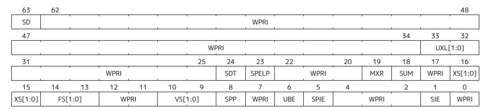

*Figure 50. Supervisor-mode status (*sstatus*) register when SXLEN=64.*

The SPP bit indicates the privilege level at which a hart was executing before entering supervisor mode. When a trap is taken, SPP is set to 0 if the trap originated from user mode, or 1 otherwise. When an SRET instruction (see [Section 3.3.2\)](#page-69-2) is executed to return from the trap handler, the privilege level is set to user mode if the SPP bit is 0, or supervisor mode if the SPP bit is 1; SPP is then set to 0.

The SIE bit enables or disables all interrupts in supervisor mode. When SIE is clear, interrupts are not taken while in supervisor mode. When the hart is running in user-mode, the value in SIE is ignored, and supervisor-level interrupts are enabled. The supervisor can disable individual interrupt sources using the sie CSR.

The SPIE bit indicates whether supervisor interrupts were enabled prior to trapping into supervisor mode. When a trap is taken into supervisor mode, SPIE is set to SIE, and SIE is set to 0. When an SRET instruction is executed, SIE is set to SPIE, then SPIE is set to 1.

The sstatus register is a subset of the mstatus register.

*In a straightforward implementation, reading or writing any field in* sstatus *is equivalent to reading or writing the homonymous field in* mstatus*.*

#### 12.1.1.1. Base ISA Control in **sstatus** Register

The UXL field controls the value of XLEN for U-mode, termed *UXLEN*, which may differ from the value of XLEN for S-mode, termed *SXLEN*. The encoding of UXL is the same as that of the MXL field of misa, shown in [Table 11](#page-34-3).

When SXLEN=32, the UXL field does not exist, and UXLEN=32. When SXLEN=64, it is a WARL field that encodes the current value of UXLEN. In particular, an implementation may make UXL be a read-only field whose value always ensures that UXLEN=SXLEN.

If UXLEN≠SXLEN, instructions executed in the narrower mode must ignore source register operand bits above the configured XLEN, and must sign-extend results to fill the widest supported XLEN in the destination register.

If UXLEN < SXLEN, user-mode instruction-fetch addresses and load and store effective addresses are taken modulo 2UXLEN. For example, when UXLEN=32 and SXLEN=64, user-mode memory accesses reference the lowest 4 GiB of the address space.

Some HINT instructions are encoded as integer computational instructions that overwrite their destination register with its current value, e.g., c.addi x8, 0. When such a HINT is executed with XLEN < SXLEN and bits SXLEN..XLEN of the destination register not all equal to bit XLEN-1, it is implementationdefined whether bits SXLEN..XLEN of the destination register are unchanged or are overwritten with copies of bit XLEN-1.

*This definition allows implementations to elide register write-back for some HINTs, while allowing them to execute other HINTs in the same manner as other integer computational instructions. The implementation choice is observable only by S-mode with SXLEN > UXLEN; it is invisible to U-mode.*

#### 12.1.1.2. Memory Privilege in **sstatus** Register

The MXR (Make eXecutable Readable) bit modifies the privilege with which loads access virtual memory. When MXR=0, only loads from pages marked readable (R=1 in [Figure 67](#page-140-0)) will succeed. When MXR=1, loads from pages marked either readable or executable (R=1 or X=1) will succeed. MXR has no effect when pagebased virtual memory is not in effect.

The SUM (permit Supervisor User Memory access) bit modifies the privilege with which S-mode loads and stores access virtual memory. When SUM=0, S-mode memory accesses to pages that are accessible by Umode (U=1 in [Figure 67\)](#page-140-0) will fault. When SUM=1, these accesses are permitted. SUM has no effect when page-based virtual memory is not in effect, nor when executing in U-mode. Note that S-mode can never execute instructions from user pages, regardless of the state of SUM.

SUM is read-only 0 if satp.MODE is read-only 0.

*The SUM mechanism prevents supervisor software from inadvertently accessing user memory. Operating systems can execute the majority of code with SUM clear; the few code segments that should access user memory can temporarily set SUM.*

*The SUM mechanism does not avail S-mode software of permission to execute instructions in user code pages. Legitimate use cases for execution from user memory in supervisor context are rare in general and nonexistent in POSIX environments. However, bugs in supervisors that lead to arbitrary code execution are much easier to exploit if the supervisor exploit code can be stored in a user buffer at a virtual address chosen by an attacker.*

*Some non-POSIX single address space operating systems do allow certain privileged software to partially execute in supervisor mode, while most programs run in user mode, all in a shared address space. This use case can be realized by mapping the physical code pages at multiple virtual addresses with different permissions, possibly with the assistance of the instruction page-fault handler to direct supervisor software to use the alternate mapping.*

#### 12.1.1.3. Endianness Control in **sstatus** Register

The UBE bit is a WARL field that controls the endianness of explicit memory accesses made from U-mode, which may differ from the endianness of memory accesses in S-mode. An implementation may make UBE be a read-only field that always specifies the same endianness as for S-mode.

UBE controls whether explicit load and store memory accesses made from U-mode are little-endian (UBE=0) or big-endian (UBE=1).

UBE has no effect on instruction fetches, which are *implicit* memory accesses that are always little-endian.

For *implicit* accesses to supervisor-level memory management data structures, such as page tables, S-mode endianness always applies and UBE is ignored.

*Standard RISC-V ABIs are expected to be purely little-endian-only or big-endian-only, with no accommodation for mixing endianness. Nevertheless, endianness control has been defined so as to permit an OS of one endianness to execute user-mode programs of the opposite endianness.*

#### 12.1.1.4. Previous Expected Landing Pad (ELP) State in **sstatus** Register

Access to the SPELP field, added by Zicfilp, accesses the homonymous fields of mstatus when V=0, and the homonymous fields of vsstatus when V=1.

#### 12.1.1.5. Double Trap Control in **sstatus** Register

The S-mode-disable-trap (SDT) bit is a WARL field introduced by the Ssdbltrp extension to address double trap (See [Section 3.1.6.2](#page-40-0)) at privilege modes lower than M.

When the SDT bit is set to 1 by an explicit CSR write, the SIE (Supervisor Interrupt Enable) bit is cleared to 0. This clearing occurs regardless of the value written, if any, to the SIE bit by the same write. The SIE bit can only be set to 1 by an explicit CSR write if the SDT bit is being set to 0 by the same write or is already 0.

When a trap is to be taken into S-mode, if the SDT bit is currently 0, it is then set to 1, and the trap is delivered as expected. However, if SDT is already set to 1, then this is an *unexpected trap*. In the event of an *unexpected trap*, a double-trap exception trap is delivered into M-mode. To deliver this trap, the hart writes registers, except mcause and mtval2, with the same information that the *unexpected trap* would have written if it was taken into M-mode. The mtval2 register is then set to what would be otherwise written into the mcause register by the *unexpected trap*. The mcause register is set to 16, the double-trap exception code.

An SRET instruction sets the SDT bit to 0.

*After a trap handler has saved the state, such as* scause*,* sepc*, and* stval*, needed for resuming from the trap and is reentrant, it should clear the* SDT *bit.*

*Resetting the* SDT *by an* SRET *enables the trap handler to detect a double trap that may occur during the tail phase, where it restores critical state to return from a trap.*

*The consequence of this specification is that if a critical error condition was caused by a guestpage fault, then the GPA will not be available in* mtval2 *when the double trap is delivered to M-mode. This condition arises if the HS-mode invokes a hypervisor virtual-machine load or store instruction when* SDT *is 1 and the instruction raises a guest-page fault. The use of such an instruction in this phase of trap handling is not common. However, not recording the GPA is considered benign because, if required, it can still be obtained — albeit with added effort — through the process of walking the page tables.*

*For a double trap that originates in VS-mode, M-mode should redirect the exception to HSmode by copying the values of M-mode CSRs updated by the trap to HS-mode CSRs and should use an* MRET *to resume execution at the address in* stvec*.*

*Supervisor Software Events (SSE), an extension to the SBI, provide a mechanism for supervisor software to register and service system events emanating from an SBI implementation, such as firmware or a hypervisor. In the event of a double trap, HS-mode and M-mode can utilize the SSE mechanism to invoke a critical-error handler in VS-mode or S/HS-mode, respectively. Additionally, the implementation of an SSE protocol can be considered as an optional measure to aid in the recovery from such critical errors.*

#### 12.1.2. Supervisor Trap Vector Base Address (**stvec**) Register

The stvec register is an SXLEN-bit read/write register that holds trap vector configuration, consisting of a vector base address (BASE) and a vector mode (MODE).

| SXLEN-1                   | 2 1 | 0      |
|---------------------------|--------|--------|
| BASE[SXLEN-1:2] (WARL) | MODE   | (WARL) |
| SXLEN-2                   | 2      |        |

*Figure 51. Supervisor trap vector base address (*stvec*) register.*

The BASE field in stvec is a field that can hold any valid virtual or physical address, subject to the following alignment constraints: the address must be 4-byte aligned, and MODE settings other than Direct might impose additional alignment constraints on the value in the BASE field.

Note that the CSR contains only bits XLEN-1 through 2 of the address BASE. When used as an address, the lower two bits are filled with zeroes to obtain an XLEN-bit address that is always aligned on a 4-byte boundary.

| Value | Name     | Description                                     |
|-------|----------|-------------------------------------------------|
| 0     | Direct   | All exceptions set pc to BASE.                  |
| 1     | Vectored | Asynchronous interrupts set pc to BASE+4×cause. |
| ≥2    |          | Reserved                                        |

*Table 36. Encoding of* stvec *MODE field.*

The encoding of the MODE field is shown in [Table 36](#page-124-1). When MODE=Direct, all traps into supervisor mode cause the pc to be set to the address in the BASE field. When MODE=Vectored, all synchronous exceptions into supervisor mode cause the pc to be set to the address in the BASE field, whereas interrupts cause the pc to be set to the address in the BASE field plus four times the interrupt cause number. For example, a supervisor-mode timer interrupt (see [Table 37](#page-128-1)) causes the pc to be set to BASE+0x14. Setting MODE=Vectored may impose a stricter alignment constraint on BASE.

### 12.1.3. Supervisor Interrupt (**sip** and **sie**) Registers

The sip register is an SXLEN-bit read/write register containing information on pending interrupts, while sie is the corresponding SXLEN-bit read/write register containing interrupt enable bits. Interrupt cause number *i* (as reported in CSR scause, [Section 12.1.8](#page-128-0)) corresponds with bit *i* in both sip and sie. Bits 15:0 are allocated to standard interrupt causes only, while bits 16 and above are designated for platform use.

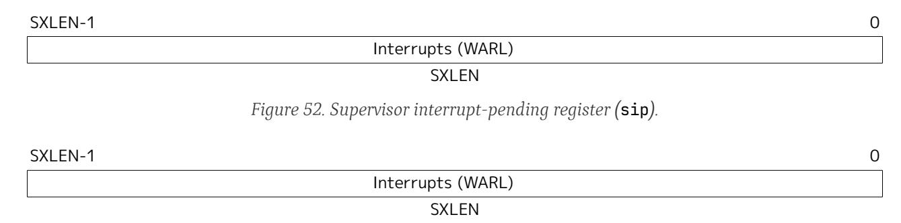

*Figure 53. Supervisor interrupt-enable register (*sie*).*

An interrupt *i* will trap to S-mode if both of the following are true: (a) either the current privilege mode is S and the SIE bit in the sstatus register is set, or the current privilege mode has less privilege than S-mode; and (b) bit *i* is set in both sip and sie.

These conditions for an interrupt trap to occur must be evaluated in a bounded amount of time from when an interrupt becomes, or ceases to be, pending in sip, and must also be evaluated immediately following the execution of an SRET instruction or an explicit write to a CSR on which these interrupt trap conditions expressly depend (including sip, sie and sstatus).

Interrupts to S-mode take priority over any interrupts to lower privilege modes.

Each individual bit in register sip may be writable or may be read-only. When bit *i* in sip is writable, a pending interrupt *i* can be cleared by writing 0 to this bit. If interrupt *i* can become pending but bit *i* in sip is read-only, the implementation must provide some other mechanism for clearing the pending interrupt (which may involve a call to the execution environment).

A bit in sie must be writable if the corresponding interrupt can ever become pending. Bits of sie that are not writable are read-only zero.

The standard portions (bits 15:0) of registers sip and sie are formatted as shown in Figures [Figure 54](#page-125-1) and [Figure 55](#page-126-1) respectively.

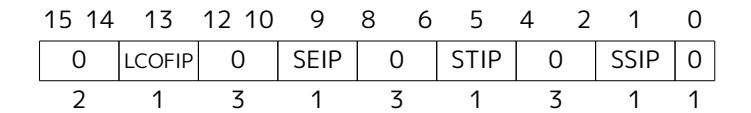

*Figure 54. Standard portion (bits 15:0) of* sip*.*

*Figure 55. Standard portion (bits 15:0) of* sie*.*

Bits sip.SEIP and sie.SEIE are the interrupt-pending and interrupt-enable bits for supervisor-level external interrupts. If implemented, SEIP is read-only in sip, and is set and cleared by the execution environment, typically through a platform-specific interrupt controller.

Bits sip.STIP and sie.STIE are the interrupt-pending and interrupt-enable bits for supervisor-level timer interrupts. If implemented, STIP is read-only in sip. When the Sstc extension is not implemented, STIP is set and cleared by the execution environment. When the Sstc extension is implemented, STIP reflects the timer interrupt signal resulting from stimecmp. The sip.STIP bit, in response to timer interrupts generated by stimecmp, is set by writing stimecmp with a value that is less than or equal to time, and is cleared by writing stimecmp with a value greater than time.

Bits sip.SSIP and sie.SSIE are the interrupt-pending and interrupt-enable bits for supervisor-level software interrupts. If implemented, SSIP is writable in sip and may also be set to 1 by a platform-specific interrupt controller.

If the Sscofpmf extension is implemented, bits sip.LCOFIP and sie.LCOFIE are the interrupt-pending and interrupt-enable bits for local-counter-overflow interrupts. LCOFIP is read-write in sip and reflects the occurrence of a local counter-overflow overflow interrupt request resulting from any of the mhpmevent*n*.OF bits being set. If the Sscofpmf extension is not implemented, sip.LCOFIP and sie.LCOFIE are read-only zeros.

*Interprocessor interrupts are sent to other harts by implementation-specific means, which will ultimately cause the SSIP bit to be set in the recipient hart's* sip *register.*

Each standard interrupt type (SEI, STI, SSI, or LCOFI) may not be implemented, in which case the corresponding interrupt-pending and interrupt-enable bits are read-only zeros. All bits in sip and sie are WARL fields. The implemented interrupts may be found by writing one to every bit location in sie, then reading back to see which bit positions hold a one.

*The* sip *and* sie *registers are subsets of the* mip *and* mie *registers. Reading any implemented field, or writing any writable field, of* sip*/*sie *effects a read or write of the homonymous field of* mip*/*mie*.*

*Bits 3, 7, and 11 of* sip *and* sie *correspond to the machine-mode software, timer, and external interrupts, respectively. Since most platforms will choose not to make these interrupts delegatable from M-mode to S-mode, they are shown as 0 in [Figure 54](#page-125-1) and [Figure 55](#page-126-1).*

Multiple simultaneous interrupts destined for supervisor mode are handled in the following decreasing priority order: SEI, SSI, STI, LCOFI.

#### 12.1.4. Supervisor Timers and Performance Counters

Supervisor software uses the same hardware performance monitoring facility as user-mode software, including the time, cycle, and instret CSRs. The implementation should provide a mechanism to modify the counter values.

The implementation must provide a facility for scheduling timer interrupts in terms of the real-time counter, time.

#### 12.1.5. Counter-Enable (**scounteren**) Register

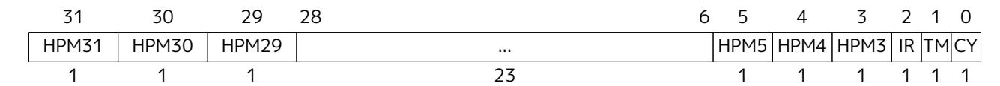

*Figure 56. Counter-enable (*scounteren*) register*

The counter-enable (scounteren) CSR is a 32-bit register that controls the availability of the hardware performance monitoring counters to U-mode.

When the CY, TM, IR, or HPM*n* bit in the scounteren register is clear, attempts to read the cycle, time, instret, or hpmcountern register while executing in U-mode will cause an illegal-instruction exception. When one of these bits is set, access to the corresponding register is permitted.

scounteren must be implemented. However, any of the bits may be read-only zero, indicating reads to the corresponding counter will cause an exception when executing in U-mode. Hence, they are effectively WARL fields.

*The setting of a bit in* mcounteren *does not affect whether the corresponding bit in* scounteren *is writable. However, U-mode may only access a counter if the corresponding bits in* scounteren *and* mcounteren *are both set.*

#### 12.1.6. Supervisor Scratch (**sscratch**) Register

The sscratch CSR is an SXLEN-bit read/write register, dedicated for use by the supervisor. Typically, sscratch is used to hold a pointer to the hart-local supervisor context while the hart is executing user code. At the beginning of a trap handler, software normally uses a CSRRW instruction to swap sscratch with an integer register to obtain an initial working register.

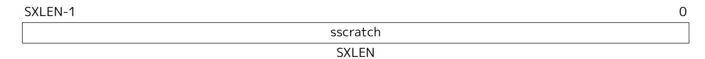

*Figure 57. Supervisor Scratch Register*

#### 12.1.7. Supervisor Exception Program Counter (**sepc**) Register

sepc is an SXLEN-bit read/write CSR formatted as shown in [Figure 58](#page-128-2). The low bit of sepc (sepc[0]) is always zero. On implementations that support only IALIGN=32, the two low bits (sepc[1:0]) are always zero.

If an implementation allows IALIGN to be either 16 or 32 (by changing CSR misa, for example), then, whenever IALIGN=32, bit sepc[1] is masked on reads so that it appears to be 0. This masking occurs also for the implicit read by the SRET instruction. Though masked, sepc[1] remains writable when IALIGN=32.

sepc is a WARL register that must be able to hold all valid virtual addresses. It need not be capable of holding all possible invalid addresses. Prior to writing sepc, implementations may convert an invalid address into some other invalid address that sepc is capable of holding.

When a trap is taken into S-mode, sepc is written with the virtual address of the instruction that was interrupted or that encountered the exception. Otherwise, sepc is never written by the implementation, though it may be explicitly written by software.

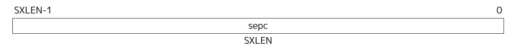

*Figure 58. Supervisor exception program counter register.*

#### 12.1.8. Supervisor Cause (**scause**) Register

The scause CSR is an SXLEN-bit read-write register formatted as shown in [Figure 59.](#page-128-3) When a trap is taken into S-mode, scause is written with a code indicating the event that caused the trap. Otherwise, scause is never written by the implementation, though it may be explicitly written by software.

The Interrupt bit in the scause register is set if the trap was caused by an interrupt. The Exception Code field contains a code identifying the last exception or interrupt. [Table 37](#page-128-1) lists the possible exception codes for the current supervisor ISAs. The Exception Code is a WLRL field. It is required to hold the values 0–31 (i.e., bits 4–0 must be implemented), but otherwise it is only guaranteed to hold supported exception codes.

|   | SXLEN-1   | SXLEN-2                  | 0 |
|---|-----------|--------------------------|---|
|   | Interrupt | Exception Code (WLRL) |   |
| 1 |           | SXLEN-1                  |   |

*Figure 59. Supervisor Cause (*scause*) register.*

*Table 37. Supervisor cause (*scause*) register values after trap. Synchronous exception priorities are given by [Table 17.](#page-59-0)*

| Interrupt | Exception Code Description |                               |
|-----------|----------------------------|-------------------------------|
| 1         | 0                          | Reserved                      |
| 1         | 1                          | Supervisor software interrupt |
| 1         | 2-4                        | Reserved                      |
| 1         | 5                          | Supervisor timer interrupt    |
| 1         | 6-8                        | Reserved                      |
| 1         | 9                          | Supervisor external interrupt |
| 1         | 10-12                      | Reserved                      |
| 1         | 13                         | Counter-overflow interrupt    |
| 1         | 14-15                      | Reserved                      |
| 1         | ≥16                        | Designated for platform use   |

| Interrupt | Exception Code Description |                                |
|-----------|----------------------------|--------------------------------|
| 0         | 0                          | Instruction address misaligned |
| 0         | 1                          | Instruction access fault       |
| 0         | 2                          | Illegal instruction            |
| 0         | 3                          | Breakpoint                     |
| 0         | 4                          | Load address misaligned        |
| 0         | 5                          | Load access fault              |
| 0         | 6                          | Store/AMO address misaligned   |
| 0         | 7                          | Store/AMO access fault         |
| 0         | 8                          | Environment call from U-mode   |
| 0         | 9                          | Environment call from S-mode   |
| 0         | 10-11                      | Reserved                       |
| 0         | 12                         | Instruction page fault         |
| 0         | 13                         | Load page fault                |
| 0         | 14                         | Reserved                       |
| 0         | 15                         | Store/AMO page fault           |
| 0         | 16-17                      | Reserved                       |
| 0         | 18                         | Software check                 |
| 0         | 19                         | Hardware error                 |
| 0         | 20-23                      | Reserved                       |
| 0         | 24-31                      | Designated for custom use      |
| 0         | 32-47                      | Reserved                       |
| 0         | 48-63                      | Designated for custom use      |
| 0         | ≥64                        | Reserved                       |

#### 12.1.9. Supervisor Trap Value (**stval**) Register

The stval CSR is an SXLEN-bit read-write register formatted as shown in [Figure 60](#page-129-1). When a trap is taken into S-mode, stval is written with exception-specific information to assist software in handling the trap. Otherwise, stval is never written by the implementation, though it may be explicitly written by software. The hardware platform will specify which exceptions must set stval informatively, which may unconditionally set it to zero, and which may exhibit either behavior, depending on the underlying event that caused the exception.

If stval is written with a nonzero value when a breakpoint, address-misaligned, access-fault, page-fault, or hardware-error exception occurs on an instruction fetch, load, or store, then stval will contain the faulting virtual address.

On a breakpoint exception raised by an EBREAK or C.EBREAK instruction, stval is written with either zero or the virtual address of the instruction.

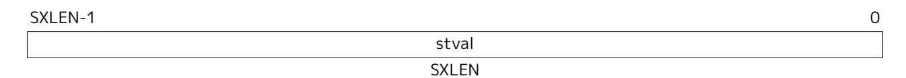

*Figure 60. Supervisor Trap Value register.*

If stval is written with a nonzero value when a misaligned load or store causes an access-fault, page-fault, or hardware-error exception, then stval will contain the virtual address of the portion of the access that caused the fault.

If stval is written with a nonzero value when an instruction access-fault, page-fault, or hardware-error

exception occurs on a hart with variable-length instructions, then stval will contain the virtual address of the portion of the instruction that caused the fault, while sepc will point to the beginning of the instruction.

The stval register can optionally also be used to return the faulting instruction bits on an illegalinstruction exception (sepc points to the faulting instruction in memory). If stval is written with a nonzero value when an illegal-instruction exception occurs, then stval will contain the shortest of:

- ⚫ the actual faulting instruction
- ⚫ the first ILEN bits of the faulting instruction
- ⚫ the first SXLEN bits of the faulting instruction

The value loaded into stval on an illegal-instruction exception is right-justified and all unused upper bits are cleared to zero.

On a trap caused by a software-check exception, the stval register holds the cause for the exception. The following encodings are defined:

- ⚫ 0 No information provided.
- ⚫ 2 Landing Pad Fault. Defined by the Zicfilp extension [\(Section 23.1\)](#page-201-1).
- ⚫ 3 Shadow Stack Fault. Defined by the Zicfiss extension ([Section 23.2\)](#page-203-0).

For other traps, stval is set to zero, but a future standard may redefine stval's setting for other traps.

stval is a WARL register that must be able to hold all valid virtual addresses and the value 0. It need not be capable of holding all possible invalid addresses. Prior to writing stval, implementations may convert an invalid address into some other invalid address that stval is capable of holding. If the feature to return the faulting instruction bits is implemented, stval must also be able to hold all values less than 2*N* , where *N* is the smaller of SXLEN and ILEN.

#### 12.1.10. Supervisor Environment Configuration (**senvcfg**) Register

The senvcfg CSR is an SXLEN-bit read/write register, formatted as shown in [Figure 61,](#page-130-1) that controls certain characteristics of the U-mode execution environment.

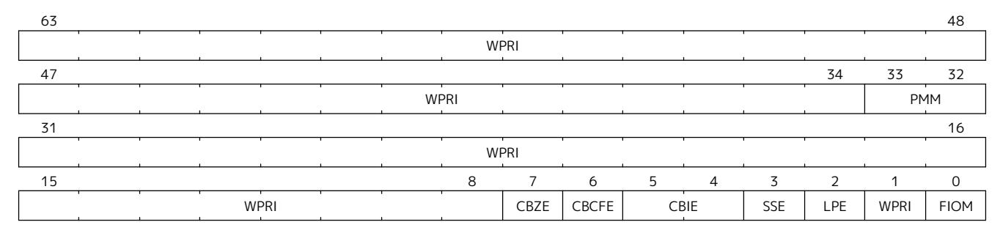

*Figure 61. Supervisor environment configuration register (*senvcfg*) for RV64.*

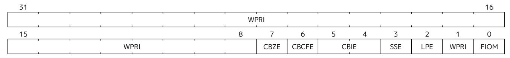

*Figure 62. Supervisor environment configuration register (*senvcfg*) for RV32.*

If bit FIOM (Fence of I/O implies Memory) is set to one in senvcfg, FENCE instructions executed in Umode are modified so the requirement to order accesses to device I/O implies also the requirement to order main memory accesses. [Table 38](#page-131-0) details the modified interpretation of FENCE instruction bits PI, PO, SI, and SO in U-mode when FIOM=1.

Similarly, for U-mode when FIOM=1, if an atomic instruction that accesses a region ordered as device I/O has its *aq* and/or *rl* bit set, then that instruction is ordered as though it accesses both device I/O and memory.

If satp.MODE is read-only zero (always Bare), the implementation may make FIOM read-only zero.

*Table 38. Modified interpretation of FENCE predecessor and successor sets in U-mode when FIOM=1.*

| Instruction bit                                                                                                                | Meaning when set                                                                                               |  |
|--------------------------------------------------------------------------------------------------------------------------------|----------------------------------------------------------------------------------------------------------------|--|
| PI Predecessor device input and memory reads (PR implied) PO Predecessor device output and memory writes (PW implied) |                                                                                                                |  |
| SI SO                                                                                                                       | Successor device input and memory reads (SR implied) Successor device output and memory writes (SW implied) |  |

*Bit FIOM exists for a specific circumstance when an I/O device is being emulated for U-mode and both of the following are true: (a) the emulated device has a memory buffer that should be I/O space but is actually mapped to main memory via address translation, and (b) multiple physical harts are involved in accessing this emulated device from U-mode.*

*A hypervisor running in S-mode without the benefit of the hypervisor extension of [Chapter 22](#page-163-0) may need to emulate a device for U-mode if paravirtualization cannot be employed. If the same hypervisor provides a virtual machine (VM) with multiple virtual harts, mapped one-to-one to real harts, then multiple harts may concurrently access the emulated device, perhaps because: (a) the guest OS within the VM assigns device interrupt handling to one hart while the device is also accessed by a different hart outside of an interrupt handler, or (b) control of the device (or partial control) is being migrated from one hart to another, such as for interrupt load balancing within the VM. For such cases, guest software within the VM is expected to properly coordinate access to the (emulated) device across multiple harts using mutex locks and/or interprocessor interrupts as usual, which in part entails executing I/O fences. But those I/O fences may not be sufficient if some of the device ``I/O'' is actually main memory, unknown to the guest. Setting FIOM=1 modifies those fences (and all other I/O fences executed in U-mode) to include main memory, too.*

*Software can always avoid the need to set FIOM by never using main memory to emulate a device memory buffer that should be I/O space. However, this choice usually requires trapping all U-mode accesses to the emulated buffer, which might have a noticeable impact on performance. The alternative offered by FIOM is sufficiently inexpensive to implement that we consider it worth supporting even if only rarely enabled.*

The Zicboz extension adds the CBZE (Cache Block Zero instruction enable) field to senvcfg. The CBZE field controls execution of the cache block zero instruction (CBO.ZERO) in U-mode. Execution of CBO.ZERO in Umode is enabled only if execution of the instruction is enabled for use in S-mode and CBZE is set to 1; otherwise, an illegal-instruction exception is raised. When the Zicboz extension is not implemented, CBZE is read-only zero.

The Zicbom extension adds the CBCFE (Cache Block Clean and Flush instruction Enable) field to senvcfg to control execution of the CBO.CLEAN and CBO.FLUSH instructions in U-mode. Execution of these instructions in U-mode is enabled only if execution of these instructions is enabled for use in S-mode and CBCFE is set to 1; otherwise, an illegal-instruction exception is raised. When the Zicbom extension is not implemented, CBCFE is read-only zero.

The Zicbom extension adds the CBIE (Cache Block Invalidate instruction Enable) WARL field to senvcfg to

control execution of the CBO.INVAL instruction in U-mode. The encoding 10b is reserved. When the Zicbom extension is not implemented, CBIE is read-only zero. Execution of CBO.INVAL in U-mode is enabled only if execution of the instruction is enabled for use in S-mode and CBIE is set to 01b or 11b; otherwise, an illegalinstruction exception is raised.

If CBO.INVAL is enabled in S-mode to perform a flush operation, then when the instruction is enabled in Umode it performs a flush operation, even if CBIE is set to 11b. Otherwise, the instruction behaves as follows, depending on the CBIE encoding:

- ⚫ 01b The instruction is executed and performs a flush operation.
- ⚫ 11b The instruction is executed and performs an invalidate operation.

If the Ssnpm extension is implemented, the PMM field enables or disables pointer masking (see [Chapter 25\)](#page-208-0) for the next-lower privilege mode (U/VU), according to the values in [Table 39.](#page-132-1) If Ssnpm is not implemented, PMM is read-only zero. The PMM field is read-only zero for RV32.

| Value | Description Pointer masking is disabled (PMLEN = 0)                 |  |
|-------|------------------------------------------------------------------------|--|
| 00    |                                                                        |  |
| 01    | Reserved                                                               |  |
| 10    | Pointer masking is enabled with PMLEN = XLEN - 57 (PMLEN = 7 on RV64)  |  |
| 11    | Pointer masking is enabled with PMLEN = XLEN - 48 (PMLEN = 16 on RV64) |  |

*Table 39. Legal values of* PMM *WARL field*

The Zicfilp extension adds the LPE field in senvcfg. When the LPE field is set to 1, the Zicfilp extension is enabled in VU/U-mode. When the LPE field is 0, the Zicfilp extension is not enabled in VU/U-mode and the following rules apply to VU/U-mode:

- ⚫ The hart does not update the ELP state; it remains as NO\_LP\_EXPECTED.
- ⚫ The LPAD instruction operates as a no-op.

The Zicfiss extension adds the SSE field in senvcfg. When the SSE field is set to 1, the Zicfiss extension is activated in VU/U-mode. When the SSE field is 0, the Zicfiss extension remains inactive in VU/U-mode, and the following rules apply:

- ⚫ 32-bit Zicfiss instructions will revert to their behavior as defined by Zimop.
- ⚫ 16-bit Zicfiss instructions will revert to their behavior as defined by Zcmop.
- ⚫ When menvcfg.SSE is one, SSAMOSWAP.W/D raises an illegal-instruction exception in U-mode and a virtual-instruction exception in VU-mode.

#### 12.1.11. Supervisor Address Translation and Protection (**satp**) Register

The satp CSR is an SXLEN-bit read/write register, formatted as shown in [Figure 63](#page-133-0) for SXLEN=32 and [Figure 64](#page-133-1) for SXLEN=64, which controls supervisor-mode address translation and protection. This register holds the physical page number (PPN) of the root page table, i.e., its supervisor physical address divided by 4 KiB; an address space identifier (ASID), which facilitates address-translation fences on a per-addressspace basis; and the MODE field, which selects the current address-translation scheme. Further details on the access to this register are described in [Section 3.1.6.6](#page-44-0).

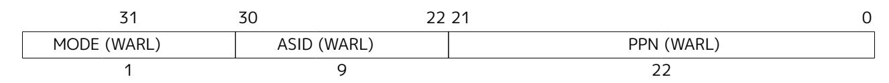

*Figure 63. Supervisor address translation and protection (*satp*) register when SXLEN=32.*

*Storing a PPN in* satp*, rather than a physical address, supports a physical address space larger than 4 GiB for RV32.*

*The* satp*.PPN field might not be capable of holding all physical page numbers. Some platform standards might place constraints on the values* satp*.PPN may assume, e.g., by requiring that all physical page numbers corresponding to main memory be representable.*

| 63     | 59     | 43     |
|--------|--------|--------|
| 60     | 44     | 0      |
| MODE   | ASID   | PPN    |
| (WARL) | (WARL) | (WARL) |
| 4      | 16     |        |

*Figure 64. Supervisor address translation and protection (*satp*) register when SXLEN=64, for MODE values Bare, Sv39, Sv48, and Sv57.*

*We store the ASID and the page table base address in the same CSR to allow the pair to be changed atomically on a context switch. Swapping them non-atomically could pollute the old virtual address space with new translations, or vice-versa. This approach also slightly reduces the cost of a context switch.*

[Table 40](#page-135-1) shows the encodings of the MODE field when SXLEN=32 and SXLEN=64. When MODE=Bare, supervisor virtual addresses are equal to supervisor physical addresses, and there is no additional memory protection beyond the physical memory protection scheme described in [Section 3.7](#page-78-0). To select MODE=Bare, software must write zero to the remaining fields of satp (bits 30–0 when SXLEN=32, or bits 59–0 when SXLEN=64). Attempting to select MODE=Bare with a nonzero pattern in the remaining fields has an UNSPECIFIED effect on the value that the remaining fields assume and an UNSPECIFIED effect on address translation and protection behavior.

When SXLEN=32, the satp encodings corresponding to MODE=Bare and ASID[8:7]=3 are designated for custom use, whereas the encodings corresponding to MODE=Bare and ASID[8:7]≠3 are reserved for future standard use. When SXLEN=64, all satp encodings corresponding to MODE=Bare are reserved for future standard use.

*Version 1.11 of this standard stated that the remaining fields in* satp *had no effect when MODE=Bare. Making these fields reserved facilitates future definition of additional translation and protection modes, particularly in RV32, for which all patterns of the existing MODE field have already been allocated.*

When SXLEN=32, the only other valid setting for MODE is Sv32, a paged virtual-memory scheme described in [Section 12.3](#page-139-0).

When SXLEN=64, three paged virtual-memory schemes are defined: Sv39, Sv48, and Sv57, described in [Section 12.4,](#page-145-0) [Section 12.5,](#page-146-0) and [Section 12.6](#page-147-0), respectively. One additional scheme, Sv64, will be defined in a later version of this specification. The remaining MODE settings are reserved for future use and may define different interpretations of the other fields in satp.

Implementations are not required to support all MODE settings, and if satp is written with an unsupported MODE, the entire write has no effect; no fields in satp are modified.

The number of ASID bits is UNSPECIFIED and may be zero. The number of implemented ASID bits, termed *ASIDLEN*, may be determined by writing one to every bit position in the ASID field, then reading

| back the value in satp to see which bit positions in the ASID field hold a one. The least-significant bits of ASID are implemented first: that is, if ASIDLEN > 0, ASID[ASIDLEN-1:0] is writable. The maximal value of ASIDLEN, termed ASIDMAX, is 9 for Sv32 or 16 for Sv39, Sv48, and Sv57. |
|-----------------------------------------------------------------------------------------------------------------------------------------------------------------------------------------------------------------------------------------------------------------------------------------------------|
|                                                                                                                                                                                                                                                                                                     |
|                                                                                                                                                                                                                                                                                                     |
|                                                                                                                                                                                                                                                                                                     |
|                                                                                                                                                                                                                                                                                                     |
|                                                                                                                                                                                                                                                                                                     |
|                                                                                                                                                                                                                                                                                                     |
|                                                                                                                                                                                                                                                                                                     |
|                                                                                                                                                                                                                                                                                                     |
|                                                                                                                                                                                                                                                                                                     |
|                                                                                                                                                                                                                                                                                                     |
|                                                                                                                                                                                                                                                                                                     |
|                                                                                                                                                                                                                                                                                                     |
|                                                                                                                                                                                                                                                                                                     |
|                                                                                                                                                                                                                                                                                                     |

*Table 40. Encoding of* satp *MODE field.*

|       | SXLEN=32                                                         |                                                          |  |  |  |  |
|-------|------------------------------------------------------------------|----------------------------------------------------------|--|--|--|--|
| Value | Name Description                                              |                                                          |  |  |  |  |
| 0     | Bare                                                             | No translation or protection.                            |  |  |  |  |
| 1     | Sv32                                                             | Page-based 32-bit virtual addressing (see Section 12.3). |  |  |  |  |
|       | SXLEN=64                                                         |                                                          |  |  |  |  |
| Value | Name Description                                              |                                                          |  |  |  |  |
| 0     | Bare                                                             | No translation or protection.                            |  |  |  |  |
| 1-7   | -                                                                | Reserved for standard use                                |  |  |  |  |
| 8     | Sv39                                                             | Page-based 39-bit virtual addressing (see Section 12.4). |  |  |  |  |
| 9     | Sv48 Page-based 48-bit virtual addressing (see Section 12.5). |                                                          |  |  |  |  |
| 10    | Sv57 Page-based 57-bit virtual addressing (see Section 12.6). |                                                          |  |  |  |  |
| 11    | Sv64                                                             | Reserved for page-based 64-bit virtual addressing.       |  |  |  |  |
| 12-13 | -                                                                | Reserved for standard use                                |  |  |  |  |
| 14-15 | -                                                                | Designated for custom use                                |  |  |  |  |

*For many applications, the choice of page size has a substantial performance impact. A large page size increases TLB reach and loosens the associativity constraints on virtually indexed, physically tagged caches. At the same time, large pages exacerbate internal fragmentation, wasting physical memory and possibly cache capacity.*

*After much deliberation, we have settled on a conventional page size of 4 KiB for both RV32 and RV64. We expect this decision to ease the porting of low-level runtime software and device drivers. The TLB reach problem is ameliorated by transparent superpage support in modern operating systems. ([Navarro et al., 2002\)](#page-220-2) Additionally, multi-level TLB hierarchies are quite inexpensive relative to the multi-level cache hierarchies whose address space they map.*

The satp CSR is considered *active* when the effective privilege mode is S-mode or U-mode. Executions of the address-translation algorithm may only begin using a given value of satp when satp is active.

*Translations that began while* satp *was active are not required to complete or terminate when* satp *is no longer active, unless an SFENCE.VMA instruction matching the address and ASID is executed. The SFENCE.VMA instruction must be used to ensure that updates to the addresstranslation data structures are observed by subsequent implicit reads to those structures by a hart.*

Note that writing satp does not imply any ordering constraints between page-table updates and subsequent address translations, nor does it imply any invalidation of address-translation caches. If the new address space's page tables have been modified, or if an ASID is reused, it may be necessary to execute an SFENCE.VMA instruction (see [Section 12.2.1\)](#page-136-1) after, or in some cases before, writing satp.

*Not imposing upon implementations to flush address-translation caches upon* satp *writes reduces the cost of context switches, provided a sufficiently large ASID space.*

#### 12.1.12. Supervisor Timer (**stimecmp**) Register

The stimecmp CSR is a 64-bit register and has 64-bit precision on all RV32 and RV64 systems. In RV32 only, accesses to the stimecmp CSR access the low 32 bits, while accesses to the stimecmph CSR access the high 32 bits of stimecmp.

A supervisor timer interrupt becomes pending, as reflected in the STIP bit in the mip and sip registers whenever time contains a value greater than or equal to stimecmp, treating the values as unsigned integers. If the result of this comparison changes, it is guaranteed to be reflected in STIP eventually, but not necessarily immediately. The interrupt remains posted until stimecmp becomes greater than time, typically as a result of writing stimecmp. The interrupt will be taken based on the standard interrupt enable and delegation rules.

*A spurious timer interrupt might occur if an interrupt handler advances* stimecmp *then immediately returns, because STIP might not yet have fallen in the interim. All software should be written to assume this event is possible, but most software should assume this event is extremely unlikely. It is almost always more performant to incur an occasional spurious timer interrupt than to poll STIP until it falls.*

*In systems in which a supervisor execution environment (SEE) provides timer facilities via an SBI function call, this SBI call will continue to support requests to schedule a timer interrupt. The SEE will simply make use of stimecmp, changing its value as appropriate. This ensures compatibility with existing S-mode software that uses this SEE facility, while new S-mode software takes advantage of stimecmp directly.)*

## 12.2. Supervisor Instructions

In addition to the SRET instruction defined in [Section 3.3.2,](#page-69-2) one new supervisor-level instruction is provided.

#### 12.2.1. Supervisor Memory-Management Fence Instruction

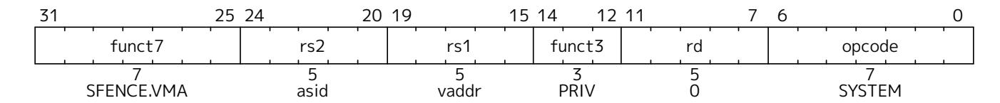

The supervisor memory-management fence instruction SFENCE.VMA is used to synchronize updates to in-memory memory-management data structures with current execution. Instruction execution causes implicit reads and writes to these data structures; however, these implicit references are ordinarily not ordered with respect to explicit loads and stores. Executing an SFENCE.VMA instruction guarantees that any previous stores already visible to the current RISC-V hart are ordered before certain implicit references by subsequent instructions in that hart to the memory-management data structures. The specific set of operations ordered by SFENCE.VMA is determined by *rs1* and *rs2*, as described below. SFENCE.VMA is also used to invalidate entries in the address-translation cache associated with a hart (see [Section 12.3.2](#page-143-0)). Further details on the behavior of this instruction are described in [Section 3.1.6.6](#page-44-0) and [Section 3.7.2](#page-82-0).

*The SFENCE.VMA is used to flush any local hardware caches related to address translation. It is specified as a fence rather than a TLB flush to provide cleaner semantics with respect to which instructions are affected by the flush operation and to support a wider variety of dynamic caching structures and memory-management schemes. SFENCE.VMA is also used by higher privilege levels to synchronize page table writes and the address translation hardware.*

SFENCE.VMA orders only the local hart's implicit references to the memory-management data structures.

*Consequently, other harts must be notified separately when the memory-management data structures have been modified. One approach is to use 1) a local data fence to ensure local writes are visible globally, then 2) an interprocessor interrupt to the other thread, then 3) a local SFENCE.VMA in the interrupt handler of the remote thread, and finally 4) signal back to originating thread that operation is complete. This is, of course, the RISC-V analog to a TLB shootdown.*

For the common case that the translation data structures have only been modified for a single address mapping (i.e., one page or superpage), *rs1* can specify a virtual address within that mapping to effect a translation fence for that mapping only. Furthermore, for the common case that the translation data structures have only been modified for a single address-space identifier, *rs2* can specify the address space. The behavior of SFENCE.VMA depends on *rs1* and *rs2* as follows:

- ⚫ If *rs1*=x0 and *rs2*=x0, the fence orders all reads and writes made to any level of the page tables, for all address spaces. The fence also invalidates all address-translation cache entries, for all address spaces.
- ⚫ If *rs1*=x0 and *rs2*≠x0, the fence orders all reads and writes made to any level of the page tables, but only for the address space identified by integer register *rs2*. Accesses to *global* mappings (see [Section 12.3.1\)](#page-139-1) are not ordered. The fence also invalidates all address-translation cache entries matching the address space identified by integer register *rs2*, except for entries containing global mappings.
- ⚫ If *rs1*≠x0 and *rs2*=x0, the fence orders only reads and writes made to leaf page table entries corresponding to the virtual address in *rs1*, for all address spaces. The fence also invalidates all addresstranslation cache entries that contain leaf page table entries corresponding to the virtual address in *rs1*, for all address spaces.
- ⚫ If *rs1*≠x0 and *rs2*≠x0, the fence orders only reads and writes made to leaf page table entries corresponding to the virtual address in *rs1*, for the address space identified by integer register *rs2*. Accesses to global mappings are not ordered. The fence also invalidates all address-translation cache entries that contain leaf page table entries corresponding to the virtual address in *rs1* and that match the address space identified by integer register *rs2*, except for entries containing global mappings.

If the value held in *rs1* is not a valid virtual address, then the SFENCE.VMA instruction has no effect. No exception is raised in this case.

*It is always legal to over-fence, e.g., by fencing only based on a subset of the bits in rs1 and/or rs2, and/or by simply treating all SFENCE.VMA instructions as having rs1=*x0 *and/or rs2=*x0*. For example, simpler implementations can ignore the virtual address in rs1 and the ASID value in rs2 and always perform a global fence. The choice not to raise an exception when an invalid virtual address is held in rs1 facilitates this type of simplification.*

When *rs2*≠x0, bits SXLEN-1:ASIDMAX of the value held in *rs2* are reserved for future standard use. Until their use is defined by a standard extension, they should be zeroed by software and ignored by current implementations. Furthermore, if ASIDLEN<ASIDMAX, the implementation shall ignore bits ASIDMAX-1:ASIDLEN of the value held in *rs2*.

An implicit read of the memory-management data structures may return any translation for an address that was valid at any time since the most recent SFENCE.VMA that subsumes that address. The ordering implied by SFENCE.VMA does not place implicit reads and writes to the memory-management data structures into the global memory order in a way that interacts cleanly with the standard RVWMO ordering rules. In particular, even though an SFENCE.VMA orders prior explicit accesses before subsequent implicit accesses, and those implicit accesses are ordered before their associated explicit accesses, SFENCE.VMA does not necessarily place prior explicit accesses before subsequent explicit accesses in the global memory order. These implicit loads also need not otherwise obey normal program order semantics with respect to prior loads or stores to the same address.

> *A consequence of this specification is that an implementation may use any translation for an address that was valid at any time since the most recent SFENCE.VMA that subsumes that address.*

*For example, if a leaf PTE is modified and the corresponding virtual address is accessed without a subsuming SFENCE.VMA having been executed in between, then either the new translation or any older translation since the last subsuming SFENCE.VMA was executed will* *be used. It is unpredictable which translation will be chosen from that set, and subsequent accesses to the same virtual address might use different translations from that set. But the behavior of such accesses is otherwise well defined.*

*This property applies even if the virtual-address width for that translation differs from the width currently specified by* satp*.MODE. For a given virtual address and ASID, any translation since the last subsuming SFENCE.VMA might be used, even if that translation used a virtual address of a different width. Similarly, for a given virtual address, any global translation since the last subsuming SFENCE.VMA might be used, regardless of both ASID and virtual-address width.*

*In a conventional TLB design, it is possible for multiple entries to match a single address if, for example, a page is upgraded to a superpage without first clearing the original non-leaf PTE's valid bit and executing an SFENCE.VMA with rs1=*x0*. In this case, a similar remark applies: it is unpredictable whether the old non-leaf PTE or the new leaf PTE is used, but the behavior is otherwise well defined.*

*Another consequence of this specification is that it is generally unsafe to update a PTE using a set of stores of a width less than the width of the PTE, as it is legal for the implementation to read the PTE at any time, including when only some of the partial stores have taken effect.*

*This specification permits the caching of PTEs whose V (Valid) bit is clear. Operating systems must be written to cope with this possibility, but implementers are reminded that eagerly caching invalid PTEs will reduce performance by causing additional page faults.*

Implementations must only perform implicit reads of the translation data structures pointed to by the current contents of the satp register or a subsequent valid (V=1) translation data structure entry, and must only raise exceptions for implicit accesses that are generated as a result of instruction execution, not those that are performed speculatively.

Changes to the sstatus fields SUM and MXR take effect immediately, without the need to execute an SFENCE.VMA instruction. Changing satp.MODE from Bare to other modes and vice versa also takes effect immediately, without the need to execute an SFENCE.VMA instruction. Likewise, changes to satp.ASID take effect immediately.

*The following common situations typically require executing an SFENCE.VMA instruction:*

- ⚫ *When software recycles an ASID (i.e., reassociates it with a different page table), it should first change* satp *to point to the new page table using the recycled ASID, then execute SFENCE.VMA with rs1=*x0 *and rs2 set to the recycled ASID. Alternatively, software can execute the same SFENCE.VMA instruction while a different ASID is loaded into* satp*, provided the next time* satp *is loaded with the recycled ASID, it is simultaneously loaded with the new page table.*
- ⚫ *If the implementation does not provide ASIDs, or software chooses to always use ASID 0, then after every* satp *write, software should execute SFENCE.VMA with rs1=*x0*. In the common case that no global translations have been modified, rs2 should be set to a register other than* x0 *but which contains the value zero, so that global translations are not flushed.*
- ⚫ *If software modifies a non-leaf PTE, it should execute SFENCE.VMA with rs1=*x0*. If any PTE along the traversal path had its G bit set, rs2 must be* x0*; otherwise, rs2 should be set to the ASID for which the translation is being modified.*
- ⚫ *If software modifies a leaf PTE, it should execute SFENCE.VMA with rs1 set to a virtual*

*address within the page. If any PTE along the traversal path had its G bit set, rs2 must be* x0*; otherwise, rs2 should be set to the ASID for which the translation is being modified.*

⚫ *For the special cases of increasing the permissions on a leaf PTE and changing an invalid PTE to a valid leaf, software may choose to execute the SFENCE.VMA lazily. After modifying the PTE but before executing SFENCE.VMA, either the new or old permissions will be used. In the latter case, a page-fault exception might occur, at which point software should execute SFENCE.VMA in accordance with the previous bullet point.*

If a hart employs an address-translation cache, that cache must appear to be private to that hart. In particular, the meaning of an ASID is local to a hart; software may choose to use the same ASID to refer to different address spaces on different harts.

*A future extension could redefine ASIDs to be global across the SEE, enabling such options as shared translation caches and hardware support for broadcast TLB shootdown. However, as OSes have evolved to significantly reduce the scope of TLB shootdowns using novel ASIDmanagement techniques, we expect the local-ASID scheme to remain attractive for its simplicity and possibly better scalability.*

For implementations that make satp.MODE read-only zero (always Bare), attempts to execute an SFENCE.VMA instruction might raise an illegal-instruction exception.

No SFENCE.VMA is required after enabling or disabling pointer masking (see [Chapter 25](#page-208-0)), as pointer masking applies to the effective address only and does not affect any memory-management data structures.

## 12.3. Sv32: Page-Based 32-bit Virtual-Memory Systems

When Sv32 is written to the MODE field in the satp register (see [Section 12.1.11\)](#page-132-0), the supervisor operates in a 32-bit paged virtual-memory system. In this mode, supervisor and user virtual addresses are translated into supervisor physical addresses by traversing a radix-tree page table. Sv32 is supported when SXLEN=32 and is designed to include mechanisms sufficient for supporting modern Unix-based operating systems.

> *The initial RISC-V paged virtual-memory architectures have been designed as straightforward implementations to support existing operating systems. We have architected page table layouts to support a hardware page-table walker. Software TLB refills are a performance bottleneck on high-performance systems, and are especially troublesome with decoupled specialized coprocessors. An implementation can choose to implement software TLB refills using a machine-mode trap handler as an extension to M-mode.*

*Some ISAs architecturally expose virtually indexed, physically tagged caches, in that accesses to the same physical address via different virtual addresses might not be coherent unless the virtual addresses lie within the same cache set. Implicitly, this specification does not permit such behavior to be architecturally exposed.*

### 12.3.1. Addressing and Memory Protection

Sv32 implementations support a 32-bit virtual address space, divided into pages. An Sv32 virtual address is partitioned into a virtual page number (VPN) and page offset, as shown in [Figure 65.](#page-140-1) When Sv32 virtual memory mode is selected in the MODE field of the satp register, supervisor virtual addresses are translated into supervisor physical addresses via a two-level page table. The 20-bit VPN is translated into a 22-bit physical page number (PPN), while the 12-bit page offset is untranslated. The resulting supervisor-level physical addresses are then checked using any physical memory protection structures [\(Section 3.7](#page-78-0)), before being directly converted to machine-level physical addresses. If necessary, supervisor-level physical addresses are zero-extended to the number of physical address bits found in the implementation.

*For example, consider an RV32 system supporting 34 bits of physical address. When the value of* satp*.MODE is Sv32, a 34-bit physical address is produced directly, and therefore no zero extension is needed. When the value of* satp*.MODE is Bare, the 32-bit virtual address is translated (unmodified) into a 32-bit physical address, and then that physical address is zeroextended into a 34-bit machine-level physical address.*

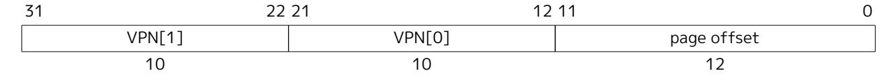

*Figure 65. Sv32 virtual address.*

Sv32 page tables consist of 210 page-table entries (PTEs), each of four bytes. A page table is exactly the size of a page and must always be aligned to a page boundary. The physical page number of the root page table is stored in the satp register.

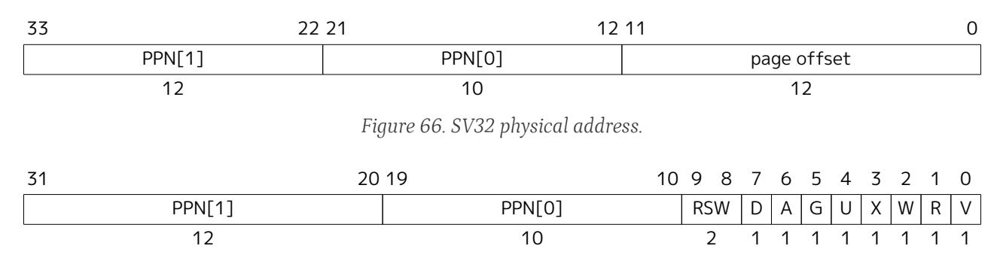

*Figure 67. Sv32 page table entry.*

The PTE format for Sv32 is shown in [Figure 67](#page-140-0). The V bit indicates whether the PTE is valid; if it is 0, all other bits in the PTE are don't-cares and may be used freely by software. The permission bits, R, W, and X, indicate whether the page is readable, writable, and executable, respectively. When all three are zero, the PTE is a pointer to the next level of the page table; otherwise, it is a leaf PTE. Writable pages must also be marked readable; the contrary combinations are reserved for future use. [Table 41](#page-140-2) summarizes the encoding of the permission bits.

X W R Meaning 0 0 0 0 1 1 1 0 0 1 1 0 0 1 0 1 0 1 0 1 0 Pointer to next level of page table. Read-only page. *Reserved for future use.* Read-write page. Execute-only page. Read-execute page. *Reserved for future use.*

*Table 41. Encoding of PTE R/W/X fields.*

Attempting to fetch an instruction from a page that does not have execute permissions raises a fetch pagefault exception. Attempting to execute a load, load-reserved, or cache-block management instruction whose effective address lies within a page without read permissions raises a load page-fault exception. Attempting to execute a store, store-conditional, AMO, or cache-block zero instruction instruction whose effective address lies within a page without write permissions raises a store page-fault exception.

Read-write-execute page.

1

1

1

*AMOs never raise load page-fault exceptions. Since any unreadable page is also unwritable, attempting to perform an AMO on an unreadable page always raises a store page-fault exception.*

The U bit indicates whether the page is accessible to user mode. U-mode software may only access the page when U=1. If the SUM bit in the sstatus register is set, supervisor mode software may also access pages with U=1. However, supervisor code normally operates with the SUM bit clear, in which case, supervisor code will fault on accesses to user-mode pages. Irrespective of SUM, the supervisor may not execute code on pages with U=1.

*An alternative PTE format would support different permissions for supervisor and user. We omitted this feature because it would be largely redundant with the SUM mechanism (see [Section 12.1.1.2](#page-122-1)) and would require more encoding space in the PTE.*

The G bit designates a *global* mapping. Global mappings are those that exist in all address spaces. For nonleaf PTEs, the global setting implies that all mappings in the subsequent levels of the page table are global. Note that failing to mark a global mapping as global merely reduces performance, whereas marking a nonglobal mapping as global is a software bug that, after switching to an address space with a different nonglobal mapping for that address range, can unpredictably result in either mapping being used.

*Global mappings need not be stored redundantly in address-translation caches for multiple ASIDs. Additionally, they need not be flushed from local address-translation caches when an SFENCE.VMA instruction is executed with rs2≠*x0*.*

The RSW field is reserved for use by supervisor software; the implementation shall ignore this field.

Each leaf PTE contains an accessed (A) and dirty (D) bit. The A bit indicates the virtual page has been read, written, or fetched from since the last time the A bit was cleared. The D bit indicates the virtual page has been written since the last time the D bit was cleared.

Two schemes to manage the A and D bits are defined:

- ⚫ The *Svade* extension: when a virtual page is accessed and the A bit is clear, or is written and the D bit is clear, a page-fault exception is raised.
- ⚫ When the Svade extension is not implemented, the following scheme applies.

When a virtual page is accessed and the A bit is clear, the PTE is updated to set the A bit. When the virtual page is written and the D bit is clear, the PTE is updated to set the D bit. When G-stage address translation is in use and is not Bare, the G-stage virtual pages may be accessed or written by implicit accesses to VS-level memory management data structures, such as page tables.

When two-stage address translation is in use, an explicit access may cause both VS-stage and G-stage PTEs to be updated. The following rules apply to all PTE updates caused by an explicit or an implicit memory accesses.

The PTE update must be atomic with respect to other accesses to the PTE, and must atomically perform all page-table walk checks for that leaf PTE as part of, and before, conditionally updating the PTE value. Updates of the A bit may be performed as a result of speculation, even if the associated memory access ultimately is not performed architecturally. However, updates to the D bit, resulting from an explicit store, must be exact (i.e., non-speculative), and observed in program order by the local hart. When two-stage address translation is active, updates to the D bit in G-stage PTEs may be performed by an implicit access to a VS-stage PTE, if the G-stage PTE provides write permission, before any speculative access to the VS-stage PTE.

The PTE update must appear in the global memory order before the memory access that caused the PTE update and before any subsequent explicit memory access to that virtual page by the local hart. The ordering on loads and stores provided by FENCE instructions and the acquire/release bits on atomic instructions also orders the PTE updates associated with those loads and stores as observed by remote harts.

The PTE update is not required to be atomic with respect to the memory access that caused the update and a trap may occur between the PTE update and the memory access that caused the PTE update. If a trap occurs then the A and/or D bit may be updated but the memory access that caused the PTE update might not occur. The hart must not perform the memory access that caused the PTE update before the PTE update is globally visible.

The page tables must be located in memory with hardware page-table write access and *RsrvEventual* PMA.

All harts in a system must employ the same PTE-update scheme as each other.

*The PTE updates due to memory accesses ordered-after a FENCE are not themselves ordered by the FENCE.*

*Simpler implementations may order the Page Table Entry (PTE) update to precede all subsequent explicit memory accesses, as opposed to ensuring that the PTE update is precisely sequenced before subsequent explicit memory accesses to the associated virtual page.*

*Prior versions of this specification required PTE A bit updates to be exact, but allowing the A bit to be updated as a result of speculation simplifies the implementation of address translation prefetchers. System software typically uses the A bit as a page replacement policy hint, but does not require exactness for functional correctness. On the other hand, D bit updates are still required to be exact and performed in program order, as the D bit affects the functional correctness of page eviction.*

*Implementations are of course still permitted to perform both A and D bit updates only in an exact manner.*

*In both cases, requiring atomicity ensures that the PTE update will not be interrupted by other intervening writes to the page table, as such interruptions could lead to A/D bits being set on PTEs that have been reused for other purposes, on memory that has been reclaimed for other purposes, and so on. Simple implementations may instead generate page-fault exceptions.*

*The A and D bits are never cleared by the implementation. If the supervisor software does not rely on accessed and/or dirty bits, e.g. if it does not swap memory pages to secondary storage or if the pages are being used to map I/O space, it should always set them to 1 in the PTE to improve performance.*

Any level of PTE may be a leaf PTE, so in addition to 4 KiB pages, Sv32 supports 4 MiB *megapages*. A megapage must be virtually and physically aligned to a 4 MiB boundary; a page-fault exception is raised if the physical address is insufficiently aligned.

For non-leaf PTEs, the D, A, and U bits are reserved for future standard use. Until their use is defined by a standard extension, they must be cleared by software for forward compatibility.

For implementations with both page-based virtual memory and the "A" standard extension, the LR/SC reservation set must lie completely within a single base physical page (i.e., a naturally aligned 4 KiB

physical-memory region).

On some implementations, misaligned loads, stores, and instruction fetches may also be decomposed into multiple accesses, some of which may succeed before a page-fault exception occurs. In particular, a portion of a misaligned store that passes the exception check may become visible, even if another portion fails the exception check. The same behavior may manifest for stores wider than XLEN bits (e.g., the FSD instruction in RV32D), even when the store address is naturally aligned.

#### 12.3.2. Virtual Address Translation Process

A virtual address *va* is translated into a physical address *pa* as follows:

- 1. Let *a* be satp.*ppn*×PAGESIZE, and let *i*=LEVELS-1. (For Sv32, PAGESIZE=212 and LEVELS=2.) The satp register must be *active*, i.e., the effective privilege mode must be S-mode or U-mode.
- 2. Let *pte* be the value of the PTE at address *a*+*va*.*vpn*[*i*]×PTESIZE. (For Sv32, PTESIZE=4.) If accessing *pte* violates a PMA or PMP check, raise an access-fault exception corresponding to the original access type.
- 3. If *pte*.*v*=0, or if *pte*.*r*=0 and *pte*.*w*=1, or if any bits or encodings that are reserved for future standard use are set within *pte*, stop and raise a page-fault exception corresponding to the original access type.
- 4. Otherwise, the PTE is valid. If *pte*.*r*=1 or *pte*.*x*=1, go to step 5. Otherwise, this PTE is a pointer to the next level of the page table. Let *i=i*-1. If *i*<0, stop and raise a page-fault exception corresponding to the original access type. Otherwise, let *a*=*pte*.*ppn*×PAGESIZE and go to step 2.
- 5. A leaf PTE has been reached. If *i>0* and *pte*.*ppn*[*i*-1:0] ≠ 0, this is a misaligned superpage; stop and raise a page-fault exception corresponding to the original access type.
- 6. Determine if the requested memory access is allowed by the *pte*.*u* bit, given the current privilege mode and the value of the SUM and MXR fields of the mstatus register. If not, stop and raise a page-fault exception corresponding to the original access type.
- 7. Determine if the requested memory access is allowed by the *pte*.*r*, *pte*.*w*, and *pte*.*x* bits, given the Shadow Stack Memory Protection rules. If not, stop and raise an access-fault exception.
- 8. Determine if the requested memory access is allowed by the *pte*.*r*, *pte*.*w*, and *pte*.*x* bits. If not, stop and raise a page-fault exception corresponding to the original access type.
- 9. If *pte*.*a*=0, or if the original memory access is a store and *pte*.*d*=0:
  - ⚫ If the Svade extension is implemented, stop and raise a page-fault exception corresponding to the original access type.
  - ⚫ If a store to the PTE at address *a*+*va.vpn*[*i*]×PTESIZE would violate a PMA or PMP check, raise an access-fault exception corresponding to the original access type.
  - ⚫ Perform the following steps atomically:
    - Compare *pte* to the value of the PTE at address *a*+*va.vpn*[*i*]×PTESIZE.
    - If the values match, set *pte*.*a* to 1 and, if the original memory access is a store, also set *pte*.*d* to 1. Then store *pte* to the PTE at address *a*+*va.vpn*[*i*]×PTESIZE.
    - If the comparison fails, return to step 2.
- 10. The translation is successful. The translated physical address is given as follows:
  - ⚫ *pa.pgoff* = *va.pgoff*.
  - ⚫ If *i*>0, then this is a superpage translation and *pa.ppn*[*i*-1:0] = *va.vpn*[*i*-1:0].
  - ⚫ *pa.ppn*[LEVELS-1:*i*] = *pte*.*ppn*[LEVELS-1:*i*].

All implicit accesses to the address-translation data structures in this algorithm are performed using width

PTESIZE.

*This implies, for example, that an Sv48 implementation may not use two separate 4 B reads to non-atomically access a single 8 B PTE, and that A/D bit updates performed by the implementation are treated as atomically updating the entire PTE, rather than just the A and/or D bit alone (even though the PTE value does not otherwise change).*

The results of implicit address-translation reads in step 2 may be held in a read-only, incoherent *addresstranslation cache* but not shared with other harts. The address-translation cache may hold an arbitrary number of entries, including an arbitrary number of entries for the same address and ASID. Entries in the address-translation cache may then satisfy subsequent step 2 reads if the ASID associated with the entry matches the ASID loaded in step 0 or if the entry is associated with a *global* mapping. To ensure that implicit reads observe writes to the same memory locations, an SFENCE.VMA instruction must be executed after the writes to flush the relevant cached translations.

The address-translation cache cannot be used in step 9; accessed and dirty bits may only be updated in memory directly.

*It is permitted for multiple address-translation cache entries to co-exist for the same address. This represents the fact that in a conventional TLB hierarchy, it is possible for multiple entries to match a single address if, for example, a page is upgraded to a superpage without first clearing the original non-leaf PTE's valid bit and executing an SFENCE.VMA with rs1=*x0*, or if multiple TLBs exist in parallel at a given level of the hierarchy. In this case, just as if an SFENCE.VMA is not executed between a write to the memory-management tables and subsequent implicit read of the same address: it is unpredictable whether the old non-leaf PTE or the new leaf PTE is used, but the behavior is otherwise well defined.*

Implementations may also execute the address-translation algorithm speculatively at any time, for any virtual address, as long as satp is active (as defined in [Section 12.1.11](#page-132-0)). Such speculative executions have the effect of pre-populating the address-translation cache.

Speculative executions of the address-translation algorithm behave as non-speculative executions of the algorithm do, except that they must not set the dirty bit for a PTE, they must not trigger an exception, and they must not create address-translation cache entries if those entries would have been invalidated by any SFENCE.VMA instruction executed by the hart since the speculative execution of the algorithm began.

> *For instance, it is illegal for both non-speculative and speculative executions of the translation algorithm to begin, read the level 2 page table, pause while the hart executes an SFENCE.VMA with rs1=rs2=*x0*, then resume using the now-stale level 2 PTE, as subsequent implicit reads could populate the address-translation cache with stale PTEs.*

*In many implementations, an SFENCE.VMA instruction with rs1=*x0 *will therefore either terminate all previously-launched speculative executions of the address-translation algorithm (for the specified ASID, if applicable), or simply wait for them to complete (in which case any address-translation cache entries created will be invalidated by the SFENCE.VMA as appropriate). Likewise, an SFENCE.VMA instruction with rs1≠*x0 *generally must either ensure that previously-launched speculative executions of the address-translation algorithm (for the specified ASID, if applicable) are prevented from creating new address-translation cache entries mapping leaf PTEs, or wait for them to complete.*

*A consequence of implementations being permitted to read the translation data structures arbitrarily early and speculatively is that at any time, all page table entries reachable by executing the algorithm may be loaded into the address-translation cache.*

*Although it would be uncommon to place page tables in non-idempotent memory, there is no*

*explicit prohibition against doing so. Since the algorithm may only touch page tables reachable from the root page table indicated in* satp*, the range of addresses that an implementation's page-table walker will touch is fully under supervisor control.*

*The algorithm does not admit the possibility of ignoring high-order PPN bits for implementations with narrower physical addresses.*

## 12.4. Sv39: Page-Based 39-bit Virtual-Memory System

This section describes a simple paged virtual-memory system for SXLEN=64, which supports 39-bit virtual address spaces. The design of Sv39 follows the overall scheme of Sv32, and this section details only the differences between the schemes.

*We specified multiple virtual memory systems for RV64 to relieve the tension between providing a large address space and minimizing address-translation cost. For many systems, 39 bits of virtual-address space is ample, and so Sv39 suffices. Sv48 increases the virtual address space to 48 bits, but increases the physical memory capacity dedicated to page tables, the latency of page-table traversals, and the size of hardware structures that store virtual addresses. Sv57 increases the virtual address space, page table capacity requirement, and translation latency even further.*

#### 12.4.1. Addressing and Memory Protection

Sv39 implementations support a 39-bit virtual address space, divided into pages. An Sv39 address is partitioned as shown in [Figure 68](#page-145-2). Instruction fetch addresses and load and store effective addresses, which are 64 bits, must have bits 63–39 all equal to bit 38, or else a page-fault exception will occur. The 27 bit VPN is translated into a 44-bit PPN via a three-level page table, while the 12-bit page offset is untranslated.

*When mapping between narrower and wider addresses, RISC-V zero-extends a narrower physical address to a wider size. The mapping between 64-bit virtual addresses and the 39-bit usable address space of Sv39 is not based on zero extension but instead follows an entrenched convention that allows an OS to use one or a few of the most-significant bits of a full-size (64 bit) virtual address to quickly distinguish user and supervisor address regions.*

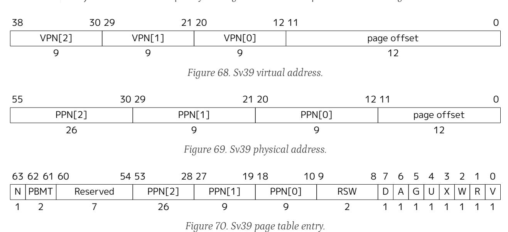

Sv39 page tables contain 2 9 page table entries (PTEs), eight bytes each. A page table is exactly the size of a page and must always be aligned to a page boundary. The physical page number of the root page table is stored in the satp register's PPN field.

The PTE format for Sv39 is shown in [Figure 70](#page-145-3). Bits 9-0 have the same meaning as for Sv32. Bit 63 is reserved for use by the Svnapot extension in [Chapter 13.](#page-149-0) If Svnapot is not implemented, bit 63 remains reserved and must be zeroed by software for forward compatibility, or else a page-fault exception is raised. Bits 62-61 are reserved for use by the Svpbmt extension in [Chapter 14](#page-151-0). If Svpbmt is not implemented, bits 62-61 remain reserved and must be zeroed by software for forward compatibility, or else a page-fault exception is raised. Bits 60-54 are reserved for future standard use and, until their use is defined by some standard extension, must be zeroed by software for forward compatibility. If any of these bits are set, a page-fault exception is raised.

*We reserved several PTE bits for a possible extension that improves support for sparse address spaces by allowing page-table levels to be skipped, reducing memory usage and TLB refill latency. These reserved bits may also be used to facilitate research experimentation. The cost is reducing the physical address space, but is presently ample. When it no longer suffices, the reserved bits that remain unallocated could be used to expand the physical address space.*

Any level of PTE may be a leaf PTE, so in addition to 4 KiB pages, Sv39 supports 2 MiB megapages and 1 GiB gigapages, each of which must be virtually and physically aligned to a boundary equal to its size. A page-fault exception is raised if the physical address is insufficiently aligned.

The algorithm for virtual-to-physical address translation is the same as in [Section 12.3.2,](#page-143-0) except LEVELS equals 3 and PTESIZE equals 8.

## 12.5. Sv48: Page-Based 48-bit Virtual-Memory System

This section describes a simple paged virtual-memory system for SXLEN=64, which supports 48-bit virtual address spaces. Sv48 is intended for systems for which a 39-bit virtual address space is insufficient. It closely follows the design of Sv39, simply adding an additional level of page table, and so this chapter only details the differences between the two schemes.

Implementations that support Sv48 must also support Sv39.

*Systems that support Sv48 can also support Sv39 at essentially no cost, and so should do so to maintain compatibility with supervisor software that assumes Sv39.*

#### 12.5.1. Addressing and Memory Protection

Sv48 implementations support a 48-bit virtual address space, divided into pages. An Sv48 address is partitioned as shown in [Figure 71.](#page-146-2) Instruction fetch addresses and load and store effective addresses, which are 64 bits, must have bits 63–48 all equal to bit 47, or else a page-fault exception will occur. The 36-bit VPN is translated into a 44-bit PPN via a four-level page table, while the 12-bit page offset is untranslated.

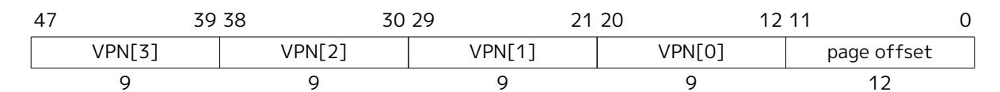

*Figure 71. Sv48 virtual address.*

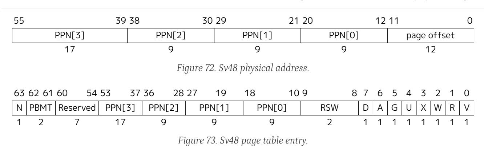

The PTE format for Sv48 is shown in [Figure 73](#page-147-2). Bits 63-54 and 9-0 have the same meaning as for Sv39. Any level of PTE may be a leaf PTE, so in addition to 4 KiB pages, Sv48 supports 2 MiB megapages, 1 GiB gigapages, and 512 GiB terapages, each of which must be virtually and physically aligned to a boundary equal to its size. A page-fault exception is raised if the physical address is insufficiently aligned.

The algorithm for virtual-to-physical address translation is the same as in [Section 12.3.2,](#page-143-0) except LEVELS equals 4 and PTESIZE equals 8.

## 12.6. Sv57: Page-Based 57-bit Virtual-Memory System

This section describes a simple paged virtual-memory system designed for RV64 systems, which supports 57-bit virtual address spaces. Sv57 is intended for systems for which a 48-bit virtual address space is insufficient. It closely follows the design of Sv48, simply adding an additional level of page table, and so this chapter only details the differences between the two schemes.

Implementations that support Sv57 must also support Sv48.

*Systems that support Sv57 can also support Sv48 at essentially no cost, and so should do so to maintain compatibility with supervisor software that assumes Sv48.*

#### 12.6.1. Addressing and Memory Protection

Sv57 implementations support a 57-bit virtual address space, divided into pages. An Sv57 address is partitioned as shown in [Figure 74.](#page-147-3) Instruction fetch addresses and load and store effective addresses, which are 64 bits, must have bits 63–57 all equal to bit 56, or else a page-fault exception will occur. The 45-bit VPN is translated into a 44-bit PPN via a five-level page table, while the 12-bit page offset is untranslated.

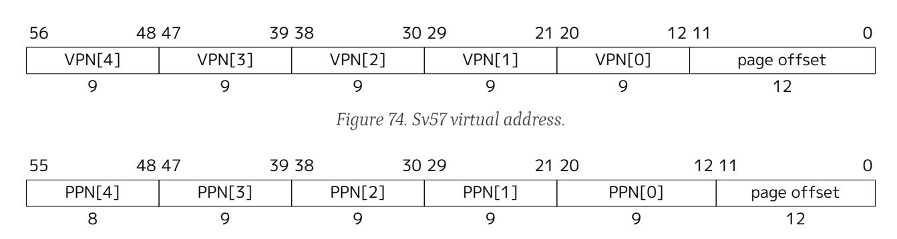

*Figure 75. Sv57 physical address.*

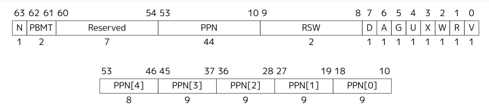

*Figure 76. Sv57 page table entry.*

The PTE format for Sv57 is shown in [Figure 76](#page-148-0). Bits 63–54 and 9–0 have the same meaning as for Sv39. Any level of PTE may be a leaf PTE, so in addition to 4 KiB pages, Sv57 supports 2 MiB megapages, 1 GiB gigapages, 512 GiB terapages, and 256 TiB petapages, each of which must be virtually and physically aligned to a boundary equal to its size. A page-fault exception is raised if the physical address is insufficiently aligned.

The algorithm for virtual-to-physical address translation is the same as in [Section 12.3.2,](#page-143-0) except LEVELS equals 5 and PTESIZE equals 8.
