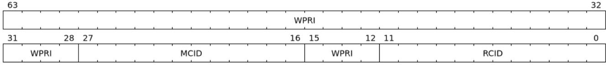

## Chapter 19. "Ssqosid" Extension for Quality-of-Service (QoS) Identifiers, Version 1.0

Quality of Service (QoS) is defined as the minimal end-to-end performance guaranteed in advance by a service level agreement (SLA) to a workload. Performance metrics might include measures such as instructions per cycle (IPC), latency of service, etc.

When multiple workloads execute concurrently on modern processors—equipped with large core counts, multiple cache hierarchies, and multiple memory controllers— the performance of any given workload becomes less deterministic, or even non-deterministic, due to shared resource contention.

To manage performance variability, system software needs resource allocation and monitoring capabilities. These capabilities allow for the reservation of resources like cache and bandwidth, thus meeting individual performance targets while minimizing interference. For resource management, hardware should provide monitoring features that allow system software to profile workload resource consumption and allocate resources accordingly.

To facilitate this, the QoS Identifiers extension (Ssqosid) introduces the srmcfg register, which configures a hart with two identifiers: a Resource Control ID (RCID) and a Monitoring Counter ID (MCID). These identifiers accompany each request issued by the hart to shared resource controllers.

Additional metadata, like the nature of the memory access and the ID of the originating supervisor domain, can accompany RCID and MCID. Resource controllers may use this metadata for differentiated service such as a different capacity allocation for code storage vs. data storage. Resource controllers can use this data for security policies such as not exposing statistics of one security domain to another.

These identifiers are crucial for the RISC-V Capacity and Bandwidth Controller QoS Register Interface (CBQRI) specification, which provides methods for setting resource usage limits and monitoring resource consumption. The RCID controls resource allocations, while the MCID is used for tracking resource usage.

*The Ssqosid extension does not require that S-mode mode be implemented.*

## 19.1. Supervisor Resource Management Configuration (**srmcfg**) register

The srmcfg register is an SXLEN-bit read/write register used to configure a Resource Control ID (RCID) and a Monitoring Counter ID (MCID). Both RCID and MCID are WARL fields. The register is formatted as shown in [Figure 77](#page-158-2) when SXLEN=64 and [Figure 78](#page-158-3) when SXLEN=32.

The RCID and MCID accompany each request made by the hart to shared resource controllers. The RCID is used to determine the resource allocations (e.g., cache occupancy limits, memory bandwidth limits, etc.) to enforce. The MCID is used to identify a counter to monitor resource usage.

*Figure 77. Supervisor Resource Management Configuration (*srmcfg*) register for SXLEN=64*

| 31 28 | 16   | 15 12 11 0 |
|-------|------|------------|
| WPRI  | MCID | WPRI RCID  |

*Figure 78. Supervisor Resource Management Configuration (*srmcfg*) register for SXLEN=32*

The RCID and MCID configured in the srmcfg CSR apply to all privilege modes of software execution on that

hart by default, but this behavior may be overridden by future extensions.

If extension Smstateen is implemented together with Ssqosid, then Ssqosid also requires the SRMCFG bit in mstateen0 to be implemented. If mstateen0.SRMCFG is 0, attempts to access srmcfg in privilege modes less privileged than M-mode raise an illegal-instruction exception. If mstateen0.SRMCFG is 1 or if extension Smstateen is not implemented, attempts to access srmcfg when V=1 raise a virtual-instruction exception.

> *A reset value of 0 is suggested for the* RCID *field matching resource controllers' default behavior of associating all capacity with* RCID=0*. The* MCID *reset value does not affect functionality and may be implementation-defined.*

> *Typically, fewer bits are allocated for* RCID *(e.g., to support tens of RCIDs) than for* MCID *(e.g., to support hundreds of MCIDs). A common* RCID *is usually used to group apps or VMs, pooling resource allocations to meet collective SLAs. If an SLA breach occurs, unique MCIDs enable granular monitoring, aiding decisions on resource adjustment, associating a different* RCID *with a subset of members, or migrating members to other machines. The larger pool of MCIDs speeds up this analysis.*

> *The* RCID *and* MCID *in* srmcfg *apply across all privilege levels on the hart. Typically, higherprivilege modes don't modify* srmcfg*, as they often serve lower-privileged tasks. If differentiation is needed, higher privilege code can update* srmcfg *and restore it before returning to a lower privilege level.*

> *In VM environments, hypervisors usually manage resource allocations, keeping the Guest OS out of QoS flows. If needed, the hypervisor can virtualize* srmcfg *CSR for a VM using the virtual-instruction exceptions triggered upon Guest access. If the direct selection of* RCID *and* MCID *by the VM becomes common and emulation overhead is an issue, future extensions may allow VS-mode to use a selector for a hypervisor-configured set of CSRs holding* RCID *and* MCID *values designated for that Guest OS use.*

> *During context switches, the supervisor may choose to execute with the* srmcfg *of the outgoing context to attribute the execution to it. Prior to restoring the new context, it switches to the new VM's* srmcfg*. The supervisor can also use a separate configuration for execution not to be attributed to either contexts.*
