## Chapter 22. "H" Extension for Hypervisor Support, Version 1.0

This chapter describes the RISC-V hypervisor extension, which virtualizes the supervisor-level architecture to support the efficient hosting of guest operating systems atop a type-1 or type-2 hypervisor. The hypervisor extension changes supervisor mode into *hypervisor-extended supervisor mode* (HS-mode, or *hypervisor mode* for short), where a hypervisor or a hosting-capable operating system runs. The hypervisor extension also adds another stage of address translation, from *guest physical addresses* to supervisor physical addresses, to virtualize the memory and memory-mapped I/O subsystems for a guest operating system. HS-mode acts the same as S-mode, but with additional instructions and CSRs that control the new stage of address translation and support hosting a guest OS in virtual S-mode (VS-mode). Regular S-mode operating systems can execute without modification either in HS-mode or as VS-mode guests.

In HS-mode, an OS or hypervisor interacts with the machine through the same SBI as an OS normally does from S-mode. An HS-mode hypervisor is expected to implement the SBI for its VS-mode guest.

The hypervisor extension depends on an "I" base integer ISA with 32 x registers (RV32I or RV64I), not RV32E or RV64E, which have only 16 x registers. CSR mtval must not be read-only zero, and standard page-based address translation must be supported, either Sv32 for RV32, or a minimum of Sv39 for RV64.

The hypervisor extension is enabled by setting bit 7 in the misa CSR, which corresponds to the letter H. RISC-V harts that implement the hypervisor extension are encouraged not to hardwire misa[7], so that the extension may be disabled.

> *The baseline privileged architecture is designed to simplify the use of classic virtualization techniques, where a guest OS is run at user-level, as the few privileged instructions can be easily detected and trapped. The hypervisor extension improves virtualization performance by reducing the frequency of these traps.*

*The hypervisor extension has been designed to be efficiently emulable on platforms that do not implement the extension, by running the hypervisor in S-mode and trapping into M-mode for hypervisor CSR accesses and to maintain shadow page tables. The majority of CSR accesses for type-2 hypervisors are valid S-mode accesses so need not be trapped. Hypervisors can support nested virtualization analogously.*

## 22.1. Privilege Modes

The current *virtualization mode*, denoted V, indicates whether the hart is currently executing in a guest. When V=1, the hart is either in virtual S-mode (VS-mode), or in virtual U-mode (VU-mode) atop a guest OS running in VS-mode. When V=0, the hart is either in M-mode, in HS-mode, or in U-mode atop an OS running in HS-mode. The virtualization mode also indicates whether two-stage address translation is active (V=1) or inactive (V=0). [Table 44](#page-164-1) lists the possible privilege modes of a RISC-V hart with the hypervisor extension.

*Table 44. Privilege modes with the hypervisor extension.*

| Virtualization Mode (V) | Nominal Privilege | Abbreviation                | Name                                                                | Two-Stage Translation |
|----------------------------|-------------------|-----------------------------|---------------------------------------------------------------------|--------------------------|
| 0 0 0                | U S M       | U-mode HS-mode M-mode | User mode Hypervisor-extended supervisor mode Machine mode | Off Off Off        |
| 1 1                     | U S            | VU-mode VS-mode          | Virtual user mode Virtual supervisor mode                     | On On                 |

For privilege modes U and VU, the *nominal privilege mode* is U, and for privilege modes HS and VS, the nominal privilege mode is S.

HS-mode is more privileged than VS-mode, and VS-mode is more privileged than VU-mode. VS-mode interrupts are globally disabled when executing in U-mode.

*This description does not consider the possibility of U-mode or VU-mode interrupts and will be revised if an extension for user-level interrupts is adopted.*

## 22.2. Hypervisor and Virtual Supervisor CSRs

An OS or hypervisor running in HS-mode uses the supervisor CSRs to interact with the exception, interrupt, and address-translation subsystems. Additional CSRs are provided to HS-mode, but not to VSmode, to manage two-stage address translation and to control the behavior of a VS-mode guest: hstatus, hedeleg, hideleg, hvip, hip, hie, hgeip, hgeie, henvcfg, henvcfgh, hcounteren, htimedelta, htimedeltah, htval, htinst, and hgatp.

Furthermore, several *virtual supervisor* CSRs (VS CSRs) are replicas of the normal supervisor CSRs. For example, vsstatus is the VS CSR that duplicates the usual sstatus CSR.

When V=1, the VS CSRs substitute for the corresponding supervisor CSRs, taking over all functions of the usual supervisor CSRs except as specified otherwise. Instructions that normally read or modify a supervisor CSR shall instead access the corresponding VS CSR. When V=1, an attempt to read or write a VS CSR directly by its own separate CSR address causes a virtual-instruction exception. (Attempts from Umode cause an illegal-instruction exception as usual.) The VS CSRs can be accessed as themselves only from M-mode or HS-mode.

While V=1, the normal HS-level supervisor CSRs that are replaced by VS CSRs retain their values but do not affect the behavior of the machine unless specifically documented to do so. Conversely, when V=0, the VS CSRs do not ordinarily affect the behavior of the machine other than being readable and writable by CSR instructions.

Some standard supervisor CSRs (senvcfg, scounteren, and scontext, possibly others) have no matching VS CSR. These supervisor CSRs continue to have their usual function and accessibility even when V=1, except with VS-mode and VU-mode substituting for HS-mode and U-mode. Hypervisor software is expected to manually swap the contents of these registers as needed.

*Matching VS CSRs exist only for the supervisor CSRs that must be duplicated, which are mainly those that get automatically written by traps or that impact instruction execution immediately after trap entry and/or right before SRET, when software alone is unable to swap a CSR at exactly the right moment. Currently, most supervisor CSRs fall into this category, but future ones might not.*

In this chapter, we use the term *HSXLEN* to refer to the effective XLEN when executing in HS-mode, and *VSXLEN* to refer to the effective XLEN when executing in VS-mode.

#### 22.2.1. Hypervisor Status (**hstatus**) Register

The hstatus register is an HSXLEN-bit read/write register formatted as shown in [Figure 79](#page-165-1) when HSXLEN=32 and [Figure 80](#page-165-2) when HSXLEN=64. The hstatus register provides facilities analogous to the mstatus register for tracking and controlling the exception behavior of a VS-mode guest.

| 31 |       |    |      |      |    |      | 23  | 22   | 21   | 20   | 19 | 18   | 17 | 16    |
|----|-------|----|------|------|----|------|-----|------|------|------|----|------|----|-------|
|    |       |    | WPRI |      |    |      |     | VTSR | VTW  | VTVM |    | WPRI |    | VGEIN |
| 15 |       | 12 | 11   | 10   | 9  | 8    | 7   | 6    | 5    | 4    |    |      |    | 0     |
|    | VGEIN |    |      | WPRI | HU | SPVP | SPV | GVA  | VSBE |      |    | WPRI |    |       |

*Figure 79. Hypervisor status register (*hstatus*) when HSXLEN=32*

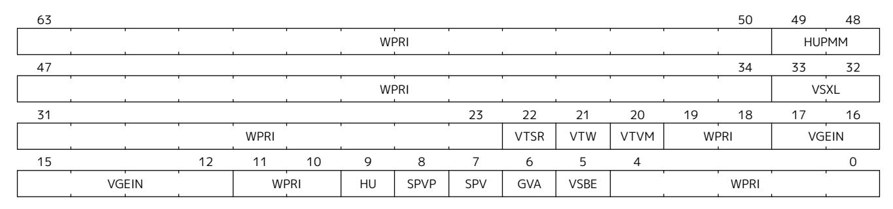

*Figure 80. Hypervisor status register (*hstatus*) when HSXLEN=64.*

The VSXL field controls the effective XLEN for VS-mode (known as VSXLEN), which may differ from the XLEN for HS-mode (HSXLEN). When HSXLEN=32, the VSXL field does not exist, and VSXLEN=32. When HSXLEN=64, VSXL is a WARL field that is encoded the same as the MXL field of misa, shown in [Table 11.](#page-34-3) In particular, an implementation may make VSXL be a read-only field whose value always ensures that VSXLEN=HSXLEN.

If HSXLEN is changed from 32 to a wider width, and if field VSXL is not restricted to a single value, it gets the value corresponding to the widest supported width not wider than the new HSXLEN.

The hstatus fields VTSR, VTW, and VTVM are defined analogously to the mstatus fields TSR, TW, and TVM, but affect execution only in VS-mode, and cause virtual-instruction exceptions instead of illegalinstruction exceptions. When VTSR=1, an attempt in VS-mode to execute SRET raises a virtual-instruction exception. When VTW=1 (and assuming mstatus.TW=0), an attempt in VS-mode to execute WFI raises a virtual-instruction exception if the WFI does not complete within an implementation-specific, bounded time limit. An implementation may have WFI always raise a virtual-instruction exception in VS-mode when VTW=1 (and mstatus.TW=0), even if there are pending globally-disabled interrupts when the instruction is executed. When VTVM=1, an attempt in VS-mode to execute SFENCE.VMA or SINVAL.VMA or to access CSR satp raises a virtual-instruction exception.

The VGEIN (Virtual Guest External Interrupt Number) field selects a guest external interrupt source for VS-level external interrupts. VGEIN is a WLRL field that must be able to hold values between zero and the maximum guest external interrupt number (known as GEILEN), inclusive. When VGEIN=0, no guest external interrupt source is selected for VS-level external interrupts. GEILEN may be zero, in which case VGEIN may be read-only zero. Guest external interrupts are explained in [Section 22.2.4](#page-170-0), and the use of VGEIN is covered further in [Section 22.2.3](#page-168-0).

Field HU (Hypervisor in U-mode) controls whether the virtual-machine load/store instructions, HLV, HLVX, and HSV, can be used also in U-mode. When HU=1, these instructions can be executed in U-mode the same as in HS-mode. When HU=0, all hypervisor instructions cause an illegal-instruction exception in U-mode.

*The HU bit allows a portion of a hypervisor to be run in U-mode for greater protection against software bugs, while still retaining access to a virtual machine's memory.*

When Ssnpm extension is implemented, the HUPMM field enables or disables pointer masking (see [Chapter](#page-208-0) [25](#page-208-0)) for HLV.\* and HSV.\* instructions in U-mode, according to the values in [Table 47](#page-172-0), when their explicit memory access is performed as though in VU-mode. In HS- and M-modes, pointer masking for these instructions is enabled or disabled by senvcfg.PMM, when their explicit memory access is performed as though in VU-mode. Setting henvcfg.PMM enables or disables pointer masking for HLV.\* and HSV.\* when their explicit memory access is performed as though in VS-mode. When the Ssnpm extension is not implemented, the HUPMM field is read-only zero. The HUPMM field is read-only zero for RV32.

*The hypervisor should copy the value written to* senvcfg.PMM *by the guest to the* hstatus.HUPMM *field prior to invoking* HLV.\* *or* HSV.\* *instructions in U-mode.*

The SPV bit (Supervisor Previous Virtualization mode) is written by the implementation whenever a trap is taken into HS-mode. Just as the SPP bit in sstatus is set to the (nominal) privilege mode at the time of the trap, the SPV bit in hstatus is set to the value of the virtualization mode V at the time of the trap. When an SRET instruction is executed when V=0, V is set to SPV.

When V=1 and a trap is taken into HS-mode, bit SPVP (Supervisor Previous Virtual Privilege) is set to the nominal privilege mode at the time of the trap, the same as sstatus.SPP. But if V=0 before a trap, SPVP is left unchanged on trap entry. SPVP controls the effective privilege of explicit memory accesses made by the virtual-machine load/store instructions, HLV, HLVX, and HSV.

*Without SPVP, if instructions HLV, HLVX, and HSV looked instead to* sstatus*.SPP for the effective privilege of their memory accesses, then, even with HU=1, U-mode could not access virtual machine memory at VS-level, because to enter U-mode using SRET always leaves SPP=0. Unlike SPP, field SPVP is untouched by transitions back-and-forth between HS-mode and U-mode.*

Field GVA (Guest Virtual Address) is written by the implementation whenever a trap is taken into HSmode. For any trap (breakpoint, address misaligned, access fault, page fault, or guest-page fault) that writes a guest virtual address to stval, GVA is set to 1. For any other trap into HS-mode, GVA is set to 0.

*For breakpoint and memory access traps that write a nonzero value to* stval*, GVA is redundant with field SPV (the two bits are set the same) except when the explicit memory access of an HLV, HLVX, or HSV instruction causes a fault. In that case, SPV=0 but GVA=1.*

The VSBE bit is a WARL field that controls the endianness of explicit memory accesses made from VSmode. If VSBE=0, explicit load and store memory accesses made from VS-mode are little-endian, and if VSBE=1, they are big-endian. VSBE also controls the endianness of all implicit accesses to VS-level memory management data structures, such as page tables. An implementation may make VSBE a read-only field that always specifies the same endianness as HS-mode.

#### 22.2.2. Hypervisor Trap Delegation (**hedeleg** and **hideleg**) Registers

Register hedeleg is a 64-bit read/write register, formatted as shown in [Figure 81](#page-167-0). Register hideleg is an HSXLEN-bit read/write register, formatted as shown in [Figure 82.](#page-167-1) By default, all traps at any privilege level are handled in M-mode, though M-mode usually uses the medeleg and mideleg CSRs to delegate some traps to HS-mode. The hedeleg and hideleg CSRs allow these traps to be further delegated to a VS-mode guest; their layout is the same as medeleg and mideleg.

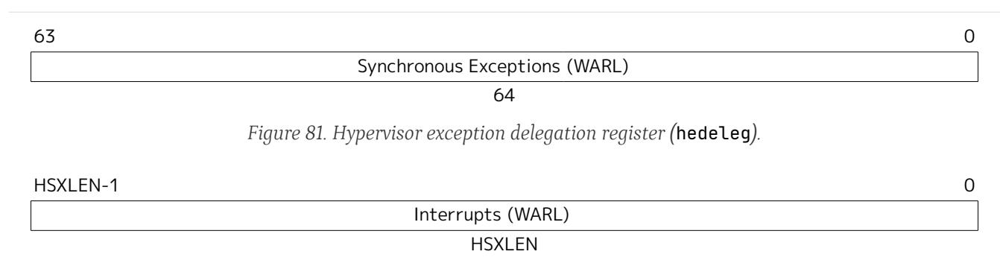

*Figure 82. Hypervisor interrupt delegation register (*hideleg*).*

A synchronous trap that has been delegated to HS-mode (using medeleg) is further delegated to VS-mode if V=1 before the trap and the corresponding hedeleg bit is set. Each bit of hedeleg shall be either writable or read-only zero. Many bits of hedeleg are required specifically to be writable or zero, as enumerated in [Table 45](#page-167-2). Bit 0, corresponding to instruction address-misaligned exceptions, must be writable if IALIGN=32.

*Requiring that certain bits of* hedeleg *be writable reduces some of the burden on a hypervisor to handle variations of implementation.*

When XLEN=32, hedelegh is a 32-bit read/write register that aliases bits 63:32 of hedeleg. Register hedelegh does not exist when XLEN=64.

An interrupt that has been delegated to HS-mode (using mideleg) is further delegated to VS-mode if the corresponding hideleg bit is set. Among bits 15:0 of hideleg, bits 10, 6, and 2 (corresponding to the standard VS-level interrupts) are writable, and bits 12, 9, 5, and 1 (corresponding to the standard S-level interrupts) are read-only zeros.

When a virtual supervisor external interrupt (code 10) is delegated to VS-mode, it is automatically translated by the machine into a supervisor external interrupt (code 9) for VS-mode, including the value written to vscause on an interrupt trap. Likewise, a virtual supervisor timer interrupt (6) is translated into a supervisor timer interrupt (5) for VS-mode, and a virtual supervisor software interrupt (2) is translated into a supervisor software interrupt (1) for VS-mode. Similar translations may or may not be done for platform interrupt causes (codes 16 and above).

*Table 45. Bits of* hedeleg *that must be writable or must be read-only zero.*

|    | Bit Attribute Corresponding Exception |                                         |  |  |
|----|------------------------------------------|-----------------------------------------|--|--|
| 0  | (See text)                               | Instruction address misaligned          |  |  |
| 1  | Writable                                 | Instruction access fault                |  |  |
| 2  | Writable                                 | Illegal instruction                     |  |  |
| 3  | Writable                                 | Breakpoint                              |  |  |
| 4  | Writable                                 | Load address misaligned                 |  |  |
| 5  | Writable                                 | Load access fault                       |  |  |
| 6  | Writable                                 | Store/AMO address misaligned            |  |  |
| 7  | Writable                                 | Store/AMO access fault                  |  |  |
| 8  | Writable                                 | Environment call from U-mode or VU-mode |  |  |
| 9  | Read-only 0                              | Environment call from HS-mode           |  |  |
| 10 | Read-only 0                              | Environment call from VS-mode           |  |  |
| 11 | Read-only 0                              | Environment call from M-mode            |  |  |
| 12 | Writable                                 | Instruction page fault                  |  |  |
| 13 | Writable                                 | Load page fault                         |  |  |
| 15 | Writable                                 | Store/AMO page fault                    |  |  |
| 16 | Read-only 0                              | Double trap                             |  |  |
| 18 | Writable                                 | Software check                          |  |  |
| 19 | Writable                                 | Hardware error                          |  |  |
| 20 | Read-only 0                              | Instruction guest-page fault            |  |  |
| 21 | Read-only 0                              | Load guest-page fault                   |  |  |
| 22 | Read-only 0                              | Virtual instruction                     |  |  |
| 23 | Read-only 0                              | Store/AMO guest-page fault              |  |  |

### 22.2.3. Hypervisor Interrupt (**hvip**, **hip**, and **hie**) Registers

Register hvip is an HSXLEN-bit read/write register that a hypervisor can write to indicate virtual interrupts intended for VS-mode. Bits of hvip that are not writable are read-only zeros.

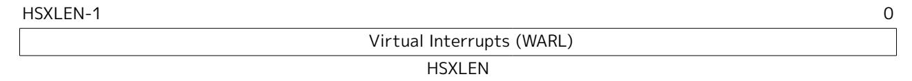

*Figure 83. Hypervisor virtual-interrupt-pending register(*hvip*).*

The standard portion (bits 15:0) of hvip is formatted as shown in [Figure 84.](#page-168-1) Bits VSEIP, VSTIP, and VSSIP of hvip are writable. Setting VSEIP=1 in hvip asserts a VS-level external interrupt; setting VSTIP asserts a VS-level timer interrupt; and setting VSSIP asserts a VS-level software interrupt.

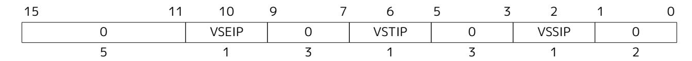

*Figure 84. Standard portion (bits 15:0) of* hvip*.*

Registers hip and hie are HSXLEN-bit read/write registers that supplement HS-level's sip and sie respectively. The hip register indicates pending VS-level and hypervisor-specific interrupts, while hie contains enable bits for the same interrupts.

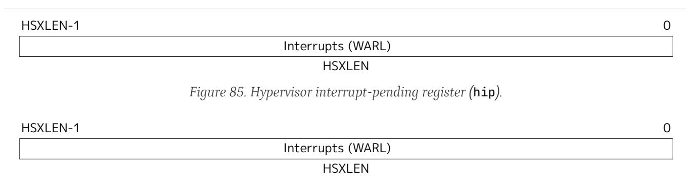

*Figure 86. Hypervisor interrupt-enable register (*hie*).*

For each writable bit in sie, the corresponding bit shall be read-only zero in both hip and hie. Hence, the nonzero bits in sie and hie are always mutually exclusive, and likewise for sip and hip.

*The active bits of* hip *and* hie *cannot be placed in HS-level's* sip *and* sie *because doing so would make it impossible for software to emulate the hypervisor extension on platforms that do not implement it in hardware.*

An interrupt *i* will trap to HS-mode whenever all of the following are true: (a) either the current operating mode is HS-mode and the SIE bit in the sstatus register is set, or the current operating mode has less privilege than HS-mode; (b) bit *i* is set in both sip and sie, or in both hip and hie; and (c) bit *i* is not set in hideleg.

If bit *i* of sie is read-only zero, the same bit in register hip may be writable or may be read-only. When bit *i* in hip is writable, a pending interrupt *i* can be cleared by writing 0 to this bit. If interrupt *i* can become pending in hip but bit *i* in hip is read-only, then either the interrupt can be cleared by clearing bit *i* of hvip, or the implementation must provide some other mechanism for clearing the pending interrupt (which may involve a call to the execution environment).

A bit in hie shall be writable if the corresponding interrupt can ever become pending in hip. Bits of hie that are not writable shall be read-only zero.

The standard portions (bits 15:0) of registers hip and hie are formatted as shown in [Figure 87](#page-169-0) and [Figure](#page-169-1) [88](#page-169-1) respectively.

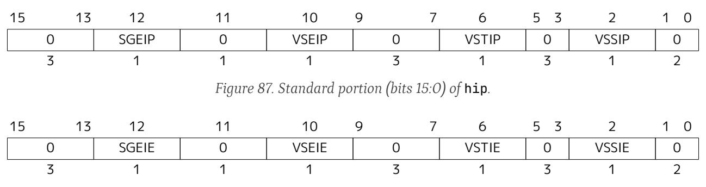

*Figure 88. Standard portion (bits 15:0) of* hie*.*

Bits hip.SGEIP and hie.SGEIE are the interrupt-pending and interrupt-enable bits for guest external interrupts at supervisor level (HS-level). SGEIP is read-only in hip, and is 1 if and only if the bitwise logical-AND of CSRs hgeip and hgeie is nonzero in any bit. (See [Section 22.2.4](#page-170-0).)

Bits hip.VSEIP and hie.VSEIE are the interrupt-pending and interrupt-enable bits for VS-level external interrupts. VSEIP is read-only in hip, and is the logical-OR of these interrupt sources:

- ⚫ bit VSEIP of hvip;
- ⚫ the bit of hgeip selected by hstatus.VGEIN; and

⚫ any other platform-specific external interrupt signal directed to VS-level.

Bits hip.VSTIP and hie.VSTIE are the interrupt-pending and interrupt-enable bits for VS-level timer interrupts. VSTIP is read-only in hip, and is the logical-OR of hvip.VSTIP and, when the Sstc extension is implemented, the timer interrupt signal resulting from vstimecmp. The hip.VSTIP bit, in response to timer interrupts generated by vstimecmp, is set by writing vstimecmp with a value that is less than or equal to the sum of time and htimedelta, truncated to 64 bits; it is cleared by writing vstimecmp with a greater value. The hip.VSTIP bit remains defined while V=0 as well as V=1.

Bits hip.VSSIP and hie.VSSIE are the interrupt-pending and interrupt-enable bits for VS-level software interrupts. VSSIP in hip is an alias (writable) of the same bit in hvip.

Multiple simultaneous interrupts destined for HS-mode are handled in the following decreasing priority order: SEI, SSI, STI, SGEI, VSEI, VSSI, VSTI, LCOFI.

#### 22.2.4. Hypervisor Guest External Interrupt Registers (**hgeip** and **hgeie**)

The hgeip register is an HSXLEN-bit read-only register, formatted as shown in [Figure 89](#page-170-1), that indicates pending guest external interrupts for this hart. The hgeie register is an HSXLEN-bit read/write register, formatted as shown in [Figure 90](#page-170-2), that contains enable bits for the guest external interrupts at this hart. Guest external interrupt number *i* corresponds with bit *i* in both hgeip and hgeie.

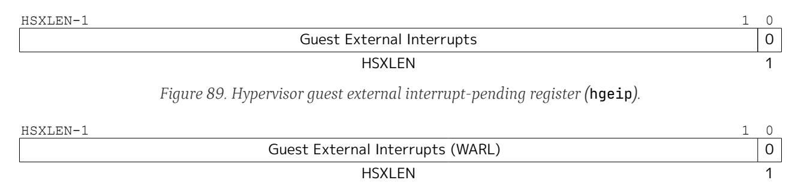

*Figure 90. Hypervisor guest external interrupt-enable register (*hgeie*).*

Guest external interrupts represent interrupts directed to individual virtual machines at VS-level. If a RISC-V platform supports placing a physical device under the direct control of a guest OS with minimal hypervisor intervention (known as *pass-through* or *direct assignment* between a virtual machine and the physical device), then, in such circumstance, interrupts from the device are intended for a specific virtual machine. Each bit of hgeip summarizes *all* pending interrupts directed to one virtual hart, as collected and reported by an interrupt controller. To distinguish specific pending interrupts from multiple devices, software must query the interrupt controller.

*Support for guest external interrupts requires an interrupt controller that can collect virtualmachine-directed interrupts separately from other interrupts.*

The number of bits implemented in hgeip and hgeie for guest external interrupts is UNSPECIFIED and may be zero. This number is known as *GEILEN*. The least-significant bits are implemented first, apart from bit 0. Hence, if GEILEN is nonzero, bits GEILEN:1 shall be writable in hgeie, and all other bit positions shall be read-only zeros in both hgeip and hgeie.

*The set of guest external interrupts received and handled at one physical hart may differ from those received at other harts. Guest external interrupt number i at one physical hart is typically expected not to be the same as guest external interrupt i at any other hart. For any one physical hart, the maximum number of virtual harts that may directly receive guest external interrupts is limited by GEILEN. The maximum this number can be for any implementation is 31 for RV32 and 63 for RV64, per physical hart.*

*A hypervisor is always free to emulate devices for any number of virtual harts without being limited by GEILEN. Only direct pass-through (direct assignment) of interrupts is affected by the GEILEN limit, and the limit is on the number of virtual harts receiving such interrupts, not the number of distinct interrupts received. The number of distinct interrupts a single virtual hart may receive is determined by the interrupt controller.*

Register hgeie selects the subset of guest external interrupts that cause a supervisor-level (HS-level) guest external interrupt. The enable bits in hgeie do not affect the VS-level external interrupt signal selected from hgeip by hstatus.VGEIN.

#### 22.2.5. Hypervisor Environment Configuration Register (**henvcfg**)

The henvcfg CSR is a 64-bit read/write register, formatted as shown in [Figure 91,](#page-171-1) that controls certain characteristics of the execution environment when virtualization mode V=1.

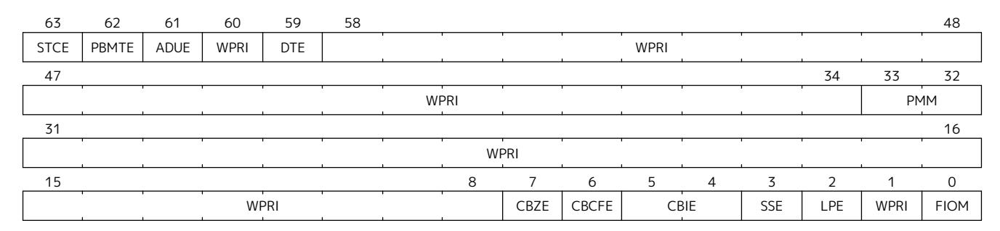

*Figure 91. Hypervisor environment configuration register (*henvcfg*).*

If bit FIOM (Fence of I/O implies Memory) is set to one in henvcfg, FENCE instructions executed when V=1 are modified so the requirement to order accesses to device I/O implies also the requirement to order main memory accesses. [Table 46](#page-171-2) details the modified interpretation of FENCE instruction bits PI, PO, SI, and SO when FIOM=1 and V=1.

Similarly, when FIOM=1 and V=1, if an atomic instruction that accesses a region ordered as device I/O has its *aq* and/or *rl* bit set, then that instruction is ordered as though it accesses both device I/O and memory.

| Table 46. Modified interpretation of FENCE predecessor and successor sets when FIOM=1 and virtualization mode V=1. |  |  |  |
|--------------------------------------------------------------------------------------------------------------------|--|--|--|
|                                                                                                                    |  |  |  |

| Instruction bit | Meaning when set                                                                                                   |
|-----------------|--------------------------------------------------------------------------------------------------------------------|
| PI PO        | Predecessor device input and memory reads (PR implied) Predecessor device output and memory writes (PW implied) |
| SI SO        | Successor device input and memory reads (SR implied) Successor device output and memory writes (SW implied)     |

The PBMTE bit controls whether the Svpbmt extension is available for use in VS-stage address translation. When PBMTE=1, Svpbmt is available for VS-stage address translation. When PBMTE=0, the implementation behaves as though Svpbmt were not implemented for VS-stage address translation. If Svpbmt is not implemented, PBMTE is read-only zero.

If the Svadu extension is implemented, the ADUE bit controls whether hardware updating of PTE A/D bits is enabled for VS-stage address translation. When ADUE=1, hardware updating of PTE A/D bits is enabled during VS-stage address translation, and the implementation behaves as though the Svade extension were not implemented for VS-mode address translation. When ADUE=0, the implementation behaves as though Svade were implemented for VS-stage address translation. If Svadu is not implemented, ADUE is read-only zero.

The Sstc extension adds the STCE (STimecmp Enable) bit to henvcfg CSR. When the Sstc extension is not

implemented, STCE is read-only zero. The STCE bit enables vstimecmp for VS-mode when set to one. When STCE bit is henvcfg is zero, an attempt to access stimecmp (really vstimecmp) when V=1 raises a virtualinstruction exception, and VSTIP in hip reverts to its defined behavior as if this extension is not implemented.

The Zicboz extension adds the CBZE (Cache Block Zero instruction enable) field to henvcfg. The CBZE field applies to execution of the cache block zero instruction (CBO.ZERO) in privilege modes VS and VU, and only when the instruction is HS-qualified. If the instruction is not HS-qualified, it raises an illegal-instruction exception. If the instruction is HS-qualified and the CBZE field is set to 1, the instruction is enabled for execution; otherwise, if the CBZE field is set to 0, it raises a virtual-instruction exception. When the Zicboz extension is not implemented, CBZE is read-only zero.

The Zicbom extension adds the CBCFE (Cache Block Clean and Flush instruction Enable) field to henvcfg. When V=1, if the CBO.CLEAN and CBO.FLUSH instructions are not HS-qualified, they raise an illegalinstruction exception. If the instructions are HS-qualified and the CBCFE field is set to 1, the instructions are enabled for execution; otherwise, if the CBCFE field is set to 0, they raise a virtual-instruction exception. When the Zicbom extension is not implemented, CBCFE is read-only zero.

The Zicbom extension adds the CBIE (Cache Block Invalidate instruction Enable) WARL field to henvcfg. The CBIE field controls execution of the cache block invalidate instruction (CBO.INVAL) in privilege modes VS and VU. The encoding 10b is reserved. When the Zicbom extension is not implemented, CBIE is readonly zero.

When V=1, if the CBO.INVAL instruction is not HS-qualified, it raises an illegal-instruction exception. If the instruction is HS-qualified and the CBIE field is set to 01b or 11b, the instruction is enabled for execution; otherwise, it raises a virtual-instruction exception.

If CBO.INVAL is enabled in HS-mode to perform a flush operation, then when the instruction is enabled in VS- or VU-mode it performs a flush operation, even if CBIE is set to 11b. Otherwise, when the instruction is enabled for execution, its behavior depends on the CBIE encoding, as follows:

- ⚫ 01b The instruction is executed and performs a flush operation, even if configured by VS-mode to perform an invalidate operation.
- ⚫ 11b The instruction is executed and performs an invalidate operation, unless configured by VS-mode to perform a flush operation.

If the Ssnpm extension is implemented, the PMM field enables or disables pointer masking (see [Chapter 25\)](#page-208-0) for VS-mode, according to the values in [Table 47](#page-172-0). When the Ssnpm extension is not implemented, the PMM field is read-only zero. The PMM field is read-only zero for RV32.

| Value | Description                                                            |
|-------|------------------------------------------------------------------------|
| 00    | Pointer masking is disabled (PMLEN = 0)                                |
| 01    | Reserved                                                               |
| 10    | Pointer masking is enabled with PMLEN = XLEN - 57 (PMLEN = 7 on RV64)  |
| 11    | Pointer masking is enabled with PMLEN = XLEN - 48 (PMLEN = 16 on RV64) |

*Table 47. Legal values of* PMM *WARL field*

The Zicfilp extension adds the LPE field in henvcfg. When the LPE field is set to 1, the Zicfilp extension is enabled in VS-mode. When the LPE field is 0, the Zicfilp extension is not enabled in VS-mode and the following rules apply to VS-mode:

⚫ The hart does not update the ELP state; it remains as NO\_LP\_EXPECTED.

⚫ The LPAD instruction operates as a no-op.

The Zicfiss extension adds the SSE field in henvcfg. If the SSE field is set to 1, the Zicfiss extension is activated in VS-mode. When the SSE field is 0, the Zicfiss extension remains inactive in VS-mode, and the following rules apply when V=1:

- ⚫ 32-bit Zicfiss instructions will revert to their behavior as defined by Zimop.
- ⚫ 16-bit Zicfiss instructions will revert to their behavior as defined by Zcmop.
- ⚫ The pte.xwr=010b encoding in VS-stage page tables becomes reserved.
- ⚫ The senvcfg.SSE field will read as zero and is read-only.
- ⚫ When menvcfg.SSE is one, SSAMOSWAP.W/D raises a virtual-instruction exception.

The Ssdbltrp extension adds the double-trap-enable (DTE) field in henvcfg. When henvcfg.DTE is zero, the implementation behaves as though Ssdbltrp is not implemented for VS-mode and the vsstatus.SDT bit is read-only zero.

When XLEN=32, henvcfgh is a 32-bit read/write register that aliases bits 63:32 of henvcfg. Register henvcfgh does not exist when XLEN=64.

### 22.2.6. Hypervisor Counter-Enable (**hcounteren**) Register

The counter-enable register hcounteren is a 32-bit register that controls the availability of the hardware performance monitoring counters to the guest virtual machine.

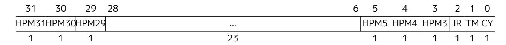

*Figure 92. Hypervisor counter-enable register (*hcounteren*).*

When the CY, TM, IR, or HPM*n* bit in the hcounteren register is clear, attempts to read the cycle, time, instret, or hpmcounter *n* register while V=1 will cause a virtual-instruction exception if the same bit in mcounteren is 1. When one of these bits is set, access to the corresponding register is permitted when V=1, unless prevented for some other reason. In VU-mode, a counter is not readable unless the applicable bits are set in both hcounteren and scounteren.

In addition, when the TM bit in the hcounteren register is clear, attempts to access the vstimecmp register (via stimecmp) while executing in VS-mode will cause a virtual-instruction exception if the same bit in mcounteren is set. When this bit and the same bit in mcounteren are both set, access to the vstimecmp register (if implemented) is permitted in VS-mode.

hcounteren must be implemented. However, any of the bits may be read-only zero, indicating reads to the corresponding counter will cause an exception when V=1. Hence, they are effectively WARL fields.

#### 22.2.7. Hypervisor Time Delta (**htimedelta**) Register

The htimedelta CSR is a 64-bit read/write register that contains the delta between the value of the time CSR and the value returned in VS-mode or VU-mode. That is, reading the time CSR in VS or VU mode returns the sum of the contents of htimedelta and the actual value of time.

*Because overflow is ignored when summing* htimedelta *and* time*, large values of* htimedelta *may be used to represent negative time offsets.*

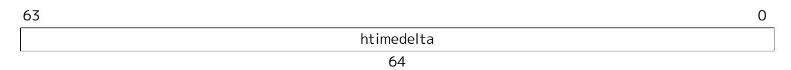

*Figure 93. Hypervisor time delta register.*

When XLEN=32, htimedeltah is a 32-bit read/write register that aliases bits 63:32 of htimedelta. Register htimedeltah does not exist when XLEN=64.

If the time CSR is implemented, htimedelta (and htimedeltah for XLEN=32) must be implemented.

#### 22.2.8. Hypervisor Trap Value (**htval**) Register

The htval register is an HSXLEN-bit read/write register formatted as shown in [Figure 94.](#page-174-1) When a trap is taken into HS-mode, htval is written with additional exception-specific information, alongside stval, to assist software in handling the trap.

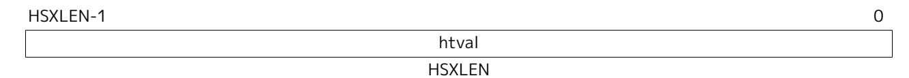

*Figure 94. Hypervisor trap value register (*htval*).*

When a guest-page-fault trap is taken into HS-mode, htval is written with either zero or the guest physical address that faulted, shifted right by 2 bits. For other traps, htval is set to zero, but a future standard or extension may redefine htval's setting for other traps.

A guest-page fault may arise due to an implicit memory access during first-stage (VS-stage) address translation, in which case a guest physical address written to htval is that of the implicit memory access that faulted—for example, the address of a VS-level page table entry that could not be read. (The guest physical address corresponding to the original virtual address is unknown when VS-stage translation fails to complete.) Additional information is provided in CSR htinst to disambiguate such situations.

Otherwise, for misaligned loads and stores that cause guest-page faults, a nonzero guest physical address in htval corresponds to the faulting portion of the access as indicated by the virtual address in stval. For instruction guest-page faults on systems with variable-length instructions, a nonzero htval corresponds to the faulting portion of the instruction as indicated by the virtual address in stval.

> *A guest physical address written to* htval *is shifted right by 2 bits to accommodate addresses wider than the current XLEN. For RV32, the hypervisor extension permits guest physical addresses as wide as 34 bits, and* htval *reports bits 33:2 of the address. This shift-by-2 encoding of guest physical addresses matches the encoding of physical addresses in PMP address registers [\(Section 3.7](#page-78-0)) and in page table entries ([Section 12.3](#page-139-0), [Section 12.4](#page-145-0), [Section 12.5,](#page-146-0) and [Section 12.6\)](#page-147-0).*

*If the least-significant two bits of a faulting guest physical address are needed, these bits are ordinarily the same as the least-significant two bits of the faulting virtual address in* stval*. For faults due to implicit memory accesses for VS-stage address translation, the leastsignificant two bits are instead zeros. These cases can be distinguished using the value provided in register* htinst*.*

htval is a WARL register that must be able to hold zero and may be capable of holding only an arbitrary subset of other 2-bit-shifted guest physical addresses, if any.

*Unless it has reason to assume otherwise (such as a platform standard), software that writes a value to* htval *should read back from* htval *to confirm the stored value.*

### 22.2.9. Hypervisor Trap Instruction (**htinst**) Register

The htinst register is an HSXLEN-bit read/write register formatted as shown in [Figure 95](#page-175-2). When a trap is taken into HS-mode, htinst is written with a value that, if nonzero, provides information about the instruction that trapped, to assist software in handling the trap. The values that may be written to htinst on a trap are documented in [Section 22.6.3](#page-195-0).

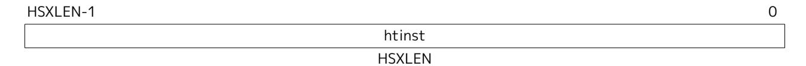

*Figure 95. Hypervisor trap instruction (*htinst*) register.*

htinst is a WARL register that need only be able to hold the values that the implementation may automatically write to it on a trap.

#### 22.2.10. Hypervisor Guest Address Translation and Protection (**hgatp**) Register

The hgatp register is an HSXLEN-bit read/write register, formatted as shown in [Figure 96](#page-175-3) for HSXLEN=32 and [Figure 97](#page-175-4) for HSXLEN=64, which controls G-stage address translation and protection, the second stage of two-stage translation for guest virtual addresses (see [Section 22.5](#page-187-0)). Similar to CSR satp, this register holds the physical page number (PPN) of the guest-physical root page table; a virtual machine identifier (VMID), which facilitates address-translation fences on a per-virtual-machine basis; and the MODE field, which selects the address-translation scheme for guest physical addresses. When mstatus.TVM=1, attempts to read or write hgatp while executing in HS-mode will raise an illegal-instruction exception.

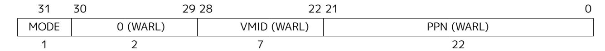

*Figure 96. Hypervisor guest address translation and protection register* hgatp *when HSXLEN=32.*

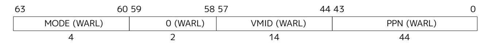

*Figure 97. Hypervisor guest address translation and protection register* hgatp *when HSXLEN=64 for MODE values Bare, Sv39x4, Sv48x4, and Sv57x4.*

[Table 48](#page-175-5) shows the encodings of the MODE field when HSXLEN=32 and HSXLEN=64. When MODE=Bare, guest physical addresses are equal to supervisor physical addresses, and there is no further memory protection for a guest virtual machine beyond the physical memory protection scheme described in [Section 3.7](#page-78-0). In this case, software must write zero to the remaining fields in hgatp. Attempting to select MODE=Bare with a nonzero pattern in the remaining fields has an UNSPECIFIED effect on the value that the remaining fields assume and an UNSPECIFIED effect on G-stage address translation and protection behavior.

When HSXLEN=32, the only other valid setting for MODE is Sv32x4, which is a modification of the usual Sv32 paged virtual-memory scheme, extended to support 34-bit guest physical addresses. When HSXLEN=64, modes Sv39x4, Sv48x4, and Sv57x4 are defined as modifications of the Sv39, Sv48, and Sv57 paged virtual-memory schemes. All of these paged virtual-memory schemes are described in [Section 22.5.1.](#page-187-1)

The remaining MODE settings when HSXLEN=64 are reserved for future use and may define different interpretations of the other fields in hgatp.

*Table 48. Encoding of* hgatp *MODE field.*

|                                            | HSXLEN=32 |                                                                 |  |  |  |  |  |  |  |  |
|--------------------------------------------|-----------|-----------------------------------------------------------------|--|--|--|--|--|--|--|--|
| Value Name Description               |           |                                                                 |  |  |  |  |  |  |  |  |
| 0 Bare No translation or protection. |           |                                                                 |  |  |  |  |  |  |  |  |
| 1                                          | Sv32x4    | Page-based 34-bit virtual addressing (2-bit extension of Sv32). |  |  |  |  |  |  |  |  |
|                                            |           | HSXLEN=64                                                       |  |  |  |  |  |  |  |  |
| Value Name Description               |           |                                                                 |  |  |  |  |  |  |  |  |
| 0                                          | Bare      | No translation or protection.                                   |  |  |  |  |  |  |  |  |
| 1-7                                        | —         | Reserved                                                        |  |  |  |  |  |  |  |  |
| 8                                          | Sv39x4    | Page-based 41-bit virtual addressing (2-bit extension of Sv39). |  |  |  |  |  |  |  |  |
| 9                                          | Sv48x4    | Page-based 50-bit virtual addressing (2-bit extension of Sv48). |  |  |  |  |  |  |  |  |
| 10                                         | Sv57x4    | Page-based 59-bit virtual addressing (2-bit extension of Sv57). |  |  |  |  |  |  |  |  |
| 11-15                                      | —         | Reserved                                                        |  |  |  |  |  |  |  |  |

Implementations are not required to support all defined MODE settings when HSXLEN=64.

A write to hgatp with an unsupported MODE value is not ignored as it is for satp. Instead, the fields of hgatp are WARL in the normal way, when so indicated.

As explained in [Section 22.5.1](#page-187-1), for the paged virtual-memory schemes (Sv32x4, Sv39x4, Sv48x4, and Sv57x4), the root page table is 16 KiB and must be aligned to a 16-KiB boundary. In these modes, the lowest two bits of the physical page number (PPN) in hgatp always read as zeros. An implementation that supports only the defined paged virtual-memory schemes and/or Bare may make PPN[1:0] read-only zero.

The number of VMID bits is UNSPECIFIED and may be zero. The number of implemented VMID bits, termed *VMIDLEN*, may be determined by writing one to every bit position in the VMID field, then reading back the value in hgatp to see which bit positions in the VMID field hold a one. The least-significant bits of VMID are implemented first: that is, if VMIDLEN > 0, VMID[VMIDLEN-1:0] is writable. The maximal value of VMIDLEN, termed VMIDMAX, is 7 for Sv32x4 or 14 for Sv39x4, Sv48x4, and Sv57x4.

The hgatp register is considered *active* for the purposes of the address-translation algorithm *unless* the effective privilege mode is U and hstatus.HU=0.

*This definition simplifies the implementation of speculative execution of HLV, HLVX, and HSV instructions.*

Note that writing hgatp does not imply any ordering constraints between page-table updates and subsequent G-stage address translations. If the new virtual machine's guest physical page tables have been modified, or if a VMID is reused, it may be necessary to execute an HFENCE.GVMA instruction (see [Section](#page-182-0) [22.3.2](#page-182-0)) before or after writing hgatp.

#### 22.2.11. Virtual Supervisor Status (**vsstatus**) Register

The vsstatus register is a VSXLEN-bit read/write register that is VS-mode's version of supervisor register sstatus, formatted as shown in [Figure 98](#page-176-1) when VSXLEN=32 and [Figure 99](#page-177-0) when VSXLEN=64. When V=1, vsstatus substitutes for the usual sstatus, so instructions that normally read or modify sstatus actually access vsstatus instead.

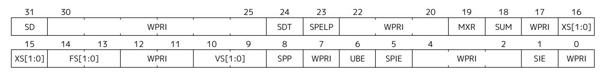

*Figure 98. Virtual supervisor status (*vsstatus*) register when VSXLEN=32.*

| 63      | 62 |         |      |      |    |         |      |       |     |      |    |      |     |      | 48       |
|---------|----|---------|------|------|----|---------|------|-------|-----|------|----|------|-----|------|----------|
| SD      |    |         |      |      |    |         |      | WPRI  |     |      |    |      |     |      |          |
| 47      |    |         |      |      |    |         |      |       |     |      |    |      | 34  | 33   | 32       |
|         |    |         |      |      |    |         | WPRI |       |     |      |    |      |     |      | UXL[1:0] |
| 31      |    |         |      |      |    | 25      | 24   | 23    | 22  |      | 20 | 19   | 18  | 17   | 16       |
|         |    |         | WPRI |      |    |         | SDT  | SPELP |     | WPRI |    | MXR  | SUM | WPRI | XS[1:0]  |
| 15      | 14 | 13      | 12   | 11   | 10 | 9       | 8    | 7     | 6   | 5    | 4  |      | 2   | 1    | 0        |
| XS[1:0] |    | FS[1:0] |      | WPRI |    | VS[1:0] | SPP  | WPRI  | UBE | SPIE |    | WPRI |     | SIE  | WPRI     |

*Figure 99. Virtual supervisor status (*vsstatus*) register when VSXLEN=64.*

The UXL field controls the effective XLEN for VU-mode, which may differ from the XLEN for VS-mode (VSXLEN). When VSXLEN=32, the UXL field does not exist, and VU-mode XLEN=32. When VSXLEN=64, UXL is a WARL field that is encoded the same as the MXL field of misa, shown in [Table 11](#page-34-3). In particular, an implementation may make UXL be a read-only copy of field VSXL of hstatus, forcing VU-mode XLEN=VSXLEN.

If VSXLEN is changed from 32 to a wider width, and if field UXL is not restricted to a single value, it gets the value corresponding to the widest supported width not wider than the new VSXLEN.

When V=1, both vsstatus.FS and the HS-level sstatus.FS are in effect. Attempts to execute a floating-point instruction when either field is 0 (Off) raise an illegal-instruction exception. Modifying the floating-point state when V=1 causes both fields to be set to 3 (Dirty).

*For a hypervisor to benefit from the extension context status, it must have its own copy in the HS-level* sstatus*, maintained independently of a guest OS running in VS-mode. While a version of the extension context status obviously must exist in* vsstatus *for VS-mode, a hypervisor cannot rely on this version being maintained correctly, given that VS-level software can change* vsstatus*.FS arbitrarily. If the HS-level* sstatus*.FS were not independently active and maintained by the hardware in parallel with* vsstatus*.FS while V=1, hypervisors would always be forced to conservatively swap all floating-point state when context-switching between virtual machines.*

Similarly, when V=1, both vsstatus.VS and the HS-level sstatus.VS are in effect. Attempts to execute a vector instruction when either field is 0 (Off) raise an illegal-instruction exception. Modifying the vector state when V=1 causes both fields to be set to 3 (Dirty).

Read-only fields SD and XS summarize the extension context status as it is visible to VS-mode only. For example, the value of the HS-level sstatus.FS does not affect vsstatus.SD.

An implementation may make field UBE be a read-only copy of hstatus.VSBE.

When V=0, vsstatus does not directly affect the behavior of the machine, unless a virtual-machine load/store (HLV, HLVX, or HSV) or the MPRV feature in the mstatus register is used to execute a load or store *as though* V=1.

The Zicfilp extension adds the SPELP field that holds the previous ELP, and is updated as specified in [Section 23.1.2.](#page-202-0) The SPELP field is encoded as follows:

- ⚫ 0 NO\_LP\_EXPECTED no landing pad instruction expected.
- ⚫ 1 LP\_EXPECTED a landing pad instruction is expected.

The Ssdbltrp adds an S-mode-disable-trap (SDT) field extension to address double trap (See [Section 12.1.1.5\)](#page-123-2) in VS-mode.

#### 22.2.12. Virtual Supervisor Interrupt (vsip and vsie) Registers

The vsip and vsie registers are VSXLEN-bit read/write registers that are VS-mode's versions of supervisor CSRs sip and sie, formatted as shown in Figure 100 and Figure 101 respectively. When V=1, vsip and vsie substitute for the usual sip and sie, so instructions that normally read or modify sip/sie actually access vsip/vsie instead. However, interrupts directed to HS-level continue to be indicated in the HS-level sip register, not in vsip, when V=1.

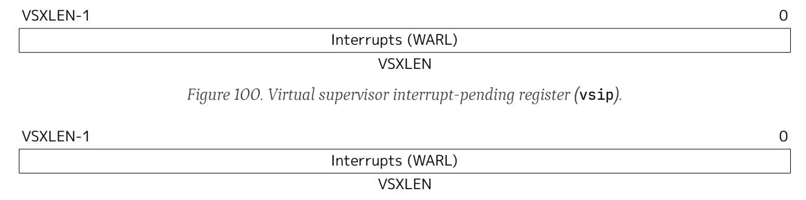

Figure 101. Virtual supervisor interrupt-enable register (vsie).

The standard portions (bits 15:0) of registers vsip and vsie are formatted as shown in Figure 102 and Figure 103 respectively.

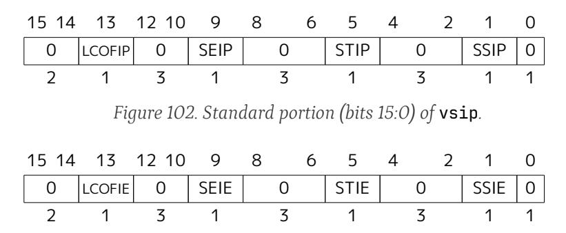

Figure 103. Standard portion (bits 15:0) of vsie.

Extension Shlcofideleg supports delegating LCOFI interrupts to VS-mode. If the Shlcofideleg extension is implemented, hideleg bit 13 is writable; otherwise, it is read-only zero. When bit 13 of hideleg is zero, vsip.LCOFIP and vsie.LCOFIE are read-only zeros. Else, vsip.LCOFIP and vsie.LCOFIE are aliases of sip.LCOFIP and sie.LCOFIE.

When bit 10 of hideleg is zero, vsip.SEIP and vsie.SEIE are read-only zeros. Else, vsip.SEIP and vsie.SEIE are aliases of hip.VSEIP and hie.VSEIE.

When bit 6 of hideleg is zero, vsip.STIP and vsie.STIE are read-only zeros. Else, vsip.STIP and vsie.STIE are aliases of hip.VSTIP and hie.VSTIE.

When bit 2 of hideleg is zero, vsip.SSIP and vsie.SSIE are read-only zeros. Else, vsip.SSIP and vsie.SSIE are aliases of hip.VSSIP and hie.VSSIE.

#### 22.2.13. Virtual Supervisor Trap Vector Base Address (vstvec) Register

The vstvec register is a VSXLEN-bit read/write register that is VS-mode's version of supervisor register stvec, formatted as shown in Figure 104. When V=1, vstvec substitutes for the usual stvec, so instructions that normally read or modify stvec actually access vstvec instead. When V=0, vstvec does not directly affect the behavior of the machine.

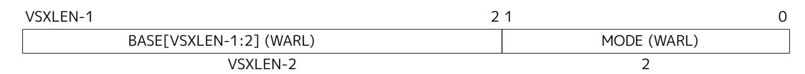

*Figure 104. Virtual supervisor trap vector base address register* vstvec*.*

#### 22.2.14. Virtual Supervisor Scratch (**vsscratch**) Register

The vsscratch register is a VSXLEN-bit read/write register that is VS-mode's version of supervisor register sscratch, formatted as shown in [Figure 105](#page-179-5). When V=1, vsscratch substitutes for the usual sscratch, so instructions that normally read or modify sscratch actually access vsscratch instead. The contents of vsscratch never directly affect the behavior of the machine.

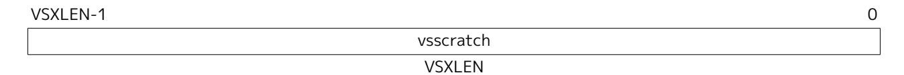

*Figure 105. Virtual supervisor scratch register* vsscratch*.*

#### 22.2.15. Virtual Supervisor Exception Program Counter (**vsepc**) Register

The vsepc register is a VSXLEN-bit read/write register that is VS-mode's version of supervisor register sepc, formatted as shown in [Figure 106.](#page-179-6) When V=1, vsepc substitutes for the usual sepc, so instructions that normally read or modify sepc actually access vsepc instead. When V=0, vsepc does not directly affect the behavior of the machine.

vsepc is a WARL register that must be able to hold the same set of values that sepc can hold.

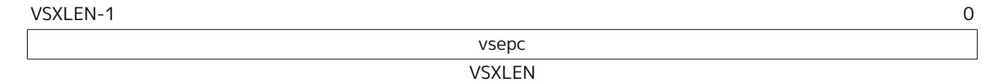

*Figure 106. Virtual supervisor exception program counter (*vsepc*).*

#### 22.2.16. Virtual Supervisor Cause (**vscause**) Register

The vscause register is a VSXLEN-bit read/write register that is VS-mode's version of supervisor register scause, formatted as shown in [Figure 107.](#page-179-7) When V=1, vscause substitutes for the usual scause, so instructions that normally read or modify scause actually access vscause instead. When V=0, vscause does not directly affect the behavior of the machine.

vscause is a WLRL register that must be able to hold the same set of values that scause can hold.

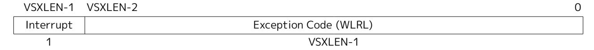

*Figure 107. Virtual supervisor cause register (*vscause*).*

#### 22.2.17. Virtual Supervisor Trap Value (**vstval**) Register

The vstval register is a VSXLEN-bit read/write register that is VS-mode's version of supervisor register stval, formatted as shown in [Figure 108.](#page-180-2) When V=1, vstval substitutes for the usual stval, so instructions that normally read or modify stval actually access vstval instead. When V=0, vstval does not directly affect the behavior of the machine.

vstval is a WARL register that must be able to hold the same set of values that stval can hold.

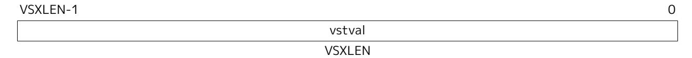

*Figure 108. Virtual supervisor trap value register (*vstval*).*

### 22.2.18. Virtual Supervisor Address Translation and Protection (**vsatp**) Register

The vsatp register is a VSXLEN-bit read/write register that is VS-mode's version of supervisor register satp, formatted as shown in [Figure 109](#page-180-3) for VSXLEN=32 and [Figure 110](#page-180-4) for VSXLEN=64. When V=1, vsatp substitutes for the usual satp, so instructions that normally read or modify satp actually access vsatp instead. vsatp controls VS-stage address translation, the first stage of two-stage translation for guest virtual addresses (see [Section 22.5](#page-187-0)).

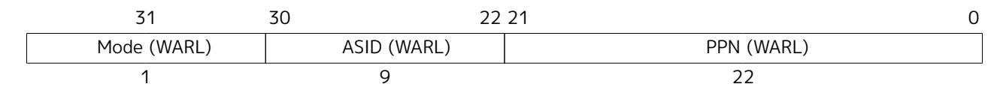

*Figure 109. Virtual supervisor address translation and protection* vsatp *register when VSXLEN=32.*

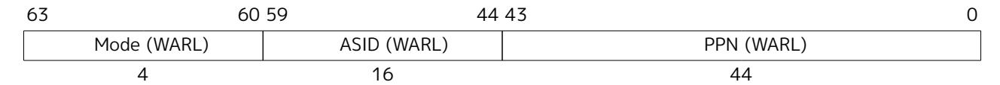

*Figure 110. Virtual supervisor address translation and protection* vsatp *register when VSXLEN=64.*

The vsatp register is considered *active* for the purposes of the address-translation algorithm *unless* the effective privilege mode is U and hstatus.HU=0. However, even when vsatp is active, VS-stage page-table entries' A bits must not be set as a result of speculative execution, unless the effective privilege mode is VS or VU.

*In particular, virtual-machine load/store (HLV, HLVX, or HSV) instructions that are mispredicted must not cause VS-stage A bits to be set.*

When V=0, a write to vsatp with an unsupported MODE value is either ignored as it is for satp, or the fields of vsatp are treated as WARL in the normal way. However, when V=1, a write to satp with an unsupported MODE value *is* ignored and no write to vsatp is effected.

When V=0, vsatp does not directly affect the behavior of the machine, unless a virtual-machine load/store (HLV, HLVX, or HSV) or the MPRV feature in the mstatus register is used to execute a load or store *as though* V=1.

#### 22.2.19. Virtual Supervisor Timer (**vstimecmp**) Register

The vstimecmp CSR is a 64-bit register and has 64-bit precision on all RV32 and RV64 systems. In RV32 only, accesses to the vstimecmp CSR access the low 32 bits, while accesses to the vstimecmph CSR access the high 32 bits of vstimecmp.

A virtual supervisor timer interrupt becomes pending, as reflected in the VSTIP bit in the hip register, whenever (time + htimedelta), truncated to 64 bits, contains a value greater than or equal to vstimecmp, treating the values as unsigned integers. If the result of this comparison changes, it is guaranteed to be reflected in VSTIP eventually, but not necessarily immediately. The interrupt remains posted until vstimecmp becomes greater than (time + htimedelta), typically as a result of writing vstimecmp. The interrupt will be taken based on the standard interrupt enable and delegation rules while V=1.

*In systems in which a supervisor execution environment (SEE) implemented by an HS-mode hypervisor provides timer facilities via an SBI function call, this SBI call will continue to support requests to schedule a timer interrupt. The SEE will simply make use of vstimecmp, changing its value as appropriate. This ensures compatibility with existing guest VS-mode software that uses this SEE facility, while new VS-mode software takes advantage of vstimecmp directly.)*

## 22.3. Hypervisor Instructions

The hypervisor extension adds virtual-machine load and store instructions and two privileged fence instructions.

#### 22.3.1. Hypervisor Virtual-Machine Load and Store Instructions

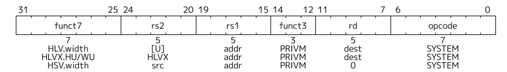

The hypervisor virtual-machine load and store instructions are valid only in M-mode or HS-mode, or in Umode when hstatus.HU=1. Each instruction performs an explicit memory access with an effective privilege mode of VS or VU. The effective privilege mode of the explicit memory access is VU when hstatus.SPVP=0, and VS when hstatus.SPVP=1. As usual for VS-mode and VU-mode, two-stage address translation is applied, and the HS-level sstatus.SUM is ignored. HS-level sstatus.MXR makes execute-only pages readable by explicit loads for both stages of address translation (VS-stage and G-stage), whereas vsstatus.MXR affects only the first translation stage (VS-stage).

For every RV32I or RV64I load instruction, LB, LBU, LH, LHU, LW, LWU, and LD, there is a corresponding virtual-machine load instruction: HLV.B, HLV.BU, HLV.H, HLV.HU, HLV.W, HLV.WU, and HLV.D. For every RV32I or RV64I store instruction, SB, SH, SW, and SD, there is a corresponding virtual-machine store instruction: HSV.B, HSV.H, HSV.W, and HSV.D. Instructions HLV.WU, HLV.D, and HSV.D are not valid for RV32, of course.

Instructions HLVX.HU and HLVX.WU are the same as HLV.HU and HLV.WU, except that *execute* permission takes the place of *read* permission during address translation. That is, the memory being read must be executable in both stages of address translation, but read permission is not required. For the supervisor physical address that results from address translation, the supervisor physical memory attributes must grant both *execute* and *read* permissions. (The *supervisor physical memory attributes* are the machine's physical memory attributes as modified by physical memory protection, [Section 3.7](#page-78-0), for supervisor level.)

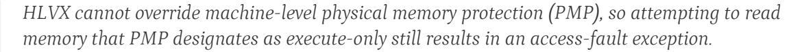

*Although HLVX instructions' explicit memory accesses require execute permissions, they still raise the same exceptions as other load instructions, rather than raising fetch exceptions instead.*

HLVX.WU is valid for RV32, even though LWU and HLV.WU are not. (For RV32, HLVX.WU can be

considered a variant of HLV.W, as sign extension is irrelevant for 32-bit values.)

The memory accesses performed by the HLVX.\* instructions are not subject to pointer masking (see [Chapter 25](#page-208-0)).

HLVX.\* *instructions, designed for emulating implicit access to fetch instructions from guest memory, perform memory accesses that are exempt from pointer masking to facilitate this emulation. For the same reason, pointer masking does not apply when MXR is set.*

Attempts to execute a virtual-machine load/store instruction (HLV, HLVX, or HSV) when V=1 cause a virtual-instruction exception. Attempts to execute one of these same instructions from U-mode when hstatus.HU=0 cause an illegal-instruction exception.

#### 22.3.2. Hypervisor Memory-Management Fence Instructions

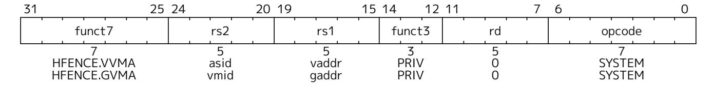

The hypervisor memory-management fence instructions, HFENCE.VVMA and HFENCE.GVMA, perform a function similar to SFENCE.VMA [\(Section 12.2.1\)](#page-136-1), except applying to the VS-level memory-management data structures controlled by CSR vsatp (HFENCE.VVMA) or the guest-physical memory-management data structures controlled by CSR hgatp (HFENCE.GVMA). Instruction SFENCE.VMA applies only to the memory-management data structures controlled by the current satp (either the HS-level satp when V=0 or vsatp when V=1).

HFENCE.VVMA is valid only in M-mode or HS-mode. Its effect is much the same as temporarily entering VS-mode and executing SFENCE.VMA. Executing an HFENCE.VVMA guarantees that any previous stores already visible to the current hart are ordered before all implicit reads by that hart done for VS-stage address translation for instructions that

- ⚫ are subsequent to the HFENCE.VVMA, and
- ⚫ execute when hgatp.VMID has the same setting as it did when HFENCE.VVMA executed.

Implicit reads need not be ordered when hgatp.VMID is different than at the time HFENCE.VVMA executed. If operand *rs1*≠x0, it specifies a single guest virtual address, and if operand *rs2*≠x0, it specifies a single guest address-space identifier (ASID).

*An HFENCE.VVMA instruction applies only to a single virtual machine, identified by the setting of* hgatp*.VMID when HFENCE.VVMA executes.*

When *rs2*≠x0, bits XLEN-1:ASIDMAX of the value held in *rs2* are reserved for future standard use. Until their use is defined by a standard extension, they should be zeroed by software and ignored by current implementations. Furthermore, if ASIDLEN < ASIDMAX, the implementation shall ignore bits ASIDMAX-1:ASIDLEN of the value held in *rs2*.

*Simpler implementations of HFENCE.VVMA can ignore the guest virtual address in rs1 and the guest ASID value in rs2, as well as* hgatp*.VMID, and always perform a global fence for the VS-level memory management of all virtual machines, or even a global fence for all memorymanagement data structures.*

Neither mstatus.TVM nor hstatus.VTVM causes HFENCE.VVMA to trap.

HFENCE.GVMA is valid only in HS-mode when mstatus.TVM=0, or in M-mode (irrespective of mstatus.TVM). Executing an HFENCE.GVMA instruction guarantees that any previous stores already visible to the current hart are ordered before all implicit reads by that hart done for G-stage address translation for instructions that follow the HFENCE.GVMA. If operand *rs1*≠x0, it specifies a single guest physical address, shifted right by 2 bits, and if operand *rs2*≠x0, it specifies a single virtual machine identifier (VMID).

> *Conceptually, an implementation might contain two address-translation caches: one that maps guest virtual addresses to guest physical addresses, and another that maps guest physical addresses to supervisor physical addresses. HFENCE.GVMA need not flush the former cache, but it must flush entries from the latter cache that match the HFENCE.GVMA's address and VMID arguments.*

*More commonly, implementations contain address-translation caches that map guest virtual addresses directly to supervisor physical addresses, removing a level of indirection. For such implementations, any entry whose guest virtual address maps to a guest physical address that matches the HFENCE.GVMA's address and VMID arguments must be flushed. Selectively flushing entries in this fashion requires tagging them with the guest physical address, which is costly, and so a common technique is to flush all entries that match the HFENCE.GVMA's VMID argument, regardless of the address argument.*

*Like for a guest physical address written to* htval *on a trap, a guest physical address specified in rs1 is shifted right by 2 bits to accommodate addresses wider than the current XLEN.*

When *rs2*≠x0, bits XLEN-1:VMIDMAX of the value held in *rs2* are reserved for future standard use. Until their use is defined by a standard extension, they should be zeroed by software and ignored by current implementations. Furthermore, if VMIDLEN < VMIDMAX, the implementation shall ignore bits VMIDMAX-1:VMIDLEN of the value held in *rs2*.

*Simpler implementations of HFENCE.GVMA can ignore the guest physical address in rs1 and the VMID value in rs2 and always perform a global fence for the guest-physical memory management of all virtual machines, or even a global fence for all memory-management data structures.*

If hgatp.MODE is changed for a given VMID, an HFENCE.GVMA with *rs1*=x0 (and *rs2* set to either x0 or the VMID) must be executed to order subsequent guest translations with the MODE change—even if the old MODE or new MODE is Bare.

Attempts to execute HFENCE.VVMA or HFENCE.GVMA when V=1 cause a virtual-instruction exception, while attempts to do the same in U-mode cause an illegal-instruction exception. Attempting to execute HFENCE.GVMA in HS-mode when mstatus.TVM=1 also causes an illegal-instruction exception.

## 22.4. Machine-Level CSRs

The hypervisor extension augments or modifies machine CSRs mstatus, mstatush, mideleg, mip, and mie, and adds CSRs mtval2 and mtinst.

#### 22.4.1. Machine Status (**mstatus** and **mstatush**) Registers

The hypervisor extension adds two fields, MPV and GVA, to the machine-level mstatus or mstatush CSR, and modifies the behavior of several existing mstatus fields. [Figure 111](#page-184-0) shows the modified mstatus register when the hypervisor extension is implemented and MXLEN=64. When MXLEN=32, the hypervisor extension adds MPV and GVA not to mstatus but to mstatush. [Figure 112](#page-184-1) shows the mstatush register when the hypervisor extension is implemented and MXLEN=32.

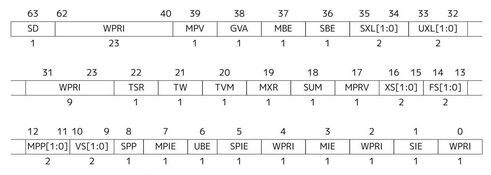

*Figure 111. Machine status (*mstatus*) register for RV64 when the hypervisor extension is implemented.*

| 31   | 8 | 7   | 6   | 5   | 4   | 3    | 0 |
|------|---|-----|-----|-----|-----|------|---|
| WPRI |   | MPV | GVA | MBE | SBE | WPRI |   |
| 24   |   | 1   | 1   | 1   | 1   | 4    |   |

*Figure 112. Additional machine status (*mstatush*) register for RV32 when the hypervisor extension is implemented. The format of* mstatus *is unchanged for RV32.*

The MPV bit (Machine Previous Virtualization Mode) is written by the implementation whenever a trap is taken into M-mode. Just as the MPP field is set to the (nominal) privilege mode at the time of the trap, the MPV bit is set to the value of the virtualization mode V at the time of the trap. When an MRET instruction is executed, the virtualization mode V is set to MPV, unless MPP=3, in which case V remains 0.

Field GVA (Guest Virtual Address) is written by the implementation whenever a trap is taken into M-mode. For any trap (breakpoint, address misaligned, access fault, page fault, or guest-page fault) that writes a guest virtual address to mtval, GVA is set to 1. For any other trap into M-mode, GVA is set to 0.

The TSR and TVM fields of mstatus affect execution only in HS-mode, not in VS-mode. The TW field affects execution in all modes except M-mode.

Setting TVM=1 prevents HS-mode from accessing hgatp or executing HFENCE.GVMA or HINVAL.GVMA, but has no effect on accesses to vsatp or instructions HFENCE.VVMA or HINVAL.VVMA.

> *TVM exists in* mstatus *to allow machine-level software to modify the address translations managed by a supervisor-level OS, usually for the purpose of inserting another stage of address translation below that controlled by the OS. The instruction traps enabled by TVM=1 permit machine level to co-opt both* satp *and* hgatp *and substitute shadow page tables that merge the OS's chosen page translations with M-level's lower-stage translations, all without the OS being aware. M-level software needs this ability not only to emulate the hypervisor extension if not already supported, but also to emulate any future RISC-V extensions that may modify or add address translation stages, perhaps, for example, to improve support for nested hypervisors, i.e., running hypervisors atop other hypervisors.*

*However, setting TVM=1 does not cause traps for accesses to* vsatp *or instructions HFENCE.VVMA or HINVAL.VVMA, or for any actions taken in VS-mode, because M-level software is not expected to need to involve itself in VS-stage address translation. For virtual machines, it should be sufficient, and in all likelihood faster as well, to leave VS-stage address translation alone and merge all other translation stages into G-stage shadow page tables controlled by* hgatp*. This assumption does place some constraints on possible future RISC-V* *extensions that current machines will be able to emulate efficiently.*

The hypervisor extension changes the behavior of the Modify Privilege field, MPRV, of mstatus. When MPRV=0, translation and protection behave as normal. When MPRV=1, explicit memory accesses are translated and protected, and endianness is applied, as though the current virtualization mode were set to MPV and the current nominal privilege mode were set to MPP. [Table 49](#page-185-2) enumerates the cases.

| MPRV | MPV | MPP | Effect                                                                                                                                                                                                                                                                                                                                     |
|------|-----|-----|--------------------------------------------------------------------------------------------------------------------------------------------------------------------------------------------------------------------------------------------------------------------------------------------------------------------------------------------|
| 0    | -   | -   | Normal access; current privilege mode applies.                                                                                                                                                                                                                                                                                             |
| 1    | 0   | 0   | U-level access with HS-level translation and protection only.                                                                                                                                                                                                                                                                              |
| 1    | 0   | 1   | HS-level access with HS-level translation and protection only.                                                                                                                                                                                                                                                                             |
| 1    | -   | 3   | M-level access with no translation.                                                                                                                                                                                                                                                                                                        |
| 1    | 1   | 0   | VU-level access with two-stage translation and protection. The HS-level MXR bit makes any executable page readable. vsstatus.MXR makes readable those pages marked executable at the VS translation stage, but only if readable at the guest-physical translation stage.                                                          |
| 1    | 1   | 1   | VS-level access with two-stage translation and protection. The HS-level MXR bit makes any executable page readable. vsstatus.MXR makes readable those pages marked executable at the VS translation stage, but only if readable at the guest-physical translation stage. vsstatus.SUM applies instead of the HS level SUM bit. |

*Table 49. Effect of MPRV on the translation and protection of explicit memory accesses.*

MPRV does not affect the virtual-machine load/store instructions, HLV, HLVX, and HSV. The explicit loads and stores of these instructions always act as though V=1 and the nominal privilege mode were hstatus.SPVP, overriding MPRV.

The mstatus register is a superset of the HS-level sstatus register but is not a superset of vsstatus.

#### 22.4.2. Machine Interrupt Delegation (**mideleg**) Register

When the hypervisor extension is implemented, bits 10, 6, and 2 of mideleg (corresponding to the standard VS-level interrupts) are each read-only one. Furthermore, if any guest external interrupts are implemented (GEILEN is nonzero), bit 12 of mideleg (corresponding to supervisor-level guest external interrupts) is also read-only one. VS-level interrupts and guest external interrupts are always delegated past M-mode to HSmode.

For bits of mideleg that are zero, the corresponding bits in hideleg, hip, and hie are read-only zeros.

### 22.4.3. Machine Interrupt (**mip** and **mie**) Registers

The hypervisor extension gives registers mip and mie additional active bits for the hypervisor-added interrupts. [Figure 113](#page-185-3) and [Figure 114](#page-186-2) show the standard portions (bits 15:0) of registers mip and mie when the hypervisor extension is implemented.

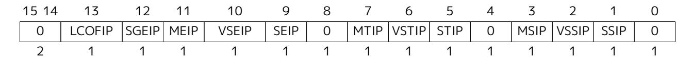

*Figure 113. Standard portion (bits 15:0) of* mip*.*

| 15 14 | 13     | 12    | 11   | 10    | 9    | 8 | 7    | 6     | 5    | 4 | 3    | 2     | 1    | 0 |
|----------|--------|-------|------|-------|------|---|------|-------|------|---|------|-------|------|---|
| 0        | LCOFIE | SGEIE | MEIE | VSEIE | SEIE | 0 | MTIE | VSTIE | STIE | 0 | MSIE | VSSIE | SSIE | 0 |
| 2        | 1      | 1     | 1    | 1     | 1    | 1 | 1    | 1     | 1    | 1 | 1    | 1     | 1    | 1 |

*Figure 114. Standard portion (bits 15:0) of* mie*.*

Bits SGEIP, VSEIP, VSTIP, and VSSIP in mip are aliases for the same bits in hypervisor CSR hip, while SGEIE, VSEIE, VSTIE, and VSSIE in mie are aliases for the same bits in hie.

## 22.4.4. Machine Second Trap Value (**mtval2**) Register

The mtval2 register is an MXLEN-bit read/write register formatted as shown in [Figure 115](#page-186-3). When a trap is taken into M-mode, mtval2 is written with additional exception-specific information, alongside mtval, to assist software in handling the trap.

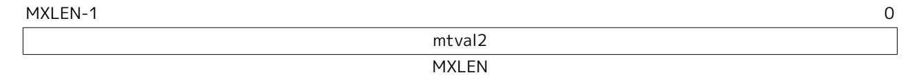

*Figure 115. Machine second trap value register (*mtval2*).*

When a guest-page-fault trap is taken into M-mode, mtval2 is written with either zero or the guest physical address that faulted, shifted right by 2 bits. For other traps, mtval2 is set to zero, but a future standard or extension may redefine mtval2's setting for other traps.

If a guest-page fault is due to an implicit memory access during first-stage (VS-stage) address translation, a guest physical address written to mtval2 is that of the implicit memory access that faulted. Additional information is provided in CSR mtinst to disambiguate such situations.

Otherwise, for misaligned loads and stores that cause guest-page faults, a nonzero guest physical address in mtval2 corresponds to the faulting portion of the access as indicated by the virtual address in mtval. For instruction guest-page faults on systems with variable-length instructions, a nonzero mtval2 corresponds to the faulting portion of the instruction as indicated by the virtual address in mtval.

mtval2 is a WARL register that must be able to hold zero and may be capable of holding only an arbitrary subset of other 2-bit-shifted guest physical addresses, if any.

The Ssdbltrap extension (See [Chapter 24\)](#page-207-0) requires the implementation of the mtval2 CSR.

#### 22.4.5. Machine Trap Instruction (**mtinst**) Register

The mtinst register is an MXLEN-bit read/write register formatted as shown in [Figure 116.](#page-186-4) When a trap is taken into M-mode, mtinst is written with a value that, if nonzero, provides information about the instruction that trapped, to assist software in handling the trap. The values that may be written to mtinst on a trap are documented in [Section 22.6.3](#page-195-0).

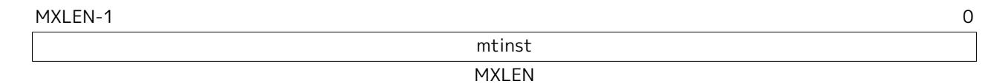

*Figure 116. Machine trap instruction (*mtinst*) register.*

mtinst is a WARL register that need only be able to hold the values that the implementation may automatically write to it on a trap.

## 22.5. Two-Stage Address Translation

Whenever the current virtualization mode V is 1, two-stage address translation and protection is in effect. For any virtual memory access, the original virtual address is converted in the first stage by VS-level address translation, as controlled by the vsatp register, into a *guest physical address*. The guest physical address is then converted in the second stage by guest physical address translation, as controlled by the hgatp register, into a supervisor physical address. The two stages are known also as VS-stage and G-stage translation. Although there is no option to disable two-stage address translation when V=1, either stage of translation can be effectively disabled by zeroing the corresponding vsatp or hgatp register.

The vsstatus field MXR, which makes execute-only pages readable by explicit loads, only overrides VSstage page protection. Setting MXR at VS-level does not override guest-physical page protections. Setting MXR at HS-level, however, overrides both VS-stage and G-stage execute-only permissions.

When V=1, memory accesses that would normally bypass address translation are subject to G-stage address translation alone. This includes memory accesses made in support of VS-stage address translation, such as reads and writes of VS-level page tables.

Machine-level physical memory protection applies to supervisor physical addresses and is in effect regardless of virtualization mode.

#### 22.5.1. Guest Physical Address Translation

The mapping of guest physical addresses to supervisor physical addresses is controlled by CSR hgatp ([Section 22.2.10](#page-175-1)).

When the address translation scheme selected by the MODE field of hgatp is Bare, guest physical addresses are equal to supervisor physical addresses without modification, and no memory protection applies in the trivial translation of guest physical addresses to supervisor physical addresses.

When hgatp.MODE specifies a translation scheme of Sv32x4, Sv39x4, Sv48x4, or Sv57x4, G-stage address translation is a variation on the usual page-based virtual address translation scheme of Sv32, Sv39, Sv48, or Sv57, respectively. In each case, the size of the incoming address is widened by 2 bits (to 34, 41, 50, or 59 bits). To accommodate the 2 extra bits, the root page table (only) is expanded by a factor of four to be 16 KiB instead of the usual 4 KiB. Matching its larger size, the root page table also must be aligned to a 16 KiB boundary instead of the usual 4 KiB page boundary. Except as noted, all other aspects of Sv32, Sv39, Sv48, or Sv57 are adopted unchanged for G-stage translation. Non-root page tables and all page table entries (PTEs) have the same formats as documented in [Section 12.3](#page-139-0), [Section 12.4,](#page-145-0) [Section 12.5,](#page-146-0) and [Section 12.6.](#page-147-0)

For Sv32x4, an incoming guest physical address is partitioned into a virtual page number (VPN) and page offset as shown in [Figure 117](#page-187-2). This partitioning is identical to that for an Sv32 virtual address as depicted in [Figure 65](#page-140-1), except with 2 more bits at the high end in VPN[1]. (Note that the fields of a partitioned guest physical address also correspond one-for-one with the structure that Sv32 assigns to a physical address, depicted in [Figure 65.](#page-140-1))

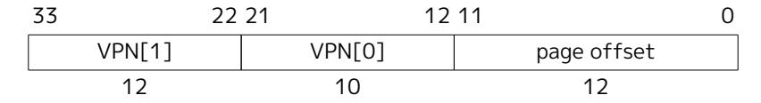

*Figure 117. Sv32x4 virtual address (guest physical address).*

For Sv39x4, an incoming guest physical address is partitioned as shown in [Figure 118.](#page-188-0) This partitioning is identical to that for an Sv39 virtual address as depicted in [Figure 68,](#page-145-2) except with 2 more bits at the high end in VPN[2]. Address bits 63:41 must all be zeros, or else a guest-page-fault exception occurs.

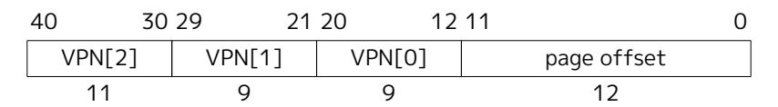

*Figure 118. Sv39x4 virtual address (guest physical address).*

For Sv48x4, an incoming guest physical address is partitioned as shown in [Figure 119.](#page-188-1) This partitioning is identical to that for an Sv48 virtual address as depicted in [Figure 71,](#page-146-2) except with 2 more bits at the high end in VPN[3]. Address bits 63:50 must all be zeros, or else a guest-page-fault exception occurs.

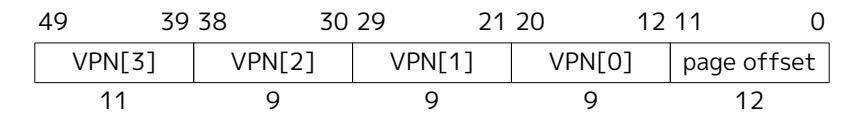

*Figure 119. Sv48x4 virtual address (guest physical address).*

For Sv57x4, an incoming guest physical address is partitioned as shown in [Figure 120](#page-188-2). This partitioning is identical to that for an Sv57 virtual address as depicted in [Figure 74](#page-147-3), except with 2 more bits at the high end in VPN[4]. Address bits 63:59 must all be zeros, or else a guest-page-fault exception occurs.

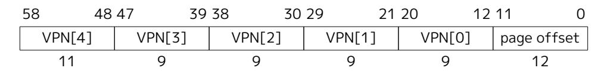

*Figure 120. Sv57x4 virtual address (guest physical address).*

*The page-based G-stage address translation scheme for RV32, Sv32x4, is defined to support a 34-bit guest physical address so that an RV32 hypervisor need not be limited in its ability to virtualize real 32-bit RISC-V machines, even those with 33-bit or 34-bit physical addresses. This may include the possibility of a machine virtualizing itself, if it happens to use 33-bit or 34-bit physical addresses. Multiplying the size and alignment of the root page table by a factor of four is the cheapest way to extend Sv32 to cover a 34-bit address. The possible wastage of 12 KiB for an unnecessarily large root page table is expected to be of negligible consequence for most (maybe all) real uses.*

*A consistent ability to virtualize machines having as much as four times the physical address space as virtual address space is believed to be of some utility also for RV64. For a machine implementing 39-bit virtual addresses (Sv39), for example, this allows the hypervisor extension to support up to a 41-bit guest physical address space without either necessitating hardware support for 48-bit virtual addresses (Sv48) or falling back to emulating the larger address space using shadow page tables.*

The conversion of an Sv32x4, Sv39x4, Sv48x4, or Sv57x4 guest physical address is accomplished with the same algorithm used for Sv32, Sv39, Sv48, or Sv57, as presented in [Section 12.3.2](#page-143-0), except that:

- ⚫ hgatp substitutes for the usual satp;
- ⚫ for the translation to begin, the effective privilege mode must be VS-mode or VU-mode;
- ⚫ when checking the U bit, the current privilege mode is always taken to be U-mode; and
- ⚫ guest-page-fault exceptions are raised instead of regular page-fault exceptions.

For G-stage address translation, all memory accesses (including those made to access data structures for VS-stage address translation) are considered to be user-level accesses, as though executed in U-mode. Access type permissions—readable, writable, or executable—are checked during G-stage translation the same as for VS-stage translation. For a memory access made to support VS-stage address translation (such as to read/write a VS-level page table), permissions and the need to set A and/or D bits at the G-stage level are checked as though for an implicit load or store, not for the original access type. However, any exception is always reported for the original access type (instruction, load, or store/AMO).

The G bit in all G-stage PTEs is currently not used. Until its use is defined by a standard extension, it should be cleared by software for forward compatibility, and must be ignored by hardware.

*G-stage address translation uses the identical format for PTEs as regular address translation, even including the U bit, due to the possibility of sharing some (or all) page tables between Gstage translation and regular HS-level address translation. Regardless of whether this usage will ever become common, we chose not to preclude it.*

#### 22.5.2. Guest-Page Faults

Guest-page-fault traps may be delegated from M-mode to HS-mode under the control of CSR medeleg, but cannot be delegated to other privilege modes. On a guest-page fault, CSR mtval or stval is written with the faulting guest virtual address as usual, and mtval2 or htval is written either with zero or with the faulting guest physical address, shifted right by 2 bits. CSR mtinst or htinst may also be written with information about the faulting instruction or other reason for the access, as explained in [Section 22.6.3](#page-195-0).

When an instruction fetch or a misaligned memory access straddles a page boundary, two different address translations are involved. When a guest-page fault occurs in such a circumstance, the faulting virtual address written to mtval/stval is the same as would be required for a regular page fault. Thus, the faulting virtual address may be a page-boundary address that is higher than the instruction's original virtual address, if the byte at that page boundary is among the accessed bytes.

When a guest-page fault is not due to an implicit memory access for VS-stage address translation, a nonzero guest physical address written to mtval2/htval shall correspond to the exact virtual address written to mtval/stval.

#### 22.5.3. Memory-Management Fences

The behavior of the SFENCE.VMA instruction is affected by the current virtualization mode V. When V=0, the virtual-address argument is an HS-level virtual address, and the ASID argument is an HS-level ASID. The instruction orders stores only to HS-level address-translation structures with subsequent HS-level address translations.

When V=1, the virtual-address argument to SFENCE.VMA is a guest virtual address within the current virtual machine, and the ASID argument is a VS-level ASID within the current virtual machine. The current virtual machine is identified by the VMID field of CSR hgatp, and the effective ASID can be considered to be the combination of this VMID with the VS-level ASID. The SFENCE.VMA instruction orders stores only to the VS-level address-translation structures with subsequent VS-stage address translations for the same virtual machine, i.e., only when hgatp.VMID is the same as when the SFENCE.VMA executed.

Hypervisor instructions HFENCE.VVMA and HFENCE.GVMA provide additional memory-management fences to complement SFENCE.VMA. These instructions are described in [Section 22.3.2.](#page-182-0)

[Section 3.7.2](#page-82-0) discusses the intersection between physical memory protection (PMP) and page-based address translation. It is noted there that, when PMP settings are modified in a manner that affects either the physical memory that holds page tables or the physical memory to which page tables point, M-mode software must synchronize the PMP settings with the virtual memory system. For HS-level address translation, this is accomplished by executing in M-mode an SFENCE.VMA instruction with *rs1*=x0 and *rs2*=x0, after the PMP CSRs are written. Synchronization with G-stage and VS-stage data structures is also needed. Executing an HFENCE.GVMA instruction with *rs1*=x0 and *rs2*=x0 suffices to flush all G-stage or VS-stage address-translation cache entries that have cached PMP settings corresponding to the final translated supervisor physical address. An HFENCE.VVMA instruction is not required.

Similarly, if the setting of the PBMTE or ADUE bits in menvcfg are changed, an HFENCE.GVMA instruction with *rs1*=x0 and *rs2*=x0 suffices to synchronize with respect to the altered interpretation of Gstage and VS-stage PTEs' PBMT and A/D bit fields, respectively.

By contrast, if the PBMTE or ADUE bits in henvcfg are changed, executing an HFENCE.VVMA with *rs1*=x0 and *rs2*=x0 suffices to synchronize with respect to the altered interpretation of VS-stage PTEs' PBMT and A/D bit fields for the currently active VMID.

*No mechanism is provided to atomically change* vsatp *and* hgatp *together. Hence, to prevent speculative execution causing one guest's VS-stage translations to be cached under another guest's VMID, world-switch code should zero* vsatp*, then swap* hgatp*, then finally write the new* vsatp *value. Similarly, if* henvcfg*.PBMTE/ADUE need be world-switched, they should be switched after zeroing* vsatp *but before writing the new* vsatp *value, obviating the need to execute an HFENCE.VVMA instruction.*

## 22.5.4. Interaction with Pointer Masking

Guest physical addresses (GPAs) are 2 bits wider than the corresponding virtual address translation modes, resulting in additional address translation schemes Sv32x4, Sv39x4, Sv48x4, and Sv57x4 for translating guest physical addresses to supervisor physical addresses. When running with virtualization in VS/VU mode with vsatp.MODE = Bare, this means that those two bits may be subject to pointer masking, depending on hgatp.MODE and senvcfg.PMM/henvcfg.PMM (for VU/VS mode). If vsatp.MODE != BARE, this issue does not apply.

*An implementation could mask those two bits on the TLB access path, but this can have a significant timing impact. Alternatively, an implementation may choose to "waste" TLB capacity by having up to 4 duplicate entries for each page. In this case, the pointer masking operation can be applied on the TLB refill path, where it is unlikely to affect timing. To support this approach, some TLB entries need to be flushed when PMLEN changes in a way that may affect these duplicate entries.*

To support implementations where (XLEN-PMLEN) can be less than the GPA width supported by hgatp.MODE, hypervisors should execute an HFENCE.GVMA with *rs1*=x0 if the henvcfg.PMM is changed from or to a value where (XLEN-PMLEN) is less than GPA width supported by the hgatp translation mode of that guest. Specifically, these cases are:

- ⚫ PMLEN=7 and hgatp.MODE=sv57x4
- ⚫ PMLEN=16 and hgatp.MODE=sv57x4
- ⚫ PMLEN=16 and hgatp.MODE=sv48x4

Implementation of an address-specific HFENCE.GVMA should either ignore the address argument, or should ignore the top masked GPA bits of entries when comparing for an address match.

## 22.6. Traps

#### 22.6.1. Trap Cause Codes

The hypervisor extension augments the trap cause encoding. [Table 50](#page-191-0) lists the possible M-mode and HSmode trap cause codes when the hypervisor extension is implemented. Codes are added for VS-level interrupts (interrupts 2, 6, 10), for supervisor-level guest external interrupts (interrupt 12), for virtualinstruction exceptions (exception 22), and for guest-page faults (exceptions 20, 21, 23). Furthermore, environment calls from VS-mode are assigned cause 10, whereas those from HS-mode or S-mode use cause 9 as usual.

*Table 50. Machine and supervisor cause register (*mcause *and* scause*) values when the hypervisor extension is implemented.*

| Interrupt | Exception Code Description |                                       |
|-----------|----------------------------|---------------------------------------|
| 1         | 0                          | Reserved                              |
| 1         | 1                          | Supervisor software interrupt         |
| 1         | 2                          | Virtual supervisor software interrupt |
| 1         | 3                          | Machine software interrupt            |
| 1         | 4                          | Reserved                              |
| 1         | 5                          | Supervisor timer interrupt            |
| 1         | 6                          | Virtual supervisor timer interrupt    |
| 1         | 7                          | Machine timer interrupt               |
| 1         | 8                          | Reserved                              |
| 1         | 9                          | Supervisor external interrupt         |
| 1         | 10                         | Virtual supervisor external interrupt |
| 1         | 11                         | Machine external interrupt            |
| 1         | 12                         | Supervisor guest external interrupt   |
| 1         | 13                         | Counter-overflow interrupt            |
| 1         | 14-15                      | Reserved                              |
| 1         | ≥16                        | Designated for platform use           |

| Interrupt | Exception Code Description |                                         |
|-----------|----------------------------|-----------------------------------------|
| 0         | 0                          | Instruction address misaligned          |
| 0         | 1                          | Instruction access fault                |
| 0         | 2                          | Illegal instruction                     |
| 0         | 3                          | Breakpoint                              |
| 0         | 4                          | Load address misaligned                 |
| 0         | 5                          | Load access fault                       |
| 0         | 6                          | Store/AMO address misaligned            |
| 0         | 7                          | Store/AMO access fault                  |
| 0         | 8                          | Environment call from U-mode or VU-mode |
| 0         | 9                          | Environment call from HS-mode           |
| 0         | 10                         | Environment call from VS-mode           |
| 0         | 11                         | Environment call from M-mode            |
| 0         | 12                         | Instruction page fault                  |
| 0         | 13                         | Load page fault                         |
| 0         | 14                         | Reserved                                |
| 0         | 15                         | Store/AMO page fault                    |
| 0         | 16                         | Double trap                             |
| 0         | 17                         | Reserved                                |
| 0         | 18                         | Software check                          |
| 0         | 19                         | Hardware error                          |
| 0         | 20                         | Instruction guest-page fault            |
| 0         | 21                         | Load guest-page fault                   |
| 0         | 22                         | Virtual instruction                     |
| 0         | 23                         | Store/AMO guest-page fault              |
| 0         | 24-31                      | Designated for custom use               |
| 0         | 32-47                      | Reserved                                |
| 0         | 48-63                      | Designated for custom use               |
| 0         | ≥64                        | Reserved                                |

HS-mode and VS-mode ECALLs use different cause values so they can be delegated separately.

When V=1, a virtual-instruction exception (code 22) is normally raised instead of an illegal-instruction exception if the attempted instruction is *HS-qualified* but is prevented from executing when V=1 either due to insufficient privilege or because the instruction is expressly disabled by a supervisor or hypervisor CSR such as scounteren or hcounteren. An instruction is *HS-qualified* if it would be valid to execute in HS-mode (for some values of the instruction's register operands), assuming fields TSR and TVM of CSR mstatus are both zero.

A special rule applies for CSR instructions that access 32-bit high-half CSRs such as cycleh and htimedeltah. When V=1 and XLEN=32, an invalid attempt to access a high-half CSR raises a virtualinstruction exception instead of an illegal-instruction exception if the same CSR instruction for the corresponding *low-half* CSR (e.g.cycle or htimedelta) is HS-qualified.

*When XLEN>32, an attempt to access a high-half CSR always raises an illegal-instruction exception.*

Specifically, a virtual-instruction exception is raised for the following cases:

⚫ in VS-mode, attempts to access a non-high-half counter CSR when the corresponding bit in hcounteren is 0 and the same bit in mcounteren is 1;

- ⚫ in VS-mode, if XLEN=32, attempts to access a high-half counter CSR when the corresponding bit in hcounteren is 0 and the same bit in mcounteren is 1;
- ⚫ in VU-mode, attempts to access a non-high-half counter CSR when the corresponding bit in either hcounteren or scounteren is 0 and the same bit in mcounteren is 1;
- ⚫ in VU-mode, if XLEN=32, attempts to access a high-half counter CSR when the corresponding bit in either hcounteren or scounteren is 0 and the same bit in mcounteren is 1;
- ⚫ in VS-mode or VU-mode, attempts to execute a hypervisor instruction (HLV, HLVX, HSV, or HFENCE);
- ⚫ in VS-mode or VU-mode, attempts to access an implemented non-high-half hypervisor CSR or VS CSR when the same access (read/write) would be allowed in HS-mode, assuming mstatus.TVM=0;
- ⚫ in VS-mode or VU-mode, if XLEN=32, attempts to access an implemented high-half hypervisor CSR or high-half VS CSR when the same access (read/write) to the CSR"s low-half partner would be allowed in HS-mode, assuming mstatus.TVM=0;
- ⚫ in VU-mode, attempts to execute WFI when mstatus.TW=0, or to execute a supervisor instruction (SRET or SFENCE);
- ⚫ in VU-mode, attempts to access an implemented non-high-half supervisor CSR when the same access (read/write) would be allowed in HS-mode, assuming mstatus.TVM=0;
- ⚫ in VU-mode, if XLEN=32, attempts to access an implemented high-half supervisor CSR when the same access to the CSR's low-half partner would be allowed in HS-mode, assuming mstatus.TVM=0;
- ⚫ in VS-mode, attempts to execute WFI when hstatus.VTW=1 and mstatus.TW=0, unless the instruction completes within an implementation-specific, bounded time;
- ⚫ in VS-mode, attempts to execute SRET when hstatus.VTSR=1; and
- ⚫ in VS-mode, attempts to execute an SFENCE.VMA or SINVAL.VMA instruction or to access satp, when hstatus.VTVM=1.

Other extensions to the RISC-V Privileged Architecture may add to the set of circumstances that cause a virtual-instruction exception when V=1.

On a virtual-instruction trap, mtval or stval is written the same as for an illegal-instruction trap.

*It is not unusual that hypervisors must emulate the instructions that raise virtual-instruction exceptions, to support nested hypervisors or for other reasons. Machine level is expected ordinarily to delegate virtual-instruction traps directly to HS-level, whereas illegal-instruction traps are likely to be processed first in M-mode before being conditionally delegated (by software) to HS-level. Consequently, virtual-instruction traps are expected typically to be handled faster than illegal-instruction traps.*

*When not emulating the trapping instruction, a hypervisor should convert a virtual-instruction trap into an illegal-instruction exception for the guest virtual machine.*

*Because TSR and TVM in* mstatus *are intended to impact only S-mode (HS-mode), they are ignored for determining exceptions in VS-mode.*

Fields FS and VS in registers sstatus and vsstatus deviate from the usual *HS-qualified* rule. If an instruction is prevented from executing because FS or VS is zero in either sstatus or vsstatus, the exception raised is always an illegal-instruction exception, never a virtual-instruction exception.

*Early implementations of the H extension treated FS and VS in* sstatus *and* vsstatus *specially this way, and the behavior has been codified to maintain compatibility for software.*

*Table 51. Synchronous exception priority when the hypervisor extension is implemented.*

| Priority |                                        | Exc.Code Description                                                                                                                                       |
|----------|----------------------------------------|------------------------------------------------------------------------------------------------------------------------------------------------------------|
| Highest  |                                        | 3 Instruction address breakpoint                                                                                                                           |
|          | 12, 20, 1                              | During instruction address translation: First encountered page fault, guest-page fault, or access fault                                                 |
|          | 1                                      | With physical address for instruction: Instruction access fault                                                                                         |
|          | 2 22 0 8, 9, 10, 11 3 3 | Illegal instruction Virtual instruction Instruction address misaligned Environment call Environment break Load/store/AMO address breakpoint |
|          | 4,6                                    | Optionally: Load/store/AMO address misaligned                                                                                                           |
|          | 13, 15, 21, 23, 5, 7                   | During address translation for an explicit memory access: First encountered page fault, guest-page fault, or access fault                               |
|          | 5, 7                                   | With physical address for an explicit memory access: Load/store/AMO access fault                                                                        |
| Lowest   | 4, 6                                   | If not higher priority: Load/store/AMO address misaligned                                                                                               |

If an instruction may raise multiple synchronous exceptions, the decreasing priority order of [Table 51](#page-194-1) indicates which exception is taken and reported in mcause or scause.

#### 22.6.2. Trap Entry

When a trap occurs in HS-mode or U-mode, it goes to M-mode, unless delegated by medeleg or mideleg, in which case it goes to HS-mode. When a trap occurs in VS-mode or VU-mode, it goes to M-mode, unless delegated by medeleg or mideleg, in which case it goes to HS-mode, unless further delegated by hedeleg or hideleg, in which case it goes to VS-mode.

When a trap is taken into M-mode, virtualization mode V gets set to 0, and fields MPV and MPP in mstatus (or mstatush) are set according to [Table 52](#page-194-2). A trap into M-mode also writes fields GVA, MPIE, and MIE in mstatus/mstatush and writes CSRs mepc, mcause, mtval, mtval2, and mtinst.

*Table 52. Value of* mstatus*/*mstatush *fields MPV and MPP after a trap into M-mode. Upon trap return, MPV is ignored when MPP=3.*

| Previous Mode | MPV | MPP |
|---------------|-----|-----|
| U-mode        | 0   | 0   |
| HS-mode       | 0   | 1   |
| M-mode        | 0   | 3   |
| VU-mode       | 1   | 0   |
| VS-mode       | 1   | 1   |

When a trap is taken into HS-mode, virtualization mode V is set to 0, and hstatus.SPV and sstatus.SPP are set according to [Table 53](#page-195-1). If V was 1 before the trap, field SPVP in hstatus is set the same as sstatus.SPP; otherwise, SPVP is left unchanged. A trap into HS-mode also writes field GVA in hstatus, fields SPIE and SIE in sstatus, and CSRs sepc, scause, stval, htval, and htinst.

*Table 53. Value of* hstatus *field SPV and* sstatus *field SPP after a trap into HS-mode.*

| Previous Mode | SPV | SPP |
|---------------|-----|-----|
| U-mode        | 0   | 0   |
| HS-mode       | 0   | 1   |
| VU-mode       | 1   | 0   |
| VS-mode       | 1   | 1   |

When a trap is taken into VS-mode, vsstatus.SPP is set according to [Table 54.](#page-195-2) Register hstatus and the HS-level sstatus are not modified, and the virtualization mode V remains 1. A trap into VS-mode also writes fields SPIE and SIE in vsstatus and writes CSRs vsepc, vscause, and vstval.

*Table 54. Value of* vsstatus *field SPP after a trap into VS-mode.*

| Previous Mode | SPP |
|---------------|-----|
| VU-mode       | 0   |
| VS-mode       | 1   |

#### 22.6.3. Transformed Instruction or Pseudoinstruction for **mtinst** or **htinst**

On any trap into M-mode or HS-mode, one of these values is written automatically into the appropriate trap instruction CSR, mtinst or htinst:

- ⚫ zero;
- ⚫ a transformation of the trapping instruction;
- ⚫ a custom value (allowed only if the trapping instruction is non-standard); or
- ⚫ a special pseudoinstruction.

Except when a pseudoinstruction value is required (described later), the value written to mtinst or htinst may always be zero, indicating that the hardware is providing no information in the register for this particular trap.

*The value written to the trap instruction CSR serves two purposes. The first is to improve the speed of instruction emulation in a trap handler, partly by allowing the handler to skip loading the trapping instruction from memory, and partly by obviating some of the work of decoding and executing the instruction. The second purpose is to supply, via pseudoinstructions, additional information about guest-page-fault exceptions caused by implicit memory accesses done for VS-stage address translation.*

*A transformation of the trapping instruction is written instead of simply a copy of the original instruction in order to minimize the burden for hardware yet still provide to a trap handler the information needed to emulate the instruction. An implementation may at any time reduce its effort by substituting zero in place of the transformed instruction.*

On an interrupt, the value written to the trap instruction register is always zero. On a synchronous exception, if a nonzero value is written, one of the following shall be true about the value:

⚫ Bit 0 is 1, and replacing bit 1 with 1 makes the value into a valid encoding of a standard instruction.

In this case, the instruction that trapped is the same kind as indicated by the register value, and the register value is the transformation of the trapping instruction, as defined later. For example, if bits 1:0 are binary 11 and the register value is the encoding of a standard LW (load word) instruction, then the trapping instruction is LW, and the register value is the transformation of the trapping LW instruction.

⚫ Bit 0 is 1, and replacing bit 1 with 1 makes the value into an instruction encoding that is explicitly designated for a custom instruction (*not* an unused reserved encoding).

This is a *custom value*. The instruction that trapped is a non-standard instruction. The interpretation of a custom value is not otherwise specified by this standard.

⚫ The value is one of the special pseudoinstructions defined later, all of which have bits 1:0 equal to 00.

These three cases exclude a large number of other possible values, such as all those having bits 1:0 equal to binary 10. A future standard or extension may define additional cases, thus allowing values that are currently excluded. Software may safely treat an unrecognized value in a trap instruction register the same as zero.

*To be forward-compatible with future revisions of this standard, software that interprets a nonzero value from* mtinst *or* htinst *must fully verify that the value conforms to one of the cases listed above. For instance, for RV64, discovering that bits 6:0 of* mtinst *are* 0000011 *and bits 14:12 are* 010 *is not sufficient to establish that the first case applies and the trapping instruction is a standard LW instruction; rather, software must also confirm that bits 63:32 of* mtinst *are all zeros. A future standard might define new values for 64-bit* mtinst *that are nonzero in bits 63:32 yet may coincidentally have in bits 31:0 the same bit patterns as standard RV64 instructions.*

*Unlike for standard instructions, there is no requirement that the instruction encoding of a custom value be of the same ``kind'' as the instruction that trapped (or even have any correlation with the trapping instruction).*

[Table 55](#page-197-0) shows the values that may be automatically written to the trap instruction register for each standard exception cause. For exceptions that prevent the fetching of an instruction, only zero or a pseudoinstruction value may be written. A custom value may be automatically written only if the instruction that traps is non-standard. A future standard or extension may permit other values to be written, chosen from the set of allowed values established earlier.

*Table 55. Values that may be automatically written to the trap instruction (*mtinst *or* htinst*) register on an exception trap.*

| Exception                      | Zero | Transformed Standard Instruction | Custom Value | Pseudoinstructio n Value |
|--------------------------------|------|----------------------------------------|--------------|-----------------------------|
| Instruction address misaligned | Yes  | No                                     | Yes          | No                          |
| Instruction access fault       | Yes  | No                                     | No           | No                          |
| Illegal instruction            | Yes  | No                                     | No           | No                          |
| Breakpoint                     | Yes  | No                                     | Yes          | No                          |
| Virtual instruction            | Yes  | No                                     | Yes          | No                          |
| Load address misaligned        | Yes  | Yes                                    | Yes          | No                          |
| Load access fault              | Yes  | Yes                                    | Yes          | No                          |
| Store/AMO address misaligned   | Yes  | Yes                                    | Yes          | No                          |
| Store/AMO access fault         | Yes  | Yes                                    | Yes          | No                          |
| Environment call               | Yes  | No                                     | Yes          | No                          |
| Instruction page fault         | Yes  | No                                     | No           | No                          |
| Load page fault                | Yes  | Yes                                    | Yes          | No                          |
| Store/AMO page fault           | Yes  | Yes                                    | Yes          | No                          |
| Instruction guest-page fault   | Yes  | No                                     | No           | Yes                         |
| Load guest-page fault          | Yes  | Yes                                    | Yes          | Yes                         |
| Store/AMO guest-page fault     | Yes  | Yes                                    | Yes          | Yes                         |

As enumerated in the table, a synchronous exception may write to the trap instruction register a standard transformation of the trapping instruction only for exceptions that arise from explicit memory accesses (from loads, stores, and AMO instructions). Accordingly, standard transformations are currently defined only for these memory-access instructions. If a synchronous trap occurs for a standard instruction for which no transformation has been defined, the trap instruction register shall be written with zero (or, under certain circumstances, with a special pseudoinstruction value).

For a standard load instruction that is not a compressed instruction and is one of LB, LBU, LH, LHU, LW, LWU, LD, FLW, FLD, FLQ, or FLH, the transformed instruction has the format shown in [Figure 121](#page-197-1).

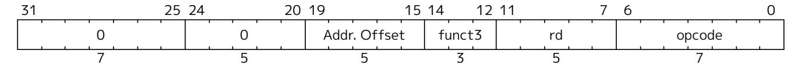

*Figure 121. Transformed load instruction (LB, LBU, LH, LHU, LW, LWU, LD, FLW, FLD, FLQ, or FLH). Fields funct3, rd, and opcode are the same as the trapping load instruction.*

For a standard store instruction that is not a compressed instruction and is one of SB, SH, SW, SD, FSW, FSD, FSQ, or FSH, the transformed instruction has the format shown in [Figure 122.](#page-197-2)

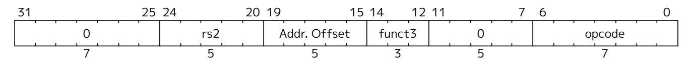

*Figure 122. Transformed store instruction (SB, SH, SW, SD, FSW, FSD, FSQ, or FSH). Fields rs2, funct3, and opcode are the same as the trapping store instruction.*

For a standard atomic instruction (load-reserved, store-conditional, or AMO instruction), the transformed instruction has the format shown in [Figure 123.](#page-198-0)

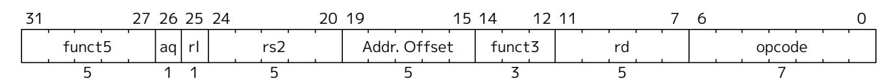

*Figure 123. Transformed atomic instruction (load-reserved, store-conditional, or AMO instruction). All fields are the same as the trapping instruction except bits 19:15, Addr. Offset.*

For a standard virtual-machine load/store instruction (HLV, HLVX, or HSV), the transformed instruction has the format shown in [Figure 124.](#page-198-1)

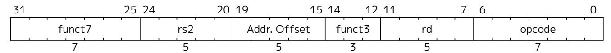

*Figure 124. Transformed virtual-machine load/store instruction (HLV, HLVX, HSV). All fields are the same as the trapping instruction except bits 19:15, Addr. Offset*

In all the transformed instructions above, the Addr. Offset field that replaces the instruction's rs1 field in bits 19:15 is the positive difference between the faulting virtual address (written to mtval or stval) and the original virtual address. This difference can be nonzero only for a misaligned memory access. Note also that, for basic loads and stores, the transformations replace the instruction's immediate offset fields with zero.

For a standard compressed instruction (16-bit size), the transformed instruction is found as follows:

- 1. Expand the compressed instruction to its 32-bit equivalent.
- 2. Transform the 32-bit equivalent instruction.
- 3. Replace bit 1 with a 0.

Bits 1:0 of a transformed standard instruction will be binary 01 if the trapping instruction is compressed and 11 if not.

*In decoding the contents of* mtinst *or* htinst*, once software has determined that the register contains the encoding of a standard basic load (LB, LBU, LH, LHU, LW, LWU, LD, FLW, FLD, FLQ, or FLH) or basic store (SB, SH, SW, SD, FSW, FSD, FSQ, or FSH), it is not necessary to confirm also that the immediate offset fields (31:25, and 24:20 or 11:7) are zeros. The knowledge that the register's value is the encoding of a basic load/store is sufficient to prove that the trapping instruction is of the same kind.*

*A future version of this standard may add information to the fields that are currently zeros. However, for backwards compatibility, any such information will be for performance purposes only and can safely be ignored.*

For guest-page faults, the trap instruction register is written with a special pseudoinstruction value if: (a) the fault is caused by an implicit memory access for VS-stage address translation, and (b) a nonzero value (the faulting guest physical address) is written to mtval2 or htval. If both conditions are met, the value written to mtinst or htinst must be taken from [Table 56;](#page-198-2) zero is not allowed.

*Table 56. Special pseudoinstruction values for guest-page faults. The RV32 values are used when VSXLEN=32, and the RV64 values when VSXLEN=64.*

| Value      | Meaning                                              |
|------------|------------------------------------------------------|
| 0x00002000 | 32-bit read for VS-stage address translation (RV32)  |
| 0x00002020 | 32-bit write for VS-stage address translation (RV32) |

| Value      | Meaning                                              |
|------------|------------------------------------------------------|
| 0x00003000 | 64-bit read for VS-stage address translation (RV64)  |
| 0x00003020 | 64-bit write for VS-stage address translation (RV64) |

The defined pseudoinstruction values are designed to correspond closely with the encodings of basic loads and stores, as illustrated by [Table 57](#page-199-1).

*Table 57. Standard instructions corresponding to the special pseudoinstructions of [Table 56](#page-198-2).*

| Encoding   | Instruction |  |  |
|------------|-------------|--|--|
| 0x00002003 | lw x0,0(x0) |  |  |
| 0x00002023 | sw x0,0(x0) |  |  |
| 0x00003003 | ld x0,0(x0) |  |  |
| 0x00003023 | sd x0,0(x0) |  |  |

A *write* pseudoinstruction (0x00002020 or 0x00003020) is used for the case that the machine is attempting automatically to update bits A and/or D in VS-level page tables. All other implicit memory accesses for VSstage address translation will be reads. If a machine never automatically updates bits A or D in VS-level page tables (leaving this to software), the *write* case will never arise. The fact that such a page table update must actually be atomic, not just a simple write, is ignored for the pseudoinstruction.

> *If the conditions that necessitate a pseudoinstruction value can ever occur for M-mode, then* mtinst *cannot be entirely read-only zero; and likewise for HS-mode and* htinst*. However, in that case, the trap instruction registers may minimally support only values 0 and* 0x00002000 *or* 0x00003000*, and possibly* 0x00002020 *or* 0x00003020*, requiring as few as one or two flipflops in hardware, per register.*

*There is no harm here in ignoring the atomicity requirement for page table updates, because a hypervisor is not expected in these circumstances to emulate an implicit memory access that fails. Rather, the hypervisor is given enough information about the faulting access to be able to make the memory accessible (e.g. by restoring a missing page of virtual memory) before resuming execution by retrying the faulting instruction.*

#### 22.6.4. Trap Return

The MRET instruction is used to return from a trap taken into M-mode. MRET first determines what the new privilege mode will be according to the values of MPP and MPV in mstatus or mstatush, as encoded in [Table 52](#page-194-2). MRET then in mstatus/mstatush sets MPV=0, MPP=0, MIE=MPIE, and MPIE=1. Lastly, MRET sets the privilege mode as previously determined, and sets pc=mepc.

The SRET instruction is used to return from a trap taken into HS-mode or VS-mode. Its behavior depends on the current virtualization mode.

When executed in M-mode or HS-mode (i.e., V=0), SRET first determines what the new privilege mode will be according to the values in hstatus.SPV and sstatus.SPP, as encoded in [Table 53](#page-195-1). SRET then sets hstatus.SPV=0, and in sstatus sets SPP=0, SIE=SPIE, and SPIE=1. Lastly, SRET sets the privilege mode as previously determined, and sets pc=sepc.

When executed in VS-mode (i.e., V=1), SRET sets the privilege mode according to [Table 54,](#page-195-2) in vsstatus sets SPP=0, SIE=SPIE, and SPIE=1, and lastly sets pc=vsepc.

If the Ssdbltrp extension is implemented, when SRET is executed in HS-mode, if the new privilege mode is

| VU, the SRET instruction sets vsstatus.SDT to 0. When executed in VS-mode, vsstatus.SDT is set to 0. |  |  |  |
|------------------------------------------------------------------------------------------------------|--|--|--|
|                                                                                                      |  |  |  |
|                                                                                                      |  |  |  |
|                                                                                                      |  |  |  |
|                                                                                                      |  |  |  |
|                                                                                                      |  |  |  |
|                                                                                                      |  |  |  |
|                                                                                                      |  |  |  |
|                                                                                                      |  |  |  |
|                                                                                                      |  |  |  |
|                                                                                                      |  |  |  |
|                                                                                                      |  |  |  |
|                                                                                                      |  |  |  |
|                                                                                                      |  |  |  |
|                                                                                                      |  |  |  |
|                                                                                                      |  |  |  |
|                                                                                                      |  |  |  |
|                                                                                                      |  |  |  |
|                                                                                                      |  |  |  |
|                                                                                                      |  |  |  |
|                                                                                                      |  |  |  |
|                                                                                                      |  |  |  |
|                                                                                                      |  |  |  |
|                                                                                                      |  |  |  |
|                                                                                                      |  |  |  |
|                                                                                                      |  |  |  |
|                                                                                                      |  |  |  |
|                                                                                                      |  |  |  |
|                                                                                                      |  |  |  |
|                                                                                                      |  |  |  |
|                                                                                                      |  |  |  |
|                                                                                                      |  |  |  |
|                                                                                                      |  |  |  |
|                                                                                                      |  |  |  |
|                                                                                                      |  |  |  |
|                                                                                                      |  |  |  |
|                                                                                                      |  |  |  |
|                                                                                                      |  |  |  |
|                                                                                                      |  |  |  |
|                                                                                                      |  |  |  |
|                                                                                                      |  |  |  |
|                                                                                                      |  |  |  |
|                                                                                                      |  |  |  |
